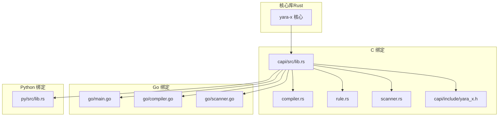
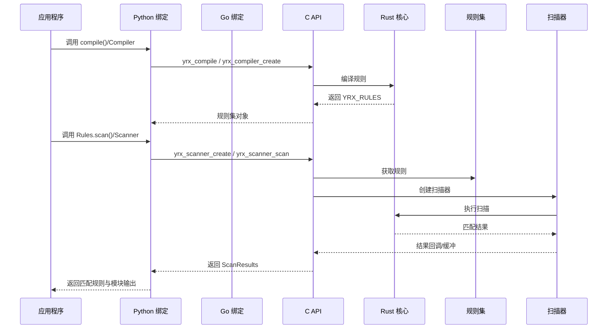
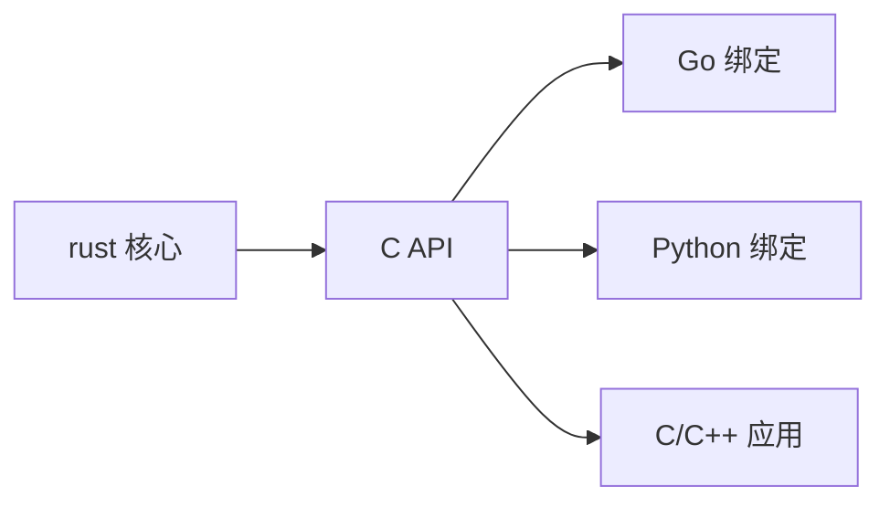

# API 参考

<cite>
**本文引用的文件**
- [yara-x/Cargo.toml](file://Cargo.toml)
- [yara-x/capi/include/yara_x.h](file://capi/include/yara_x.h)
- [yara-x/capi/src/lib.rs](file://capi/src/lib.rs)
- [yara-x/capi/src/compiler.rs](file://capi/src/compiler.rs)
- [yara-x/capi/src/rule.rs](file://capi/src/rule.rs)
- [yara-x/capi/src/scanner.rs](file://capi/src/scanner.rs)
- [yara-x/go/main.go](file://go/main.go)
- [yara-x/go/compiler.go](file://go/compiler.go)
- [yara-x/go/scanner.go](file://go/scanner.go)
- [yara-x/py/src/lib.rs](file://py/src/lib.rs)
- [yara-x/site/content/docs/api/c.md](file://site/content/docs/api/c.md)
- [yara-x/site/content/docs/api/python.md](file://site/content/docs/api/python.md)
- [yara-x/site/content/docs/api/go.md](file://site/content/docs/api/go.md)
- [yara-x/site/content/docs/api/rust.md](file://site/content/docs/api/rust.md)
</cite>

## 目录
1. [简介](#简介)
2. [项目结构](#项目结构)
3. [核心组件](#核心组件)
4. [架构总览](#架构总览)
5. [详细组件分析](#详细组件分析)
6. [依赖关系分析](#依赖关系分析)
7. [性能考虑](#性能考虑)
8. [故障排查指南](#故障排查指南)
9. [结论](#结论)
10. [附录](#附录)

## 简介
本文件为 YARA-X 的完整 API 参考文档，覆盖 Rust 原生 API、C API、Python API 与 Go API 的接口规范，包含：
- 函数签名、参数说明、返回值类型与使用示例
- 数据结构定义、枚举值说明与错误码对照
- 版本兼容性、废弃功能迁移指南与向后兼容性说明
- 架构图、序列图与流程图，帮助开发者快速理解与集成

## 项目结构
YARA-X 采用多语言绑定与统一核心库的设计：Rust 核心提供规则编译与扫描能力，C API 暴露给 C/C++ 使用，Go 与 Python 绑定分别基于 C API 实现。

**图表来源**
- [yara-x/capi/src/lib.rs:1-120](file://capi/src/lib.rs#L1-L120)
- [yara-x/capi/include/yara_x.h:1-120](file://capi/include/yara_x.h#L1-L120)
- [yara-x/go/main.go:1-120](file://go/main.go#L1-L120)
- [yara-x/py/src/lib.rs:1-120](file://py/src/lib.rs#L1-L120)

**章节来源**
- [yara-x/Cargo.toml:17-30](file://Cargo.toml#L17-L30)
- [yara-x/capi/src/lib.rs:1-120](file://capi/src/lib.rs#L1-L120)

## 核心组件
- 编译器（Compiler）：负责解析与编译 YARA 规则，支持命名空间、全局变量、模块忽略/禁用、包含目录等高级特性。
- 规则集（Rules）：编译后的规则集合，可序列化/反序列化，用于扫描。
- 扫描器（Scanner）：对内存或文件进行扫描，支持超时、全局变量动态设置、模块输出注入等。
- 元数据与模式匹配（Metadata/Pattern）：规则元数据与模式匹配结果的抽象。
- 错误处理（YRX_RESULT）：统一的错误码体系，便于跨语言一致处理。

**章节来源**
- [yara-x/capi/src/compiler.rs:1-120](file://capi/src/compiler.rs#L1-L120)
- [yara-x/capi/src/rule.rs:1-60](file://capi/src/rule.rs#L1-L60)
- [yara-x/capi/src/scanner.rs:1-120](file://capi/src/scanner.rs#L1-L120)
- [yara-x/capi/include/yara_x.h:55-120](file://capi/include/yara_x.h#L55-L120)

## 架构总览
下图展示从规则编译到扫描执行的关键调用链与数据流：

**图表来源**
- [yara-x/py/src/lib.rs:338-420](file://py/src/lib.rs#L338-L420)
- [yara-x/capi/src/lib.rs:216-269](file://capi/src/lib.rs#L216-L269)
- [yara-x/capi/src/scanner.rs:109-211](file://capi/src/scanner.rs#L109-L211)

**章节来源**
- [yara-x/site/content/docs/api/c.md:79-110](file://site/content/docs/api/c.md#L79-L110)
- [yara-x/site/content/docs/api/python.md:60-76](file://site/content/docs/api/python.md#L60-L76)

## 详细组件分析

### C API 接口规范
- 错误码（YRX_RESULT）
  - 成功：YRX_SUCCESS
  - 语法错误：YRX_SYNTAX_ERROR
  - 变量错误：YRX_VARIABLE_ERROR
  - 扫描错误：YRX_SCAN_ERROR
  - 扫描超时：YRX_SCAN_TIMEOUT
  - 参数无效：YRX_INVALID_ARGUMENT
  - 非法 UTF-8：YRX_INVALID_UTF8
  - 状态冲突：YRX_INVALID_STATE
  - 序列化错误：YRX_SERIALIZATION_ERROR
  - 无元数据：YRX_NO_METADATA
  - 功能不支持：YRX_NOT_SUPPORTED

- 编译相关
  - yrx_compile：直接编译字符串规则为 YRX_RULES
  - yrx_compiler_create/destroy：创建/销毁编译器
  - yrx_compiler_add_source/_with_origin：添加源码（可带 origin）
  - yrx_compiler_add_include_dir：添加包含目录
  - yrx_compiler_ignore_module/ban_module：忽略/禁用模块
  - yrx_compiler_new_namespace：创建命名空间
  - yrx_compiler_define_global_xxx：定义全局变量（str/bool/int/float/json）
  - yrx_compiler_errors_json/warnings_json：获取编译错误/警告（JSON）
  - yrx_compiler_build：构建规则集

- 规则集相关
  - yrx_rules_count/destroy/iter/iter_imports/serialize/deserialize：规则集操作

- 扫描相关
  - yrx_scanner_create/destroy：创建/销毁扫描器
  - yrx_scanner_on_matching_rule：设置匹配回调
  - yrx_scanner_scan/scan_file：扫描内存/文件
  - yrx_scanner_scan_block/finish：块扫描模式
  - yrx_scanner_set_timeout：设置超时
  - yrx_scanner_set_global_xxx：动态设置全局变量
  - yrx_scanner_set_module_output/set_module_data：模块输出/元数据注入
  - yrx_scanner_iter_slowest_rules/clear_profiling_data：规则性能分析（需启用特性）

- 数据结构
  - YRX_COMPILER/YRX_RULES/YRX_SCANNER：句柄类型
  - YRX_BUFFER：字节缓冲
  - YRX_MATCH：匹配位置与长度
  - YRX_METADATA_TYPE：元数据类型（I64/F64/BOOLEAN/STRING/BYTES）
  - YRX_METADATA/YRX_METADATA_VALUE/YRX_METADATA_BYTES：元数据结构
  - 回调类型：YRX_RULE_CALLBACK、YRX_METADATA_CALLBACK、YRX_PATTERN_CALLBACK、YRX_TAG_CALLBACK、YRX_IMPORT_CALLBACK、YRX_MATCH_CALLBACK、YRX_SLOWEST_RULES_CALLBACK

- 使用示例（C）
  - 参考站点文档中的示例与说明，涵盖编译、扫描、块扫描、模块输出注入等场景。

**章节来源**
- [yara-x/capi/include/yara_x.h:55-264](file://capi/include/yara_x.h#L55-L264)
- [yara-x/capi/src/compiler.rs:77-625](file://capi/src/compiler.rs#L77-L625)
- [yara-x/capi/src/rule.rs:19-223](file://capi/src/rule.rs#L19-L223)
- [yara-x/capi/src/scanner.rs:109-750](file://capi/src/scanner.rs#L109-L750)
- [yara-x/site/content/docs/api/c.md:174-800](file://site/content/docs/api/c.md#L174-L800)

### Go API 接口规范
- 编译器（Compiler）
  - NewCompiler：支持选项（Globals、IgnoreModule、BanModule、RelaxedReSyntax、ConditionOptimization、ErrorOnSlowPattern、ErrorOnSlowLoop、EnableIncludes、IncludeDir、WithFeature）
  - AddSource（支持 WithOrigin）、AddIncludeDir、DefineGlobal、NewNamespace、Errors、Warnings、Build、Destroy
- 规则集（Rules）
  - Scan、SerializeInto、DeserializeFrom、迭代器
- 扫描器（Scanner）
  - NewScanner、SetTimeout、SetGlobal、SetModuleOutput、Scan、ScanFile、SlowestRules、ClearProfilingData、Destroy
- 错误与报告
  - CompileError、Warning、Label、Span 等结构体，JSON 字段与文本报告

**章节来源**
- [yara-x/go/main.go:94-210](file://go/main.go#L94-L210)
- [yara-x/go/compiler.go:286-628](file://go/compiler.go#L286-L628)
- [yara-x/go/scanner.go:85-373](file://go/scanner.go#L85-L373)

### Python API 接口规范
- 编译入口
  - compile：快速编译规则
- 编译器（Compiler）
  - __init__（relaxed_re_syntax、error_on_slow_pattern、includes_enabled）
  - add_source（origin 可选）、add_include_dir、define_global、new_namespace、errors、warnings、build
- 规则集（Rules）
  - scan、serialize_into、deserialize_from、迭代器
- 扫描器（Scanner）
  - __init__、set_global、set_timeout、max_matches_per_pattern、console_log、scan、scan_file
- 结果与模型
  - ScanResults（matching_rules、module_outputs）
  - Rule（identifier、namespace、tags、metadata、patterns）
  - Pattern（identifier、matches）
  - Match（offset、length、xor_key）
- 异常
  - CompileError、TimeoutError、ScanError

**章节来源**
- [yara-x/py/src/lib.rs:338-420](file://py/src/lib.rs#L338-L420)
- [yara-x/py/src/lib.rs:800-1215](file://py/src/lib.rs#L800-L1215)
- [yara-x/site/content/docs/api/python.md:103-524](file://site/content/docs/api/python.md#L103-L524)

### Rust 原生 API
- 核心类型与方法
  - Compiler、Rules、Scanner、Rule、Pattern、Match、MetaValue 等
  - 支持命名空间、全局变量、模块输出、序列化、迭代器等
- 与 C API 的映射
  - Go/Python 绑定均基于 C API，保持行为一致性

**章节来源**
- [yara-x/site/content/docs/api/rust.md:21-24](file://site/content/docs/api/rust.md#L21-L24)
- [yara-x/py/src/lib.rs:872-956](file://py/src/lib.rs#L872-L956)

## 依赖关系分析
- C API 作为桥接层，向上提供稳定的 ABI；向下封装 Rust 核心逻辑。
- Go 与 Python 绑定均通过 CGO/FFI 调用 C API，实现跨语言互操作。
- 版本与兼容性
  - 工作区版本：1.9.0
  - 最低 Rust 版本：1.87.0
  - 各语言绑定与 C API 的版本需保持一致以避免 ABI 不匹配

**图表来源**
- [yara-x/Cargo.toml:1-20](file://Cargo.toml#L1-L20)
- [yara-x/capi/src/lib.rs:1-95](file://capi/src/lib.rs#L1-L95)

**章节来源**
- [yara-x/Cargo.toml:1-20](file://Cargo.toml#L1-L20)

## 性能考虑
- 条件优化：编译器可启用条件优化（C API 中对应标志），减少重复计算。
- 超时控制：扫描器支持设置超时，避免长时间阻塞。
- 块扫描限制：块扫描模式下模块与部分内置函数不可用，且跨块匹配不生效，应按需选择扫描方式。
- 模块输出复用：通过 yrx_scanner_set_module_output 复用已知输出，避免重复解析。
- 规则性能分析：在启用特性的情况下，可通过 yrx_scanner_iter_slowest_rules 获取最慢规则，指导规则优化。

**章节来源**
- [yara-x/capi/src/compiler.rs:43-75](file://capi/src/compiler.rs#L43-L75)
- [yara-x/capi/src/scanner.rs:135-155](file://capi/src/scanner.rs#L135-L155)
- [yara-x/capi/src/scanner.rs:286-321](file://capi/src/scanner.rs#L286-L321)
- [yara-x/capi/src/scanner.rs:636-694](file://capi/src/scanner.rs#L636-L694)

## 故障排查指南
- 常见错误码
  - YRX_SYNTAX_ERROR：检查规则语法与模块导入
  - YRX_VARIABLE_ERROR：检查全局变量类型与定义顺序
  - YRX_SCAN_TIMEOUT：调整超时或优化规则
  - YRX_INVALID_STATE：检查扫描模式切换（如从普通扫描切换到块扫描）
  - YRX_INVALID_UTF8：确保传入字符串为合法 UTF-8
  - YRX_NOT_SUPPORTED：确认构建时启用了所需特性（如规则性能分析）
- 获取最近错误
  - yrx_last_error 返回当前线程最近一次调用产生的错误消息指针，注意其生命周期仅限于当前线程下一次调用前。
- 平台注意事项
  - C API 在不同平台的构建与链接方式不同，参考站点文档中“构建 C 库”的步骤与示例。

**章节来源**
- [yara-x/capi/include/yara_x.h:257-264](file://capi/include/yara_x.h#L257-L264)
- [yara-x/capi/src/lib.rs:163-179](file://capi/src/lib.rs#L163-L179)
- [yara-x/site/content/docs/api/c.md:30-80](file://site/content/docs/api/c.md#L30-L80)

## 结论
本参考文档系统梳理了 YARA-X 在 C、Go、Python 与 Rust 原生环境下的接口规范，提供了数据结构、枚举与错误码的完整定义，并结合架构图与流程图帮助开发者快速集成。建议在生产环境中：
- 明确扫描模式（普通/块），合理设置超时与匹配上限
- 利用模块输出复用与规则性能分析优化扫描效率
- 严格管理全局变量与命名空间，确保跨语言绑定的一致性

## 附录

### 错误码对照表
- YRX_SUCCESS：成功
- YRX_SYNTAX_ERROR：编译语法错误
- YRX_VARIABLE_ERROR：变量定义/设置错误
- YRX_SCAN_ERROR：扫描过程错误
- YRX_SCAN_TIMEOUT：扫描超时
- YRX_INVALID_ARGUMENT：参数为空或非法
- YRX_INVALID_UTF8：UTF-8 非法
- YRX_INVALID_STATE：状态冲突（如模式切换）
- YRX_SERIALIZATION_ERROR：序列化/反序列化错误
- YRX_NO_METADATA：规则无元数据
- YRX_NOT_SUPPORTED：功能未启用或不受支持

**章节来源**
- [yara-x/capi/include/yara_x.h:55-85](file://capi/include/yara_x.h#L55-L85)

### 版本与兼容性
- 工作区版本：1.9.0
- 最低 Rust 版本：1.87.0
- 各语言绑定与 C API 的版本需保持一致，避免 ABI 不匹配导致运行时异常

**章节来源**
- [yara-x/Cargo.toml:1-20](file://Cargo.toml#L1-L20)

### 迁移与废弃说明
- 若从旧版本升级，请优先检查以下变更：
  - C API 中新增的编译器标志与回调类型
  - Go/Python 绑定中新增的选项（如 WithFeature、EnableIncludes 等）
  - 块扫描模式的限制与替代方案
- 对于不再推荐使用的内部 API（例如隐藏的编译器特性 API），请改用公开稳定接口。

**章节来源**
- [yara-x/capi/src/compiler.rs:210-277](file://capi/src/compiler.rs#L210-L277)
- [yara-x/site/content/docs/api/c.md:111-172](file://site/content/docs/api/c.md#L111-L172)