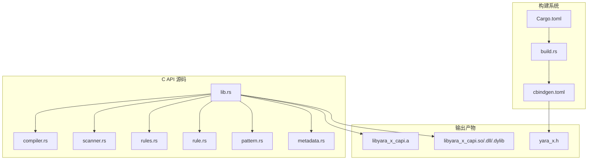
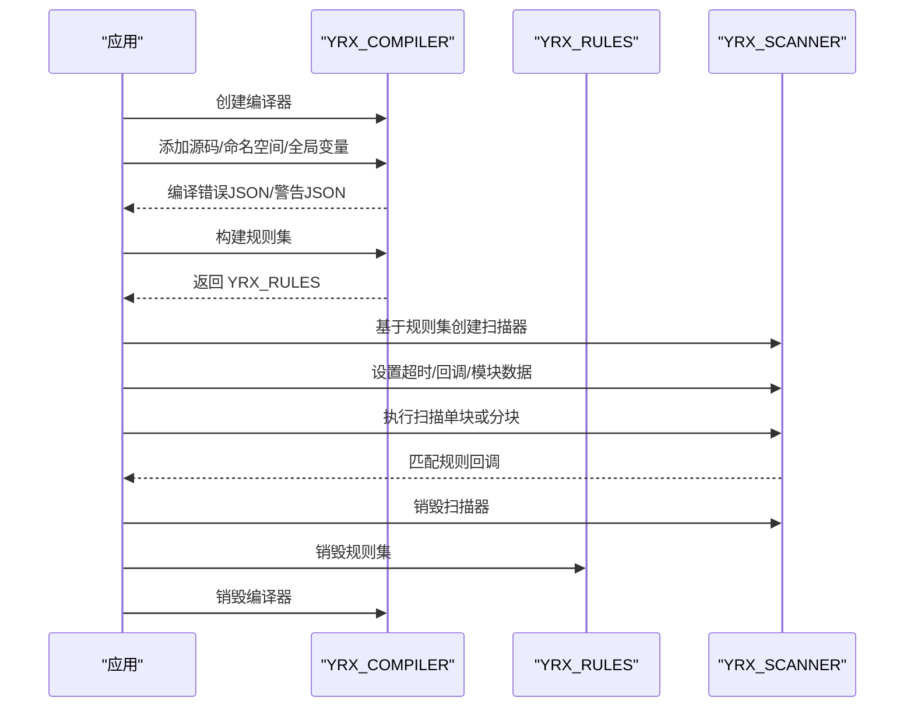
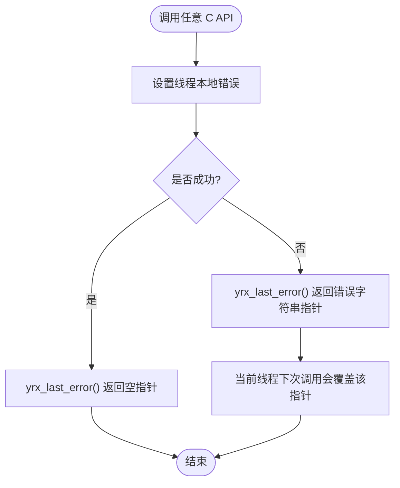
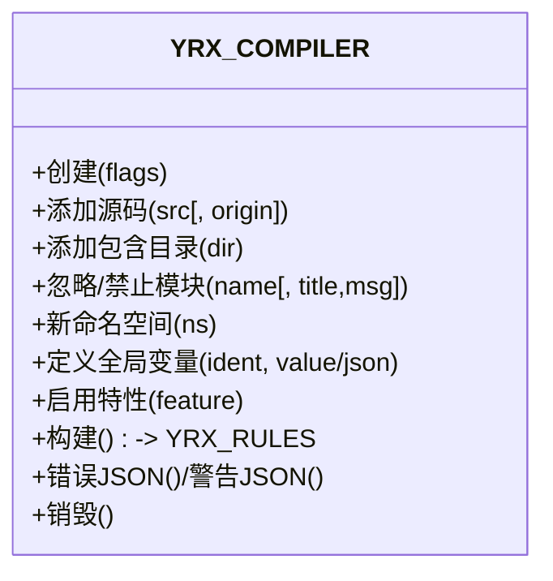
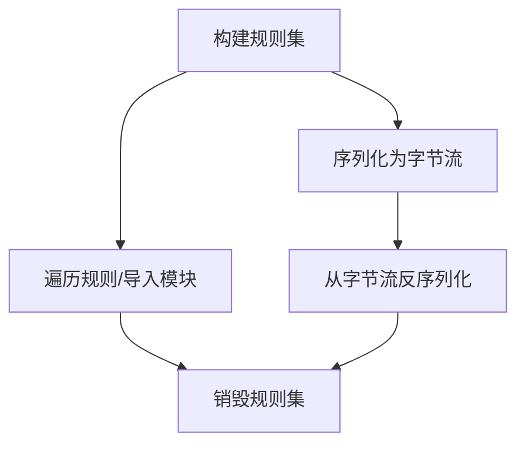
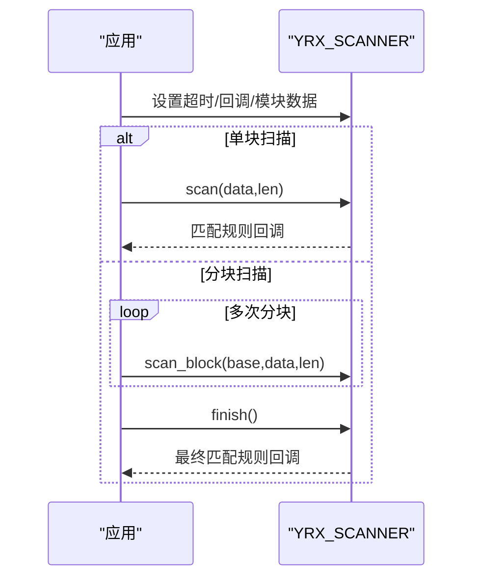
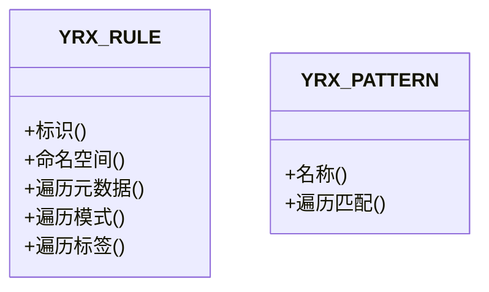
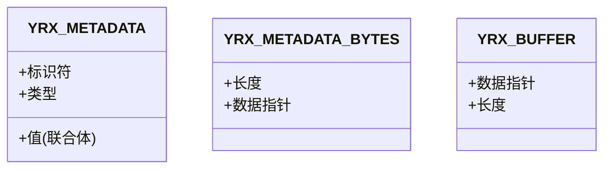
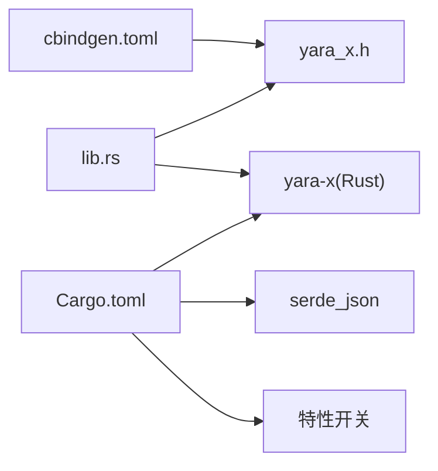

# C API

<cite>
**本文引用的文件**
- [yara_x.h](file://yara-x/capi/include/yara_x.h)
- [lib.rs](file://yara-x/capi/src/lib.rs)
- [Cargo.toml](file://yara-x/capi/Cargo.toml)
- [build.rs](file://yara-x/capi/build.rs)
- [cbindgen.toml](file://yara-x/capi/cbindgen.toml)
- [compiler.rs](file://yara-x/capi/src/compiler.rs)
- [scanner.rs](file://yara-x/capi/src/scanner.rs)
- [rules.rs](file://yara-x/capi/src/rules.rs)
- [rule.rs](file://yara-x/capi/src/rule.rs)
- [pattern.rs](file://yara-x/capi/src/pattern.rs)
- [metadata.rs](file://yara-x/capi/src/metadata.rs)
- [tests.rs](file://yara-x/capi/src/tests.rs)
- [c.md](file://yara-x/site/content/docs/api/c.md)
</cite>

## 目录
1. [简介](#简介)
2. [项目结构](#项目结构)
3. [核心组件](#核心组件)
4. [架构总览](#架构总览)
5. [详细组件分析](#详细组件分析)
6. [依赖关系分析](#依赖关系分析)
7. [性能考量](#性能考量)
8. [故障排查指南](#故障排查指南)
9. [结论](#结论)
10. [附录](#附录)

## 简介
本文件为 YARA-X 的 C 语言绑定（C API）完整参考文档，覆盖所有 C 函数接口、数据结构与常量定义，重点说明以下内容：
- 句柄类型：yara_x_compiler_t、yara_x_scanner_t 等的使用方法与生命周期
- 函数签名、参数说明、返回值含义与错误处理机制
- 内存管理规则、资源释放要求与线程安全性
- 头文件包含顺序、编译链接配置与平台兼容性
- 实际的 C 代码示例与常见使用模式

## 项目结构
C API 由 Rust 模块通过 cbindgen 自动生成 C 头文件，并以静态库与动态库形式提供。关键文件如下：
- 头文件生成：yara_x.h（自动生成）
- 构建配置：Cargo.toml、build.rs、cbindgen.toml
- C 绑定实现：lib.rs 及各模块（compiler、scanner、rules、rule、pattern、metadata）
- 示例与测试：tests.rs

**图表来源**
- [Cargo.toml:1-65](file://yara-x/capi/Cargo.toml#L1-L65)
- [build.rs:1-19](file://yara-x/capi/build.rs#L1-L19)
- [cbindgen.toml:1-115](file://yara-x/capi/cbindgen.toml#L1-L115)
- [lib.rs:1-269](file://yara-x/capi/src/lib.rs#L1-L269)

**章节来源**
- [Cargo.toml:1-65](file://yara-x/capi/Cargo.toml#L1-L65)
- [build.rs:1-19](file://yara-x/capi/build.rs#L1-L19)
- [cbindgen.toml:1-115](file://yara-x/capi/cbindgen.toml#L1-L115)
- [lib.rs:1-90](file://yara-x/capi/src/lib.rs#L1-L90)

## 核心组件
- 错误码枚举：YRX_RESULT
- 数据结构：
  - YRX_BUFFER：字节缓冲区
  - YRX_MATCH：匹配结果位置与长度
  - YRX_METADATA、YRX_METADATA_BYTES、YRX_METADATA_VALUE：元数据结构
- 句柄类型：
  - YRX_COMPILER：编译器
  - YRX_RULES：已编译规则集
  - YRX_SCANNER：扫描器
  - YRX_RULE、YRX_PATTERN：规则与模式对象

常用 API 分类：
- 编译阶段：yrx_compile、yrx_compiler_create/destroy/add_source/...、yrx_compiler_build、yrx_compiler_errors_json/warnings_json
- 规则集操作：yrx_rules_iter/iter_imports/count/serialize/deserialize
- 扫描阶段：yrx_scanner_create/destroy、yrx_scanner_scan/scan_block/finish、yrx_scanner_set_timeout、yrx_scanner_on_matching_rule
- 全局变量与模块：yrx_scanner_set_global_xxx、yrx_scanner_set_module_output、yrx_scanner_set_module_data
- 辅助：yrx_last_error、yrx_buffer_destroy

**章节来源**
- [yara_x.h:56-117](file://yara-x/capi/include/yara_x.h#L56-L117)
- [lib.rs:129-179](file://yara-x/capi/src/lib.rs#L129-L179)
- [lib.rs:190-214](file://yara-x/capi/src/lib.rs#L190-L214)

## 架构总览
C API 的调用流程通常分为“编译—序列化/复用—扫描”三步。下图展示了从源规则到扫描结果的关键交互。

**图表来源**
- [compiler.rs:77-95](file://yara-x/capi/src/compiler.rs#L77-L95)
- [rules.rs:47-61](file://yara-x/capi/src/rules.rs#L47-L61)
- [scanner.rs:109-127](file://yara-x/capi/src/scanner.rs#L109-L127)

## 详细组件分析

### 错误处理与线程本地错误消息
- yrx_last_error：返回当前线程最近一次调用产生的错误消息指针；仅在当前线程后续调用前有效；成功时不返回错误消息。
- 线程本地存储：每个线程维护独立的错误状态，避免跨线程竞争。
- 错误码：YRX_RESULT 提供统一的错误分类，涵盖语法、变量、扫描、超时、无效参数、UTF-8、状态不合法、序列化、无元数据、功能不支持等。

**图表来源**
- [lib.rs:118-179](file://yara-x/capi/src/lib.rs#L118-L179)
- [yara_x.h:257-264](file://yara-x/capi/include/yara_x.h#L257-L264)

**章节来源**
- [lib.rs:118-179](file://yara-x/capi/src/lib.rs#L118-L179)
- [yara_x.h:56-85](file://yara-x/capi/include/yara_x.h#L56-L85)
- [yara_x.h:257-264](file://yara-x/capi/include/yara_x.h#L257-L264)

### 编译器（YRX_COMPILER）
- 创建与销毁：yrx_compiler_create/yrx_compiler_destroy
- 源码添加：yrx_compiler_add_source、yrx_compiler_add_source_with_origin（可指定 origin）
- include 目录：yrx_compiler_add_include_dir
- 模块策略：yrx_compiler_ignore_module、yrx_compiler_ban_module
- 命名空间：yrx_compiler_new_namespace
- 全局变量：yrx_compiler_define_global_xxx（字符串/布尔/整数/浮点/JSON）
- 特性开关：yrx_compiler_enable_feature
- 构建：yrx_compiler_build（消费编译器并重置内部状态）
- 错误/警告 JSON：yrx_compiler_errors_json、yrx_compiler_warnings_json

**图表来源**
- [compiler.rs:10-95](file://yara-x/capi/src/compiler.rs#L10-L95)
- [compiler.rs:97-149](file://yara-x/capi/src/compiler.rs#L97-L149)
- [compiler.rs:151-180](file://yara-x/capi/src/compiler.rs#L151-L180)
- [compiler.rs:182-208](file://yara-x/capi/src/compiler.rs#L182-L208)
- [compiler.rs:279-321](file://yara-x/capi/src/compiler.rs#L279-L321)
- [compiler.rs:323-350](file://yara-x/capi/src/compiler.rs#L323-L350)
- [compiler.rs:352-463](file://yara-x/capi/src/compiler.rs#L352-L463)
- [compiler.rs:465-595](file://yara-x/capi/src/compiler.rs#L465-L595)
- [compiler.rs:597-625](file://yara-x/capi/src/compiler.rs#L597-L625)

**章节来源**
- [compiler.rs:10-95](file://yara-x/capi/src/compiler.rs#L10-L95)
- [compiler.rs:97-149](file://yara-x/capi/src/compiler.rs#L97-L149)
- [compiler.rs:151-180](file://yara-x/capi/src/compiler.rs#L151-L180)
- [compiler.rs:182-208](file://yara-x/capi/src/compiler.rs#L182-L208)
- [compiler.rs:279-321](file://yara-x/capi/src/compiler.rs#L279-L321)
- [compiler.rs:323-350](file://yara-x/capi/src/compiler.rs#L323-L350)
- [compiler.rs:352-463](file://yara-x/capi/src/compiler.rs#L352-L463)
- [compiler.rs:465-595](file://yara-x/capi/src/compiler.rs#L465-L595)
- [compiler.rs:597-625](file://yara-x/capi/src/compiler.rs#L597-L625)

### 规则集（YRX_RULES）
- 迭代规则：yrx_rules_iter
- 计数：yrx_rules_count
- 导入模块遍历：yrx_rules_iter_imports
- 序列化/反序列化：yrx_rules_serialize、yrx_rules_deserialize
- 销毁：yrx_rules_destroy

**图表来源**
- [rules.rs:47-61](file://yara-x/capi/src/rules.rs#L47-L61)
- [rules.rs:67-73](file://yara-x/capi/src/rules.rs#L67-L73)
- [rules.rs:152-166](file://yara-x/capi/src/rules.rs#L152-L166)
- [rules.rs:84-108](file://yara-x/capi/src/rules.rs#L84-L108)
- [rules.rs:113-129](file://yara-x/capi/src/rules.rs#L113-L129)

**章节来源**
- [rules.rs:47-61](file://yara-x/capi/src/rules.rs#L47-L61)
- [rules.rs:67-73](file://yara-x/capi/src/rules.rs#L67-L73)
- [rules.rs:152-166](file://yara-x/capi/src/rules.rs#L152-L166)
- [rules.rs:84-108](file://yara-x/capi/src/rules.rs#L84-L108)
- [rules.rs:113-129](file://yara-x/capi/src/rules.rs#L113-L129)

### 扫描器（YRX_SCANNER）
- 创建/销毁：yrx_scanner_create/yrx_scanner_destroy
- 超时：yrx_scanner_set_timeout
- 单块扫描：yrx_scanner_scan
- 文件扫描：yrx_scanner_scan_file
- 分块扫描：yrx_scanner_scan_block、yrx_scanner_finish
- 匹配回调：yrx_scanner_on_matching_rule
- 全局变量：yrx_scanner_set_global_xxx
- 模块数据/输出：yrx_scanner_set_module_data、yrx_scanner_set_module_output
- 性能剖析（可选特性）：yrx_scanner_iter_slowest_rules、yrx_scanner_clear_profiling_data

**图表来源**
- [scanner.rs:109-127](file://yara-x/capi/src/scanner.rs#L109-L127)
- [scanner.rs:143-211](file://yara-x/capi/src/scanner.rs#L143-L211)
- [scanner.rs:218-267](file://yara-x/capi/src/scanner.rs#L218-L267)
- [scanner.rs:322-392](file://yara-x/capi/src/scanner.rs#L322-L392)
- [scanner.rs:403-414](file://yara-x/capi/src/scanner.rs#L403-L414)
- [scanner.rs:537-634](file://yara-x/capi/src/scanner.rs#L537-L634)
- [scanner.rs:452-491](file://yara-x/capi/src/scanner.rs#L452-L491)
- [scanner.rs:507-535](file://yara-x/capi/src/scanner.rs#L507-L535)

**章节来源**
- [scanner.rs:109-127](file://yara-x/capi/src/scanner.rs#L109-L127)
- [scanner.rs:143-211](file://yara-x/capi/src/scanner.rs#L143-L211)
- [scanner.rs:218-267](file://yara-x/capi/src/scanner.rs#L218-L267)
- [scanner.rs:322-392](file://yara-x/capi/src/scanner.rs#L322-L392)
- [scanner.rs:403-414](file://yara-x/capi/src/scanner.rs#L403-L414)
- [scanner.rs:537-634](file://yara-x/capi/src/scanner.rs#L537-L634)
- [scanner.rs:452-491](file://yara-x/capi/src/scanner.rs#L452-L491)
- [scanner.rs:507-535](file://yara-x/capi/src/scanner.rs#L507-L535)

### 规则与模式（YRX_RULE、YRX_PATTERN）
- 规则标识与命名空间：yrx_rule_identifier、yrx_rule_namespace
- 元数据遍历：yrx_rule_iter_metadata
- 模式遍历：yrx_rule_iter_patterns
- 标签遍历：yrx_rule_iter_tags
- 模式匹配迭代：yrx_pattern_iter_matches

**图表来源**
- [rule.rs:19-65](file://yara-x/capi/src/rule.rs#L19-L65)
- [rule.rs:88-143](file://yara-x/capi/src/rule.rs#L88-L143)
- [rule.rs:166-182](file://yara-x/capi/src/rule.rs#L166-L182)
- [rule.rs:205-222](file://yara-x/capi/src/rule.rs#L205-L222)
- [pattern.rs:24-37](file://yara-x/capi/src/pattern.rs#L24-L37)
- [pattern.rs:60-79](file://yara-x/capi/src/pattern.rs#L60-L79)

**章节来源**
- [rule.rs:19-65](file://yara-x/capi/src/rule.rs#L19-L65)
- [rule.rs:88-143](file://yara-x/capi/src/rule.rs#L88-L143)
- [rule.rs:166-182](file://yara-x/capi/src/rule.rs#L166-L182)
- [rule.rs:205-222](file://yara-x/capi/src/rule.rs#L205-L222)
- [pattern.rs:24-37](file://yara-x/capi/src/pattern.rs#L24-L37)
- [pattern.rs:60-79](file://yara-x/capi/src/pattern.rs#L60-L79)

### 元数据与缓冲区（YRX_METADATA、YRX_BUFFER）
- 元数据类型：整型、浮点、布尔、字符串、字节
- 字节元数据：YRX_METADATA_BYTES
- 缓冲区：YRX_BUFFER（data、length），yrx_buffer_destroy 用于释放

**图表来源**
- [metadata.rs:4-52](file://yara-x/capi/src/metadata.rs#L4-L52)
- [lib.rs:190-208](file://yara-x/capi/src/lib.rs#L190-L208)

**章节来源**
- [metadata.rs:4-52](file://yara-x/capi/src/metadata.rs#L4-L52)
- [lib.rs:190-208](file://yara-x/capi/src/lib.rs#L190-L208)

## 依赖关系分析
- 构建依赖：yara-x（Rust 核心库）、serde_json（序列化/反序列化）
- 特性开关：
  - native-code-serialization：原生代码序列化（影响加载时间与跨平台性）
  - rules-profiling：性能剖析（慢规则统计）
  - magic-module：特定模块支持
- 头文件生成：cbindgen.toml 控制生成风格、包含 guard、注释等

**图表来源**
- [Cargo.toml:14-46](file://yara-x/capi/Cargo.toml#L14-L46)
- [cbindgen.toml:1-115](file://yara-x/capi/cbindgen.toml#L1-L115)
- [lib.rs:1-90](file://yara-x/capi/src/lib.rs#L1-L90)

**章节来源**
- [Cargo.toml:14-46](file://yara-x/capi/Cargo.toml#L14-L46)
- [cbindgen.toml:1-115](file://yara-x/capi/cbindgen.toml#L1-L115)
- [lib.rs:1-90](file://yara-x/capi/src/lib.rs#L1-L90)

## 性能考量
- 条件优化：编译器可启用条件优化（公共子表达式消除、循环不变量外提），提升规则执行效率。
- 原生代码序列化：启用后减少加载时的 JIT 时间，但会增大序列化体积且跨平台时会被忽略并重新生成。
- 性能剖析：在启用 rules-profiling 特性后，可通过 iter_slowest_rules 获取最慢规则，clear_profiling_data 清理数据。
- 超时控制：扫描器支持设置超时，避免长时间运行；超时后返回扫描超时错误码。

[本节为通用指导，无需具体文件分析]

## 故障排查指南
- 获取最近错误：调用 yrx_last_error，检查返回的错误消息指针是否为空。
- 常见错误码：
  - YRX_SYNTAX_ERROR：编译语法错误
  - YRX_VARIABLE_ERROR：变量定义/赋值错误
  - YRX_SCAN_ERROR：扫描过程错误
  - YRX_SCAN_TIMEOUT：扫描超时
  - YRX_INVALID_ARGUMENT：传入空指针或非法参数
  - YRX_INVALID_UTF8：UTF-8 字符串无效
  - YRX_INVALID_STATE：状态不合法（如在多块扫描模式下调用单块扫描）
  - YRX_SERIALIZATION_ERROR：序列化/反序列化错误
  - YRX_NO_METADATA：规则无元数据
  - YRX_NOT_SUPPORTED：功能未支持（如未启用特性）
- 测试参考：tests.rs 展示了错误场景与断言，可作为排错对照。

**章节来源**
- [yara_x.h:56-85](file://yara-x/capi/include/yara_x.h#L56-L85)
- [lib.rs:129-179](file://yara-x/capi/src/lib.rs#L129-L179)
- [tests.rs:394-422](file://yara-x/capi/src/tests.rs#L394-L422)

## 结论
YARA-X 的 C API 提供了从规则编译到扫描执行的完整能力，具备清晰的句柄生命周期、完善的错误处理与线程本地错误消息、灵活的模块数据注入与全局变量设置。通过特性开关可按需启用性能剖析与原生代码序列化。建议在生产环境中：
- 使用编译器的 errors/warnings JSON 获取详细诊断
- 合理设置超时与模块数据，避免不必要的重复计算
- 在启用 rules-profiling 时定期清理剖析数据

[本节为总结，无需具体文件分析]

## 附录

### API 参考速查（函数与类型）

- 编译与规则集
  - yrx_compile、yrx_compiler_create/destroy、yrx_compiler_add_source/with_origin、yrx_compiler_add_include_dir、yrx_compiler_ignore_module、yrx_compiler_ban_module、yrx_compiler_new_namespace、yrx_compiler_define_global_xxx、yrx_compiler_enable_feature、yrx_compiler_build、yrx_compiler_errors_json、yrx_compiler_warnings_json
  - yrx_rules_iter、yrx_rules_count、yrx_rules_iter_imports、yrx_rules_serialize、yrx_rules_deserialize、yrx_rules_destroy

- 扫描
  - yrx_scanner_create/destroy、yrx_scanner_set_timeout、yrx_scanner_on_matching_rule、yrx_scanner_scan、yrx_scanner_scan_file、yrx_scanner_scan_block、yrx_scanner_finish、yrx_scanner_set_global_xxx、yrx_scanner_set_module_output、yrx_scanner_set_module_data
  - yrx_scanner_iter_slowest_rules（需启用 rules-profiling）、yrx_scanner_clear_profiling_data

- 数据结构与回调
  - YRX_RESULT、YRX_BUFFER、YRX_MATCH、YRX_METADATA、YRX_METADATA_BYTES、YRX_METADATA_VALUE、YRX_RULE、YRX_PATTERN
  - 回调类型：YRX_RULE_CALLBACK、YRX_METADATA_CALLBACK、YRX_PATTERN_CALLBACK、YRX_TAG_CALLBACK、YRX_IMPORT_CALLBACK、YRX_MATCH_CALLBACK、YRX_SLOWEST_RULES_CALLBACK

- 辅助
  - yrx_last_error、yrx_buffer_destroy

**章节来源**
- [yara_x.h:257-902](file://yara-x/capi/include/yara_x.h#L257-L902)
- [lib.rs:129-214](file://yara-x/capi/src/lib.rs#L129-L214)
- [metadata.rs:4-52](file://yara-x/capi/src/metadata.rs#L4-L52)
- [rule.rs:67-222](file://yara-x/capi/src/rule.rs#L67-L222)
- [pattern.rs:39-79](file://yara-x/capi/src/pattern.rs#L39-L79)
- [scanner.rs:636-750](file://yara-x/capi/src/scanner.rs#L636-L750)

### 内存管理与资源释放
- 所有句柄对象必须在不再使用时显式销毁：yrx_compiler_destroy、yrx_rules_destroy、yrx_scanner_destroy
- 编译器在 yrx_compiler_build 后会重置内部状态，可继续使用
- YRX_BUFFER 必须通过 yrx_buffer_destroy 释放
- 规则集销毁应在所有扫描器销毁之后进行

**章节来源**
- [compiler.rs:91-95](file://yara-x/capi/src/compiler.rs#L91-L95)
- [rules.rs:168-172](file://yara-x/capi/src/rules.rs#L168-L172)
- [scanner.rs:129-133](file://yara-x/capi/src/scanner.rs#L129-L133)
- [lib.rs:210-214](file://yara-x/capi/src/lib.rs#L210-L214)

### 线程安全性
- yrx_last_error 返回的错误消息指针仅对当前线程有效，后续调用会覆盖
- 扫描器在同一时刻只能被一个线程使用；同一 YRX_RULES 可被多个扫描器并发使用，但每个扫描器自身应串行使用
- 模块数据在每次扫描后会被消费，需要在下次扫描前重新设置

**章节来源**
- [lib.rs:163-179](file://yara-x/capi/src/lib.rs#L163-L179)
- [scanner.rs:101-127](file://yara-x/capi/src/scanner.rs#L101-L127)
- [scanner.rs:507-535](file://yara-x/capi/src/scanner.rs#L507-L535)

### 头文件包含顺序与编译链接
- 包含顺序：先包含 yara_x.h，再包含标准 C 头文件（如 stdlib.h、stdint.h 等）
- 构建与安装：使用 cargo-c 安装库与头文件，Linux/macOS 可通过 pkg-config 获取编译与链接参数
- Windows：在目标目录中提供头文件、DLL、导入库与静态库

**章节来源**
- [c.md:30-78](file://yara-x/site/content/docs/api/c.md#L30-L78)
- [lib.rs:9-89](file://yara-x/capi/src/lib.rs#L9-L89)

### 平台兼容性
- 支持 Linux、macOS、Windows
- OpenSSL 依赖：根据平台选择合适的安装方式（apt、brew、vcpkg）
- 动态/静态库：同时生成静态库与动态库，便于不同部署场景

**章节来源**
- [lib.rs:9-89](file://yara-x/capi/src/lib.rs#L9-L89)

### 常见使用模式与示例路径
- 基础编译与扫描：参见测试用例中的完整流程
- 模块数据注入：演示如何为模块提供元数据以驱动规则匹配
- 分块扫描：展示非连续内存区域的增量扫描与一致性保证
- 错误处理：展示如何获取并解析编译期错误与警告

**章节来源**
- [tests.rs:111-246](file://yara-x/capi/src/tests.rs#L111-L246)
- [tests.rs:248-344](file://yara-x/capi/src/tests.rs#L248-L344)
- [tests.rs:346-391](file://yara-x/capi/src/tests.rs#L346-L391)
- [tests.rs:393-422](file://yara-x/capi/src/tests.rs#L393-L422)