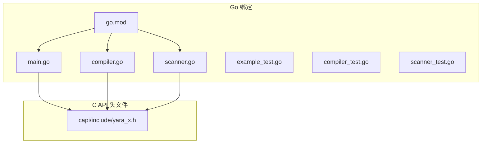
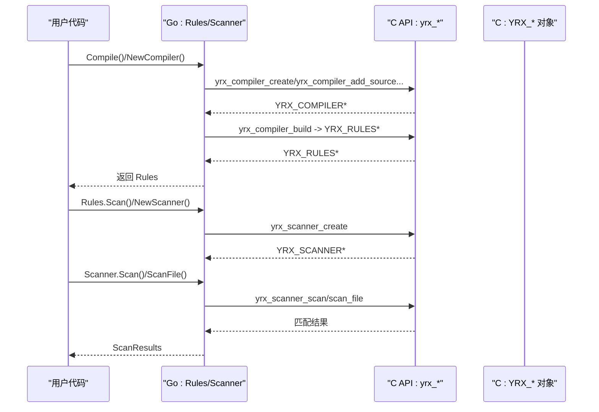
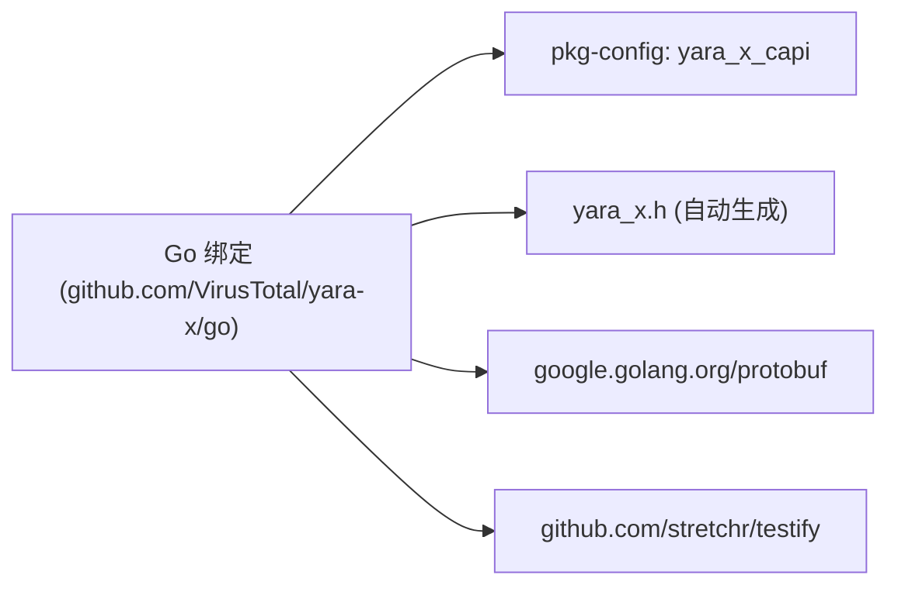

# Go API

<cite>
**本文引用的文件列表**
- [go/mod.go](file://yara-x/go/go.mod)
- [go/main.go](file://yara-x/go/main.go)
- [go/compiler.go](file://yara-x/go/compiler.go)
- [go/scanner.go](file://yara-x/go/scanner.go)
- [go/example_test.go](file://yara-x/go/example_test.go)
- [go/compiler_test.go](file://yara-x/go/compiler_test.go)
- [go/scanner_test.go](file://yara-x/go/scanner_test.go)
- [capi/include/yara_x.h](file://yara-x/capi/include/yara_x.h)
- [capi/build.rs](file://yara-x/capi/build.rs)
- [site/content/docs/api/go.md](file://yara-x/site/content/docs/api/go.md)
</cite>

## 目录
1. [简介](#简介)
2. [项目结构](#项目结构)
3. [核心组件](#核心组件)
4. [架构总览](#架构总览)
5. [详细组件分析](#详细组件分析)
6. [依赖关系分析](#依赖关系分析)
7. [性能与并发特性](#性能与并发特性)
8. [故障排查指南](#故障排查指南)
9. [结论](#结论)
10. [附录：交叉编译与构建配置](#附录交叉编译与构建配置)

## 简介
本文件为 YARA-X 的 Go 语言绑定的完整 API 参考文档。目标是帮助 Go 开发者快速理解并正确使用 Go 绑定提供的编译器（compiler）、扫描器（scanner）等能力，涵盖：
- 包与导出符号的接口规范
- 结构体与方法的签名、参数类型、返回值与错误处理
- Go 特有的使用模式、goroutine 安全性与内存管理
- 包导入路径、依赖管理与交叉编译配置
- 并发编程最佳实践与常见问题

## 项目结构
Go 绑定位于 yara-x/go 目录，核心文件如下：
- go.mod：模块定义与依赖声明
- main.go：规则集（Rules）与基础扫描流程封装
- compiler.go：编译器（Compiler）与编译选项
- scanner.go：扫描器（Scanner）与扫描结果（ScanResults）
- example_test.go：基本用法示例
- compiler_test.go、scanner_test.go：功能与行为验证

图表来源
- [go/mod.go:1-15](file://yara-x/go/go.mod#L1-L15)
- [go/main.go:1-516](file://yara-x/go/main.go#L1-L516)
- [go/compiler.go:1-628](file://yara-x/go/compiler.go#L1-L628)
- [go/scanner.go:1-373](file://yara-x/go/scanner.go#L1-L373)
- [capi/include/yara_x.h:1-903](file://yara-x/capi/include/yara_x.h#L1-L903)

章节来源
- [go/mod.go:1-15](file://yara-x/go/go.mod#L1-L15)
- [go/main.go:1-516](file://yara-x/go/main.go#L1-L516)
- [go/compiler.go:1-628](file://yara-x/go/compiler.go#L1-L628)
- [go/scanner.go:1-373](file://yara-x/go/scanner.go#L1-L373)

## 核心组件
- 包名：github.com/VirusTotal/yara-x/go
- 导出的顶层函数与类型：
  - 编译入口：Compile(...)
  - 规则序列化/反序列化：ReadFrom(...)、Rules.WriteTo(...)
  - 规则对象：Rules、Rule、Pattern、Metadata、Match
  - 扫描器：Scanner、ScanResults
  - 编译器：Compiler（含编译选项）
  - 错误模型：CompileError、Warning、Label、Footer、Span

章节来源
- [go/main.go:94-210](file://yara-x/go/main.go#L94-L210)
- [go/compiler.go:194-284](file://yara-x/go/compiler.go#L194-L284)
- [go/scanner.go:40-71](file://yara-x/go/scanner.go#L40-L71)

## 架构总览
Go 绑定通过 CGO 调用 C API（yara_x.h），在 Go 层完成对象生命周期管理、回调桥接、数据转换与错误处理。

图表来源
- [go/main.go:94-141](file://yara-x/go/main.go#L94-L141)
- [go/scanner.go:85-105](file://yara-x/go/scanner.go#L85-L105)
- [capi/include/yara_x.h:269-707](file://yara-x/capi/include/yara_x.h#L269-L707)

## 详细组件分析

### 编译器（Compiler）
Compiler 提供从 YARA 源码到已编译规则集的转换，并支持多种编译选项与全局变量定义。

- 关键类型与方法
  - 类型：Compiler
  - 方法：NewCompiler(...CompileOption)、AddSource(src, ...SourceOption)、Build()、DefineGlobal(ident, value)、Errors()、Warnings()、Destroy()
  - 编译选项：Globals(vars)、IgnoreModule(module)、BanModule(module, title, msg)、WithFeature(feature)、RelaxedReSyntax(yes)、ConditionOptimization(yes)、ErrorOnSlowPattern(yes)、ErrorOnSlowLoop(yes)、EnableIncludes(yes)、IncludeDir(path)
  - 源码选项：WithOrigin(origin)
  - 错误模型：CompileError、Warning、Label、Footer、Span

- 参数与返回值要点
  - NewCompiler 接受可变编译选项，内部将选项组合为标志位后调用 yrx_compiler_create
  - AddSource 支持指定源码 origin，用于错误报告定位
  - DefineGlobal 支持整数、布尔、字符串、浮点、JSON 编码的复合类型（数组/映射）
  - Errors()/Warnings() 返回 JSON 解析后的结构化错误/警告信息

- 错误处理
  - 编译语法错误：AddSource 返回错误字符串；可通过 yrx_last_error 获取
  - 全局变量类型不匹配或重复定义：返回 YRX_VARIABLE_ERROR
  - 其他 C API 错误：统一包装为 Go error

- 并发与线程安全
  - 在调用 C API 前后使用 runtime.LockOSThread()/UnlockOSThread() 保证同一线程上下文，避免 yrx_last_error 与 API 调用错位
  - 通过 runtime.KeepAlive 确保对象在 C 调用期间不会被 GC 回收

- 使用模式
  - 单次编译：NewCompiler + AddSource + Build
  - 快捷编译：Compile(src, ...opts) 内部创建 Compiler 并 Build
  - 全局变量：先 DefineGlobal，再 AddSource，随后 Build

章节来源
- [go/compiler.go:13-628](file://yara-x/go/compiler.go#L13-L628)
- [capi/include/yara_x.h:304-540](file://yara-x/capi/include/yara_x.h#L304-L540)

### 规则集（Rules）与规则遍历
- 类型：Rules
- 方法：Scan(data)、WriteTo(io.Writer)、Destroy()、Slice()、Count()、Imports()
- 数据访问：Rule、Pattern、Metadata、Match
- 回调桥接：yrx_rules_iter、yrx_rules_iter_imports、yrx_rule_iter_tags/metadata/patterns、yrx_pattern_iter_matches

- 序列化/反序列化
  - WriteTo 将规则序列化为二进制缓冲区，分块写入 Writer
  - ReadFrom 从 Reader 读取二进制数据并反序列化为 Rules

- 并发与生命周期
  - Rules 与 Scanner 之间存在强引用关系，防止 Rules 在 Scanner 使用期间被 GC
  - Destroy 显式释放底层资源；否则由 GC 通过 finalizer 触发

章节来源
- [go/main.go:133-250](file://yara-x/go/main.go#L133-L250)
- [go/main.go:251-516](file://yara-x/go/main.go#L251-L516)
- [capi/include/yara_x.h:622-667](file://yara-x/capi/include/yara_x.h#L622-L667)

### 扫描器（Scanner）与扫描结果（ScanResults）
- 类型：Scanner、ScanResults
- 方法：NewScanner(r)、SetTimeout(d)、SetGlobal(ident, value)、SetModuleOutput(proto.Message)、Scan([]byte)、ScanFile(path)、SlowestRules(n)、ClearProfilingData()、Destroy()
- 结果：MatchingRules() 返回匹配的 Rule 列表

- 错误处理
  - 成功：YRX_SUCCESS
  - 超时：YRX_SCAN_TIMEOUT -> ErrTimeout
  - 其他：YRX_SCAN_ERROR 或 C 错误字符串

- 性能与分析
  - SlowestRules 需要启用 rules-profiling 特性，否则返回 YRX_NOT_SUPPORTED
  - ClearProfilingData 重置累计的性能数据

- 并发与线程安全
  - 同样采用 LockOSThread/KeepAlive 保障 C API 调用一致性
  - 可在多个 goroutine 中安全复用同一 Rules 创建的多个 Scanner

章节来源
- [go/scanner.go:40-373](file://yara-x/go/scanner.go#L40-L373)
- [capi/include/yara_x.h:669-900](file://yara-x/capi/include/yara_x.h#L669-L900)

### 示例与用法
- 基本用法：Compile + Rules.Scan + 遍历 MatchingRules
- 编译器与扫描器：NewCompiler + AddSource + Build + NewScanner + Scan

章节来源
- [go/example_test.go:1-76](file://yara-x/go/example_test.go#L1-L76)

## 依赖关系分析
- Go 模块依赖
  - testify：测试断言
  - google.golang.org/protobuf：模块输出的 Protobuf 序列化
- CGO 依赖
  - 通过 pkg-config 引入 yara_x_capi（静态或动态链接）
  - 头文件由 cbindgen 自动生成

图表来源
- [go/mod.go:5-14](file://yara-x/go/go.mod#L5-L14)
- [go/main.go:4-83](file://yara-x/go/main.go#L4-L83)
- [capi/build.rs:1-19](file://yara-x/capi/build.rs#L1-L19)

章节来源
- [go/mod.go:1-15](file://yara-x/go/go.mod#L1-L15)
- [go/main.go:4-83](file://yara-x/go/main.go#L4-L83)
- [capi/build.rs:1-19](file://yara-x/capi/build.rs#L1-L19)

## 性能与并发特性
- 并发模型
  - 多个 Scanner 可并行扫描同一 Rules，适合高并发场景
  - Scanner.SetGlobal 支持运行时修改全局变量，实现“热更新”效果
- 线程绑定
  - 所有对 C API 的调用均在同一线程上下文中执行，避免跨线程错误
- 内存管理
  - 通过 runtime.KeepAlive 与 finalizer 确保对象生命周期
  - 规则序列化/反序列化采用零拷贝切片视图，减少复制开销
- 性能分析
  - SlowestRules 仅在启用 rules-profiling 特性时可用
  - ClearProfilingData 用于重置统计，便于新会话采集

章节来源
- [go/main.go:146-197](file://yara-x/go/main.go#L146-L197)
- [go/scanner.go:107-171](file://yara-x/go/scanner.go#L107-L171)
- [capi/include/yara_x.h:880-900](file://yara-x/capi/include/yara_x.h#L880-L900)

## 故障排查指南
- 常见错误类型
  - 语法错误：AddSource 返回错误字符串，可通过 CompileError/Warning 查看详细信息
  - 变量错误：DefineGlobal/SetGlobal 类型不匹配或未定义
  - 超时：Scan/ScanFile 返回 ErrTimeout
  - 不支持的功能：SlowestRules/ClearProfilingData 在未启用特性时触发 panic
- 调试建议
  - 使用 WithOrigin 指定源码来源，提升错误报告可读性
  - 使用 Errors()/Warnings() 获取结构化诊断信息
  - 在多 goroutine 场景下确保 Scanner 生命周期与 Rules 一致

章节来源
- [go/compiler.go:560-602](file://yara-x/go/compiler.go#L560-L602)
- [go/scanner.go:119-120](file://yara-x/go/scanner.go#L119-L120)
- [go/compiler_test.go:196-290](file://yara-x/go/compiler_test.go#L196-L290)
- [go/scanner_test.go:107-113](file://yara-x/go/scanner_test.go#L107-L113)

## 结论
YARA-X 的 Go 绑定提供了简洁而强大的编译与扫描能力，通过严格的线程绑定与生命周期管理，兼顾了易用性与可靠性。配合丰富的编译选项与全局变量机制，开发者可以在不同场景下灵活地构建高性能的规则引擎。

## 附录：交叉编译与构建配置
- Go 模块版本要求：Go 1.18+
- 依赖管理：go.mod 已声明直接与间接依赖
- C API 生成
  - 通过 cbindgen 自动生成 yara_x.h
  - build.rs 监听 src 与 cbindgen.toml 变更
- CGO 链接
  - 默认使用 pkg-config: yara_x_capi
  - 支持静态链接：!static_link 与 static_link 两种模式
- Go API 文档
  - 参考站点文档：Go API 文档入口

章节来源
- [go/mod.go:3-8](file://yara-x/go/go.mod#L3-L8)
- [capi/build.rs:1-19](file://yara-x/capi/build.rs#L1-L19)
- [go/main.go:4-5](file://yara-x/go/main.go#L4-L5)
- [site/content/docs/api/go.md:26-35](file://yara-x/site/content/docs/api/go.md#L26-L35)