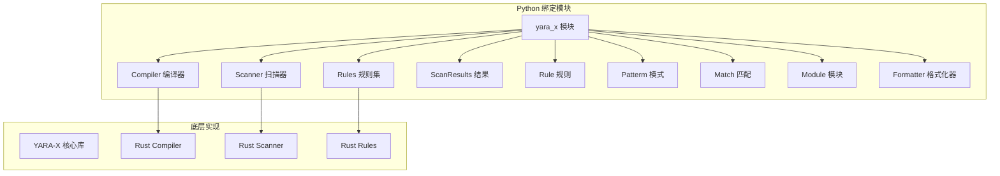
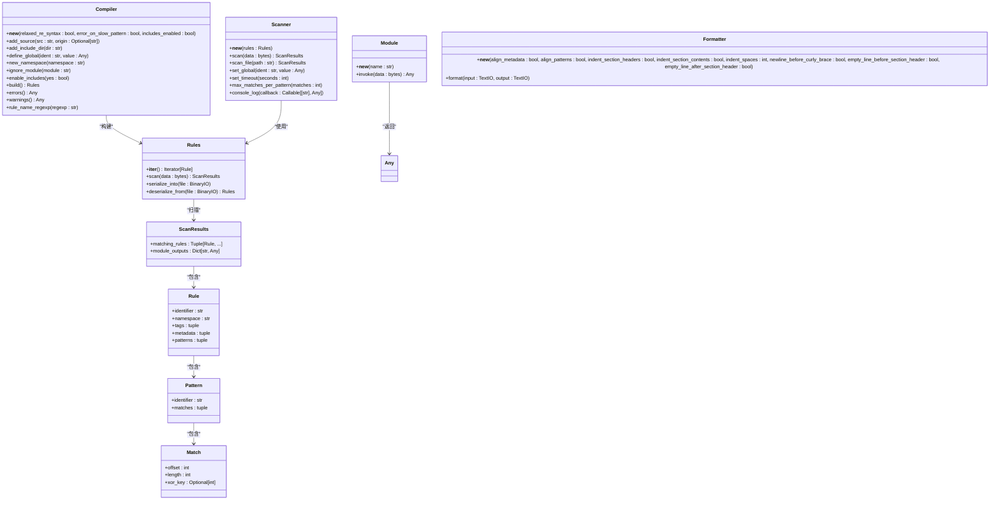
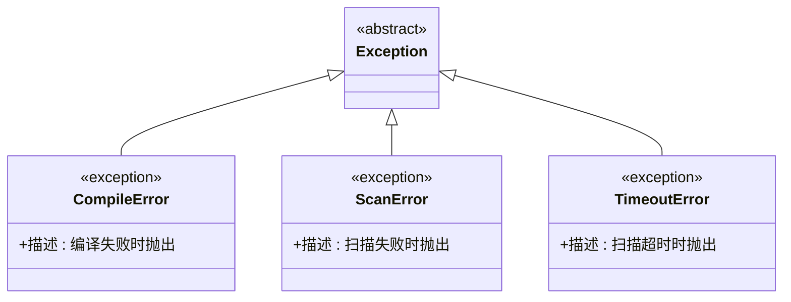
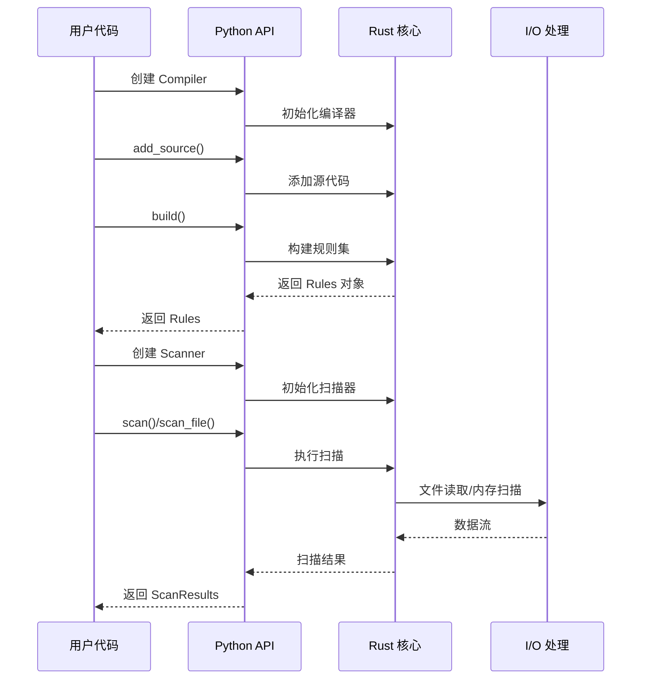
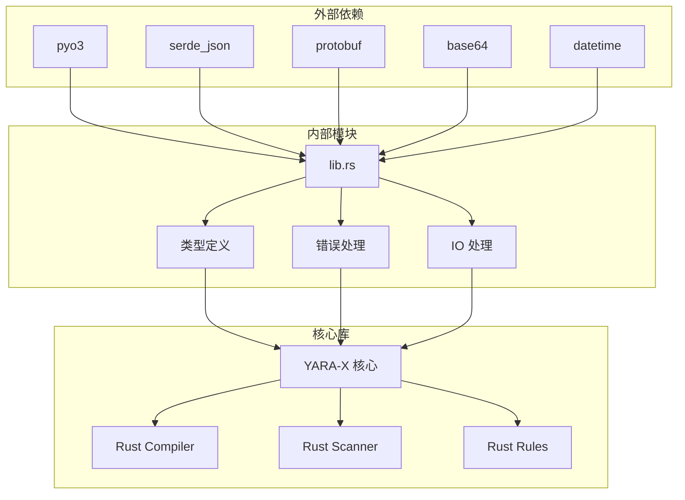

# Python API

<cite>
**本文引用的文件**
- [lib.rs](file://yara-x/py/src/lib.rs)
- [yara_x.pyi](file://yara-x/py/yara_x.pyi)
- [test_api.py](file://yara-x/py/tests/test_api.py)
- [README.md](file://yara-x/py/README.md)
- [pyproject.toml](file://yara-x/py/pyproject.toml)
- [python.md](file://yara-x/site/content/docs/api/python.md)
</cite>

## 目录
1. [简介](#简介)
2. [项目结构](#项目结构)
3. [核心组件](#核心组件)
4. [架构概览](#架构概览)
5. [详细组件分析](#详细组件分析)
6. [依赖关系分析](#依赖关系分析)
7. [性能考虑](#性能考虑)
8. [故障排除指南](#故障排除指南)
9. [结论](#结论)
10. [附录](#附录)

## 简介

YARA-X 的 Python 绑定提供了对高性能规则编译和扫描功能的完整访问。该模块支持 Python 3.9+，在 Linux、macOS 和 Windows 平台上运行。它允许用户从 Python 程序中编译 YARA 规则并扫描数据或文件。

主要特性包括：
- 高效的规则编译和扫描
- 支持命名空间隔离
- 全局变量支持
- 模块化架构（PE、ELF、LNK 等）
- 错误处理和超时控制
- 序列化和反序列化功能

## 项目结构

Python 绑定模块的核心结构如下：



**图表来源**
- [lib.rs:1197-1215](file://yara-x/py/src/lib.rs#L1197-L1215)

**章节来源**
- [lib.rs:1197-1215](file://yara-x/py/src/lib.rs#L1197-L1215)
- [pyproject.toml:1-25](file://yara-x/py/pyproject.toml#L1-25)

## 核心组件

Python 绑定模块包含以下核心组件：

### 主要类层次结构



**图表来源**
- [lib.rs:352-605](file://yara-x/py/src/lib.rs#L352-L605)
- [lib.rs:614-739](file://yara-x/py/src/lib.rs#L614-L739)
- [lib.rs:872-956](file://yara-x/py/src/lib.rs#L872-L956)
- [lib.rs:1073-1128](file://yara-x/py/src/lib.rs#L1073-L1128)

### 异常体系



**图表来源**
- [lib.rs:1161-1187](file://yara-x/py/src/lib.rs#L1161-L1187)

**章节来源**
- [lib.rs:352-605](file://yara-x/py/src/lib.rs#L352-L605)
- [lib.rs:614-739](file://yara-x/py/src/lib.rs#L614-L739)
- [lib.rs:872-956](file://yara-x/py/src/lib.rs#L872-L956)
- [lib.rs:1073-1128](file://yara-x/py/src/lib.rs#L1073-L1128)
- [lib.rs:1161-1187](file://yara-x/py/src/lib.rs#L1161-L1187)

## 架构概览

Python 绑定采用分层架构设计，将 Python 层与 Rust 核心库分离：



**图表来源**
- [lib.rs:342-348](file://yara-x/py/src/lib.rs#L342-L348)
- [lib.rs:614-739](file://yara-x/py/src/lib.rs#L614-L739)
- [lib.rs:915-925](file://yara-x/py/src/lib.rs#L915-L925)

## 详细组件分析

### Compiler 类

Compiler 类是规则编译的核心组件，负责将 YARA 源代码转换为可执行的规则集。

#### 构造函数参数

| 参数名 | 类型 | 默认值 | 描述 |
|--------|------|--------|------|
| relaxed_re_syntax | bool | False | 是否启用宽松的正则表达式语法检查 |
| error_on_slow_pattern | bool | False | 是否将慢速模式标记为错误而非警告 |
| includes_enabled | bool | True | 是否启用 include 指令 |

#### 主要方法

##### add_source 方法
- **功能**: 添加 YARA 源代码到编译器
- **参数**:
  - `src`: str - YARA 规则源代码
  - `origin`: Optional[str] - 源代码来源标识
- **返回**: None
- **异常**: CompileError - 当源代码无效时

##### define_global 方法
- **功能**: 定义全局变量及其初始值
- **参数**:
  - `ident`: str - 变量标识符
  - `value`: Any - 变量值（支持 bool、str、bytes、int、float、dict）
- **返回**: None
- **异常**: TypeError - 当值类型不受支持时

##### build 方法
- **功能**: 构建已添加的所有规则
- **返回**: Rules - 编译后的规则集
- **行为**: 构建后编译器重置为空状态

**章节来源**
- [lib.rs:392-405](file://yara-x/py/src/lib.rs#L392-L405)
- [lib.rs:438-454](file://yara-x/py/src/lib.rs#L438-L454)
- [lib.rs:495-522](file://yara-x/py/src/lib.rs#L495-L522)
- [lib.rs:565-574](file://yara-x/py/src/lib.rs#L565-L574)

### Scanner 类

Scanner 类用于使用已编译的规则扫描数据或文件。

#### 构造函数
- **参数**: `rules`: Rules - 要使用的规则集
- **功能**: 创建新的扫描器实例

#### 核心扫描方法

##### scan 方法
- **功能**: 扫描内存中的数据
- **参数**: `data`: bytes - 要扫描的数据
- **返回**: ScanResults - 扫描结果
- **异常**: ScanError、TimeoutError

##### scan_file 方法
- **功能**: 扫描指定路径的文件
- **参数**: `path`: str - 文件路径
- **返回**: ScanResults - 扫描结果
- **异常**: ScanError、TimeoutError

#### 配置方法

##### set_timeout 方法
- **功能**: 设置每次扫描的超时时间
- **参数**: `seconds`: int - 超时秒数
- **行为**: 超时后扫描操作会中断

##### set_global 方法
- **功能**: 设置全局变量的值
- **参数**:
  - `ident`: str - 变量标识符
  - `value`: Any - 新的变量值
- **异常**: TypeError - 当值类型不受支持时

**章节来源**
- [lib.rs:631-641](file://yara-x/py/src/lib.rs#L631-L641)
- [lib.rs:721-738](file://yara-x/py/src/lib.rs#L721-L738)
- [lib.rs:690-692](file://yara-x/py/src/lib.rs#L690-L692)
- [lib.rs:658-685](file://yara-x/py/src/lib.rs#L658-L685)

### Rules 类

Rules 类表示编译后的规则集，提供迭代和扫描功能。

#### 迭代支持
- **实现**: 支持 Python 迭代协议
- **行为**: 返回每个匹配的 Rule 对象

#### 序列化方法

##### serialize_into 方法
- **功能**: 将规则序列化到文件对象
- **参数**: `file`: BinaryIO - 输出文件对象

##### deserialize_from 方法
- **功能**: 从文件对象反序列化规则
- **参数**: `file`: BinaryIO - 输入文件对象
- **返回**: Rules - 反序列化的规则集

**章节来源**
- [lib.rs:944-956](file://yara-x/py/src/lib.rs#L944-L956)
- [lib.rs:928-942](file://yara-x/py/src/lib.rs#L928-L942)

### ScanResults 类

ScanResults 类封装扫描操作的结果。

#### 属性

##### matching_rules 属性
- **类型**: Tuple[Rule, ...]
- **描述**: 所有匹配的规则列表

##### module_outputs 属性
- **类型**: Dict[str, Any]
- **描述**: 模块输出的字典，键为模块名称，值为对应模块的输出

**章节来源**
- [lib.rs:742-767](file://yara-x/py/src/lib.rs#L742-L767)

### Rule、Pattern 和 Match 类

这些类提供详细的扫描结果信息：

#### Rule 类
- **identifier**: 规则标识符
- **namespace**: 规则命名空间
- **tags**: 规则标签元组
- **metadata**: 元数据对元组
- **patterns**: 模式列表

#### Pattern 类
- **identifier**: 模式标识符（如 $a）
- **matches**: 匹配列表

#### Match 类
- **offset**: 匹配在数据中的偏移量
- **length**: 匹配长度
- **xor_key**: XOR 密钥（如果模式使用了 xor 修饰符）

**章节来源**
- [lib.rs:770-811](file://yara-x/py/src/lib.rs#L770-L811)
- [lib.rs:814-833](file://yara-x/py/src/lib.rs#L814-L833)
- [lib.rs:836-867](file://yara-x/py/src/lib.rs#L836-L867)

### Module 类

Module 类提供对 YARA-X 模块的直接访问。

#### 支持的模块
- PE（Windows 可执行文件）
- ELF（Unix 可执行文件）
- LNK（Windows 快捷方式）
- Dotnet（.NET 模块）
- Macho（macOS 可执行文件）

#### invoke 方法
- **功能**: 解析二进制数据并提取模块元数据
- **参数**: `data`: bytes - 要解析的二进制数据
- **返回**: Any - 模块输出的字典表示

**章节来源**
- [lib.rs:268-327](file://yara-x/py/src/lib.rs#L268-L327)

### Formatter 类

Formatter 类提供 YARA 规则格式化功能。

#### 构造函数参数

| 参数名 | 类型 | 默认值 | 描述 |
|--------|------|--------|------|
| align_metadata | bool | True | 是否对齐元数据定义中的等号 |
| align_patterns | bool | True | 是否对齐模式定义中的等号 |
| indent_section_headers | bool | True | 是否缩进部分标题 |
| indent_section_contents | bool | True | 是否缩进部分内容 |
| indent_spaces | int | 2 | 缩进空格数（0 表示使用制表符） |
| newline_before_curly_brace | bool | False | 是否在大括号前插入换行 |
| empty_line_before_section_header | bool | True | 是否在部分标题前插入空行 |
| empty_line_after_section_header | bool | False | 是否在部分标题后插入空行 |

#### format 方法
- **功能**: 格式化 YARA 规则
- **参数**:
  - `input`: TextIO - 输入文本流
  - `output`: TextIO - 输出文本流

**章节来源**
- [lib.rs:74-141](file://yara-x/py/src/lib.rs#L74-L141)

## 依赖关系分析

Python 绑定模块的依赖关系图：



**图表来源**
- [lib.rs:31-37](file://yara-x/py/src/lib.rs#L31-L37)
- [lib.rs:41](file://yara-x/py/src/lib.rs#L41)

**章节来源**
- [lib.rs:31-37](file://yara-x/py/src/lib.rs#L31-L37)
- [lib.rs:41](file://yara-x/py/src/lib.rs#L41)

## 性能考虑

### 内存管理
- 使用 Pin<Box<PinnedRules>> 确保规则对象在内存中的稳定性
- 通过引用计数机制保持 Rules 对象的生命周期

### I/O 处理
- 支持 TextIO 和 BinaryIO 接口
- 自动检测输入流类型（文本或二进制）
- 提供高效的缓冲读写机制

### 并发支持
- Scanner 实例不共享状态，允许多个扫描器并发使用
- 每个 Scanner 维护独立的全局变量状态

### 资源清理
- 自动处理 Rust 对象的内存释放
- 支持 Python 的垃圾回收机制

## 故障排除指南

### 常见异常处理

#### CompileError
- **触发场景**: 规则编译失败
- **解决方案**: 检查规则语法，查看 `compiler.errors()` 获取详细信息

#### ScanError  
- **触发场景**: 扫描过程中发生错误
- **解决方案**: 检查数据格式和权限

#### TimeoutError
- **触发场景**: 扫描超时
- **解决方案**: 使用 `scanner.set_timeout()` 设置更长的超时时间

### 调试技巧

#### 获取编译错误详情
```python
compiler = yara_x.Compiler()
try:
    compiler.add_source('invalid rule')
except yara_x.CompileError:
    errors = compiler.errors()
    for error in errors:
        print(f"错误类型: {error['type']}")
        print(f"错误代码: {error['code']}")
        print(f"错误信息: {error['title']}")
```

#### 检查模块支持
```python
supported_modules = yara_x.module_names()
print("支持的模块:", supported_modules)
```

**章节来源**
- [lib.rs:1182-1187](file://yara-x/py/src/lib.rs#L1182-L1187)
- [test_api.py:266-297](file://yara-x/py/tests/test_api.py#L266-L297)

## 结论

YARA-X 的 Python 绑定提供了强大而灵活的规则编译和扫描功能。其设计特点包括：

1. **高性能**: 基于 Rust 核心库，提供优秀的性能表现
2. **易用性**: 清晰的 Pythonic API 设计
3. **完整性**: 支持所有主要的 YARA 功能和模块
4. **可靠性**: 完善的错误处理和异常系统
5. **扩展性**: 支持自定义模块和配置选项

该模块适合各种规模的应用程序，从简单的规则测试到复杂的恶意软件分析工具。

## 附录

### 安装和基本使用

#### 安装
```bash
pip install yara-x
```

#### 基本使用示例
```python
import yara_x

# 简单规则编译和扫描
rules = yara_x.compile('''
  rule test { 
    strings: 
      $a = "foobar" 
    condition: 
      $a
  }''')

results = rules.scan(b"foobar")
print(results.matching_rules[0].identifier)
```

### 类型提示文件使用

Python 绑定包含完整的类型提示文件 (`yara_x.pyi`)，提供以下功能：

1. **IDE 支持**: 在 VS Code、PyCharm 等编辑器中提供智能提示
2. **静态分析**: 支持 mypy 等静态类型检查工具
3. **文档生成**: 自动生成 API 文档

#### IDE 集成步骤
1. 确保安装了 `yara-x` 包
2. 在 IDE 中启用 Python 解释器
3. 类型提示文件会自动被识别和使用

### 最佳实践

#### 规则编译最佳实践
1. 使用 Compiler 类进行复杂规则编译
2. 合理设置全局变量
3. 利用命名空间隔离规则
4. 检查编译警告以优化规则

#### 扫描最佳实践
1. 为长时间扫描设置超时
2. 使用适当的匹配限制
3. 处理模块输出数据
4. 实现适当的错误处理

#### 性能优化建议
1. 复用 Scanner 实例进行多次扫描
2. 使用规则序列化减少编译开销
3. 合理配置模块功能
4. 优化正则表达式模式

**章节来源**
- [README.md:11-31](file://yara-x/py/README.md#L11-L31)
- [python.md:27-58](file://yara-x/site/content/docs/api/python.md#L27-L58)
- [yara_x.pyi:1-437](file://yara-x/py/yara_x.pyi#L1-L437)