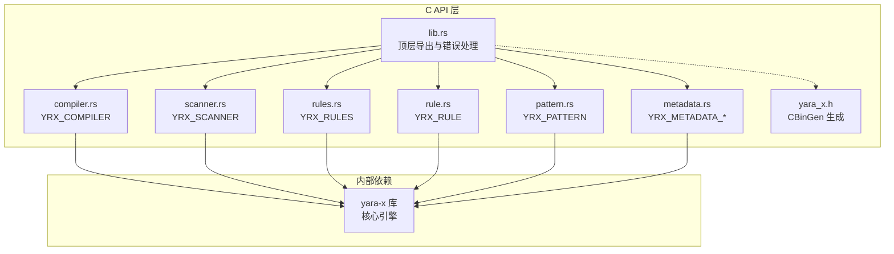
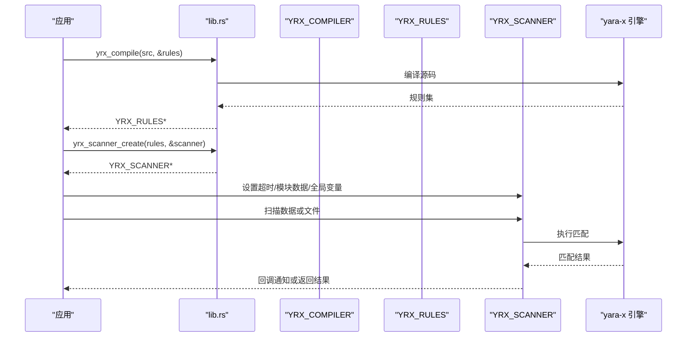
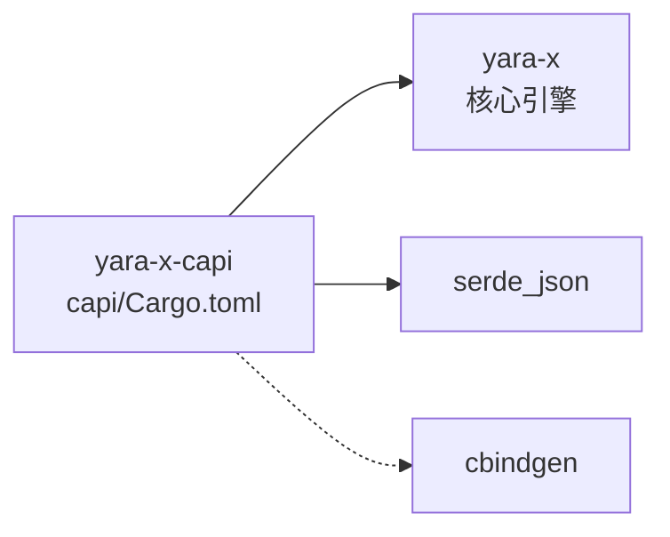

# Rust API

<cite>
**本文引用的文件**
- [capi/src/lib.rs](file://yara-x/capi/src/lib.rs)
- [capi/src/compiler.rs](file://yara-x/capi/src/compiler.rs)
- [capi/src/scanner.rs](file://yara-x/capi/src/scanner.rs)
- [capi/src/rules.rs](file://yara-x/capi/src/rules.rs)
- [capi/src/rule.rs](file://yara-x/capi/src/rule.rs)
- [capi/src/pattern.rs](file://yara-x/capi/src/pattern.rs)
- [capi/src/metadata.rs](file://yara-x/capi/src/metadata.rs)
- [capi/include/yara_x.h](file://yara-x/capi/include/yara_x.h)
- [capi/Cargo.toml](file://yara-x/capi/Cargo.toml)
- [capi/src/tests.rs](file://yara-x/capi/src/tests.rs)
- [Cargo.toml](file://yara-x/Cargo.toml)
</cite>

## 目录
1. [简介](#简介)
2. [项目结构](#项目结构)
3. [核心组件](#核心组件)
4. [架构总览](#架构总览)
5. [详细组件分析](#详细组件分析)
6. [依赖关系分析](#依赖关系分析)
7. [性能考量](#性能考量)
8. [故障排查指南](#故障排查指南)
9. [结论](#结论)
10. [附录](#附录)

## 简介
本文件为 YARA-X 的 Rust 原生 C API 参考文档，覆盖编译器（Compiler）、扫描器（Scanner）、规则集（Rules）、单条规则（Rule）等核心类型的完整接口规范。内容包括：
- 结构体与枚举定义、函数签名、参数与返回值说明
- 错误类型与错误码、线程局部错误消息机制
- 生命周期与内存管理注意事项
- 模块导入路径、依赖关系与特性开关
- 版本兼容性与构建方式

本 API 通过 cbindgen 自动生成 C 头文件，并提供静态库与动态库两种产物，便于在 C/C++ 环境中集成。

## 项目结构
C API 子工程位于 yara-x/capi，核心模块如下：
- lib.rs：导出 API、错误码、缓冲区与顶层函数
- compiler.rs：编译器对象与编译流程控制
- scanner.rs：扫描器对象与扫描流程控制（含块扫描）
- rules.rs：规则集容器与序列化/反序列化
- rule.rs：单条规则访问（标识符、命名空间、元数据、模式、标签）
- pattern.rs：模式匹配结果迭代
- metadata.rs：元数据类型与联合体定义
- include/yara_x.h：自动生成的 C 头文件
- Cargo.toml：特性开关与构建配置

图表来源
- [capi/src/lib.rs:100-116](file://yara-x/capi/src/lib.rs#L100-L116)
- [capi/src/compiler.rs:10-14](file://yara-x/capi/src/compiler.rs#L10-L14)
- [capi/src/scanner.rs:18-22](file://yara-x/capi/src/scanner.rs#L18-L22)
- [capi/src/rules.rs:9-10](file://yara-x/capi/src/rules.rs#L9-L10)
- [capi/src/rule.rs:9-10](file://yara-x/capi/src/rule.rs#L9-L10)
- [capi/src/pattern.rs:5-6](file://yara-x/capi/src/pattern.rs#L5-L6)
- [capi/src/metadata.rs:3-12](file://yara-x/capi/src/metadata.rs#L3-L12)
- [capi/include/yara_x.h:1-15](file://yara-x/capi/include/yara_x.h#L1-L15)

章节来源
- [capi/src/lib.rs:100-116](file://yara-x/capi/src/lib.rs#L100-L116)
- [capi/Cargo.toml:44-46](file://yara-x/capi/Cargo.toml#L44-L46)

## 核心组件
本节概述各核心类型的职责与关键接口。

- YRX_RESULT：统一错误码，涵盖语法错误、变量错误、扫描错误、超时、无效参数/UTF-8、状态不合法、序列化错误、无元数据、功能不支持等。
- YRX_COMPILER：编译器对象，支持添加源码、设置命名空间、定义全局变量、启用/禁用模块、包含目录、特性开关、构建规则集。
- YRX_RULES：规则集容器，支持迭代、计数、序列化/反序列化、遍历导入模块。
- YRX_RULE：单条规则，支持读取标识符、命名空间、元数据、模式、标签。
- YRX_PATTERN：单个模式，支持读取标识符、遍历匹配结果。
- YRX_SCANNER：扫描器对象，支持普通扫描、文件扫描、块扫描、回调通知、超时、模块输出/元数据注入、全局变量设置、性能剖析（可选特性）。
- YRX_BUFFER：任意字节缓冲区，用于序列化输出与错误报告。
- YRX_METADATA_*：元数据类型与联合体，支持整型、浮点、布尔、字符串、字节串。

章节来源
- [capi/src/lib.rs:129-161](file://yara-x/capi/src/lib.rs#L129-L161)
- [capi/src/lib.rs:181-214](file://yara-x/capi/src/lib.rs#L181-L214)
- [capi/src/compiler.rs:10-75](file://yara-x/capi/src/compiler.rs#L10-L75)
- [capi/src/rules.rs:9-24](file://yara-x/capi/src/rules.rs#L9-L24)
- [capi/src/rule.rs:9-17](file://yara-x/capi/src/rule.rs#L9-L17)
- [capi/src/pattern.rs:5-13](file://yara-x/capi/src/pattern.rs#L5-L13)
- [capi/src/scanner.rs:94-99](file://yara-x/capi/src/scanner.rs#L94-L99)
- [capi/src/metadata.rs:3-51](file://yara-x/capi/src/metadata.rs#L3-L51)

## 架构总览
下图展示 C API 的主要交互关系与调用链。

图表来源
- [capi/src/lib.rs:216-237](file://yara-x/capi/src/lib.rs#L216-L237)
- [capi/src/scanner.rs:109-127](file://yara-x/capi/src/scanner.rs#L109-L127)
- [capi/src/compiler.rs:602-624](file://yara-x/capi/src/compiler.rs#L602-L624)

## 详细组件分析

### 编译器（YRX_COMPILER）
- 创建与销毁
  - yrx_compiler_create(flags, &compiler) -> YRX_RESULT
  - yrx_compiler_destroy(compiler)
- 添加源码
  - yrx_compiler_add_source(compiler, src) -> YRX_RESULT
  - yrx_compiler_add_source_with_origin(compiler, src, origin) -> YRX_RESULT
- 包含目录与模块策略
  - yrx_compiler_add_include_dir(compiler, dir) -> YRX_RESULT
  - yrx_compiler_ignore_module(compiler, module) -> YRX_RESULT
  - yrx_compiler_ban_module(compiler, module, error_title, error_msg) -> YRX_RESULT
- 命名空间与特性
  - yrx_compiler_new_namespace(compiler, namespace) -> YRX_RESULT
  - yrx_compiler_enable_feature(compiler, feature) -> YRX_RESULT
- 全局变量定义（多类型）
  - yrx_compiler_define_global_str / bool / int / float / json
- 错误与警告（JSON）
  - yrx_compiler_errors_json(compiler, &buf) -> YRX_RESULT
  - yrx_compiler_warnings_json(compiler, &buf) -> YRX_RESULT
- 构建规则集
  - yrx_compiler_build(compiler) -> YRX_RULES*

生命周期与内存管理
- YRX_COMPILER 对象由 yrx_compiler_create 分配，需由 yrx_compiler_destroy 释放。
- 构建后，编译器内部状态被重置，可继续复用。

错误与状态
- 返回 YRX_RESULT；错误消息可通过 yrx_last_error 获取（线程局部）。

章节来源
- [capi/src/compiler.rs:77-95](file://yara-x/capi/src/compiler.rs#L77-L95)
- [capi/src/compiler.rs:97-149](file://yara-x/capi/src/compiler.rs#L97-L149)
- [capi/src/compiler.rs:151-180](file://yara-x/capi/src/compiler.rs#L151-L180)
- [capi/src/compiler.rs:182-208](file://yara-x/capi/src/compiler.rs#L182-L208)
- [capi/src/compiler.rs:209-321](file://yara-x/capi/src/compiler.rs#L209-L321)
- [capi/src/compiler.rs:323-350](file://yara-x/capi/src/compiler.rs#L323-L350)
- [capi/src/compiler.rs:352-463](file://yara-x/capi/src/compiler.rs#L352-L463)
- [capi/src/compiler.rs:465-595](file://yara-x/capi/src/compiler.rs#L465-L595)
- [capi/src/compiler.rs:597-624](file://yara-x/capi/src/compiler.rs#L597-L624)

### 规则集（YRX_RULES）
- 迭代与计数
  - yrx_rules_iter(rules, callback, user_data) -> YRX_RESULT
  - yrx_rules_count(rules) -> int
- 导入模块遍历
  - yrx_rules_iter_imports(rules, callback, user_data) -> YRX_RESULT
- 序列化/反序列化
  - yrx_rules_serialize(rules, &buf) -> YRX_RESULT
  - yrx_rules_deserialize(data, len, &rules) -> YRX_RESULT
- 销毁
  - yrx_rules_destroy(rules)

生命周期与内存管理
- YRX_RULES 对象由编译器构建或反序列化得到，需由 yrx_rules_destroy 释放。
- 序列化输出的 YRX_BUFFER 需由 yrx_buffer_destroy 释放。

章节来源
- [capi/src/rules.rs:26-61](file://yara-x/capi/src/rules.rs#L26-L61)
- [capi/src/rules.rs:63-73](file://yara-x/capi/src/rules.rs#L63-L73)
- [capi/src/rules.rs:131-166](file://yara-x/capi/src/rules.rs#L131-L166)
- [capi/src/rules.rs:75-129](file://yara-x/capi/src/rules.rs#L75-L129)
- [capi/src/rules.rs:168-172](file://yara-x/capi/src/rules.rs#L168-L172)

### 单条规则（YRX_RULE）
- 标识符与命名空间
  - yrx_rule_identifier(rule, &ident_ptr, &len) -> YRX_RESULT
  - yrx_rule_namespace(rule, &ns_ptr, &len) -> YRX_RESULT
- 元数据遍历
  - yrx_rule_iter_metadata(rule, callback, user_data) -> YRX_RESULT
- 模式遍历
  - yrx_rule_iter_patterns(rule, callback, user_data) -> YRX_RESULT
- 标签遍历
  - yrx_rule_iter_tags(rule, callback, user_data) -> YRX_RESULT

生命周期与内存管理
- YRX_RULE 指针仅在回调执行期间有效，不可跨回调使用。

章节来源
- [capi/src/rule.rs:19-41](file://yara-x/capi/src/rule.rs#L19-L41)
- [capi/src/rule.rs:43-65](file://yara-x/capi/src/rule.rs#L43-L65)
- [capi/src/rule.rs:67-143](file://yara-x/capi/src/rule.rs#L67-L143)
- [capi/src/rule.rs:145-182](file://yara-x/capi/src/rule.rs#L145-L182)
- [capi/src/rule.rs:184-222](file://yara-x/capi/src/rule.rs#L184-L222)

### 模式（YRX_PATTERN）
- 标识符
  - yrx_pattern_identifier(pattern, &ident_ptr, &len) -> YRX_RESULT
- 匹配结果遍历
  - yrx_pattern_iter_matches(pattern, callback, user_data) -> YRX_RESULT

生命周期与内存管理
- YRX_PATTERN 指针仅在回调执行期间有效，不可跨回调使用。

章节来源
- [capi/src/pattern.rs:15-37](file://yara-x/capi/src/pattern.rs#L15-L37)
- [capi/src/pattern.rs:39-79](file://yara-x/capi/src/pattern.rs#L39-L79)

### 元数据（YRX_METADATA_*）
- 类型枚举：I64、F64、BOOLEAN、STRING、BYTES
- 联合体：YRX_METADATA_VALUE
- 字节串包装：YRX_METADATA_BYTES
- 结构体：YRX_METADATA

生命周期与内存管理
- 元数据指针仅在回调执行期间有效，不可跨回调使用。

章节来源
- [capi/src/metadata.rs:3-12](file://yara-x/capi/src/metadata.rs#L3-L12)
- [capi/src/metadata.rs:14-37](file://yara-x/capi/src/metadata.rs#L14-L37)
- [capi/src/metadata.rs:39-51](file://yara-x/capi/src/metadata.rs#L39-L51)

### 扫描器（YRX_SCANNER）
- 创建与销毁
  - yrx_scanner_create(rules, &scanner) -> YRX_RESULT
  - yrx_scanner_destroy(scanner)
- 超时设置
  - yrx_scanner_set_timeout(scanner, seconds) -> YRX_RESULT
- 扫描
  - yrx_scanner_scan(scanner, data, len) -> YRX_RESULT
  - yrx_scanner_scan_file(scanner, path) -> YRX_RESULT
- 块扫描（流式/分块）
  - yrx_scanner_scan_block(scanner, base, data, len) -> YRX_RESULT
  - yrx_scanner_finish(scanner) -> YRX_RESULT
- 回调
  - yrx_scanner_on_matching_rule(scanner, callback, user_data) -> YRX_RESULT
- 模块数据与输出
  - yrx_scanner_set_module_data(scanner, name, data, len) -> YRX_RESULT
  - yrx_scanner_set_module_output(scanner, name, data, len) -> YRX_RESULT
- 全局变量设置（多类型）
  - yrx_scanner_set_global_str / bool / int / float / json
- 性能剖析（可选特性）
  - yrx_scanner_iter_slowest_rules(scanner, n, callback, user_data) -> YRX_RESULT
  - yrx_scanner_clear_profiling_data(scanner) -> YRX_RESULT

限制与注意事项
- 块扫描模式下无法使用模块解析、哈希、filesize、跨边界匹配等特性。
- 模块数据在每次扫描后会被消费，需在下次扫描前重新设置。
- 在块扫描模式下，普通扫描与模块输出设置会返回 YRX_INVALID_STATE。

章节来源
- [capi/src/scanner.rs:101-127](file://yara-x/capi/src/scanner.rs#L101-L127)
- [capi/src/scanner.rs:135-155](file://yara-x/capi/src/scanner.rs#L135-L155)
- [capi/src/scanner.rs:157-211](file://yara-x/capi/src/scanner.rs#L157-L211)
- [capi/src/scanner.rs:213-267](file://yara-x/capi/src/scanner.rs#L213-L267)
- [capi/src/scanner.rs:269-392](file://yara-x/capi/src/scanner.rs#L269-L392)
- [capi/src/scanner.rs:394-414](file://yara-x/capi/src/scanner.rs#L394-L414)
- [capi/src/scanner.rs:416-491](file://yara-x/capi/src/scanner.rs#L416-L491)
- [capi/src/scanner.rs:493-535](file://yara-x/capi/src/scanner.rs#L493-L535)
- [capi/src/scanner.rs:537-634](file://yara-x/capi/src/scanner.rs#L537-L634)
- [capi/src/scanner.rs:636-722](file://yara-x/capi/src/scanner.rs#L636-L722)

### 顶层函数与错误处理
- 错误消息
  - yrx_last_error() -> const char*
- 缓冲区
  - yrx_buffer_destroy(buf)
- 编译入口
  - yrx_compile(src, &rules) -> YRX_RESULT
- 终止（动态卸载场景）
  - yrx_finalize()

线程局部错误
- 每个线程维护最近一次错误消息，调用其他 API 可能覆盖该消息。

章节来源
- [capi/src/lib.rs:163-179](file://yara-x/capi/src/lib.rs#L163-L179)
- [capi/src/lib.rs:209-214](file://yara-x/capi/src/lib.rs#L209-L214)
- [capi/src/lib.rs:216-237](file://yara-x/capi/src/lib.rs#L216-L237)
- [capi/src/lib.rs:239-268](file://yara-x/capi/src/lib.rs#L239-L268)

## 依赖关系分析
- 构建产物
  - 静态库与动态库：capi/Cargo.toml 指定 crate-type = ["staticlib", "cdylib"]
  - 头文件：通过 cbindgen 自动生成，路径为 include/yara_x.h
- 依赖库
  - yara-x = { workspace = true }：核心引擎
  - serde_json：JSON 序列化/反序列化
- 特性开关
  - native-code-serialization：原生代码内嵌以加速加载
  - rules-profiling：性能剖析
  - magic-module：magic 模块支持
  - capi：默认启用，供 cargo-c 使用

图表来源
- [capi/Cargo.toml:44-49](file://yara-x/capi/Cargo.toml#L44-L49)
- [capi/Cargo.toml:40-43](file://yara-x/capi/Cargo.toml#L40-L43)

章节来源
- [capi/Cargo.toml:14-34](file://yara-x/capi/Cargo.toml#L14-L34)
- [capi/Cargo.toml:40-49](file://yara-x/capi/Cargo.toml#L40-L49)

## 性能考量
- 条件优化：编译器可启用条件优化（CSE/LICM），提升规则条件执行效率。
- 原生代码序列化：启用 native-code-serialization 可减少加载时间，但增大序列化体积。
- 并行编译：默认启用 parallel-compilation，提升编译吞吐。
- 块扫描限制：块扫描模式下无法使用模块与跨边界匹配，应谨慎选择扫描方式。
- 性能剖析：启用 rules-profiling 后可查询最慢规则，辅助定位热点。

章节来源
- [capi/src/compiler.rs:43-47](file://yara-x/capi/src/compiler.rs#L43-L47)
- [capi/Cargo.toml:19-29](file://yara-x/capi/Cargo.toml#L19-L29)
- [Cargo.toml:108-108](file://yara-x/Cargo.toml#L108-L108)

## 故障排查指南
常见错误与处理
- 语法错误：编译阶段返回 YRX_SYNTAX_ERROR，可通过 yrx_last_error 获取详细信息。
- 变量错误：全局变量定义冲突或类型不匹配时返回 YRX_VARIABLE_ERROR。
- 扫描错误：扫描过程中异常返回 YRX_SCAN_ERROR；超时返回 YRX_SCAN_TIMEOUT。
- 无效参数/UTF-8：传入空指针或非 UTF-8 字符串返回 YRX_INVALID_ARGUMENT/YRX_INVALID_UTF8。
- 状态不合法：在块扫描模式下调用不支持的 API 返回 YRX_INVALID_STATE。
- 功能不支持：未启用特性时返回 YRX_NOT_SUPPORTED。
- 无元数据：规则无元数据时返回 YRX_NO_METADATA。

调试建议
- 使用 yrx_last_error 获取最近错误消息，注意其为线程局部。
- 使用 yrx_rules_iter / yrx_rules_iter_imports 验证规则与模块导入情况。
- 使用 yrx_compiler_errors_json / yrx_compiler_warnings_json 获取结构化错误/警告信息。
- 在启用 rules-profiling 时，使用 yrx_scanner_iter_slowest_rules 定位热点规则。

章节来源
- [capi/src/lib.rs:129-161](file://yara-x/capi/src/lib.rs#L129-L161)
- [capi/src/compiler.rs:465-595](file://yara-x/capi/src/compiler.rs#L465-L595)
- [capi/src/scanner.rs:157-211](file://yara-x/capi/src/scanner.rs#L157-L211)
- [capi/src/scanner.rs:213-267](file://yara-x/capi/src/scanner.rs#L213-L267)
- [capi/src/scanner.rs:269-392](file://yara-x/capi/src/scanner.rs#L269-L392)
- [capi/src/tests.rs:393-422](file://yara-x/capi/src/tests.rs#L393-L422)

## 结论
本 C API 提供了从编译到扫描的完整工作流，具备良好的错误处理与线程安全设计。通过特性开关与序列化选项，可在性能与易用性之间取得平衡。建议在生产环境中：
- 明确扫描模式（普通/块），避免在块扫描中使用受限特性
- 合理设置超时与全局变量，结合性能剖析持续优化
- 使用 JSON 错误/警告接口进行自动化诊断

## 附录

### API 函数清单（按模块）
- 编译器
  - yrx_compiler_create / yrx_compiler_destroy
  - yrx_compiler_add_source / yrx_compiler_add_source_with_origin
  - yrx_compiler_add_include_dir
  - yrx_compiler_ignore_module / yrx_compiler_ban_module
  - yrx_compiler_new_namespace
  - yrx_compiler_enable_feature
  - yrx_compiler_define_global_* / yrx_compiler_define_global_json
  - yrx_compiler_errors_json / yrx_compiler_warnings_json
  - yrx_compiler_build
- 规则集
  - yrx_rules_iter / yrx_rules_count
  - yrx_rules_iter_imports
  - yrx_rules_serialize / yrx_rules_deserialize
  - yrx_rules_destroy
- 规则
  - yrx_rule_identifier / yrx_rule_namespace
  - yrx_rule_iter_metadata
  - yrx_rule_iter_patterns
  - yrx_rule_iter_tags
- 模式
  - yrx_pattern_identifier
  - yrx_pattern_iter_matches
- 扫描器
  - yrx_scanner_create / yrx_scanner_destroy
  - yrx_scanner_set_timeout
  - yrx_scanner_scan / yrx_scanner_scan_file
  - yrx_scanner_scan_block / yrx_scanner_finish
  - yrx_scanner_on_matching_rule
  - yrx_scanner_set_module_data / yrx_scanner_set_module_output
  - yrx_scanner_set_global_* / yrx_scanner_set_global_json
  - yrx_scanner_iter_slowest_rules / yrx_scanner_clear_profiling_data
- 顶层
  - yrx_last_error
  - yrx_buffer_destroy
  - yrx_compile
  - yrx_finalize

章节来源
- [capi/include/yara_x.h:304-540](file://yara-x/capi/include/yara_x.h#L304-L540)
- [capi/include/yara_x.h:542-664](file://yara-x/capi/include/yara_x.h#L542-L664)
- [capi/include/yara_x.h:669-776](file://yara-x/capi/include/yara_x.h#L669-L776)
- [capi/include/yara_x.h:778-846](file://yara-x/capi/include/yara_x.h#L778-L846)
- [capi/include/yara_x.h:848-900](file://yara-x/capi/include/yara_x.h#L848-L900)

### 数据结构与类型
- YRX_RESULT：错误码
- YRX_COMPILER：编译器
- YRX_RULES：规则集
- YRX_RULE：规则
- YRX_PATTERN：模式
- YRX_SCANNER：扫描器
- YRX_BUFFER：字节缓冲区
- YRX_METADATA_TYPE：元数据类型
- YRX_METADATA_VALUE / YRX_METADATA_BYTES / YRX_METADATA：元数据结构

章节来源
- [capi/src/lib.rs:129-161](file://yara-x/capi/src/lib.rs#L129-L161)
- [capi/src/lib.rs:181-214](file://yara-x/capi/src/lib.rs#L181-L214)
- [capi/src/metadata.rs:3-51](file://yara-x/capi/src/metadata.rs#L3-L51)
- [capi/include/yara_x.h:55-173](file://yara-x/capi/include/yara_x.h#L55-L173)

### 版本与兼容性
- 工作区版本：1.9.0
- 最低 Rust 版本：1.87.0
- 头文件由 cbindgen 自动生成，版本号见文件顶部注释
- 构建工具：cargo-c 与 cbindgen

章节来源
- [Cargo.toml:1-15](file://yara-x/Cargo.toml#L1-L15)
- [capi/include/yara_x.h:6-8](file://yara-x/capi/include/yara_x.h#L6-L8)
- [capi/Cargo.toml:48-49](file://yara-x/capi/Cargo.toml#L48-L49)