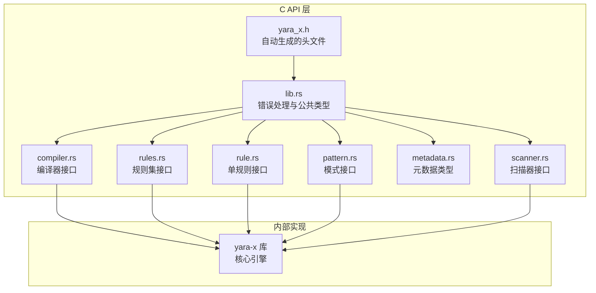
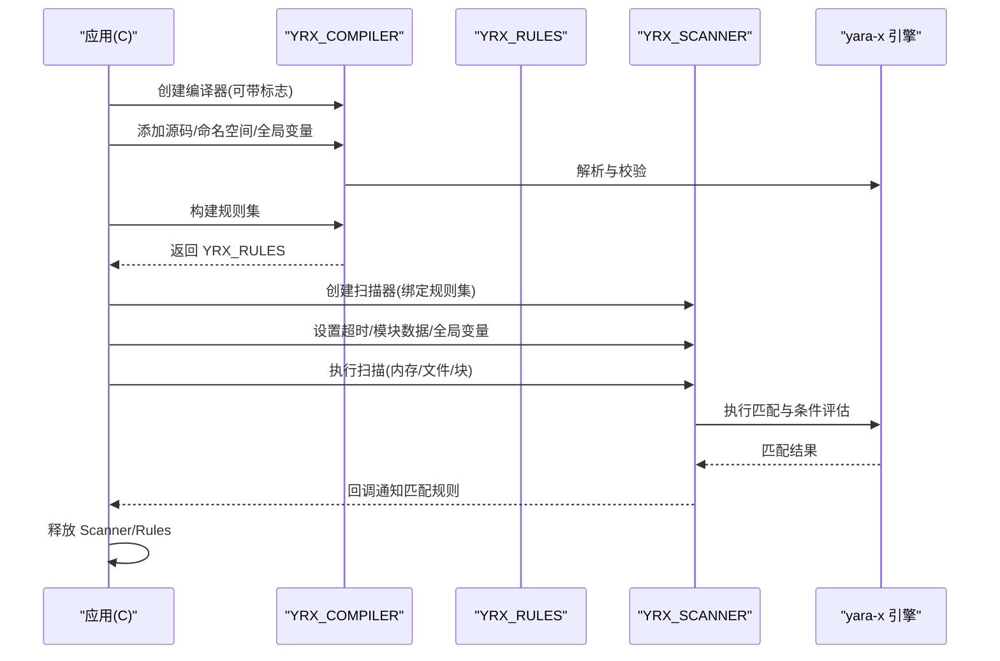
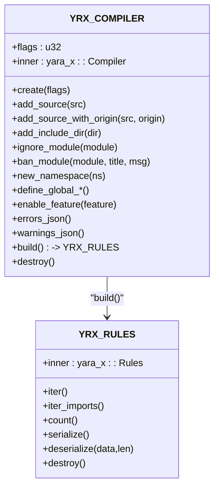
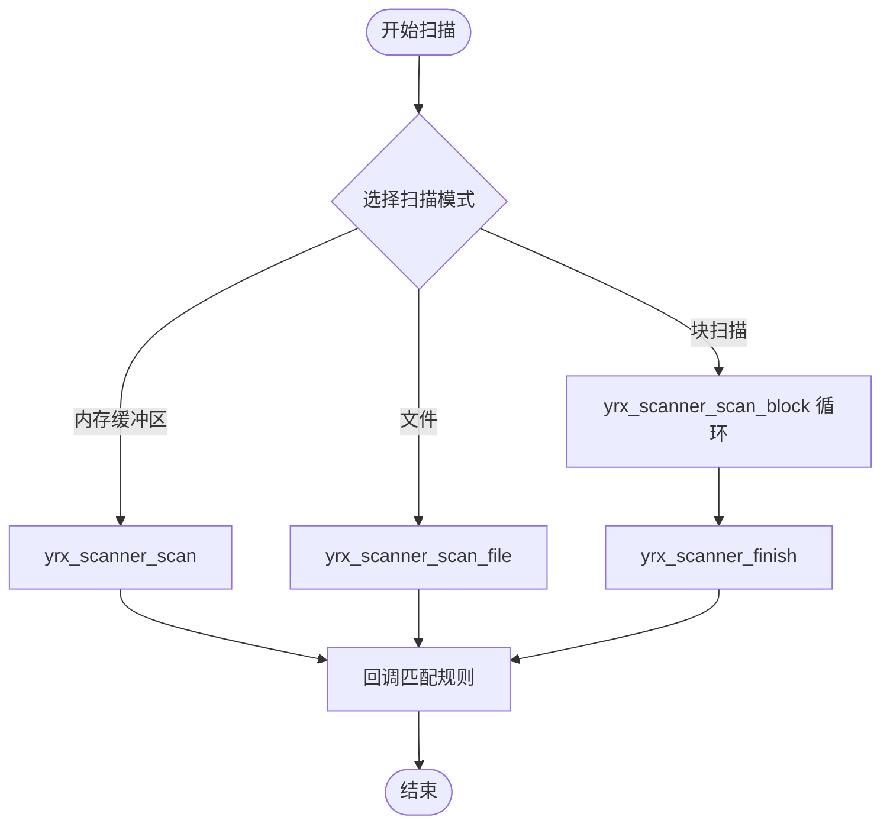
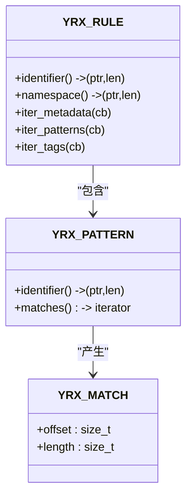
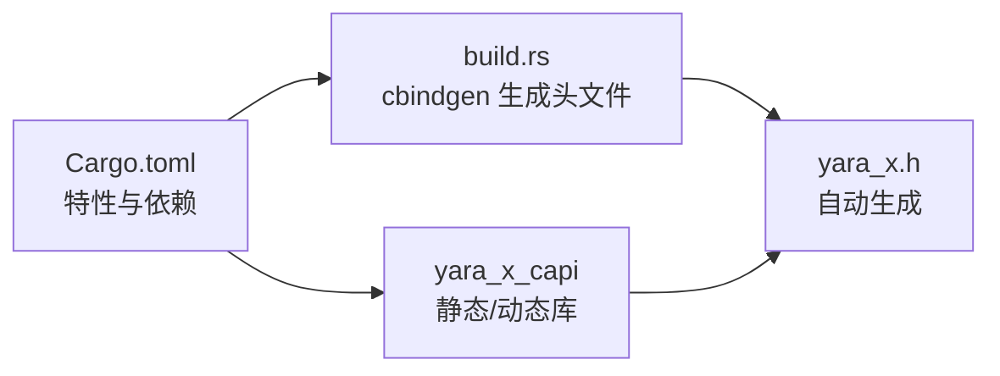

# C API 绑定

<cite>
**本文引用的文件**
- [yara_x.h](file://yara-x/capi/include/yara_x.h)
- [lib.rs](file://yara-x/capi/src/lib.rs)
- [compiler.rs](file://yara-x/capi/src/compiler.rs)
- [scanner.rs](file://yara-x/capi/src/scanner.rs)
- [rules.rs](file://yara-x/capi/src/rules.rs)
- [rule.rs](file://yara-x/capi/src/rule.rs)
- [pattern.rs](file://yara-x/capi/src/pattern.rs)
- [metadata.rs](file://yara-x/capi/src/metadata.rs)
- [tests.rs](file://yara-x/capi/src/tests.rs)
- [Cargo.toml](file://yara-x/capi/Cargo.toml)
- [build.rs](file://yara-x/capi/build.rs)
- [c.md](file://yara-x/site/content/docs/api/c.md)
</cite>

## 目录
1. [简介](#简介)
2. [项目结构](#项目结构)
3. [核心组件](#核心组件)
4. [架构总览](#架构总览)
5. [详细组件分析](#详细组件分析)
6. [依赖关系分析](#依赖关系分析)
7. [性能考量](#性能考量)
8. [故障排查指南](#故障排查指南)
9. [结论](#结论)
10. [附录](#附录)

## 简介
本文件为 YARA-X 的 C API 绑定的权威技术文档，面向系统级开发者与需要直接使用 C 接口的用户。文档覆盖头文件包含方式、函数声明、数据结构定义、内存管理策略（对象生命周期与资源释放）、错误处理机制、完整 API 参考（编译器、扫描器、规则管理等），并提供基于仓库测试用例的典型使用示例路径与最佳实践建议。同时对线程安全性、性能特性与限制进行深入说明，帮助读者在生产环境中正确、安全地集成与使用该 C API。

## 项目结构
C API 绑定位于独立的 `yara-x/capi` 子工程中，通过 cbindgen 自动生成 C 头文件，并由 cargo-c 构建静态库与动态库。核心文件组织如下：
- 头文件生成：`yara-x/capi/include/yara_x.h`（自动生成）
- 核心绑定入口与错误处理：`yara-x/capi/src/lib.rs`
- 编译器相关实现：`yara-x/capi/src/compiler.rs`
- 规则集与规则遍历：`yara-x/capi/src/rules.rs`、`yara-x/capi/src/rule.rs`
- 模式匹配与匹配结果：`yara-x/capi/src/pattern.rs`
- 元数据结构：`yara-x/capi/src/metadata.rs`
- 扫描器与块扫描模式：`yara-x/capi/src/scanner.rs`
- 构建脚本与特性开关：`yara-x/capi/Cargo.toml`、`yara-x/capi/build.rs`
- 官方文档：`yara-x/site/content/docs/api/c.md`

图表来源
- [yara_x.h:1-903](file://yara-x/capi/include/yara_x.h#L1-L903)
- [lib.rs:1-269](file://yara-x/capi/src/lib.rs#L1-L269)
- [compiler.rs:1-625](file://yara-x/capi/src/compiler.rs#L1-L625)
- [rules.rs:1-173](file://yara-x/capi/src/rules.rs#L1-L173)
- [rule.rs:1-223](file://yara-x/capi/src/rule.rs#L1-L223)
- [pattern.rs:1-80](file://yara-x/capi/src/pattern.rs#L1-L80)
- [metadata.rs:1-52](file://yara-x/capi/src/metadata.rs#L1-L52)
- [scanner.rs:1-750](file://yara-x/capi/src/scanner.rs#L1-L750)

章节来源
- [yara_x.h:1-903](file://yara-x/capi/include/yara_x.h#L1-L903)
- [lib.rs:1-269](file://yara-x/capi/src/lib.rs#L1-L269)
- [Cargo.toml:1-65](file://yara-x/capi/Cargo.toml#L1-L65)

## 核心组件
- 错误码与线程本地错误存储
  - 错误码枚举：YRX_RESULT，覆盖语法错误、变量错误、扫描错误、超时、无效参数、UTF-8 错误、状态错误、序列化错误、无元数据、不支持等。
  - 线程本地错误存储：每个线程维护最近一次调用的错误消息，可通过 yrx_last_error 获取；返回指针仅在当前线程下一次调用 API 前有效。
- 数据结构
  - YRX_BUFFER：通用字节缓冲区，用于承载 JSON 错误/警告报告、序列化规则等。
  - YRX_MATCH：单个模式匹配结果，包含偏移与长度。
  - YRX_METADATA/YRX_METADATA_TYPE/YRX_METADATA_VALUE/YRX_METADATA_BYTES：规则元数据结构族，支持整型、浮点、布尔、字符串、字节串。
  - YRX_COMPILER/YRX_RULES/YRX_RULE/YRX_PATTERN/YRX_SCANNER：核心对象类型，分别对应编译器、规则集、单规则、模式、扫描器。
- 回调函数族
  - 匹配回调：YRX_MATCH_CALLBACK、YRX_RULE_CALLBACK、YRX_METADATA_CALLBACK、YRX_PATTERN_CALLBACK、YRX_TAG_CALLBACK、YRX_IMPORT_CALLBACK、YRX_SLOWEST_RULES_CALLBACK。
- 编译器标志
  - 颜色化错误输出、宽松正则语法、慢模式/循环报错、条件优化、禁用 include、特性开关等。

章节来源
- [yara_x.h:56-186](file://yara-x/capi/include/yara_x.h#L56-L186)
- [lib.rs:129-179](file://yara-x/capi/src/lib.rs#L129-L179)
- [metadata.rs:4-52](file://yara-x/capi/src/metadata.rs#L4-L52)

## 架构总览
C API 将 Rust 核心引擎封装为 C 可调用接口，采用“对象即指针”的设计：所有对象以裸指针形式暴露给 C 调用者，生命周期由 C 调用者严格管理。核心流程分为两阶段：
- 规则编译阶段：使用 yrx_compile 或 YRX_COMPILER 收集源码，构建 YRX_RULES。
- 扫描阶段：使用 YRX_SCANNER 对数据或文件进行扫描，通过回调报告匹配规则。

图表来源
- [compiler.rs:77-625](file://yara-x/capi/src/compiler.rs#L77-L625)
- [rules.rs:47-173](file://yara-x/capi/src/rules.rs#L47-L173)
- [scanner.rs:109-750](file://yara-x/capi/src/scanner.rs#L109-L750)

## 详细组件分析

### 编译器（YRX_COMPILER）与规则集（YRX_RULES）
- 创建与销毁
  - yrx_compiler_create：创建编译器，支持多种标志位控制行为。
  - yrx_compiler_destroy：销毁编译器。
- 源码与命名空间
  - yrx_compiler_add_source / yrx_compiler_add_source_with_origin：添加源码，后者可指定来源（用于错误报告）。
  - yrx_compiler_new_namespace：切换命名空间，后续源码归入新命名空间。
- include 目录与模块策略
  - yrx_compiler_add_include_dir：设置 include 查找目录。
  - yrx_compiler_ignore_module / yrx_compiler_ban_module：忽略或禁止模块导入。
- 全局变量与特性
  - yrx_compiler_define_global_*：定义全局变量（字符串、布尔、整数、浮点、JSON）。
  - yrx_compiler_enable_feature：启用特定特性（影响模块字段可用性）。
- 错误与警告 JSON
  - yrx_compiler_errors_json / yrx_compiler_warnings_json：返回 JSON 形式的错误/警告列表，需通过 yrx_buffer_destroy 释放。
- 构建与重置
  - yrx_compiler_build：从已添加源码构建 YRX_RULES，构建后编译器自动重置，可继续复用。
- 规则集操作
  - yrx_rules_iter / yrx_rules_iter_imports：遍历规则与导入模块。
  - yrx_rules_count / yrx_rules_serialize / yrx_rules_deserialize：统计数量、序列化/反序列化。
  - yrx_rules_destroy：销毁规则集。

图表来源
- [compiler.rs:10-625](file://yara-x/capi/src/compiler.rs#L10-L625)
- [rules.rs:9-173](file://yara-x/capi/src/rules.rs#L9-L173)

章节来源
- [compiler.rs:77-625](file://yara-x/capi/src/compiler.rs#L77-L625)
- [rules.rs:47-173](file://yara-x/capi/src/rules.rs#L47-L173)
- [yara_x.h:304-667](file://yara-x/capi/include/yara_x.h#L304-L667)

### 扫描器（YRX_SCANNER）与块扫描模式
- 创建与销毁
  - yrx_scanner_create：绑定规则集创建扫描器；同一规则集可被多扫描器并发使用（每扫描器单线程）。
  - yrx_scanner_destroy：销毁扫描器。
- 扫描模式
  - yrx_scanner_scan：扫描内存缓冲区。
  - yrx_scanner_scan_file：扫描文件。
  - 块扫描模式：yrx_scanner_scan_block + yrx_scanner_finish，适用于非连续内存块或流式数据；块扫描有重要限制（见下节）。
- 超时与回调
  - yrx_scanner_set_timeout：设置扫描超时（秒）。
  - yrx_scanner_on_matching_rule：注册匹配规则回调。
- 全局变量与模块数据
  - yrx_scanner_set_global_*：运行时修改全局变量。
  - yrx_scanner_set_module_data：为模块提供元数据（单块扫描模式下有效）。
  - yrx_scanner_set_module_output：为模块提供输出数据（单块扫描模式下有效）。
- 性能分析（可选特性）
  - yrx_scanner_iter_slowest_rules / yrx_scanner_clear_profiling_data：迭代最慢规则并清空统计数据（需启用 rules-profiling 特性）。

图表来源
- [scanner.rs:157-392](file://yara-x/capi/src/scanner.rs#L157-L392)

章节来源
- [scanner.rs:109-750](file://yara-x/capi/src/scanner.rs#L109-L750)
- [yara_x.h:669-791](file://yara-x/capi/include/yara_x.h#L669-L791)

### 单规则与模式（YRX_RULE / YRX_PATTERN）
- 规则信息
  - yrx_rule_identifier / yrx_rule_namespace：获取规则标识符与命名空间（返回指针与长度，非空终止）。
  - yrx_rule_iter_metadata / yrx_rule_iter_patterns / yrx_rule_iter_tags：遍历元数据、模式、标签。
- 模式匹配
  - yrx_pattern_identifier：获取模式标识符（返回指针与长度）。
  - yrx_pattern_iter_matches：遍历模式的所有匹配（YRX_MATCH 列表）。

图表来源
- [rule.rs:9-223](file://yara-x/capi/src/rule.rs#L9-L223)
- [pattern.rs:5-80](file://yara-x/capi/src/pattern.rs#L5-L80)

章节来源
- [rule.rs:19-223](file://yara-x/capi/src/rule.rs#L19-L223)
- [pattern.rs:15-80](file://yara-x/capi/src/pattern.rs#L15-L80)
- [yara_x.h:542-621](file://yara-x/capi/include/yara_x.h#L542-L621)

### 元数据与缓冲区（YRX_METADATA / YRX_BUFFER）
- 元数据类型族
  - YRX_METADATA_TYPE：整型、浮点、布尔、字符串、字节串。
  - YRX_METADATA_VALUE：联合体，按类型选择具体值。
  - YRX_METADATA_BYTES：字节串长度与数据指针。
  - YRX_METADATA：元数据条目，包含标识符、类型与值。
- 缓冲区
  - YRX_BUFFER：data 指针与 length 字段；通过 yrx_buffer_destroy 释放。

章节来源
- [metadata.rs:3-52](file://yara-x/capi/src/metadata.rs#L3-L52)
- [yara_x.h:111-186](file://yara-x/capi/include/yara_x.h#L111-L186)

## 依赖关系分析
- 构建与特性
  - Cargo.toml 定义了默认特性与可选特性：native-code-serialization、rules-profiling、magic-module。
  - 构建时通过 cbindgen 生成头文件，build.rs 在构建时触发 cbindgen。
- 运行时依赖
  - 依赖 yara-x 核心库，默认启用并行编译特性。
  - 提供静态库与动态库两种产物，便于不同链接场景。

图表来源
- [Cargo.toml:14-65](file://yara-x/capi/Cargo.toml#L14-L65)
- [build.rs:1-19](file://yara-x/capi/build.rs#L1-L19)

章节来源
- [Cargo.toml:14-65](file://yara-x/capi/Cargo.toml#L14-L65)
- [build.rs:1-19](file://yara-x/capi/build.rs#L1-L19)

## 性能考量
- 条件优化与慢模式/循环检查
  - 编译器标志 YRX_ENABLE_CONDITION_OPTIMIZATION 可启用 CSE/LICM 等优化；YRX_ERROR_ON_SLOW_PATTERN/YRX_ERROR_ON_SLOW_LOOP 可将潜在性能问题转为错误，便于提前发现。
- 规则序列化与平台原生代码
  - native-code-serialization 特性可将平台原生代码内嵌到序列化规则中，减少加载时间但增大体积；跨平台反序列化会忽略原生代码并重新生成。
- 块扫描模式限制
  - 块扫描无法使用模块解析（如 PE/ELF）、哈希模块、内置整型读取函数、filesize 关键字，且匹配不会跨越块边界；仅适合文本/十六进制/正则模式。
- 并发与超时
  - 同一规则集可被多个扫描器并发使用（每扫描器单线程）；建议设置合理超时避免长时间阻塞。
- 性能分析
  - 启用 rules-profiling 特性后，可通过 yrx_scanner_iter_slowest_rules 获取最慢规则，结合 yrx_scanner_clear_profiling_data 清理统计。

章节来源
- [compiler.rs:43-75](file://yara-x/capi/src/compiler.rs#L43-L75)
- [scanner.rs:269-392](file://yara-x/capi/src/scanner.rs#L269-L392)
- [Cargo.toml:19-34](file://yara-x/capi/Cargo.toml#L19-L34)

## 故障排查指南
- 错误获取
  - 使用 yrx_last_error 获取最近一次调用的错误消息；返回指针仅在当前线程下一次调用 API 前有效。
- 常见错误码
  - YRX_SYNTAX_ERROR：编译语法错误。
  - YRX_VARIABLE_ERROR：变量定义/赋值冲突或类型不匹配。
  - YRX_SCAN_ERROR：扫描过程中的错误。
  - YRX_SCAN_TIMEOUT：扫描超时。
  - YRX_INVALID_ARGUMENT：传入空指针或无效参数。
  - YRX_INVALID_UTF8：字符串不是有效的 UTF-8。
  - YRX_INVALID_STATE：状态不合法（例如在块扫描模式下调用不支持的函数）。
  - YRX_SERIALIZATION_ERROR：序列化/反序列化失败。
  - YRX_NO_METADATA：规则无元数据。
  - YRX_NOT_SUPPORTED：功能未启用（如 rules-profiling）。
- 测试参考
  - 仓库提供了大量端到端测试，涵盖编译、扫描、模块数据、块扫描与错误处理等场景，可作为实现对照与回归验证的依据。

章节来源
- [lib.rs:163-179](file://yara-x/capi/src/lib.rs#L163-L179)
- [yara_x.h:56-85](file://yara-x/capi/include/yara_x.h#L56-L85)
- [tests.rs:111-423](file://yara-x/capi/src/tests.rs#L111-L423)

## 结论
YARA-X 的 C API 以清晰的对象模型与严格的生命周期管理，为系统级应用提供了稳定、高性能的规则编译与扫描能力。通过合理的标志配置、模块策略与性能分析特性，可在复杂场景中获得可控的性能与可维护性。遵循本文的内存管理与线程安全建议，结合官方文档与测试用例，可快速、可靠地完成集成。

## 附录

### API 参考要点与使用示例路径
- 基本流程
  - 规则编译：yrx_compile 或 YRX_COMPILER → yrx_compiler_build → YRX_RULES。
  - 扫描：yrx_scanner_create → yrx_scanner_on_matching_rule → yrx_scanner_scan/_file/_block → yrx_scanner_finish。
  - 资源释放：yrx_scanner_destroy → yrx_rules_destroy。
- 示例路径（不包含代码内容，仅提供定位）
  - 基础编译与扫描：[tests.rs:111-246](file://yara-x/capi/src/tests.rs#L111-L246)
  - 模块数据与输出：[tests.rs:248-344](file://yara-x/capi/src/tests.rs#L248-L344)
  - 块扫描模式：[tests.rs:346-391](file://yara-x/capi/src/tests.rs#L346-L391)
  - 错误处理与来源：[tests.rs:393-423](file://yara-x/capi/src/tests.rs#L393-L423)
- 官方文档补充
  - 更详尽的 API 说明与示例参见：[c.md](file://yara-x/site/content/docs/api/c.md)

章节来源
- [tests.rs:111-423](file://yara-x/capi/src/tests.rs#L111-L423)
- [c.md:1-1318](file://yara-x/site/content/docs/api/c.md#L1-L1318)