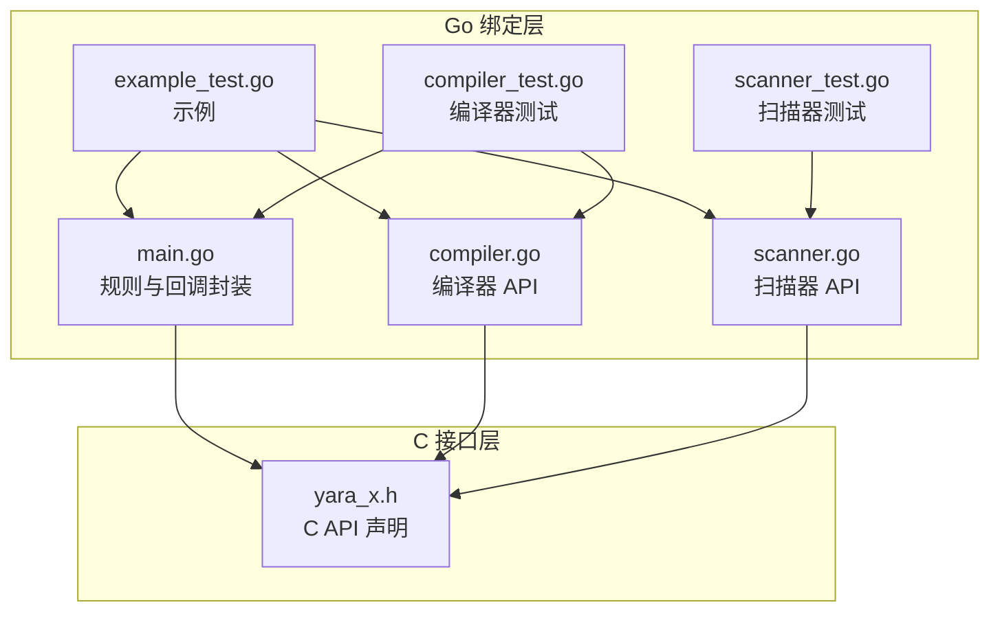
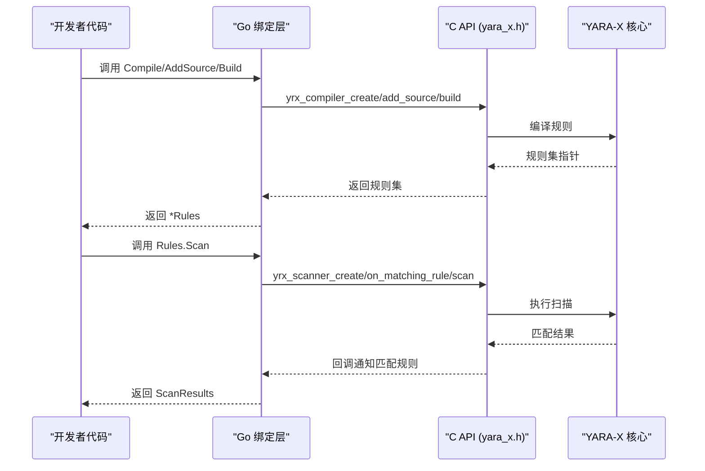
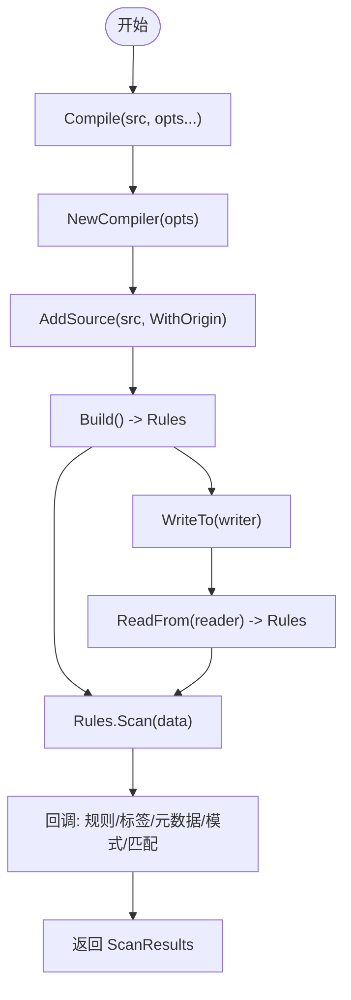
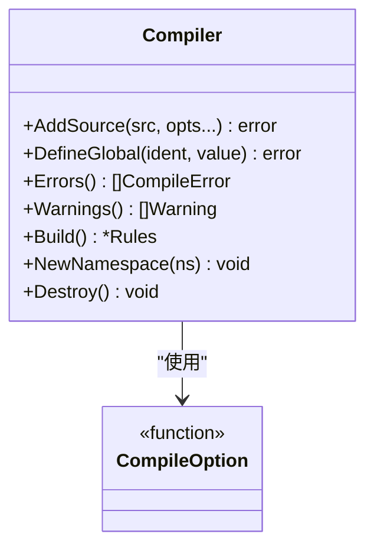
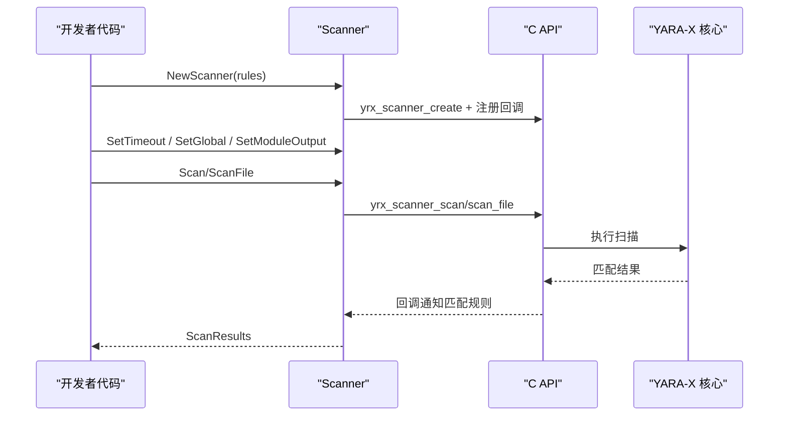
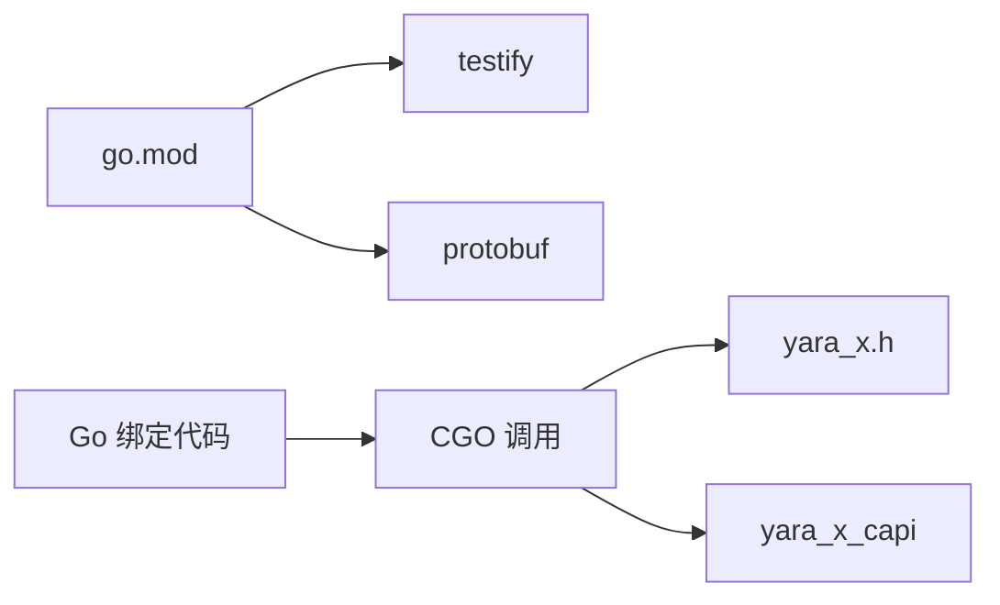

# Go 绑定

<cite>
**本文引用的文件**
- [main.go](file://yara-x/go/main.go)
- [compiler.go](file://yara-x/go/compiler.go)
- [scanner.go](file://yara-x/go/scanner.go)
- [go.mod](file://yara-x/go/go.mod)
- [example_test.go](file://yara-x/go/example_test.go)
- [compiler_test.go](file://yara-x/go/compiler_test.go)
- [scanner_test.go](file://yara-x/go/scanner_test.go)
- [yara_x.h](file://yara-x/capi/include/yara_x.h)
</cite>

## 目录
1. [简介](#简介)
2. [项目结构](#项目结构)
3. [核心组件](#核心组件)
4. [架构总览](#架构总览)
5. [详细组件分析](#详细组件分析)
6. [依赖关系分析](#依赖关系分析)
7. [性能考量](#性能考量)
8. [故障排查指南](#故障排查指南)
9. [结论](#结论)
10. [附录](#附录)

## 简介
本文件为 YARA-X 的 Go 语言绑定（Go binding）的完整技术文档，面向 Go 开发者与需要在 Go 中集成 YARA-X 的用户。文档覆盖以下主题：
- 包导入与基本使用
- 编译器（Compiler）、扫描器（Scanner）、规则集（Rules）的 API 设计与用法
- 类型转换与 CGO 实现机制
- 内存管理与线程安全策略
- 错误处理与常见问题排查
- 并发安全、性能优化与最佳实践
- 完整的 Go API 参考与示例路径

## 项目结构
Go 绑定位于 yara-x/go 目录，主要文件如下：
- main.go：规则编译、序列化/反序列化、规则遍历、元数据与模式匹配回调等核心逻辑
- compiler.go：编译器 API，支持选项配置、全局变量定义、错误/警告收集、命名空间与模块控制
- scanner.go：扫描器 API，支持扫描内存块、文件、超时设置、模块输出注入、性能剖析
- go.mod：Go 模块与依赖声明
- example_test.go：基础用例示例
- compiler_test.go、scanner_test.go：功能与行为验证测试

图表来源
- [main.go:1-516](file://yara-x/go/main.go#L1-L516)
- [compiler.go:1-628](file://yara-x/go/compiler.go#L1-L628)
- [scanner.go:1-373](file://yara-x/go/scanner.go#L1-L373)
- [yara_x.h:1-903](file://yara-x/capi/include/yara_x.h#L1-L903)

章节来源
- [main.go:1-516](file://yara-x/go/main.go#L1-L516)
- [compiler.go:1-628](file://yara-x/go/compiler.go#L1-L628)
- [scanner.go:1-373](file://yara-x/go/scanner.go#L1-L373)
- [go.mod:1-15](file://yara-x/go/go.mod#L1-L15)

## 核心组件
- 规则集（Rules）
  - 表示一组已编译的 YARA 规则，支持序列化/反序列化、规则切片、导入模块枚举、规则数量统计等
- 编译器（Compiler）
  - 提供源码添加、命名空间切换、模块忽略/禁止、特性开关、包含目录、全局变量定义、错误/警告收集、构建规则集
- 扫描器（Scanner）
  - 将规则集用于扫描内存或文件，支持超时、模块输出注入、匹配规则回调、性能剖析（慢规则）

章节来源
- [main.go:133-250](file://yara-x/go/main.go#L133-L250)
- [compiler.go:271-332](file://yara-x/go/compiler.go#L271-L332)
- [scanner.go:40-105](file://yara-x/go/scanner.go#L40-L105)

## 架构总览
Go 绑定通过 CGO 调用 C API（yara_x.h），在 Go 层进行类型转换、内存管理与错误处理，并通过回调桥接 C 侧的迭代器（规则、模式、匹配、元数据、导入模块等）。

图表来源
- [main.go:96-141](file://yara-x/go/main.go#L96-L141)
- [compiler.go:355-411](file://yara-x/go/compiler.go#L355-L411)
- [scanner.go:231-257](file://yara-x/go/scanner.go#L231-L257)
- [yara_x.h:304-540](file://yara-x/capi/include/yara_x.h#L304-L540)

## 详细组件分析

### 规则集（Rules）与编译/扫描流程
- 编译入口
  - Compile：便捷函数，内部创建编译器、添加源码、构建规则集
  - ReadFrom/WriteTo：基于 C API 的序列化/反序列化，支持跨进程/跨服务传输规则集
- 规则遍历与元数据
  - Slice/Count：遍历规则、统计数量
  - Imports：枚举导入模块
  - 元数据与模式匹配通过回调在 Go 层组装为 Go 对象

图表来源
- [main.go:96-141](file://yara-x/go/main.go#L96-L141)
- [main.go:107-131](file://yara-x/go/main.go#L107-L131)
- [main.go:133-250](file://yara-x/go/main.go#L133-L250)
- [yara_x.h:629-664](file://yara-x/capi/include/yara_x.h#L629-L664)

章节来源
- [main.go:94-250](file://yara-x/go/main.go#L94-L250)
- [yara_x.h:629-664](file://yara-x/capi/include/yara_x.h#L629-L664)

### 编译器（Compiler）API
- 选项体系
  - Globals：全局变量（int/int32/int64/bool/string/float32/float64、JSON 结构体/数组）
  - IgnoreModule/BanModule：模块忽略/禁止（可自定义错误标题与消息）
  - WithFeature：启用实验性特性
  - RelaxedReSyntax/ConditionOptimization/ErrorOnSlowPattern/ErrorOnSlowLoop：语法与优化策略
  - EnableIncludes/IncludeDir：包含语句与搜索目录
- 源码添加与命名空间
  - AddSource 支持 WithOrigin 指定来源（用于错误报告）
  - NewNamespace 切换命名空间
- 全局变量与错误/警告
  - DefineGlobal：定义全局变量（支持复杂类型 JSON 序列化）
  - Errors/Warnings：以 JSON 结构返回编译期错误与警告
- 构建与重置
  - Build 返回规则集，内部会初始化状态以便继续使用

图表来源
- [compiler.go:271-332](file://yara-x/go/compiler.go#L271-L332)
- [compiler.go:355-411](file://yara-x/go/compiler.go#L355-L411)
- [compiler.go:495-558](file://yara-x/go/compiler.go#L495-L558)
- [compiler.go:560-602](file://yara-x/go/compiler.go#L560-L602)

章节来源
- [compiler.go:13-160](file://yara-x/go/compiler.go#L13-L160)
- [compiler.go:194-270](file://yara-x/go/compiler.go#L194-L270)
- [compiler.go:271-332](file://yara-x/go/compiler.go#L271-L332)
- [compiler.go:355-411](file://yara-x/go/compiler.go#L355-L411)
- [compiler.go:495-558](file://yara-x/go/compiler.go#L495-L558)
- [compiler.go:560-602](file://yara-x/go/compiler.go#L560-L602)

### 扫描器（Scanner）API
- 创建与生命周期
  - NewScanner：绑定规则集，注册匹配规则回调
  - Destroy：释放 C 侧资源
- 扫描方式
  - Scan：扫描字节切片
  - ScanFile：扫描文件路径
  - ScanBlock/Finish：多块扫描（流式/内存受限场景，有模块限制）
- 超时与全局变量
  - SetTimeout：设置扫描超时
  - SetGlobal：运行时修改全局变量（类型需与定义一致）
- 模块输出注入
  - SetModuleOutput：注入模块输出（Protocol Buffer）
- 性能剖析
  - SlowestRules/ClearProfilingData：慢规则统计（需启用 rules-profiling 特性）

图表来源
- [scanner.go:85-105](file://yara-x/go/scanner.go#L85-L105)
- [scanner.go:114-171](file://yara-x/go/scanner.go#L114-L171)
- [scanner.go:231-281](file://yara-x/go/scanner.go#L231-L281)
- [yara_x.h:677-707](file://yara-x/capi/include/yara_x.h#L677-L707)

章节来源
- [scanner.go:40-105](file://yara-x/go/scanner.go#L40-L105)
- [scanner.go:114-171](file://yara-x/go/scanner.go#L114-L171)
- [scanner.go:231-281](file://yara-x/go/scanner.go#L231-L281)
- [scanner.go:283-345](file://yara-x/go/scanner.go#L283-L345)
- [yara_x.h:677-707](file://yara-x/capi/include/yara_x.h#L677-L707)

### CGO 实现机制与内存管理
- CGO 导入与头文件
  - 通过 // #include 引入 yara_x.h
  - 通过 // #cgo 配置 pkg-config 或静态链接
- 线程锁定与错误一致性
  - 在关键 C API 调用前后使用 runtime.LockOSThread()/UnlockOSThread()，确保 yrx_last_error 与调用来自同一 OS 线程
  - 使用 runtime.KeepAlive 确保对象在 C 调用期间不被 GC 回收
- 回调桥接
  - 使用 runtime/cgo.Handle 将 Go 对象与 C 回调关联，避免悬空指针
  - 导出回调函数（export）接收 C 指针并转换为 Go 对象
- 字节切片与缓冲区
  - WriteTo 采用 64MB 分块写入，避免大对象复制
  - 使用 unsafe.Pointer 与 reflect.SliceHeader 直接映射 C 缓冲区，提升性能

章节来源
- [main.go:4-83](file://yara-x/go/main.go#L4-L83)
- [main.go:146-197](file://yara-x/go/main.go#L146-L197)
- [compiler.go:394-410](file://yara-x/go/compiler.go#L394-L410)
- [scanner.go:240-257](file://yara-x/go/scanner.go#L240-L257)

### 类型转换与错误处理
- 元数据类型转换
  - C 侧元数据联合体按类型分支转换为 Go interface{}：int64、float64、bool、string、[]byte
- 全局变量类型转换
  - 支持 int/int32/int64/bool/string/float32/float64 以及 map[string]interface{}、[]interface{}（JSON 序列化）
- 错误处理
  - C API 返回 YRX_RESULT，Go 层统一转换为 Go error 或特定 ErrTimeout
  - 编译期错误/警告以 JSON 结构返回，Go 层解析为结构体

章节来源
- [main.go:467-500](file://yara-x/go/main.go#L467-L500)
- [compiler.go:514-558](file://yara-x/go/compiler.go#L514-L558)
- [scanner.go:129-171](file://yara-x/go/scanner.go#L129-L171)
- [yara_x.h:56-85](file://yara-x/capi/include/yara_x.h#L56-L85)

## 依赖关系分析
- Go 模块依赖
  - testify：测试断言
  - protobuf：模块输出注入
- CGO 依赖
  - yara_x.h：C API 声明
  - pkg-config/yara_x_capi：动态/静态链接

图表来源
- [go.mod:5-8](file://yara-x/go/go.mod#L5-L8)
- [main.go:4-6](file://yara-x/go/main.go#L4-L6)
- [yara_x.h:1-20](file://yara-x/capi/include/yara_x.h#L1-L20)

章节来源
- [go.mod:1-15](file://yara-x/go/go.mod#L1-L15)
- [main.go:4-8](file://yara-x/go/main.go#L4-L8)

## 性能考量
- 内存映射与零拷贝
  - WriteTo 使用分块写入与反射切片头映射，避免大对象复制
- 回调与对象复用
  - cgo.Handle 用于回调上下文传递，减少额外分配
- 线程与 GC 协调
  - LockOSThread 保证 C API 线程一致性；KeepAlive 防止 GC 过早回收
- 扫描优化
  - SetTimeout 控制扫描耗时；慢规则剖析用于定位热点
- 最佳实践
  - 复用 Scanner 与 Rules，避免频繁创建销毁
  - 使用全局变量而非硬编码条件，提高灵活性
  - 合理设置 IncludeDir 与模块策略，减少编译开销

[本节为通用性能建议，无需具体文件分析]

## 故障排查指南
- 编译错误与警告
  - 使用 Compiler.Errors()/Warnings() 获取结构化错误报告
  - WithOrigin 指定来源便于定位
- 模块问题
  - IgnoreModule/BanModule 控制模块使用；注意错误标题与消息定制
- 全局变量类型不匹配
  - DefineGlobal/SetGlobal 类型必须与定义一致，否则返回 YRX_VARIABLE_ERROR
- 超时与阻塞
  - 设置合理超时；确认扫描数据大小与正则复杂度
- 规则剖析
  - 启用 rules-profiling 特性后使用 SlowestRules/ClearProfilingData

章节来源
- [compiler.go:560-602](file://yara-x/go/compiler.go#L560-L602)
- [compiler.go:194-270](file://yara-x/go/compiler.go#L194-L270)
- [compiler.go:514-558](file://yara-x/go/compiler.go#L514-L558)
- [scanner.go:114-171](file://yara-x/go/scanner.go#L114-L171)
- [scanner.go:325-358](file://yara-x/go/scanner.go#L325-L358)

## 结论
YARA-X 的 Go 绑定通过清晰的 API 设计与严谨的 CGO 实现，提供了从编译到扫描的完整能力。其回调桥接、类型转换与内存管理策略兼顾了易用性与性能。结合测试用例与示例，开发者可以快速上手并在生产环境中稳定使用。

[本节为总结，无需具体文件分析]

## 附录

### Go API 参考（按模块）

- 规则集（Rules）
  - Compile：便捷编译
  - ReadFrom/WriteTo：序列化/反序列化
  - Slice/Count/Imports：规则遍历与统计
  - Scan：扫描数据
  - Destroy：销毁规则集

- 编译器（Compiler）
  - NewCompiler：创建编译器
  - AddSource/WithOrigin：添加源码与来源
  - NewNamespace：切换命名空间
  - DefineGlobal/Globals：定义全局变量
  - IgnoreModule/BanModule/WithFeature：模块与特性控制
  - RelaxedReSyntax/ConditionOptimization/ErrorOnSlowPattern/ErrorOnSlowLoop：编译策略
  - EnableIncludes/IncludeDir：包含控制
  - Errors/Warnings：编译期错误与警告
  - Build：构建规则集
  - Destroy：销毁编译器

- 扫描器（Scanner）
  - NewScanner：创建扫描器
  - SetTimeout：设置超时
  - SetGlobal：设置全局变量
  - SetModuleOutput：注入模块输出
  - Scan/ScanFile：扫描内存/文件
  - ScanBlock/Finish：多块扫描
  - SlowestRules/ClearProfilingData：慢规则剖析
  - Destroy：销毁扫描器

章节来源
- [main.go:94-250](file://yara-x/go/main.go#L94-L250)
- [compiler.go:271-628](file://yara-x/go/compiler.go#L271-L628)
- [scanner.go:40-373](file://yara-x/go/scanner.go#L40-L373)

### 常见用例与示例路径
- 基础编译与扫描
  - 示例路径：[example_test.go:5-33](file://yara-x/go/example_test.go#L5-L33)
- 编译器与扫描器分离使用
  - 示例路径：[example_test.go:35-75](file://yara-x/go/example_test.go#L35-L75)
- 编译器测试（命名空间、全局变量、模块、包含、正则宽松模式、条件优化、慢规则、序列化、错误/警告）
  - 测试路径：[compiler_test.go:13-417](file://yara-x/go/compiler_test.go#L13-L417)
- 扫描器测试（扫描、文件扫描、超时、元数据、基准）
  - 测试路径：[scanner_test.go:12-163](file://yara-x/go/scanner_test.go#L12-L163)

章节来源
- [example_test.go:1-76](file://yara-x/go/example_test.go#L1-L76)
- [compiler_test.go:1-417](file://yara-x/go/compiler_test.go#L1-L417)
- [scanner_test.go:1-163](file://yara-x/go/scanner_test.go#L1-L163)