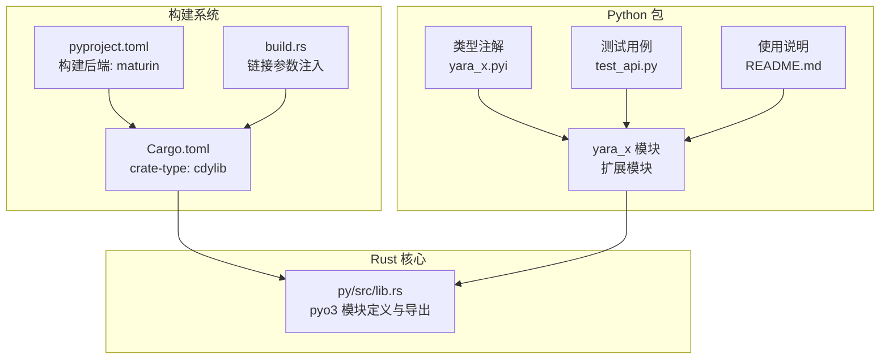
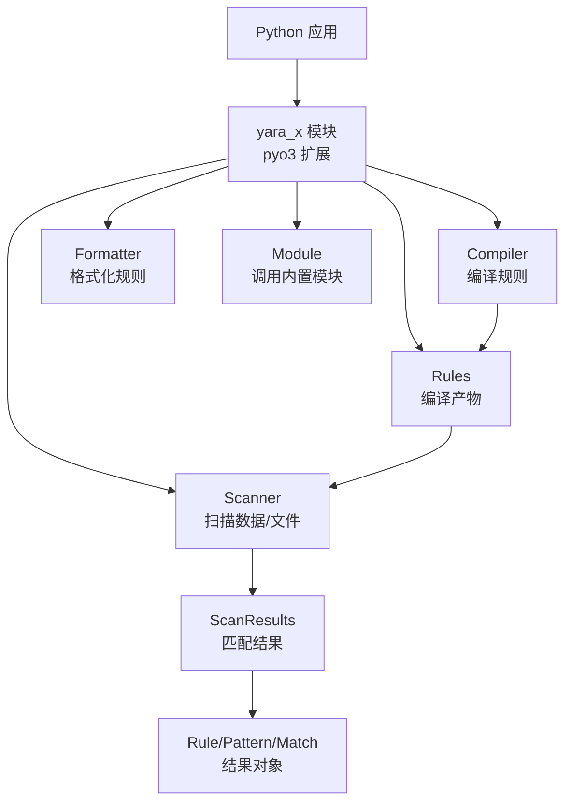
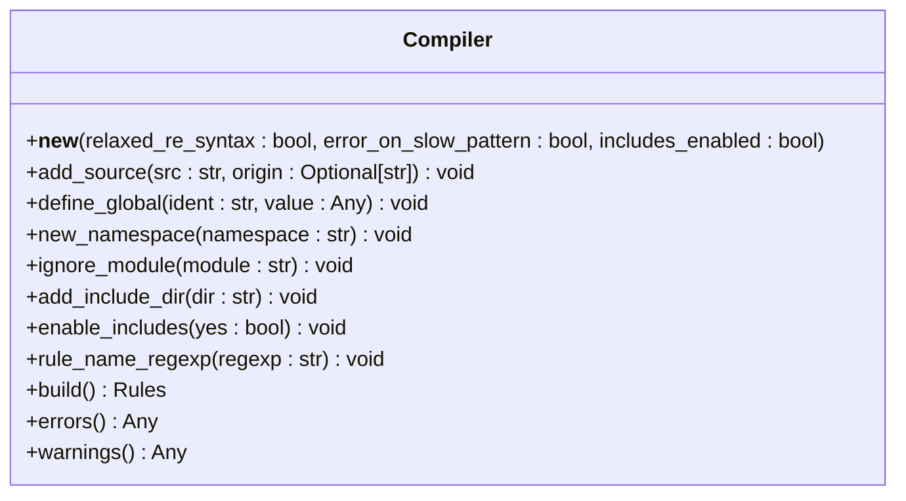
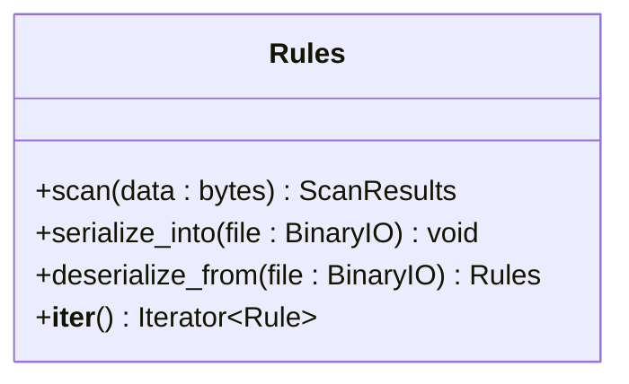
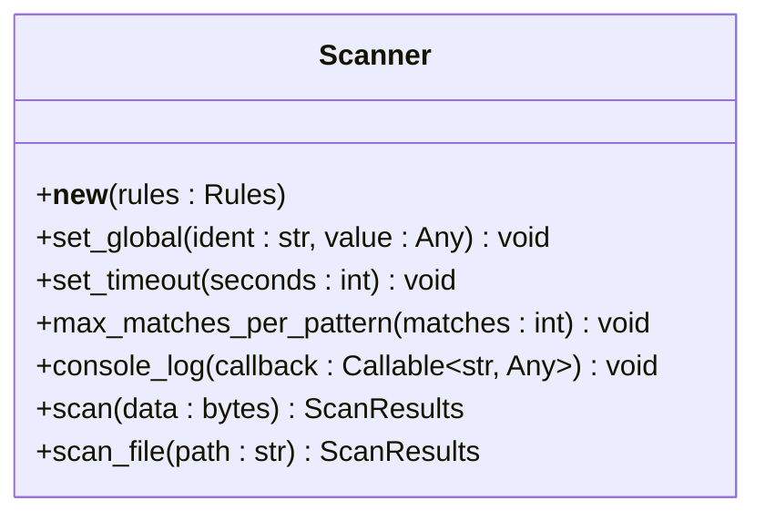
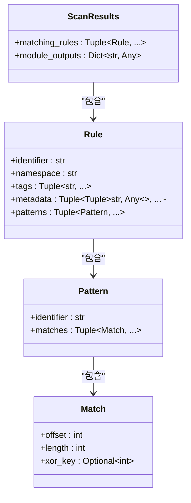
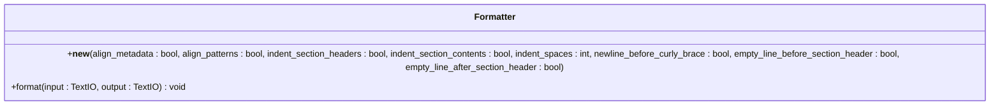
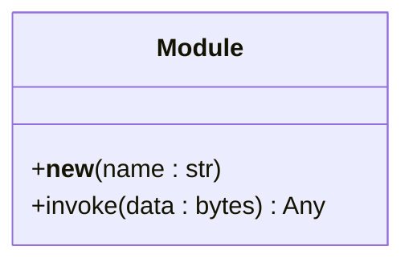
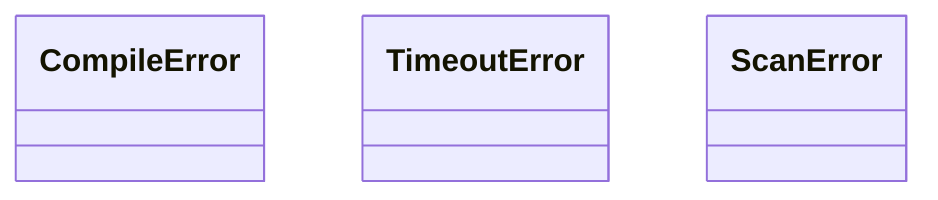
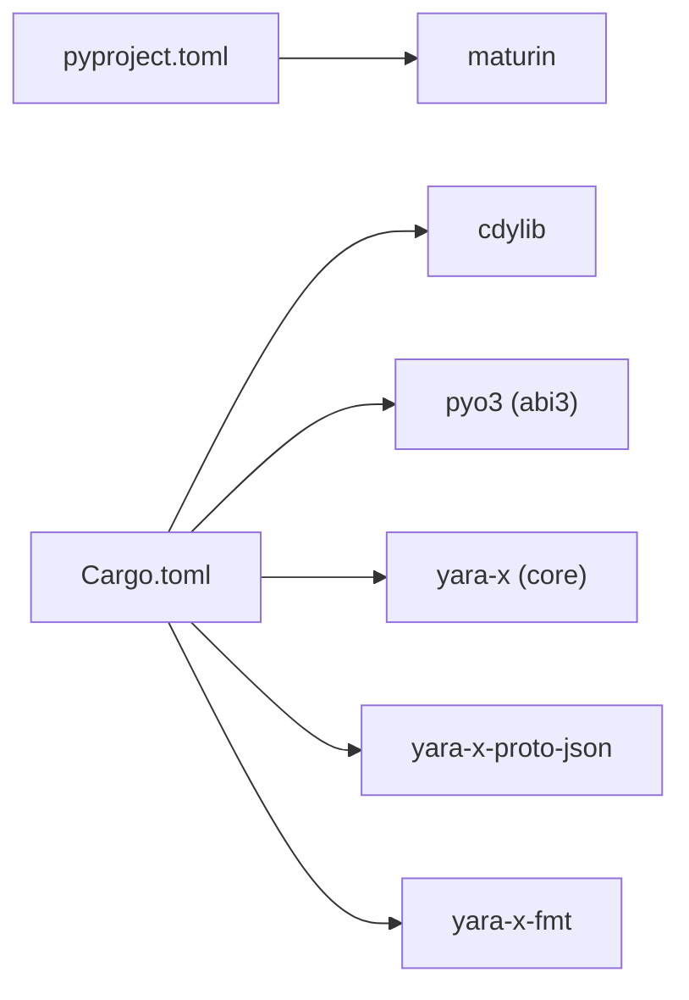

# Python 绑定

<cite>
**本文引用的文件**
- [py/Cargo.toml](file://py/Cargo.toml)
- [py/pyproject.toml](file://py/pyproject.toml)
- [py/build.rs](file://py/build.rs)
- [py/src/lib.rs](file://py/src/lib.rs)
- [py/yara_x.pyi](file://py/yara_x.pyi)
- [py/tests/test_api.py](file://py/tests/test_api.py)
- [py/README.md](file://py/README.md)
</cite>

## 目录
1. [简介](#简介)
2. [项目结构](#项目结构)
3. [核心组件](#核心组件)
4. [架构总览](#架构总览)
5. [详细组件分析](#详细组件分析)
6. [依赖关系分析](#依赖关系分析)
7. [性能考虑](#性能考虑)
8. [故障排查指南](#故障排查指南)
9. [结论](#结论)
10. [附录](#附录)

## 简介
本文件为 yara-x 的 Python 绑定（pyo3）完整文档，目标是帮助 Python 开发者与脚本化使用者快速上手并深入理解接口设计与最佳实践。内容涵盖：
- 安装与构建配置
- 导入与基本使用
- 类型注解与 API 设计模式
- 常见用例：规则编译、扫描执行、结果处理、异常捕获
- 内存管理、垃圾回收与性能优化
- 错误处理、调试技巧与最佳实践

## 项目结构
Python 绑定位于仓库的 py 目录，采用 maturin 构建系统，通过 pyo3 将 Rust 核心库导出为 Python 扩展模块。

图示来源
- [py/pyproject.toml:1-25](file://py/pyproject.toml#L1-L25)
- [py/Cargo.toml:1-70](file://py/Cargo.toml#L1-L70)
- [py/build.rs:1-4](file://py/build.rs#L1-L4)
- [py/src/lib.rs:1197-1215](file://py/src/lib.rs#L1197-L1215)

章节来源
- [py/pyproject.toml:1-25](file://py/pyproject.toml#L1-L25)
- [py/Cargo.toml:1-70](file://py/Cargo.toml#L1-L70)
- [py/build.rs:1-4](file://py/build.rs#L1-L4)
- [py/src/lib.rs:1197-1215](file://py/src/lib.rs#L1197-L1215)

## 核心组件
- 编译器（Compiler）：支持多源添加、命名空间、全局变量、模块忽略、正则约束、include 控制、错误/警告收集等。
- 规则集（Rules）：编译产物，可序列化/反序列化，支持迭代与扫描。
- 扫描器（Scanner）：绑定已编译规则进行数据或文件扫描，支持超时、最大匹配数、全局变量重设、控制台日志回调。
- 结果（ScanResults）：包含匹配规则列表与模块输出字典。
- 规则（Rule）、模式（Pattern）、匹配（Match）：结果的细粒度对象模型。
- 格式化器（Formatter）：格式化 YARA 规则文本。
- 模块（Module）：调用内置模块解析二进制数据并返回 JSON 兼容结构。
- 异常（CompileError、TimeoutError、ScanError）：统一的异常体系。

章节来源
- [py/src/lib.rs:338-348](file://py/src/lib.rs#L338-L348)
- [py/src/lib.rs:350-605](file://py/src/lib.rs#L350-L605)
- [py/src/lib.rs:613-739](file://py/src/lib.rs#L613-L739)
- [py/src/lib.rs:741-767](file://py/src/lib.rs#L741-L767)
- [py/src/lib.rs:769-867](file://py/src/lib.rs#L769-L867)
- [py/src/lib.rs:869-956](file://py/src/lib.rs#L869-L956)
- [py/src/lib.rs:1073-1128](file://py/src/lib.rs#L1073-L1128)
- [py/src/lib.rs:1161-1187](file://py/src/lib.rs#L1161-L1187)

## 架构总览
Python 绑定通过 pyo3 将 Rust 核心导出为扩展模块，提供编译、扫描、结果解析与模块调用能力。

图示来源
- [py/src/lib.rs:1197-1215](file://py/src/lib.rs#L1197-L1215)

## 详细组件分析

### 编译器（Compiler）
- 职责：接收多段规则源码，支持命名空间、全局变量、模块忽略、include 控制、正则约束、错误/警告收集。
- 关键方法与行为：
  - 新建：支持宽松正则语法开关、慢模式报错开关、是否启用 include。
  - 添加源码：可多次调用；错误会累积，可通过 errors()/warnings() 获取。
  - 命名空间：后续 add_source 的规则归属该命名空间。
  - 全局变量：支持 bool/str/bytes/int/float/字典（经 JSON 序列化），类型需一致。
  - 模块忽略：对不支持模块的 import 忽略并告警。
  - include 目录：指定 include 查找路径。
  - 规则名正则：对规则名进行校验。
  - 构建：产出 Rules 对象。
- 参数与返回：
  - add_source(src: str, origin: Optional[str]) -> None
  - define_global(ident: str, value: Any) -> None
  - new_namespace(namespace: str) -> None
  - ignore_module(module: str) -> None
  - add_include_dir(dir: str) -> None
  - enable_includes(yes: bool) -> None
  - rule_name_regexp(regexp: str) -> None
  - build() -> Rules
  - errors() -> Any（JSON 反序列化后的结构）
  - warnings() -> Any（JSON 反序列化后的结构）

图示来源
- [py/src/lib.rs:350-605](file://py/src/lib.rs#L350-L605)

章节来源
- [py/src/lib.rs:350-605](file://py/src/lib.rs#L350-L605)

### 规则集（Rules）
- 职责：编译产物，支持序列化/反序列化、迭代、扫描。
- 关键方法与行为：
  - scan(data: bytes) -> ScanResults
  - serialize_into(file: BinaryIO) -> None
  - deserialize_from(file: BinaryIO) -> Rules
  - __iter__() -> Iterator[Rule]
- 注意：内部以固定大小的 Box 并配合 Pin 保证生命周期安全，避免悬垂指针。

图示来源
- [py/src/lib.rs:869-956](file://py/src/lib.rs#L869-L956)

章节来源
- [py/src/lib.rs:869-956](file://py/src/lib.rs#L869-L956)

### 扫描器（Scanner）
- 职责：绑定 Rules 进行扫描，支持超时、每模式最大匹配数、全局变量重设、控制台日志回调。
- 关键方法与行为：
  - 新建：传入 Rules。
  - set_global(ident: str, value: Any) -> None
  - set_timeout(seconds: int) -> None
  - max_matches_per_pattern(matches: int) -> None
  - console_log(callback: Callable[[str], Any]) -> None
  - scan(data: bytes) -> ScanResults
  - scan_file(path: str) -> ScanResults

图示来源
- [py/src/lib.rs:613-739](file://py/src/lib.rs#L613-L739)

章节来源
- [py/src/lib.rs:613-739](file://py/src/lib.rs#L613-L739)

### 结果与对象模型（ScanResults、Rule、Pattern、Match）
- ScanResults：包含 matching_rules（元组）与 module_outputs（字典）。
- Rule：包含 identifier、namespace、tags、metadata、patterns。
- Pattern：包含 identifier、matches。
- Match：包含 offset、length、xor_key。

图示来源
- [py/src/lib.rs:741-867](file://py/src/lib.rs#L741-L867)

章节来源
- [py/src/lib.rs:741-867](file://py/src/lib.rs#L741-L867)

### 格式化器（Formatter）
- 职责：格式化 YARA 规则文本，支持对齐、缩进、换行等选项。
- 关键方法与行为：
  - __new__(align_metadata: bool, align_patterns: bool, indent_section_headers: bool, indent_section_contents: bool, indent_spaces: int, newline_before_curly_brace: bool, empty_line_before_section_header: bool, empty_line_after_section_header: bool)
  - format(input: TextIO, output: TextIO) -> None

图示来源
- [py/src/lib.rs:72-141](file://py/src/lib.rs#L72-L141)

章节来源
- [py/src/lib.rs:72-141](file://py/src/lib.rs#L72-L141)

### 模块（Module）
- 职责：调用内置模块解析二进制数据，返回 JSON 兼容结构。
- 关键方法与行为：
  - __new__(name: str) -> Module
  - invoke(data: bytes) -> Any

图示来源
- [py/src/lib.rs:267-327](file://py/src/lib.rs#L267-L327)

章节来源
- [py/src/lib.rs:267-327](file://py/src/lib.rs#L267-L327)

### 异常体系
- CompileError：编译失败。
- TimeoutError：扫描超时。
- ScanError：其他扫描错误。

图示来源
- [py/src/lib.rs:1161-1187](file://py/src/lib.rs#L1161-L1187)

章节来源
- [py/src/lib.rs:1161-1187](file://py/src/lib.rs#L1161-L1187)

## 依赖关系分析
- 构建系统：maturin 作为构建后端，Cargo 生成 cdylib 扩展模块。
- 运行时依赖：pyo3（abi3）、yara-x（核心库）、yara-x-proto-json、yara-x-fmt。
- 特性开关：默认启用多个模块特性，可通过 Cargo features 控制。

图示来源
- [py/pyproject.toml:1-25](file://py/pyproject.toml#L1-L25)
- [py/Cargo.toml:52-66](file://py/Cargo.toml#L52-L66)

章节来源
- [py/pyproject.toml:1-25](file://py/pyproject.toml#L1-L25)
- [py/Cargo.toml:52-66](file://py/Cargo.toml#L52-L66)

## 性能考虑
- 扫描超时：通过 Scanner.set_timeout(seconds) 设置单次扫描上限，避免长时间阻塞。
- 最大匹配数：通过 Scanner.max_matches_per_pattern(n) 限制每模式匹配数量，降低复杂度。
- 规则名正则：Compiler.rule_name_regexp 可在编译期尽早发现潜在问题。
- include 控制：Compiler.enable_includes(false) 可减少不必要的文件解析开销。
- 模块输出：模块输出经 JSON 解析并特殊字段解码（如 base64、timestamp），注意仅在需要时启用相关模块。
- 内存管理：Rules 使用 Pin<Box<...>> 保持生命周期稳定，Scanner 与 Rules 生命周期耦合，避免悬垂引用。

章节来源
- [py/src/lib.rs:687-739](file://py/src/lib.rs#L687-L739)
- [py/src/lib.rs:412-418](file://py/src/lib.rs#L412-L418)
- [py/src/lib.rs:542-558](file://py/src/lib.rs#L542-L558)
- [py/src/lib.rs:1055-1128](file://py/src/lib.rs#L1055-L1128)
- [py/src/lib.rs:877-887](file://py/src/lib.rs#L877-L887)

## 故障排查指南
- 编译错误：捕获 CompileError，使用 Compiler.errors() 与 warnings() 获取详细信息。
- 扫描超时：捕获 TimeoutError，检查 set_timeout 配置与规则复杂度。
- 扫描异常：捕获 ScanError，定位底层错误信息。
- 变量类型错误：define_global/set_global 支持 bool/str/bytes/int/float/字典，类型不匹配会抛 TypeError。
- include 限制：当 includes_enabled=False 时，include 语句会触发 CompileError。
- 模块不可用：若模块未在当前构建中启用，Module.invoke 可能返回 None 或抛 ValueError。

章节来源
- [py/tests/test_api.py:6-36](file://py/tests/test_api.py#L6-L36)
- [py/tests/test_api.py:212-220](file://py/tests/test_api.py#L212-L220)
- [py/tests/test_api.py:353-360](file://py/tests/test_api.py#L353-L360)
- [py/src/lib.rs:512-522](file://py/src/lib.rs#L512-L522)
- [py/src/lib.rs:675-685](file://py/src/lib.rs#L675-L685)
- [py/src/lib.rs:1161-1187](file://py/src/lib.rs#L1161-L1187)

## 结论
yara-x 的 Python 绑定通过 pyo3 提供了清晰、稳健且高性能的规则编译与扫描能力。其对象模型直观映射 Rust 核心结构，异常体系明确，便于在 Python 中进行脚本化与自动化集成。建议在生产环境中结合超时、最大匹配数与 include 控制等机制，确保稳定性与性能平衡。

## 附录

### 安装与导入
- 安装：使用 pip 安装发布包（支持 Python 3.9+）。
- 导入：import yara_x
- 快速示例：参考 README 中的最小示例。

章节来源
- [py/README.md:1-31](file://py/README.md#L1-L31)

### 类型注解与 API 设计模式
- 类型注解：yara_x.pyi 提供完整类型签名，包括构造函数参数、属性与方法返回值。
- 设计模式：
  - 不可发送对象（unsendable）用于避免跨线程传递导致的不安全共享。
  - Py<T> 模式：将 Rust 对象安全地持有于 Python 生命周期内。
  - 静态借用：通过 unsafe 转换维持引用有效性，同时以 Pin 保证内存安全。
  - JSON 解码钩子：JsonDecoder 在 json.loads 时对特殊字段进行二次解码。

章节来源
- [py/yara_x.pyi:1-437](file://py/yara_x.pyi#L1-L437)
- [py/src/lib.rs:1130-1159](file://py/src/lib.rs#L1130-L1159)
- [py/src/lib.rs:877-887](file://py/src/lib.rs#L877-L887)

### 常见用例与最佳实践
- 规则编译：优先使用 Compiler.add_source 多次添加，最后 build；必要时使用 define_global/new_namespace/rule_name_regexp。
- 扫描执行：先构建 Scanner，按需设置超时与最大匹配数；对需要日志的场景注册 console_log 回调。
- 结果处理：遍历 ScanResults.matching_rules 获取 Rule 列表；从 Rule.patterns 访问 Pattern 与 Match；从 ScanResults.module_outputs 获取模块输出。
- 异常捕获：区分 CompileError、TimeoutError、ScanError 并针对性处理。
- 性能优化：启用严格正则与慢模式告警；限制 include；控制每模式最大匹配数；必要时序列化 Rules 以便复用。

章节来源
- [py/tests/test_api.py:180-233](file://py/tests/test_api.py#L180-L233)
- [py/tests/test_api.py:235-246](file://py/tests/test_api.py#L235-L246)
- [py/tests/test_api.py:299-317](file://py/tests/test_api.py#L299-L317)
- [py/tests/test_api.py:319-337](file://py/tests/test_api.py#L319-L337)
- [py/tests/test_api.py:339-351](file://py/tests/test_api.py#L339-L351)