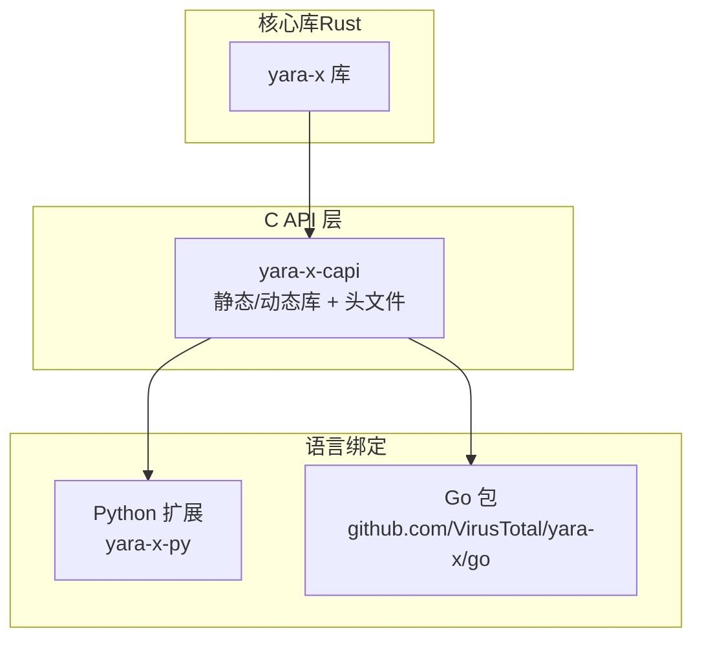
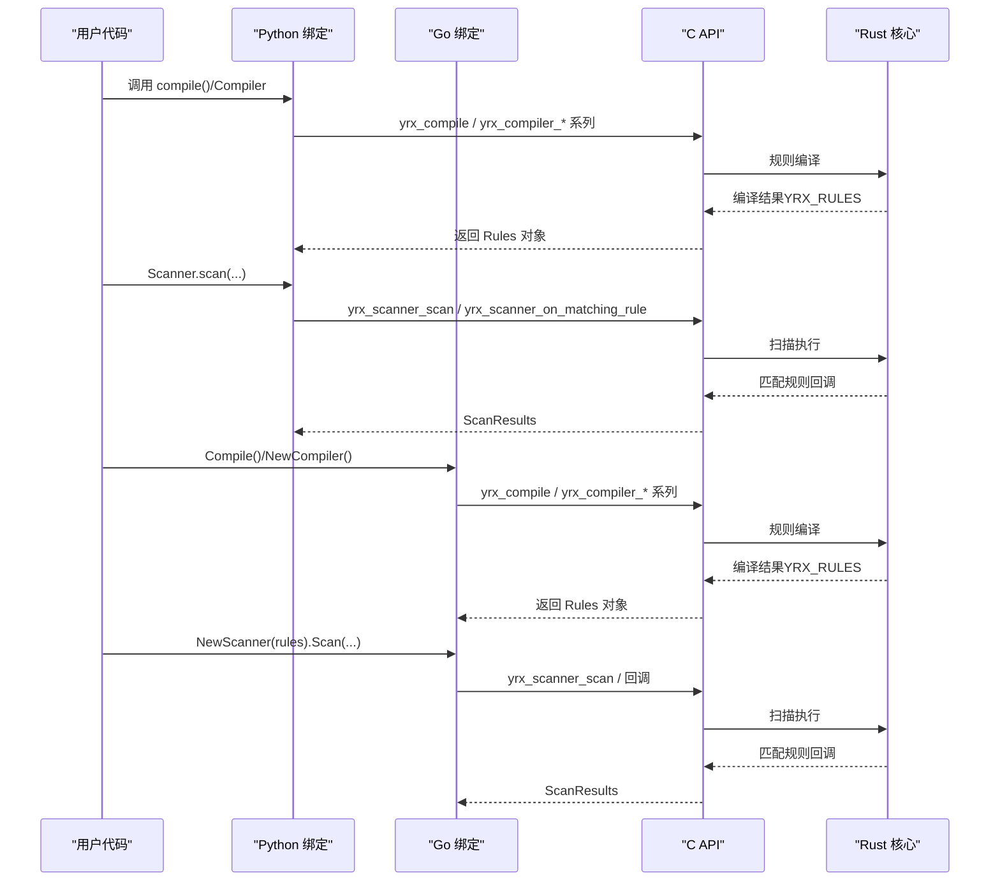
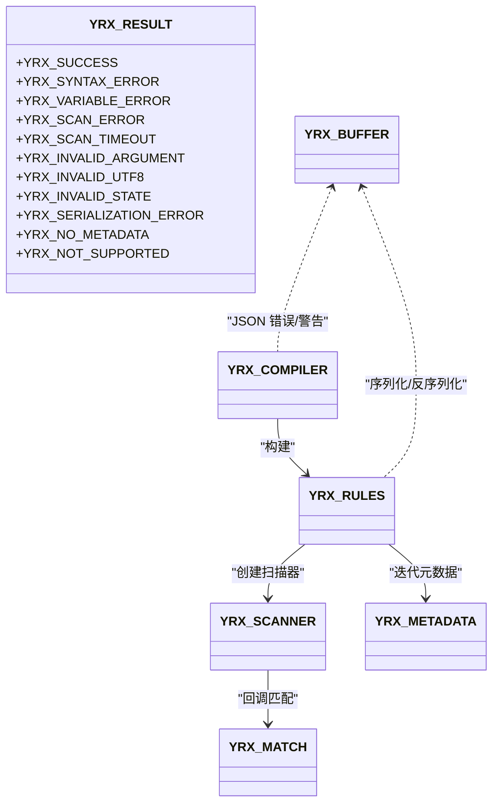
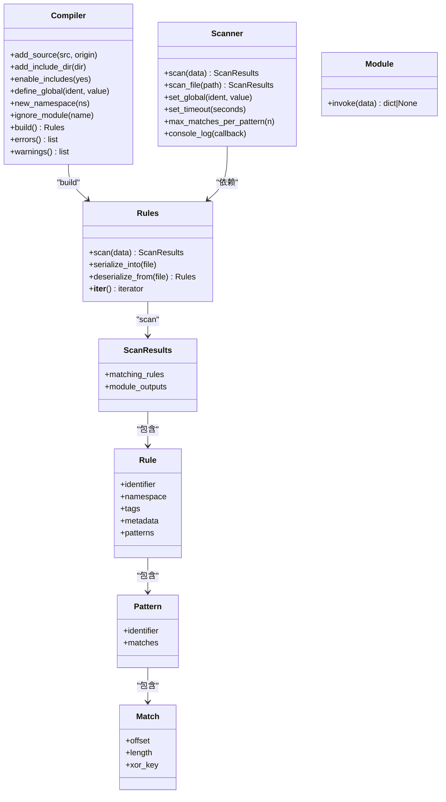
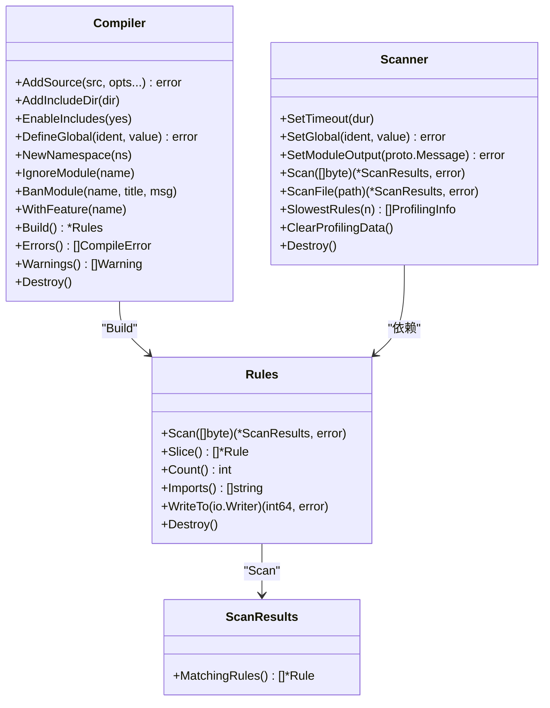
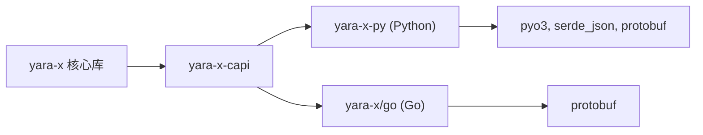

# 多语言绑定

<cite>
**本文档引用的文件**
- [yara_x.h](file://yara-x/capi/include/yara_x.h)
- [lib.rs（C API）](file://yara-x/capi/src/lib.rs)
- [Cargo.toml（C API）](file://yara-x/capi/Cargo.toml)
- [lib.rs（Python 扩展）](file://yara-x/py/src/lib.rs)
- [yara_x.pyi](file://yara-x/py/yara_x.pyi)
- [Cargo.toml（Python）](file://yara-x/py/Cargo.toml)
- [tests/test_api.py](file://yara-x/py/tests/test_api.py)
- [main.go（Go 绑定）](file://yara-x/go/main.go)
- [compiler.go（Go 编译器）](file://yara-x/go/compiler.go)
- [scanner.go（Go 扫描器）](file://yara-x/go/scanner.go)
- [go.mod（Go 模块）](file://yara-x/go/go.mod)
- [example_test.go（Go 示例）](file://yara-x/go/example_test.go)
- [c.md（C API 文档）](file://yara-x/site/content/docs/api/c.md)
- [python.md（Python API 文档）](file://yara-x/site/content/docs/api/python.md)
- [go.md（Go API 文档）](file://yara-x/site/content/docs/api/go.md)
</cite>

## 目录
1. [简介](#简介)
2. [项目结构](#项目结构)
3. [核心组件](#核心组件)
4. [架构总览](#架构总览)
5. [详细组件分析](#详细组件分析)
6. [依赖关系分析](#依赖关系分析)
7. [性能考虑](#性能考虑)
8. [故障排除指南](#故障排除指南)
9. [结论](#结论)
10. [附录](#附录)

## 简介
本文件系统性介绍 YARA-X 的多语言绑定：C/C++、Python、Go。内容涵盖安装与构建、配置与特性、内存与错误处理策略、典型用例（规则编译、扫描执行、结果处理）、性能优化与最佳实践，以及常见问题排查。目标是帮助不同编程背景的开发者快速上手并高效使用。

## 项目结构
YARA-X 将核心逻辑封装为 Rust 库，并通过 FFI 暴露 C API；Python 与 Go 绑定分别在各自语言生态中调用 C API，形成统一的跨语言能力。

图表来源
- [Cargo.toml（C API）:44-47](file://yara-x/capi/Cargo.toml#L44-L47)
- [lib.rs（C API）:1-95](file://yara-x/capi/src/lib.rs#L1-L95)
- [Cargo.toml（Python）:52-67](file://yara-x/py/Cargo.toml#L52-L67)
- [go.mod（Go 模块）:1-15](file://yara-x/go/go.mod#L1-L15)

章节来源
- [Cargo.toml（C API）:1-65](file://yara-x/capi/Cargo.toml#L1-L65)
- [lib.rs（C API）:1-95](file://yara-x/capi/src/lib.rs#L1-L95)
- [Cargo.toml（Python）:1-70](file://yara-x/py/Cargo.toml#L1-L70)
- [go.mod（Go 模块）:1-15](file://yara-x/go/go.mod#L1-L15)

## 核心组件
- C API：提供编译、扫描、序列化/反序列化、回调等接口，支持线程局部错误信息与缓冲区生命周期管理。
- Python 绑定：基于 PyO3，提供 Compiler/Scanner/Rules/ScanResults 等高级类型，支持全局变量、命名空间、模块输出、格式化等。
- Go 绑定：基于 CGO，直接调用 C API，提供 Compiler/Scanner/Rules 等结构体及序列化/反序列化、模块输出设置等能力。

章节来源
- [yara_x.h:55-85](file://yara-x/capi/include/yara_x.h#L55-L85)
- [lib.rs（C API）:129-179](file://yara-x/capi/src/lib.rs#L129-L179)
- [lib.rs（Python 扩展）:342-349](file://yara-x/py/src/lib.rs#L342-L349)
- [main.go（Go 绑定）:94-105](file://yara-x/go/main.go#L94-L105)

## 架构总览
下图展示了从规则文本到扫描结果的端到端流程，以及各语言绑定如何与 C API 协作：

图表来源
- [yara_x.h:269-302](file://yara-x/capi/include/yara_x.h#L269-L302)
- [lib.rs（C API）:220-237](file://yara-x/capi/src/lib.rs#L220-L237)
- [lib.rs（Python 扩展）:607-739](file://yara-x/py/src/lib.rs#L607-L739)
- [main.go（Go 绑定）:94-141](file://yara-x/go/main.go#L94-L141)
- [scanner.go（Go 扫描器）:230-281](file://yara-x/go/scanner.go#L230-L281)

## 详细组件分析

### C API 组件分析
- 错误码与线程局部错误：通过枚举定义错误码，提供线程局部的最近一次错误字符串查询函数，避免跨线程竞态。
- 编译器与规则：支持标志位控制正则严格度、慢模式/循环处理、条件优化、禁用 include 等；提供 JSON 化的错误/警告输出。
- 扫描器：支持普通扫描与分块扫描（多块增量扫描），支持超时、全局变量设置、模块输出注入、匹配回调等。
- 内存管理：YRX_BUFFER 需显式销毁；对象生命周期遵循“先销毁扫描器，再销毁规则”的顺序。

图表来源
- [yara_x.h:55-187](file://yara-x/capi/include/yara_x.h#L55-L187)
- [lib.rs（C API）:129-214](file://yara-x/capi/src/lib.rs#L129-L214)

章节来源
- [yara_x.h:17-85](file://yara-x/capi/include/yara_x.h#L17-L85)
- [yara_x.h:257-264](file://yara-x/capi/include/yara_x.h#L257-L264)
- [yara_x.h:304-353](file://yara-x/capi/include/yara_x.h#L304-L353)
- [yara_x.h:412-453](file://yara-x/capi/include/yara_x.h#L412-L453)
- [yara_x.h:669-700](file://yara-x/capi/include/yara_x.h#L669-L700)
- [yara_x.h:709-776](file://yara-x/capi/include/yara_x.h#L709-L776)
- [lib.rs（C API）:129-179](file://yara-x/capi/src/lib.rs#L129-L179)
- [lib.rs（C API）:216-237](file://yara-x/capi/src/lib.rs#L216-L237)

### Python 绑定组件分析
- 类型体系：Compiler/Scanner/Rules/ScanResults/Rule/Pattern/Match/Module/Formatter 等，提供丰富的属性与方法。
- 全局变量与命名空间：支持 define_global、new_namespace、enable_includes、errors/warnings 等。
- 异常模型：CompileError/ScanError/TimeoutError，便于在 Python 中进行异常处理。
- 模块输出：支持读取模块解析结果（如 PE/ELF/Dotnet 等），并可格式化规则。

图表来源
- [yara_x.pyi:20-167](file://yara-x/py/yara_x.pyi#L20-L167)
- [yara_x.pyi:168-244](file://yara-x/py/yara_x.pyi#L168-L244)
- [yara_x.pyi:370-437](file://yara-x/py/yara_x.pyi#L370-L437)
- [lib.rs（Python 扩展）:350-605](file://yara-x/py/src/lib.rs#L350-L605)
- [lib.rs（Python 扩展）:607-739](file://yara-x/py/src/lib.rs#L607-L739)

章节来源
- [yara_x.pyi:1-437](file://yara-x/py/yara_x.pyi#L1-L437)
- [lib.rs（Python 扩展）:342-349](file://yara-x/py/src/lib.rs#L342-L349)
- [lib.rs（Python 扩展）:438-605](file://yara-x/py/src/lib.rs#L438-L605)
- [lib.rs（Python 扩展）:607-739](file://yara-x/py/src/lib.rs#L607-L739)
- [tests/test_api.py:1-378](file://yara-x/py/tests/test_api.py#L1-L378)

### Go 绑定组件分析
- 编译器选项：支持 RelaxReSyntax、ConditionOptimization、ErrorOnSlowPattern/Loop、EnableIncludes、IncludeDir、Globals、IgnoreModule、BanModule、WithFeature 等。
- 规则与扫描：提供 Rules.ReadFrom/WriteTo、Rules.Slice/Count、Rules.Imports 等；Scanner 支持 SetTimeout/SetGlobal/SetModuleOutput/Scan/ScanFile/SlowestRules/ClearProfilingData。
- 内存与并发：Go 侧通过 cgo.Handle 维护回调上下文，扫描时 LockOSThread 保证与 C API 的线程一致性。

图表来源
- [compiler.go（Go 编译器）:13-161](file://yara-x/go/compiler.go#L13-L161)
- [compiler.go（Go 编译器）:271-628](file://yara-x/go/compiler.go#L271-L628)
- [scanner.go（Go 扫描器）:40-120](file://yara-x/go/scanner.go#L40-L120)
- [scanner.go（Go 扫描器）:121-281](file://yara-x/go/scanner.go#L121-L281)
- [main.go（Go 绑定）:94-209](file://yara-x/go/main.go#L94-L209)

章节来源
- [compiler.go（Go 编译器）:13-161](file://yara-x/go/compiler.go#L13-L161)
- [compiler.go（Go 编译器）:271-628](file://yara-x/go/compiler.go#L271-L628)
- [scanner.go（Go 扫描器）:40-120](file://yara-x/go/scanner.go#L40-L120)
- [scanner.go（Go 扫描器）:121-281](file://yara-x/go/scanner.go#L121-L281)
- [main.go（Go 绑定）:94-209](file://yara-x/go/main.go#L94-L209)

## 依赖关系分析
- C API 依赖 yara-x 核心库，可通过特性开关启用原生代码序列化与规则性能分析。
- Python 绑定依赖 yara-x 与若干工具库（如 protobuf、json），并通过 PyO3 暴露扩展模块。
- Go 绑定依赖 C API（通过 CGO），并使用 protobuf 进行模块输出处理。

图表来源
- [Cargo.toml（C API）:44-47](file://yara-x/capi/Cargo.toml#L44-L47)
- [Cargo.toml（Python）:52-67](file://yara-x/py/Cargo.toml#L52-L67)
- [go.mod（Go 模块）:5-14](file://yara-x/go/go.mod#L5-L14)

章节来源
- [Cargo.toml（C API）:1-65](file://yara-x/capi/Cargo.toml#L1-L65)
- [Cargo.toml（Python）:1-70](file://yara-x/py/Cargo.toml#L1-L70)
- [go.mod（Go 模块）:1-15](file://yara-x/go/go.mod#L1-L15)

## 性能考虑
- 条件优化：C API 提供条件优化标志位，可启用公共子表达式消除与循环不变量代码外提。
- 原生代码序列化：C API 可选择将平台原生代码内嵌到序列化规则中，减少加载时编译开销，但会增大体积。
- 规则性能分析：Go/C API 提供最慢规则统计与清理接口，便于定位热点规则。
- 分块扫描限制：分块扫描模式对模块与内置函数有限制，且跨块不匹配，需谨慎设计规则。

章节来源
- [yara_x.h:249-254](file://yara-x/capi/include/yara_x.h#L249-L254)
- [Cargo.toml（C API）:19-29](file://yara-x/capi/Cargo.toml#L19-L29)
- [scanner.go（Go 扫描器）:283-358](file://yara-x/go/scanner.go#L283-L358)

## 故障排除指南
- C API 最近错误：通过线程局部的 yrx_last_error 获取最近一次错误消息，注意指针仅在当前线程调用后续 API 前有效。
- Python 异常：CompileError/ScanError/TimeoutError 明确区分编译失败、扫描失败与超时。
- Go 错误：编译器/扫描器返回 YRX_* 错误码或自定义错误类型，建议结合 JSON 化的错误/警告输出定位问题。
- 常见问题：
  - include 禁用导致编译失败：在编译器选项中启用 includes 或移除 include 语句。
  - 慢模式/循环报错：根据需求调整 relaxed_re_syntax 或关闭 error_on_slow_pattern。
  - 分块扫描限制：确保规则仅使用文本/十六进制/正则模式，且块间数据一致。

章节来源
- [lib.rs（C API）:163-179](file://yara-x/capi/src/lib.rs#L163-L179)
- [tests/test_api.py:6-36](file://yara-x/py/tests/test_api.py#L6-L36)
- [yara_x.h:111-126](file://yara-x/capi/include/yara_x.h#L111-L126)
- [yara_x.h:709-776](file://yara-x/capi/include/yara_x.h#L709-L776)

## 结论
YARA-X 的多语言绑定以 C API 为核心，Python 与 Go 绑定在各自语言生态中提供了更高层的抽象与便利。通过统一的编译/扫描流程、完善的错误处理与性能特性，开发者可以灵活地在不同场景中选择合适的语言绑定，实现高效的规则编译与扫描。

## 附录

### 安装与构建指引

- C/C++ 安装
  - 使用 cargo-c 构建并安装 C 库，Linux/Mac 可通过 pkg-config 验证安装。
  - Windows 用户可在目标目录找到头文件、DLL、导入库与静态库。

章节来源
- [c.md（C API 文档）:30-78](file://yara-x/site/content/docs/api/c.md#L30-L78)

- Python 安装
  - 使用 pip 安装 yara-x，随后可直接导入并使用 compile/Compiler/Scanner 等 API。
  - 文档示例验证了基本编译与扫描流程。

章节来源
- [python.md（Python API 文档）:27-58](file://yara-x/site/content/docs/api/python.md#L27-L58)

- Go 安装
  - 先按 C API 文档构建并安装 C 库，然后使用 Go 包进行开发。
  - 示例测试展示了基本编译与扫描流程。

章节来源
- [go.md（Go API 文档）:26-35](file://yara-x/site/content/docs/api/go.md#L26-L35)
- [example_test.go（Go 示例）:5-75](file://yara-x/go/example_test.go#L5-L75)

### 常见用例路径参考
- C：yrx_compile → yrx_scanner_create → yrx_scanner_scan → yrx_scanner_on_matching_rule
- Python：yara_x.compile/Compiler → Scanner.scan → 访问 ScanResults
- Go：Compile/NewCompiler → NewScanner → Scan/ScanFile → 访问 ScanResults

章节来源
- [yara_x.h:269-302](file://yara-x/capi/include/yara_x.h#L269-L302)
- [lib.rs（Python 扩展）:342-349](file://yara-x/py/src/lib.rs#L342-L349)
- [main.go（Go 绑定）:94-141](file://yara-x/go/main.go#L94-L141)