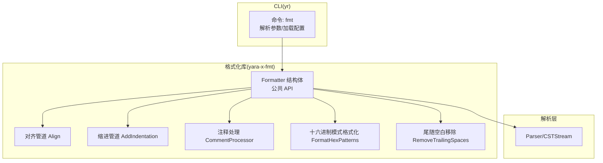
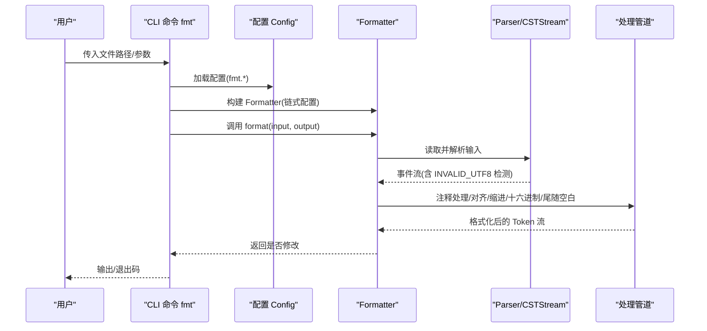
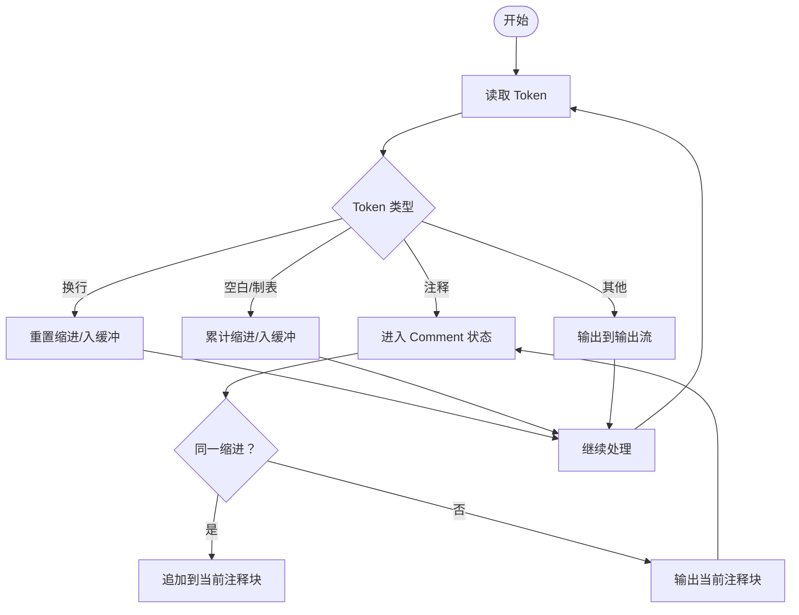
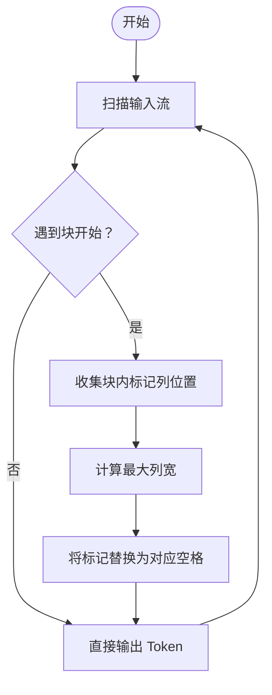
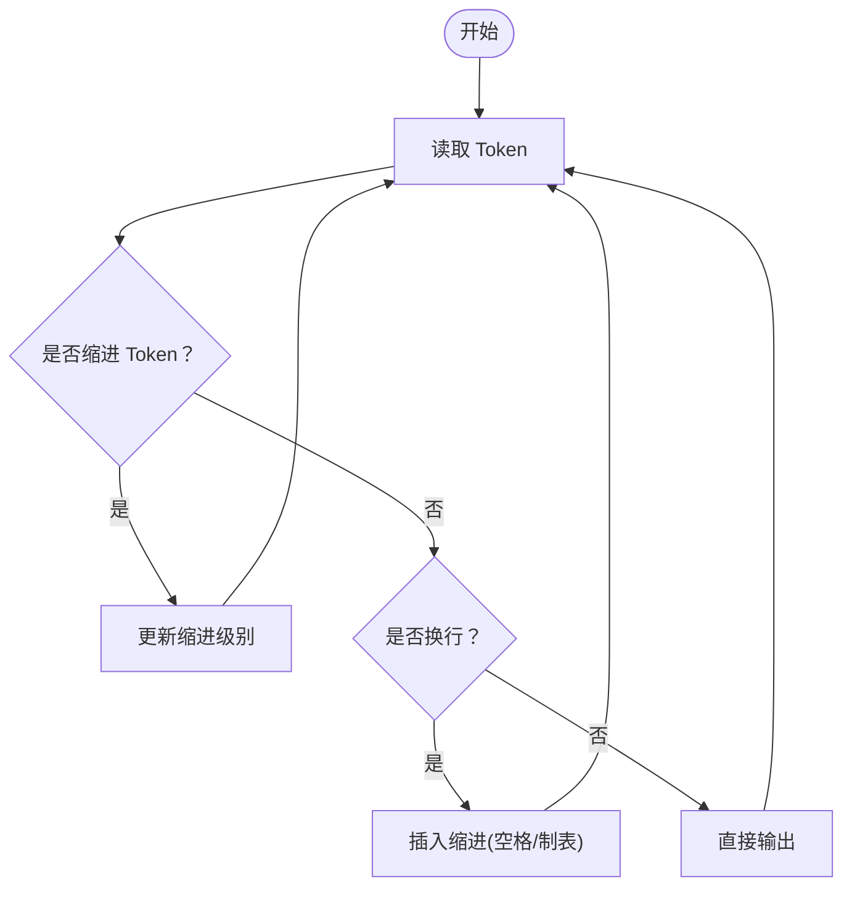
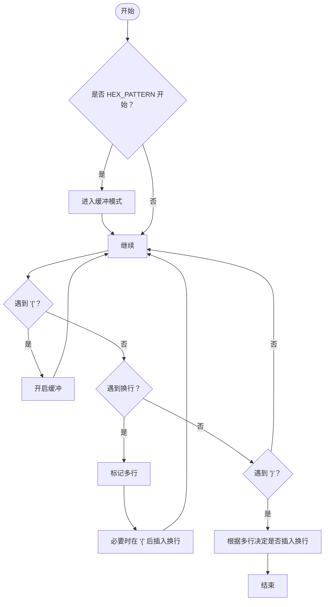
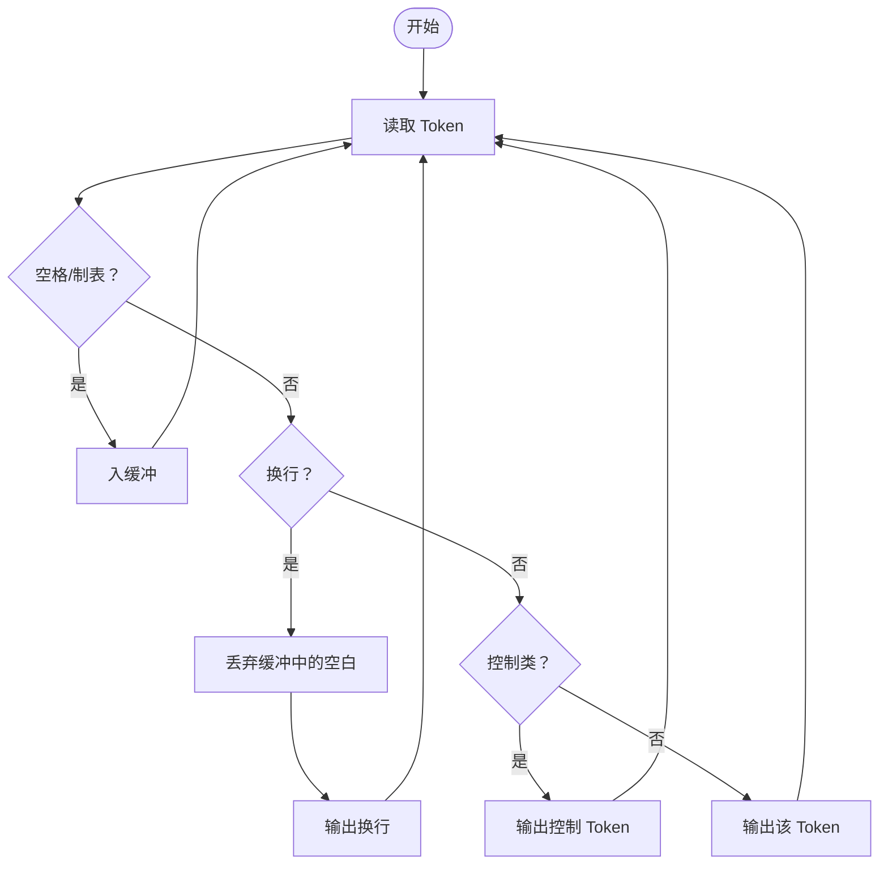
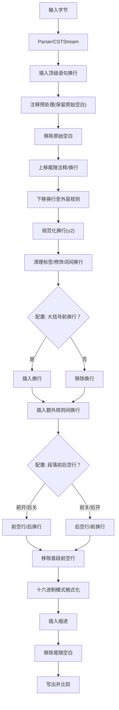

# 代码格式化器

<cite>
**本文引用的文件**
- [cli/src/commands/fmt.rs](file://yara-x/cli/src/commands/fmt.rs)
- [cli/src/config.rs](file://yara-x/cli/src/config.rs)
- [fmt/src/lib.rs](file://yara-x/fmt/src/lib.rs)
- [fmt/src/align.rs](file://yara-x/fmt/src/align.rs)
- [fmt/src/indentation.rs](file://yara-x/fmt/src/indentation.rs)
- [fmt/src/comments.rs](file://yara-x/fmt/src/comments.rs)
- [fmt/src/trailing_spaces.rs](file://yara-x/fmt/src/trailing_spaces.rs)
- [fmt/src/format_hex_patterns.rs](file://yara-x/fmt/src/format_hex_patterns.rs)
- [fmt/Cargo.toml](file://yara-x/fmt/Cargo.toml)
- [cli/Cargo.toml](file://yara-x/cli/Cargo.toml)
</cite>

## 目录
1. [简介](#简介)
2. [项目结构](#项目结构)
3. [核心组件](#核心组件)
4. [架构总览](#架构总览)
5. [详细组件分析](#详细组件分析)
6. [依赖关系分析](#依赖关系分析)
7. [性能考量](#性能考量)
8. [故障排查指南](#故障排查指南)
9. [结论](#结论)
10. [附录](#附录)

## 简介
本文件系统性阐述 yara-x 代码格式化器（YARA 规则格式化器）的设计与实现，覆盖以下主题：
- 格式化算法与处理流水线
- 配置项与命令行参数
- 各类格式化选项（缩进、对齐、注释、空行、换行等）
- 配置文件示例与命令行用法
- 格式化前后对比示例
- 扩展机制与自定义规则开发方法

该格式化器以解析器生成的 CST（具体语法树）为输入，通过多阶段 Token 流处理器完成格式化，最终输出符合约定风格的 YARA 源码。

## 项目结构
格式化器位于独立 crate yara-x-fmt 中，CLI 程序 yr 通过命令调用格式化功能，并从配置文件加载默认格式化策略。

图表来源
- [cli/src/commands/fmt.rs:35-83](file://yara-x/cli/src/commands/fmt.rs#L35-L83)
- [fmt/src/lib.rs:74-418](file://yara-x/fmt/src/lib.rs#L74-L418)
- [fmt/src/align.rs:35-124](file://yara-x/fmt/src/align.rs#L35-L124)
- [fmt/src/indentation.rs:11-87](file://yara-x/fmt/src/indentation.rs#L11-L87)
- [fmt/src/comments.rs:67-355](file://yara-x/fmt/src/comments.rs#L67-L355)
- [fmt/src/format_hex_patterns.rs:7-118](file://yara-x/fmt/src/format_hex_patterns.rs#L7-L118)
- [fmt/src/trailing_spaces.rs:7-102](file://yara-x/fmt/src/trailing_spaces.rs#L7-L102)

章节来源
- [cli/src/commands/fmt.rs:12-83](file://yara-x/cli/src/commands/fmt.rs#L12-L83)
- [cli/src/config.rs:14-211](file://yara-x/cli/src/config.rs#L14-L211)
- [fmt/src/lib.rs:74-418](file://yara-x/fmt/src/lib.rs#L74-L418)

## 核心组件
- Formatter：格式化器主体，提供链式配置 API 与 format 方法；内部通过多阶段处理器构建 Token 流并写出结果。
- 处理管道：
  - 注释处理：识别块注释、行尾注释、行首注释、内联注释，维持注释原始缩进并按位置分类。
  - 对齐：在声明块中插入对齐标记，计算列宽后统一等号对齐。
  - 缩进：根据缩进级别与缩进方式（空格/制表符）在换行后插入相应数量的空格或制表符。
  - 十六进制模式格式化：确保多行十六进制模式的花括号换行与缩进一致。
  - 尾随空白移除：仅保留控制类 Token，丢弃行末空格与制表符。
- 解析层：基于 Parser 与 CSTStream 生成事件流，用于检测无效 UTF-8 并作为 Token 流输入。

章节来源
- [fmt/src/lib.rs:74-418](file://yara-x/fmt/src/lib.rs#L74-L418)
- [fmt/src/align.rs:35-124](file://yara-x/fmt/src/align.rs#L35-L124)
- [fmt/src/indentation.rs:11-87](file://yara-x/fmt/src/indentation.rs#L11-L87)
- [fmt/src/comments.rs:67-355](file://yara-x/fmt/src/comments.rs#L67-L355)
- [fmt/src/format_hex_patterns.rs:7-118](file://yara-x/fmt/src/format_hex_patterns.rs#L7-L118)
- [fmt/src/trailing_spaces.rs:7-102](file://yara-x/fmt/src/trailing_spaces.rs#L7-L102)

## 架构总览
下图展示了从 CLI 到格式化器再到各处理管道的整体流程。

图表来源
- [cli/src/commands/fmt.rs:35-83](file://yara-x/cli/src/commands/fmt.rs#L35-L83)
- [fmt/src/lib.rs:376-418](file://yara-x/fmt/src/lib.rs#L376-L418)

## 详细组件分析

### Formatter 结构与公共 API
- 关键字段与默认值：
  - 元数据对齐：默认开启
  - 模式对齐：默认开启
  - 缩进级别：默认 2 空格
  - 缩进方式：空格
  - 规则大括号换行：默认关闭
  - 段落前后空行：默认开启前、关闭后
  - 输入 Tab 宽度：默认 4
- 链式配置方法：
  - align_metadata/align_patterns：控制元数据与字符串声明的等号对齐
  - indent_section_headers/indent_section_contents：控制段落标题与内容缩进
  - indentation：指定使用空格数或制表符
  - input_tab_size：输入源中 Tab 的空间宽度
  - newline_before_curly_brace：规则大括号前换行
  - empty_line_before_section_header/empty_line_after_section_header：段落前后空行
- format 方法：
  - 读取输入字节，构建 CSTStream 并检查无效 UTF-8
  - 生成 Token 流，依次经过各处理管道
  - 写出到输出并返回是否修改

章节来源
- [fmt/src/lib.rs:74-418](file://yara-x/fmt/src/lib.rs#L74-L418)

### 处理流水线详解

#### 注释处理（CommentProcessor）
- 功能：将原始注释 Token 分类为块注释、行首注释、行尾注释、内联注释，并保持注释缩进一致性。
- 关键点：
  - 使用 tab_size 控制制表符宽度
  - 维护状态机：PreComment 与 Comment，处理换行与注释块合并
  - 多行注释按行拆分并去除与缩进相关的前置空白

图表来源
- [fmt/src/comments.rs:156-306](file://yara-x/fmt/src/comments.rs#L156-L306)

章节来源
- [fmt/src/comments.rs:67-355](file://yara-x/fmt/src/comments.rs#L67-L355)

#### 对齐（Align）
- 功能：在声明块中插入对齐标记，计算最大列宽后用可变长度空格替换标记，实现等号对齐。
- 关键点：
  - 需要块起止标记包裹对齐区域
  - 遇到换行时重置列计数
  - 输出时将标记替换为空格

图表来源
- [fmt/src/align.rs:58-123](file://yara-x/fmt/src/align.rs#L58-L123)

章节来源
- [fmt/src/align.rs:35-124](file://yara-x/fmt/src/align.rs#L35-L124)

#### 缩进（AddIndentation）
- 功能：在换行后根据当前缩进级别与方式（空格数或制表符）插入相应缩进。
- 关键点：
  - 通过 Token::Indentation 变更缩进级别
  - 在换行后插入指定数量空格或一个制表符

图表来源
- [fmt/src/indentation.rs:41-86](file://yara-x/fmt/src/indentation.rs#L41-L86)

章节来源
- [fmt/src/indentation.rs:11-87](file://yara-x/fmt/src/indentation.rs#L11-L87)

#### 十六进制模式格式化（FormatHexPatterns）
- 功能：确保十六进制模式的花括号换行与多行格式一致。
- 关键点：
  - 进入 HEX_PATTERN 时启用缓冲
  - 遇到换行时在开头插入换行（多行模式）
  - 结束时若非多行则不额外换行

图表来源
- [fmt/src/format_hex_patterns.rs:39-117](file://yara-x/fmt/src/format_hex_patterns.rs#L39-L117)

章节来源
- [fmt/src/format_hex_patterns.rs:7-118](file://yara-x/fmt/src/format_hex_patterns.rs#L7-L118)

#### 尾随空白移除（RemoveTrailingSpaces）
- 功能：丢弃行末空格与制表符，保留控制类 Token。
- 关键点：
  - 遇到换行前清空缓冲中的空白
  - 非控制类 Token 则输出该 Token

图表来源
- [fmt/src/trailing_spaces.rs:30-70](file://yara-x/fmt/src/trailing_spaces.rs#L30-L70)

章节来源
- [fmt/src/trailing_spaces.rs:7-102](file://yara-x/fmt/src/trailing_spaces.rs#L7-L102)

### 命令行与配置

#### 命令行参数
- 文件列表：必需，支持多次传入
- 检查模式：-c/--check，仅检查不写回
- Tab 大小：--tab-size，默认 4，用于正确处理混合空格/制表的输入

章节来源
- [cli/src/commands/fmt.rs:12-33](file://yara-x/cli/src/commands/fmt.rs#L12-L33)

#### 配置文件（TOML）
- 顶层结构：fmt（格式化）、check（检查）、warnings（警告）
- fmt.rule：控制段落缩进、换行与空行
  - indent_section_headers：段落标题缩进
  - indent_section_contents：段落内容缩进
  - indent_spaces：缩进空格数，0 表示制表符
  - newline_before_curly_brace：规则大括号前换行
  - empty_line_before_section_header：段落前空行
  - empty_line_after_section_header：段落后空行
- fmt.meta/patterns：对齐开关
  - align_values：元数据/模式声明等号对齐

章节来源
- [cli/src/config.rs:24-197](file://yara-x/cli/src/config.rs#L24-L197)

#### CLI 如何应用配置
- CLI 读取配置后，逐项映射到 Formatter 的链式配置方法
- 支持命令行覆盖配置文件中的部分选项（例如 --tab-size）

章节来源
- [cli/src/commands/fmt.rs:35-57](file://yara-x/cli/src/commands/fmt.rs#L35-L57)

### 格式化算法与处理顺序
- 步骤概览：
  1) 插入顶级语句之间的换行（规则/导入/包含）
  2) 注释预处理（保留原始空白，维持注释缩进）
  3) 移除原始空白
  4) 上移尾随注释与换行至最近规则内
  5) 下移换行至外层规则边界
  6) 规范化多余换行（最多两个）
  7) 规则标签/修饰词间换行清理
  8) 规则大括号前换行（按配置）
  9) 段落前后空行（按配置）
  10) 十六进制模式格式化
  11) 缩进插入（按配置）
  12) 尾随空白移除
  13) 写出结果并比较输入/输出判断是否修改

图表来源
- [fmt/src/lib.rs:422-818](file://yara-x/fmt/src/lib.rs#L422-L818)

章节来源
- [fmt/src/lib.rs:422-818](file://yara-x/fmt/src/lib.rs#L422-L818)

### 配置选项与行为说明
- 缩进设置
  - indent_section_headers：段落标题是否缩进
  - indent_section_contents：段落内容是否在标题基础上再缩进
  - indent_spaces：缩进空格数，0 表示使用制表符
  - indentation：显式指定 Indentation::Spaces 或 Indentation::Tabs
- 对齐方式
  - align_metadata：元数据键值对等号对齐
  - align_patterns：字符串声明等号对齐
- 注释处理
  - 注释分类与缩进保持由 CommentProcessor 负责
  - tab_size 影响制表符换算为空格数
- 换行与空行
  - newline_before_curly_brace：规则大括号前换行
  - empty_line_before_section_header/empty_line_after_section_header：段落前后空行
- 十六进制模式
  - 自动保证多行模式的花括号换行与缩进

章节来源
- [fmt/src/lib.rs:109-367](file://yara-x/fmt/src/lib.rs#L109-L367)
- [fmt/src/comments.rs:112-118](file://yara-x/fmt/src/comments.rs#L112-L118)
- [fmt/src/format_hex_patterns.rs:60-103](file://yara-x/fmt/src/format_hex_patterns.rs#L60-L103)

### 命令行参数与配置文件示例
- 命令行
  - yr fmt <FILE...> [--check] [--tab-size N]
- 配置文件（TOML）
  - 示例字段（摘自结构体定义）：
    - fmt.rule.indent_section_headers
    - fmt.rule.indent_section_contents
    - fmt.rule.indent_spaces
    - fmt.rule.newline_before_curly_brace
    - fmt.rule.empty_line_before_section_header
    - fmt.rule.empty_line_after_section_header
    - fmt.meta.align_values
    - fmt.patterns.align_values

章节来源
- [cli/src/commands/fmt.rs:12-33](file://yara-x/cli/src/commands/fmt.rs#L12-L33)
- [cli/src/config.rs:134-197](file://yara-x/cli/src/config.rs#L134-L197)

### 格式化前后对比示例
- 元数据对齐：等号对齐前后对比
- 字符串对齐：等号对齐前后对比
- 段落前后空行：开启/关闭效果对比
- 大括号前换行：开启/关闭效果对比
- 十六进制模式：单行/多行对比
- 缩进：空格/制表、缩进层级对比
- 注释：块/行尾/行首/内联注释位置与缩进对比

说明：本仓库提供了大量测试用例，涵盖上述场景。建议参考测试数据目录以获得具体示例。

章节来源
- [fmt/src/lib.rs:109-367](file://yara-x/fmt/src/lib.rs#L109-L367)

### 扩展机制与自定义规则
- 扩展点
  - 新增处理管道：实现 TokenStream 特性，插入到现有流水线中
  - 新增对齐规则：在声明块中插入对齐标记，交由 Align 管道统一处理
  - 新增换行/空行规则：通过 Processor::add_rule 添加条件动作
- 开发步骤
  - 定义新处理模块与迭代器
  - 在 Formatter::format_impl 中接入新管道
  - 提供配置项（如需要）并在 CLI 映射到链式 API
  - 编写单元测试与端到端测试用例

章节来源
- [fmt/src/lib.rs:422-818](file://yara-x/fmt/src/lib.rs#L422-L818)

## 依赖关系分析
- CLI 依赖 yara-x-fmt 提供格式化能力
- yara-x-fmt 依赖 yara-x-parser 生成 CST 与事件流
- yara-x-fmt 内部模块解耦，通过 Token 流串联

图表来源
- [cli/Cargo.toml:63-67](file://yara-x/cli/Cargo.toml#L63-L67)
- [fmt/Cargo.toml:15-20](file://yara-x/fmt/Cargo.toml#L15-L20)

章节来源
- [cli/Cargo.toml:45-67](file://yara-x/cli/Cargo.toml#L45-L67)
- [fmt/Cargo.toml:15-20](file://yara-x/fmt/Cargo.toml#L15-L20)

## 性能考量
- 流水线处理：所有阶段均基于迭代器，避免一次性构建完整中间表示，降低内存峰值
- Token 流：按需消费与缓冲，减少不必要的拷贝
- 对齐计算：仅在声明块内进行列宽统计，复杂度与声明数量线性相关
- 注释处理：按行拆分与缩进调整，受注释行数影响
- 十六进制模式：仅在匹配到 HEX_PATTERN 时启用缓冲逻辑

## 故障排查指南
- 无效 UTF-8
  - 现象：format 返回错误，包含 Span
  - 排查：确认输入编码；必要时转换为有效 UTF-8
- 输出未变化
  - 现象：进程退出码非零（当有修改时）
  - 排查：检查配置是否过于严格；确认 --check 是否误用
- 缩进异常
  - 现象：混合空格/制表导致对齐错位
  - 排查：调整 --tab-size 与配置中的 input_tab_size，确保一致
- 注释缩进错乱
  - 现象：注释块缩进不一致
  - 排查：确认 tab_size 设置；避免在注释中混用不同缩进

章节来源
- [fmt/src/lib.rs:48-62](file://yara-x/fmt/src/lib.rs#L48-L62)
- [cli/src/commands/fmt.rs:78-82](file://yara-x/cli/src/commands/fmt.rs#L78-L82)
- [fmt/src/comments.rs:112-118](file://yara-x/fmt/src/comments.rs#L112-L118)

## 结论
yara-x 格式化器通过清晰的流水线设计与可配置的策略，实现了对 YARA 规则的稳定格式化。其模块化结构便于扩展与维护，同时提供丰富的配置选项以满足团队风格要求。建议在团队内统一配置文件与 CI 检查流程，以获得一致的代码风格。

## 附录
- 相关文件清单
  - CLI 命令与配置：cli/src/commands/fmt.rs, cli/src/config.rs
  - 格式化库：fmt/src/lib.rs, fmt/src/align.rs, fmt/src/indentation.rs, fmt/src/comments.rs, fmt/src/format_hex_patterns.rs, fmt/src/trailing_spaces.rs
  - 依赖声明：cli/Cargo.toml, fmt/Cargo.toml