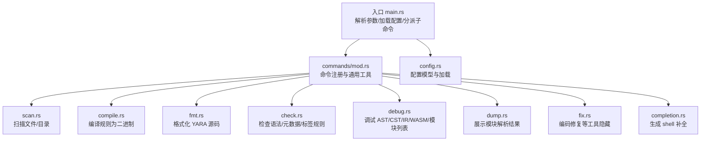
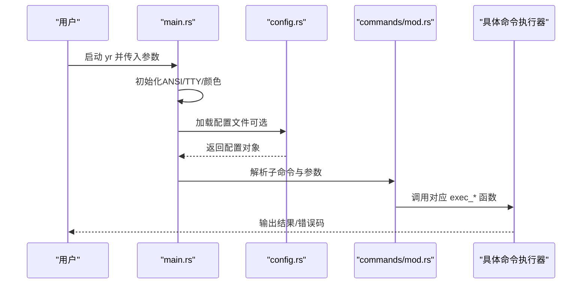
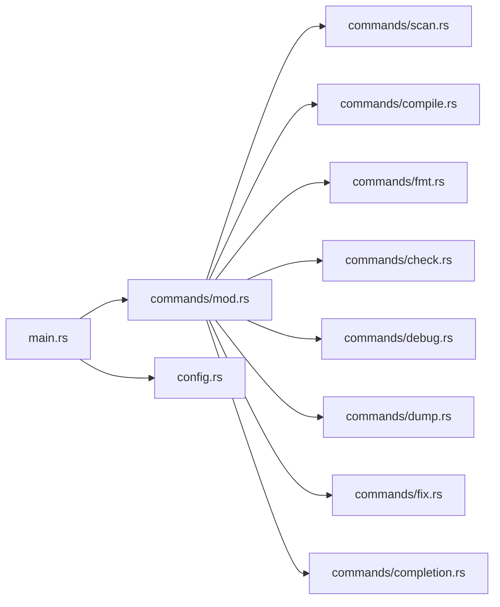

# 命令行工具

<cite>
**本文引用的文件**
- [main.rs](file://yara-x/cli/src/main.rs)
- [mod.rs](file://yara-x/cli/src/commands/mod.rs)
- [scan.rs](file://yara-x/cli/src/commands/scan.rs)
- [compile.rs](file://yara-x/cli/src/commands/compile.rs)
- [fmt.rs](file://yara-x/cli/src/commands/fmt.rs)
- [check.rs](file://yara-x/cli/src/commands/check.rs)
- [debug.rs](file://yara-x/cli/src/commands/debug.rs)
- [dump.rs](file://yara-x/cli/src/commands/dump.rs)
- [fix.rs](file://yara-x/cli/src/commands/fix.rs)
- [completion.rs](file://yara-x/cli/src/commands/completion.rs)
- [config.rs](file://yara-x/cli/src/config.rs)
- [Cargo.toml](file://yara-x/Cargo.toml)
- [commands.md](file://yara-x/site/content/docs/cli/commands.md)
</cite>

## 目录
1. [简介](#简介)
2. [项目结构](#项目结构)
3. [核心组件](#核心组件)
4. [架构总览](#架构总览)
5. [详细组件分析](#详细组件分析)
6. [依赖关系分析](#依赖关系分析)
7. [性能考虑](#性能考虑)
8. [故障排查指南](#故障排查指南)
9. [结论](#结论)
10. [附录](#附录)

## 简介
本文件为命令行工具（yr）的完整参考文档，覆盖以下内容：
- 所有可用子命令：scan、compile、fmt、check、debug、dump、fix、completion 的功能、参数与使用要点
- 配置文件格式与全局选项说明
- 输出格式与日志行为
- 常见使用场景与组合示例
- 性能优化建议与与其他工具链的集成思路

## 项目结构
yr 是一个基于 Rust 的多模块工作区，CLI 子命令集中在 yara-x/cli 模块中，通过统一入口解析参数并分派到各命令执行器。

图表来源
- [main.rs:31-107](file://yara-x/cli/src/main.rs#L31-L107)
- [mod.rs:49-71](file://yara-x/cli/src/commands/mod.rs#L49-L71)
- [config.rs:11-22](file://yara-x/cli/src/config.rs#L11-L22)

章节来源
- [main.rs:31-107](file://yara-x/cli/src/main.rs#L31-L107)
- [mod.rs:49-71](file://yara-x/cli/src/commands/mod.rs#L49-L71)
- [Cargo.toml:17-30](file://yara-x/Cargo.toml#L17-L30)

## 核心组件
- 入口与生命周期
  - 初始化 ANSI 支持、TTY 自动检测、颜色开关、全局 panic 处理
  - 解析全局参数（如 --config），加载用户配置文件
  - 分派到具体子命令执行器
- 通用命令框架
  - 统一帮助模板、子命令注册、外部变量解析、路径命名空间解析
  - 编译器创建与警告控制、include 目录、忽略模块等通用能力
- 配置系统
  - TOML 配置文件加载，支持 fmt、check、warnings 三大域
  - 默认值与字段校验（deny_unknown_fields）

章节来源
- [main.rs:31-107](file://yara-x/cli/src/main.rs#L31-L107)
- [mod.rs:49-71](file://yara-x/cli/src/commands/mod.rs#L49-L71)
- [config.rs:11-210](file://yara-x/cli/src/config.rs#L11-L210)

## 架构总览
yr 的命令分派流程如下：

图表来源
- [main.rs:31-107](file://yara-x/cli/src/main.rs#L31-L107)
- [config.rs:202-210](file://yara-x/cli/src/config.rs#L202-L210)
- [mod.rs:84-95](file://yara-x/cli/src/commands/mod.rs#L84-L95)

## 详细组件分析

### scan 命令
- 功能：对单个文件或目录进行规则匹配扫描；支持已编译规则与源码编译两种模式
- 关键参数
  - 规则输入：支持命名空间前缀的路径（如 ns:rules.yar），可多次指定
  - 目标输入：文件或目录；支持从文件读取待扫描路径列表
  - 输出格式：text/json/ndjson，默认 text
  - 控制选项：线程数、超时、递归深度、跳过大文件、内存映射开关、每模式最大匹配数
  - 结果增强：打印命名空间、元数据、标签、字符串（可限制长度）、仅打印不满足规则
  - 外部变量与模块数据：用于注入全局变量与模块额外数据
  - 警告与模块忽略：可禁用特定或全部警告，忽略指定模块
  - 规则名/标签过滤：仅输出命中指定标签的规则
  - 性能剖析：在启用特性时输出最慢规则统计
- 典型用法
  - 源码编译后扫描：先 compile 再 scan --compiled-rules
  - 多线程与超时：--threads 与 --timeout
  - JSON/NDJSON 输出：便于后续工具处理
- 注意事项
  - 使用 --compiled-rules 时仅接受单一规则文件
  - --recursive 不能与文件目标混用
  - --profiling 需要构建时启用相应特性

章节来源
- [scan.rs:44-204](file://yara-x/cli/src/commands/scan.rs#L44-L204)
- [scan.rs:251-562](file://yara-x/cli/src/commands/scan.rs#L251-L562)
- [commands.md:51-349](file://yara-x/site/content/docs/cli/commands.md#L51-L349)

### compile 命令
- 功能：将一个或多个 YARA 源文件编译为二进制规则集，供 scan --compiled-rules 使用
- 关键参数
  - 规则输入：同 scan 的命名空间路径
  - 输出：默认 output.yarc，可通过 --output 指定
  - 外部变量：--define 注入全局变量
  - 警告控制、模块忽略、include 目录、正则表达式宽松模式
- 典型用法
  - 将多源规则合并为单一二进制文件，提升重复扫描效率

章节来源
- [compile.rs:13-70](file://yara-x/cli/src/commands/compile.rs#L13-L70)
- [compile.rs:72-91](file://yara-x/cli/src/commands/compile.rs#L72-L91)

### fmt 命令
- 功能：格式化 YARA 源文件，支持“检查模式”（不修改，仅返回是否需要改动）
- 关键参数
  - 文件列表：可多次指定
  - --check：检查模式
  - --tab-size：制表符宽度（空格数）
- 配置联动
  - 读取配置中的格式化策略（缩进、对齐、换行等），并与命令行参数协同
- 典型用法
  - CI 中以 --check 检查格式一致性

章节来源
- [fmt.rs:12-33](file://yara-x/cli/src/commands/fmt.rs#L12-L33)
- [fmt.rs:35-84](file://yara-x/cli/src/commands/fmt.rs#L35-L84)
- [config.rs:24-197](file://yara-x/cli/src/config.rs#L24-L197)

### check 命令
- 功能：检查源文件的语法正确性与元数据/规则名/标签等规范（当前处于隐藏状态）
- 关键参数
  - 输入：单个文件或目录
  - 过滤：--filter 支持多模式
  - 递归深度：--recursive
  - 线程数：--threads
- 配置联动
  - 依据配置对元数据类型、正则、必填项、规则名正则、标签白名单/正则进行校验
- 退出码
  - 发生错误：1；仅警告：2；无问题：0

章节来源
- [check.rs:18-52](file://yara-x/cli/src/commands/check.rs#L18-L52)
- [check.rs:66-282](file://yara-x/cli/src/commands/check.rs#L66-L282)
- [config.rs:75-131](file://yara-x/cli/src/config.rs#L75-L131)

### debug 命令（条件编译）
- 子命令
  - ast/cst：打印 AST/CST
  - ir：打印中间表示（IR），可注入外部变量
  - wasm：导出 WASM 文件
  - modules：列出可用模块
- 适用场景：规则开发与诊断、WASM 产物生成与验证

章节来源
- [debug.rs:20-91](file://yara-x/cli/src/commands/debug.rs#L20-L91)
- [debug.rs:93-172](file://yara-x/cli/src/commands/debug.rs#L93-L172)

### dump 命令
- 功能：展示针对二进制文件由各模块（PE/Mach-O/ELF/DotNET/LNK/CRX）提取的数据
- 关键参数
  - 输入：文件路径或从标准输入读取
  - --module：选择模块集合
  - --output-format：json/yaml，默认 yaml
  - --no-colors：关闭颜色输出
- 典型用法
  - 快速查看文件结构信息，配合 jq 等工具处理

章节来源
- [dump.rs:32-62](file://yara-x/cli/src/commands/dump.rs#L32-L62)
- [dump.rs:74-162](file://yara-x/cli/src/commands/dump.rs#L74-L162)

### fix 命令（隐藏）
- 子命令
  - encoding：将源文件转换为 UTF-8（可干跑）
- 参数与行为
  - 支持过滤、递归、线程、干跑模式
  - 输出修改统计

章节来源
- [fix.rs:14-21](file://yara-x/cli/src/commands/fix.rs#L14-L21)
- [fix.rs:65-145](file://yara-x/cli/src/commands/fix.rs#L65-L145)

### completion 命令
- 功能：输出指定 Shell 的补全代码
- 参数：Shell 名称（bash/zsh/fish等）

章节来源
- [completion.rs:7-17](file://yara-x/cli/src/commands/completion.rs#L7-L17)
- [completion.rs:19-26](file://yara-x/cli/src/commands/completion.rs#L19-L26)

### 配置文件与全局选项
- 配置文件位置与加载
  - 优先使用 --config 指定的路径
  - 否则尝试 $HOME/.yara-x.toml（若存在）
- 配置结构
  - fmt：规则/元数据/模式段落的格式化策略
  - check：元数据类型/正则/必填、规则名正则、标签白名单/正则
  - warnings：按警告 ID 控制是否禁用
- 全局选项
  - --config：指定配置文件
  - 日志：在启用 logging 特性时初始化 env_logger

章节来源
- [main.rs:61-82](file://yara-x/cli/src/main.rs#L61-L82)
- [config.rs:11-22](file://yara-x/cli/src/config.rs#L11-L22)
- [config.rs:202-210](file://yara-x/cli/src/config.rs#L202-L210)

## 依赖关系分析
yr 的命令体系围绕统一的命令注册与参数解析展开，并共享编译器创建、警告控制、路径遍历等通用逻辑。

图表来源
- [main.rs:31-107](file://yara-x/cli/src/main.rs#L31-L107)
- [mod.rs:49-71](file://yara-x/cli/src/commands/mod.rs#L49-L71)

章节来源
- [Cargo.toml:17-30](file://yara-x/Cargo.toml#L17-L30)
- [mod.rs:149-213](file://yara-x/cli/src/commands/mod.rs#L149-L213)

## 性能考虑
- 线程与并发
  - 使用 --threads 控制扫描线程数，默认按 CPU 核心数
- 超时与资源控制
  - 使用 --timeout 在扫描过程中设置剩余时间上限
  - 使用 --skip-larger 跳过超大文件，避免不必要的 IO
- I/O 与内存映射
  - 默认使用内存映射加速大文件扫描；如需规避 SIGBUS 风险可使用 --no-mmap
- 输出格式
  - ndjson 适合流式处理与后续工具链解析
- 规则剖析
  - 在启用特性时使用 --profiling 定位最慢规则，优化模式匹配与条件表达式

章节来源
- [scan.rs:340-344](file://yara-x/cli/src/commands/scan.rs#L340-L344)
- [scan.rs:346-348](file://yara-x/cli/src/commands/scan.rs#L346-L348)
- [scan.rs:403-405](file://yara-x/cli/src/commands/scan.rs#L403-L405)
- [scan.rs:417-424](file://yara-x/cli/src/commands/scan.rs#L417-L424)
- [scan.rs:171-176](file://yara-x/cli/src/commands/scan.rs#L171-L176)
- [commands.md:227-271](file://yara-x/site/content/docs/cli/commands.md#L227-L271)

## 故障排查指南
- 错误输出与颜色
  - 当 stdout 不是 TTY 时自动关闭颜色，避免重定向到文件时出现转义字符
  - 编译/扫描错误会彩色显示（在 TTY 上）
- 退出码
  - scan：遇到错误直接退出（非零）
  - check：错误=1，仅警告=2，成功=0
- 常见问题
  - --compiled-rules 与多规则文件冲突
  - --recursive 与文件目标混用
  - --profiling 需要构建时启用特性
- 调试辅助
  - 使用 debug 子命令（ast/cst/ir/wasm/modules）进行规则级诊断

章节来源
- [main.rs:44-46](file://yara-x/cli/src/main.rs#L44-L46)
- [main.rs:97-104](file://yara-x/cli/src/main.rs#L97-L104)
- [check.rs:271-281](file://yara-x/cli/src/commands/check.rs#L271-L281)
- [scan.rs:288-293](file://yara-x/cli/src/commands/scan.rs#L288-L293)
- [debug.rs:93-101](file://yara-x/cli/src/commands/debug.rs#L93-L101)

## 结论
yr 提供了从规则编写、格式化、检查、编译到扫描、剖析与模块数据导出的完整工具链。通过统一的配置与参数体系，用户可在本地与 CI 环境中高效地管理与执行规则，结合输出格式与并行控制实现高吞吐与可维护性。

## 附录

### 常用命令组合示例
- 规则开发流水线
  - 编写/修改规则 → fmt --check（CI）→ check（隐藏）→ compile → scan --output-format ndjson
- 扫描自动化
  - scan --threads 8 --timeout 60 --output-format json 目录
- 模块数据探索
  - dump --module=pe,dotnet --output-format yaml file.bin

章节来源
- [commands.md:51-471](file://yara-x/site/content/docs/cli/commands.md#L51-L471)

### 配置文件字段说明（摘要）
- fmt.rule.*：缩进、换行、空行、对齐等
- fmt.meta/patterns：元数据/模式对齐
- check.metadata.*：元数据类型、正则、必填、错误级别
- check.rule_name：规则名正则与错误级别
- check.tags：标签白名单或正则与错误级别
- warnings.*：按警告 ID 禁用

章节来源
- [config.rs:14-197](file://yara-x/cli/src/config.rs#L14-L197)