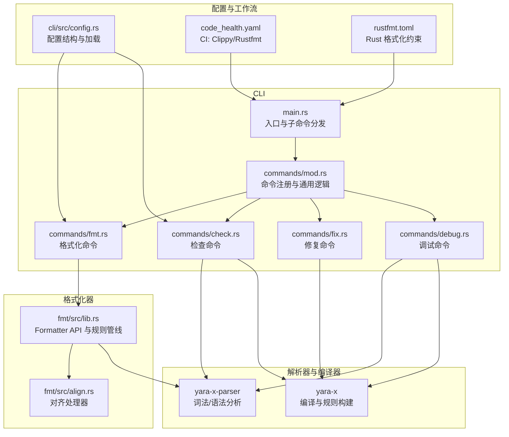
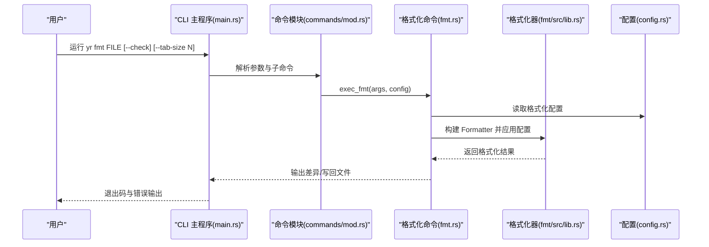
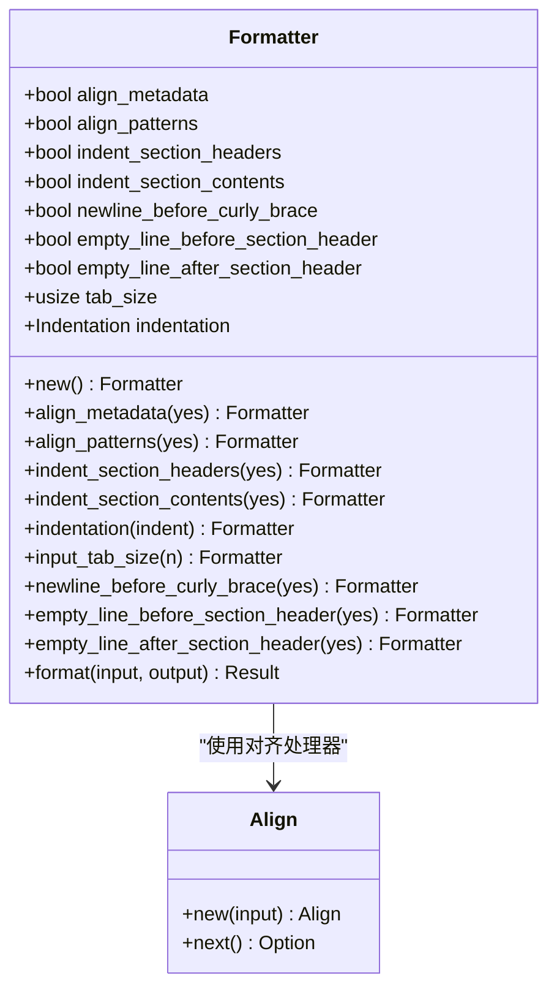
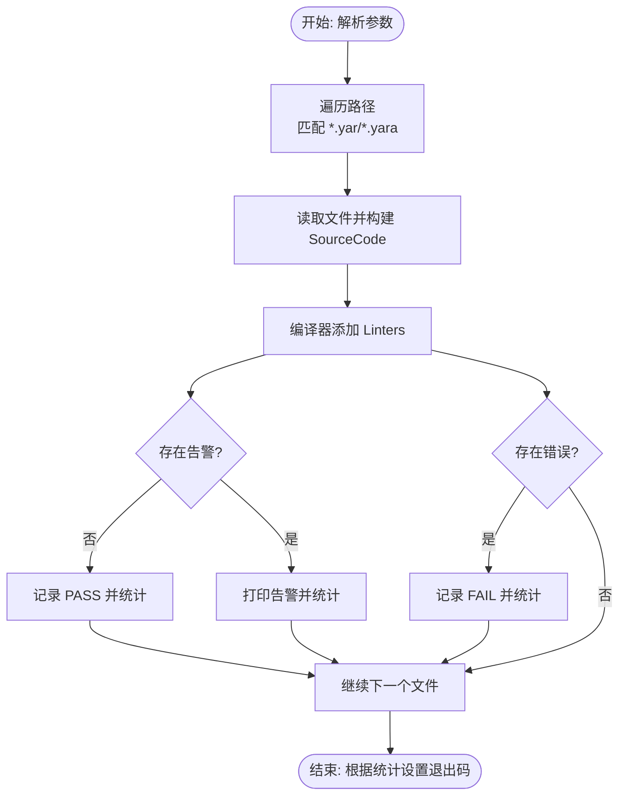
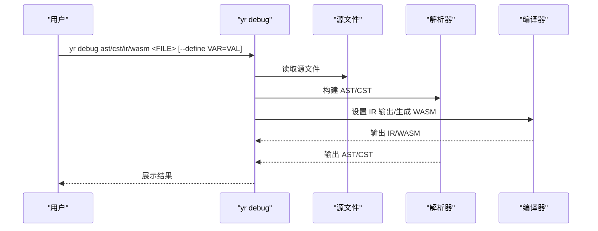
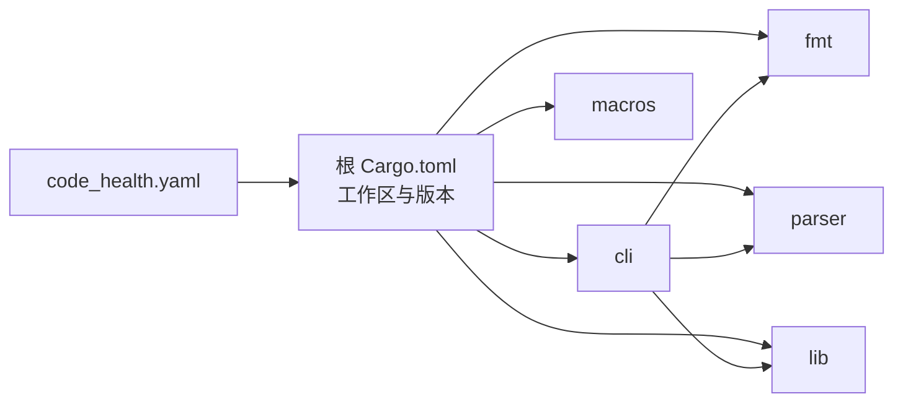

# 开发工具

<cite>
**本文引用的文件**
- [Cargo.toml](file://Cargo.toml)
- [rustfmt.toml](file://rustfmt.toml)
- [main.rs](file://cli/src/main.rs)
- [mod.rs（命令模块）](file://cli/src/commands/mod.rs)
- [fmt 命令实现](file://cli/src/commands/fmt.rs)
- [check 命令实现](file://cli/src/commands/check.rs)
- [fix 命令实现](file://cli/src/commands/fix.rs)
- [debug 命令实现](file://cli/src/commands/debug.rs)
- [配置加载与结构](file://cli/src/config.rs)
- [格式化器库入口](file://fmt/src/lib.rs)
- [对齐处理器](file://fmt/src/align.rs)
- [代码健康工作流](file://.github/workflows/code_health.yaml)
</cite>

## 目录
1. [简介](#简介)
2. [项目结构](#项目结构)
3. [核心组件](#核心组件)
4. [架构总览](#架构总览)
5. [详细组件分析](#详细组件分析)
6. [依赖关系分析](#依赖关系分析)
7. [性能考量](#性能考量)
8. [故障排查指南](#故障排查指南)
9. [结论](#结论)
10. [附录](#附录)

## 简介
本文件面向 yara-x 项目的开发工具链，系统性介绍以下能力：
- 代码格式化器：使用方法、配置项、可定制规则与行为
- 语法检查器：规则校验、告警与错误报告、自动修复能力
- 调试工具：AST/CST/IR/WASM 输出、模块枚举、外部变量注入
- 批处理脚本与 CI/CD 集成：工作流与最佳实践
- 开发工作流优化与团队协作建议

## 项目结构
yara-x 采用多 crate 的工作区组织方式，开发工具主要分布在 CLI、格式化器、解析器与工作流配置中：
- CLI 提供统一入口与子命令（fmt、check、fix、debug 等）
- 格式化器独立 crate，提供可编程的格式化 API 与默认规则
- 解析器负责词法/语法分析，为检查与调试提供基础
- GitHub Actions 定义了代码健康检查（Clippy、Rustfmt）

图表来源
- [main.rs:31-107](file://cli/src/main.rs#L31-L107)
- [mod.rs（命令模块）:49-71](file://cli/src/commands/mod.rs#L49-L71)
- [fmt 命令实现:12-33](file://cli/src/commands/fmt.rs#L12-L33)
- [check 命令实现:18-52](file://cli/src/commands/check.rs#L18-L52)
- [fix 命令实现:14-21](file://cli/src/commands/fix.rs#L14-L21)
- [debug 命令实现:82-91](file://cli/src/commands/debug.rs#L82-L91)
- [格式化器库入口:74-107](file://fmt/src/lib.rs#L74-L107)
- [对齐处理器:35-50](file://fmt/src/align.rs#L35-L50)
- [配置加载与结构:12-22](file://cli/src/config.rs#L12-L22)
- [代码健康工作流:1-24](file://.github/workflows/code_health.yaml#L1-L24)
- [rustfmt.toml:1-7](file://rustfmt.toml#L1-L7)

章节来源
- [Cargo.toml:17-30](file://Cargo.toml#L17-L30)
- [main.rs:31-107](file://cli/src/main.rs#L31-L107)
- [mod.rs（命令模块）:49-71](file://cli/src/commands/mod.rs#L49-L71)

## 核心组件
- CLI 入口与子命令分发：负责参数解析、配置加载、错误输出与进程退出码控制
- 格式化器（yara-x-fmt）：提供 Formatter API，支持元数据/模式对齐、缩进策略、空行控制等
- 检查器（yr check）：基于编译器与内置 linter，执行规则名、标签、元数据类型与正则约束
- 修复器（yr fix encoding）：检测并转换源文件编码为 UTF-8
- 调试器（yr debug ast/cst/ir/wasm/modules）：输出 AST/CST/IR/WASM，枚举可用模块
- 配置系统：以 TOML 加载，支持格式化、检查、告警开关等

章节来源
- [main.rs:31-107](file://cli/src/main.rs#L31-L107)
- [fmt 命令实现:35-83](file://cli/src/commands/fmt.rs#L35-L83)
- [check 命令实现:66-281](file://cli/src/commands/check.rs#L66-L281)
- [fix 命令实现:58-144](file://cli/src/commands/fix.rs#L58-L144)
- [debug 命令实现:93-171](file://cli/src/commands/debug.rs#L93-L171)
- [配置加载与结构:202-210](file://cli/src/config.rs#L202-L210)

## 架构总览
下图展示 CLI 子命令到具体实现与底层库的调用关系，以及配置驱动的行为。

图表来源
- [main.rs:84-95](file://cli/src/main.rs#L84-L95)
- [mod.rs（命令模块）:49-71](file://cli/src/commands/mod.rs#L49-L71)
- [fmt 命令实现:35-83](file://cli/src/commands/fmt.rs#L35-L83)
- [格式化器库入口:74-107](file://fmt/src/lib.rs#L74-L107)
- [配置加载与结构:202-210](file://cli/src/config.rs#L202-L210)

## 详细组件分析

### 代码格式化器（yr fmt）
- 使用方法
  - 单文件格式化：yr fmt <FILE>
  - 检查模式：yr fmt <FILE> --check（仅报告差异，不修改文件）
  - 多文件：yr fmt FILE1 FILE2 ... 或配合通配符
  - 行表大小：yr fmt <FILE> --tab-size N
- 配置选项（来自配置文件）
  - 规则级：缩进策略、花括号换行、段前/段后空行
  - 元数据级：键值对是否对齐
  - 模式级：字符串命名是否对齐
  - 缩进单位：空格数或制表符
- 自定义规则与行为
  - 对齐：通过内部对齐处理器将等号对齐到同一列
  - 缩进：支持空格/制表符，可设置 tab-size
  - 空行：可配置段落前后空行
  - 花括号换行：可选在规则声明后换行
- 错误处理
  - 输入非 UTF-8：返回带位置的错误
  - 读写失败：返回对应 IO 错误
- 性能特性
  - 基于 CST 流与 Token 处理流水线，避免重复扫描
  - 支持增量动作与缓冲复用

图表来源
- [格式化器库入口:74-418](file://fmt/src/lib.rs#L74-L418)
- [对齐处理器:35-124](file://fmt/src/align.rs#L35-L124)

章节来源
- [fmt 命令实现:12-33](file://cli/src/commands/fmt.rs#L12-L33)
- [fmt 命令实现:35-83](file://cli/src/commands/fmt.rs#L35-L83)
- [格式化器库入口:74-418](file://fmt/src/lib.rs#L74-L418)
- [对齐处理器:35-124](file://fmt/src/align.rs#L35-L124)
- [配置加载与结构:24-34](file://cli/src/config.rs#L24-L34)
- [配置加载与结构:133-165](file://cli/src/config.rs#L133-L165)

### 语法检查器（yr check）
- 功能概述
  - 递归遍历路径，匹配 *.yar 与 *.yara 文件
  - 基于配置注册多种 linter：
    - 元数据类型与正则约束
    - 规则名正则/允许列表
    - 标签允许列表/正则
  - 输出告警与错误，并按终端是否 TTY 彩色化
- 规则验证与报告
  - 逐文件编译，收集 warnings/errors
  - PASS/FAIL/WARN 统计与进度可视化
  - 退出码：发现错误时为 1；无错误但有告警时为 2
- 自动修复
  - 当前版本隐藏“修复”子命令，编码修复处于 Beta
- 使用建议
  - 在 CI 中启用 --threads 控制并发
  - 使用 --filter 限制检查范围
  - 结合配置文件集中管理规则与告警开关

图表来源
- [check 命令实现:66-281](file://cli/src/commands/check.rs#L66-L281)

章节来源
- [check 命令实现:18-52](file://cli/src/commands/check.rs#L18-L52)
- [check 命令实现:66-281](file://cli/src/commands/check.rs#L66-L281)
- [配置加载与结构:75-87](file://cli/src/config.rs#L75-L87)
- [配置加载与结构:115-131](file://cli/src/config.rs#L115-L131)

### 调试工具（yr debug）
- AST/CST/IR/WASM 输出
  - ast：打印抽象语法树
  - cst：打印具体语法树
  - ir：打印中间表示（可传入外部变量）
  - wasm：生成 WebAssembly 目标文件
- 模块枚举
  - 列出可用模块名称
- 使用场景
  - 规则调试：查看 IR/WASM 了解生成代码
  - 语法分析：对比 AST/CST 辨别解析问题
  - 模块验证：确认模块可用性

图表来源
- [debug 命令实现:93-171](file://cli/src/commands/debug.rs#L93-L171)

章节来源
- [debug 命令实现:20-91](file://cli/src/commands/debug.rs#L20-L91)
- [debug 命令实现:93-171](file://cli/src/commands/debug.rs#L93-L171)

### 修复工具（yr fix encoding）
- 功能概述
  - 检测文件原始编码，解码为 UTF-8
  - 可选择 --dry-run 不实际修改
  - 支持递归与过滤
- 适用场景
  - 团队协作中不同编码导致的兼容问题
  - 统一项目编码风格

章节来源
- [fix 命令实现:58-144](file://cli/src/commands/fix.rs#L58-L144)

## 依赖关系分析
- 工作区成员与版本
  - 工作区包含 lib、capi、cli、fmt、macros、parser、proto、py 等成员
  - 版本与最低 Rust 版本由根 Cargo.toml 统一管理
- CLI 与格式化器
  - CLI 通过命令实现调用 yara-x-fmt 的 Formatter API
  - 配置驱动格式化行为
- 解析与编译
  - 检查/调试均依赖解析器与编译器
- CI 与格式化
  - 代码健康工作流强制 Clippy 与 Rustfmt 检查

图表来源
- [Cargo.toml:17-30](file://Cargo.toml#L17-L30)
- [代码健康工作流:1-24](file://.github/workflows/code_health.yaml#L1-L24)

章节来源
- [Cargo.toml:17-30](file://Cargo.toml#L17-L30)
- [代码健康工作流:1-24](file://.github/workflows/code_health.yaml#L1-L24)

## 性能考量
- 并发与 I/O
  - 检查命令支持 --threads 控制并发度
  - 修复命令支持 --recursive 与 --filter 限定范围
- 内存与缓冲
  - 格式化器使用缓冲与游标减少内存拷贝
  - 对齐处理器按块处理，避免全量扫描
- CI 优化
  - 使用 Rustfmt 与 Clippy 作为门禁，尽早暴露问题
  - 通过工作区配置统一工具链版本

章节来源
- [check 命令实现:46-51](file://cli/src/commands/check.rs#L46-L51)
- [fix 命令实现:42-48](file://cli/src/commands/fix.rs#L42-L48)
- [格式化器库入口:376-417](file://fmt/src/lib.rs#L376-L417)
- [对齐处理器:52-123](file://fmt/src/align.rs#L52-L123)
- [代码健康工作流:14-24](file://.github/workflows/code_health.yaml#L14-L24)

## 故障排查指南
- 格式化报错“无效 UTF-8”
  - 现象：格式化返回包含位置的 UTF-8 错误
  - 排查：确认输入文件编码，必要时使用修复命令转换
- 检查无输出或异常
  - 确认路径与过滤器匹配到目标文件
  - 检查配置中的元数据/规则名/标签规则是否正确
- 调试输出为空
  - 确认源文件语法正确，IR/WASM 需要有效规则
  - 检查外部变量定义是否符合预期
- CI 失败
  - 查看 Clippy/Rustfmt 报告，按提示修复
  - 确保本地工具链版本与工作流一致

章节来源
- [格式化器库入口:48-62](file://fmt/src/lib.rs#L48-L62)
- [fix 命令实现:65-144](file://cli/src/commands/fix.rs#L65-L144)
- [check 命令实现:104-105](file://cli/src/commands/check.rs#L104-L105)
- [debug 命令实现:130-143](file://cli/src/commands/debug.rs#L130-L143)
- [代码健康工作流:14-24](file://.github/workflows/code_health.yaml#L14-L24)

## 结论
yara-x 的开发工具链以 CLI 为核心，围绕格式化、检查、修复与调试形成闭环。通过配置驱动的行为与严格的 CI 门禁，能够显著提升规则质量与团队协作效率。建议在团队内统一配置与流程，结合 CI 自动化保障质量。

## 附录

### 配置文件字段说明（摘录）
- 格式化（fmt）
  - rule.indent_section_headers：段头是否缩进
  - rule.indent_section_contents：段内容是否缩进
  - rule.indent_spaces：缩进空格数（0 表示制表符）
  - rule.newline_before_curly_brace：规则花括号前是否换行
  - rule.empty_line_before_section_header：段前空行
  - rule.empty_line_after_section_header：段后空行
  - meta.align_values：元数据键值对对齐
  - patterns.align_values：模式键值对对齐
- 检查（check）
  - metadata.<key>.type：元数据类型（string/integer/float/bool/sha256/sha1/md5/hash）
  - metadata.<key>.regexp：字符串类型正则约束
  - metadata.<key>.required：是否必填
  - metadata.<key>.error：违规时作为错误还是告警
  - rule_name.regexp/error：规则名正则与错误级别
  - tags.allowed/error：标签白名单与错误级别
  - tags.regexp/error：标签正则与错误级别
- 告警（warnings）
  - <id>.disabled：禁用指定告警

章节来源
- [配置加载与结构:24-34](file://cli/src/config.rs#L24-L34)
- [配置加载与结构:75-87](file://cli/src/config.rs#L75-L87)
- [配置加载与结构:115-131](file://cli/src/config.rs#L115-L131)
- [配置加载与结构:167-172](file://cli/src/config.rs#L167-L172)

### CI/CD 集成建议
- 代码健康检查
  - 使用工作流中的 Clippy 与 Rustfmt 步骤
  - 将其纳入 PR 检查，确保主干质量
- 批处理脚本示例（概念性）
  - 格式化：yr fmt --check . && echo "格式化检查通过"
  - 检查：yr check . --threads 4 --filter "**/*.yar"
  - 修复编码：yr fix encoding . --recursive 3
  - 调试：yr debug ir rule.yar --define key="val" > ir.txt

章节来源
- [代码健康工作流:1-24](file://.github/workflows/code_health.yaml#L1-L24)
- [fmt 命令实现:22-33](file://cli/src/commands/fmt.rs#L22-L33)
- [check 命令实现:26-51](file://cli/src/commands/check.rs#L26-L51)
- [fix 命令实现:23-56](file://cli/src/commands/fix.rs#L23-L56)
- [debug 命令实现:40-76](file://cli/src/commands/debug.rs#L40-L76)