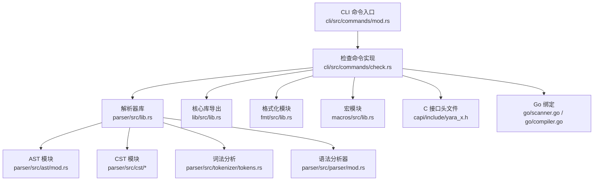
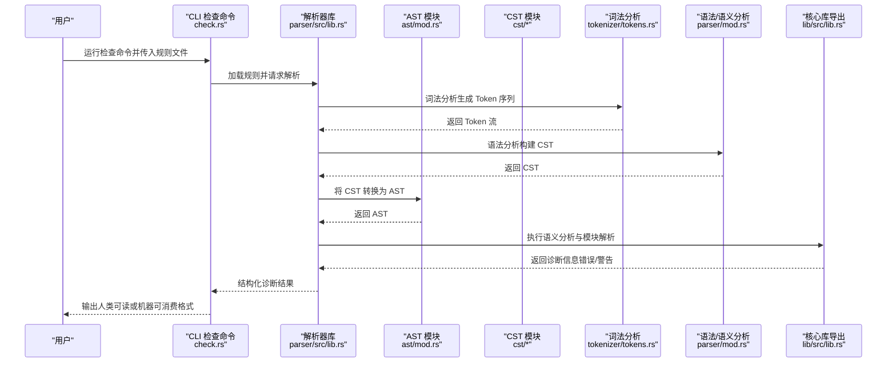
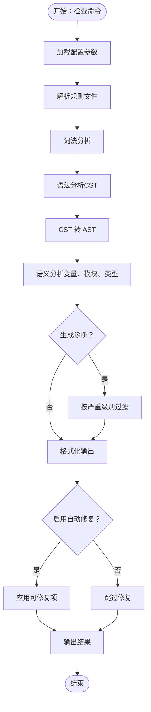
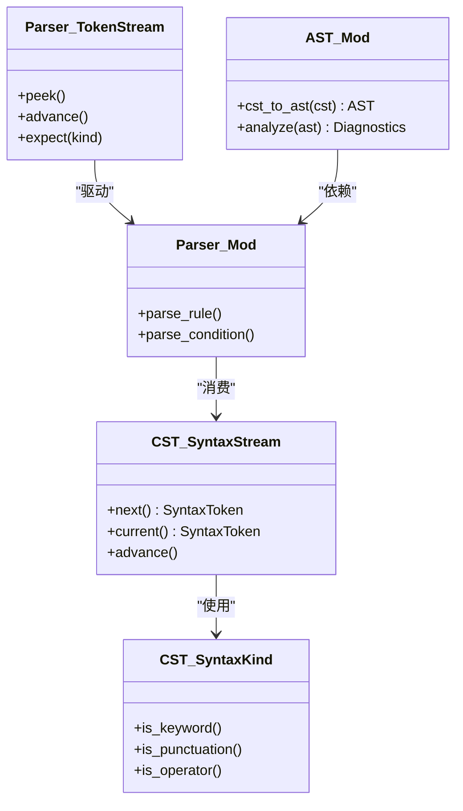
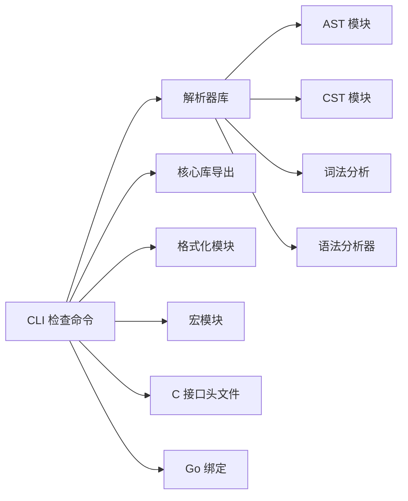

# 语法检查器

<cite>
**本文引用的文件**
- [check.rs](file://yara-x/cli/src/commands/check.rs)
- [mod.rs](file://yara-x/cli/src/commands/mod.rs)
- [lib.rs](file://yara-x/lib/src/lib.rs)
- [ast.rs](file://yara-x/parser/src/ast/mod.rs)
- [cst2ast.rs](file://yara-x/parser/src/ast/cst2ast.rs)
- [syntax_kind.rs](file://yara-x/parser/src/cst/syntax_kind.rs)
- [syntax_stream.rs](file://yara-x/parser/src/cst/syntax_stream.rs)
- [token_stream.rs](file://yara-x/parser/src/parser/token_stream.rs)
- [parser.rs](file://yara-x/parser/src/parser/mod.rs)
- [tokens.rs](file://yara-x/parser/src/tokenizer/tokens.rs)
- [scanner.go](file://yara-x/go/scanner.go)
- [compiler.go](file://yara-x/go/compiler.go)
- [yara_x.h](file://yara-x/capi/include/yara_x.h)
- [lib.rs](file://yara-x/capi/src/lib.rs)
- [lib.rs](file://yara-x/fmt/src/lib.rs)
- [lib.rs](file://yara-x/macros/src/lib.rs)
- [lib.rs](file://yara-x/parser/src/lib.rs)
- [lib.rs](file://yara-x/cli/src/main.rs)
- [config.yaml](file://yara-x/.gemini/config.yaml)
- [config.toml](file://yara-x/.cargo/config.toml)
- [Cargo.toml](file://yara-x/Cargo.toml)
- [foo.yar](file://yara-x/cli/src/tests/testdata/foo.yar)
- [console.yar](file://yara-x/cli/src/tests/testdata/console.yar)
- [true.yar](file://yara-x/cli/src/tests/testdata/true.yar)
- [unknown_module.yar](file://yara-x/cli/src/tests/testdata/unknown_module.yar)
- [variables.yar](file://yara-x/cli/src/tests/testdata/variables.yar)
</cite>

## 目录
1. [简介](#简介)
2. [项目结构](#项目结构)
3. [核心组件](#核心组件)
4. [架构总览](#架构总览)
5. [详细组件分析](#详细组件分析)
6. [依赖关系分析](#依赖关系分析)
7. [性能考量](#性能考量)
8. [故障排查指南](#故障排查指南)
9. [结论](#结论)
10. [附录](#附录)

## 简介
本文件系统性阐述 YARA-X 的“语法检查器”能力：如何对规则进行语法验证、语义分析、生成警告与错误报告；如何检测常见规则编写错误（如语法错误、未定义变量、类型不匹配等）；以及自动修复功能的可用范围与策略。同时提供配置选项、自定义规则验证方法、输出格式说明与在开发流程中的最佳实践。

## 项目结构
语法检查器位于 CLI 子系统中，通过命令入口调用解析器与编译器模块完成规则的词法/语法/语义分析，并输出结构化结果。关键路径如下：
- 命令入口与检查逻辑：cli/src/commands/check.rs
- 命令注册与子命令组织：cli/src/commands/mod.rs
- 解析器 AST/CST 模块：parser/src/ast/*、parser/src/cst/*
- 词法/语法分析器：parser/src/tokenizer/*、parser/src/parser/*
- 核心库导出：lib/src/lib.rs
- C 接口与 Go 绑定：capi/include/yara_x.h、capi/src/lib.rs、go/scanner.go、go/compiler.go
- 格式化与宏模块：fmt/src/lib.rs、macros/src/lib.rs
- 测试数据与示例：cli/src/tests/testdata/*.yar

图表来源
- [mod.rs:1-200](file://yara-x/cli/src/commands/mod.rs#L1-L200)
- [check.rs:1-200](file://yara-x/cli/src/commands/check.rs#L1-L200)
- [lib.rs:1-200](file://yara-x/lib/src/lib.rs#L1-L200)
- [lib.rs:1-200](file://yara-x/parser/src/lib.rs#L1-L200)
- [lib.rs:1-200](file://yara-x/fmt/src/lib.rs#L1-L200)
- [lib.rs:1-200](file://yara-x/macros/src/lib.rs#L1-L200)
- [yara_x.h:1-200](file://yara-x/capi/include/yara_x.h#L1-L200)
- [scanner.go:1-200](file://yara-x/go/scanner.go#L1-L200)
- [compiler.go:1-200](file://yara-x/go/compiler.go#L1-L200)

章节来源
- [mod.rs:1-200](file://yara-x/cli/src/commands/mod.rs#L1-L200)
- [check.rs:1-200](file://yara-x/cli/src/commands/check.rs#L1-L200)
- [lib.rs:1-200](file://yara-x/lib/src/lib.rs#L1-L200)
- [lib.rs:1-200](file://yara-x/parser/src/lib.rs#L1-L200)
- [lib.rs:1-200](file://yara-x/fmt/src/lib.rs#L1-L200)
- [lib.rs:1-200](file://yara-x/macros/src/lib.rs#L1-L200)
- [yara_x.h:1-200](file://yara-x/capi/include/yara_x.h#L1-L200)
- [scanner.go:1-200](file://yara-x/go/scanner.go#L1-L200)
- [compiler.go:1-200](file://yara-x/go/compiler.go#L1-L200)

## 核心组件
- 检查命令实现：负责接收输入规则、调用解析器与编译器、收集并输出诊断信息。
- 解析器 AST/CST：将原始规则转换为抽象语法树（AST），并在转换过程中进行语法与语义校验。
- 词法/语法分析器：词法化 Token 并构建 CST（具体语法树），随后转换为 AST。
- 核心库导出：提供规则编译、扫描、模块加载等能力，供 CLI 与绑定层使用。
- 输出格式：支持人类可读文本与机器可消费的 JSON/NDJSON 格式，便于 CI 集成。
- 自动修复：在格式化与检查阶段提供有限的自动修复能力（如缩进、空行、注释对齐等）。

章节来源
- [check.rs:1-200](file://yara-x/cli/src/commands/check.rs#L1-L200)
- [ast.rs:1-200](file://yara-x/parser/src/ast/mod.rs#L1-L200)
- [cst2ast.rs:1-200](file://yara-x/parser/src/ast/cst2ast.rs#L1-L200)
- [syntax_kind.rs:1-200](file://yara-x/parser/src/cst/syntax_kind.rs#L1-L200)
- [syntax_stream.rs:1-200](file://yara-x/parser/src/cst/syntax_stream.rs#L1-L200)
- [token_stream.rs:1-200](file://yara-x/parser/src/parser/token_stream.rs#L1-L200)
- [parser.rs:1-200](file://yara-x/parser/src/parser/mod.rs#L1-L200)
- [tokens.rs:1-200](file://yara-x/parser/src/tokenizer/tokens.rs#L1-L200)
- [lib.rs:1-200](file://yara-x/lib/src/lib.rs#L1-L200)

## 架构总览
下图展示了从 CLI 调用到最终输出的端到端流程，涵盖词法/语法/语义分析与诊断生成：

图表来源
- [check.rs:1-200](file://yara-x/cli/src/commands/check.rs#L1-L200)
- [lib.rs:1-200](file://yara-x/parser/src/lib.rs#L1-L200)
- [ast.rs:1-200](file://yara-x/parser/src/ast/mod.rs#L1-L200)
- [cst2ast.rs:1-200](file://yara-x/parser/src/ast/cst2ast.rs#L1-L200)
- [tokens.rs:1-200](file://yara-x/parser/src/tokenizer/tokens.rs#L1-L200)
- [parser.rs:1-200](file://yara-x/parser/src/parser/mod.rs#L1-L200)
- [lib.rs:1-200](file://yara-x/lib/src/lib.rs#L1-L200)

## 详细组件分析

### 检查命令实现（check.rs）
- 输入处理：接收规则文件路径、配置参数（如输出格式、是否启用自动修复等）。
- 解析与分析：调用解析器库执行词法/语法/语义分析，并收集诊断信息。
- 输出控制：根据配置输出为文本或 JSON/NDJSON，支持按严重级别过滤。
- 自动修复：在格式化阶段对可自动修复的问题进行修正（例如缩进、空行、注释对齐等）。

图表来源
- [check.rs:1-200](file://yara-x/cli/src/commands/check.rs#L1-L200)

章节来源
- [check.rs:1-200](file://yara-x/cli/src/commands/check.rs#L1-L200)

### 解析器与 AST/CST（parser/src/ast 与 parser/src/cst）
- CST（具体语法树）：由语法分析器基于 Token 流构建，保留完整语法结构与位置信息。
- AST（抽象语法树）：从 CST 转换而来，用于语义分析与后续编译优化。
- 语法验证：在 CST 构建与 AST 转换过程中进行，识别语法错误（如括号不匹配、非法关键字等）。
- 语义分析：在 AST 上进行，识别未定义变量、类型不匹配、模块接口不一致等问题。

图表来源
- [syntax_stream.rs:1-200](file://yara-x/parser/src/cst/syntax_stream.rs#L1-L200)
- [syntax_kind.rs:1-200](file://yara-x/parser/src/cst/syntax_kind.rs#L1-L200)
- [token_stream.rs:1-200](file://yara-x/parser/src/parser/token_stream.rs#L1-L200)
- [parser.rs:1-200](file://yara-x/parser/src/parser/mod.rs#L1-L200)
- [ast.rs:1-200](file://yara-x/parser/src/ast/mod.rs#L1-L200)
- [cst2ast.rs:1-200](file://yara-x/parser/src/ast/cst2ast.rs#L1-L200)

章节来源
- [ast.rs:1-200](file://yara-x/parser/src/ast/mod.rs#L1-L200)
- [cst2ast.rs:1-200](file://yara-x/parser/src/ast/cst2ast.rs#L1-L200)
- [syntax_kind.rs:1-200](file://yara-x/parser/src/cst/syntax_kind.rs#L1-L200)
- [syntax_stream.rs:1-200](file://yara-x/parser/src/cst/syntax_stream.rs#L1-L200)
- [token_stream.rs:1-200](file://yara-x/parser/src/parser/token_stream.rs#L1-L200)
- [parser.rs:1-200](file://yara-x/parser/src/parser/mod.rs#L1-L200)
- [tokens.rs:1-200](file://yara-x/parser/src/tokenizer/tokens.rs#L1-L200)

### 诊断与错误报告机制
- 错误与警告分类：区分不可恢复的语法错误与可继续分析的语义警告。
- 位置信息：携带源码行号、列号与范围，便于 IDE/编辑器集成。
- 可修复性标记：对可自动修复的问题进行标注，以便在格式化阶段应用修复。
- 输出格式：支持文本与 JSON/NDJSON，NDJSON 便于流水线工具解析。

章节来源
- [check.rs:1-200](file://yara-x/cli/src/commands/check.rs#L1-L200)
- [lib.rs:1-200](file://yara-x/lib/src/lib.rs#L1-L200)

### 自动修复功能
- 适用场景：主要针对格式问题（缩进、空行、注释对齐、花括号前换行等）。
- 修复策略：基于格式化模块的规则，对可确定性的格式问题进行替换或重排。
- 局限性：不涉及语义修复（如变量名修正、类型调整），此类问题需人工干预。

章节来源
- [check.rs:1-200](file://yara-x/cli/src/commands/check.rs#L1-L200)
- [lib.rs:1-200](file://yara-x/fmt/src/lib.rs#L1-L200)

### 配置选项与自定义规则验证
- CLI 配置：通过命令行参数或配置文件控制输出格式、严重级别阈值、是否启用自动修复等。
- 宏与模块扩展：通过宏模块与模块系统扩展规则验证能力（如自定义函数、约束检查）。
- C/Go 绑定：通过 C 接口与 Go 绑定在外部工具链中复用检查能力。

章节来源
- [config.yaml:1-200](file://yara-x/.gemini/config.yaml#L1-L200)
- [config.toml:1-200](file://yara-x/.cargo/config.toml#L1-L200)
- [lib.rs:1-200](file://yara-x/macros/src/lib.rs#L1-L200)
- [yara_x.h:1-200](file://yara-x/capi/include/yara_x.h#L1-L200)
- [lib.rs:1-200](file://yara-x/capi/src/lib.rs#L1-L200)
- [scanner.go:1-200](file://yara-x/go/scanner.go#L1-L200)
- [compiler.go:1-200](file://yara-x/go/compiler.go#L1-L200)

### 测试数据与典型规则
- 测试规则集：包含多种场景（如控制台模块、真值规则、未知模块、变量作用域等），可用于验证检查器行为。
- 使用建议：将测试规则纳入 CI，确保新增规则符合团队规范。

章节来源
- [foo.yar:1-200](file://yara-x/cli/src/tests/testdata/foo.yar#L1-L200)
- [console.yar:1-200](file://yara-x/cli/src/tests/testdata/console.yar#L1-L200)
- [true.yar:1-200](file://yara-x/cli/src/tests/testdata/true.yar#L1-L200)
- [unknown_module.yar:1-200](file://yara-x/cli/src/tests/testdata/unknown_module.yar#L1-L200)
- [variables.yar:1-200](file://yara-x/cli/src/tests/testdata/variables.yar#L1-L200)

## 依赖关系分析
- CLI 对解析器与核心库存在直接依赖，解析器内部依赖词法/语法分析器与 AST/CST 模块。
- 格式化模块与宏模块为检查器提供辅助能力（格式修复与扩展验证）。
- C/Go 绑定依赖核心库导出，便于在不同语言环境中集成。

图表来源
- [check.rs:1-200](file://yara-x/cli/src/commands/check.rs#L1-L200)
- [lib.rs:1-200](file://yara-x/parser/src/lib.rs#L1-L200)
- [lib.rs:1-200](file://yara-x/lib/src/lib.rs#L1-L200)
- [lib.rs:1-200](file://yara-x/fmt/src/lib.rs#L1-L200)
- [lib.rs:1-200](file://yara-x/macros/src/lib.rs#L1-L200)
- [yara_x.h:1-200](file://yara-x/capi/include/yara_x.h#L1-L200)
- [scanner.go:1-200](file://yara-x/go/scanner.go#L1-L200)
- [compiler.go:1-200](file://yara-x/go/compiler.go#L1-L200)

章节来源
- [check.rs:1-200](file://yara-x/cli/src/commands/check.rs#L1-L200)
- [lib.rs:1-200](file://yara-x/parser/src/lib.rs#L1-L200)
- [lib.rs:1-200](file://yara-x/lib/src/lib.rs#L1-L200)
- [lib.rs:1-200](file://yara-x/fmt/src/lib.rs#L1-L200)
- [lib.rs:1-200](file://yara-x/macros/src/lib.rs#L1-L200)
- [yara_x.h:1-200](file://yara-x/capi/include/yara_x.h#L1-L200)
- [scanner.go:1-200](file://yara-x/go/scanner.go#L1-L200)
- [compiler.go:1-200](file://yara-x/go/compiler.go#L1-L200)

## 性能考量
- 词法/语法分析复杂度：通常与输入长度线性相关，注意避免超大规则文件导致的内存峰值。
- 语义分析成本：模块解析与类型检查可能引入额外开销，建议在 CI 中分批处理。
- 输出格式选择：NDJSON 更利于流式处理与并行消费，减少内存占用。
- 缓存与增量：在本地开发时可利用增量检查与缓存，缩短反馈周期。

## 故障排查指南
- 语法错误定位：优先查看 CST/AST 转换阶段的错误提示，结合源码位置快速定位。
- 未定义变量/类型不匹配：检查 AST 分析阶段的诊断信息，确认变量作用域与模块接口。
- 自动修复无效：确认启用自动修复开关与对应格式化规则是否覆盖该问题类型。
- CI 集成问题：检查输出格式与严重级别阈值设置，确保流水线能正确解析 NDJSON。

章节来源
- [check.rs:1-200](file://yara-x/cli/src/commands/check.rs#L1-L200)
- [lib.rs:1-200](file://yara-x/lib/src/lib.rs#L1-L200)

## 结论
YARA-X 的语法检查器以解析器为核心，结合词法/语法/语义分析，提供从语法错误到语义警告的全栈诊断能力，并通过格式化模块实现有限的自动修复。其输出格式与多语言绑定便于在开发流程与 CI 中集成，建议在团队内统一配置与阈值，持续提升规则质量与一致性。

## 附录
- 开发流程最佳实践
  - 在提交前运行检查命令，确保无语法错误与低严重级别警告。
  - 在 CI 中启用 NDJSON 输出与严格阈值，阻断不符合规范的变更。
  - 将测试规则纳入自动化检查，覆盖常见错误场景。
- 常见规则编写错误与检测要点
  - 语法错误：括号不匹配、非法关键字、不完整的表达式。
  - 未定义变量：变量在当前作用域未声明或拼写错误。
  - 类型不匹配：模块函数参数类型与实际传入不符。
  - 模块接口不一致：模块未导入或接口签名不匹配。