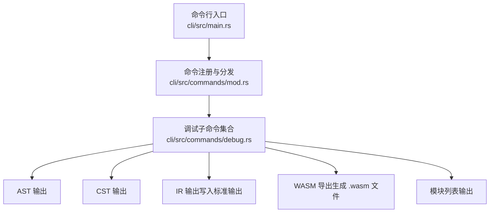
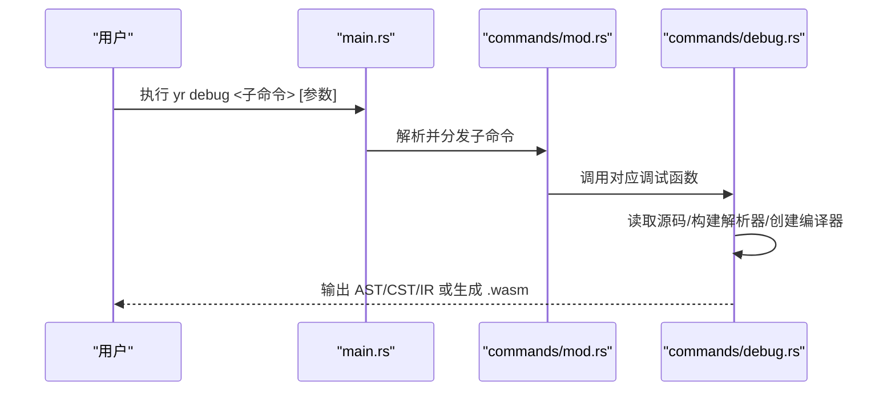
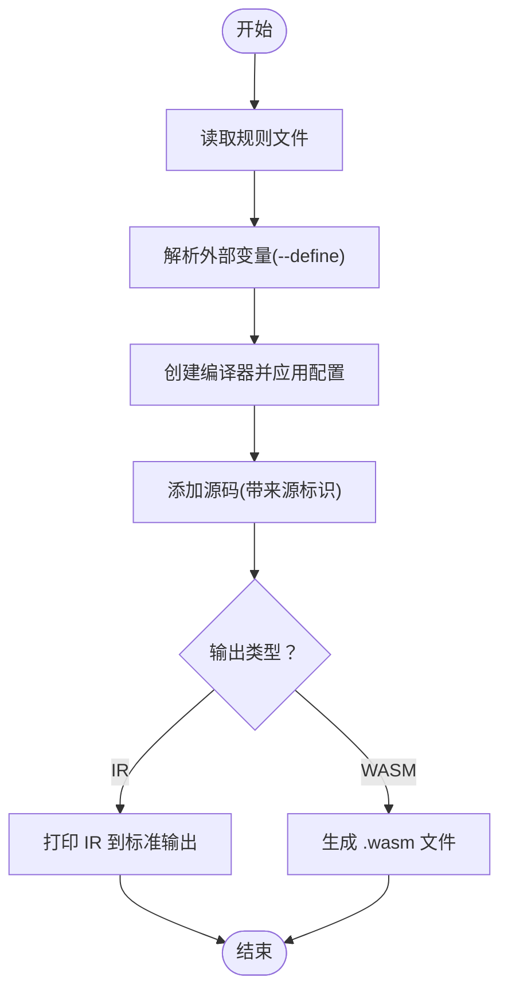
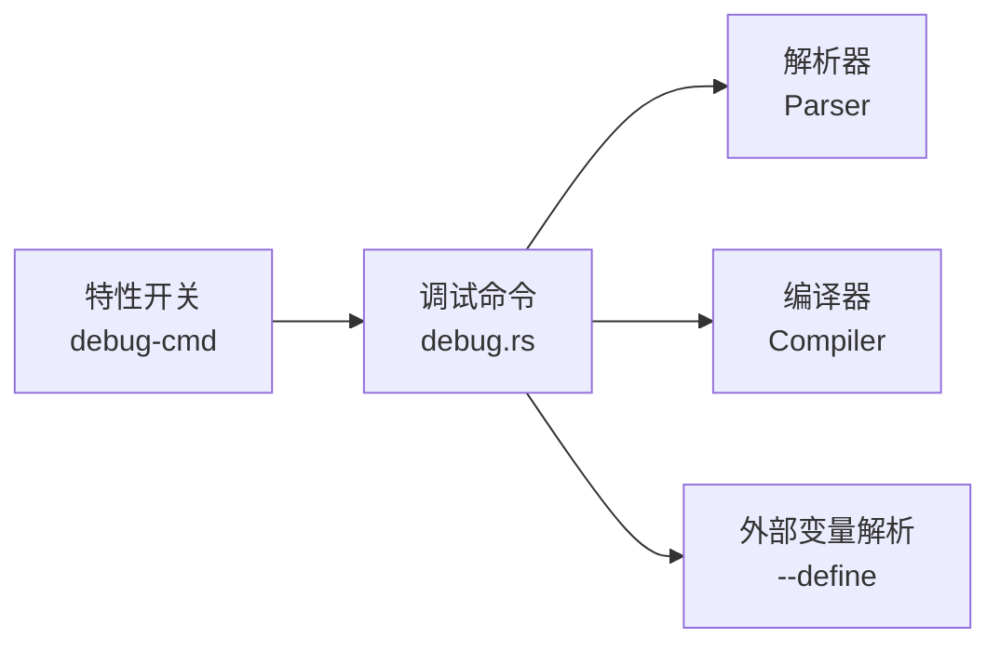

# 调试工具

<cite>
**本文引用的文件**
- [cli/src/commands/debug.rs](file://cli/src/commands/debug.rs)
- [cli/src/main.rs](file://cli/src/main.rs)
- [cli/src/commands/mod.rs](file://cli/src/commands/mod.rs)
- [cli/src/tests/debug.rs](file://cli/src/tests/debug.rs)
- [cli/src/tests/testdata/foo.yar](file://cli/src/tests/testdata/foo.yar)
- [Cargo.toml](file://Cargo.toml)
</cite>

## 目录
1. [简介](#简介)
2. [项目结构](#项目结构)
3. [核心组件](#核心组件)
4. [架构总览](#架构总览)
5. [详细组件分析](#详细组件分析)
6. [依赖关系分析](#依赖关系分析)
7. [性能考量](#性能考量)
8. [故障排查指南](#故障排查指南)
9. [结论](#结论)
10. [附录](#附录)

## 简介
本文件系统性地介绍 YARA-X 的调试工具与相关能力，重点覆盖以下方面：
- 规则调试命令的使用方法：AST/CST/IR/WASM 输出与模块列表展示
- 调试输出格式与信息解读：AST/CST/IR 的打印风格、WASM 文件生成流程
- 规则执行跟踪与变量监控：通过 IR/WASM 输出辅助理解编译期优化与运行时行为
- 模式匹配过程分析：结合 IR 层节点与条件表达式，定位潜在性能瓶颈与逻辑问题
- 调试会话的创建与管理：外部变量注入、命名空间隔离、包含路径控制
- 高级调试功能：断点与单步执行不在当前 CLI 能力范围内，但可通过 IR/WASM 辅助定位问题
- 与其他开发工具的集成：与编辑器插件、CI 流水线、格式化工具的协同

## 项目结构
调试工具位于 CLI 子模块中，以“debug”子命令形式提供多种输出与导出能力。其入口与命令注册如下图所示：

图表来源
- [cli/src/main.rs:84-95](file://cli/src/main.rs#L84-L95)
- [cli/src/commands/mod.rs:49-71](file://cli/src/commands/mod.rs#L49-L71)
- [cli/src/commands/debug.rs:82-91](file://cli/src/commands/debug.rs#L82-L91)

章节来源
- [cli/src/main.rs:31-107](file://cli/src/main.rs#L31-L107)
- [cli/src/commands/mod.rs:49-71](file://cli/src/commands/mod.rs#L49-L71)
- [cli/src/commands/debug.rs:82-91](file://cli/src/commands/debug.rs#L82-L91)

## 核心组件
- 调试命令集合：提供 AST、CST、IR、WASM、模块列表五类调试能力
- 外部变量解析与注入：支持通过命令行定义全局变量，用于 IR/WASM 编译阶段
- 编译器配置：颜色化错误、忽略模块、包含目录、禁用警告、命名空间切换等
- WASM 导出：将规则编译为 WebAssembly 文件，便于在 WASI 环境或浏览器中验证

章节来源
- [cli/src/commands/debug.rs:104-171](file://cli/src/commands/debug.rs#L104-L171)
- [cli/src/commands/mod.rs:73-100](file://cli/src/commands/mod.rs#L73-L100)
- [cli/src/commands/mod.rs:149-213](file://cli/src/commands/mod.rs#L149-L213)

## 架构总览
调试命令的调用链路如下：

图表来源
- [cli/src/main.rs:84-95](file://cli/src/main.rs#L84-L95)
- [cli/src/commands/mod.rs:49-71](file://cli/src/commands/mod.rs#L49-L71)
- [cli/src/commands/debug.rs:93-102](file://cli/src/commands/debug.rs#L93-L102)

## 详细组件分析

### AST 输出（抽象语法树）
- 功能：将指定的 YARA 规则文件解析为 AST 并打印
- 典型用途：检查语法规则是否正确、确认规则结构、定位语法错误
- 使用示例：yr debug ast src/tests/testdata/foo.yar
- 输出解读：AST 结构直观反映规则的层级关系与节点类型；若存在语法错误，通常会在后续编译阶段给出更详细的错误报告

章节来源
- [cli/src/commands/debug.rs:104-115](file://cli/src/commands/debug.rs#L104-L115)
- [cli/src/tests/debug.rs:5-14](file://cli/src/tests/debug.rs#L5-L14)
- [cli/src/tests/testdata/foo.yar:1-14](file://cli/src/tests/testdata/foo.yar#L1-L14)

### CST 输出（具体语法树）
- 功能：将规则文件解析为 CST 并打印
- 典型用途：比对词法与语法映射、定位词法/语法层面的问题
- 使用示例：yr debug cst src/tests/testdata/foo.yar
- 输出解读：CST 更贴近源码结构，有助于理解解析器如何将文本映射到语法节点

章节来源
- [cli/src/commands/debug.rs:117-128](file://cli/src/commands/debug.rs#L117-L128)
- [cli/src/tests/debug.rs:16-25](file://cli/src/tests/debug.rs#L16-L25)

### IR 输出（中间表示）
- 功能：将规则编译为 IR，并将 IR 写入标准输出
- 典型用途：观察编译器对规则条件的优化、常量折叠、公共子表达式消除等
- 使用示例：yr debug ir src/tests/testdata/foo.yar [--define VAR=VALUE ...]
- 输出解读：IR 是规则条件的内部表示，节点类型与连接关系反映了编译器的优化策略；可据此判断是否存在冗余计算或潜在性能问题

章节来源
- [cli/src/commands/debug.rs:130-143](file://cli/src/commands/debug.rs#L130-L143)
- [cli/src/commands/mod.rs:73-100](file://cli/src/commands/mod.rs#L73-L100)
- [cli/src/commands/mod.rs:149-213](file://cli/src/commands/mod.rs#L149-L213)

### WASM 导出
- 功能：将规则编译为 WebAssembly 文件（.wasm），便于在 WASI 环境或浏览器中验证
- 典型用途：跨平台验证规则行为、与前端/边缘环境集成
- 使用示例：yr debug wasm src/tests/testdata/foo.yar
- 输出解读：成功后会在同目录生成 .wasm 文件；如需自定义输出路径，可在调用前准备目标路径

章节来源
- [cli/src/commands/debug.rs:145-164](file://cli/src/commands/debug.rs#L145-L164)
- [cli/src/tests/debug.rs:27-45](file://cli/src/tests/debug.rs#L27-L45)

### 模块列表
- 功能：列出可用模块名称
- 典型用途：确认模块是否可用、核对模块拼写
- 使用示例：yr debug modules

章节来源
- [cli/src/commands/debug.rs:166-171](file://cli/src/commands/debug.rs#L166-L171)

### 外部变量注入与编译器配置
- 外部变量：通过 --define VAR=VALUE 注入全局变量，支持 JSON 值
- 编译器配置：颜色化错误输出、忽略模块、包含目录、禁用警告、命名空间切换等
- 作用：在 IR/WASM 导出阶段，确保变量与模块状态符合预期

章节来源
- [cli/src/commands/mod.rs:73-100](file://cli/src/commands/mod.rs#L73-L100)
- [cli/src/commands/mod.rs:149-213](file://cli/src/commands/mod.rs#L149-L213)

### 调试流程图（IR/WASM 导出）

图表来源
- [cli/src/commands/debug.rs:130-164](file://cli/src/commands/debug.rs#L130-L164)
- [cli/src/commands/mod.rs:149-213](file://cli/src/commands/mod.rs#L149-L213)

## 依赖关系分析
- 调试命令依赖于解析器（Parser）与编译器（Compiler）
- 外部变量解析依赖于 JSON 解析器
- 特性开关：debug-cmd 控制调试命令是否启用
- 与平台相关的依赖：WASM 导出依赖于 WebAssembly 工具链

图表来源
- [cli/src/commands/debug.rs:104-171](file://cli/src/commands/debug.rs#L104-L171)
- [Cargo.toml:117-135](file://Cargo.toml#L117-L135)

章节来源
- [Cargo.toml:117-135](file://Cargo.toml#L117-L135)

## 性能考量
- IR 分析：通过 IR 可观察编译器优化效果，如常量折叠、公共子表达式消除等；若 IR 中仍存在重复计算或深层嵌套，建议重构规则条件以提升扫描性能
- 模式匹配：对于高成本的正则或十六进制模式，优先考虑简化或拆分；结合 IR 中的节点分布判断热点路径
- 包含与模块：避免不必要的模块导入与深层包含，减少编译时间与运行时开销
- WASM 验证：在目标运行环境中验证规则行为，确保优化后的 IR 在实际场景中表现稳定

## 故障排查指南
- 语法错误：先使用 AST/CST 输出定位语法问题；再通过编译器错误输出获取详细信息
- 变量未定义：检查 --define 参数的键名与 JSON 值格式；确认变量在规则中正确引用
- 模块不可用：使用模块列表确认模块名称；必要时通过忽略/禁用模块策略进行隔离排查
- 包含路径：通过包含目录配置确保 include 文件可被正确解析
- WASM 生成失败：确认输入规则合法且无未解析的外部依赖；检查输出路径权限

章节来源
- [cli/src/commands/debug.rs:104-171](file://cli/src/commands/debug.rs#L104-L171)
- [cli/src/commands/mod.rs:73-100](file://cli/src/commands/mod.rs#L73-L100)
- [cli/src/commands/mod.rs:149-213](file://cli/src/commands/mod.rs#L149-L213)

## 结论
YARA-X 的调试工具以“debug”子命令为核心，提供了从语法层到 IR/WASM 的多维度调试能力。通过 AST/CST 快速定位语法问题，借助 IR 观察编译器优化与潜在性能瓶颈，利用 WASM 导出在目标环境中验证规则行为。配合外部变量注入与编译器配置，可高效完成复杂规则的调试与优化。

## 附录
- 命令清单与示例
  - yr debug ast <RULES_PATH>
  - yr debug cst <RULES_PATH>
  - yr debug ir <RULES_PATH> [--define VAR=VALUE ...]
  - yr debug wasm <RULES_PATH>
  - yr debug modules
- 测试参考
  - 测试用例覆盖了 AST/CST/WASM 的基本行为，可作为本地验证的基准

章节来源
- [cli/src/tests/debug.rs:5-45](file://cli/src/tests/debug.rs#L5-L45)
- [cli/src/tests/testdata/foo.yar:1-14](file://cli/src/tests/testdata/foo.yar#L1-L14)