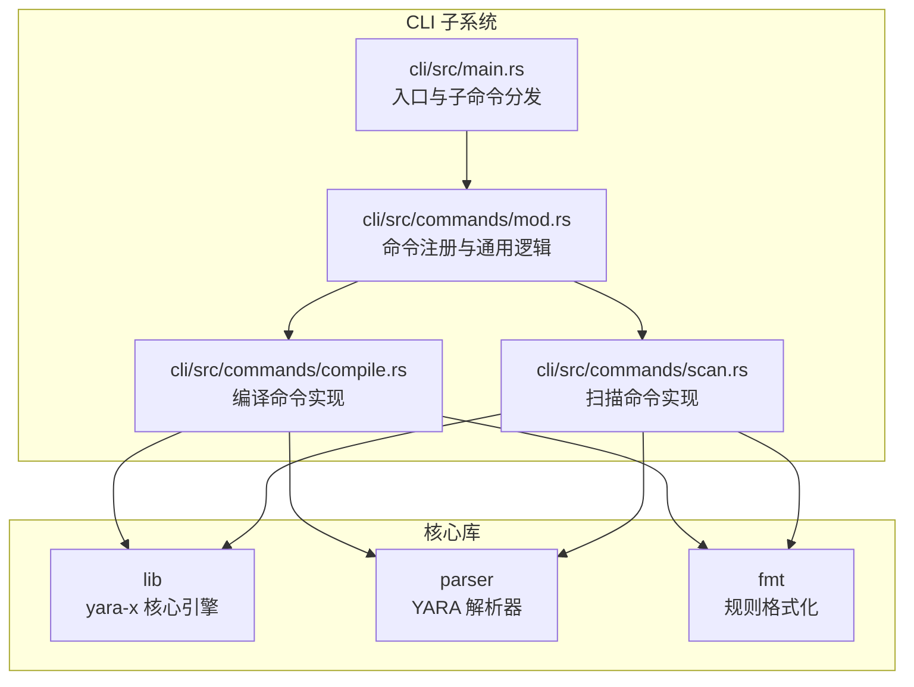
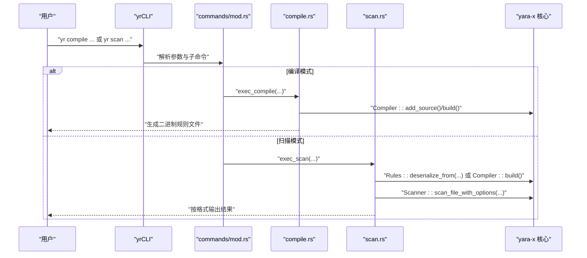
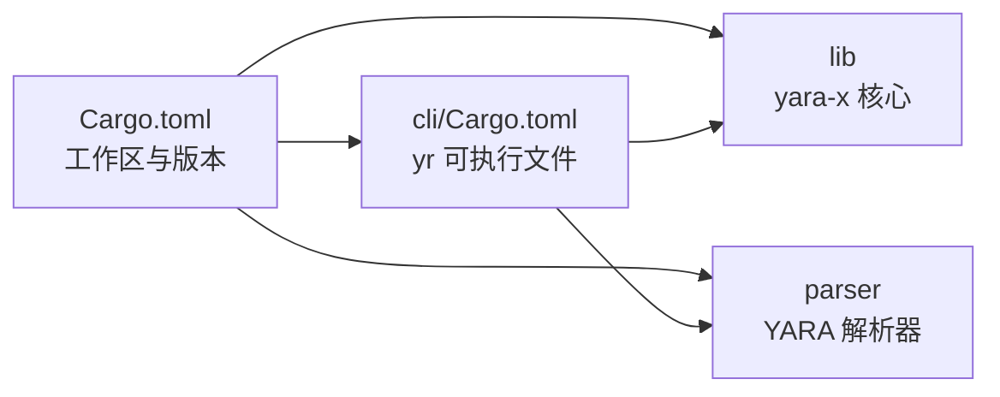

# 快速开始

<cite>
**本文引用的文件**
- [README.md](file://README.md)
- [Cargo.toml](file://Cargo.toml)
- [cli/Cargo.toml](file://cli/Cargo.toml)
- [cli/src/main.rs](file://cli/src/main.rs)
- [cli/src/commands/mod.rs](file://cli/src/commands/mod.rs)
- [cli/src/commands/compile.rs](file://cli/src/commands/compile.rs)
- [cli/src/commands/scan.rs](file://cli/src/commands/scan.rs)
- [site/content/docs/cli/_index.md](file://site/content/docs/cli/_index.md)
</cite>

## 目录
1. [简介](#简介)
2. [项目结构](#项目结构)
3. [核心组件](#核心组件)
4. [架构总览](#架构总览)
5. [详细组件分析](#详细组件分析)
6. [依赖关系分析](#依赖关系分析)
7. [性能注意事项](#性能注意事项)
8. [故障排除指南](#故障排除指南)
9. [结论](#结论)
10. [附录](#附录)

## 简介
本指南面向首次接触 YARA-X 的用户，目标是在约 15 分钟内完成安装、编写第一条规则并成功执行一次扫描。内容覆盖：
- 安装方式：Cargo（推荐）、包管理器（如适用）、从源码编译
- 环境要求：Rust 工具链版本与工作区配置
- 第一个 YARA 规则的编写与执行示例
- 基本命令行用法：规则编译、扫描与结果解释
- 常见初始配置与故障排除提示
- 不同操作系统与安装方式的选择建议

为帮助你快速上手，建议优先选择 Cargo 安装；若需要在受限环境中使用预编译二进制，请参考发行版或包管理器选项。

章节来源
- [README.md:1-69](file://README.md#L1-L69)

## 项目结构
仓库采用多包工作区组织，核心与 CLI 在同一仓库中，便于统一构建与测试。关键模块包括：
- lib：核心引擎与 API
- cli：命令行界面（yr）
- capi：C 接口封装
- fmt：规则格式化工具
- parser：YARA 规则解析器
- proto/json/yaml：序列化与导入导出支持
- py：Python 绑定
- site：文档站点

下面给出与“快速开始”直接相关的模块关系图，聚焦 CLI、编译与扫描流程。

图表来源
- [cli/src/main.rs:31-107](file://cli/src/main.rs#L31-L107)
- [cli/src/commands/mod.rs:49-71](file://cli/src/commands/mod.rs#L49-L71)
- [cli/src/commands/compile.rs:13-91](file://cli/src/commands/compile.rs#L13-L91)
- [cli/src/commands/scan.rs:44-204](file://cli/src/commands/scan.rs#L44-L204)

章节来源
- [Cargo.toml:17-30](file://Cargo.toml#L17-L30)
- [cli/Cargo.toml:15-23](file://cli/Cargo.toml#L15-L23)

## 核心组件
- 入口与子命令分发：CLI 入口负责解析参数、加载配置、调用具体命令。
- 编译命令：将 YARA 源规则编译为二进制规则集，便于后续扫描加速与复用。
- 扫描命令：对单个文件或目录进行扫描，支持多种输出格式、线程控制、超时与匹配限制等。

章节来源
- [cli/src/main.rs:31-107](file://cli/src/main.rs#L31-L107)
- [cli/src/commands/mod.rs:49-71](file://cli/src/commands/mod.rs#L49-L71)
- [cli/src/commands/compile.rs:72-91](file://cli/src/commands/compile.rs#L72-L91)
- [cli/src/commands/scan.rs:251-562](file://cli/src/commands/scan.rs#L251-L562)

## 架构总览
下图展示了从命令行到核心引擎的关键调用链路，体现“编译—扫描—输出”的典型流程。

图表来源
- [cli/src/main.rs:84-95](file://cli/src/main.rs#L84-L95)
- [cli/src/commands/mod.rs:215-302](file://cli/src/commands/mod.rs#L215-L302)
- [cli/src/commands/compile.rs:72-91](file://cli/src/commands/compile.rs#L72-L91)
- [cli/src/commands/scan.rs:295-333](file://cli/src/commands/scan.rs#L295-L333)

## 详细组件分析

### 安装与环境要求
- Rust 工具链版本：工作区要求的最低版本由工作区配置指定，建议使用与工作区一致或更新的版本以获得最佳兼容性与性能。
- 安装方式：
  - Cargo（推荐）：通过工作区根目录使用标准 Cargo 命令进行构建与安装。
  - 包管理器：若所在平台提供预编译包或容器镜像，可作为替代方案。
  - 源码编译：克隆仓库后在根目录执行构建，生成 CLI 可执行文件。

章节来源
- [Cargo.toml:15](file://Cargo.toml#L15)
- [cli/Cargo.toml:13](file://cli/Cargo.toml#L13)

### 第一个 YARA 规则编写与执行
- 规则语法要点：元数据（meta）、字符串（strings）、条件（condition）。规则可包含标签与描述，便于分类与检索。
- 示例流程（步骤化说明，不包含具体规则内容）：
  1) 创建一个文本编辑器，编写一条简单规则（包含至少一个字符串与一个条件表达式）。
  2) 将规则保存为 .yar 或 .yara 文件。
  3) 使用编译命令将规则编译为二进制文件，以便后续扫描使用。
  4) 准备一个测试样本文件（例如包含或不包含规则中字符串的文件）。
  5) 使用扫描命令对样本文件进行扫描，观察输出结果。

章节来源
- [README.md:19-41](file://README.md#L19-L41)
- [cli/src/commands/compile.rs:72-91](file://cli/src/commands/compile.rs#L72-L91)
- [cli/src/commands/scan.rs:251-562](file://cli/src/commands/scan.rs#L251-L562)

### 基本命令行使用示例
- 查看 CLI 帮助与可用子命令：
  - 使用 CLI 主程序查看帮助，确认子命令列表与参数说明。
- 规则编译：
  - 指定规则源文件或目录，输出二进制规则文件。
  - 支持外部变量定义、忽略模块、包含目录、放宽正则语法检查等选项。
- 扫描执行：
  - 指定已编译规则或规则源文件、目标文件或目录。
  - 支持输出格式（文本/JSON/Ndjson）、仅计数、打印元数据/标签/字符串、递归扫描、线程数、超时、跳过大文件等。
  - 可选启用规则级性能剖析（需相应特性编译）。

章节来源
- [cli/src/main.rs:19-26](file://cli/src/main.rs#L19-L26)
- [cli/src/commands/mod.rs:49-71](file://cli/src/commands/mod.rs#L49-L71)
- [cli/src/commands/compile.rs:13-70](file://cli/src/commands/compile.rs#L13-L70)
- [cli/src/commands/scan.rs:44-204](file://cli/src/commands/scan.rs#L44-L204)

### 结果解释
- 文本输出：默认显示匹配的规则标识、命名空间（可选）、标签（可选）、元数据（可选）与匹配字符串片段。
- JSON/Ndjson 输出：结构化结果，便于集成自动化流程与二次处理。
- 计数模式：仅输出每个文件的匹配规则数量，适合批量统计场景。

章节来源
- [cli/src/commands/scan.rs:364-375](file://cli/src/commands/scan.rs#L364-L375)
- [cli/src/commands/scan.rs:793-800](file://cli/src/commands/scan.rs#L793-L800)

### 常见初始配置
- 配置文件位置：CLI 支持从用户主目录加载配置文件，未设置时使用默认行为。
- 外部变量：通过命令行传入变量，供规则在编译与扫描阶段使用。
- 模块数据：为特定模块注入额外数据，用于增强扫描能力。
- 警告控制：可按警告 ID 关闭特定警告，或一次性关闭全部警告。

章节来源
- [cli/src/main.rs:64-82](file://cli/src/main.rs#L64-L82)
- [cli/src/commands/mod.rs:75-100](file://cli/src/commands/mod.rs#L75-L100)
- [cli/src/commands/mod.rs:102-113](file://cli/src/commands/mod.rs#L102-L113)
- [cli/src/commands/mod.rs:183-204](file://cli/src/commands/mod.rs#L183-L204)

### 故障排除提示
- 编译错误：检查规则语法与模块依赖，关注编译器输出的错误与警告信息。
- 扫描超时：适当调整超时时间或减少并发线程，避免长时间阻塞。
- 大文件处理：使用跳过大文件选项，避免内存压力与扫描时间过长。
- 输出格式问题：根据需求选择合适的输出格式，必要时结合管道与下游工具处理。
- 日志与调试：在支持的构建中启用日志功能，借助调试命令定位问题（如启用相关特性）。

章节来源
- [cli/src/commands/scan.rs:280-293](file://cli/src/commands/scan.rs#L280-L293)
- [cli/src/commands/scan.rs:417-425](file://cli/src/commands/scan.rs#L417-L425)
- [cli/src/commands/scan.rs:500-522](file://cli/src/commands/scan.rs#L500-L522)

## 依赖关系分析
- 工作区统一版本与最低 Rust 版本：确保各子包版本一致，避免依赖冲突。
- CLI 依赖核心库与解析器：编译与扫描均依赖核心引擎与解析器。
- 功能特性开关：部分高级功能（如日志、规则剖析）通过特性开启。

图表来源
- [Cargo.toml:17-30](file://Cargo.toml#L17-L30)
- [Cargo.toml:108-114](file://Cargo.toml#L108-L114)
- [cli/Cargo.toml:63-67](file://cli/Cargo.toml#L63-L67)

章节来源
- [Cargo.toml:17-30](file://Cargo.toml#L17-L30)
- [cli/Cargo.toml:63-67](file://cli/Cargo.toml#L63-L67)

## 性能注意事项
- 并发与线程：合理设置线程数，平衡吞吐与资源占用。
- 内存映射：默认使用内存映射提升大文件扫描效率，必要时可禁用。
- 匹配限制：限制每模式最大匹配数，降低内存与 CPU 开销。
- 规则剖析：在开发与优化阶段启用规则剖析，识别耗时规则。

章节来源
- [cli/src/commands/scan.rs:343-351](file://cli/src/commands/scan.rs#L343-L351)
- [cli/src/commands/scan.rs:403-410](file://cli/src/commands/scan.rs#L403-L410)
- [cli/src/commands/scan.rs:477-495](file://cli/src/commands/scan.rs#L477-L495)

## 故障排除指南
- 参数解析错误：检查命令与参数拼写，参考帮助信息。
- 权限与路径：确保对规则文件、目标文件与输出路径具有读写权限。
- 环境变量：在启用日志特性时，正确设置日志级别。
- 超时与中断：遇到超时请调整阈值或优化规则；注意中断会终止扫描。

章节来源
- [cli/src/main.rs:38-39](file://cli/src/main.rs#L38-L39)
- [cli/src/commands/scan.rs:514-522](file://cli/src/commands/scan.rs#L514-L522)

## 结论
通过本指南，你可以在 15 分钟内完成 YARA-X 的安装、编写第一条规则并执行一次扫描。建议优先使用 Cargo 安装，结合编译与扫描命令掌握基本工作流，并根据实际场景调整输出格式、并发与超时等参数。遇到问题时，利用帮助信息、日志与剖析功能进行定位与优化。

## 附录
- CLI 文档索引：CLI 使用与命令说明可在文档站点中查阅，便于深入学习。
- 规则编写指南：可参考文档站点中的规则语法与差异说明，逐步提升规则质量与性能。

章节来源
- [site/content/docs/cli/_index.md:1-22](file://site/content/docs/cli/_index.md#L1-L22)