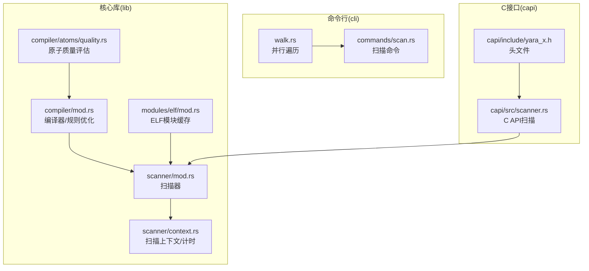
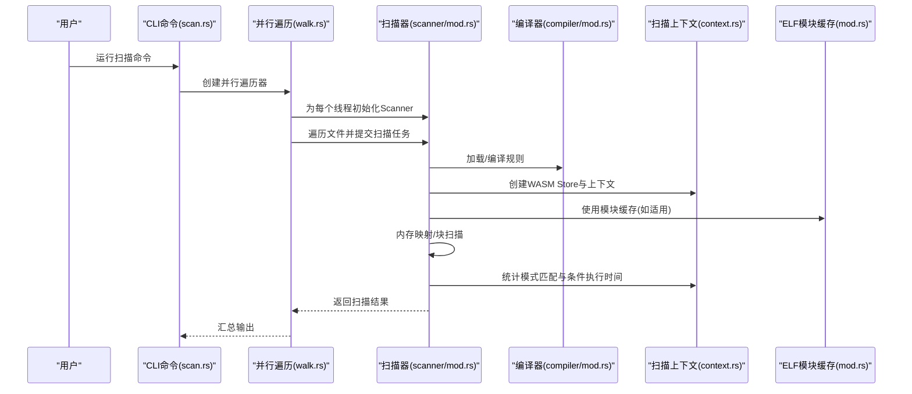
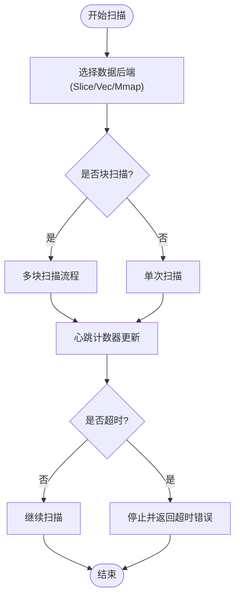
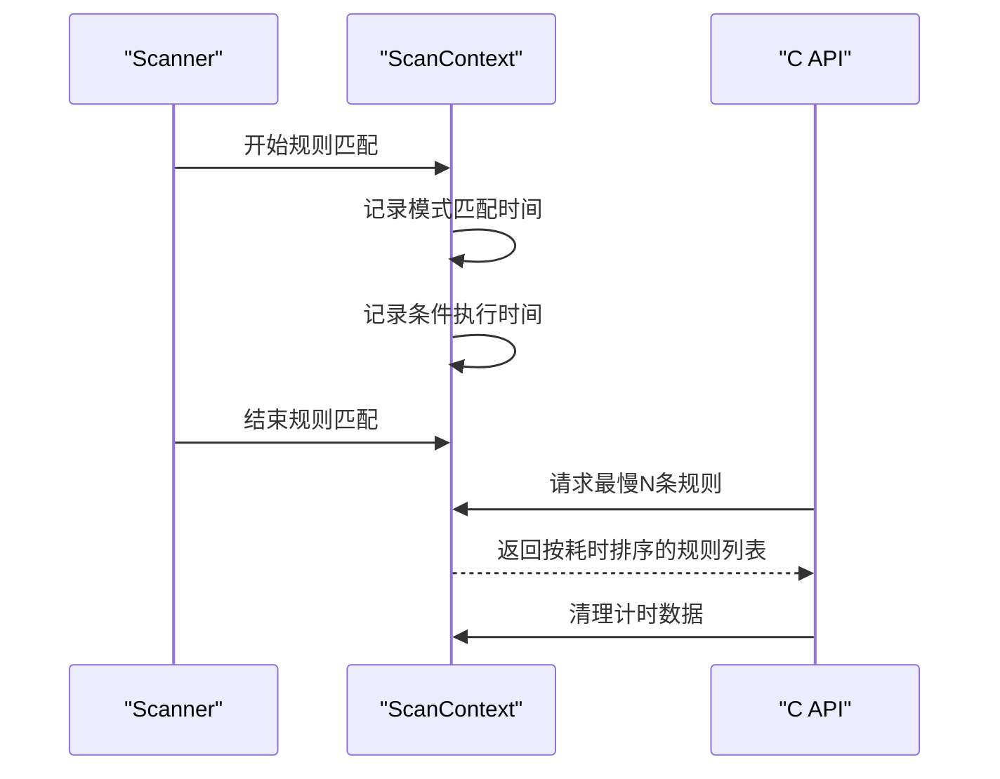
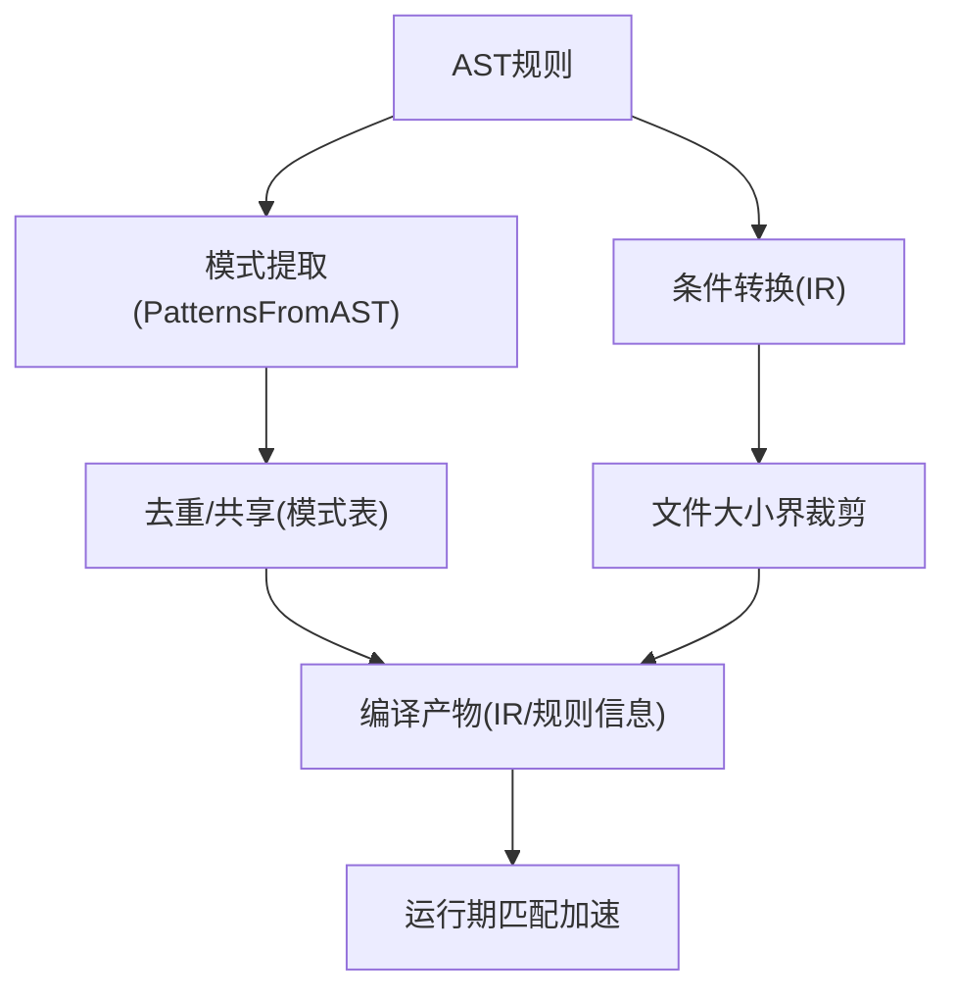
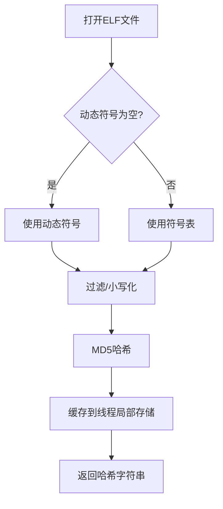
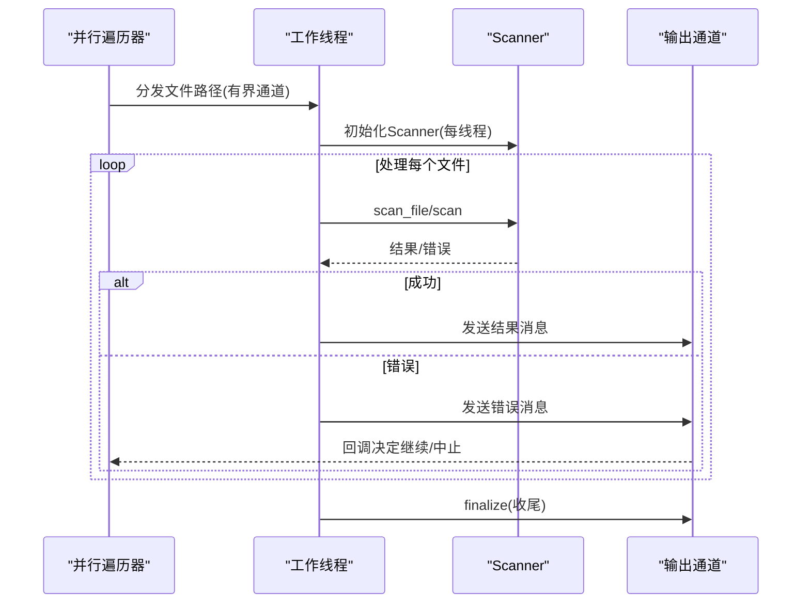
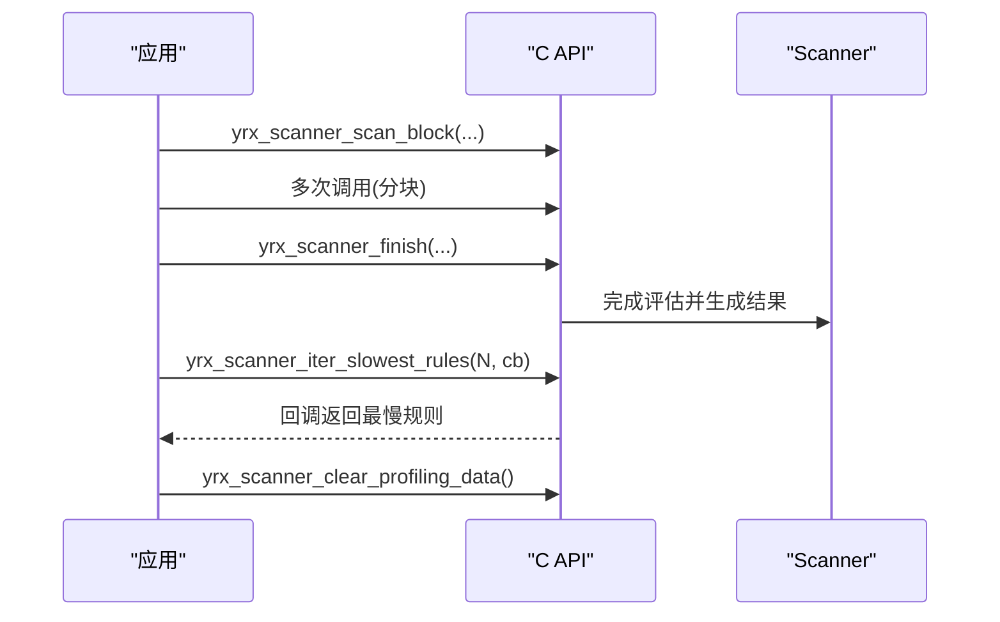
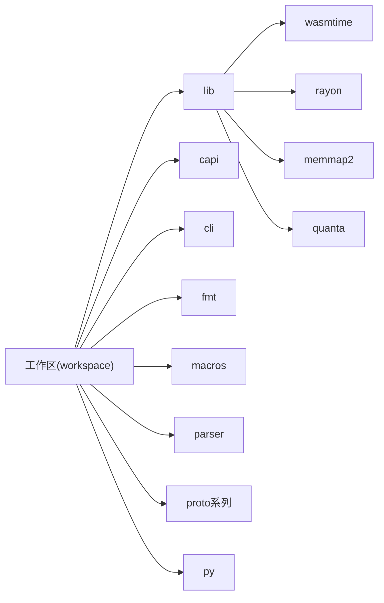

# 性能优化

<cite>
**本文引用的文件**
- [Cargo.toml](file://Cargo.toml)
- [Cargo.lock](file://Cargo.lock)
- [lib/src/scanner/mod.rs](file://lib/src/scanner/mod.rs)
- [lib/src/scanner/blocks.rs](file://lib/src/scanner/blocks.rs)
- [lib/src/scanner/context.rs](file://lib/src/scanner/context.rs)
- [lib/src/compiler/mod.rs](file://lib/src/compiler/mod.rs)
- [lib/src/compiler/atoms/quality.rs](file://lib/src/compiler/atoms/quality.rs)
- [lib/src/modules/elf/mod.rs](file://lib/src/modules/elf/mod.rs)
- [lib/src/scanner/tests.rs](file://lib/src/scanner/tests.rs)
- [capi/src/scanner.rs](file://capi/src/scanner.rs)
- [capi/include/yara_x.h](file://capi/include/yara_x.h)
- [cli/src/walk.rs](file://cli/src/walk.rs)
- [cli/src/commands/scan.rs](file://cli/src/commands/scan.rs)
- [site/content/blog/rules-profiling/index.md](file://site/content/blog/rules-profiling/index.md)
</cite>

## 目录
1. [引言](#引言)
2. [项目结构](#项目结构)
3. [核心组件](#核心组件)
4. [架构总览](#架构总览)
5. [详细组件分析](#详细组件分析)
6. [依赖关系分析](#依赖关系分析)
7. [性能考量](#性能考量)
8. [故障排查指南](#故障排查指南)
9. [结论](#结论)
10. [附录](#附录)

## 引言
本指南面向需要高性能扫描解决方案的高级用户，系统阐述 yara-x 在扫描性能方面的优化技术与实践，涵盖算法优化、内存使用策略、并行处理、缓存机制、规则优化方法（模式设计原则、条件表达式优化、常量折叠与死代码消除）、系统级调优（硬件与操作系统配置、监控指标与基准测试）、以及性能分析工具与瓶颈识别技巧。内容基于仓库中的实际实现与文档，帮助读者在真实场景中获得可落地的性能提升。

## 项目结构
yara-x 采用多 crate 的工作区组织方式，核心扫描能力位于 lib 子模块，CLI 提供命令行入口，C API 暴露跨语言接口，站点包含性能相关博客文章。与性能优化直接相关的模块包括：
- 扫描器：负责数据加载、块扫描、WASM 执行上下文与计时统计
- 编译器：规则编译、模式去重、大小界裁剪等优化
- 模块：如 ELF 模块的导入符号哈希缓存
- CLI 并行遍历：目录扫描的线程池与通道通信
- C API：慢规则迭代与清理接口

**图表来源**
- [lib/src/scanner/mod.rs:94-465](file://lib/src/scanner/mod.rs#L94-L465)
- [lib/src/scanner/context.rs:167-422](file://lib/src/scanner/context.rs#L167-L422)
- [lib/src/compiler/mod.rs:330-1488](file://lib/src/compiler/mod.rs#L330-L1488)
- [lib/src/compiler/atoms/quality.rs:433-460](file://lib/src/compiler/atoms/quality.rs#L433-L460)
- [lib/src/modules/elf/mod.rs:55-98](file://lib/src/modules/elf/mod.rs#L55-L98)
- [cli/src/walk.rs:339-467](file://cli/src/walk.rs#L339-L467)
- [cli/src/commands/scan.rs](file://cli/src/commands/scan.rs)
- [capi/src/scanner.rs:330-372](file://capi/src/scanner.rs#L330-L372)
- [capi/include/yara_x.h:240-267](file://capi/include/yara_x.h#L240-L267)

**章节来源**
- [Cargo.toml:17-29](file://Cargo.toml#L17-L29)
- [Cargo.toml:117-135](file://Cargo.toml#L117-L135)

## 核心组件
- 扫描器与数据加载
  - 支持 Slice/Vec/Mmap 三种数据后端，优先使用内存映射以降低拷贝与页错误开销
  - 块扫描器用于分块增量扫描，适合流式或大文件场景
  - 心跳计数器与超时机制保障长时间扫描的可控性
- 扫描上下文与计时
  - 条件执行时间与模式匹配时间分别统计，支持“最慢规则”迭代与清理
  - 超时发生时自动回填未记录的时间，保证统计一致性
- 编译器优化
  - 模式去重与 IR 共享，减少重复匹配
  - 文件大小界裁剪，避免对过大文件检查不相关的模式
  - 原子质量评估辅助选择更高效的模式
- 模块缓存
  - ELF 导入符号 MD5 缓存，避免重复计算
- 并行扫描
  - CLI 提供并行遍历器，通过线程池与通道进行任务分发
- C API
  - 提供块扫描、完成扫描、慢规则迭代与清理等接口

**章节来源**
- [lib/src/scanner/mod.rs:94-465](file://lib/src/scanner/mod.rs#L94-L465)
- [lib/src/scanner/blocks.rs:1-19](file://lib/src/scanner/blocks.rs#L1-L19)
- [lib/src/scanner/context.rs:167-422](file://lib/src/scanner/context.rs#L167-L422)
- [lib/src/compiler/mod.rs:330-1488](file://lib/src/compiler/mod.rs#L330-L1488)
- [lib/src/compiler/atoms/quality.rs:433-460](file://lib/src/compiler/atoms/quality.rs#L433-L460)
- [lib/src/modules/elf/mod.rs:55-98](file://lib/src/modules/elf/mod.rs#L55-L98)
- [cli/src/walk.rs:339-467](file://cli/src/walk.rs#L339-L467)
- [capi/src/scanner.rs:330-372](file://capi/src/scanner.rs#L330-L372)

## 架构总览
下图展示从 CLI 到扫描器、编译器与 WASM 执行环境的整体流程，以及性能相关的关键节点（并行、内存映射、计时、缓存）。

**图表来源**
- [cli/src/commands/scan.rs](file://cli/src/commands/scan.rs)
- [cli/src/walk.rs:339-467](file://cli/src/walk.rs#L339-L467)
- [lib/src/scanner/mod.rs:94-465](file://lib/src/scanner/mod.rs#L94-L465)
- [lib/src/compiler/mod.rs:330-1488](file://lib/src/compiler/mod.rs#L330-L1488)
- [lib/src/scanner/context.rs:167-422](file://lib/src/scanner/context.rs#L167-L422)
- [lib/src/modules/elf/mod.rs:55-98](file://lib/src/modules/elf/mod.rs#L55-L98)

## 详细组件分析

### 扫描器与内存映射
- 数据后端选择
  - Slice：零拷贝读取已有字节切片
  - Vec：内部持有缓冲，适合临时数据
  - Mmap：内存映射大文件，减少拷贝与页错误
- 块扫描
  - 分块增量扫描，适合流式输入或超大文件
- 超时与心跳
  - 后台线程每秒递增心跳计数，用于判定扫描是否超时

**图表来源**
- [lib/src/scanner/mod.rs:94-465](file://lib/src/scanner/mod.rs#L94-L465)
- [lib/src/scanner/blocks.rs:1-19](file://lib/src/scanner/blocks.rs#L1-L19)

**章节来源**
- [lib/src/scanner/mod.rs:94-465](file://lib/src/scanner/mod.rs#L94-L465)
- [lib/src/scanner/blocks.rs:1-19](file://lib/src/scanner/blocks.rs#L1-L19)

### 扫描上下文与规则计时
- 计时粒度
  - 模式匹配时间：按模式聚合
  - 条件执行时间：按规则聚合
- 最慢规则迭代
  - 提供回调接口，返回命名空间、规则名与耗时
- 清理统计
  - 支持清空累计的计时数据，便于新会话统计

**图表来源**
- [lib/src/scanner/context.rs:167-422](file://lib/src/scanner/context.rs#L167-L422)
- [capi/src/scanner.rs:633-711](file://capi/src/scanner.rs#L633-L711)
- [capi/include/yara_x.h:240-267](file://capi/include/yara_x.h#L240-L267)

**章节来源**
- [lib/src/scanner/context.rs:167-422](file://lib/src/scanner/context.rs#L167-L422)
- [capi/src/scanner.rs:633-711](file://capi/src/scanner.rs#L633-L711)
- [capi/include/yara_x.h:240-267](file://capi/include/yara_x.h#L240-L267)

### 编译器优化与规则优化
- 模式去重与共享
  - 通过 IR 去重，复用相同模式，减少匹配次数
- 文件大小界裁剪
  - 对 filesize 等条件生成文件大小边界，避免对过大文件检查不相关模式
- 原子质量评估
  - 评估模式原子的质量，指导选择更高效模式
- 规则编译流程
  - AST 转 IR、模式提取、条件转换、符号表与警告收集

**图表来源**
- [lib/src/compiler/mod.rs:330-1488](file://lib/src/compiler/mod.rs#L330-L1488)
- [lib/src/compiler/atoms/quality.rs:433-460](file://lib/src/compiler/atoms/quality.rs#L433-L460)

**章节来源**
- [lib/src/compiler/mod.rs:330-1488](file://lib/src/compiler/mod.rs#L330-L1488)
- [lib/src/compiler/atoms/quality.rs:433-460](file://lib/src/compiler/atoms/quality.rs#L433-L460)

### 模块缓存：ELF 导入符号 MD5
- 动态/静态符号选择
- 符号名过滤与小写化
- MD5 缓存导入符号集合，避免重复计算

**图表来源**
- [lib/src/modules/elf/mod.rs:55-98](file://lib/src/modules/elf/mod.rs#L55-L98)

**章节来源**
- [lib/src/modules/elf/mod.rs:55-98](file://lib/src/modules/elf/mod.rs#L55-L98)

### 并行扫描与任务分发
- 线程池与通道
  - 使用有界通道传递待处理路径，无界通道传递消息
  - 每线程初始化独立扫描器实例
- 错误处理
  - 遍历过程中错误回调决定是否继续或中止
- 可配置线程数
  - 默认根据 CPU 数量确定线程数，也可手动设置

**图表来源**
- [cli/src/walk.rs:339-467](file://cli/src/walk.rs#L339-L467)

**章节来源**
- [cli/src/walk.rs:339-467](file://cli/src/walk.rs#L339-L467)

### C API：块扫描与慢规则分析
- 块扫描接口
  - 先将数据分块传入，最后统一完成评估
  - 支持超时错误码
- 慢规则迭代
  - C 回调逐条返回命名空间、规则名与耗时
- 清理计时数据
  - 重新开始新的分析会话

**图表来源**
- [capi/src/scanner.rs:330-372](file://capi/src/scanner.rs#L330-L372)
- [capi/src/scanner.rs:633-711](file://capi/src/scanner.rs#L633-L711)
- [capi/include/yara_x.h:240-267](file://capi/include/yara_x.h#L240-L267)

**章节来源**
- [capi/src/scanner.rs:330-372](file://capi/src/scanner.rs#L330-L372)
- [capi/src/scanner.rs:633-711](file://capi/src/scanner.rs#L633-L711)
- [capi/include/yara_x.h:240-267](file://capi/include/yara_x.h#L240-L267)

## 依赖关系分析
- 工作区与依赖
  - 工作区包含 lib、capi、cli、fmt、macros、parser、proto 系列与 py
  - 关键依赖：wasmtime（WASM 执行引擎）、rayon（并行）、memmap2（内存映射）、quanta（高精度计时）
- 特殊构建配置
  - release-lto：启用链接时优化，适合发布二进制
  - dev 包 yara-x-parser：开启优化以避免递归导致栈溢出

**图表来源**
- [Cargo.toml:17-29](file://Cargo.toml#L17-L29)
- [Cargo.toml:105-105](file://Cargo.toml#L105-L105)
- [Cargo.toml:85-85](file://Cargo.toml#L85-L85)
- [Cargo.toml:70-70](file://Cargo.toml#L70-L70)
- [Cargo.toml:84-84](file://Cargo.toml#L84-L84)

**章节来源**
- [Cargo.toml:17-29](file://Cargo.toml#L17-L29)
- [Cargo.toml:117-135](file://Cargo.toml#L117-L135)
- [Cargo.lock:2080-2126](file://Cargo.lock#L2080-L2126)

## 性能考量
- 算法优化
  - 模式去重与 IR 共享显著降低匹配成本
  - 文件大小界裁剪避免对大文件不必要的检查
  - 原子质量评估指导选择更高效的模式
- 内存使用策略
  - 优先使用内存映射（Mmap）以减少拷贝与页错误
  - 块扫描适合流式与超大文件，降低峰值内存占用
  - 线程局部缓存（如 ELF 导入符号 MD5）避免重复计算
- 并行处理
  - CLI 并行遍历器默认按 CPU 数量分配线程
  - 有界通道控制背压，避免过多待处理任务
- 缓存机制
  - 模块层缓存（ELF）与规则计时缓存（profiling）提升整体吞吐
- 规则优化方法
  - 模式设计：优先使用高区分度、低冲突的原子；避免过长连续字节序列
  - 条件表达式：利用 filesize 等条件先行短路；合并相似判断
  - 常量折叠与死代码消除：编译阶段由 IR 与去重实现
- 系统级调优
  - 启用 release-lto 以获得更好的指令级优化
  - 调整线程数与通道容量以适配 IO 与 CPU 限制
  - 使用高精度计时（quanta）进行微基准测试
- 监控与基准
  - 使用“最慢规则”接口定位热点规则
  - 通过 profiling 数据对比优化前后的条件执行时间与模式匹配时间

**章节来源**
- [lib/src/compiler/mod.rs:330-1488](file://lib/src/compiler/mod.rs#L330-L1488)
- [lib/src/compiler/atoms/quality.rs:433-460](file://lib/src/compiler/atoms/quality.rs#L433-L460)
- [lib/src/modules/elf/mod.rs:55-98](file://lib/src/modules/elf/mod.rs#L55-L98)
- [lib/src/scanner/context.rs:167-422](file://lib/src/scanner/context.rs#L167-L422)
- [Cargo.toml:117-135](file://Cargo.toml#L117-L135)

## 故障排查指南
- 超时问题
  - 心跳计数器与超时错误码用于检测长时间运行
  - 在 C API 中可通过返回码识别超时并进行重试或降级
- 规则计时异常
  - 超时发生时会自动回填未记录的时间，确保统计完整性
  - 使用清理接口重置计时数据，避免跨会话累加影响
- 性能回归
  - 使用“最慢规则”接口定位热点规则，结合条件执行时间与模式匹配时间分析
  - 对热点规则重构条件表达式或调整模式设计
- 并行效率低
  - 检查线程数与通道容量配置
  - 观察错误回调是否频繁中断遍历，必要时优化错误处理逻辑

**章节来源**
- [lib/src/scanner/mod.rs:94-465](file://lib/src/scanner/mod.rs#L94-L465)
- [lib/src/scanner/context.rs:401-422](file://lib/src/scanner/context.rs#L401-L422)
- [capi/src/scanner.rs:330-372](file://capi/src/scanner.rs#L330-L372)
- [lib/src/scanner/tests.rs:788-816](file://lib/src/scanner/tests.rs#L788-L816)

## 结论
yara-x 在扫描性能方面提供了从算法、内存、并行到缓存与规则层面的系统性优化方案。通过模式去重、文件大小界裁剪、内存映射、块扫描、模块缓存、并行遍历与高精度计时，能够在复杂规则与海量数据场景下保持稳定与高效。建议在生产环境中结合“最慢规则”分析与基准测试持续优化，并根据硬件与操作系统特性调整线程与通道参数。

## 附录
- 相关博客：站点包含规则计时与性能分析相关内容，可作为进一步学习的参考
  - [rules-profiling 文章](file://site/content/blog/rules-profiling/index.md)