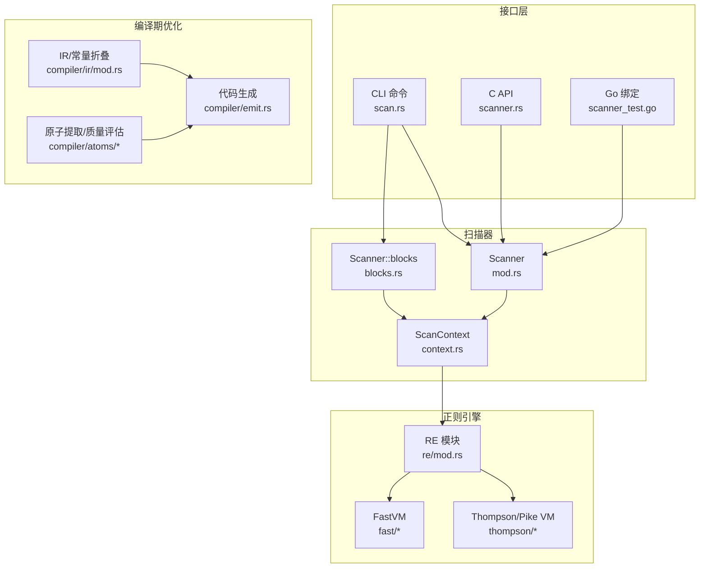
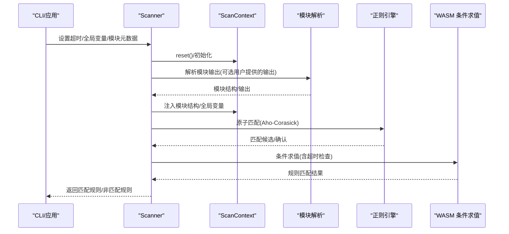
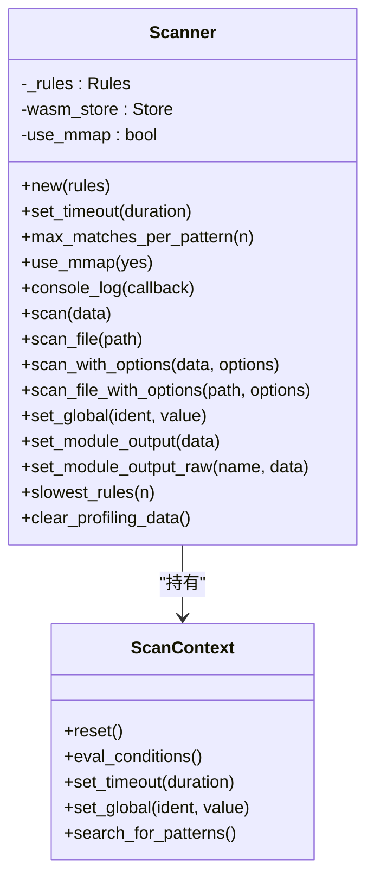
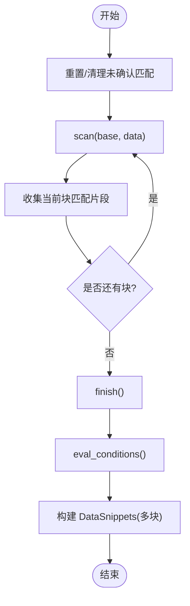
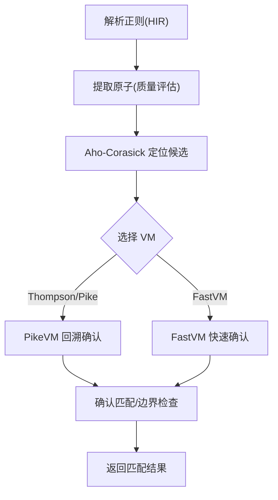
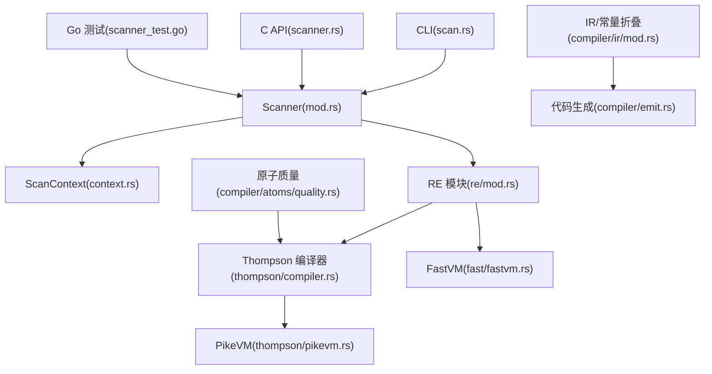

# 扫描性能优化

<cite>
**本文引用的文件**
- [lib/src/scanner/mod.rs](file://lib/src/scanner/mod.rs)
- [lib/src/scanner/blocks.rs](file://lib/src/scanner/blocks.rs)
- [lib/src/scanner/context.rs](file://lib/src/scanner/context.rs)
- [lib/src/re/mod.rs](file://lib/src/re/mod.rs)
- [lib/src/re/fast/fastvm.rs](file://lib/src/re/fast/fastvm.rs)
- [lib/src/re/thompson/compiler.rs](file://lib/src/re/thompson/compiler.rs)
- [lib/src/re/thompson/pikevm.rs](file://lib/src/re/thompson/pikevm.rs)
- [lib/src/compiler/atoms/mod.rs](file://lib/src/compiler/atoms/mod.rs)
- [lib/src/compiler/atoms/quality.rs](file://lib/src/compiler/atoms/quality.rs)
- [lib/src/compiler/ir/mod.rs](file://lib/src/compiler/ir/mod.rs)
- [lib/src/compiler/emit.rs](file://lib/src/compiler/emit.rs)
- [lib/src/lib.rs](file://lib/src/lib.rs)
- [capi/src/scanner.rs](file://capi/src/scanner.rs)
- [cli/src/commands/scan.rs](file://cli/src/commands/scan.rs)
- [go/scanner_test.go](file://go/scanner_test.go)
- [docs/ModuleDeveloperGuide.md](file://docs/ModuleDeveloperGuide.md)
- [site/content/blog/rules-profiling/index.md](file://site/content/blog/rules-profiling/index.md)
</cite>

## 目录
1. [简介](#简介)
2. [项目结构](#项目结构)
3. [核心组件](#核心组件)
4. [架构总览](#架构总览)
5. [详细组件分析](#详细组件分析)
6. [依赖关系分析](#依赖关系分析)
7. [性能考量](#性能考量)
8. [故障排查指南](#故障排查指南)
9. [结论](#结论)
10. [附录](#附录)

## 简介
本指南聚焦于 yara-x 的扫描性能优化，系统阐述扫描算法的关键优化技术与工程实践，包括原子匹配、回溯优化、内存映射与并行处理策略；详解扫描器工作原理、数据流处理、匹配策略与资源管理；给出不同文件大小与复杂度下的调优方法（批量扫描、增量扫描、缓存策略）；并提供性能基准测试与瓶颈识别技巧，帮助在实际场景中获得最佳扫描性能。

## 项目结构
yara-x 的扫描子系统由以下模块构成：
- 扫描器核心：单块扫描与多块扫描（增量）两种模式，支持超时控制、模块元数据注入、全局变量设置、规则级性能剖析等。
- 正则引擎：提供 Thompson/Pike 虚拟机与 FastVM 两种路径，分别面向通用正则与受限但高性能的正则表达式。
- 编译期优化：原子提取与质量评估、常量折叠、条件重写等，降低运行期开销。
- 接口层：C API、Go 绑定、CLI 工具，提供统一的扫描入口与性能参数配置。

图示来源
- [lib/src/scanner/mod.rs:175-432](file://lib/src/scanner/mod.rs#L175-L432)
- [lib/src/scanner/blocks.rs:21-87](file://lib/src/scanner/blocks.rs#L21-L87)
- [lib/src/scanner/context.rs:1832-1870](file://lib/src/scanner/context.rs#L1832-L1870)
- [lib/src/re/mod.rs:1-257](file://lib/src/re/mod.rs#L1-L257)
- [lib/src/re/fast/fastvm.rs:639-678](file://lib/src/re/fast/fastvm.rs#L639-L678)
- [lib/src/re/thompson/compiler.rs:233-255](file://lib/src/re/thompson/compiler.rs#L233-L255)
- [lib/src/compiler/atoms/mod.rs:411-515](file://lib/src/compiler/atoms/mod.rs#L411-L515)
- [lib/src/compiler/ir/mod.rs:743-765](file://lib/src/compiler/ir/mod.rs#L743-L765)
- [lib/src/compiler/emit.rs:1314-1349](file://lib/src/compiler/emit.rs#L1314-L1349)
- [capi/src/scanner.rs:110-211](file://capi/src/scanner.rs#L110-L211)
- [cli/src/commands/scan.rs:251-562](file://cli/src/commands/scan.rs#L251-L562)
- [go/scanner_test.go:143-163](file://go/scanner_test.go#L143-L163)

章节来源
- [lib/src/lib.rs:1-178](file://lib/src/lib.rs#L1-L178)
- [capi/src/scanner.rs:110-211](file://capi/src/scanner.rs#L110-L211)
- [cli/src/commands/scan.rs:251-562](file://cli/src/commands/scan.rs#L251-L562)

## 核心组件
- 扫描器 Scanner：负责加载数据（内存切片、缓冲区或内存映射）、执行模块解析、构建上下文、调度模式匹配与条件求值，并产出结果迭代器。
- 增量扫描 Scanner::blocks：按块扫描，适用于流式或内存受限场景，限制模块使用与跨块匹配。
- 正则引擎：Thompson/Pike VM 提供通用正则能力；FastVM 针对特定约束的正则提供更高性能。
- 编译期优化：原子提取与质量评估、常量折叠、循环内移等，减少运行期计算与分支。
- 上下文与内存管理：ScanContext 统一管理扫描状态、匹配位图、全局变量、模块输出与内存片段缓存。

章节来源
- [lib/src/scanner/mod.rs:175-432](file://lib/src/scanner/mod.rs#L175-L432)
- [lib/src/scanner/blocks.rs:21-87](file://lib/src/scanner/blocks.rs#L21-L87)
- [lib/src/re/mod.rs:1-257](file://lib/src/re/mod.rs#L1-L257)
- [lib/src/compiler/ir/mod.rs:743-765](file://lib/src/compiler/ir/mod.rs#L743-L765)

## 架构总览
yara-x 的扫描流程分为“准备阶段”和“执行阶段”。准备阶段完成模块解析、上下文初始化与条件编译；执行阶段先进行原子匹配（Aho-Corasick），再通过虚拟机确认匹配，最后求值规则条件。

图示来源
- [lib/src/scanner/mod.rs:487-608](file://lib/src/scanner/mod.rs#L487-L608)
- [lib/src/scanner/context.rs:457-475](file://lib/src/scanner/context.rs#L457-L475)

## 详细组件分析

### 单块扫描器（Scanner）
- 数据加载策略：小文件直接读入内存，大文件采用只读内存映射以提升吞吐；可通过 use_mmap 控制。
- 模块解析：按导入模块逐个执行 main 函数或使用用户提供的输出，构建根结构。
- 条件求值：调用 WASM 主函数评估规则条件，期间进行超时心跳检测。
- 结果封装：提供匹配/非匹配规则迭代器，支持私有规则过滤。

图示来源
- [lib/src/scanner/mod.rs:181-432](file://lib/src/scanner/mod.rs#L181-L432)
- [lib/src/scanner/context.rs:457-489](file://lib/src/scanner/context.rs#L457-L489)

章节来源
- [lib/src/scanner/mod.rs:216-231](file://lib/src/scanner/mod.rs#L216-L231)
- [lib/src/scanner/mod.rs:454-485](file://lib/src/scanner/mod.rs#L454-L485)
- [lib/src/scanner/mod.rs:487-608](file://lib/src/scanner/mod.rs#L487-L608)

### 增量扫描器（Scanner::blocks）
- 块扫描：按 base+data 的方式多次扫描，每次扫描后仅保留当前块内的匹配片段，避免跨块匹配。
- 片段缓存：将匹配片段保存到 BTreeMap，finish 后统一生成结果。
- 限制与一致性：模块不可用、filesize 未定义、跨块不匹配；重叠块需保证内容一致。

图示来源
- [lib/src/scanner/blocks.rs:101-195](file://lib/src/scanner/blocks.rs#L101-L195)
- [lib/src/scanner/blocks.rs:197-217](file://lib/src/scanner/blocks.rs#L197-L217)

章节来源
- [lib/src/scanner/blocks.rs:48-82](file://lib/src/scanner/blocks.rs#L48-L82)
- [lib/src/scanner/blocks.rs:101-195](file://lib/src/scanner/blocks.rs#L101-L195)
- [lib/src/scanner/blocks.rs:197-217](file://lib/src/scanner/blocks.rs#L197-L217)

### 正则引擎与原子匹配
- 原子提取：从 HIR 中提取高质量原子，用于 Aho-Corasick 快速定位候选位置。
- Thompson/Pike VM：通用正则匹配，支持回溯与前后向扫描。
- FastVM：针对特定约束的正则，提供更快的运行时性能。
- 扫描限制：默认扫描限制为 4096 字节，避免无界回溯导致的性能退化。

图示来源
- [lib/src/re/mod.rs:40-96](file://lib/src/re/mod.rs#L40-L96)
- [lib/src/re/thompson/compiler.rs:233-255](file://lib/src/re/thompson/compiler.rs#L233-L255)
- [lib/src/re/fast/fastvm.rs:639-678](file://lib/src/re/fast/fastvm.rs#L639-L678)

章节来源
- [lib/src/re/mod.rs:40-96](file://lib/src/re/mod.rs#L40-L96)
- [lib/src/re/thompson/compiler.rs:1156-1190](file://lib/src/re/thompson/compiler.rs#L1156-L1190)
- [lib/src/re/fast/fastvm.rs:639-678](file://lib/src/re/fast/fastvm.rs#L639-L678)

### 编译期优化与常量折叠
- 原子质量评估：以最小原子质量、最小长度、平均质量为排序准则，选择最优原子集。
- 常量折叠与循环内移：将不依赖循环变量的表达式移出循环，减少运行期计算。
- 代码生成：根据 IR 生成 WASM 指令，包含映射查找等宿主侧调用。

图示来源
- [lib/src/compiler/atoms/quality.rs:320-348](file://lib/src/compiler/atoms/quality.rs#L320-L348)
- [lib/src/compiler/ir/mod.rs:743-765](file://lib/src/compiler/ir/mod.rs#L743-L765)
- [lib/src/compiler/emit.rs:1314-1349](file://lib/src/compiler/emit.rs#L1314-L1349)

章节来源
- [lib/src/compiler/atoms/quality.rs:320-348](file://lib/src/compiler/atoms/quality.rs#L320-L348)
- [lib/src/compiler/ir/mod.rs:743-765](file://lib/src/compiler/ir/mod.rs#L743-L765)
- [lib/src/compiler/emit.rs:1314-1349](file://lib/src/compiler/emit.rs#L1314-L1349)

### 资源管理与内存映射
- 内存映射阈值：超过约 500MB 文件使用只读内存映射；小于该阈值直接读入内存，避免 mmap 开销。
- 数据生命周期：单块扫描直接引用输入；多块扫描复制匹配片段至 BTreeMap，避免长期持有大块内存。
- 模块输出复用：通过 set_module_output/set_module_output_raw 复用模块解析结果，避免重复解析。

章节来源
- [lib/src/scanner/mod.rs:467-485](file://lib/src/scanner/mod.rs#L467-L485)
- [lib/src/scanner/mod.rs:611-655](file://lib/src/scanner/mod.rs#L611-L655)
- [lib/src/scanner/mod.rs:308-411](file://lib/src/scanner/mod.rs#L308-L411)

### 超时与并发
- 超时机制：心跳计数器每秒递增，WASM 条件求值与模式搜索过程中检测超时。
- 并发扫描：CLI 支持多线程扫描目录；单个 Scanner 串行扫描，多 Scanner 并行扫描不同目标。

章节来源
- [lib/src/scanner/mod.rs:94-100](file://lib/src/scanner/mod.rs#L94-L100)
- [lib/src/scanner/context.rs:457-475](file://lib/src/scanner/context.rs#L457-L475)
- [cli/src/commands/scan.rs:343-345](file://cli/src/commands/scan.rs#L343-L345)

## 依赖关系分析

图示来源
- [lib/src/scanner/mod.rs:1-120](file://lib/src/scanner/mod.rs#L1-L120)
- [lib/src/re/mod.rs:1-257](file://lib/src/re/mod.rs#L1-L257)
- [lib/src/re/thompson/compiler.rs:233-255](file://lib/src/re/thompson/compiler.rs#L233-L255)
- [lib/src/re/fast/fastvm.rs:639-678](file://lib/src/re/fast/fastvm.rs#L639-L678)
- [lib/src/re/thompson/pikevm.rs:153-190](file://lib/src/re/thompson/pikevm.rs#L153-L190)
- [lib/src/compiler/ir/mod.rs:743-765](file://lib/src/compiler/ir/mod.rs#L743-L765)
- [lib/src/compiler/emit.rs:1314-1349](file://lib/src/compiler/emit.rs#L1314-L1349)
- [lib/src/compiler/atoms/quality.rs:320-348](file://lib/src/compiler/atoms/quality.rs#L320-L348)
- [cli/src/commands/scan.rs:343-345](file://cli/src/commands/scan.rs#L343-L345)
- [capi/src/scanner.rs:110-211](file://capi/src/scanner.rs#L110-L211)
- [go/scanner_test.go:143-163](file://go/scanner_test.go#L143-L163)

章节来源
- [lib/src/lib.rs:61-72](file://lib/src/lib.rs#L61-L72)

## 性能考量

### 原子匹配与回溯优化
- 原子质量优先：选择最小原子质量高、长度长且平均质量均衡的原子集，提升 Aho-Corasick 效率。
- FastVM 适用性：当正则满足约束时优先使用 FastVM，显著降低运行时成本。
- 回溯限制：默认扫描限制为 4096 字节，防止极端回溯导致性能退化。

章节来源
- [lib/src/compiler/atoms/quality.rs:320-348](file://lib/src/compiler/atoms/quality.rs#L320-L348)
- [lib/src/re/mod.rs:40-96](file://lib/src/re/mod.rs#L40-L96)
- [lib/src/re/fast/fastvm.rs:639-678](file://lib/src/re/fast/fastvm.rs#L639-L678)

### 内存映射与数据加载
- 大文件使用内存映射：超过阈值（约 500MB）使用只读内存映射，提高吞吐；小文件直接读入内存，避免 mmap 开销。
- 多块扫描内存复用：仅缓存当前块匹配片段，避免长时间持有全部数据。

章节来源
- [lib/src/scanner/mod.rs:467-485](file://lib/src/scanner/mod.rs#L467-L485)
- [lib/src/scanner/blocks.rs:156-192](file://lib/src/scanner/blocks.rs#L156-L192)

### 并行处理策略
- CLI 多线程：通过 --threads 指定并发扫描线程数，适合目录批量扫描。
- 单 Scanner 串行：每个 Scanner 一次只能扫描一个文件或内存块；多 Scanner 并行扫描不同目标。

章节来源
- [cli/src/commands/scan.rs:343-345](file://cli/src/commands/scan.rs#L343-L345)

### 规则与条件优化
- 常量折叠与循环内移：减少运行期计算，提升条件求值效率。
- 模块输出复用：通过 set_module_output/set_module_output_raw 复用模块解析结果，避免重复解析。

章节来源
- [lib/src/compiler/ir/mod.rs:743-765](file://lib/src/compiler/ir/mod.rs#L743-L765)
- [lib/src/compiler/emit.rs:1314-1349](file://lib/src/compiler/emit.rs#L1314-L1349)
- [lib/src/scanner/mod.rs:308-411](file://lib/src/scanner/mod.rs#L308-L411)

### 不同文件大小与复杂度下的调优
- 小文件：禁用内存映射（use_mmap(false)）或保持默认，直接读取内存即可。
- 大文件：启用内存映射（默认），利用只读映射提升吞吐。
- 复杂正则：尽量使用 FastVM 可兼容的正则形式；必要时拆分规则，减少单一规则的复杂度。
- 增量扫描：流式或内存受限场景使用 Scanner::blocks，注意模块限制与跨块匹配限制。

章节来源
- [lib/src/scanner/mod.rs:216-231](file://lib/src/scanner/mod.rs#L216-L231)
- [lib/src/scanner/mod.rs:467-485](file://lib/src/scanner/mod.rs#L467-L485)
- [lib/src/scanner/blocks.rs:48-82](file://lib/src/scanner/blocks.rs#L48-L82)

### 批量扫描、增量扫描与缓存策略
- 批量扫描：CLI 使用 ParWalker 并发遍历目录，结合 --threads 与 --recursive 控制深度与并发度。
- 增量扫描：按块扫描，finish 后一次性评估条件，适合流式或受限内存场景。
- 缓存策略：模块输出缓存（set_module_output/set_module_output_raw）、匹配片段缓存（多块扫描的 BTreeMap）。

章节来源
- [cli/src/commands/scan.rs:337-351](file://cli/src/commands/scan.rs#L337-L351)
- [lib/src/scanner/blocks.rs:156-192](file://lib/src/scanner/blocks.rs#L156-L192)
- [lib/src/scanner/mod.rs:308-411](file://lib/src/scanner/mod.rs#L308-L411)

## 故障排查指南

### 超时问题
- 现象：扫描返回 Timeout 错误。
- 排查：检查规则条件是否存在长循环或复杂正则；适当增加 --timeout 或优化规则；使用规则剖析功能定位慢规则。

章节来源
- [lib/src/scanner/context.rs:457-475](file://lib/src/scanner/context.rs#L457-L475)
- [site/content/blog/rules-profiling/index.md:26-91](file://site/content/blog/rules-profiling/index.md#L26-L91)

### 模块限制与错误
- 现象：使用模块或 filesize 报错或返回 undefined。
- 排查：多块扫描模式下模块不可用、filesize 未定义；确保使用文本/十六进制/正则模式，避免跨块匹配。

章节来源
- [lib/src/scanner/blocks.rs:48-82](file://lib/src/scanner/blocks.rs#L48-L82)

### 性能剖析与瓶颈识别
- 启用剖析：使用 --profiling（需构建时启用 rules-profiling 特性），查看规则的模式匹配时间与条件求值时间。
- 结果解读：关注总耗时最长的规则，区分是模式匹配还是条件求值导致的瓶颈。

章节来源
- [site/content/blog/rules-profiling/index.md:26-91](file://site/content/blog/rules-profiling/index.md#L26-L91)
- [lib/src/scanner/mod.rs:412-431](file://lib/src/scanner/mod.rs#L412-L431)

### 基准测试
- Go 基准：提供基础扫描基准，可用于对比不同规则/数据规模下的性能变化。
- CLI 基准：建议在相同硬件与规则集下，固定 --threads 与 --timeout，测量不同文件大小与规则复杂度的吞吐。

章节来源
- [go/scanner_test.go:143-163](file://go/scanner_test.go#L143-L163)
- [cli/src/commands/scan.rs:343-345](file://cli/src/commands/scan.rs#L343-L345)

## 结论
yara-x 在扫描性能方面通过“编译期优化 + 运行期高效匹配 + 灵活的数据加载与并发策略”实现了全面优化。实践中应结合文件规模选择内存映射策略，利用 FastVM 与原子质量优化正则，通过规则剖析定位瓶颈，并在批量扫描场景合理配置并发度与缓存策略，从而在不同复杂度与规模下获得最佳性能。

## 附录

### 关键 API 与参数
- 超时设置：Scanner::set_timeout、C API yrx_scanner_set_timeout
- 内存映射：Scanner::use_mmap、CLI --no-mmap
- 模块输出：Scanner::set_module_output/set_module_output_raw、C API yrx_scanner_set_module_output
- 全局变量：Scanner::set_global、C API yrx_scanner_set_global_*、JSON
- 规则剖析：Scanner::slowest_rules、CLI --profiling

章节来源
- [lib/src/scanner/mod.rs:194-231](file://lib/src/scanner/mod.rs#L194-L231)
- [lib/src/scanner/mod.rs:308-411](file://lib/src/scanner/mod.rs#L308-L411)
- [capi/src/scanner.rs:143-155](file://capi/src/scanner.rs#L143-L155)
- [capi/src/scanner.rs:452-491](file://capi/src/scanner.rs#L452-L491)
- [capi/src/scanner.rs:537-634](file://capi/src/scanner.rs#L537-L634)
- [site/content/blog/rules-profiling/index.md:26-91](file://site/content/blog/rules-profiling/index.md#L26-L91)