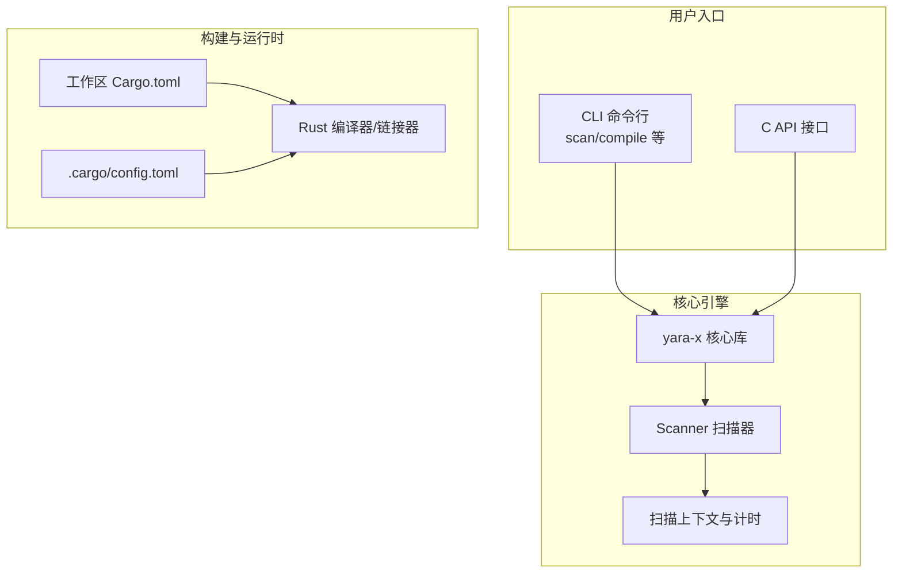
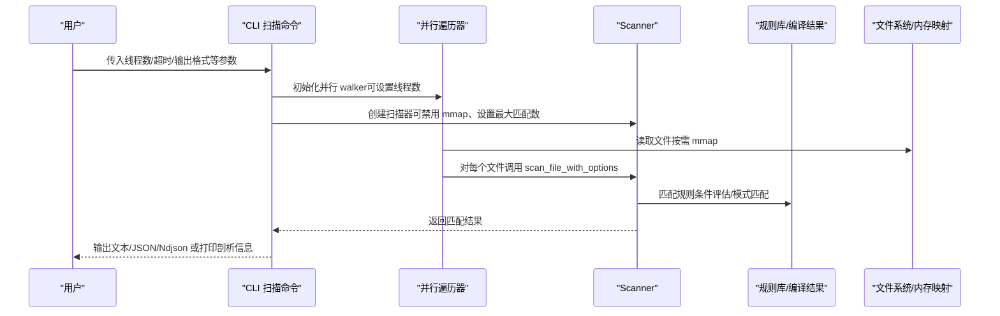
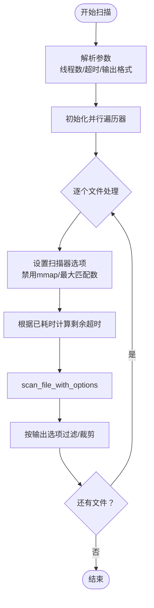
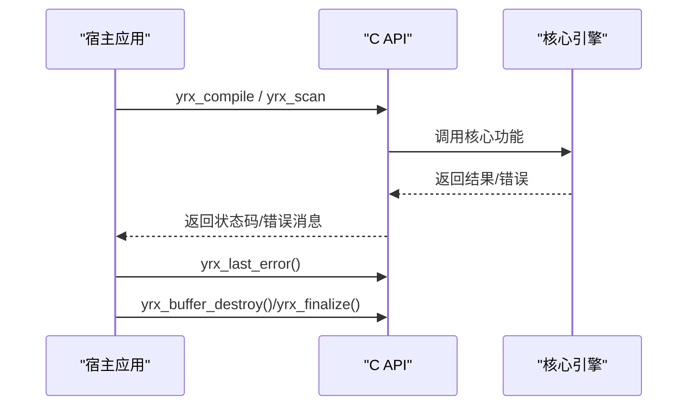
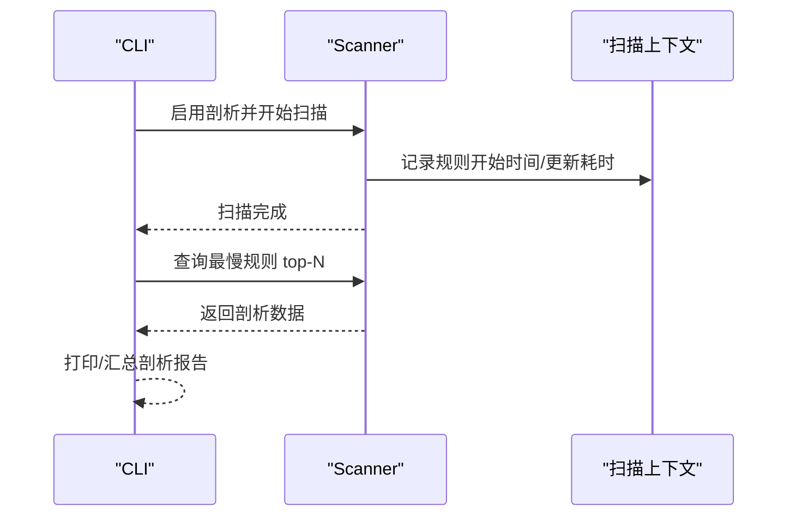
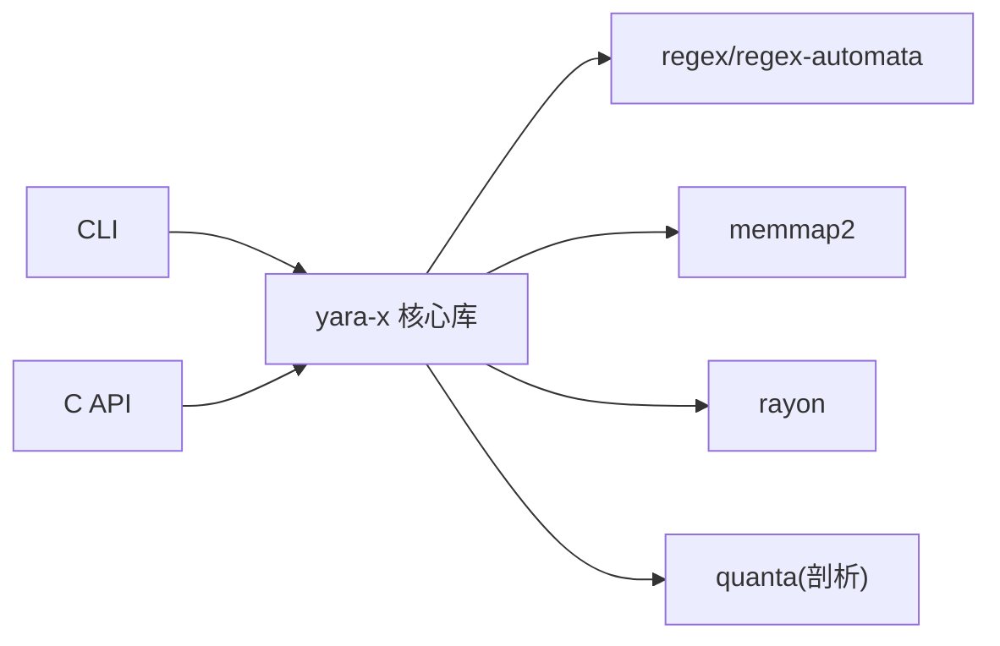

# 系统级调优

<cite>
**本文引用的文件**   
- [Cargo.toml](file://Cargo.toml)
- [.cargo/config.toml](file://.cargo/config.toml)
- [cli/src/main.rs](file://cli/src/main.rs)
- [lib/Cargo.toml](file://lib/Cargo.toml)
- [capi/src/lib.rs](file://capi/src/lib.rs)
- [cli/src/commands/scan.rs](file://cli/src/commands/scan.rs)
- [cli/src/commands/compile.rs](file://cli/src/commands/compile.rs)
- [cli/src/config.rs](file://cli/src/config.rs)
- [lib/src/scanner/context.rs](file://lib/src/scanner/context.rs)
- [site/content/blog/rules-profiling/index.md](file://site/content/blog/rules-profiling/index.md)
</cite>

## 目录
1. [简介](#简介)
2. [项目结构](#项目结构)
3. [核心组件](#核心组件)
4. [架构总览](#架构总览)
5. [详细组件分析](#详细组件分析)
6. [依赖关系分析](#依赖关系分析)
7. [性能考量与优化建议](#性能考量与优化建议)
8. [故障排查指南](#故障排查指南)
9. [结论](#结论)
10. [附录](#附录)

## 简介
本指南面向系统工程师与运维人员，围绕 YARA-X 在不同部署形态（服务器、容器、云）下的系统级性能调优进行系统化阐述。内容覆盖硬件与操作系统层面的优化、运行时与编译期配置、并发与 I/O 调度、内存映射与缓存策略、规则编译与扫描路径的性能权衡、以及可观测性与基准测试实践。文档以仓库中的构建配置、CLI 命令实现、C API 设计与规则剖析为依据，结合站点博客对规则剖析功能的说明，形成可落地的调优策略。

## 项目结构
YARA-X 采用多 crate 的工作区组织方式，核心模块包括：
- lib：核心引擎与规则执行逻辑
- cli：命令行工具，提供编译、扫描、格式化等能力
- capi：C 可兼容接口，便于在 C/C++ 环境集成
- parser、fmt、proto 等周边模块
- site：文档与博客资源

下图展示与性能调优直接相关的模块与交互：

图表来源
- [Cargo.toml:17-30](file://Cargo.toml#L17-L30)
- [lib/Cargo.toml:30-86](file://lib/Cargo.toml#L30-L86)
- [.cargo/config.toml:1-21](file://.cargo/config.toml#L1-L21)
- [cli/src/main.rs:31-107](file://cli/src/main.rs#L31-L107)
- [capi/src/lib.rs:1-269](file://capi/src/lib.rs#L1-L269)
- [lib/src/scanner/context.rs:155-616](file://lib/src/scanner/context.rs#L155-L616)

章节来源
- [Cargo.toml:17-30](file://Cargo.toml#L17-L30)
- [lib/Cargo.toml:30-86](file://lib/Cargo.toml#L30-L86)
- [.cargo/config.toml:1-21](file://.cargo/config.toml#L1-L21)
- [cli/src/main.rs:31-107](file://cli/src/main.rs#L31-L107)
- [capi/src/lib.rs:1-269](file://capi/src/lib.rs#L1-L269)
- [lib/src/scanner/context.rs:155-616](file://lib/src/scanner/context.rs#L155-L616)

## 核心组件
- 工作区与构建配置
  - 工作区统一版本与 Rust 版本，定义发布配置（含 LTO 与 codegen-units），并为解析器包启用调试优化级别，确保递归词法分析在调试构建中具备尾递归消除所需的优化。
- 运行时与平台适配
  - 针对 musl 链接的特殊标志与链接器配置，保证跨平台静态二进制的稳定性。
- CLI 扫描与编译
  - 提供线程数控制、超时、内存映射开关、最大匹配数限制、输出格式、规则剖析等参数，贯穿 I/O 并发、内存使用与时间预算。
- C API
  - 暴露编译、扫描、错误查询、缓冲区管理与最终化接口，支持动态加载场景下的全局信号处理器清理。
- 规则剖析
  - 在启用特性后，记录每条规则的模式匹配与条件评估耗时，辅助定位热点规则。

章节来源
- [Cargo.toml:117-135](file://Cargo.toml#L117-L135)
- [.cargo/config.toml:1-21](file://.cargo/config.toml#L1-L21)
- [cli/src/commands/scan.rs:44-204](file://cli/src/commands/scan.rs#L44-L204)
- [cli/src/commands/compile.rs:13-70](file://cli/src/commands/compile.rs#L13-L70)
- [capi/src/lib.rs:118-179](file://capi/src/lib.rs#L118-L179)
- [lib/src/scanner/context.rs:155-616](file://lib/src/scanner/context.rs#L155-L616)

## 架构总览
下图展示从 CLI 到核心引擎的关键调用链与性能相关配置点：

图表来源
- [cli/src/commands/scan.rs:340-523](file://cli/src/commands/scan.rs#L340-L523)
- [lib/src/scanner/context.rs:155-616](file://lib/src/scanner/context.rs#L155-L616)

章节来源
- [cli/src/commands/scan.rs:251-562](file://cli/src/commands/scan.rs#L251-L562)
- [lib/src/scanner/context.rs:155-616](file://lib/src/scanner/context.rs#L155-L616)

## 详细组件分析

### CLI 扫描命令与并发/I/O 调优
- 关键参数
  - 线程数：通过命令行参数控制并行 walker 的线程数量，直接影响 CPU 并发与 I/O 吞吐。
  - 超时：基于已消耗时间动态计算剩余超时，避免扫描器在剩余时间内超时。
  - 内存映射：可禁用 mmap，降低内存占用但可能影响顺序访问性能。
  - 最大匹配数：限制每条模式的最大匹配返回数量，减少输出膨胀与内存压力。
  - 输出格式：支持文本、JSON、NDJSON，不同格式对序列化开销与吞吐有差异。
- 实现要点
  - 并行遍历器在初始化阶段应用线程数；文件处理回调中设置扫描器选项，并在错误回调中区分超时中断。
  - 支持“仅计数”“仅未满足规则”“标签过滤”等裁剪输出，减少下游处理成本。
- 性能影响
  - 线程数与磁盘/网络 IOPS 密切相关；CPU 核心数与规则复杂度决定最佳线程上限。
  - mmap 在大文件顺序读取场景收益显著，但在小文件频繁随机访问时可能增加页表压力。

图表来源
- [cli/src/commands/scan.rs:251-523](file://cli/src/commands/scan.rs#L251-L523)

章节来源
- [cli/src/commands/scan.rs:44-204](file://cli/src/commands/scan.rs#L44-L204)
- [cli/src/commands/scan.rs:251-562](file://cli/src/commands/scan.rs#L251-L562)

### C API 与动态加载场景
- 错误与状态
  - 提供线程本地的最后错误查询接口，便于在多线程环境下定位问题。
  - 提供缓冲区生命周期管理与最终化接口，用于动态卸载场景清理全局状态。
- 使用建议
  - 动态加载时务必遵循最终化接口的前置条件，避免与其他引擎共享的全局状态被破坏。
  - 在多线程扫描中，注意错误指针的有效期与线程安全。

图表来源
- [capi/src/lib.rs:118-179](file://capi/src/lib.rs#L118-L179)
- [capi/src/lib.rs:210-269](file://capi/src/lib.rs#L210-L269)

章节来源
- [capi/src/lib.rs:118-179](file://capi/src/lib.rs#L118-L179)
- [capi/src/lib.rs:210-269](file://capi/src/lib.rs#L210-L269)

### 规则剖析与热点定位
- 功能说明
  - 在启用特性后，记录每条规则的模式匹配与条件评估耗时，扫描结束后汇总最慢规则列表。
- 使用方式
  - CLI 提供剖析开关；站点博客给出示例输出与解读。
- 应用建议
  - 将剖析结果作为规则重构的依据：简化正则、拆分复杂条件、减少全局变量访问与模块调用。

图表来源
- [cli/src/commands/scan.rs:476-559](file://cli/src/commands/scan.rs#L476-L559)
- [lib/src/scanner/context.rs:155-616](file://lib/src/scanner/context.rs#L155-L616)
- [site/content/blog/rules-profiling/index.md:48-91](file://site/content/blog/rules-profiling/index.md#L48-L91)

章节来源
- [cli/src/commands/scan.rs:141-143](file://cli/src/commands/scan.rs#L141-L143)
- [cli/src/commands/scan.rs:476-559](file://cli/src/commands/scan.rs#L476-L559)
- [lib/src/scanner/context.rs:155-616](file://lib/src/scanner/context.rs#L155-L616)
- [site/content/blog/rules-profiling/index.md:48-91](file://site/content/blog/rules-profiling/index.md#L48-L91)

### 构建与发布配置对性能的影响
- 发布配置
  - LTO（链接时优化）与单 codegen-unit 有助于整体二进制体积与运行时指令缓存友好性。
- 解析器包优化
  - 在 dev 包上启用基础优化级别，确保递归词法分析依赖的尾递归消除在调试构建中可用，避免栈溢出。
- 平台链接
  - musl 静态链接的特殊重定位模型与链接器配置，保障跨平台二进制稳定性。

章节来源
- [Cargo.toml:117-135](file://Cargo.toml#L117-L135)
- [.cargo/config.toml:1-21](file://.cargo/config.toml#L1-L21)

## 依赖关系分析
- 组件耦合
  - CLI 依赖核心库；C API 亦依赖核心库；规则剖析功能依赖日志与时钟库。
- 外部依赖
  - 并行与任务调度依赖 rayon；高性能正则与自动机由 regex/regex-automata 提供；内存映射由 memmap2 提供。
- 影响路径
  - 并行度与 I/O 行为受 CLI 参数与底层遍历器影响；规则剖析依赖上下文计时与日志特性。

图表来源
- [lib/Cargo.toml:226-285](file://lib/Cargo.toml#L226-L285)
- [Cargo.toml:34-107](file://Cargo.toml#L34-L107)
- [cli/src/commands/scan.rs:340-345](file://cli/src/commands/scan.rs#L340-L345)

章节来源
- [lib/Cargo.toml:226-285](file://lib/Cargo.toml#L226-L285)
- [Cargo.toml:34-107](file://Cargo.toml#L34-L107)
- [cli/src/commands/scan.rs:340-345](file://cli/src/commands/scan.rs#L340-L345)

## 性能考量与优化建议

### 硬件与系统级要求
- CPU
  - 建议多核服务器或云主机，规则复杂度高时优先提升核心数而非主频。
  - 正则密集型规则可受益于现代 CPU 的 SIMD 与分支预测能力。
- 内存
  - 大规模规则集与高并发扫描会放大内存占用；建议预留足够交换空间与页面缓存。
  - 对于大文件扫描，mmap 可减少拷贝，但需关注页表与 TLB 压力。
- 存储
  - 顺序读取场景优先使用 SSD；对于小文件随机访问，SSD 的优势更明显。
  - 文件系统应开启写回缓存与合适的目录项预读策略。
- 网络
  - 远端扫描源建议使用本地缓存或压缩传输；避免高延迟链路导致 I/O 等待放大。

### 操作系统与内核优化
- 文件系统
  - ext4/xfs 上启用合适的 inode/块分配策略；对只读规则文件可考虑只读挂载与内核页缓存利用。
  - 调整读写缓冲与异步 IO 参数，平衡吞吐与延迟。
- 进程与调度
  - 将扫描进程绑定到特定 CPU 核心，减少迁移开销；在 NUMA 环境下按节点亲和。
  - 适当提高文件描述符限制与打开文件数软硬限制。
- I/O 与内存
  - 合理设置内核脏页比例与刷新策略，避免突发写放大。
  - 对于频繁访问的规则文件，尽量保持在页缓存中。

### 运行时与编译期配置
- 并发与线程池
  - CLI 的线程数参数直接驱动并行遍历器；建议从 CPU 核心数出发，结合规则复杂度与 I/O 等待比进行微调。
  - 对于 C API 场景，避免在单进程中创建过多独立引擎实例，减少全局状态竞争。
- 内存与映射
  - 默认启用 mmap 以降低复制成本；在小文件/随机访问场景可考虑禁用以减少页抖动。
  - 控制每条模式的最大匹配数，避免大规模输出带来的内存峰值。
- 编译期优化
  - 发布构建启用 LTO 与单 codegen-unit，有利于整体性能与体积；调试构建对解析器包启用基础优化，避免栈溢出。
- 日志与剖析
  - 开启日志与剖析会带来额外开销，建议仅在定位瓶颈时临时启用。

章节来源
- [cli/src/commands/scan.rs:193-202](file://cli/src/commands/scan.rs#L193-L202)
- [cli/src/commands/scan.rs:403-409](file://cli/src/commands/scan.rs#L403-L409)
- [Cargo.toml:117-135](file://Cargo.toml#L117-L135)
- [lib/src/scanner/context.rs:155-616](file://lib/src/scanner/context.rs#L155-L616)

### 性能监控与基准测试
- 关键指标
  - 扫描吞吐（文件/秒）、平均/中位/尾延迟、CPU 利用率、I/O 带宽、页错误与上下文切换次数。
  - 规则剖析：每条规则的模式匹配与条件评估耗时，识别热点。
- 回归检测
  - 建立基线：固定规则集、目标文件集合与并发度，定期运行并记录指标。
  - 报告异常：对延迟与吞吐的显著波动进行告警。
- 容量规划
  - 以规则复杂度、文件大小分布与并发度为输入，建立线性/非线性拟合模型，估算资源需求。

章节来源
- [site/content/blog/rules-profiling/index.md:48-91](file://site/content/blog/rules-profiling/index.md#L48-L91)
- [cli/src/commands/scan.rs:526-559](file://cli/src/commands/scan.rs#L526-L559)

### 不同部署环境的调优策略
- 服务器
  - 优先使用 SSD；合理设置内核参数与文件系统；将扫描进程与规则文件置于同一磁盘阵列以减少跨盘 I/O。
- 容器
  - 限制 CPU/内存并设置合理的 OOM 策略；持久化规则文件挂载为只读卷；避免在容器内频繁生成临时规则文件。
- 云
  - 选择靠近数据源的实例类型；利用对象存储直读（如适用）减少中间层拷贝；在弹性伸缩场景下保持规则缓存与热数据驻留。

## 故障排查指南
- 常见错误与定位
  - C API 错误查询接口可用于快速定位最近一次失败的原因；动态卸载前必须满足最终化的严格前置条件。
  - CLI 在超时场景会中止遍历，错误回调中可区分超时与其他错误。
- 日志与剖析
  - 启用日志与剖析特性可获得更细粒度的耗时分解；剖析报告有助于判断是模式匹配还是条件评估成为瓶颈。
- 配置校验
  - CLI 配置文件采用 TOML 结构，字段未知或类型不匹配会导致解析失败；建议在 CI 中加入配置校验步骤。

章节来源
- [capi/src/lib.rs:163-179](file://capi/src/lib.rs#L163-L179)
- [cli/src/commands/scan.rs:500-522](file://cli/src/commands/scan.rs#L500-L522)
- [cli/src/config.rs:202-210](file://cli/src/config.rs#L202-L210)

## 结论
YARA-X 的系统级调优需要从硬件、操作系统、运行时与编译期配置、并发与 I/O、规则设计与剖析五个维度协同推进。通过合理设置线程数、mmap、最大匹配数与输出格式，结合规则剖析与持续监控，可在不同部署环境中稳定提升扫描吞吐与响应质量。发布配置中的 LTO 与单 codegen-unit 有助于整体性能与体积优化；在动态加载场景下严格遵循最终化流程，避免全局状态冲突。

## 附录
- 关键参数速查
  - 线程数：控制并行度
  - 超时：按已耗时动态计算剩余时间
  - 禁用 mmap：降低内存占用
  - 最大匹配数：限制输出规模
  - 输出格式：文本/JSON/Ndjson
  - 规则剖析：定位热点规则
- 参考实现位置
  - CLI 扫描命令参数与行为：[cli/src/commands/scan.rs:44-204](file://cli/src/commands/scan.rs#L44-L204)
  - CLI 编译命令参数与行为：[cli/src/commands/compile.rs:13-70](file://cli/src/commands/compile.rs#L13-L70)
  - C API 错误与缓冲区管理：[capi/src/lib.rs:118-179](file://capi/src/lib.rs#L118-L179)
  - 规则剖析上下文计时：[lib/src/scanner/context.rs:155-616](file://lib/src/scanner/context.rs#L155-L616)
  - 工作区与发布配置：[Cargo.toml:117-135](file://Cargo.toml#L117-L135)
  - musl 链接配置：[.cargo/config.toml:1-21](file://.cargo/config.toml#L1-L21)