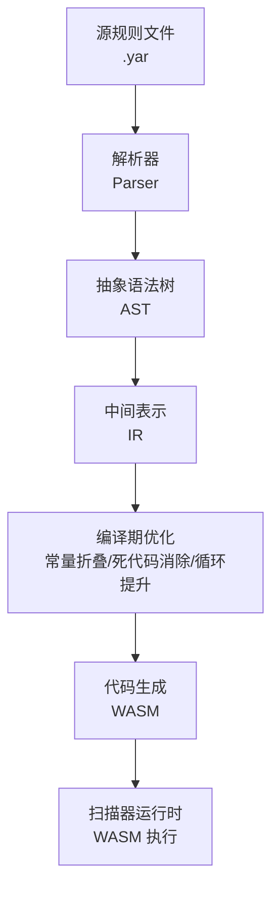
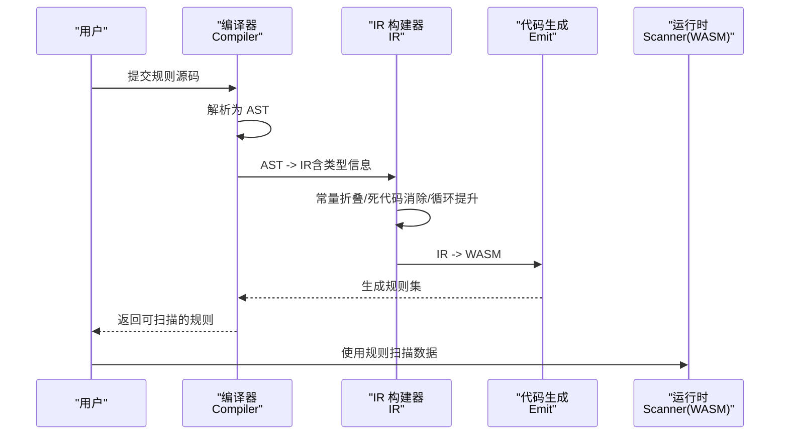
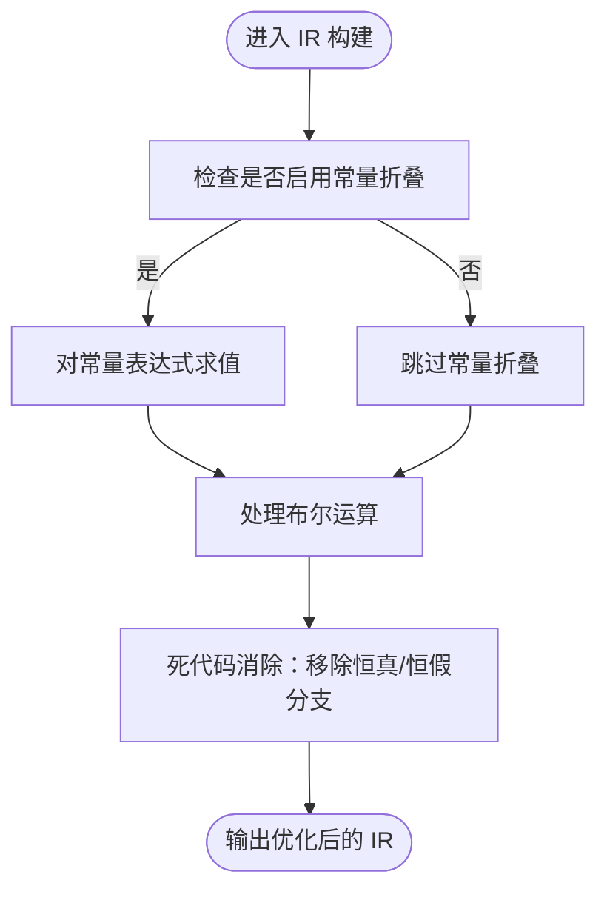
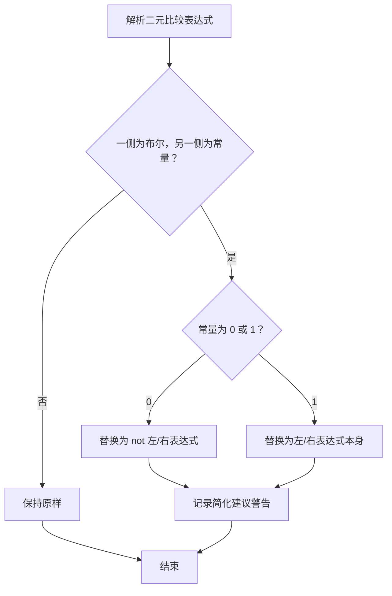
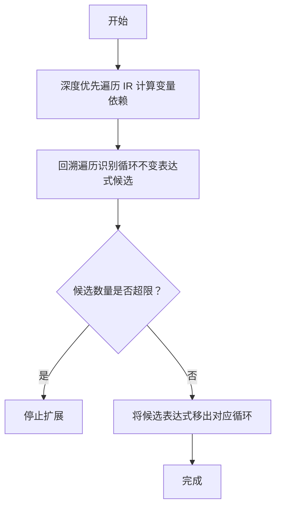
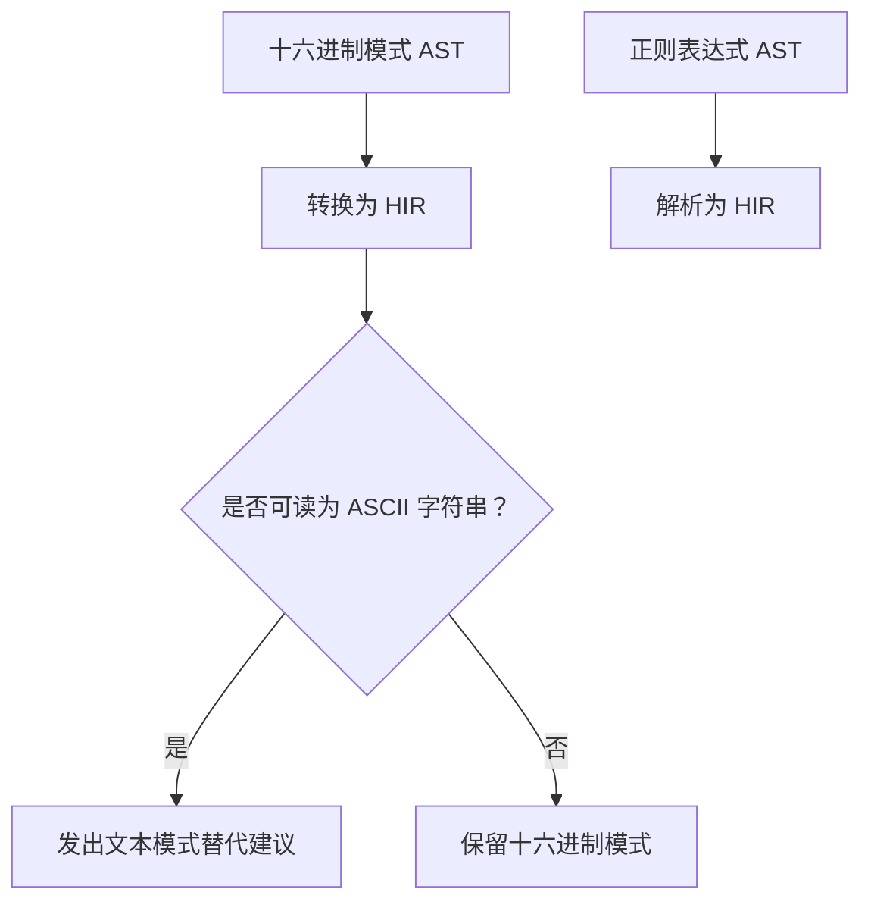
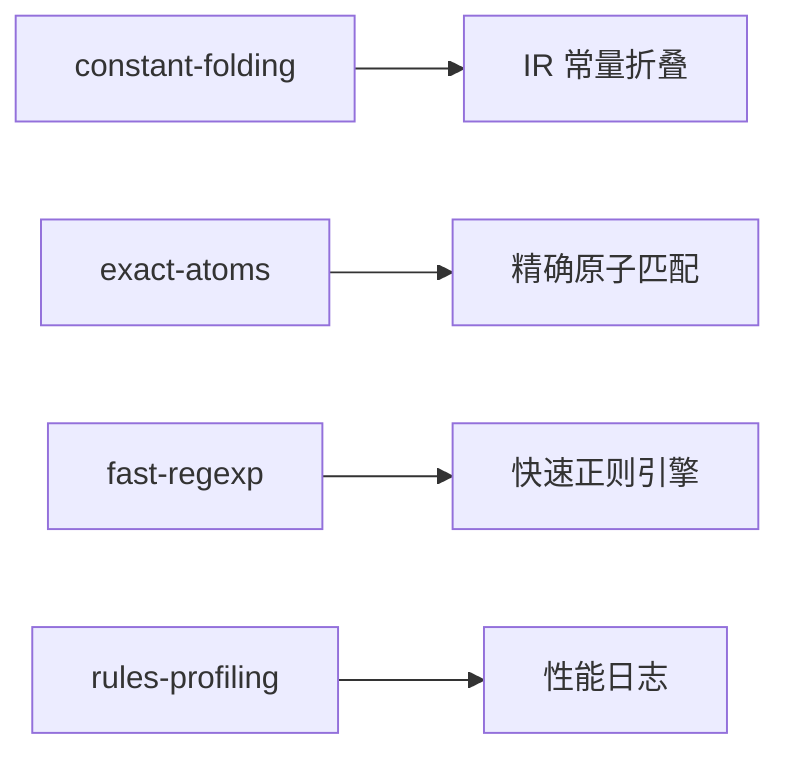

# 规则优化技术

<cite>
**本文引用的文件**
- [Cargo.toml](file://yara-x/Cargo.toml)
- [lib/Cargo.toml](file://yara-x/lib/Cargo.toml)
- [README.md](file://yara-x/README.md)
- [lib/src/compiler/mod.rs](file://yara-x/lib/src/compiler/mod.rs)
- [lib/src/compiler/ir/mod.rs](file://yara-x/lib/src/compiler/ir/mod.rs)
- [lib/src/compiler/ir/ast2ir.rs](file://yara-x/lib/src/compiler/ir/ast2ir.rs)
- [lib/src/compiler/ir/hex2hir.rs](file://yara-x/lib/src/compiler/ir/hex2hir.rs)
- [lib/src/compiler/emit.rs](file://yara-x/lib/src/compiler/emit.rs)
- [parser/src/parser/tests/testdata/expr-1.in](file://yara-x/parser/src/parser/tests/testdata/expr-1.in)
- [parser/src/parser/tests/testdata/basic-1.in](file://yara-x/parser/src/parser/tests/testdata/basic-1.in)
- [parser/src/parser/tests/testdata/expr-6.in](file://yara-x/parser/src/parser/tests/testdata/expr-6.in)
- [lib/src/compiler/tests/testdata/warnings/19.in](file://yara-x/lib/src/compiler/tests/testdata/warnings/19.in)
- [lib/src/compiler/tests/testdata/warnings/26.in](file://yara-x/lib/src/compiler/tests/testdata/warnings/26.in)
- [lib/src/compiler/tests/testdata/errors/115.out](file://yara-x/lib/src/compiler/tests/testdata/errors/115.out)
- [lib/src/compiler/tests/testdata/errors/95.out](file://yara-x/lib/src/compiler/tests/testdata/errors/95.out)
</cite>

## 目录
1. [简介](#简介)
2. [项目结构](#项目结构)
3. [核心组件](#核心组件)
4. [架构总览](#架构总览)
5. [详细组件分析](#详细组件分析)
6. [依赖关系分析](#依赖关系分析)
7. [性能考量](#性能考量)
8. [故障排查指南](#故障排查指南)
9. [结论](#结论)
10. [附录](#附录)

## 简介
本指南聚焦于规则优化技术，系统阐述 YARA-X 在规则编译过程中采用的优化策略与最佳实践，覆盖以下主题：
- 编译期优化：常量折叠、死代码消除、条件表达式简化、模式重写
- 模式设计优化：正则表达式、十六进制模式、字符串模式的优化要点
- 规则结构优化：减少不必要模块调用、优化元数据访问与条件判断
- 性能分析与工具：如何利用内置特性进行规则性能分析与优化

本指南面向希望编写高性能、可维护 YARA-X 规则的工程师与安全研究人员。

## 项目结构
YARA-X 的编译管线由解析（Parser）到中间表示（IR），再到代码生成（WASM）组成。关键模块如下：
- 解析层：将源码转换为抽象语法树（AST）
- 中间表示层：将 AST 转换为带类型信息的 IR，并在构建 IR 的同时执行优化（如常量折叠）
- 代码生成层：将 IR 转换为 WASM，供扫描器运行时执行

图示来源
- [lib/src/compiler/mod.rs:176-198](file://yara-x/lib/src/compiler/mod.rs#L176-L198)
- [lib/src/compiler/ir/mod.rs:1-30](file://yara-x/lib/src/compiler/ir/mod.rs#L1-L30)

章节来源
- [lib/src/compiler/mod.rs:176-198](file://yara-x/lib/src/compiler/mod.rs#L176-L198)
- [lib/src/compiler/ir/mod.rs:1-30](file://yara-x/lib/src/compiler/ir/mod.rs#L1-L30)

## 核心组件
- 编译器（Compiler）：负责从源码构建规则集，包含符号表、池化结构、IR、WASM 构建器等
- 中间表示（IR）：树形结构表达式，支持常量折叠、死代码消除、循环提升等优化
- 代码生成（Emit）：将 IR 输出为 WASM，保证运行时高效匹配
- 特性开关：通过 Cargo features 控制是否启用常量折叠、精确原子、快速正则等优化

章节来源
- [lib/src/compiler/mod.rs:240-420](file://yara-x/lib/src/compiler/mod.rs#L240-L420)
- [lib/src/compiler/ir/mod.rs:367-404](file://yara-x/lib/src/compiler/ir/mod.rs#L367-L404)
- [lib/Cargo.toml:30-86](file://yara-x/lib/Cargo.toml#L30-L86)

## 架构总览
编译流程的关键阶段与优化点：

图示来源
- [lib/src/compiler/mod.rs:544-634](file://yara-x/lib/src/compiler/mod.rs#L544-L634)
- [lib/src/compiler/ir/mod.rs:367-404](file://yara-x/lib/src/compiler/ir/mod.rs#L367-L404)
- [lib/src/compiler/emit.rs:1450-1480](file://yara-x/lib/src/compiler/emit.rs#L1450-L1480)

章节来源
- [lib/src/compiler/mod.rs:544-634](file://yara-x/lib/src/compiler/mod.rs#L544-L634)
- [lib/src/compiler/ir/mod.rs:618-840](file://yara-x/lib/src/compiler/ir/mod.rs#L618-L840)
- [lib/src/compiler/emit.rs:1450-1480](file://yara-x/lib/src/compiler/emit.rs#L1450-L1480)

## 详细组件分析

### 常量折叠与死代码消除
- 常量折叠：在构建 IR 时启用，对布尔与算术表达式进行求值，避免运行时计算
- 死代码消除：在布尔运算中移除恒真/恒假分支，缩短执行路径
- 典型场景：布尔或运算中的冗余项、算术常量表达式

图示来源
- [lib/src/compiler/ir/mod.rs:1040-1065](file://yara-x/lib/src/compiler/ir/mod.rs#L1040-L1065)
- [lib/src/compiler/ir/ast2ir.rs:523-588](file://yara-x/lib/src/compiler/ir/ast2ir.rs#L523-L588)

章节来源
- [lib/src/compiler/ir/mod.rs:1040-1065](file://yara-x/lib/src/compiler/ir/mod.rs#L1040-L1065)
- [lib/src/compiler/ir/ast2ir.rs:523-588](file://yara-x/lib/src/compiler/ir/ast2ir.rs#L523-L588)
- [parser/src/parser/tests/testdata/expr-1.in:1-34](file://yara-x/parser/src/parser/tests/testdata/expr-1.in#L1-L34)
- [parser/src/parser/tests/testdata/basic-1.in:1-29](file://yara-x/parser/src/parser/tests/testdata/basic-1.in#L1-L29)
- [parser/src/parser/tests/testdata/expr-6.in:1-29](file://yara-x/parser/src/parser/tests/testdata/expr-6.in#L1-L29)
- [lib/src/compiler/tests/testdata/warnings/19.in:1-4](file://yara-x/lib/src/compiler/tests/testdata/warnings/19.in#L1-L4)
- [lib/src/compiler/tests/testdata/warnings/26.in:1-5](file://yara-x/lib/src/compiler/tests/testdata/warnings/26.in#L1-L5)

### 条件表达式简化
- 类型推断与比较简化：当比较操作的一侧为布尔、另一侧为 0/1 时，自动替换为逻辑非或直接取值
- 适用场景：常见于将整数比较转换为布尔语义，提升可读性与可维护性

图示来源
- [lib/src/compiler/ir/ast2ir.rs:539-574](file://yara-x/lib/src/compiler/ir/ast2ir.rs#L539-L574)

章节来源
- [lib/src/compiler/ir/ast2ir.rs:539-574](file://yara-x/lib/src/compiler/ir/ast2ir.rs#L539-L574)

### 循环提升（Hoisting）
- 目标：将循环不变表达式移出内层循环，减少重复计算
- 策略：基于变量依赖分析，识别可在外层循环求值的子表达式
- 限制：候选数量上限控制，避免过度嵌套导致 IR 过深

图示来源
- [lib/src/compiler/ir/mod.rs:618-840](file://yara-x/lib/src/compiler/ir/mod.rs#L618-L840)

章节来源
- [lib/src/compiler/ir/mod.rs:618-840](file://yara-x/lib/src/compiler/ir/mod.rs#L618-L840)

### 模式重写与优化
- 十六进制模式到正则 HIR 的转换：将 {AA BB CC} 等转换为 HIR，便于统一处理
- 字面量优化：若十六进制字节序列可读为 ASCII 文本，提示改写为字符串模式以提升可读性
- 正则模式：解析正则表达式为 HIR，统一与十六进制模式的匹配路径

图示来源
- [lib/src/compiler/ir/hex2hir.rs:11-31](file://yara-x/lib/src/compiler/ir/hex2hir.rs#L11-L31)
- [lib/src/compiler/ir/ast2ir.rs:283-301](file://yara-x/lib/src/compiler/ir/ast2ir.rs#L283-L301)
- [lib/src/compiler/tests/testdata/errors/115.out:1-5](file://yara-x/lib/src/compiler/tests/testdata/errors/115.out#L1-L5)

章节来源
- [lib/src/compiler/ir/hex2hir.rs:11-31](file://yara-x/lib/src/compiler/ir/hex2hir.rs#L11-L31)
- [lib/src/compiler/ir/ast2ir.rs:283-301](file://yara-x/lib/src/compiler/ir/ast2ir.rs#L283-L301)
- [lib/src/compiler/tests/testdata/errors/115.out:1-5](file://yara-x/lib/src/compiler/tests/testdata/errors/115.out#L1-L5)

### 规则结构优化
- 减少不必要模块调用：仅在必要时引入模块，避免无用字段访问
- 优化元数据访问：通过 filesize 边界约束减少无效匹配范围
- 条件判断优化：合并布尔表达式、消除冗余比较，使用常量折叠与死代码消除

章节来源
- [lib/src/compiler/mod.rs:330-339](file://yara-x/lib/src/compiler/mod.rs#L330-L339)
- [lib/src/compiler/ir/mod.rs:579-616](file://yara-x/lib/src/compiler/ir/mod.rs#L579-L616)

## 依赖关系分析
- 特性开关与优化能力
  - constant-folding：启用编译期常量折叠
  - exact-atoms：启用精确原子匹配，减少回溯验证
  - fast-regexp：启用快速正则引擎
  - rules-profiling：启用规则级性能分析日志
- 编译器默认启用多项优化特性，确保规则在编译后具备良好性能

图示来源
- [lib/Cargo.toml:30-86](file://yara-x/lib/Cargo.toml#L30-L86)
- [lib/src/compiler/mod.rs:500-502](file://yara-x/lib/src/compiler/mod.rs#L500-L502)

章节来源
- [lib/Cargo.toml:30-86](file://yara-x/lib/Cargo.toml#L30-L86)
- [lib/src/compiler/mod.rs:500-502](file://yara-x/lib/src/compiler/mod.rs#L500-L502)

## 性能考量
- 启用编译期优化：通过特性开关启用常量折叠、精确原子与快速正则
- 规则级性能分析：在启用 rules-profiling 后，扫描完成后输出最耗时规则，辅助定位热点
- 避免慢模式与慢循环：编译器对短原子（小于 2 字节）与大上界循环给出警告或错误
- 代码生成：WASM 模块按命名空间与规则分组，减少函数切换开销

章节来源
- [lib/Cargo.toml:83-86](file://yara-x/lib/Cargo.toml#L83-L86)
- [lib/src/compiler/mod.rs:246-262](file://yara-x/lib/src/compiler/mod.rs#L246-L262)
- [lib/src/compiler/mod.rs:748-800](file://yara-x/lib/src/compiler/mod.rs#L748-L800)

## 故障排查指南
- 未使用模式：当规则声明了模式但未在条件中使用，会触发“未使用模式”错误
- 十六进制模式修饰符非法：十六进制模式仅允许 private 修饰符，其他修饰符会报错
- 布尔与整数比较：常见于 pe.is_signed == 0 的写法，编译器会给出简化建议
- 常量折叠相关告警：当表达式可被常量化简时，编译器会提示

章节来源
- [lib/src/compiler/tests/testdata/errors/95.out:1-5](file://yara-x/lib/src/compiler/tests/testdata/errors/95.out#L1-L5)
- [lib/src/compiler/tests/testdata/errors/115.out:1-5](file://yara-x/lib/src/compiler/tests/testdata/errors/115.out#L1-L5)
- [lib/src/compiler/ir/ast2ir.rs:539-574](file://yara-x/lib/src/compiler/ir/ast2ir.rs#L539-L574)
- [lib/src/compiler/tests/testdata/warnings/19.in:1-4](file://yara-x/lib/src/compiler/tests/testdata/warnings/19.in#L1-L4)
- [lib/src/compiler/tests/testdata/warnings/26.in:1-5](file://yara-x/lib/src/compiler/tests/testdata/warnings/26.in#L1-L5)

## 结论
YARA-X 在编译期通过 IR 层实现多种优化，包括常量折叠、死代码消除、条件表达式简化与循环提升；在模式层面提供十六进制与正则的统一 HIR 表达，并对可读性进行提示。结合特性开关与规则级性能分析，用户可以编写更高效、可维护的规则。建议在实际规则编写中遵循本文最佳实践，充分利用编译器提供的优化能力与告警机制。

## 附录
- 快速参考
  - 启用常量折叠：确保启用 constant-folding 特性
  - 使用精确原子：启用 exact-atoms 特性以提升匹配效率
  - 使用快速正则：启用 fast-regexp 特性
  - 规则性能分析：启用 rules-profiling 并观察扫描后日志
  - 模式选择：十六进制模式尽量保持可读性，必要时改写为字符串模式

章节来源
- [lib/Cargo.toml:30-86](file://yara-x/lib/Cargo.toml#L30-L86)
- [lib/src/compiler/mod.rs:500-502](file://yara-x/lib/src/compiler/mod.rs#L500-L502)
- [lib/src/compiler/ir/ast2ir.rs:283-301](file://yara-x/lib/src/compiler/ir/ast2ir.rs#L283-L301)