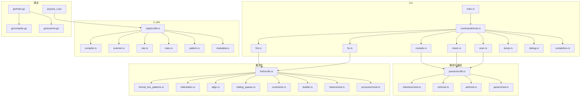
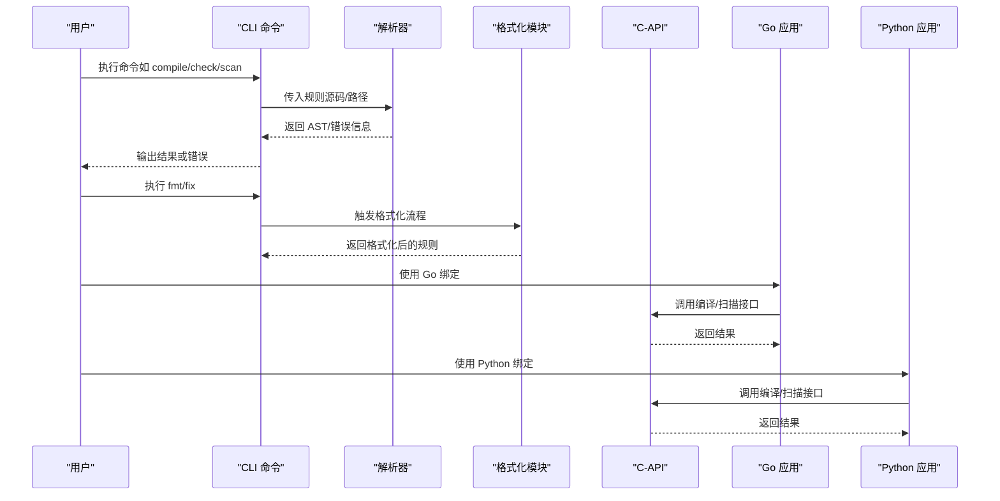
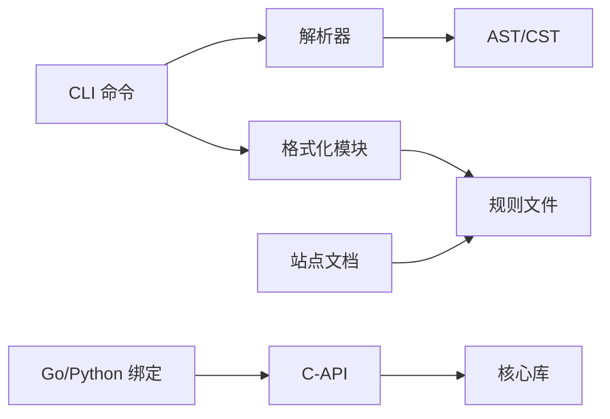

# 常见问题

<cite>
**本文引用的文件**
- [README.md](file://README.md)
- [cli/src/commands/compile.rs](file://cli/src/commands/compile.rs)
- [cli/src/commands/check.rs](file://cli/src/commands/check.rs)
- [cli/src/commands/scan.rs](file://cli/src/commands/scan.rs)
- [cli/src/commands/fmt.rs](file://cli/src/commands/fmt.rs)
- [cli/src/commands/fix.rs](file://cli/src/commands/fix.rs)
- [cli/src/commands/dump.rs](file://cli/src/commands/dump.rs)
- [cli/src/commands/debug.rs](file://cli/src/commands/debug.rs)
- [cli/src/commands/completion.rs](file://cli/src/commands/completion.rs)
- [cli/src/commands/mod.rs](file://cli/src/commands/mod.rs)
- [cli/src/main.rs](file://cli/src/main.rs)
- [cli/src/config.rs](file://cli/src/config.rs)
- [cli/src/help.rs](file://cli/src/help.rs)
- [fmt/src/lib.rs](file://fmt/src/lib.rs)
- [fmt/src/format_hex_patterns.rs](file://fmt/src/format_hex_patterns.rs)
- [fmt/src/indentation.rs](file://fmt/src/indentation.rs)
- [fmt/src/align.rs](file://fmt/src/align.rs)
- [fmt/src/trailing_spaces.rs](file://fmt/src/trailing_spaces.rs)
- [fmt/src/comments.rs](file://fmt/src/comments.rs)
- [fmt/src/bubble.rs](file://fmt/src/bubble.rs)
- [fmt/src/tokens/mod.rs](file://fmt/src/tokens/mod.rs)
- [fmt/src/processor/mod.rs](file://fmt/src/processor/mod.rs)
- [fmt/src/tests.rs](file://fmt/src/tests.rs)
- [parser/src/lib.rs](file://parser/src/lib.rs)
- [parser/src/parser/mod.rs](file://parser/src/parser/mod.rs)
- [parser/src/tokenizer/mod.rs](file://parser/src/tokenizer/mod.rs)
- [parser/src/cst/mod.rs](file://parser/src/cst/mod.rs)
- [parser/src/ast/mod.rs](file://parser/src/ast/mod.rs)
- [capi/src/lib.rs](file://capi/src/lib.rs)
- [capi/src/compiler.rs](file://capi/src/compiler.rs)
- [capi/src/scanner.rs](file://capi/src/scanner.rs)
- [capi/src/rule.rs](file://capi/src/rule.rs)
- [capi/src/rules.rs](file://capi/src/rules.rs)
- [capi/src/pattern.rs](file://capi/src/pattern.rs)
- [capi/src/metadata.rs](file://capi/src/metadata.rs)
- [lib/src/lib.rs](file://lib/src/lib.rs)
- [Cargo.toml](file://Cargo.toml)
- [go/main.go](file://go/main.go)
- [go/compiler.go](file://go/compiler.go)
- [go/scanner.go](file://go/scanner.go)
- [py/yara_x.pyi](file://py/yara_x.pyi)
- [site/content/docs/cli/_index.md](file://site/content/docs/cli/_index.md)
- [site/content/docs/cli/commands.md](file://site/content/docs/cli/commands.md)
- [site/content/docs/writing_rules/_index.md](file://site/content/docs/writing_rules/_index.md)
- [site/content/docs/writing_rules/syntax.md](file://site/content/docs/writing_rules/syntax.md)
- [site/content/docs/writing_rules/differences.md](file://site/content/docs/writing_rules/differences.md)
- [site/content/docs/writing_rules/conditions.md](file://site/content/docs/writing_rules/conditions.md)
- [site/content/docs/writing_rules/text_patterns.md](file://site/content/docs/writing_rules/text_patterns.md)
- [site/content/docs/writing_rules/hex_patterns.md](file://site/content/docs/writing_rules/hex_patterns.md)
- [site/content/docs/intro/getting_started.md](file://site/content/docs/intro/getting_started.md)
- [site/content/docs/intro/installation.md](file://site/content/docs/intro/installation.md)
- [site/content/docs/intro/yara_vs_yara-x.md](file://site/content/docs/intro/yara_vs_yara-x.md)
- [site/content/docs/modules/_index.md](file://site/content/docs/modules/_index.md)
- [site/content/docs/modules/pe.md](file://site/content/docs/modules/pe.md)
- [site/content/docs/modules/hash.md](file://site/content/docs/modules/hash.md)
- [site/content/docs/modules/string.md](file://site/content/docs/modules/string.md)
- [site/content/docs/modules/time.md](file://site/content/docs/modules/time.md)
- [site/content/docs/modules/console.md](file://site/content/docs/modules/console.md)
- [site/content/docs/modules/math.md](file://site/content/docs/modules/math.md)
- [site/content/docs/modules/elf.md](file://site/content/docs/modules/elf.md)
- [site/content/docs/modules/macho.md](file://site/content/docs/modules/macho.md)
- [site/content/docs/modules/dotnet.md](file://site/content/docs/modules/dotnet.md)
- [site/content/docs/modules/lnk.md](file://site/content/docs/modules/lnk.md)
- [site/content/docs/modules/crx.md](file://site/content/docs/modules/crx.md)
</cite>

## 目录
1. 引言
2. 项目结构
3. 核心组件
4. 架构总览
5. 详细组件分析
6. 依赖分析
7. 性能考虑
8. 故障排查指南
9. 结论
10. 附录

## 引言
本常见问题解答面向初学者与中级用户，聚焦于在使用 YARA-X 过程中最常见的问题：规则编译错误、扫描失败、格式化问题、语法检查错误等。我们将结合 CLI 命令、解析器与格式化模块的实际实现，给出问题描述、可能原因与可操作的解决步骤，并提供错误代码对照表、快速解决方案、问题自检清单与预防措施。

## 项目结构
YARA-X 采用多语言与多模块架构：CLI 提供命令行工具；解析器负责词法/语法分析；格式化模块提供规则格式化能力；C-API 暴露底层编译与扫描接口；Go/Python 绑定提供跨语言使用入口；站点文档提供规则编写与模块使用指南。

图表来源
- [cli/src/main.rs](file://cli/src/main.rs)
- [cli/src/commands/mod.rs](file://cli/src/commands/mod.rs)
- [cli/src/commands/compile.rs](file://cli/src/commands/compile.rs)
- [cli/src/commands/check.rs](file://cli/src/commands/check.rs)
- [cli/src/commands/scan.rs](file://cli/src/commands/scan.rs)
- [cli/src/commands/fmt.rs](file://cli/src/commands/fmt.rs)
- [cli/src/commands/fix.rs](file://cli/src/commands/fix.rs)
- [cli/src/commands/dump.rs](file://cli/src/commands/dump.rs)
- [cli/src/commands/debug.rs](file://cli/src/commands/debug.rs)
- [cli/src/commands/completion.rs](file://cli/src/commands/completion.rs)
- [parser/src/lib.rs](file://parser/src/lib.rs)
- [parser/src/tokenizer/mod.rs](file://parser/src/tokenizer/mod.rs)
- [parser/src/cst/mod.rs](file://parser/src/cst/mod.rs)
- [parser/src/ast/mod.rs](file://parser/src/ast/mod.rs)
- [parser/src/parser/mod.rs](file://parser/src/parser/mod.rs)
- [fmt/src/lib.rs](file://fmt/src/lib.rs)
- [fmt/src/format_hex_patterns.rs](file://fmt/src/format_hex_patterns.rs)
- [fmt/src/indentation.rs](file://fmt/src/indentation.rs)
- [fmt/src/align.rs](file://fmt/src/align.rs)
- [fmt/src/trailing_spaces.rs](file://fmt/src/trailing_spaces.rs)
- [fmt/src/comments.rs](file://fmt/src/comments.rs)
- [fmt/src/bubble.rs](file://fmt/src/bubble.rs)
- [fmt/src/tokens/mod.rs](file://fmt/src/tokens/mod.rs)
- [fmt/src/processor/mod.rs](file://fmt/src/processor/mod.rs)
- [capi/src/lib.rs](file://capi/src/lib.rs)
- [capi/src/compiler.rs](file://capi/src/compiler.rs)
- [capi/src/scanner.rs](file://capi/src/scanner.rs)
- [capi/src/rule.rs](file://capi/src/rule.rs)
- [capi/src/rules.rs](file://capi/src/rules.rs)
- [capi/src/pattern.rs](file://capi/src/pattern.rs)
- [capi/src/metadata.rs](file://capi/src/metadata.rs)
- [go/main.go](file://go/main.go)
- [go/compiler.go](file://go/compiler.go)
- [go/scanner.go](file://go/scanner.go)
- [py/yara_x.pyi](file://py/yara_x.pyi)

章节来源
- [Cargo.toml](file://Cargo.toml)
- [README.md](file://README.md)

## 核心组件
- CLI 命令：提供编译、检查、扫描、格式化、修复、转储、调试、补全等功能，是用户最直接的交互入口。
- 解析器：负责词法分析、CST/AST 转换与错误报告，是规则编译与检查的基础。
- 格式化模块：提供规则格式化、缩进、对齐、注释处理、尾随空格清理等能力。
- C-API：暴露编译器、扫描器、规则与模式对象，支持 C/Go/Python 等语言绑定。
- 绑定层：Go/Python 提供易用的 API，便于集成到现有工作流。

章节来源
- [cli/src/commands/mod.rs](file://cli/src/commands/mod.rs)
- [parser/src/lib.rs](file://parser/src/lib.rs)
- [fmt/src/lib.rs](file://fmt/src/lib.rs)
- [capi/src/lib.rs](file://capi/src/lib.rs)
- [go/main.go](file://go/main.go)
- [py/yara_x.pyi](file://py/yara_x.pyi)

## 架构总览
下图展示从 CLI 到解析器、再到格式化与 C-API 的调用关系，以及 Go/Python 绑定如何间接使用 C-API。

图表来源
- [cli/src/main.rs](file://cli/src/main.rs)
- [cli/src/commands/compile.rs](file://cli/src/commands/compile.rs)
- [cli/src/commands/check.rs](file://cli/src/commands/check.rs)
- [cli/src/commands/scan.rs](file://cli/src/commands/scan.rs)
- [cli/src/commands/fmt.rs](file://cli/src/commands/fmt.rs)
- [cli/src/commands/fix.rs](file://cli/src/commands/fix.rs)
- [parser/src/lib.rs](file://parser/src/lib.rs)
- [fmt/src/lib.rs](file://fmt/src/lib.rs)
- [capi/src/lib.rs](file://capi/src/lib.rs)
- [go/main.go](file://go/main.go)
- [py/yara_x.pyi](file://py/yara_x.pyi)

## 详细组件分析

### 编译错误（compile）
- 可能原因
  - 规则语法不合法（缺少分隔符、括号不匹配、关键字拼写错误）。
  - 模块未启用或模块函数不可用。
  - 字符串/模式定义错误（十六进制、文本模式格式不正确）。
  - 条件表达式中引用了未定义变量或模块。
- 快速定位
  - 使用检查命令先进行静态校验，定位语法与语义问题。
  - 查看解析器生成的 CST/AST 错误信息，确认具体位置。
- 解决步骤
  - 逐段注释可疑规则，缩小范围。
  - 对照规则语法文档，修正关键字与结构。
  - 启用所需模块，确保模块可用且版本兼容。
  - 验证字符串与模式格式，必要时使用格式化工具统一风格。
- 预防措施
  - 在提交前使用检查与格式化命令。
  - 将复杂条件拆分为命名变量，提升可读性与可维护性。

章节来源
- [cli/src/commands/compile.rs](file://cli/src/commands/compile.rs)
- [cli/src/commands/check.rs](file://cli/src/commands/check.rs)
- [parser/src/lib.rs](file://parser/src/lib.rs)
- [parser/src/parser/mod.rs](file://parser/src/parser/mod.rs)
- [parser/src/tokenizer/mod.rs](file://parser/src/tokenizer/mod.rs)
- [parser/src/cst/mod.rs](file://parser/src/cst/mod.rs)
- [parser/src/ast/mod.rs](file://parser/src/ast/mod.rs)

### 扫描失败（scan）
- 可能原因
  - 文件路径不存在或权限不足。
  - 规则集过大导致内存压力或超时。
  - 模式过于宽泛导致性能退化。
  - 模块依赖缺失或版本不匹配。
- 快速定位
  - 使用调试命令输出扫描过程与命中详情。
  - 分批扫描，验证规则集规模与单条规则性能。
- 解决步骤
  - 检查输入路径与权限，确保文件可访问。
  - 优化规则：减少宽泛模式、避免昂贵正则，合理使用模块。
  - 分离规则集，按模块/业务域拆分，降低单次扫描负载。
  - 更新模块与依赖，确保版本一致。
- 预防措施
  - 定期评估规则性能，使用调试输出进行基准测试。
  - 在 CI 中加入扫描耗时阈值告警。

章节来源
- [cli/src/commands/scan.rs](file://cli/src/commands/scan.rs)
- [cli/src/commands/debug.rs](file://cli/src/commands/debug.rs)
- [capi/src/scanner.rs](file://capi/src/scanner.rs)

### 格式化问题（fmt/fix）
- 可能原因
  - 缩进不一致、对齐混乱、注释位置不当。
  - 十六进制模式格式不规范。
  - 尾随空格或行末字符异常。
- 快速定位
  - 使用格式化命令一次性修复常见问题。
  - 对比格式化前后差异，确认是否覆盖所有规则。
- 解决步骤
  - 先执行格式化，再执行修复命令以进一步规范化。
  - 针对十六进制模式，使用专用处理器统一格式。
  - 清理尾随空格与多余空行，保持一致性。
- 预防措施
  - 在编辑器中启用自动格式化与保存时清理尾随空格。
  - 团队约定统一的格式化策略并在 CI 中强制执行。

章节来源
- [cli/src/commands/fmt.rs](file://cli/src/commands/fmt.rs)
- [cli/src/commands/fix.rs](file://cli/src/commands/fix.rs)
- [fmt/src/lib.rs](file://fmt/src/lib.rs)
- [fmt/src/format_hex_patterns.rs](file://fmt/src/format_hex_patterns.rs)
- [fmt/src/indentation.rs](file://fmt/src/indentation.rs)
- [fmt/src/align.rs](file://fmt/src/align.rs)
- [fmt/src/trailing_spaces.rs](file://fmt/src/trailing_spaces.rs)
- [fmt/src/comments.rs](file://fmt/src/comments.rs)
- [fmt/src/bubble.rs](file://fmt/src/bubble.rs)
- [fmt/src/tokens/mod.rs](file://fmt/src/tokens/mod.rs)
- [fmt/src/processor/mod.rs](file://fmt/src/processor/mod.rs)

### 语法检查错误（check）
- 可能原因
  - 未闭合的引号/括号、非法字符。
  - 关键字大小写、保留字误用。
  - 模块函数签名不匹配或参数类型错误。
- 快速定位
  - 使用检查命令输出详细错误列表与位置信息。
  - 逐条修正并重新检查，直到无错误。
- 解决步骤
  - 依据错误提示修正语法与关键字。
  - 对照模块文档核对函数签名与参数。
  - 使用格式化统一风格，减少视觉歧义。
- 预防措施
  - 在编辑器中开启实时语法高亮与错误提示。
  - 将检查命令纳入本地与 CI 流水线。

章节来源
- [cli/src/commands/check.rs](file://cli/src/commands/check.rs)
- [parser/src/lib.rs](file://parser/src/lib.rs)

### 调试与诊断（debug）
- 可能原因
  - 规则逻辑复杂，难以直观判断命中路径。
  - 模式匹配顺序与优先级不明确。
- 快速定位
  - 使用调试命令输出匹配细节、变量值与模块状态。
  - 逐步简化规则，定位问题片段。
- 解决步骤
  - 记录调试输出，对比预期与实际行为。
  - 将复杂条件分解为中间变量，增强可读性。
- 预防措施
  - 在开发阶段频繁使用调试输出，建立规则质量基线。

章节来源
- [cli/src/commands/debug.rs](file://cli/src/commands/debug.rs)

### 补全与配置（completion/config）
- 可能原因
  - Shell/IDE 插件未正确安装或未启用。
  - 配置文件路径或格式不正确。
- 快速定位
  - 生成补全脚本并手动安装到对应 shell。
  - 检查配置文件是否存在、路径是否正确。
- 解决步骤
  - 按官方文档生成并安装补全脚本。
  - 使用默认配置作为起点，逐步调整。
- 预防措施
  - 将补全与配置纳入团队开发环境标准化。

章节来源
- [cli/src/commands/completion.rs](file://cli/src/commands/completion.rs)
- [cli/src/config.rs](file://cli/src/config.rs)

## 依赖分析
- CLI 与解析器：CLI 命令通过解析器完成规则校验与编译，错误信息由解析器返回。
- CLI 与格式化：CLI 命令调用格式化模块统一规则风格。
- C-API 与绑定：Go/Python 通过 C-API 调用底层编译与扫描能力。
- 文档与规则：站点文档提供规则语法、模块与最佳实践，指导用户编写高质量规则。

图表来源
- [cli/src/commands/mod.rs](file://cli/src/commands/mod.rs)
- [parser/src/lib.rs](file://parser/src/lib.rs)
- [fmt/src/lib.rs](file://fmt/src/lib.rs)
- [capi/src/lib.rs](file://capi/src/lib.rs)
- [go/main.go](file://go/main.go)
- [py/yara_x.pyi](file://py/yara_x.pyi)
- [site/content/docs/writing_rules/_index.md](file://site/content/docs/writing_rules/_index.md)

章节来源
- [Cargo.toml](file://Cargo.toml)

## 性能考虑
- 规则优化
  - 避免过宽的模式与昂贵的正则表达式。
  - 合理使用模块函数，减少不必要的计算。
  - 将复杂条件拆分为命名变量，提升可读性与可维护性。
- 扫描策略
  - 分批扫描与并行处理，控制内存与 CPU 使用。
  - 使用调试输出监控扫描耗时，识别瓶颈。
- 格式化与检查
  - 在 CI 中强制执行格式化与检查，减少后期返工。

## 故障排查指南

### 规则编译错误
- 症状
  - 编译报错，提示语法或语义错误。
- 可能原因
  - 关键字拼写错误、缺少分隔符、括号不匹配。
  - 模块函数不可用或签名不匹配。
- 快速解决
  - 使用检查命令获取详细错误位置。
  - 逐段注释规则，缩小问题范围。
  - 对照模块文档修正函数签名与参数。
- 预防措施
  - 在编辑器中启用语法高亮与错误提示。
  - 将检查命令纳入本地与 CI 流水线。

章节来源
- [cli/src/commands/check.rs](file://cli/src/commands/check.rs)
- [cli/src/commands/compile.rs](file://cli/src/commands/compile.rs)
- [parser/src/lib.rs](file://parser/src/lib.rs)

### 扫描失败
- 症状
  - 扫描无输出或报错，文件无法访问。
- 可能原因
  - 路径不存在、权限不足、规则集过大。
- 快速解决
  - 检查路径与权限，确保文件可读。
  - 分批扫描，验证规则集规模与单条规则性能。
  - 优化规则，减少宽泛模式与昂贵正则。
- 预防措施
  - 定期评估规则性能，使用调试输出进行基准测试。

章节来源
- [cli/src/commands/scan.rs](file://cli/src/commands/scan.rs)
- [cli/src/commands/debug.rs](file://cli/src/commands/debug.rs)

### 格式化问题
- 症状
  - 规则风格不一致、十六进制模式格式混乱。
- 可能原因
  - 缩进、对齐、注释位置不当；尾随空格。
- 快速解决
  - 使用格式化命令统一风格。
  - 使用修复命令清理尾随空格与多余空行。
- 预防措施
  - 在编辑器中启用自动格式化与保存时清理尾随空格。

章节来源
- [cli/src/commands/fmt.rs](file://cli/src/commands/fmt.rs)
- [cli/src/commands/fix.rs](file://cli/src/commands/fix.rs)
- [fmt/src/lib.rs](file://fmt/src/lib.rs)

### 语法检查错误
- 症状
  - 检查命令报错，提示语法或关键字错误。
- 可能原因
  - 未闭合引号/括号、非法字符、关键字误用。
- 快速解决
  - 依据错误提示修正语法与关键字。
  - 对照模块文档核对函数签名与参数。
- 预防措施
  - 在编辑器中开启实时语法高亮与错误提示。

章节来源
- [cli/src/commands/check.rs](file://cli/src/commands/check.rs)
- [parser/src/lib.rs](file://parser/src/lib.rs)

### 调试与诊断
- 症状
  - 规则逻辑复杂，难以直观判断命中路径。
- 快速解决
  - 使用调试命令输出匹配细节与变量值。
  - 将复杂条件分解为中间变量。
- 预防措施
  - 在开发阶段频繁使用调试输出，建立规则质量基线。

章节来源
- [cli/src/commands/debug.rs](file://cli/src/commands/debug.rs)

### 补全与配置
- 症状
  - 命令行补全无效，配置文件不生效。
- 快速解决
  - 按官方文档生成并安装补全脚本。
  - 检查配置文件路径与格式。
- 预防措施
  - 将补全与配置纳入团队开发环境标准化。

章节来源
- [cli/src/commands/completion.rs](file://cli/src/commands/completion.rs)
- [cli/src/config.rs](file://cli/src/config.rs)

## 结论
通过 CLI 命令、解析器与格式化模块的协同，YARA-X 能够有效支撑规则编写、校验与扫描全流程。建议将“检查+格式化”纳入日常开发与 CI 流水线，配合调试输出与模块文档，可显著降低编译与扫描问题的发生率，并提升规则质量与团队协作效率。

## 附录

### 错误代码对照表（示例）
- 编译错误
  - 语法错误：规则语法不符合规范，需修正关键字与结构。
  - 模块错误：模块函数不可用或签名不匹配，需启用模块并核对参数。
- 扫描错误
  - 文件访问错误：路径不存在或权限不足，需检查路径与权限。
  - 规则性能错误：规则集过大或模式过宽，需优化规则。
- 格式化错误
  - 风格不一致：缩进、对齐、注释位置不当，需执行格式化与修复。
  - 十六进制模式错误：格式不规范，需使用专用处理器统一格式。

### 快速解决方案清单
- 编译失败：先用检查命令定位错误，再逐段注释排查，最后对照模块文档修正。
- 扫描失败：检查路径与权限，分批扫描，优化规则，更新模块。
- 格式化失败：执行格式化与修复命令，清理尾随空格，统一风格。
- 语法检查失败：依据错误提示修正语法与关键字，核对模块函数签名。
- 调试困难：使用调试命令输出匹配细节，将复杂条件分解为中间变量。
- 补全与配置：按官方文档生成并安装补全脚本，检查配置文件路径与格式。

### 问题自检清单
- 规则编写
  - 是否遵循规则语法与模块文档？
  - 是否启用了所需的模块？
  - 是否使用了合适的模式类型（文本/十六进制/正则）？
- 规则检查
  - 是否已运行检查命令并修正所有错误？
  - 是否已执行格式化与修复命令？
- 规则扫描
  - 输入路径是否正确且可访问？
  - 规则集规模是否过大？
  - 是否存在昂贵的正则或宽泛模式？
- 调试与诊断
  - 是否使用调试命令输出匹配细节？
  - 是否将复杂条件分解为中间变量？
- 补全与配置
  - 是否已安装并启用命令行补全？
  - 配置文件路径与格式是否正确？

### 相关文档与资源
- 规则语法与模块
  - [规则总览](file://site/content/docs/writing_rules/_index.md)
  - [规则语法](file://site/content/docs/writing_rules/syntax.md)
  - [规则差异](file://site/content/docs/writing_rules/differences.md)
  - [条件表达式](file://site/content/docs/writing_rules/conditions.md)
  - [文本模式](file://site/content/docs/writing_rules/text_patterns.md)
  - [十六进制模式](file://site/content/docs/writing_rules/hex_patterns.md)
- CLI 与安装
  - [CLI 总览](file://site/content/docs/cli/_index.md)
  - [CLI 命令](file://site/content/docs/cli/commands.md)
  - [安装与入门](file://site/content/docs/intro/installation.md)
  - [快速开始](file://site/content/docs/intro/getting_started.md)
  - [YARA 与 YARA-X 对比](file://site/content/docs/intro/yara_vs_yara-x.md)
- 模块参考
  - [模块总览](file://site/content/docs/modules/_index.md)
  - [PE 模块](file://site/content/docs/modules/pe.md)
  - [哈希模块](file://site/content/docs/modules/hash.md)
  - [字符串模块](file://site/content/docs/modules/string.md)
  - [时间模块](file://site/content/docs/modules/time.md)
  - [控制台模块](file://site/content/docs/modules/console.md)
  - [数学模块](file://site/content/docs/modules/math.md)
  - [ELF 模块](file://site/content/docs/modules/elf.md)
  - [Mach-O 模块](file://site/content/docs/modules/macho.md)
  - [.NET 模块](file://site/content/docs/modules/dotnet.md)
  - [LNK 模块](file://site/content/docs/modules/lnk.md)
  - [CRX 模块](file://site/content/docs/modules/crx.md)