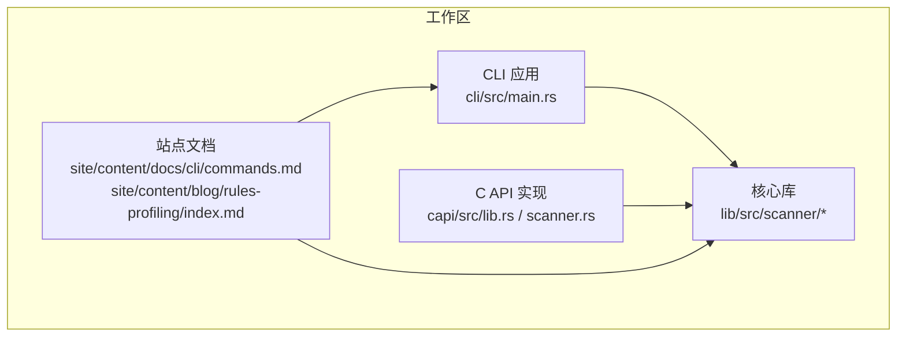
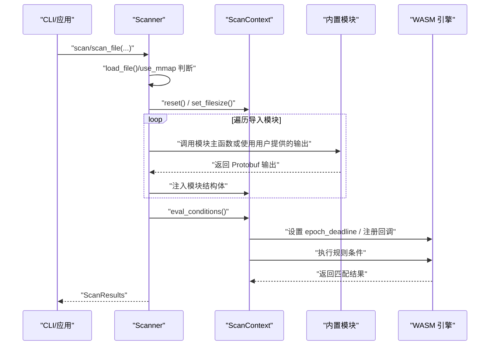
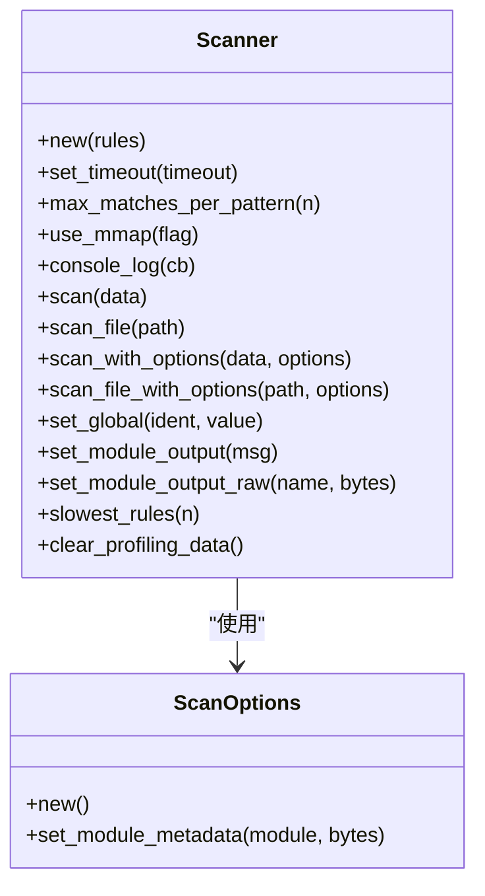
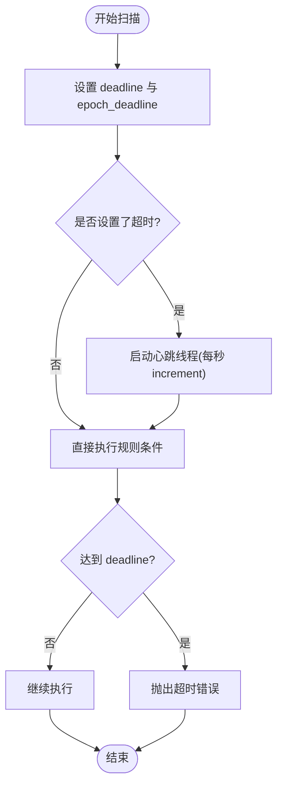
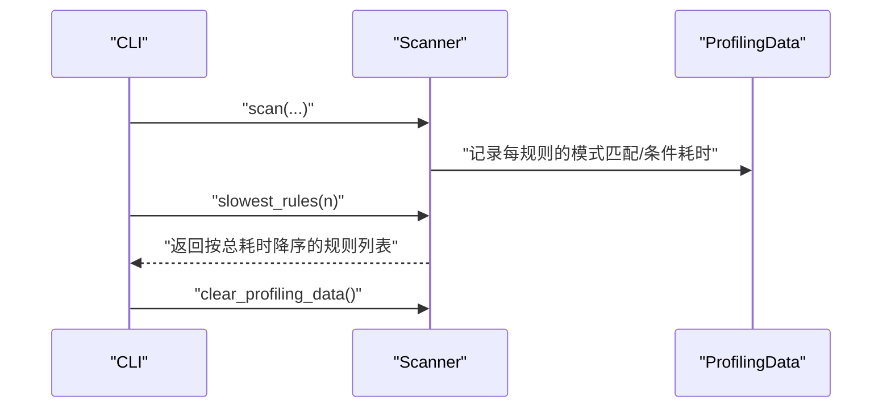
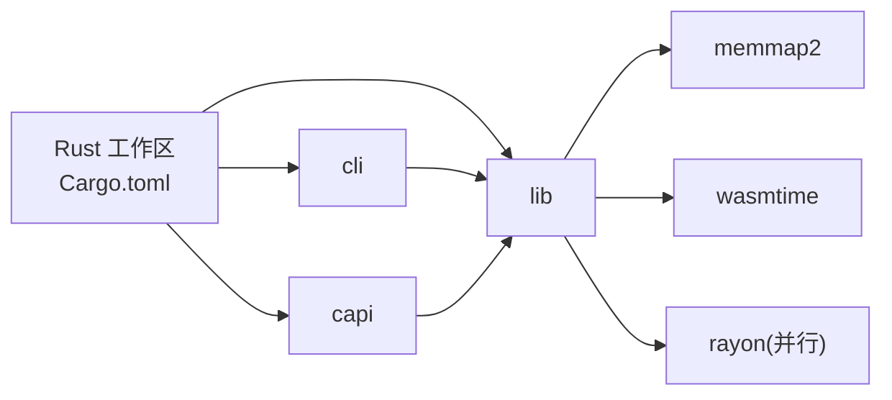

# 性能问题排查

<cite>
**本文引用的文件**
- [Cargo.toml](file://Cargo.toml)
- [lib/src/scanner/mod.rs](file://lib/src/scanner/mod.rs)
- [lib/src/scanner/context.rs](file://lib/src/scanner/context.rs)
- [lib/src/modules/cuckoo/mod.rs](file://lib/src/modules/cuckoo/mod.rs)
- [capi/src/lib.rs](file://capi/src/lib.rs)
- [capi/src/scanner.rs](file://capi/src/scanner.rs)
- [cli/src/main.rs](file://cli/src/main.rs)
- [site/content/docs/cli/commands.md](file://site/content/docs/cli/commands.md)
- [site/content/blog/rules-profiling/index.md](file://site/content/blog/rules-profiling/index.md)
- [lib/src/scanner/tests.rs](file://lib/src/scanner/tests.rs)
</cite>

## 目录
1. [简介](#简介)
2. [项目结构](#项目结构)
3. [核心组件](#核心组件)
4. [架构总览](#架构总览)
5. [详细组件分析](#详细组件分析)
6. [依赖关系分析](#依赖关系分析)
7. [性能考量](#性能考量)
8. [故障排查指南](#故障排查指南)
9. [结论](#结论)
10. [附录](#附录)

## 简介
本指南面向在生产环境中使用 YARA-X 的工程师与安全运营人员，聚焦于性能问题的识别与解决。内容覆盖扫描速度慢、内存占用过高、CPU 使用率异常等典型症状，并提供基于仓库内现有能力的性能分析方法（如规则级性能剖析）、工具使用建议、规则优化技巧、基准测试与回归检测思路，以及不同场景下的调优与资源配置建议。

## 项目结构
YARA-X 采用多 crate 工作区组织，核心扫描逻辑位于 lib 子模块；CLI 提供命令行入口；C API 暴露 C 可调用接口；站点文档包含规则剖析与 CLI 命令说明。

图示来源
- [cli/src/main.rs:31-107](file://cli/src/main.rs#L31-L107)
- [lib/src/scanner/mod.rs:175-432](file://lib/src/scanner/mod.rs#L175-L432)
- [capi/src/lib.rs:1-269](file://capi/src/lib.rs#L1-L269)
- [site/content/docs/cli/commands.md:51-471](file://site/content/docs/cli/commands.md#L51-L471)
- [site/content/blog/rules-profiling/index.md:1-91](file://site/content/blog/rules-profiling/index.md#L1-L91)

章节来源
- [Cargo.toml:17-30](file://Cargo.toml#L17-L30)
- [cli/src/main.rs:31-107](file://cli/src/main.rs#L31-L107)
- [lib/src/scanner/mod.rs:175-432](file://lib/src/scanner/mod.rs#L175-L432)
- [capi/src/lib.rs:1-269](file://capi/src/lib.rs#L1-L269)
- [site/content/docs/cli/commands.md:51-471](file://site/content/docs/cli/commands.md#L51-L471)
- [site/content/blog/rules-profiling/index.md:1-91](file://site/content/blog/rules-profiling/index.md#L1-L91)

## 核心组件
- 扫描器（Scanner）：负责加载数据、调用内置模块、执行规则条件、收集匹配结果与可选的性能剖析数据。支持超时控制、最大匹配数限制、内存映射开关、模块输出复用等。
- 扫描上下文（ScanContext）：维护扫描状态、WASM 引擎交互、超时心跳、规则匹配位图、模块输出缓存等。
- 规则剖析（ProfilingData）：在启用 rules-profiling 特性后，统计每条规则的“模式匹配时间”和“条件评估时间”，并支持查询最慢规则与清理数据。
- CLI 命令：提供 --profiling、--threads、--timeout、--no-mmap 等选项，便于在不同场景下进行性能观测与调优。
- C API：暴露编译、扫描、错误码、性能剖析回调等接口，便于在非 Rust 环境集成。

章节来源
- [lib/src/scanner/mod.rs:136-180](file://lib/src/scanner/mod.rs#L136-L180)
- [lib/src/scanner/context.rs:534-585](file://lib/src/scanner/context.rs#L534-L585)
- [site/content/docs/cli/commands.md:227-271](file://site/content/docs/cli/commands.md#L227-L271)
- [capi/src/lib.rs:129-161](file://capi/src/lib.rs#L129-L161)
- [capi/src/scanner.rs:672-711](file://capi/src/scanner.rs#L672-L711)

## 架构总览
YARA-X 的扫描路径从 CLI 或 C API 进入，经由 Scanner 将输入数据封装为 ScannedData，按需加载模块输出，随后在 WASM Store 中执行规则条件。超时通过引擎 epoch 与全局心跳计数器协同实现。规则剖析功能在条件评估与模式匹配阶段分别计时，最终汇总最慢规则列表。

图示来源
- [lib/src/scanner/mod.rs:487-608](file://lib/src/scanner/mod.rs#L487-L608)
- [lib/src/scanner/context.rs:534-585](file://lib/src/scanner/context.rs#L534-L585)

章节来源
- [lib/src/scanner/mod.rs:487-608](file://lib/src/scanner/mod.rs#L487-L608)
- [lib/src/scanner/context.rs:534-585](file://lib/src/scanner/context.rs#L534-L585)

## 详细组件分析

### 组件一：Scanner 与 ScanOptions
- 关键职责
  - 数据加载与内存映射策略：对大文件默认使用内存映射以提升 IO 效率，小文件直接缓冲读取。
  - 超时控制：通过 set_timeout 设置扫描时限，结合全局心跳与 WASM epoch 死线实现。
  - 最大匹配数限制：max_matches_per_pattern 控制单个模式的最大匹配数量，避免过度匹配导致的 CPU/内存开销。
  - 模块输出复用：set_module_output/set_module_output_raw 支持复用模块输出，减少重复解析成本。
  - 规则剖析：slowest_rules/clear_profiling_data 在启用特性时提供性能剖析能力。
- 性能影响点
  - use_mmap(true/false) 对大文件与小文件的吞吐差异显著。
  - 模块输出复用可降低重复解析开销。
  - 超时与最大匹配数直接影响 CPU 占用与内存峰值。

图示来源
- [lib/src/scanner/mod.rs:175-432](file://lib/src/scanner/mod.rs#L175-L432)

章节来源
- [lib/src/scanner/mod.rs:175-432](file://lib/src/scanner/mod.rs#L175-L432)

### 组件二：超时机制与心跳
- 心跳线程：单例线程每秒递增全局计数器，同时增加 WASM 引擎 epoch。
- 死线设置：根据用户设定的超时秒数计算 deadline，并在 WASM Store 上设置 epoch_deadline 回调，到达期限即抛出超时错误。
- 行为特征：当规则仅含少量模式时，可能在超时后仍继续执行一段时间，属于预期行为。

图示来源
- [lib/src/scanner/context.rs:534-585](file://lib/src/scanner/context.rs#L534-L585)

章节来源
- [lib/src/scanner/context.rs:534-585](file://lib/src/scanner/context.rs#L534-L585)

### 组件三：规则剖析（ProfilingData）
- 功能概述
  - 在启用 rules-profiling 特性后，记录每条规则的“模式匹配时间”和“条件评估时间”，并提供 slowest_rules(n) 查询最慢规则列表。
  - clear_profiling_data 可重置累计数据，便于新会话采集。
- 使用方式
  - CLI：构建时启用 features=rules-profiling，运行时添加 --profiling 查看报告。
  - C API：通过导出的 C 函数遍历最慢规则并回调上层应用。

图示来源
- [lib/src/scanner/mod.rs:412-431](file://lib/src/scanner/mod.rs#L412-L431)
- [capi/src/scanner.rs:672-711](file://capi/src/scanner.rs#L672-L711)
- [site/content/blog/rules-profiling/index.md:31-91](file://site/content/blog/rules-profiling/index.md#L31-L91)

章节来源
- [lib/src/scanner/mod.rs:412-431](file://lib/src/scanner/mod.rs#L412-L431)
- [capi/src/scanner.rs:672-711](file://capi/src/scanner.rs#L672-L711)
- [site/content/blog/rules-profiling/index.md:31-91](file://site/content/blog/rules-profiling/index.md#L31-L91)
- [lib/src/scanner/tests.rs:788-816](file://lib/src/scanner/tests.rs#L788-L816)

### 组件四：CLI 与 C API 的性能相关选项
- CLI
  - --profiling：启用规则剖析（需构建时开启 rules-profiling 特性）。
  - --threads NUM：指定并发线程数，默认等于 CPU 核心数。
  - --timeout SECONDS：设置扫描超时。
  - --no-mmap：禁用内存映射，提高安全性但降低吞吐。
- C API
  - 错误码包含 YRX_SCAN_TIMEOUT，用于指示扫描被超时中断。
  - 提供 yrx_scanner_clear_profiling_data 清理剖析数据的接口。

章节来源
- [site/content/docs/cli/commands.md:227-271](file://site/content/docs/cli/commands.md#L227-L271)
- [site/content/docs/cli/commands.md:340-348](file://site/content/docs/cli/commands.md#L340-L348)
- [site/content/docs/cli/commands.md:169-180](file://site/content/docs/cli/commands.md#L169-L180)
- [capi/src/lib.rs:129-161](file://capi/src/lib.rs#L129-L161)
- [capi/src/scanner.rs:696-711](file://capi/src/scanner.rs#L696-L711)

## 依赖关系分析
- 并行与调度
  - 工作区 Cargo.toml 显式引入 rayon，表明项目具备并行处理能力基础，可用于扩展扫描并行化（当前扫描器为单实例逐规则执行，多实例可并行）。
- 内存映射
  - 使用 memmap2 对大文件进行只读映射，减少拷贝开销；小文件直接缓冲读取。
- 模块系统
  - 内置模块通过 Protobuf 输出注入到扫描上下文，支持复用与缓存，降低重复解析成本。
- WASM 引擎
  - 通过 wasmtime 执行规则条件，结合 epoch_deadline 与心跳线程实现超时控制。

图示来源
- [Cargo.toml:33-115](file://Cargo.toml#L33-L115)
- [lib/src/scanner/mod.rs:18-22](file://lib/src/scanner/mod.rs#L18-L22)

章节来源
- [Cargo.toml:33-115](file://Cargo.toml#L33-L115)
- [lib/src/scanner/mod.rs:18-22](file://lib/src/scanner/mod.rs#L18-L22)

## 性能考量
- 扫描速度慢
  - 检查是否启用了 --profiling 并观察最慢规则的“模式匹配时间”和“条件评估时间”，定位瓶颈来源。
  - 对大文件优先使用内存映射（默认），小文件可考虑缓冲读取；必要时使用 --no-mmap 以规避 SIGBUS 风险。
  - 合理设置 --max-matches-per-pattern，避免过多匹配导致 CPU/内存压力。
  - 使用 --threads 调整并发线程数，结合多 Scanner 实例并行扫描不同目标。
- 内存占用过高
  - 大量模块输出可能导致内存增长，优先使用 set_module_output/set_module_output_raw 复用输出。
  - 对多块扫描场景，注意 DataSnippets 的多块策略可能复制片段，谨慎控制匹配片段大小与数量。
- CPU 使用率异常
  - 结合 --timeout 设置合理上限，防止长尾规则导致 CPU 占用飙升。
  - 通过规则剖析区分“模式匹配时间”与“条件评估时间”，针对性优化规则条件或模式。

章节来源
- [lib/src/scanner/mod.rs:412-431](file://lib/src/scanner/mod.rs#L412-L431)
- [lib/src/scanner/mod.rs:454-485](file://lib/src/scanner/mod.rs#L454-L485)
- [site/content/docs/cli/commands.md:169-180](file://site/content/docs/cli/commands.md#L169-L180)
- [site/content/docs/cli/commands.md:181-188](file://site/content/docs/cli/commands.md#L181-L188)
- [site/content/docs/cli/commands.md:340-348](file://site/content/docs/cli/commands.md#L340-L348)

## 故障排查指南
- 识别症状
  - 扫描时间过长：启用 --profiling，查看 slowest_rules 排名与耗时构成。
  - 内存暴涨：检查模块输出复用情况与匹配片段数量。
  - CPU 高占用：设置 --timeout，观察是否因长循环或复杂正则导致。
  - 文件被截断导致 SIGBUS：使用 --no-mmap。
- 定位手段
  - 规则剖析：构建时启用 features=rules-profiling，运行时添加 --profiling。
  - 超时控制：通过 set_timeout 或 --timeout 验证是否存在长尾规则。
  - 模块输出复用：对已知模块输出进行缓存，避免重复解析。
- 解决步骤
  - 优化规则条件：减少嵌套循环、避免高复杂度正则。
  - 优化模式：合并冗余模式、避免极短或低效模式。
  - 资源配置：调整 --threads、--max-matches-per-pattern、--timeout。
  - 并发策略：多 Scanner 实例并行扫描不同目标，充分利用 CPU。

章节来源
- [site/content/blog/rules-profiling/index.md:31-91](file://site/content/blog/rules-profiling/index.md#L31-L91)
- [site/content/docs/cli/commands.md:227-271](file://site/content/docs/cli/commands.md#L227-L271)
- [site/content/docs/cli/commands.md:340-348](file://site/content/docs/cli/commands.md#L340-L348)
- [lib/src/scanner/mod.rs:412-431](file://lib/src/scanner/mod.rs#L412-L431)

## 结论
YARA-X 在设计上提供了完善的性能观测与控制能力：规则级剖析、超时控制、内存映射、模块输出复用与并行扩展空间。通过 CLI 与 C API 的组合使用，可在不同场景下快速定位瓶颈并实施针对性优化。建议在生产中结合 --profiling、--timeout、--threads 等参数形成标准化的性能基线，并建立回归检测流程以持续保障扫描性能。

## 附录

### A. 规则剖析使用要点
- 构建要求：启用 features=rules-profiling。
- CLI 使用：yr scan --profiling <rules> <target>。
- C API 使用：遍历 slowest_rules 并在需要时调用 yrx_scanner_clear_profiling_data 清理数据。

章节来源
- [site/content/blog/rules-profiling/index.md:31-91](file://site/content/blog/rules-profiling/index.md#L31-L91)
- [capi/src/scanner.rs:672-711](file://capi/src/scanner.rs#L672-L711)

### B. CLI 性能相关选项速查
- --profiling：启用规则剖析。
- --threads NUM：并发线程数。
- --timeout SECONDS：扫描超时。
- --no-mmap：禁用内存映射。
- --max-matches-per-pattern N：限制每个模式的最大匹配数。

章节来源
- [site/content/docs/cli/commands.md:227-271](file://site/content/docs/cli/commands.md#L227-L271)
- [site/content/docs/cli/commands.md:340-348](file://site/content/docs/cli/commands.md#L340-L348)
- [site/content/docs/cli/commands.md:169-180](file://site/content/docs/cli/commands.md#L169-L180)

### C. 模块输出复用与性能
- 适用场景：模块输出稳定且可缓存，避免重复解析。
- 注意事项：模块输出类型必须与期望一致，确保 Protobuf 初始化完整性。

章节来源
- [lib/src/scanner/mod.rs:511-562](file://lib/src/scanner/mod.rs#L511-L562)

### D. 模块导出函数中的性能提示
- 模块导出函数内部常进行字符串/正则匹配，应避免在高频路径上做昂贵操作。
- 示例：在 cuckoo 模块中对行为摘要进行过滤与计数，注意正则匹配的代价。

章节来源
- [lib/src/modules/cuckoo/mod.rs:198-247](file://lib/src/modules/cuckoo/mod.rs#L198-L247)