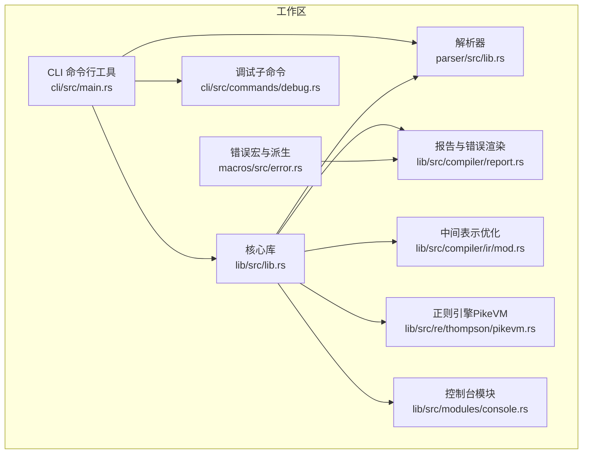
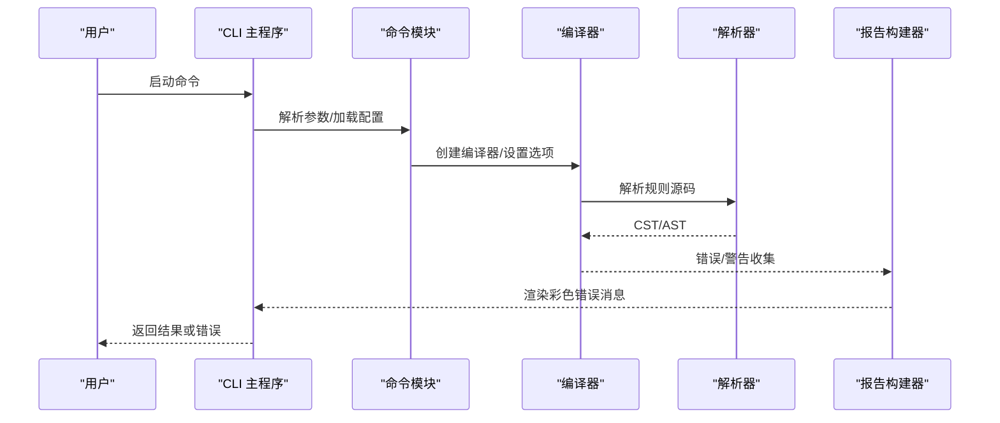
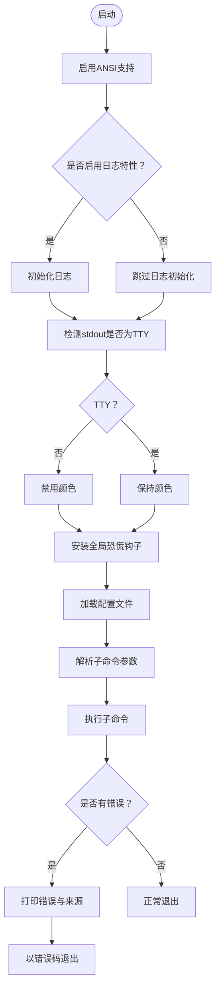
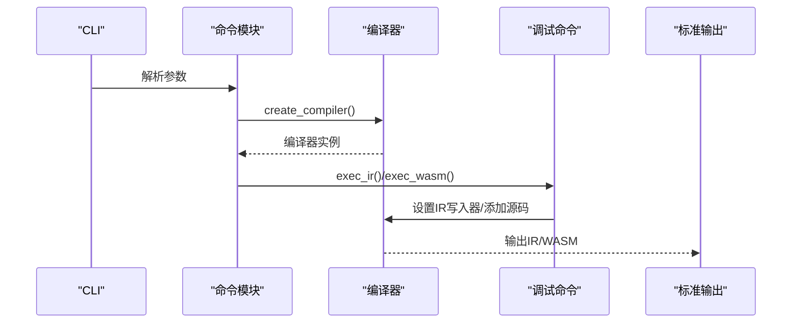
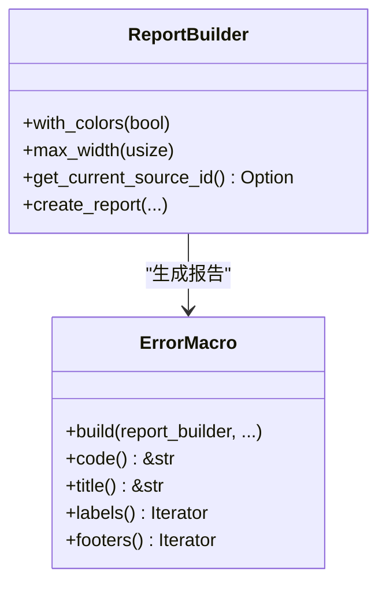
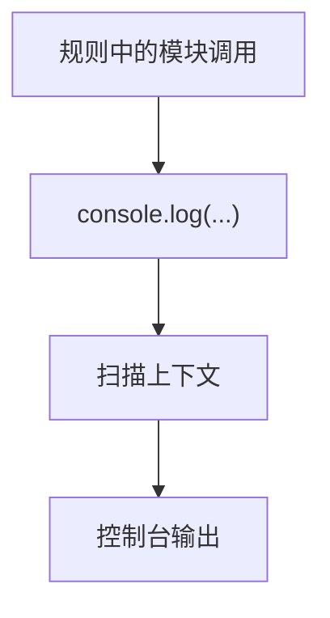
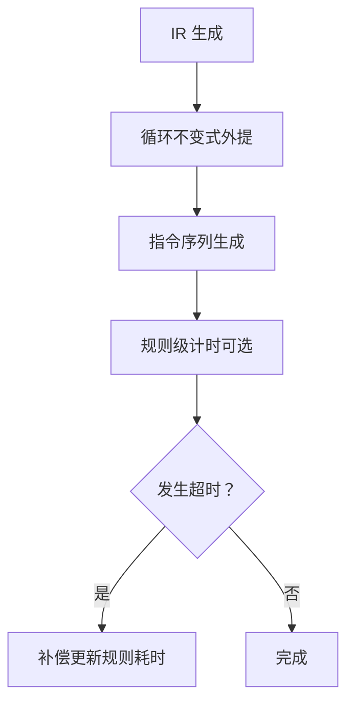
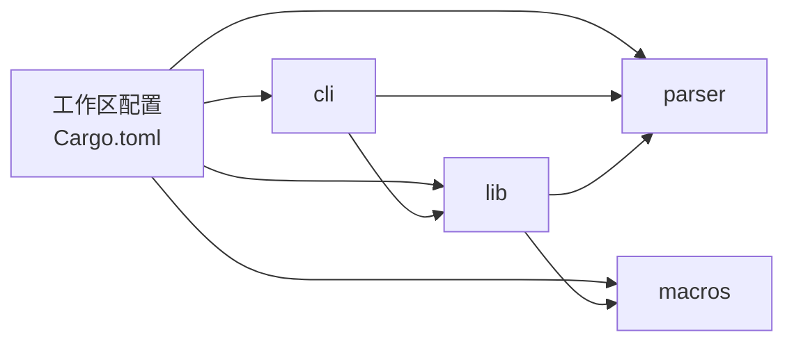

# 故障排除

<cite>
**本文引用的文件**
- [README.md](file://README.md)
- [Cargo.toml](file://Cargo.toml)
- [cli/src/main.rs](file://cli/src/main.rs)
- [cli/src/commands/mod.rs](file://cli/src/commands/mod.rs)
- [cli/src/commands/debug.rs](file://cli/src/commands/debug.rs)
- [lib/src/lib.rs](file://lib/src/lib.rs)
- [lib/src/compiler/report.rs](file://lib/src/compiler/report.rs)
- [lib/src/modules/console.rs](file://lib/src/modules/console.rs)
- [lib/src/scanner/context.rs](file://lib/src/scanner/context.rs)
- [lib/src/compiler/ir/mod.rs](file://lib/src/compiler/ir/mod.rs)
- [lib/src/re/thompson/pikevm.rs](file://lib/src/re/thompson/pikevm.rs)
- [parser/src/lib.rs](file://parser/src/lib.rs)
- [macros/src/error.rs](file://macros/src/error.rs)
</cite>

## 目录
1. [简介](#简介)
2. [项目结构](#项目结构)
3. [核心组件](#核心组件)
4. [架构总览](#架构总览)
5. [详细组件分析](#详细组件分析)
6. [依赖关系分析](#依赖关系分析)
7. [性能考虑](#性能考虑)
8. [故障排除指南](#故障排除指南)
9. [结论](#结论)
10. [附录](#附录)

## 简介
本指南面向所有用户级别，系统化地梳理 yara-x 在编译、运行、性能与配置方面的常见问题与解决方案，并提供调试方法、日志分析技巧、错误信息解读、性能分析工具使用与瓶颈识别方法。文档同时给出社区支持渠道与问题报告流程，帮助快速定位与解决问题。

## 项目结构
yara-x 是一个基于 Rust 的多 crate 工作区，包含命令行工具、库、解析器、格式化器、宏与多种语言绑定。工作区通过统一的版本与依赖管理，确保各模块协同一致。

图示来源
- [cli/src/main.rs:31-107](file://cli/src/main.rs#L31-L107)
- [lib/src/lib.rs:48-82](file://lib/src/lib.rs#L48-L82)
- [parser/src/lib.rs:27-36](file://parser/src/lib.rs#L27-L36)
- [cli/src/commands/debug.rs:82-91](file://cli/src/commands/debug.rs#L82-L91)
- [lib/src/compiler/report.rs:375-408](file://lib/src/compiler/report.rs#L375-L408)
- [lib/src/modules/console.rs:4-8](file://lib/src/modules/console.rs#L4-L8)
- [lib/src/compiler/ir/mod.rs:811-840](file://lib/src/compiler/ir/mod.rs#L811-L840)
- [lib/src/re/thompson/pikevm.rs:153-190](file://lib/src/re/thompson/pikevm.rs#L153-L190)

章节来源
- [Cargo.toml:17-30](file://Cargo.toml#L17-L30)
- [README.md:60-69](file://README.md#L60-L69)

## 核心组件
- 命令行入口与错误处理：统一的主程序负责初始化环境、加载配置、设置恐慌钩子与错误输出，确保进程在任何线程恐慌时立即退出，避免不一致状态。
- 编译器与扫描器：对外暴露编译规则与扫描接口；支持警告与错误收集、颜色化输出、命名空间与外部变量注入等。
- 调试工具链：提供 CST/AST/IR/WASM 输出与模块列表，便于规则级调试与中间产物分析。
- 报告与错误系统：集中化错误/警告报告构建与渲染，支持颜色、宽度、源码缓存与标签/页脚标注。
- 模块系统：内置模块（如控制台日志）可辅助调试与诊断。
- 性能与优化：包含循环不变式外提、规则级性能数据（可选）、超时场景下的时间统计修正。

章节来源
- [cli/src/main.rs:31-107](file://cli/src/main.rs#L31-L107)
- [lib/src/lib.rs:48-82](file://lib/src/lib.rs#L48-L82)
- [cli/src/commands/debug.rs:93-172](file://cli/src/commands/debug.rs#L93-L172)
- [lib/src/compiler/report.rs:375-408](file://lib/src/compiler/report.rs#L375-L408)
- [lib/src/modules/console.rs:4-8](file://lib/src/modules/console.rs#L4-L8)
- [lib/src/compiler/ir/mod.rs:811-840](file://lib/src/compiler/ir/mod.rs#L811-L840)
- [lib/src/scanner/context.rs:401-422](file://lib/src/scanner/context.rs#L401-L422)

## 架构总览
下图展示从 CLI 到库、再到解析器与报告系统的调用路径，以及调试命令如何介入规则编译与中间表示生成。

图示来源
- [cli/src/main.rs:31-107](file://cli/src/main.rs#L31-L107)
- [cli/src/commands/mod.rs:149-213](file://cli/src/commands/mod.rs#L149-L213)
- [parser/src/lib.rs:27-36](file://parser/src/lib.rs#L27-L36)
- [lib/src/compiler/report.rs:375-408](file://lib/src/compiler/report.rs#L375-L408)

## 详细组件分析

### 组件一：命令行入口与错误处理
- 初始化与环境
  - 在 Windows 上启用 ANSI 支持；若 stdout 非 TTY，则关闭颜色输出，避免重定向到文件时出现转义码。
  - 可选启用日志记录（feature 标记），用于调试。
- 配置加载
  - 支持通过 --config 或用户主目录下的配置文件加载；若配置文件存在但解析失败，会打印错误并退出。
- 子命令分发
  - 根据子命令执行对应逻辑；若返回错误，打印错误与来源并以非零退出码退出。
- 全局恐慌钩子
  - 自定义钩子在任一线程恐慌时调用默认钩子并直接退出进程，避免多线程悬挂。

图示来源
- [cli/src/main.rs:31-107](file://cli/src/main.rs#L31-L107)

章节来源
- [cli/src/main.rs:31-107](file://cli/src/main.rs#L31-L107)

### 组件二：编译器与调试命令
- 编译器创建与配置
  - 支持宽松正则语法、颜色化错误、忽略模块、包含目录、禁用警告、外部变量注入等。
  - 提供批量编译与进度渲染（仅在 TTY 模式）。
- 调试命令
  - 支持输出 CST/AST/IR 与 WASM；列出可用模块；支持外部变量传入。
  - IR/WASM 输出可用于验证规则编译阶段的中间产物。

图示来源
- [cli/src/commands/mod.rs:149-213](file://cli/src/commands/mod.rs#L149-L213)
- [cli/src/commands/debug.rs:130-164](file://cli/src/commands/debug.rs#L130-L164)

章节来源
- [cli/src/commands/mod.rs:149-213](file://cli/src/commands/mod.rs#L149-L213)
- [cli/src/commands/debug.rs:93-172](file://cli/src/commands/debug.rs#L93-L172)

### 组件三：报告与错误系统
- 报告构建器
  - 支持颜色开关、最大宽度、当前源码 ID、源码缓存；可为错误/警告生成带标签与页脚的报告。
- 错误宏与派生
  - 通过宏为错误/警告类型生成统一的代码、标题、标签与序列化实现，保证一致性与可维护性。

图示来源
- [lib/src/compiler/report.rs:375-408](file://lib/src/compiler/report.rs#L375-L408)
- [macros/src/error.rs:65-265](file://macros/src/error.rs#L65-L265)

章节来源
- [lib/src/compiler/report.rs:375-408](file://lib/src/compiler/report.rs#L375-L408)
- [macros/src/error.rs:65-265](file://macros/src/error.rs#L65-L265)

### 组件四：模块与控制台日志
- 控制台模块
  - 提供多重重载的 log 函数，支持字符串、布尔、整数、浮点与带消息前缀的日志输出，便于规则中进行诊断与调试。

图示来源
- [lib/src/modules/console.rs:4-8](file://lib/src/modules/console.rs#L4-L8)

章节来源
- [lib/src/modules/console.rs:4-8](file://lib/src/modules/console.rs#L4-L8)

### 组件五：性能与优化
- 中间表示优化
  - 循环不变式外提（hoisting）：将不随循环迭代变化的表达式移出内层循环，减少重复计算。
- 规则级性能数据
  - 在启用特性时，扫描上下文可记录每条规则的匹配/未匹配耗时；在超时场景下对尚未记录的时间进行补偿更新，保证统计完整性。

图示来源
- [lib/src/compiler/ir/mod.rs:811-840](file://lib/src/compiler/ir/mod.rs#L811-L840)
- [lib/src/scanner/context.rs:401-422](file://lib/src/scanner/context.rs#L401-L422)

章节来源
- [lib/src/compiler/ir/mod.rs:811-840](file://lib/src/compiler/ir/mod.rs#L811-L840)
- [lib/src/scanner/context.rs:401-422](file://lib/src/scanner/context.rs#L401-L422)

## 依赖关系分析
- 工作区成员与依赖
  - 工作区统一管理版本、Rust 版本与依赖版本，确保跨模块一致性。
  - 关键依赖包括日志、并发、序列化、正则与性能计时等库。
- CLI 与库的关系
  - CLI 作为入口，依赖 lib 提供的核心 API；调试命令通过解析器与报告系统增强可观测性。

图示来源
- [Cargo.toml:17-30](file://Cargo.toml#L17-L30)
- [Cargo.toml:33-115](file://Cargo.toml#L33-L115)

章节来源
- [Cargo.toml:17-30](file://Cargo.toml#L17-L30)
- [Cargo.toml:33-115](file://Cargo.toml#L33-L115)

## 性能考虑
- 优化策略
  - 使用循环不变式外提减少重复计算。
  - 在开发调试时开启必要的优化（例如解析器的 dev profile 优化），避免栈溢出与递归深度问题。
- 计时与统计
  - 规则级性能数据可选启用；超时场景下自动补偿尚未记录的耗时，提升统计准确性。
- 正则引擎
  - PikeVM 实现的正则匹配具备确定性与缓存机制，有助于稳定性能表现。

章节来源
- [lib/src/compiler/ir/mod.rs:811-840](file://lib/src/compiler/ir/mod.rs#L811-L840)
- [lib/src/scanner/context.rs:401-422](file://lib/src/scanner/context.rs#L401-L422)
- [Cargo.toml:127-135](file://Cargo.toml#L127-L135)
- [lib/src/re/thompson/pikevm.rs:153-190](file://lib/src/re/thompson/pikevm.rs#L153-L190)

## 故障排除指南

### 一、编译错误
- 常见症状
  - 规则语法错误、未知模块、包含文件缺失、警告过多导致失败。
- 快速定位
  - 使用调试命令查看 CST/AST/IR/WASM，确认规则解析与中间表示是否符合预期。
  - 检查外部变量与模块数据是否正确传入。
- 处理步骤
  - 启用宽松正则语法（如适用）。
  - 使用 --disable-warnings 控制警告级别，或通过配置文件统一管理。
  - 使用 --ignore-module 排除特定模块以隔离问题。
  - 使用 --include-dir 指定包含目录，确保规则引用的头文件可被找到。
  - 使用 --define 注入外部变量，确保 JSON 值合法。
- 参考实现位置
  - [cli/src/commands/debug.rs:93-172](file://cli/src/commands/debug.rs#L93-L172)
  - [cli/src/commands/mod.rs:149-213](file://cli/src/commands/mod.rs#L149-L213)

章节来源
- [cli/src/commands/debug.rs:93-172](file://cli/src/commands/debug.rs#L93-L172)
- [cli/src/commands/mod.rs:149-213](file://cli/src/commands/mod.rs#L149-L213)

### 二、运行时错误
- 常见症状
  - 扫描崩溃、超时、模块调用异常、内存不足。
- 快速定位
  - 检查扫描上下文中的规则计时数据（可选）。
  - 使用控制台模块输出中间状态，辅助定位。
- 处理步骤
  - 在启用特性时启用规则级性能数据，观察耗时异常的规则。
  - 对可能超时的规则增加超时阈值或拆分逻辑。
  - 使用模块日志输出关键变量与路径，缩小范围。
- 参考实现位置
  - [lib/src/scanner/context.rs:401-422](file://lib/src/scanner/context.rs#L401-L422)
  - [lib/src/modules/console.rs:4-8](file://lib/src/modules/console.rs#L4-L8)

章节来源
- [lib/src/scanner/context.rs:401-422](file://lib/src/scanner/context.rs#L401-L422)
- [lib/src/modules/console.rs:4-8](file://lib/src/modules/console.rs#L4-L8)

### 三、性能问题
- 常见症状
  - 扫描速度慢、CPU 占用高、内存增长快。
- 快速定位
  - 启用规则级性能数据，识别耗时最长的规则。
  - 检查是否存在大量嵌套循环或复杂正则表达式。
- 处理步骤
  - 应用循环不变式外提优化（IR 层已内置）。
  - 将大规则拆分为多个小规则，减少单次扫描负担。
  - 优化正则表达式，避免回溯风暴。
- 参考实现位置
  - [lib/src/compiler/ir/mod.rs:811-840](file://lib/src/compiler/ir/mod.rs#L811-L840)
  - [lib/src/re/thompson/pikevm.rs:153-190](file://lib/src/re/thompson/pikevm.rs#L153-L190)

章节来源
- [lib/src/compiler/ir/mod.rs:811-840](file://lib/src/compiler/ir/mod.rs#L811-L840)
- [lib/src/re/thompson/pikevm.rs:153-190](file://lib/src/re/thompson/pikevm.rs#L153-L190)

### 四、配置问题
- 常见症状
  - 配置文件未生效、颜色输出异常、日志未显示。
- 快速定位
  - 检查 CLI 是否正确加载配置文件路径。
  - 检查 TTY 环境与颜色输出设置。
  - 检查日志特性是否启用。
- 处理步骤
  - 显式指定 --config 路径或确保用户主目录配置文件存在。
  - 在非 TTY 环境中自动禁用颜色，避免输出污染。
  - 在需要时启用日志特性以便调试。
- 参考实现位置
  - [cli/src/main.rs:31-107](file://cli/src/main.rs#L31-L107)

章节来源
- [cli/src/main.rs:31-107](file://cli/src/main.rs#L31-L107)

### 五、日志分析与错误解读
- 日志与颜色
  - CLI 在非 TTY 环境自动禁用颜色；可通过特性启用日志记录。
- 错误报告
  - 报告构建器支持颜色、最大宽度、源码缓存与标签/页脚，便于阅读。
- 错误宏
  - 通过宏统一生成错误/警告的代码、标题与标签，保证一致性。
- 参考实现位置
  - [cli/src/main.rs:31-107](file://cli/src/main.rs#L31-L107)
  - [lib/src/compiler/report.rs:375-408](file://lib/src/compiler/report.rs#L375-L408)
  - [macros/src/error.rs:65-265](file://macros/src/error.rs#L65-L265)

章节来源
- [cli/src/main.rs:31-107](file://cli/src/main.rs#L31-L107)
- [lib/src/compiler/report.rs:375-408](file://lib/src/compiler/report.rs#L375-L408)
- [macros/src/error.rs:65-265](file://macros/src/error.rs#L65-L265)

### 六、调试方法与工具使用
- 规则级调试
  - 使用调试命令输出 CST/AST/IR/WASM，核对规则解析与中间表示。
- 模块与外部变量
  - 使用 --define 注入变量，使用模块列表确认可用模块。
- 进度与可视化
  - 在 TTY 环境下可看到编译进度渲染。
- 参考实现位置
  - [cli/src/commands/debug.rs:93-172](file://cli/src/commands/debug.rs#L93-L172)
  - [cli/src/commands/mod.rs:224-302](file://cli/src/commands/mod.rs#L224-L302)

章节来源
- [cli/src/commands/debug.rs:93-172](file://cli/src/commands/debug.rs#L93-L172)
- [cli/src/commands/mod.rs:224-302](file://cli/src/commands/mod.rs#L224-L302)

### 七、社区支持与问题报告
- 社区与支持
  - 项目主页与文档提供背景与对比说明。
  - GitHub 仓库提供问题反馈渠道。
- 问题报告建议
  - 包含规则片段、命令行参数、期望行为与实际行为。
  - 附上 CST/AST/IR/WASM 输出与相关日志。
- 参考位置
  - [README.md:60-69](file://README.md#L60-L69)

章节来源
- [README.md:60-69](file://README.md#L60-L69)

## 结论
通过系统化的错误报告、调试命令与性能优化手段，yara-x 能够有效支撑从初学者到高级用户的各类排查需求。建议在日常使用中结合调试命令与报告系统，配合规则级性能数据与模块日志，形成闭环的问题定位与修复流程。

## 附录
- 关键实现参考路径
  - [cli/src/main.rs:31-107](file://cli/src/main.rs#L31-L107)
  - [cli/src/commands/mod.rs:149-213](file://cli/src/commands/mod.rs#L149-L213)
  - [cli/src/commands/debug.rs:93-172](file://cli/src/commands/debug.rs#L93-L172)
  - [lib/src/lib.rs:48-82](file://lib/src/lib.rs#L48-L82)
  - [lib/src/compiler/report.rs:375-408](file://lib/src/compiler/report.rs#L375-L408)
  - [lib/src/modules/console.rs:4-8](file://lib/src/modules/console.rs#L4-L8)
  - [lib/src/compiler/ir/mod.rs:811-840](file://lib/src/compiler/ir/mod.rs#L811-L840)
  - [lib/src/scanner/context.rs:401-422](file://lib/src/scanner/context.rs#L401-L422)
  - [Cargo.toml:17-30](file://Cargo.toml#L17-L30)
  - [Cargo.toml:33-115](file://Cargo.toml#L33-L115)
  - [parser/src/lib.rs:27-36](file://parser/src/lib.rs#L27-L36)
  - [macros/src/error.rs:65-265](file://macros/src/error.rs#L65-L265)