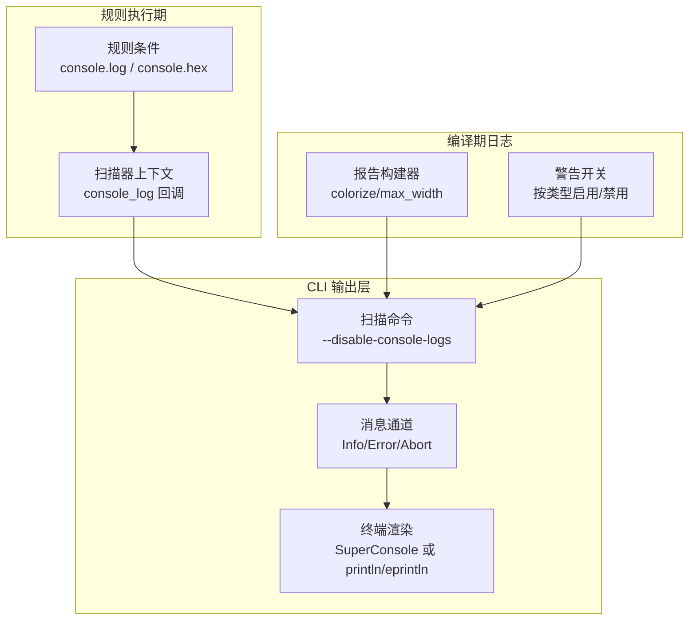
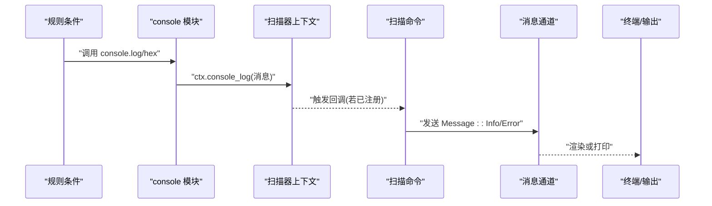
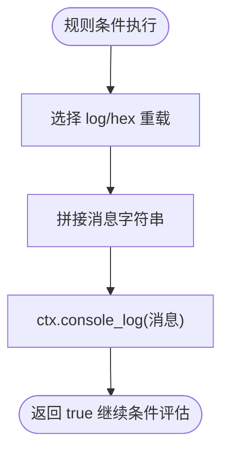
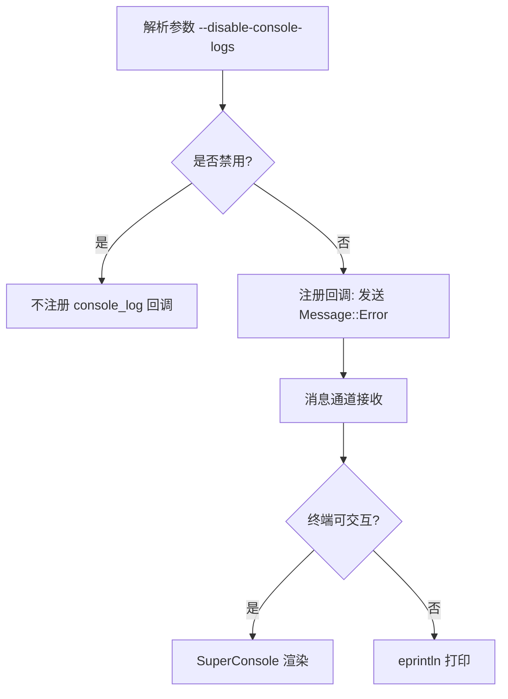
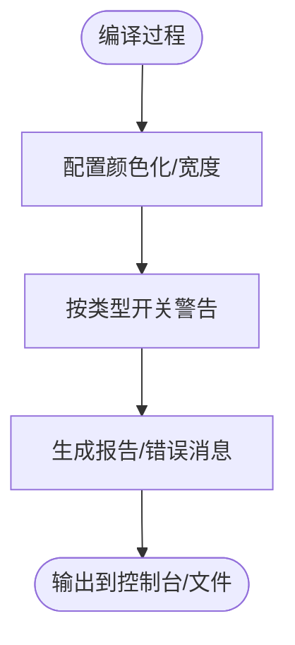
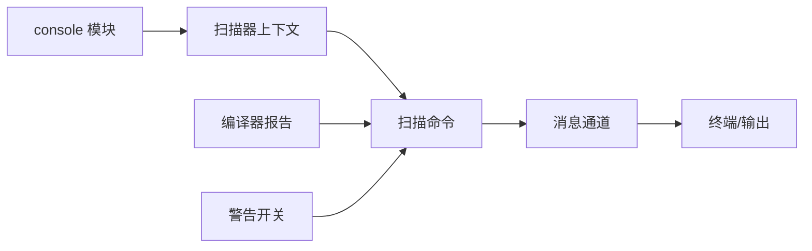

# 日志分析

<cite>
**本文引用的文件**
- [console 模块实现](file://yara-x/lib/src/modules/console.rs)
- [控制台模块文档](file://yara-x/site/content/docs/modules/console.md)
- [扫描命令 CLI 实现](file://yara-x/cli/src/commands/scan.rs)
- [扫描器上下文与日志回调](file://yara-x/lib/src/scanner/context.rs)
- [扫描器公共接口](file://yara-x/lib/src/scanner/mod.rs)
- [编译器报告构建器](file://yara-x/lib/src/compiler/report.rs)
- [编译器配置与警告开关](file://yara-x/lib/src/compiler/mod.rs)
- [宏：错误与警告标签定义](file://yara-x/macros/src/error.rs)
- [CLI 走路器与消息通道](file://yara-x/cli/src/walk.rs)
- [C API 编译器颜色化与慢规则错误](file://yara-x/capi/src/compiler.rs)
</cite>

## 目录
1. [简介](#简介)
2. [项目结构](#项目结构)
3. [核心组件](#核心组件)
4. [架构总览](#架构总览)
5. [详细组件分析](#详细组件分析)
6. [依赖关系分析](#依赖关系分析)
7. [性能考量](#性能考量)
8. [故障排查指南](#故障排查指南)
9. [结论](#结论)
10. [附录](#附录)

## 简介
本指南面向运维与系统管理员，聚焦于 YARA-X 的日志系统配置与使用，涵盖以下主题：
- 如何在规则执行期间输出日志（console 模块）
- 如何通过 CLI 控制台日志输出与禁用
- 错误与警告消息的来源、级别与解读
- 常见日志错误的分析与处理
- 日志聚合与监控最佳实践

## 项目结构
围绕日志功能的关键位置如下：
- 规则执行期日志：console 模块导出多个 log/hex 函数，供规则条件中调用；扫描器上下文持有回调并在执行时触发。
- CLI 层面：扫描命令支持禁用控制台日志，并通过消息通道将日志渲染到终端或输出流。
- 编译期日志：编译器报告构建器可控制颜色化与宽度；警告可按类型开关。
- 宏与错误系统：为错误/警告消息提供标签与级别定义能力。



**图表来源**
- [console 模块实现:10-84](file://yara-x/lib/src/modules/console.rs#L10-L84)
- [扫描器上下文与日志回调:295-299](file://yara-x/lib/src/scanner/context.rs#L295-L299)
- [扫描器公共接口:232-245](file://yara-x/lib/src/scanner/mod.rs#L232-L245)
- [扫描命令 CLI 实现:80-82](file://yara-x/cli/src/commands/scan.rs#L80-L82)
- [CLI 走路器与消息通道:560-614](file://yara-x/cli/src/walk.rs#L560-L614)
- [编译器报告构建器:375-400](file://yara-x/lib/src/compiler/report.rs#L375-L400)
- [编译器配置与警告开关:907-946](file://yara-x/lib/src/compiler/mod.rs#L907-L946)

**章节来源**
- [console 模块实现:10-84](file://yara-x/lib/src/modules/console.rs#L10-L84)
- [扫描器上下文与日志回调:295-299](file://yara-x/lib/src/scanner/context.rs#L295-L299)
- [扫描器公共接口:232-245](file://yara-x/lib/src/scanner/mod.rs#L232-L245)
- [扫描命令 CLI 实现:80-82](file://yara-x/cli/src/commands/scan.rs#L80-L82)
- [CLI 走路器与消息通道:560-614](file://yara-x/cli/src/walk.rs#L560-L614)
- [编译器报告构建器:375-400](file://yara-x/lib/src/compiler/report.rs#L375-L400)
- [编译器配置与警告开关:907-946](file://yara-x/lib/src/compiler/mod.rs#L907-L946)

## 核心组件
- console 模块：在规则条件执行期间输出字符串、整数、浮点、布尔以及十六进制值，统一走扫描器上下文的 console_log 回调。
- 扫描器上下文：持有 console_log 可选回调，在规则执行时触发，将消息传递给 CLI 或其他消费者。
- CLI 扫描命令：支持禁用控制台日志；当启用时，将日志通过消息通道发送至终端渲染器或标准输出/错误。
- 编译器报告与警告：控制台错误消息的颜色化与宽度；按类型启用/禁用警告，影响编译期日志输出。

**章节来源**
- [console 模块实现:10-84](file://yara-x/lib/src/modules/console.rs#L10-L84)
- [扫描器上下文与日志回调:295-299](file://yara-x/lib/src/scanner/context.rs#L295-L299)
- [扫描器公共接口:232-245](file://yara-x/lib/src/scanner/mod.rs#L232-L245)
- [扫描命令 CLI 实现:80-82](file://yara-x/cli/src/commands/scan.rs#L80-L82)
- [编译器报告构建器:375-400](file://yara-x/lib/src/compiler/report.rs#L375-L400)
- [编译器配置与警告开关:907-946](file://yara-x/lib/src/compiler/mod.rs#L907-L946)

## 架构总览
下面以序列图展示“规则触发日志 → 扫描器上下文 → CLI 输出”的完整链路。



**图表来源**
- [console 模块实现:10-84](file://yara-x/lib/src/modules/console.rs#L10-L84)
- [扫描器上下文与日志回调:295-299](file://yara-x/lib/src/scanner/context.rs#L295-L299)
- [扫描器公共接口:232-245](file://yara-x/lib/src/scanner/mod.rs#L232-L245)
- [扫描命令 CLI 实现:385-393](file://yara-x/cli/src/commands/scan.rs#L385-L393)
- [CLI 走路器与消息通道:560-614](file://yara-x/cli/src/walk.rs#L560-L614)

## 详细组件分析

### 规则执行期日志：console 模块
- 功能概览
  - 提供多种重载的 log 与 hex 函数，支持字符串、整型、浮点、布尔及带消息前缀的组合输出。
  - 所有输出最终通过扫描器上下文的 console_log 回调分发。
- 关键行为
  - 每个 log/hex 导出函数均返回布尔值，便于在规则条件中串联逻辑。
  - 默认输出目标为标准输出（由 CLI 决定是否渲染）。
- 使用建议
  - 在调试阶段使用带消息前缀的版本，便于区分不同变量或路径。
  - 对数值输出优先使用 hex 版本以提升可观测性。



**图表来源**
- [console 模块实现:10-84](file://yara-x/lib/src/modules/console.rs#L10-L84)
- [控制台模块文档:21-35](file://yara-x/site/content/docs/modules/console.md#L21-L35)

**章节来源**
- [console 模块实现:10-84](file://yara-x/lib/src/modules/console.rs#L10-L84)
- [控制台模块文档:21-35](file://yara-x/site/content/docs/modules/console.md#L21-L35)

### 扫描器上下文与日志回调
- 关键点
  - 扫描器提供 console_log 方法注册回调；上下文在执行时调用该回调。
  - 若未注册回调，则 console.log/hex 输出被忽略。
- 集成方式
  - CLI 在启用控制台日志时，将回调绑定到消息通道，从而实现实时渲染或打印。

```mermaid
classDiagram
class Scanner {
+console_log(callback)
+scan(...)
}
class ScanContext {
+console_log : Option<FnMut(String)>
+eval_conditions()
}
Scanner --> ScanContext : "持有并操作"
```

**图表来源**
- [扫描器公共接口:232-245](file://yara-x/lib/src/scanner/mod.rs#L232-L245)
- [扫描器上下文与日志回调:295-299](file://yara-x/lib/src/scanner/context.rs#L295-L299)

**章节来源**
- [扫描器公共接口:232-245](file://yara-x/lib/src/scanner/mod.rs#L232-L245)
- [扫描器上下文与日志回调:295-299](file://yara-x/lib/src/scanner/context.rs#L295-L299)

### CLI 控制台日志：启用/禁用与输出
- 启用/禁用
  - CLI 提供 --disable-console-logs 参数，默认启用控制台日志。
  - 当未禁用时，扫描器注册回调，将消息经消息通道发送到终端渲染器或直接打印。
- 输出格式
  - 未启用终端渲染时，日志通过标准错误输出；启用时由渲染器统一管理。
  - CLI 还支持多种结果输出格式（文本、NDJSON、JSON），但不影响规则执行期日志的输出方式。



**图表来源**
- [扫描命令 CLI 实现:80-82](file://yara-x/cli/src/commands/scan.rs#L80-L82)
- [扫描命令 CLI 实现:385-393](file://yara-x/cli/src/commands/scan.rs#L385-L393)
- [CLI 走路器与消息通道:560-614](file://yara-x/cli/src/walk.rs#L560-L614)

**章节来源**
- [扫描命令 CLI 实现:80-82](file://yara-x/cli/src/commands/scan.rs#L80-L82)
- [扫描命令 CLI 实现:385-393](file://yara-x/cli/src/commands/scan.rs#L385-L393)
- [CLI 走路器与消息通道:560-614](file://yara-x/cli/src/walk.rs#L560-L614)

### 编译期日志：颜色化与宽度、警告开关
- 颜色化与宽度
  - 编译器报告构建器支持开启颜色化与设置最大列宽，用于美化错误/警告输出。
- 警告开关
  - 支持按类型启用/禁用特定警告；也支持一键启用/禁用全部警告。
- C API 扩展
  - C API 编译器标志支持颜色化错误输出、对慢模式/循环报错等，影响编译期日志行为。



**图表来源**
- [编译器报告构建器:375-400](file://yara-x/lib/src/compiler/report.rs#L375-L400)
- [编译器配置与警告开关:907-946](file://yara-x/lib/src/compiler/mod.rs#L907-L946)
- [C API 编译器颜色化与慢规则错误:15-40](file://yara-x/capi/src/compiler.rs#L15-L40)

**章节来源**
- [编译器报告构建器:375-400](file://yara-x/lib/src/compiler/report.rs#L375-L400)
- [编译器配置与警告开关:907-946](file://yara-x/lib/src/compiler/mod.rs#L907-L946)
- [C API 编译器颜色化与慢规则错误:15-40](file://yara-x/capi/src/compiler.rs#L15-L40)

### 错误与警告消息：级别与含义
- 级别来源
  - 宏系统允许在错误/警告定义中指定标签与级别，未显式指定时默认为 ERROR 或 WARNING。
- 典型场景
  - 语法错误、变量错误、序列化错误、扫描超时等，均会形成错误消息并通过 CLI 或终端呈现。
- 解读要点
  - 错误标题与标签：用于快速定位问题范围与原因。
  - 根因链：CLI 会将根因与错误信息组合输出，便于溯源。

**章节来源**
- [宏：错误与警告标签定义:10-36](file://yara-x/macros/src/error.rs#L10-L36)
- [宏：错误与警告标签定义:142-168](file://yara-x/macros/src/error.rs#L142-L168)
- [扫描命令 CLI 实现:500-522](file://yara-x/cli/src/commands/scan.rs#L500-L522)

## 依赖关系分析
- console 模块依赖扫描器上下文的 console_log 回调，实现“规则 → 上下文 → CLI”链路。
- CLI 扫描命令依赖消息通道与终端渲染器，决定日志的显示方式。
- 编译器报告与警告配置独立于运行期日志，但共同构成完整的可观测性体系。



**图表来源**
- [console 模块实现:10-84](file://yara-x/lib/src/modules/console.rs#L10-L84)
- [扫描器上下文与日志回调:295-299](file://yara-x/lib/src/scanner/context.rs#L295-L299)
- [扫描器公共接口:232-245](file://yara-x/lib/src/scanner/mod.rs#L232-L245)
- [扫描命令 CLI 实现:385-393](file://yara-x/cli/src/commands/scan.rs#L385-L393)
- [CLI 走路器与消息通道:560-614](file://yara-x/cli/src/walk.rs#L560-L614)
- [编译器报告构建器:375-400](file://yara-x/lib/src/compiler/report.rs#L375-L400)
- [编译器配置与警告开关:907-946](file://yara-x/lib/src/compiler/mod.rs#L907-L946)

**章节来源**
- [console 模块实现:10-84](file://yara-x/lib/src/modules/console.rs#L10-L84)
- [扫描器上下文与日志回调:295-299](file://yara-x/lib/src/scanner/context.rs#L295-L299)
- [扫描器公共接口:232-245](file://yara-x/lib/src/scanner/mod.rs#L232-L245)
- [扫描命令 CLI 实现:385-393](file://yara-x/cli/src/commands/scan.rs#L385-L393)
- [CLI 走路器与消息通道:560-614](file://yara-x/cli/src/walk.rs#L560-L614)
- [编译器报告构建器:375-400](file://yara-x/lib/src/compiler/report.rs#L375-L400)
- [编译器配置与警告开关:907-946](file://yara-x/lib/src/compiler/mod.rs#L907-L946)

## 性能考量
- 规则执行期日志开销
  - console.log/hex 在每条规则条件中都会触发回调，频繁输出可能影响扫描性能。
  - 建议仅在调试阶段启用，生产环境关闭控制台日志或限制输出频率。
- 终端渲染
  - CLI 的 SuperConsole 渲染周期固定，若日志量巨大，渲染本身也会带来额外开销。
- 编译期日志
  - 开启颜色化与较宽的错误消息宽度会增加输出体积，但对性能影响较小。

[本节为通用指导，无需列出具体文件来源]

## 故障排查指南
- 症状：规则中使用 console.log/hex 无输出
  - 排查：确认 CLI 是否启用 --disable-console-logs；检查扫描器是否注册了 console_log 回调。
  - 处理：移除禁用参数或在扫描器上显式注册回调。
- 症状：编译时报错/警告过多
  - 排查：查看编译器颜色化与宽度设置；按类型关闭不需要的警告。
  - 处理：调整报告构建器颜色化与宽度；使用警告开关减少噪音。
- 症状：扫描超时
  - 排查：检查规则复杂度与数据规模；关注 CLI 错误输出中的根因信息。
  - 处理：优化规则、限制扫描范围或提高超时阈值；结合性能分析定位慢规则。

**章节来源**
- [扫描命令 CLI 实现:500-522](file://yara-x/cli/src/commands/scan.rs#L500-L522)
- [编译器报告构建器:375-400](file://yara-x/lib/src/compiler/report.rs#L375-L400)
- [编译器配置与警告开关:907-946](file://yara-x/lib/src/compiler/mod.rs#L907-L946)

## 结论
- YARA-X 的日志体系分为“规则执行期日志（console）”和“编译/运行期日志（错误/警告）”，两者相互补充。
- CLI 提供灵活的日志开关与输出控制，适合在不同环境中平衡可观测性与性能。
- 建议在开发/测试阶段充分使用 console 日志与颜色化错误输出，在生产阶段谨慎启用高频日志与终端渲染。

[本节为总结性内容，无需列出具体文件来源]

## 附录

### 日志级别与输出格式配置清单
- 规则执行期日志
  - 启用/禁用：通过 CLI 参数控制；也可在扫描器上注册/取消回调。
  - 输出目标：默认标准输出；CLI 未启用终端渲染时走标准错误。
- 编译期日志
  - 颜色化：控制台错误消息是否带 ANSI 颜色。
  - 最大宽度：错误消息的最大列宽。
  - 警告开关：按类型启用/禁用或全部启用/禁用。

**章节来源**
- [扫描命令 CLI 实现:80-82](file://yara-x/cli/src/commands/scan.rs#L80-L82)
- [扫描器公共接口:232-245](file://yara-x/lib/src/scanner/mod.rs#L232-L245)
- [编译器报告构建器:375-400](file://yara-x/lib/src/compiler/report.rs#L375-L400)
- [编译器配置与警告开关:907-946](file://yara-x/lib/src/compiler/mod.rs#L907-L946)

### 日志聚合与监控最佳实践
- 将 CLI 的错误输出重定向到日志收集系统（如文件、管道或标准错误），以便集中采集。
- 在 CI/CD 中开启颜色化与宽度设置，便于在终端与日志系统中一致呈现。
- 使用“禁用控制台日志”参数在批量扫描任务中降低输出噪声，仅保留关键错误与结果。
- 对慢规则进行定期分析，结合性能指标优化规则集。

[本节为通用指导，无需列出具体文件来源]