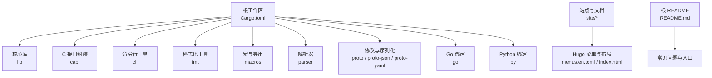
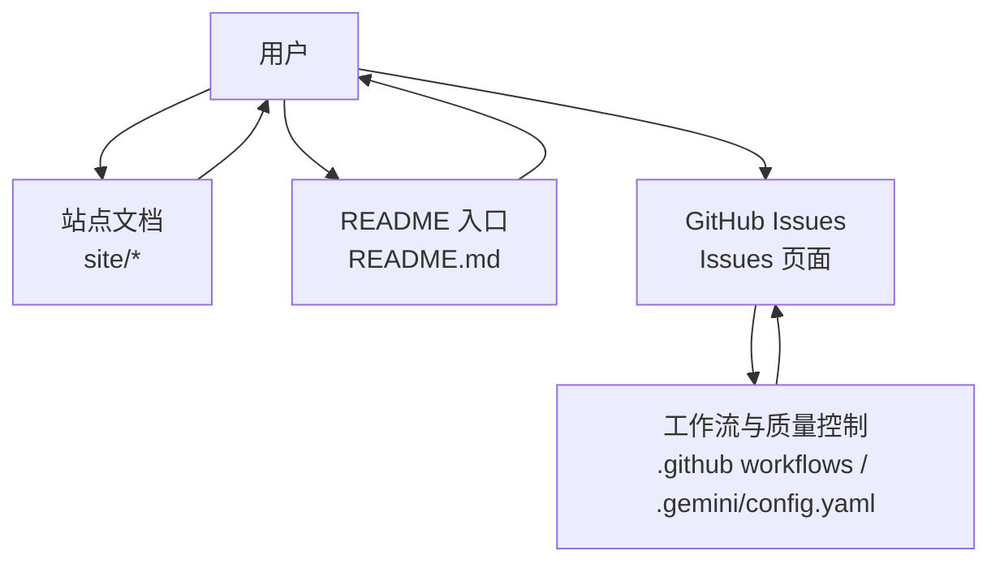
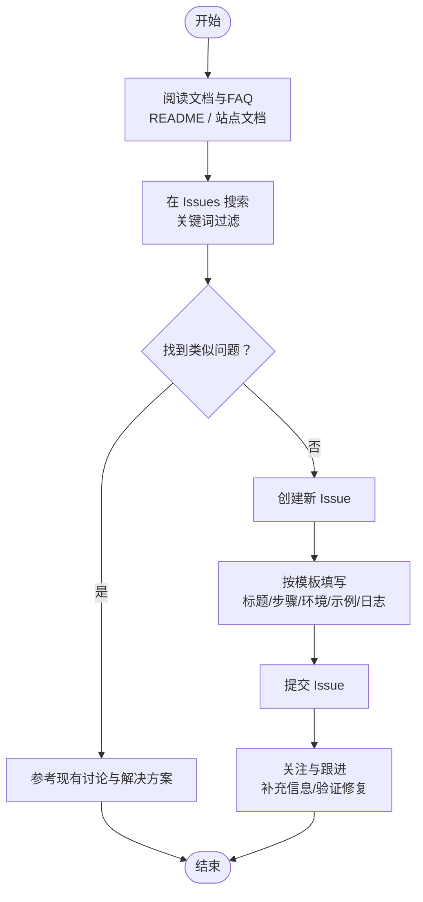
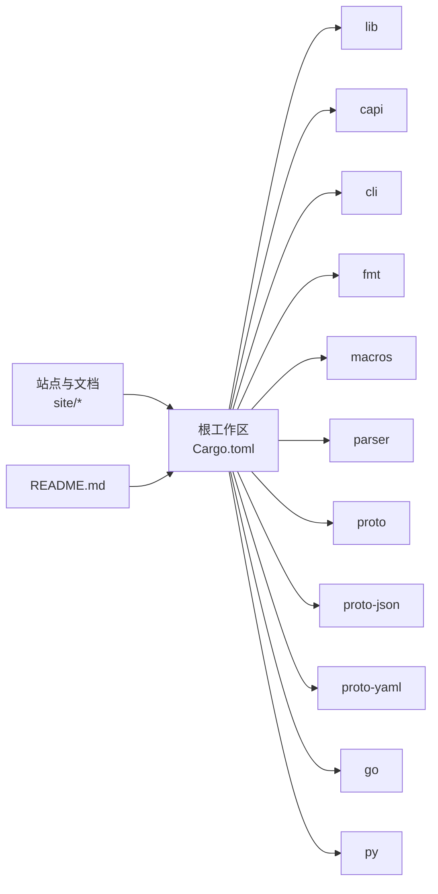
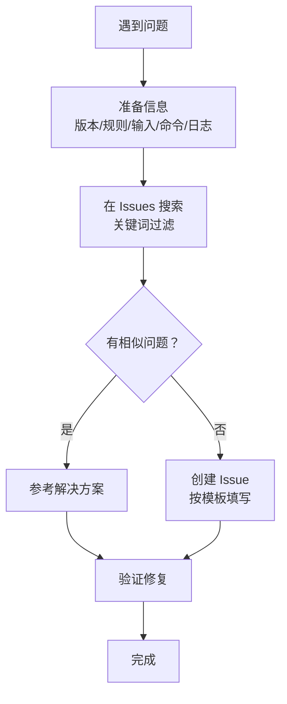

# 社区支持

<cite>
**本文引用的文件**
- [README.md](file://README.md)
- [Cargo.toml](file://Cargo.toml)
- [site/content/docs/_index.md](file://site/content/docs/_index.md)
- [site/config/_default/menus/menus.en.toml](file://site/config/_default/menus/menus.en.toml)
- [site/layouts/index.html](file://site/layouts/index.html)
- [.gemini/config.yaml](file://.gemini/config.yaml)
- [lib/src/compiler/report.rs](file://lib/src/compiler/report.rs)
</cite>

## 目录
1. [简介](#简介)
2. [项目结构](#项目结构)
3. [核心组件](#核心组件)
4. [架构总览](#架构总览)
5. [详细组件分析](#详细组件分析)
6. [依赖分析](#依赖分析)
7. [性能考虑](#性能考虑)
8. [故障排查指南](#故障排查指南)
9. [结论](#结论)
10. [附录](#附录)

## 简介
本指南面向使用与贡献 YARA-X 的用户与开发者，提供获取社区帮助的完整流程与资源清单，涵盖官方文档、问题反馈渠道（GitHub Issues）、讨论与交流方式、邮件列表、行为准则与沟通礼仪等。同时给出高效报告问题的方法论与模板要点、贡献路径与流程、常见问题的检索策略，以及在仓库中可见的社区治理与质量控制实践。

## 项目结构
YARA-X 采用多语言与多模块的组织方式：Rust 核心库、CLI、格式化工具、C/Go/Python 绑定、解析器、协议与站点文档等。官方文档与站点由 Hugo 驱动，提供在线文档与博客内容；根级 Cargo 工作区定义了各成员包与统一配置；README 提供快速入门与常见问题入口；站点菜单配置包含 GitHub 社交链接。

图表来源
- [Cargo.toml:17-29](file://Cargo.toml#L17-L29)
- [site/config/_default/menus/menus.en.toml:54-55](file://site/config/_default/menus/menus.en.toml#L54-L55)
- [site/layouts/index.html:1-187](file://site/layouts/index.html#L1-L187)
- [README.md:43-69](file://README.md#L43-L69)

章节来源
- [Cargo.toml:17-29](file://Cargo.toml#L17-L29)
- [README.md:43-69](file://README.md#L43-L69)
- [site/content/docs/_index.md:1-20](file://site/content/docs/_index.md#L1-L20)
- [site/config/_default/menus/menus.en.toml:54-55](file://site/config/_default/menus/menus.en.toml#L54-L55)
- [site/layouts/index.html:1-187](file://site/layouts/index.html#L1-L187)

## 核心组件
- 官方文档与站点
  - 在线文档入口与导航由站点配置与首页布局提供，便于用户快速定位“安装”“CLI 使用”“API”“规则编写”等主题。
  - 文档索引页用于组织文档结构与目录生成。
- 常见问题与入口
  - README 中提供常见问题与对比说明，并在末尾明确引导通过 GitHub Issues 反馈问题。
- 社区链接
  - 站点菜单包含 GitHub 社交入口，便于访问项目仓库与 Issue 区域。
- 质量与治理
  - 代码评审配置显示仓库内存在代码评审相关设置，体现对代码质量的关注。

章节来源
- [site/content/docs/_index.md:1-20](file://site/content/docs/_index.md#L1-L20)
- [README.md:43-69](file://README.md#L43-L69)
- [site/config/_default/menus/menus.en.toml:54-55](file://site/config/_default/menus/menus.en.toml#L54-L55)
- [.gemini/config.yaml:1-3](file://.gemini/config.yaml#L1-L3)

## 架构总览
下图展示用户与社区支持相关的交互路径：从站点文档与 README 获取信息，到 GitHub Issues 提交问题，再到仓库中的质量控制与协作流程。

图表来源
- [README.md:43-69](file://README.md#L43-L69)
- [site/layouts/index.html:1-187](file://site/layouts/index.html#L1-L187)
- [site/config/_default/menus/menus.en.toml:54-55](file://site/config/_default/menus/menus.en.toml#L54-L55)
- [.gemini/config.yaml:1-3](file://.gemini/config.yaml#L1-L3)

## 详细组件分析

### 获取帮助与问题反馈流程
- 步骤一：查阅官方文档与常见问题
  - 访问站点文档索引与首页，定位“安装”“CLI 使用”“API”“规则编写”等页面。
  - 查看 README 的常见问题部分，确认是否已有答案或迁移/兼容性说明。
- 步骤二：在 GitHub 上搜索与提问
  - 使用站点菜单中的 GitHub 链接进入仓库，先在 Issues 中搜索关键词，避免重复提问。
  - 若无匹配结果，新建 Issue 并按模板填写必要信息。
- 步骤三：提交高质量 Issue
  - 模板要点（建议）：标题简洁明确、复现步骤清晰、环境信息完整、期望与实际结果对比、最小可复现示例或规则片段、日志与错误输出。
  - 附件与示例：提供最小规则集、输入样本、命令行参数与版本信息。
- 步骤四：跟进与协作
  - 关注维护者反馈，及时补充信息，配合复现与验证。
  - 如需讨论细节，可在 Issue 下评论或参考其他交流渠道。

图表来源
- [README.md:43-69](file://README.md#L43-L69)
- [site/content/docs/_index.md:1-20](file://site/content/docs/_index.md#L1-L20)
- [site/config/_default/menus/menus.en.toml:54-55](file://site/config/_default/menus/menus.en.toml#L54-L55)

章节来源
- [README.md:43-69](file://README.md#L43-L69)
- [site/content/docs/_index.md:1-20](file://site/content/docs/_index.md#L1-L20)
- [site/config/_default/menus/menus.en.toml:54-55](file://site/config/_default/menus/menus.en.toml#L54-L55)

### 社区贡献方式与流程
- 代码贡献
  - Fork 仓库并在分支上开发，遵循仓库的构建与测试流程。
  - 提交 Pull Request 前确保通过本地测试与格式化检查。
  - PR 描述中说明变更动机、影响范围与测试结果。
- 文档改进
  - 在站点内容目录中修改对应 Markdown 文件，保持与现有风格一致。
  - 更新后预览效果，确保链接与图片可用。
- 问题反馈与讨论
  - 使用 Issues 进行功能请求与缺陷报告。
  - 对于设计讨论或非紧急事项，可先在 Discussions 或评论区交流。

（本节为通用流程说明，不直接分析具体源码文件）

### 行为准则与沟通礼仪
- 尊重与包容：以建设性方式提出问题与建议，避免人身攻击或不当言论。
- 清晰表达：使用清晰、简洁的语言，提供充分上下文与证据。
- 积极协作：及时响应维护者的反馈，配合复现与验证。
- 合理使用渠道：优先在 Issues 中报告缺陷与功能请求，避免重复或错放。

（本节为通用规范说明，不直接分析具体源码文件）

## 依赖分析
- 工作区成员与关系
  - 根级工作区声明了多个成员包，形成多语言与多能力的模块化体系。
  - 成员包之间通过共享依赖与版本管理进行耦合，便于统一升级与测试。
- 文档与站点依赖
  - 站点通过菜单与布局组织文档导航，README 作为入口与常见问题汇总。
- 质量控制依赖
  - 代码评审配置与工作流共同保障代码质量与一致性。

图表来源
- [Cargo.toml:17-29](file://Cargo.toml#L17-L29)
- [site/content/docs/_index.md:1-20](file://site/content/docs/_index.md#L1-L20)
- [README.md:43-69](file://README.md#L43-L69)

章节来源
- [Cargo.toml:17-29](file://Cargo.toml#L17-L29)
- [site/content/docs/_index.md:1-20](file://site/content/docs/_index.md#L1-L20)
- [README.md:43-69](file://README.md#L43-L69)

## 性能考虑
- 选择合适的运行模式与配置
  - 根据需要选择标准发布配置或启用 LTO 的发布配置，权衡编译时间与运行时性能。
- 规则与扫描优化
  - 合理组织规则与模块，避免冗余与复杂度导致的扫描开销。
- 多语言绑定与集成
  - 使用官方提供的 C/Go/Python 绑定时，注意内存与生命周期管理，减少不必要的拷贝与转换。

（本节为通用指导，不直接分析具体源码文件）

## 故障排查指南
- 快速自检清单
  - 版本信息：确认使用的 YARA-X 版本与平台信息。
  - 规则与输入：提供最小可复现规则与输入样本。
  - 命令与参数：记录完整命令行参数与环境变量。
  - 日志与输出：附带错误日志、警告与最终输出。
- 错误报告辅助
  - 仓库中存在报告构建与错误片段提取逻辑，有助于在工具链内部生成更友好的诊断信息。
- 常见问题定位
  - 使用 README 的常见问题与站点文档的“差异与迁移”“规则编写”等专题，快速缩小问题范围。

图表来源
- [README.md:43-69](file://README.md#L43-L69)
- [lib/src/compiler/report.rs:443-518](file://lib/src/compiler/report.rs#L443-L518)

章节来源
- [README.md:43-69](file://README.md#L43-L69)
- [lib/src/compiler/report.rs:443-518](file://lib/src/compiler/report.rs#L443-L518)

## 结论
通过站点文档与 README 的入口指引、GitHub Issues 的问题反馈机制、以及仓库内的质量控制实践，YARA-X 形成了较为完善的社区支持与协作体系。建议用户在提问前先查阅文档与历史 Issue，按模板提供充分信息，并遵循社区礼仪与沟通规范，以提高问题解决效率与协作质量。

## 附录
- 官方资源与入口
  - 站点文档索引与首页导航：[site/content/docs/_index.md:1-20](file://site/content/docs/_index.md#L1-L20)、[site/layouts/index.html:1-187](file://site/layouts/index.html#L1-L187)
  - README 常见问题与入口：[README.md:43-69](file://README.md#L43-L69)
  - GitHub 社交链接：[site/config/_default/menus/menus.en.toml:54-55](file://site/config/_default/menus/menus.en.toml#L54-L55)
- 贡献与协作
  - 代码评审配置：[.gemini/config.yaml:1-3](file://.gemini/config.yaml#L1-L3)
- 报告与诊断
  - 报告构建与片段提取逻辑：[lib/src/compiler/report.rs:443-518](file://lib/src/compiler/report.rs#L443-L518)