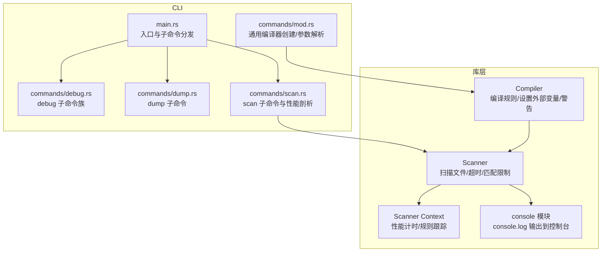
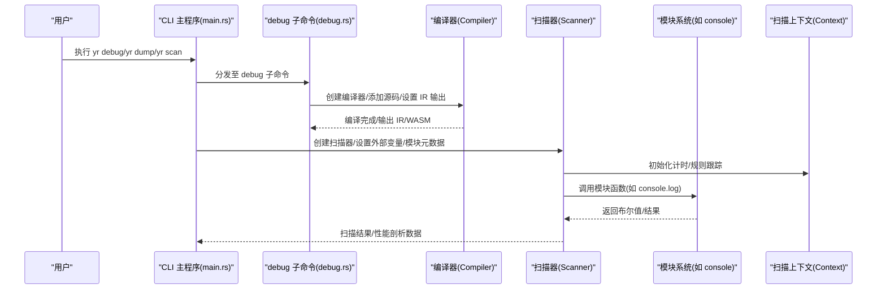
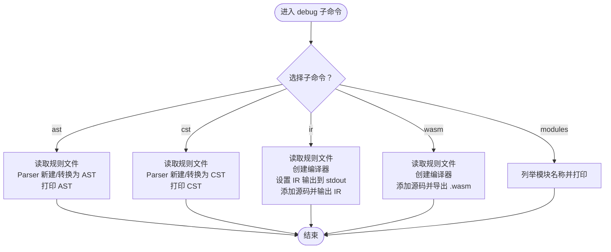
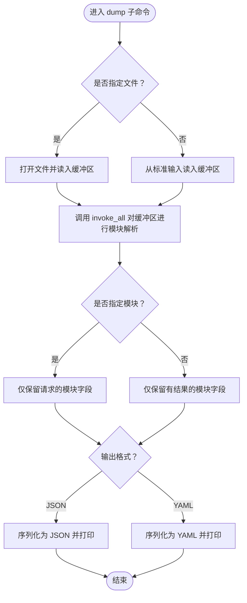
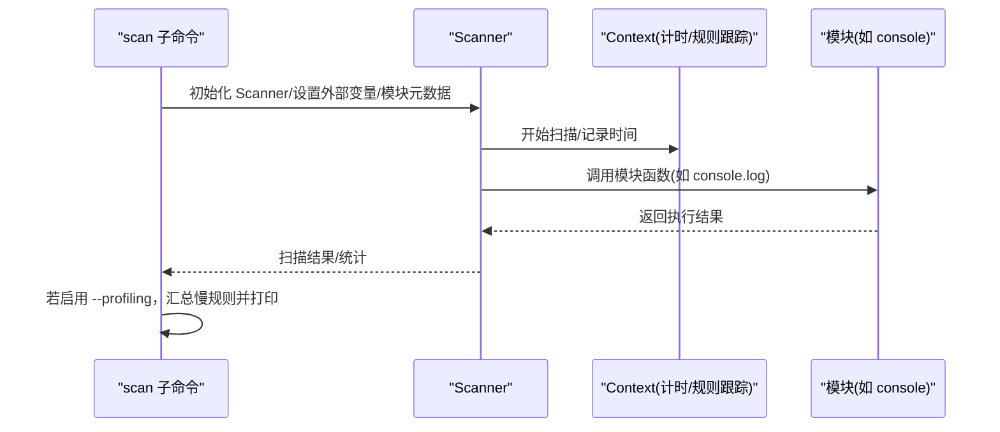
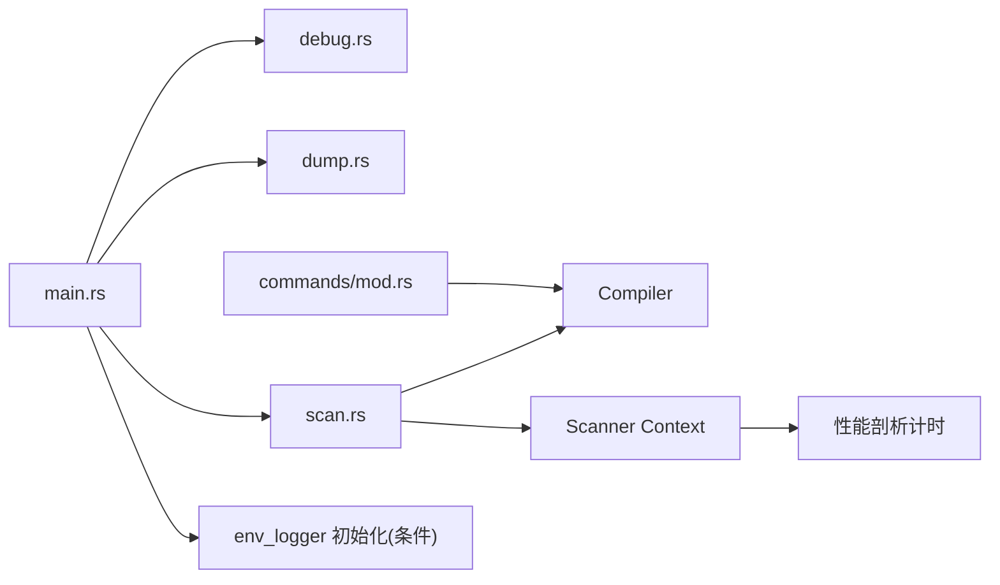

# 调试工具

<cite>
**本文引用的文件**
- [cli/src/main.rs](file://cli/src/main.rs)
- [cli/src/commands/mod.rs](file://cli/src/commands/mod.rs)
- [cli/src/commands/debug.rs](file://cli/src/commands/debug.rs)
- [cli/src/commands/dump.rs](file://cli/src/commands/dump.rs)
- [cli/src/commands/scan.rs](file://cli/src/commands/scan.rs)
- [Cargo.toml](file://Cargo.toml)
- [site/content/blog/rules-profiling/index.md](file://site/content/blog/rules-profiling/index.md)
- [lib/src/modules/console.rs](file://lib/src/modules/console.rs)
- [lib/src/scanner/context.rs](file://lib/src/scanner/context.rs)
</cite>

## 目录
1. [简介](#简介)
2. [项目结构](#项目结构)
3. [核心组件](#核心组件)
4. [架构总览](#架构总览)
5. [详细组件分析](#详细组件分析)
6. [依赖分析](#依赖分析)
7. [性能考量](#性能考量)
8. [故障排查指南](#故障排查指南)
9. [结论](#结论)
10. [附录](#附录)

## 简介
本指南面向高级用户与开发者，系统讲解 YARA-X 的调试能力与工具链，涵盖以下主题：
- 使用 debug 子命令查看语法树（CST/AST）、中间表示（IR）以及导出 WebAssembly（WASM）模块
- 使用 dump 命令分析二进制文件在各模块下的解析结果与输出格式
- 规则编译与扫描过程的调试技巧：外部变量注入、模块数据传递、禁用模块、警告控制等
- 如何启用调试模式以获取更详尽的执行信息
- 如何利用内置的规则性能剖析功能定位扫描过程中的性能瓶颈
- 日志配置与日志级别设置（基于环境变量）
- 实战案例与问题定位思路

## 项目结构
YARA-X 的调试相关能力主要集中在 CLI 层的命令实现中，并通过库层的编译器、扫描器与模块系统提供运行时支持。

图表来源
- [cli/src/main.rs:31-107](file://cli/src/main.rs#L31-L107)
- [cli/src/commands/mod.rs:149-213](file://cli/src/commands/mod.rs#L149-L213)
- [cli/src/commands/debug.rs:82-172](file://cli/src/commands/debug.rs#L82-L172)
- [cli/src/commands/dump.rs:38-162](file://cli/src/commands/dump.rs#L38-L162)
- [cli/src/commands/scan.rs:251-562](file://cli/src/commands/scan.rs#L251-L562)
- [lib/src/modules/console.rs:10-84](file://lib/src/modules/console.rs#L10-L84)
- [lib/src/scanner/context.rs:155-616](file://lib/src/scanner/context.rs#L155-L616)

章节来源
- [cli/src/main.rs:31-107](file://cli/src/main.rs#L31-L107)
- [cli/src/commands/mod.rs:149-213](file://cli/src/commands/mod.rs#L149-L213)

## 核心组件
- debug 子命令族
  - ast：打印 YARA 源码的抽象语法树（AST）
  - cst：打印具体语法树（CST）
  - ir：打印中间表示（IR），可配合外部变量定义
  - wasm：将规则编译为 WASM 文件
  - modules：列出可用模块
- dump 子命令
  - 针对二进制文件，调用各模块解析并输出 JSON 或 YAML 结果，支持按模块筛选与颜色开关
- scan 子命令
  - 支持多线程、递归扫描、超时控制、最大匹配数限制、模块元数据注入
  - 内置规则性能剖析（需构建时启用 features=rules-profiling）

章节来源
- [cli/src/commands/debug.rs:20-91](file://cli/src/commands/debug.rs#L20-L91)
- [cli/src/commands/dump.rs:38-62](file://cli/src/commands/dump.rs#L38-L62)
- [cli/src/commands/scan.rs:44-204](file://cli/src/commands/scan.rs#L44-L204)

## 架构总览
下面的序列图展示了从 CLI 到编译器/扫描器再到模块系统的调用链路，以及性能剖析与日志的关键节点。

图表来源
- [cli/src/main.rs:84-95](file://cli/src/main.rs#L84-L95)
- [cli/src/commands/debug.rs:130-164](file://cli/src/commands/debug.rs#L130-L164)
- [cli/src/commands/scan.rs:380-412](file://cli/src/commands/scan.rs#L380-L412)
- [lib/src/modules/console.rs:10-84](file://lib/src/modules/console.rs#L10-L84)
- [lib/src/scanner/context.rs:155-616](file://lib/src/scanner/context.rs#L155-L616)

## 详细组件分析

### debug 子命令族
- ast：读取规则文件，解析为 CST 后转换为 AST 并打印
- cst：读取规则文件，直接解析为 CST 并打印
- ir：读取规则文件，创建编译器，设置 IR 输出到标准输出，添加源码后即输出 IR
- wasm：读取规则文件，创建编译器，添加源码后导出为 .wasm 文件
- modules：列出所有可用模块名称

图表来源
- [cli/src/commands/debug.rs:104-172](file://cli/src/commands/debug.rs#L104-L172)

章节来源
- [cli/src/commands/debug.rs:104-172](file://cli/src/commands/debug.rs#L104-L172)

### dump 子命令
- 接收目标文件或标准输入，调用模块系统对同一输入进行全量解析
- 可按模块筛选（PE/LNK/MACH-O/ELF/Dotnet/Crx），也可仅输出有“有意义结果”的模块
- 输出格式支持 JSON 与 YAML；当标准输出为终端且未显式关闭颜色时启用彩色输出

图表来源
- [cli/src/commands/dump.rs:74-162](file://cli/src/commands/dump.rs#L74-L162)

章节来源
- [cli/src/commands/dump.rs:74-162](file://cli/src/commands/dump.rs#L74-L162)

### scan 子命令与性能剖析
- 支持多线程、递归扫描、超时控制、最大匹配数限制、模块元数据注入
- 可通过 --profiling 启用规则级性能剖析（需构建时启用 features=rules-profiling）
- 扫描过程中可将模块日志输出到控制台（console.log）

图表来源
- [cli/src/commands/scan.rs:251-562](file://cli/src/commands/scan.rs#L251-L562)
- [lib/src/scanner/context.rs:155-616](file://lib/src/scanner/context.rs#L155-L616)
- [lib/src/modules/console.rs:10-84](file://lib/src/modules/console.rs#L10-L84)

章节来源
- [cli/src/commands/scan.rs:251-562](file://cli/src/commands/scan.rs#L251-L562)
- [site/content/blog/rules-profiling/index.md:31-91](file://site/content/blog/rules-profiling/index.md#L31-L91)

## 依赖分析
- CLI 入口与子命令分发
  - main.rs 中根据 feature 标记决定是否启用 debug 子命令，并统一处理错误与退出码
- 通用编译器创建
  - commands/mod.rs 提供 create_compiler，集中设置宽松正则、颜色化错误、忽略模块、包含目录、禁用警告、全局变量等
- 性能剖析与日志
  - 构建时通过 Cargo.toml 的 features 控制是否启用 rules-profiling
  - 运行时通过环境变量初始化日志（feature=logging）

图表来源
- [cli/src/main.rs:38-39](file://cli/src/main.rs#L38-L39)
- [cli/src/commands/mod.rs:149-213](file://cli/src/commands/mod.rs#L149-L213)
- [Cargo.toml:117-135](file://Cargo.toml#L117-L135)

章节来源
- [cli/src/main.rs:38-39](file://cli/src/main.rs#L38-L39)
- [cli/src/commands/mod.rs:149-213](file://cli/src/commands/mod.rs#L149-L213)
- [Cargo.toml:117-135](file://Cargo.toml#L117-L135)

## 性能考量
- 规则性能剖析
  - 需在构建时启用 features=rules-profiling，运行时使用 --profiling 查看慢规则列表
  - 输出分别统计“模式匹配时间”和“条件评估时间”，便于定位瓶颈来源
- 扫描器参数优化
  - 多线程：--threads
  - 递归深度：--recursive
  - 跳过超大文件：--skip-larger
  - 最大匹配数限制：--max-matches-per-pattern
  - 超时控制：--timeout
- 模块日志
  - 可通过 console.log 在扫描过程中输出中间状态，辅助定位规则行为异常

章节来源
- [site/content/blog/rules-profiling/index.md:31-91](file://site/content/blog/rules-profiling/index.md#L31-L91)
- [cli/src/commands/scan.rs:141-203](file://cli/src/commands/scan.rs#L141-L203)
- [lib/src/modules/console.rs:10-84](file://lib/src/modules/console.rs#L10-L84)

## 故障排查指南
- 编译阶段
  - 使用 debug ir/wasm 导出 IR/WASM，核对编译器生成的中间产物是否符合预期
  - 使用 --define 注入外部变量，确保变量类型与 JSON 解析一致
  - 使用 --disable-warnings 控制告警，必要时临时关闭特定告警以聚焦问题
- 扫描阶段
  - 使用 --disable-console-logs 关闭控制台日志，避免干扰
  - 使用 --timeout 设置合理上限，防止长时间卡顿
  - 使用 --profiling 定位慢规则，结合“模式匹配时间/条件评估时间”判断优化方向
- 模块解析
  - 使用 dump 子命令针对二进制文件查看模块输出，确认模块是否正确识别目标文件类型
  - 通过 --output-format=json/yaml 与 --no-colors 控制输出格式与可读性

章节来源
- [cli/src/commands/debug.rs:130-164](file://cli/src/commands/debug.rs#L130-L164)
- [cli/src/commands/scan.rs:251-562](file://cli/src/commands/scan.rs#L251-L562)
- [cli/src/commands/dump.rs:74-162](file://cli/src/commands/dump.rs#L74-L162)

## 结论
YARA-X 的调试工具链覆盖了从规则编译到扫描执行的全流程：通过 debug 子命令可以深入理解规则的 AST/CST/IR 与 WASM 产物；通过 dump 子命令可以快速验证模块对目标文件的解析结果；通过 scan 子命令的性能剖析与日志机制，能够高效定位规则执行中的性能瓶颈与行为异常。建议在开发与优化规则时，结合这些工具形成“编译—解析—扫描—剖析”的闭环流程。

## 附录

### 日志配置与日志级别设置
- 运行时日志初始化
  - 当构建启用 feature=logging 时，CLI 启动时会初始化 env_logger
  - 可通过 RUST_LOG 环境变量设置日志级别与过滤规则（例如：RUST_LOG=trace）
- 控制台日志
  - 扫描过程中可通过 console.log 将消息输出到控制台，便于调试规则内部逻辑

章节来源
- [cli/src/main.rs:38-39](file://cli/src/main.rs#L38-L39)
- [Cargo.toml:117-135](file://Cargo.toml#L117-L135)
- [lib/src/modules/console.rs:10-84](file://lib/src/modules/console.rs#L10-L84)

### 实战案例与问题定位示例
- 案例一：规则编译失败或行为异常
  - 步骤：使用 debug ast/cst/ir 获取 AST/CST/IR；检查 IR 是否包含预期的模块调用与条件表达式
  - 辅助：使用 --define 注入外部变量，验证变量作用域与类型
- 案例二：扫描速度慢
  - 步骤：使用 --profiling 收集慢规则；优先优化“条件评估时间”高的规则；若模式匹配耗时高，考虑简化正则或引入更高效的模式
  - 辅助：调整 --threads/--max-matches-per-pattern/--skip-larger 等参数
- 案例三：模块解析结果不符合预期
  - 步骤：使用 dump 子命令查看模块输出；按模块筛选（如 PE/Mach-O/ELF）；对比不同输出格式（JSON/YAML）

章节来源
- [cli/src/commands/debug.rs:104-172](file://cli/src/commands/debug.rs#L104-L172)
- [cli/src/commands/dump.rs:74-162](file://cli/src/commands/dump.rs#L74-L162)
- [cli/src/commands/scan.rs:251-562](file://cli/src/commands/scan.rs#L251-L562)
- [site/content/blog/rules-profiling/index.md:31-91](file://site/content/blog/rules-profiling/index.md#L31-L91)