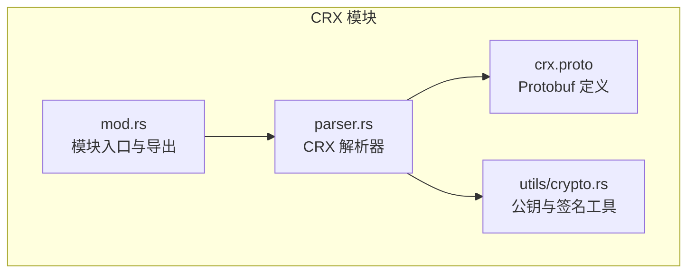
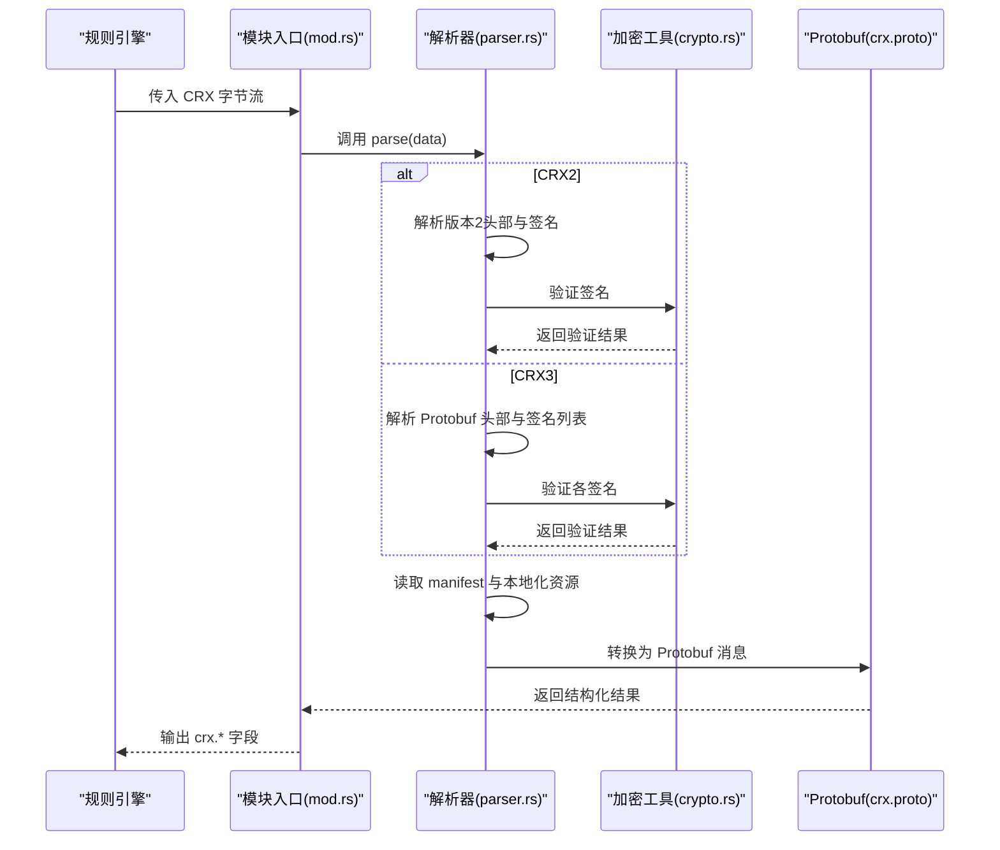
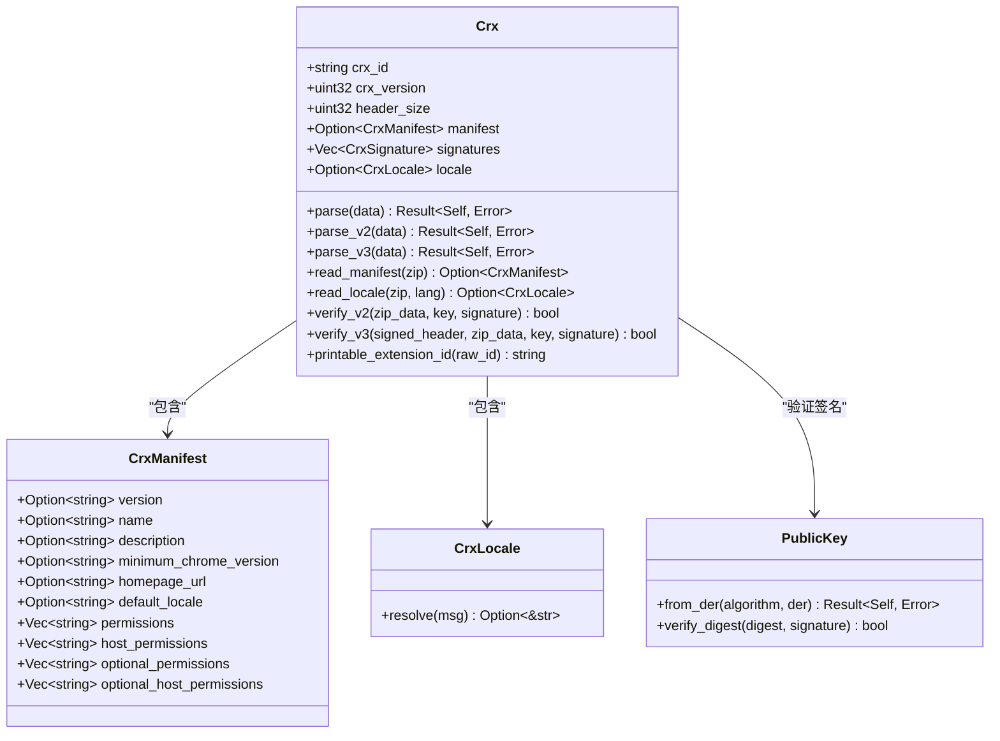
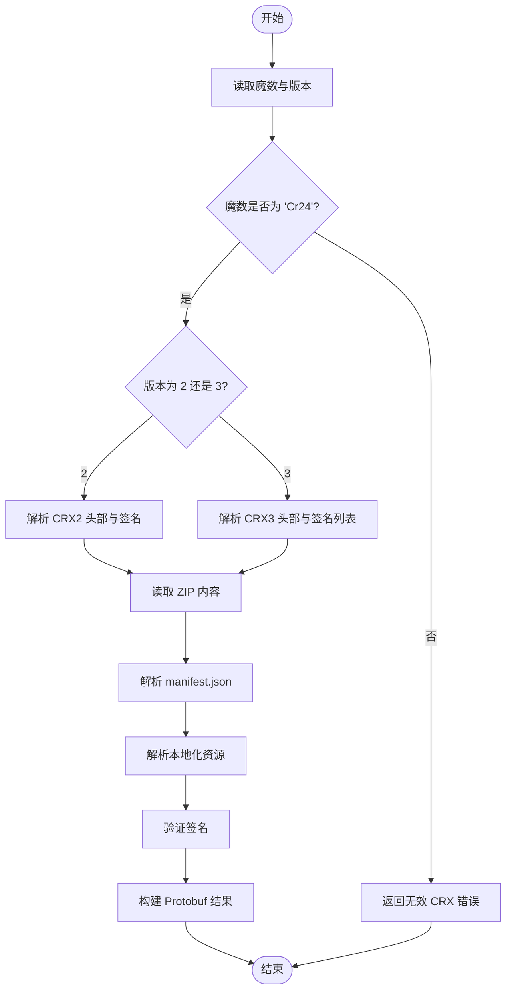
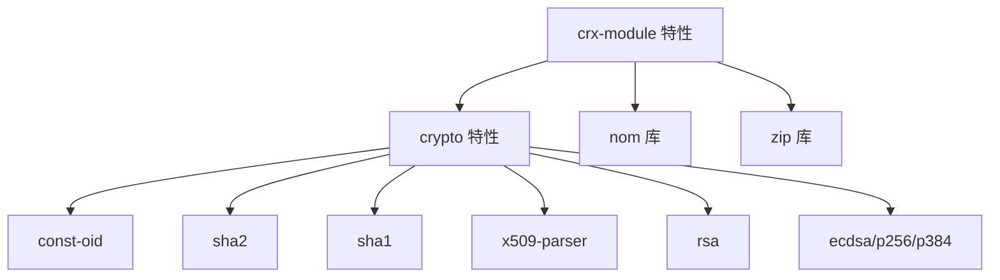

# CRX 模块

<cite>
**本文引用的文件**
- [mod.rs](file://yara-x/lib/src/modules/crx/mod.rs)
- [parser.rs](file://yara-x/lib/src/modules/crx/parser.rs)
- [crx.proto](file://yara-x/lib/src/modules/protos/crx.proto)
- [crx.md](file://yara-x/site/content/docs/modules/crx.md)
- [Cargo.toml](file://yara-x/lib/Cargo.toml)
- [crx_parser.rs](file://yara-x/lib/fuzz/fuzz_targets/crx_parser.rs)
- [crypto.rs](file://yara-x/lib/src/modules/utils/crypto.rs)
- [3d1c2b1777fb5d5f4e4707ab3a1b64131c26f8dc1c30048dce7a1944b4098f3e.out](file://yara-x/lib/src/modules/crx/tests/testdata/3d1c2b1777fb5d5f4e4707ab3a1b64131c26f8dc1c30048dce7a1944b4098f3e.out)
</cite>

## 目录
1. [简介](#简介)
2. [项目结构](#项目结构)
3. [核心组件](#核心组件)
4. [架构总览](#架构总览)
5. [详细组件分析](#详细组件分析)
6. [依赖关系分析](#依赖关系分析)
7. [性能考量](#性能考量)
8. [故障排查指南](#故障排查指南)
9. [结论](#结论)
10. [附录](#附录)

## 简介
CRX 模块用于解析 Chrome 扩展包（CRX）文件，提取并暴露扩展元数据与签名信息，使用户能够在规则中基于这些字段进行匹配与分析。CRX 文件本质上是带有特殊头部与数字签名的 ZIP 压缩包，包含清单文件（manifest.json）、本地化资源以及多种签名证明。该模块支持 CRX2 与 CRX3 两种格式，并能解析扩展 ID、版本号、最小支持版本、权限声明、签名验证状态等关键字段。

## 项目结构
CRX 模块位于库工程的模块系统中，通过协议缓冲区消息定义对外暴露的数据结构，并由 Rust 实现解析逻辑。模块入口负责将输入字节流解析为结构化对象，随后转换为 Protobuf 消息供规则引擎使用。

图表来源
- [mod.rs:12-22](file://yara-x/lib/src/modules/crx/mod.rs#L12-L22)
- [parser.rs:42-74](file://yara-x/lib/src/modules/crx/parser.rs#L42-L74)
- [crx.proto:13-35](file://yara-x/lib/src/modules/protos/crx.proto#L13-L35)
- [crypto.rs:23-29](file://yara-x/lib/src/modules/utils/crypto.rs#L23-L29)

章节来源
- [mod.rs:1-23](file://yara-x/lib/src/modules/crx/mod.rs#L1-L23)
- [parser.rs:42-74](file://yara-x/lib/src/modules/crx/parser.rs#L42-L74)
- [crx.proto:1-73](file://yara-x/lib/src/modules/protos/crx.proto#L1-L73)
- [Cargo.toml:113-118](file://yara-x/lib/Cargo.toml#L113-L118)

## 核心组件
- 模块入口与导出
  - 模块主函数接收二进制输入，尝试解析为 CRX 对象；失败时返回非 CRX 的默认对象，确保规则可稳定运行。
  - 参考路径：[mod.rs:12-22](file://yara-x/lib/src/modules/crx/mod.rs#L12-L22)

- CRX 解析器
  - 支持 CRX2 与 CRX3 两种格式，解析头部、签名与 ZIP 内容。
  - 提取扩展 ID、版本、清单、权限、本地化消息等。
  - 验证签名，记录签名算法与验证结果。
  - 参考路径：[parser.rs:109-236](file://yara-x/lib/src/modules/crx/parser.rs#L109-L236)

- Protobuf 数据模型
  - 定义模块对外暴露的字段集合，包括布尔标志、整数、字符串、字符串数组与签名数组。
  - 参考路径：[crx.proto:13-35](file://yara-x/lib/src/modules/protos/crx.proto#L13-L35)

- 加密与签名工具
  - 提供公钥解析与摘要验证能力，支持 RSA 与 ECDSA 等算法族。
  - 参考路径：[crypto.rs:23-29](file://yara-x/lib/src/modules/utils/crypto.rs#L23-L29)

章节来源
- [mod.rs:12-22](file://yara-x/lib/src/modules/crx/mod.rs#L12-L22)
- [parser.rs:109-236](file://yara-x/lib/src/modules/crx/parser.rs#L109-L236)
- [crx.proto:13-35](file://yara-x/lib/src/modules/protos/crx.proto#L13-L35)
- [crypto.rs:23-29](file://yara-x/lib/src/modules/utils/crypto.rs#L23-L29)

## 架构总览
CRX 模块的处理流程从输入字节开始，先进行格式识别与版本判断，再分别解析 CRX2 或 CRX3 的头部与签名，随后从 ZIP 中提取清单与本地化资源，最后生成 Protobuf 结果对象供规则引擎消费。

图表来源
- [mod.rs:12-22](file://yara-x/lib/src/modules/crx/mod.rs#L12-L22)
- [parser.rs:111-236](file://yara-x/lib/src/modules/crx/parser.rs#L111-L236)
- [crx.proto:13-35](file://yara-x/lib/src/modules/protos/crx.proto#L13-L35)
- [crypto.rs:134-151](file://yara-x/lib/src/modules/utils/crypto.rs#L134-L151)

## 详细组件分析

### CRX 解析器类图
解析器负责解析 CRX 文件、提取元数据与签名，并将结果映射到 Protobuf 消息。

图表来源
- [parser.rs:67-107](file://yara-x/lib/src/modules/crx/parser.rs#L67-L107)
- [parser.rs:76-92](file://yara-x/lib/src/modules/crx/parser.rs#L76-L92)
- [parser.rs:99-107](file://yara-x/lib/src/modules/crx/parser.rs#L99-L107)
- [parser.rs:238-263](file://yara-x/lib/src/modules/crx/parser.rs#L238-L263)
- [crypto.rs:23-29](file://yara-x/lib/src/modules/utils/crypto.rs#L23-L29)

章节来源
- [parser.rs:67-107](file://yara-x/lib/src/modules/crx/parser.rs#L67-L107)
- [parser.rs:76-92](file://yara-x/lib/src/modules/crx/parser.rs#L76-L92)
- [parser.rs:99-107](file://yara-x/lib/src/modules/crx/parser.rs#L99-L107)
- [parser.rs:238-263](file://yara-x/lib/src/modules/crx/parser.rs#L238-L263)
- [crypto.rs:23-29](file://yara-x/lib/src/modules/utils/crypto.rs#L23-L29)

### CRX 版本解析流程图
展示 CRX2 与 CRX3 的解析差异与共同步骤。

图表来源
- [parser.rs:111-123](file://yara-x/lib/src/modules/crx/parser.rs#L111-L123)
- [parser.rs:125-173](file://yara-x/lib/src/modules/crx/parser.rs#L125-L173)
- [parser.rs:175-236](file://yara-x/lib/src/modules/crx/parser.rs#L175-L236)

章节来源
- [parser.rs:111-123](file://yara-x/lib/src/modules/crx/parser.rs#L111-L123)
- [parser.rs:125-173](file://yara-x/lib/src/modules/crx/parser.rs#L125-L173)
- [parser.rs:175-236](file://yara-x/lib/src/modules/crx/parser.rs#L175-L236)

### 规则使用示例与字段说明
- 基础字段
  - is_crx：布尔值，指示输入是否为 CRX 文件
  - crx_version：CRX 版本号（2 或 3）
  - header_size：头部大小（字节）
  - id：扩展 ID（16 字节二进制经特定编码得到的字符串）
  - version：扩展版本号（来自清单）
  - name/description/raw_name/raw_description：扩展名称与描述（含本地化解析）
  - minimum_chrome_version：最小支持 Chrome 版本
  - homepage_url：主页链接
  - permissions/host_permissions/optional_permissions/optional_host_permissions：权限与主机权限列表
  - signatures：签名数组，包含 key（公钥 DER 编码）与 verified（验证结果）

- 示例规则（来自文档）
  - 匹配所有 CRX 文件
  - 匹配 CRX2 文件
  - 基于名称匹配特定扩展
  - 检查任一签名已验证

章节来源
- [crx.md:28-92](file://yara-x/site/content/docs/modules/crx.md#L28-L92)
- [crx.proto:13-35](file://yara-x/lib/src/modules/protos/crx.proto#L13-L35)

### 在规则中进行扩展分析的实际示例
- 识别恶意扩展
  - 使用权限组合模式：如同时出现高风险权限与可疑主机权限，结合版本与最小支持版本字段进行综合判断。
  - 参考字段：permissions、host_permissions、minimum_chrome_version、version
  - 参考路径：[crx.proto:25-28](file://yara-x/lib/src/modules/protos/crx.proto#L25-L28)

- 检查权限滥用
  - 检测扩展请求超出其功能所需的权限范围，例如仅需网络访问却申请敏感权限。
  - 参考字段：permissions、host_permissions、optional_permissions、optional_host_permissions
  - 参考路径：[crx.proto:25-28](file://yara-x/lib/src/modules/protos/crx.proto#L25-L28)

- 分析扩展行为
  - 依据扩展 ID 与版本号进行关联分析，结合签名验证状态评估可信度。
  - 参考字段：id、version、signatures
  - 参考路径：[crx.proto:14-17](file://yara-x/lib/src/modules/protos/crx.proto#L14-L17)

- 本地化文本解析
  - 利用本地化消息键（如 __MSG_*__）解析真实显示文本，辅助人工审计。
  - 参考实现：[parser.rs:102-107](file://yara-x/lib/src/modules/crx/parser.rs#L102-L107)

- 示例输出参考
  - 测试输出展示了字段填充情况，可用于编写规则时的字段对照。
  - 参考路径：[3d1c2b1777fb5d5f4e4707ab3a1b64131c26f8dc1c30048dce7a1944b4098f3e.out:1-20](file://yara-x/lib/src/modules/crx/tests/testdata/3d1c2b1777fb5d5f4e4707ab3a1b64131c26f8dc1c30048dce7a1944b4098f3e.out#L1-L20)

## 依赖关系分析
CRX 模块通过特性开关启用，依赖加密与压缩相关库，解析 CRX 文件并生成 Protobuf 消息供规则引擎使用。

图表来源
- [Cargo.toml:113-118](file://yara-x/lib/Cargo.toml#L113-L118)
- [Cargo.toml:88-102](file://yara-x/lib/Cargo.toml#L88-L102)

章节来源
- [Cargo.toml:113-118](file://yara-x/lib/Cargo.toml#L113-L118)
- [Cargo.toml:88-102](file://yara-x/lib/Cargo.toml#L88-L102)

## 性能考量
- 解析复杂度
  - CRX2：线性扫描头部与签名，ZIP 读取与 JSON 解析为 O(n) 级别。
  - CRX3：解析 Protobuf 头部与多签名列表，整体仍为 O(n)。
- 计算开销
  - 公钥 DER 解析与摘要计算（SHA-1/SHA-256）为 CPU 密集型操作，建议在批量扫描时注意并发控制。
- I/O 行为
  - ZIP 解压与多次文件读取可能带来磁盘压力，建议对大样本采用流式处理策略。
- 建议
  - 合理设置规则匹配条件，避免不必要的全量字段访问。
  - 对重复样本进行去重与缓存，减少重复解析。

## 故障排查指南
- 输入非 CRX 文件
  - 现象：is_crx 为 false，其余字段为空或默认值。
  - 排查：确认输入是否为 Cr24 魔数，或是否为 ZIP 文件但缺少 manifest.json。
  - 参考实现：[mod.rs:16-21](file://yara-x/lib/src/modules/crx/mod.rs#L16-L21)

- 解析错误
  - 现象：抛出解析错误或返回无效 CRX。
  - 排查：检查 ZIP 是否损坏、manifest.json 是否有效、签名数据是否完整。
  - 参考实现：[parser.rs:31-40](file://yara-x/lib/src/modules/crx/parser.rs#L31-L40)

- 签名验证失败
  - 现象：signatures 数组中 verified 为 false。
  - 排查：确认公钥 DER 格式正确、算法标识匹配、签名数据未被篡改。
  - 参考实现：[parser.rs:238-263](file://yara-x/lib/src/modules/crx/parser.rs#L238-L263)，[crypto.rs:134-151](file://yara-x/lib/src/modules/utils/crypto.rs#L134-L151)

- 本地化文本未解析
  - 现象：name/description 显示原始键而非实际文本。
  - 排查：确认 _locales/<lang>/messages.json 存在且格式正确，默认语言 fallback 为 "en"。
  - 参考实现：[parser.rs:276-284](file://yara-x/lib/src/modules/crx/parser.rs#L276-L284)

章节来源
- [mod.rs:16-21](file://yara-x/lib/src/modules/crx/mod.rs#L16-L21)
- [parser.rs:31-40](file://yara-x/lib/src/modules/crx/parser.rs#L31-L40)
- [parser.rs:238-263](file://yara-x/lib/src/modules/crx/parser.rs#L238-L263)
- [crypto.rs:134-151](file://yara-x/lib/src/modules/utils/crypto.rs#L134-L151)
- [parser.rs:276-284](file://yara-x/lib/src/modules/crx/parser.rs#L276-L284)

## 结论
CRX 模块为浏览器扩展生态的安全分析提供了坚实基础：它能够可靠地解析 CRX 文件、提取关键元数据与签名信息，并以统一的 Protobuf 结构暴露给规则引擎。通过权限、版本、签名验证等字段，用户可以快速识别潜在风险扩展、检测权限滥用与异常行为，从而提升扩展分发与运行环境的整体安全性。

## 附录
- 文档与示例
  - 模块文档与规则示例：[crx.md:28-92](file://yara-x/site/content/docs/modules/crx.md#L28-L92)
- 测试与模糊测试
  - 测试数据输出示例：[3d1c2b1777fb5d5f4e4707ab3a1b64131c26f8dc1c30048dce7a1944b4098f3e.out:1-20](file://yara-x/lib/src/modules/crx/tests/testdata/3d1c2b1777fb5d5f4e4707ab3a1b64131c26f8dc1c30048dce7a1944b4098f3e.out#L1-L20)
  - 模糊测试目标：[crx_parser.rs:4-6](file://yara-x/lib/fuzz/fuzz_targets/crx_parser.rs#L4-L6)