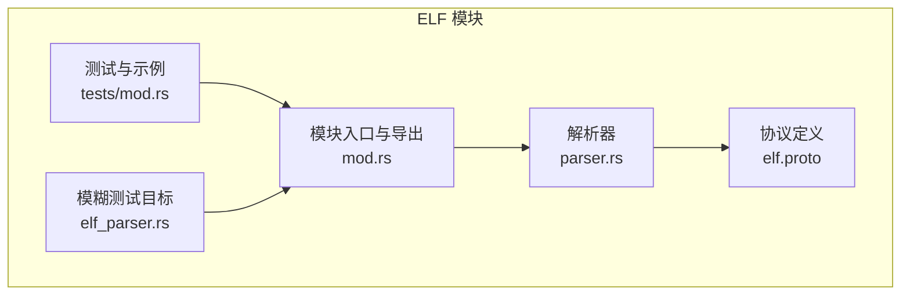
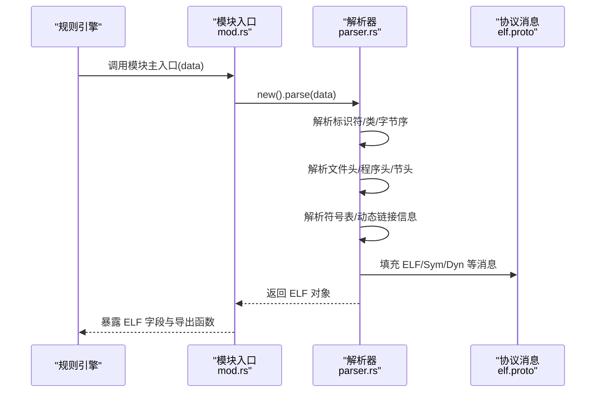
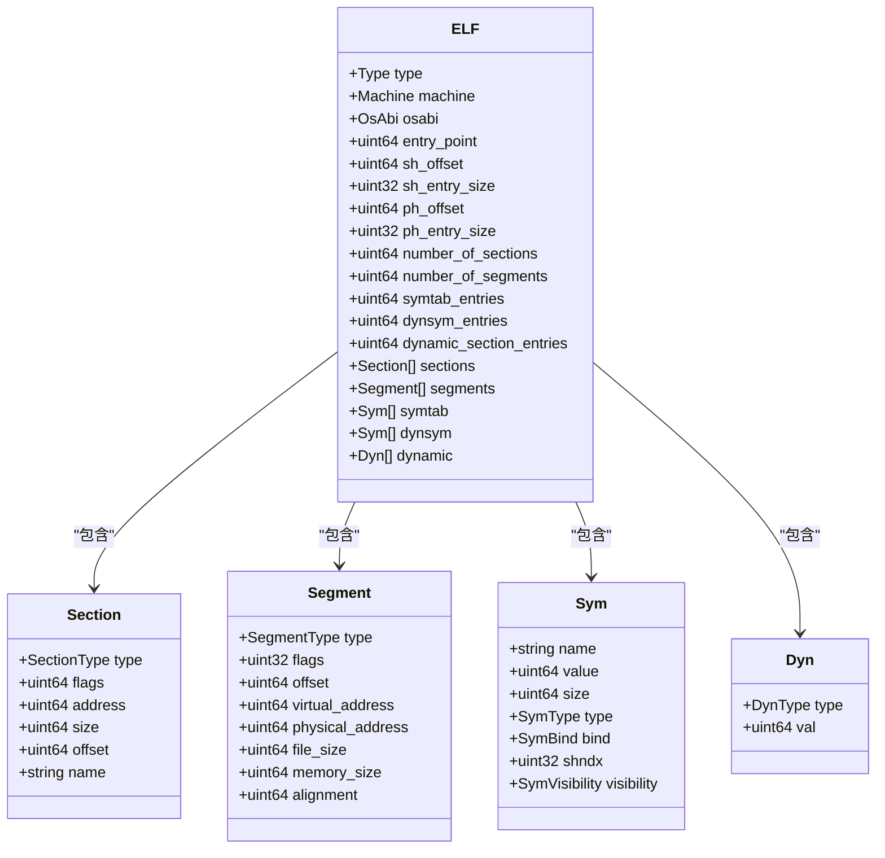
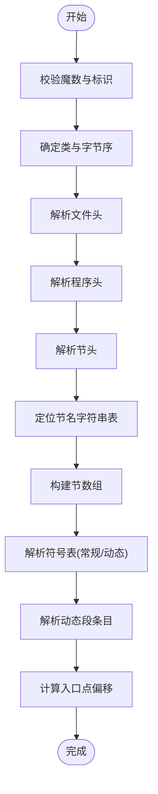
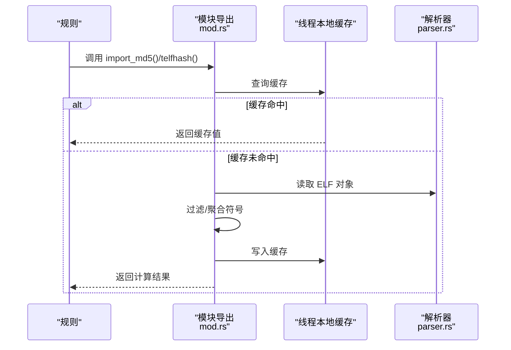
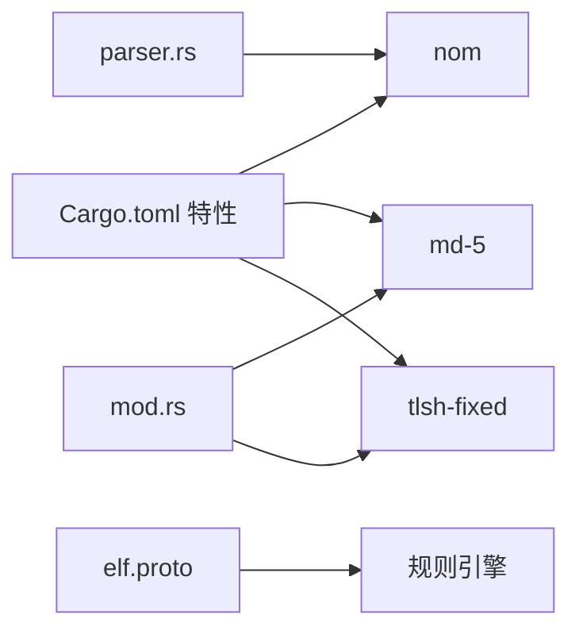

# ELF 模块

<cite>
**本文引用的文件列表**
- [mod.rs](file://yara-x/lib/src/modules/elf/mod.rs)
- [parser.rs](file://yara-x/lib/src/modules/elf/parser.rs)
- [elf.proto](file://yara-x/lib/src/modules/protos/elf.proto)
- [elf.md](file://yara-x/site/content/docs/modules/elf.md)
- [Cargo.toml](file://yara-x/lib/Cargo.toml)
- [elf_parser.rs](file://yara-x/lib/fuzz/fuzz_targets/elf_parser.rs)
- [mod.rs](file://yara-x/lib/src/modules/elf/tests/mod.rs)
</cite>

## 目录
1. [简介](#简介)
2. [项目结构](#项目结构)
3. [核心组件](#核心组件)
4. [架构总览](#架构总览)
5. [详细组件分析](#详细组件分析)
6. [依赖关系分析](#依赖关系分析)
7. [性能考量](#性能考量)
8. [故障排查指南](#故障排查指南)
9. [结论](#结论)
10. [附录](#附录)

## 简介
本文件系统性地介绍 yara-x 中的 ELF 模块，覆盖其对 Linux 可执行文件格式的解析能力，包括文件头、程序头、节头、符号表、动态链接信息等结构。文档同时说明模块提供的字段与函数（如架构类型、入口点、程序段、节段属性、动态链接信息、调试信息、导入 MD5、telfhash），并给出在规则中使用该模块进行二进制分析的实际示例，涵盖识别共享库、分析程序结构、检测异常配置等场景。最后解释该模块在恶意软件分析与系统安全中的应用价值。

## 项目结构
ELF 模块位于 yara-x 的 lib 子工程中，采用“协议定义 + 解析器 + 模块导出”的分层设计：
- 协议定义：通过 protobuf 定义 ELF 结构体与枚举，供规则引擎访问。
- 解析器：基于 nom 库实现对 ELF 文件的逐字段解析，生成协议消息对象。
- 模块导出：将解析结果暴露为规则可调用的模块输出，并提供辅助函数（如 import_md5、telfhash）。

图表来源
- [elf.proto:1-246](file://yara-x/lib/src/modules/protos/elf.proto#L1-L246)
- [parser.rs:1-698](file://yara-x/lib/src/modules/elf/parser.rs#L1-L698)
- [mod.rs:1-177](file://yara-x/lib/src/modules/elf/mod.rs#L1-L177)
- [elf_parser.rs:1-7](file://yara-x/lib/fuzz/fuzz_targets/elf_parser.rs#L1-L7)
- [mod.rs:1-42](file://yara-x/lib/src/modules/elf/tests/mod.rs#L1-L42)

章节来源
- [elf.proto:1-246](file://yara-x/lib/src/modules/protos/elf.proto#L1-L246)
- [parser.rs:1-698](file://yara-x/lib/src/modules/elf/parser.rs#L1-L698)
- [mod.rs:1-177](file://yara-x/lib/src/modules/elf/mod.rs#L1-L177)
- [elf_parser.rs:1-7](file://yara-x/lib/fuzz/fuzz_targets/elf_parser.rs#L1-L7)
- [mod.rs:1-42](file://yara-x/lib/src/modules/elf/tests/mod.rs#L1-L42)

## 核心组件
- 协议消息与枚举
  - 消息：ELF、Section、Segment、Sym、Dyn
  - 枚举：Type、Machine、OsAbi、SectionType、SegmentType、SegmentFlags、SymType、SymBind、SymVisibility、DynType
- 解析器
  - 支持 32/64 位 ELF，自动识别字节序
  - 解析文件头、程序头、节头、符号表、动态链接信息
  - 计算入口点偏移（根据类型与段/节范围映射）
- 模块导出
  - 主入口：将输入字节流解析为 ELF 对象
  - 辅助函数：import_md5、telfhash（带线程本地缓存）

章节来源
- [elf.proto:13-35](file://yara-x/lib/src/modules/protos/elf.proto#L13-L35)
- [parser.rs:24-202](file://yara-x/lib/src/modules/elf/parser.rs#L24-L202)
- [mod.rs:29-38](file://yara-x/lib/src/modules/elf/mod.rs#L29-L38)

## 架构总览
ELF 模块的运行时流程如下：
- 规则触发扫描时，模块主入口接收原始字节
- 解析器按 ELF 规范解析各头部与表项，填充协议消息
- 模块导出函数从已解析的 ELF 对象中提取特定信息（如导入符号、telfhash）

图表来源
- [mod.rs:29-38](file://yara-x/lib/src/modules/elf/mod.rs#L29-L38)
- [parser.rs:42-202](file://yara-x/lib/src/modules/elf/parser.rs#L42-L202)
- [elf.proto:13-35](file://yara-x/lib/src/modules/protos/elf.proto#L13-L35)

## 详细组件分析

### 协议与数据模型
ELF 模块通过 protobuf 定义了完整的数据模型，便于规则引擎直接访问字段与枚举值。

图表来源
- [elf.proto:13-193](file://yara-x/lib/src/modules/protos/elf.proto#L13-L193)

章节来源
- [elf.proto:13-193](file://yara-x/lib/src/modules/protos/elf.proto#L13-L193)

### 解析器实现要点
- 类型与字节序
  - 通过 ELF 标识与类字段判断 32/64 位与小/大端
  - 后续解析统一使用对应宽度的字段读取器
- 头部与表解析
  - 文件头：记录类型、机器、入口点、段/节表位置与大小
  - 程序头：加载段、动态段等，动态段用于提取动态链接信息
  - 节头：节名字符串表索引、节类型、标志、地址/大小/偏移等
- 符号表
  - 支持常规符号表与动态符号表，解析符号名称、类型、绑定、可见性等
- 动态链接信息
  - 遍历动态段条目，提取标签与值，形成 Dyn 列表
- 入口点计算
  - 根据文件类型与段/节地址范围，将相对虚拟地址转换为文件偏移

图表来源
- [parser.rs:42-202](file://yara-x/lib/src/modules/elf/parser.rs#L42-L202)

章节来源
- [parser.rs:24-202](file://yara-x/lib/src/modules/elf/parser.rs#L24-L202)

### 模块导出函数
- import_md5
  - 优先使用动态符号表；否则回退到常规符号表
  - 过滤无效条目，按名称排序后计算 MD5
  - 使用线程本地缓存避免重复计算
- telfhash
  - 仅统计全局、默认可见性的函数符号，排除特定前缀/后缀与保留函数名
  - 使用 telfhash 算法生成指纹，同样具备缓存机制

图表来源
- [mod.rs:40-176](file://yara-x/lib/src/modules/elf/mod.rs#L40-L176)
- [parser.rs:182-201](file://yara-x/lib/src/modules/elf/parser.rs#L182-L201)

章节来源
- [mod.rs:40-176](file://yara-x/lib/src/modules/elf/mod.rs#L40-L176)

### 实际使用示例（规则）
以下示例来自官方文档与测试，展示如何在规则中使用 ELF 模块进行分析：
- 基础字段匹配
  - 识别单节 ELF、x86_64 架构等
- 节与段分析
  - 检测调试信息节、限制段大小、检测可写可执行段
- 符号与动态信息
  - 查找特定符号、检测动态链接项（如 DT_SYMTAB、DT_NEEDED）
- 导入与指纹
  - 通过 import_md5 与 telfhash 进行相似性聚类与溯源

章节来源
- [elf.md:26-448](file://yara-x/site/content/docs/modules/elf.md#L26-L448)
- [mod.rs:7-41](file://yara-x/lib/src/modules/elf/tests/mod.rs#L7-L41)

## 依赖关系分析
- 构建特性
  - elf-module 特性启用时，引入 nom、md-5、tlsh-fixed 等依赖
- 运行时依赖
  - 解析器依赖 nom 的组合子进行字节流解析
  - 导出函数依赖 md-5 与 tlsh-fixed 进行哈希计算
- 模块集成
  - 通过 protobuf 生成的消息类型与规则引擎交互
  - 默认特性中包含 elf-module，确保模块可用

图表来源
- [Cargo.toml:135-140](file://yara-x/lib/Cargo.toml#L135-L140)
- [parser.rs:4-14](file://yara-x/lib/src/modules/elf/parser.rs#L4-L14)
- [mod.rs:10-13](file://yara-x/lib/src/modules/elf/mod.rs#L10-L13)
- [elf.proto:1-11](file://yara-x/lib/src/modules/protos/elf.proto#L1-L11)

章节来源
- [Cargo.toml:135-140](file://yara-x/lib/Cargo.toml#L135-L140)

## 性能考量
- 解析复杂度
  - 解析器按顺序读取固定长度头部与定长表项，整体复杂度近似 O(n)，n 为段/节/符号数量
- 缓存策略
  - import_md5 与 telfhash 使用线程本地缓存，避免重复计算
- 输入健壮性
  - 当节表数量超过保留阈值时提前返回空结果，防止异常输入导致过度解析
- 模糊测试
  - 提供 fuzz 目标，验证解析器对任意输入的安全性与稳定性

章节来源
- [parser.rs:137-141](file://yara-x/lib/src/modules/elf/parser.rs#L137-L141)
- [mod.rs:23-27](file://yara-x/lib/src/modules/elf/mod.rs#L23-L27)
- [elf_parser.rs:1-7](file://yara-x/lib/fuzz/fuzz_targets/elf_parser.rs#L1-L7)

## 故障排查指南
- 常见问题
  - 非 ELF 文件：模块会返回空 ELF 对象，规则应显式检查字段存在性
  - 异常节表：当节表计数异常时，解析提前终止，建议检查文件完整性
  - 符号缺失：若动态符号表为空，import_md5 将回退到常规符号表
- 排查步骤
  - 在规则中先检查 ELF 对象是否有效
  - 使用基础字段（如 number_of_sections、machine）快速确认解析状态
  - 若 telfhash/import_md5 不稳定，检查是否被缓存影响（线程本地缓存）

章节来源
- [mod.rs:34-38](file://yara-x/lib/src/modules/elf/mod.rs#L34-L38)
- [parser.rs:137-141](file://yara-x/lib/src/modules/elf/parser.rs#L137-L141)

## 结论
ELF 模块提供了对 ELF 文件的完整解析能力，覆盖文件头、程序头、节头、符号表、动态链接信息等关键结构，并通过协议消息与导出函数为规则编写者提供丰富的分析维度。结合 import_md5 与 telfhash，可在恶意软件分析与系统安全场景中实现高效的相似性聚类与溯源。建议在规则中优先使用基础字段进行快速过滤，再结合符号与动态信息进行深度分析。

## 附录

### 字段与函数速览（规则侧）
- 字段
  - 类型、机器、OS ABI、入口点、段/节表偏移与大小、节/段/符号数量、节数组、段数组、符号数组、动态数组
- 函数
  - import_md5()：基于导入符号的 MD5
  - telfhash()：基于符号集合的 telfhash 指纹

章节来源
- [elf.md:72-94](file://yara-x/site/content/docs/modules/elf.md#L72-L94)
- [elf.md:44-57](file://yara-x/site/content/docs/modules/elf.md#L44-L57)