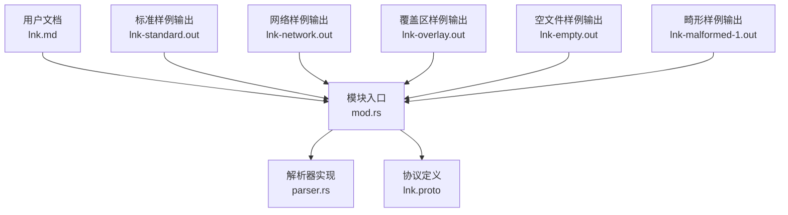
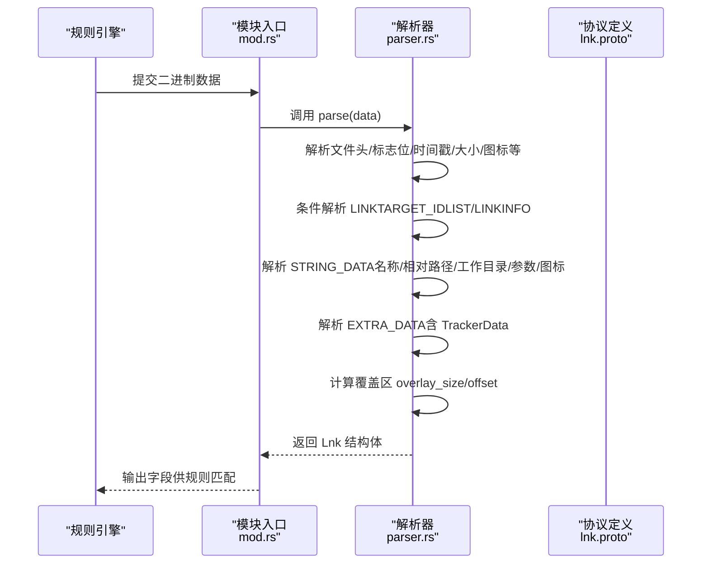
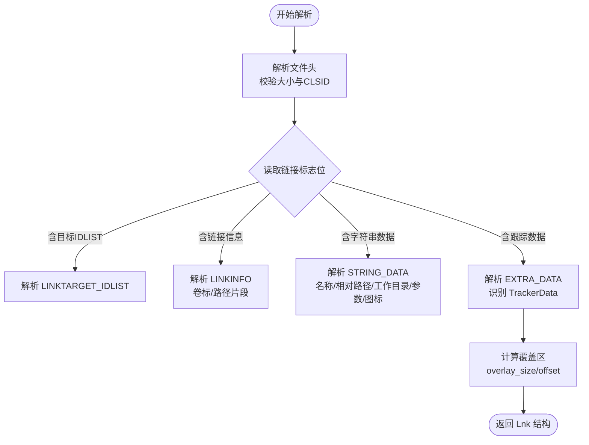
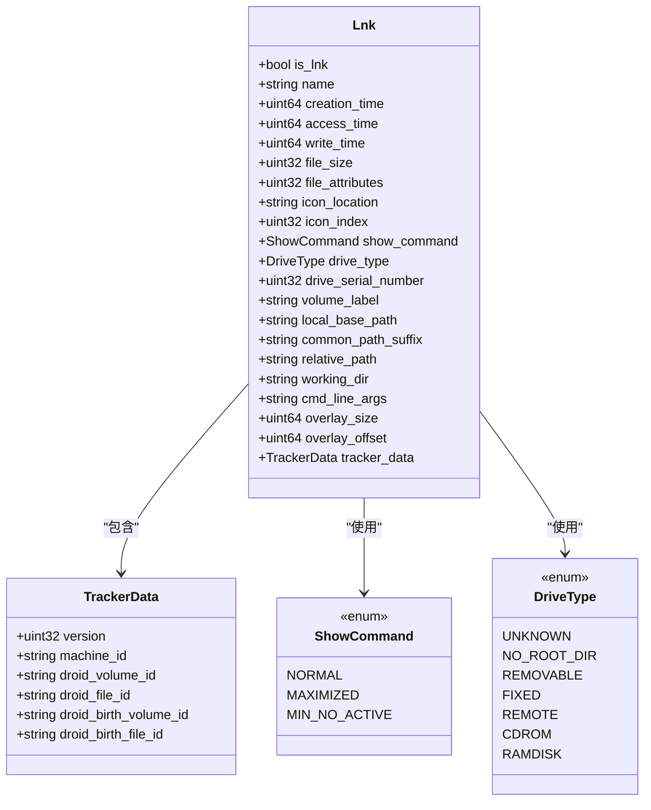
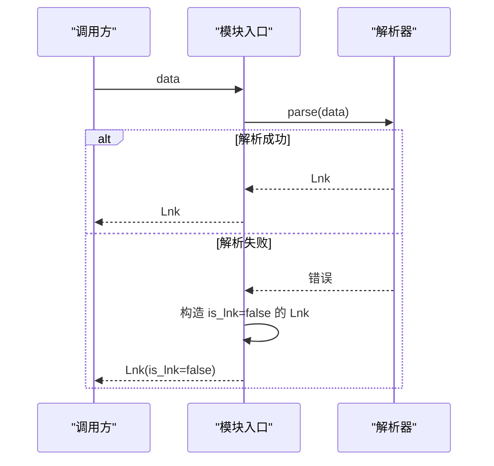
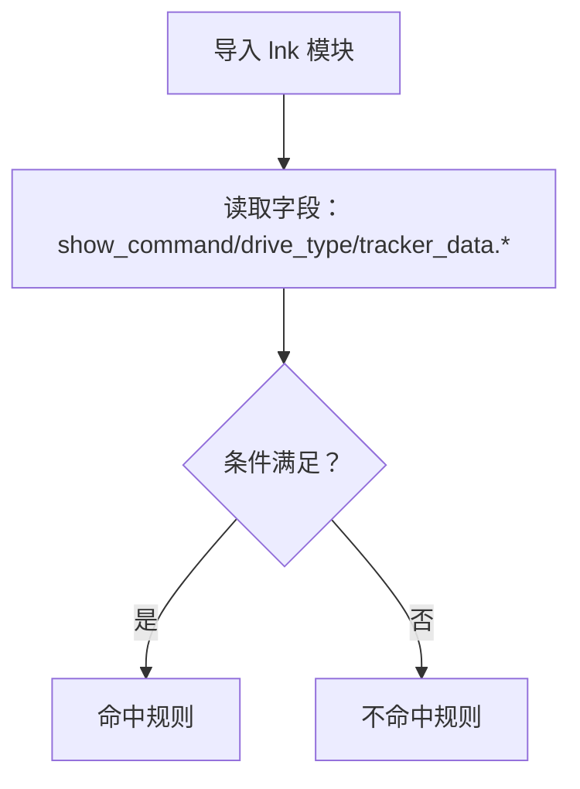
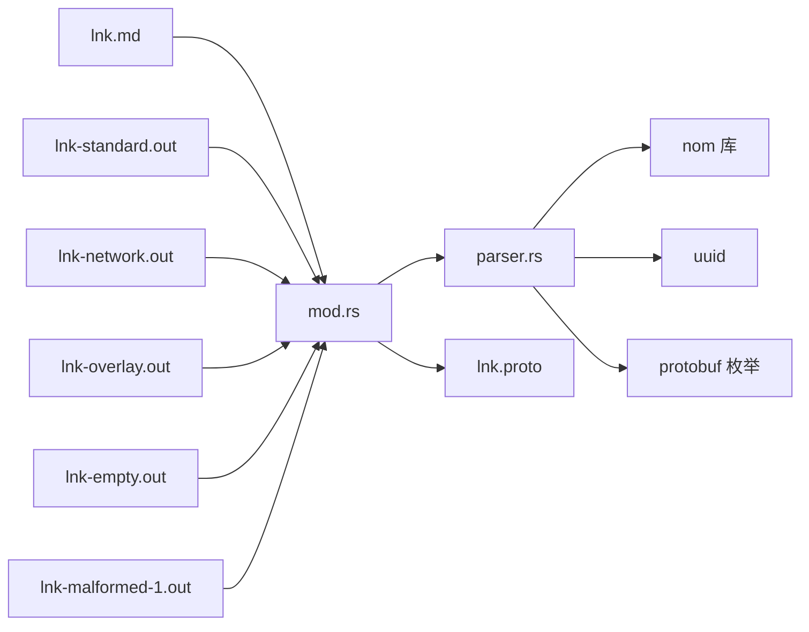

# LNK 模块

<cite>
**本文引用的文件**
- [lib/src/modules/lnk/mod.rs](file://lib/src/modules/lnk/mod.rs)
- [lib/src/modules/lnk/parser.rs](file://lib/src/modules/lnk/parser.rs)
- [lib/src/modules/protos/lnk.proto](file://lib/src/modules/protos/lnk.proto)
- [site/content/docs/modules/lnk.md](file://site/content/docs/modules/lnk.md)
- [lib/src/modules/lnk/tests/testdata/lnk-standard.out](file://lib/src/modules/lnk/tests/testdata/lnk-standard.out)
- [lib/src/modules/lnk/tests/testdata/lnk-network.out](file://lib/src/modules/lnk/tests/testdata/lnk-network.out)
- [lib/src/modules/lnk/tests/testdata/lnk-overlay.out](file://lib/src/modules/lnk/tests/testdata/lnk-overlay.out)
- [lib/src/modules/lnk/tests/testdata/lnk-empty.out](file://lib/src/modules/lnk/tests/testdata/lnk-empty.out)
- [lib/src/modules/lnk/tests/testdata/lnk-malformed-1.out](file://lib/src/modules/lnk/tests/testdata/lnk-malformed-1.out)
</cite>

## 目录
1. [简介](#简介)
2. [项目结构](#项目结构)
3. [核心组件](#核心组件)
4. [架构总览](#架构总览)
5. [详细组件分析](#详细组件分析)
6. [依赖关系分析](#依赖关系分析)
7. [性能考量](#性能考量)
8. [故障排查指南](#故障排查指南)
9. [结论](#结论)
10. [附录](#附录)

## 简介
本文件系统性阐述 YARA-X 中的 LNK 模块，聚焦于 Windows 快捷方式（.lnk）文件格式的解析机制与规则应用。LNK 模块通过解析 LNK 文件头、位置信息、字符串数据、驱动器信息、跟踪数据以及可选的“覆盖区”（overlay），提取丰富的元数据字段，为安全检测与取证分析提供支撑。文档将从文件格式规范、内部实现、字段定义、规则示例到实战应用进行全面说明。

## 项目结构
LNK 模块位于 lib/src/modules/lnk 目录，包含以下关键文件：
- 模块入口与导出：mod.rs
- 解析器实现：parser.rs
- 协议定义（Protobuf）：lnk.proto
- 文档：site/content/docs/modules/lnk.md
- 测试数据输出样例：tests/testdata/*.out

**图表来源**
- [lib/src/modules/lnk/mod.rs:1-30](file://lib/src/modules/lnk/mod.rs#L1-L30)
- [lib/src/modules/lnk/parser.rs:1-576](file://lib/src/modules/lnk/parser.rs#L1-L576)
- [lib/src/modules/protos/lnk.proto:1-136](file://lib/src/modules/protos/lnk.proto#L1-L136)
- [site/content/docs/modules/lnk.md:1-142](file://site/content/docs/modules/lnk.md#L1-L142)

**章节来源**
- [lib/src/modules/lnk/mod.rs:1-30](file://lib/src/modules/lnk/mod.rs#L1-L30)
- [lib/src/modules/lnk/parser.rs:1-576](file://lib/src/modules/lnk/parser.rs#L1-L576)
- [lib/src/modules/protos/lnk.proto:1-136](file://lib/src/modules/protos/lnk.proto#L1-L136)
- [site/content/docs/modules/lnk.md:1-142](file://site/content/docs/modules/lnk.md#L1-L142)

## 核心组件
- 模块入口函数：负责接收二进制输入，调用解析器进行解析；若解析失败则返回非 LNK 结果标记。
- 解析器（LnkParser）：基于 nom 库实现，遵循微软 LNK 规范，解析文件头、链接目标列表、链接信息、字符串数据、额外数据块与覆盖区。
- Protobuf 定义：描述 LNK 元数据结构体与枚举类型，供模块导出给上层规则引擎使用。
- 用户文档：提供字段说明、枚举值与规则示例，便于编写检测规则。

**章节来源**
- [lib/src/modules/lnk/mod.rs:19-29](file://lib/src/modules/lnk/mod.rs#L19-L29)
- [lib/src/modules/lnk/parser.rs:18-176](file://lib/src/modules/lnk/parser.rs#L18-L176)
- [lib/src/modules/protos/lnk.proto:48-133](file://lib/src/modules/protos/lnk.proto#L48-L133)
- [site/content/docs/modules/lnk.md:26-78](file://site/content/docs/modules/lnk.md#L26-L78)

## 架构总览
LNK 模块采用“协议定义 + 解析器 + 模块入口”的分层设计。解析器按 LNK 文件结构顺序解析各段，填充 Protobuf 对象；模块入口统一对外暴露结果，供规则引擎匹配。

**图表来源**
- [lib/src/modules/lnk/mod.rs:19-29](file://lib/src/modules/lnk/mod.rs#L19-L29)
- [lib/src/modules/lnk/parser.rs:31-175](file://lib/src/modules/lnk/parser.rs#L31-L175)
- [lib/src/modules/protos/lnk.proto:48-119](file://lib/src/modules/protos/lnk.proto#L48-L119)

## 详细组件分析

### 解析器实现（LnkParser）
- 固定文件头解析：校验头部大小与 CLSID，提取链接标志位、文件属性、时间戳、文件大小、图标索引、显示命令等。
- 字符串数据解析：根据标志位条件解析名称、相对路径、工作目录、命令行参数、图标位置；支持 ANSI 与 Unicode（UTF-16 LE）两种编码，并对长度上限进行约束。
- 链接信息（LinkInfo）解析：解析卷标信息（卷类型、序列号、卷标）、本地基础路径与通用路径后缀，用于拼接完整目标路径。
- 额外数据与覆盖区：遍历额外数据块，识别跟踪数据块（TrackerData）；剩余未识别数据作为覆盖区，记录其偏移与大小。
- 时间转换：将 Windows FILETIME 转换为 Unix 时间戳。

**图表来源**
- [lib/src/modules/lnk/parser.rs:31-175](file://lib/src/modules/lnk/parser.rs#L31-L175)
- [lib/src/modules/lnk/parser.rs:224-318](file://lib/src/modules/lnk/parser.rs#L224-L318)
- [lib/src/modules/lnk/parser.rs:381-444](file://lib/src/modules/lnk/parser.rs#L381-L444)
- [lib/src/modules/lnk/parser.rs:446-480](file://lib/src/modules/lnk/parser.rs#L446-L480)

**章节来源**
- [lib/src/modules/lnk/parser.rs:31-175](file://lib/src/modules/lnk/parser.rs#L31-L175)
- [lib/src/modules/lnk/parser.rs:224-318](file://lib/src/modules/lnk/parser.rs#L224-L318)
- [lib/src/modules/lnk/parser.rs:381-444](file://lib/src/modules/lnk/parser.rs#L381-L444)
- [lib/src/modules/lnk/parser.rs:446-480](file://lib/src/modules/lnk/parser.rs#L446-L480)
- [lib/src/modules/lnk/parser.rs:559-576](file://lib/src/modules/lnk/parser.rs#L559-L576)

### 字段与枚举定义（Protobuf）
- Lnk 结构体字段涵盖：是否为 LNK、名称、创建/访问/修改时间、目标文件大小、目标文件属性、图标位置与索引、显示命令、驱动器类型/序列号/卷标、本地基础路径、通用路径后缀、相对路径、工作目录、命令行参数、覆盖区大小与偏移、跟踪数据。
- 枚举类型：文件属性（FileAttributes）、显示命令（ShowCommand）、驱动器类型（DriveType）。

**图表来源**
- [lib/src/modules/protos/lnk.proto:48-133](file://lib/src/modules/protos/lnk.proto#L48-L133)

**章节来源**
- [lib/src/modules/protos/lnk.proto:13-46](file://lib/src/modules/protos/lnk.proto#L13-L46)
- [lib/src/modules/protos/lnk.proto:48-133](file://lib/src/modules/protos/lnk.proto#L48-L133)

### 模块入口与错误处理
- 模块入口函数接收二进制数据，调用解析器；若解析成功返回 Lnk 结果，否则构造一个 is_lnk=false 的空对象返回，避免规则误判。

**图表来源**
- [lib/src/modules/lnk/mod.rs:19-29](file://lib/src/modules/lnk/mod.rs#L19-L29)

**章节来源**
- [lib/src/modules/lnk/mod.rs:19-29](file://lib/src/modules/lnk/mod.rs#L19-L29)

### 实战规则示例（基于文档与测试输出）
- 基于显示命令的规则：检测最大化窗口的快捷方式。
- 基于驱动器类型的规则：检测光驱（CDROM）类型的快捷方式。
- 基于跟踪数据的规则：依据机器标识或 Droid ID 进行关联追踪。

**图表来源**
- [site/content/docs/modules/lnk.md:69-142](file://site/content/docs/modules/lnk.md#L69-L142)

**章节来源**
- [site/content/docs/modules/lnk.md:69-142](file://site/content/docs/modules/lnk.md#L69-L142)

## 依赖关系分析
- 模块入口依赖解析器与 Protobuf 定义。
- 解析器依赖 nom 库进行字节流解析，依赖 uuid 与 protobuf 枚举类型。
- 文档与测试输出样例用于验证字段与规则示例的有效性。

**图表来源**
- [lib/src/modules/lnk/mod.rs:15-29](file://lib/src/modules/lnk/mod.rs#L15-L29)
- [lib/src/modules/lnk/parser.rs:5-12](file://lib/src/modules/lnk/parser.rs#L5-L12)
- [lib/src/modules/protos/lnk.proto:1-11](file://lib/src/modules/protos/lnk.proto#L1-L11)

**章节来源**
- [lib/src/modules/lnk/mod.rs:15-29](file://lib/src/modules/lnk/mod.rs#L15-L29)
- [lib/src/modules/lnk/parser.rs:5-12](file://lib/src/modules/lnk/parser.rs#L5-L12)
- [lib/src/modules/protos/lnk.proto:1-11](file://lib/src/modules/protos/lnk.proto#L1-L11)

## 性能考量
- 解析复杂度：整体线性扫描，按段解析，时间复杂度 O(n)，空间复杂度主要取决于字符串与可选字段。
- 字符串长度限制：针对特定字段（如名称、相对路径、图标位置）采用最大长度约束，避免异常输入导致内存膨胀。
- 覆盖区处理：仅记录剩余数据的大小与偏移，不进行深度解析，降低开销。
- 时间戳转换：常数时间转换，无额外分配。

**章节来源**
- [lib/src/modules/lnk/parser.rs:446-480](file://lib/src/modules/lnk/parser.rs#L446-L480)
- [lib/src/modules/lnk/parser.rs:154-172](file://lib/src/modules/lnk/parser.rs#L154-L172)
- [lib/src/modules/lnk/parser.rs:559-576](file://lib/src/modules/lnk/parser.rs#L559-L576)

## 故障排查指南
- 非 LNK 文件：模块会返回 is_lnk=false，确保规则不会误报。
- 畸形文件：解析器仍可能在部分字段上恢复有效数据，参考测试样例输出进行比对。
- 编码问题：字符串解析同时支持 ANSI 与 UTF-16 LE，注意字段是否为 Unicode 标志位决定的编码。
- 覆盖区：overlay_size 与 overlay_offset 可用于定位附加数据，辅助进一步分析。

**章节来源**
- [lib/src/modules/lnk/mod.rs:20-29](file://lib/src/modules/lnk/mod.rs#L20-L29)
- [lib/src/modules/lnk/tests/testdata/lnk-empty.out:1](file://lib/src/modules/lnk/tests/testdata/lnk-empty.out#L1)
- [lib/src/modules/lnk/tests/testdata/lnk-malformed-1.out:1-21](file://lib/src/modules/lnk/tests/testdata/lnk-malformed-1.out#L1-L21)
- [lib/src/modules/lnk/tests/testdata/lnk-overlay.out:15-16](file://lib/src/modules/lnk/tests/testdata/lnk-overlay.out#L15-L16)

## 结论
LNK 模块以严谨的文件格式解析为基础，提供了全面的快捷方式元数据字段与枚举类型，能够支撑多种安全检测场景。结合用户文档与测试样例，规则作者可以快速构建针对钓鱼、持久化与恶意启动项的检测规则，并在取证与威胁情报分析中发挥重要作用。

## 附录

### 字段与枚举速查
- 字段概览：参见用户文档中的字段表格与说明。
- 显示命令（ShowCommand）：NORMAL、MAXIMIZED、MIN_NO_ACTIVE。
- 驱动器类型（DriveType）：UNKNOWN、NO_ROOT_DIR、REMOVABLE、FIXED、REMOTE、CDROM、RAMDISK。
- 文件属性（FileAttributes）：包含只读、隐藏、系统、目录、归档、临时、稀疏、重解析点、压缩、离线、不索引、加密等。

**章节来源**
- [site/content/docs/modules/lnk.md:26-142](file://site/content/docs/modules/lnk.md#L26-L142)
- [lib/src/modules/protos/lnk.proto:13-46](file://lib/src/modules/protos/lnk.proto#L13-L46)