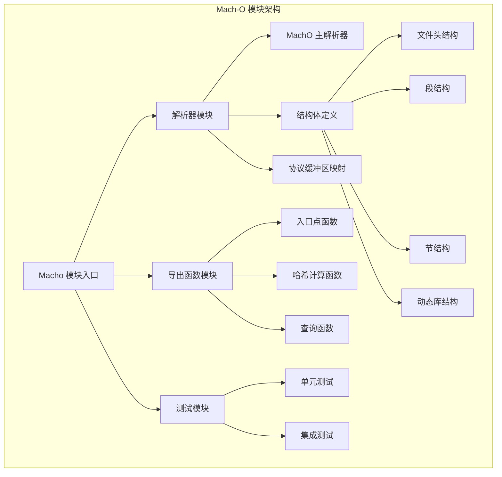
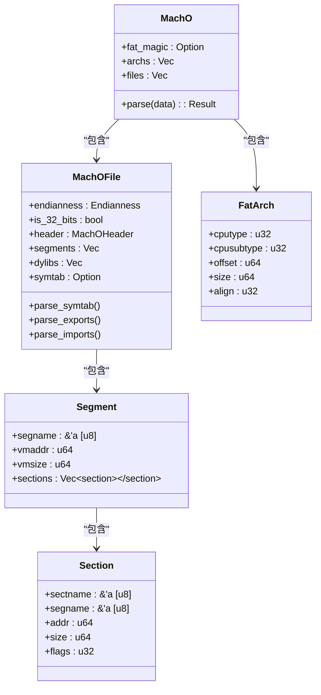
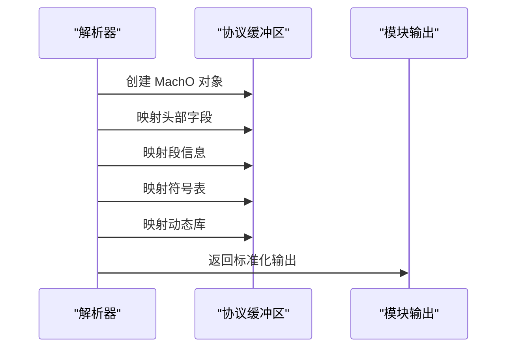
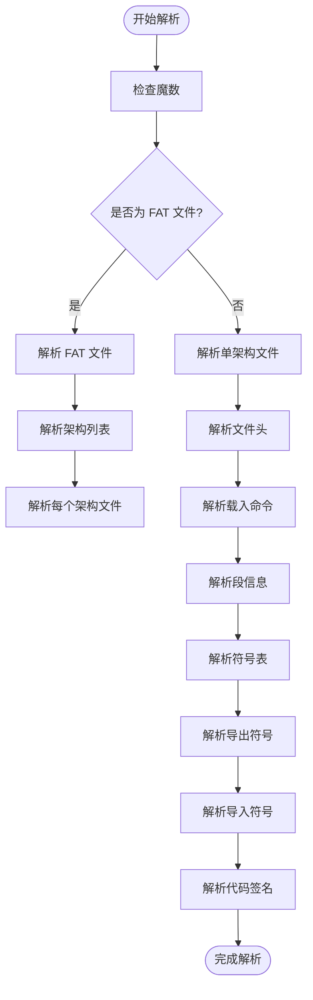
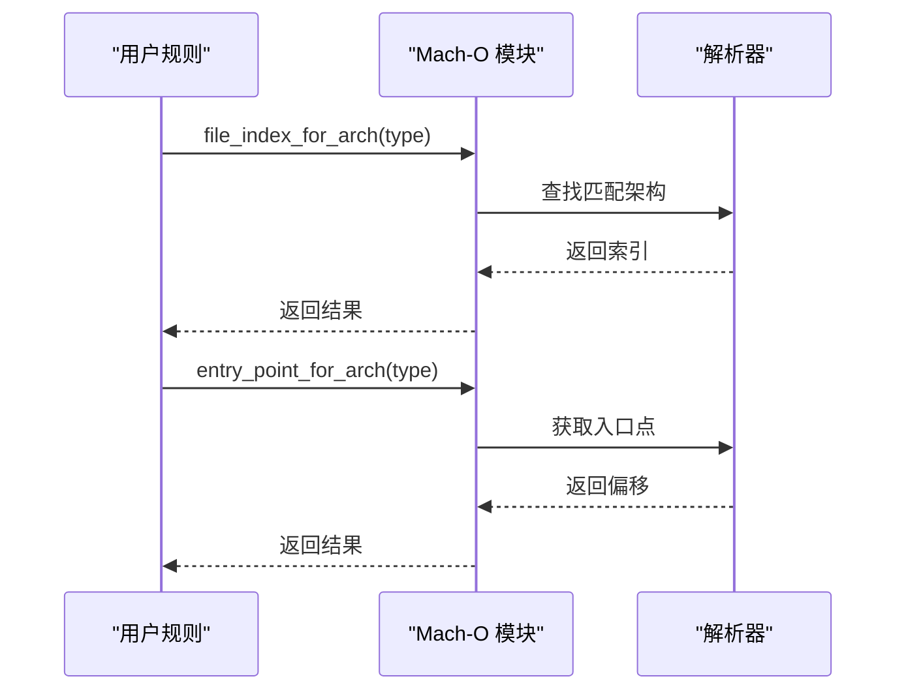
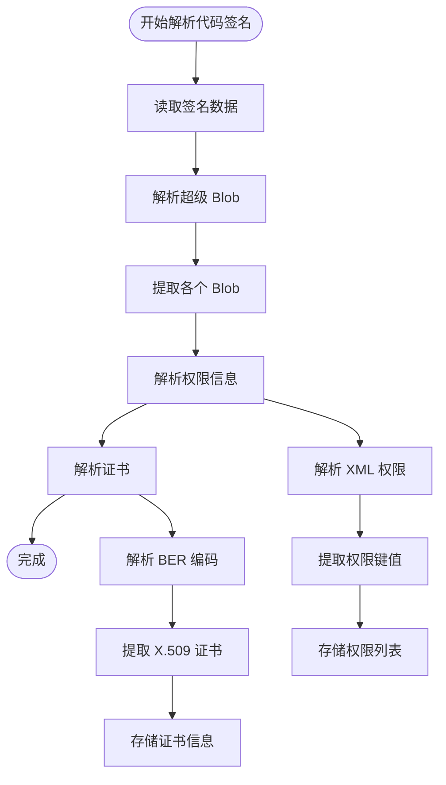
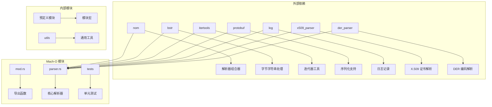

# Mach-O 模块

<cite>
**本文档引用的文件**
- [mod.rs](file://yara-x/lib/src/modules/macho/mod.rs)
- [parser.rs](file://yara-x/lib/src/modules/macho/parser.rs)
- [macho.md](file://yara-x/site/content/docs/modules/macho.md)
- [macho.proto](file://yara-x/lib/src/modules/protos/macho.proto)
- [tests/mod.rs](file://yara-x/lib/src/modules/macho/tests/mod.rs)
- [index.md](file://yara-x/site/content/blog/leveraging-macho-module/index.md)
</cite>

## 目录
1. [简介](#简介)
2. [项目结构](#项目结构)
3. [核心组件](#核心组件)
4. [架构概览](#架构概览)
5. [详细组件分析](#详细组件分析)
6. [依赖关系分析](#依赖关系分析)
7. [性能考虑](#性能考虑)
8. [故障排除指南](#故障排除指南)
9. [结论](#结论)
10. [附录](#附录)

## 简介

Mach-O（Machine Code Object File Format）模块是 YARA-X 中用于解析和分析 macOS 和 iOS 可执行文件格式的核心模块。该模块提供了对 Mach-O 文件格式的完整支持，包括文件头、载入命令、节和段等结构的解析能力。

Mach-O 是 Apple 生态系统中使用的标准可执行文件格式，广泛应用于 macOS、iOS、tvOS 和 watchOS 系统中。该模块通过提供丰富的 API 和函数，使得安全分析师、取证专家和研究人员能够更精确地检测和分析这些二进制文件。

## 项目结构

Mach-O 模块位于 YARA-X 项目的模块系统中，采用清晰的分层架构设计：



**图表来源**
- [mod.rs:1-611](file://yara-x/lib/src/modules/macho/mod.rs#L1-L611)
- [parser.rs:131-518](file://yara-x/lib/src/modules/macho/parser.rs#L131-L518)

**章节来源**
- [mod.rs:1-611](file://yara-x/lib/src/modules/macho/mod.rs#L1-L611)
- [parser.rs:131-518](file://yara-x/lib/src/modules/macho/parser.rs#L131-L518)

## 核心组件

### 主要数据结构

Mach-O 模块的核心数据结构包括：

1. **MachO 主结构** - 表示整个 Mach-O 文件或 FAT 多架构文件
2. **MachOFile 结构** - 表示单个架构的 Mach-O 文件
3. **结构体数组** - 包括段、节、动态库、符号表等

### 关键功能特性

- **多架构支持** - 能够处理 FAT（扁平档案）格式的多架构二进制文件
- **完整解析** - 支持所有主要的 Mach-O 载入命令和结构
- **符号分析** - 提供导入、导出符号的完整分析能力
- **代码签名** - 解析和验证嵌入式代码签名信息
- **证书提取** - 从代码签名中提取 X.509 证书信息

**章节来源**
- [parser.rs:478-518](file://yara-x/lib/src/modules/macho/parser.rs#L478-L518)
- [parser.rs:1649-1702](file://yara-x/lib/src/modules/macho/parser.rs#L1649-L1702)

## 架构概览

Mach-O 模块采用模块化设计，具有清晰的职责分离：



**图表来源**
- [parser.rs:131-518](file://yara-x/lib/src/modules/macho/parser.rs#L131-L518)
- [parser.rs:1649-1695](file://yara-x/lib/src/modules/macho/parser.rs#L1649-L1695)

### 协议缓冲区映射

模块实现了完整的协议缓冲区映射，将内部结构转换为标准化的数据格式：



**图表来源**
- [parser.rs:1997-2142](file://yara-x/lib/src/modules/macho/parser.rs#L1997-L2142)

**章节来源**
- [parser.rs:1997-2142](file://yara-x/lib/src/modules/macho/parser.rs#L1997-L2142)
- [macho.proto:169-209](file://yara-x/lib/src/modules/protos/macho.proto#L169-L209)

## 详细组件分析

### 解析器组件

解析器组件是 Mach-O 模块的核心，负责将原始二进制数据转换为结构化的对象模型：

#### 主解析流程



**图表来源**
- [parser.rs:147-252](file://yara-x/lib/src/modules/macho/parser.rs#L147-L252)
- [parser.rs:254-475](file://yara-x/lib/src/modules/macho/parser.rs#L254-L475)

#### 载入命令解析

模块支持多种重要的 Mach-O 载入命令：

| 命令类型 | 功能描述 | 关键字段 |
|---------|----------|----------|
| LC_SEGMENT/LC_SEGMENT_64 | 定义内存段布局 | segname, vmaddr, vmsize, nsects |
| LC_SYMTAB | 符号表定义 | symoff, nsyms, stroff, strsize |
| LC_DYSYMTAB | 动态符号表 | 各种偏移和计数字段 |
| LC_LOAD_DYLIB/LC_ID_DYLIB | 动态库加载 | name, timestamp, versions |
| LC_CODE_SIGNATURE | 代码签名 | dataoff, datasize |
| LC_DYLD_INFO/LC_DYLD_INFO_ONLY | 动态链接信息 | 各种偏移和大小 |

**章节来源**
- [parser.rs:580-705](file://yara-x/lib/src/modules/macho/parser.rs#L580-L705)
- [parser.rs:920-1115](file://yara-x/lib/src/modules/macho/parser.rs#L920-L1115)

### 导出函数组件

导出函数组件提供了用户友好的 API 接口：

#### 架构相关函数



**图表来源**
- [mod.rs:49-68](file://yara-x/lib/src/modules/macho/mod.rs#L49-L68)
- [mod.rs:130-153](file://yara-x/lib/src/modules/macho/mod.rs#L130-L153)

#### 查询和哈希函数

模块提供了多种查询和哈希计算函数：

| 函数类型 | 功能 | 输入参数 | 输出 |
|---------|------|----------|------|
| has_* | 检查特定元素是否存在 | 字符串/标识符 | 布尔值 |
| *_hash() | 计算元素集合的哈希值 | 无 | MD5 字符串 |
| file_index_for_arch | 查找架构索引 | CPU 类型/子类型 | 整数索引 |

**章节来源**
- [mod.rs:207-334](file://yara-x/lib/src/modules/macho/mod.rs#L207-L334)
- [mod.rs:336-596](file://yara-x/lib/src/modules/macho/mod.rs#L336-L596)

### 符号表和导入导出分析

符号表分析是 Mach-O 模块的重要功能之一：

#### 符号表解析流程


**图表来源**
- [parser.rs:1142-1172](file://yara-x/lib/src/modules/macho/parser.rs#L1142-L1172)
- [parser.rs:1256-1302](file://yara-x/lib/src/modules/macho/parser.rs#L1256-L1302)

#### 符号类型过滤

模块实现了复杂的符号类型过滤逻辑：

- **外部符号**：仅包含外部可见的符号
- **非调试符号**：排除调试相关的符号条目
- **有效类型**：过滤掉无效或特殊用途的符号

**章节来源**
- [parser.rs:52-55](file://yara-x/lib/src/modules/macho/parser.rs#L52-L55)
- [parser.rs:1148-1169](file://yara-x/lib/src/modules/macho/parser.rs#L1148-L1169)

### 代码签名和证书处理

代码签名处理是 macOS/iOS 安全分析的关键功能：

#### 代码签名解析流程



**图表来源**
- [parser.rs:964-1069](file://yara-x/lib/src/modules/macho/parser.rs#L964-L1069)
- [parser.rs:1945-1982](file://yara-x/lib/src/modules/macho/parser.rs#L1945-L1982)

**章节来源**
- [parser.rs:964-1069](file://yara-x/lib/src/modules/macho/parser.rs#L964-L1069)
- [parser.rs:1945-1982](file://yara-x/lib/src/modules/macho/parser.rs#L1945-L1982)

## 依赖关系分析

Mach-O 模块的依赖关系体现了其模块化设计的优势：



**图表来源**
- [mod.rs:8-15](file://yara-x/lib/src/modules/macho/mod.rs#L8-L15)
- [parser.rs:1-28](file://yara-x/lib/src/modules/macho/parser.rs#L1-L28)

### 关键依赖说明

- **nom 库**：提供高性能的组合器解析器，支持复杂的数据结构解析
- **bstr 库**：提供高效的字节字符串处理能力
- **itertools 库**：提供丰富的迭代器操作工具
- **protobuf 库**：支持结构化数据的序列化和反序列化
- **x509_parser 和 der_parser 库**：提供 X.509 证书和 DER 编码的解析能力

**章节来源**
- [mod.rs:8-15](file://yara-x/lib/src/modules/macho/mod.rs#L8-L15)
- [parser.rs:1-28](file://yara-x/lib/src/modules/macho/parser.rs#L1-L28)

## 性能考虑

Mach-O 模块在设计时充分考虑了性能优化：

### 内存管理策略

- **零拷贝设计**：大量使用借用引用而非所有权转移，减少内存分配
- **延迟解析**：仅在需要时解析特定部分的数据
- **缓存机制**：实现线程本地存储的缓存机制，避免重复计算

### 解析优化技术

- **流式解析**：支持大文件的流式处理，避免一次性加载到内存
- **错误恢复**：在解析过程中遇到错误时能够优雅地跳过损坏的部分
- **并行处理**：利用 Rust 的并发特性进行并行解析

### 哈希计算优化

模块实现了专门的哈希计算函数，采用以下优化策略：

- **去重处理**：自动去除重复的条目
- **排序优化**：使用高效的排序算法
- **字符串处理**：统一转换为小写以确保一致性

## 故障排除指南

### 常见问题和解决方案

#### 解析失败问题

**问题**：Mach-O 文件解析失败
**可能原因**：
- 文件格式不正确
- 数据损坏或截断
- 不支持的架构类型

**解决方案**：
- 验证文件完整性
- 检查文件是否为有效的 Mach-O 格式
- 确认目标架构是否受支持

#### 符号表为空问题

**问题**：符号表解析结果为空
**可能原因**：
- 文件未包含符号表
- 符号表被剥离
- 解析器错误

**解决方案**：
- 检查文件是否包含调试信息
- 验证符号表的存在性
- 更新解析器版本

#### 代码签名解析失败

**问题**：代码签名信息无法解析
**可能原因**：
- 嵌入式签名不存在
- 签名格式不正确
- 证书链不完整

**解决方案**：
- 验证文件确实包含代码签名
- 检查签名格式的兼容性
- 确保证书链的完整性

**章节来源**
- [parser.rs:336-355](file://yara-x/lib/src/modules/macho/parser.rs#L336-L355)
- [parser.rs:385-399](file://yara-x/lib/src/modules/macho/parser.rs#L385-L399)

## 结论

Mach-O 模块是 YARA-X 项目中功能最全面的模块之一，它为 macOS 和 iOS 可执行文件的分析提供了强大的支持。该模块的设计体现了现代软件工程的最佳实践：

### 主要优势

1. **完整性**：支持完整的 Mach-O 文件格式规范
2. **性能**：采用高效的解析技术和内存管理策略
3. **易用性**：提供直观的 API 接口和丰富的查询功能
4. **安全性**：内置代码签名和证书解析能力
5. **扩展性**：模块化设计便于功能扩展和维护

### 应用场景

- **恶意软件分析**：识别可疑的导入导出符号和权限配置
- **移动设备取证**：分析 iOS 应用程序和框架
- **安全审计**：验证代码签名和权限设置
- **威胁情报**：基于哈希值的二进制文件相似性检测

### 发展前景

随着 Apple 生态系统的不断发展，Mach-O 模块将继续演进以支持新的文件格式特性和安全功能。模块的设计为未来的功能扩展奠定了坚实的基础。

## 附录

### YARA 规则示例

以下是一些实际的 YARA 规则示例，展示了如何使用 Mach-O 模块进行分析：

#### 基础架构检测

```yara
import "macho"

rule detect_x86_64 {
    condition:
        macho.cputype == macho.CPU_TYPE_X86_64
}

rule detect_arm64 {
    condition:
        macho.cputype == macho.CPU_TYPE_ARM64
}
```

#### 动态库检测

```yara
import "macho"

rule detect_system_library {
    condition:
        macho.has_dylib("/usr/lib/libSystem.B.dylib")
}

rule detect_framework_usage {
    condition:
        for any dylib in macho.dylibs:
            dylib.name contains "/System/Library/Frameworks/"
}
```

#### 权限和签名检测

```yara
import "macho"

rule detect_microphone_access {
    condition:
        macho.has_entitlement("com.apple.security.device.microphone")
}

rule detect_code_signature {
    condition:
        defined macho.code_signature_data
}
```

#### 符号分析

```yara
import "macho"

rule detect_swift_symbols {
    condition:
        for any symbol in macho.symtab.entries:
            symbol == "_swift_getObjCClassMetadata"
}

rule detect_custom_exports {
    condition:
        macho.has_export("custom_function_name")
}
```

### API 参考

#### 主要函数

| 函数名 | 参数 | 返回值 | 描述 |
|--------|------|--------|------|
| file_index_for_arch | type_arg[, subtype_arg] | Option<i64> | 查找指定架构的索引 |
| entry_point_for_arch | type_arg[, subtype_arg] | Option<i64> | 获取指定架构的入口点偏移 |
| has_dylib | dylib_name | Option<bool> | 检查动态库是否存在 |
| has_rpath | rpath | Option<bool> | 检查运行路径是否存在 |
| has_import | import | Option<bool> | 检查导入符号是否存在 |
| has_export | export | Option<bool> | 检查导出符号是否存在 |
| has_entitlement | entitlement | Option<bool> | 检查权限是否存在 |
| dylib_hash | 无 | Option<RuntimeString> | 计算动态库哈希值 |
| import_hash | 无 | Option<RuntimeString> | 计算导入符号哈希值 |
| export_hash | 无 | Option<RuntimeString> | 计算导出符号哈希值 |
| entitlement_hash | 无 | Option<RuntimeString> | 计算权限哈希值 |
| symhash | 无 | Option<RuntimeString> | 计算符号表哈希值 |

#### 关键常量

模块定义了大量常量用于表示不同的 Mach-O 特性：

- **CPU 类型常量**：如 CPU_TYPE_X86、CPU_TYPE_ARM64 等
- **文件类型常量**：如 MH_EXECUTE、MH_DYLIB 等
- **标志位常量**：如 MH_PIE、MH_APP_EXTENSION_SAFE 等
- **设备类型常量**：如 MACOSX、IPHONEOS 等

**章节来源**
- [macho.md:44-291](file://yara-x/site/content/docs/modules/macho.md#L44-L291)
- [index.md:65-134](file://yara-x/site/content/blog/leveraging-macho-module/index.md#L65-L134)