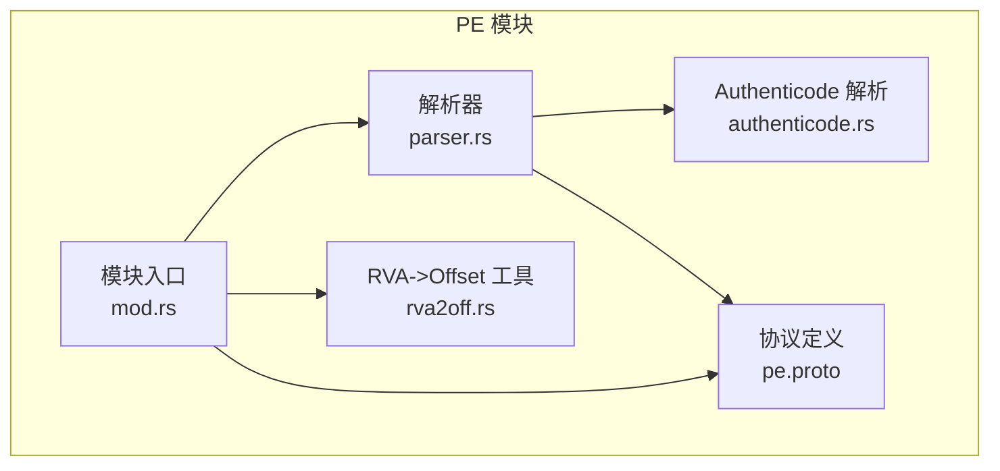
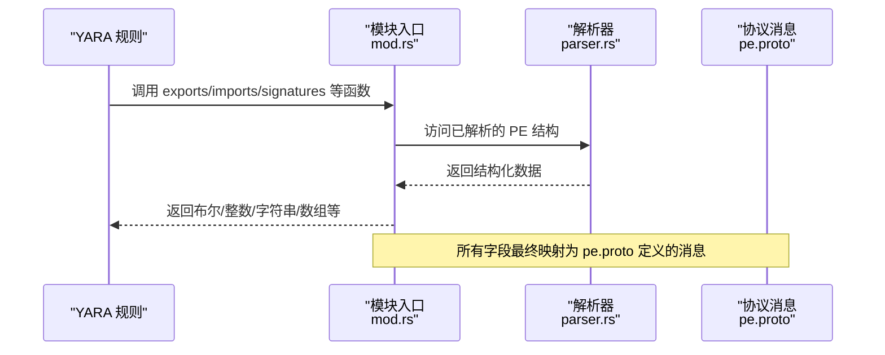
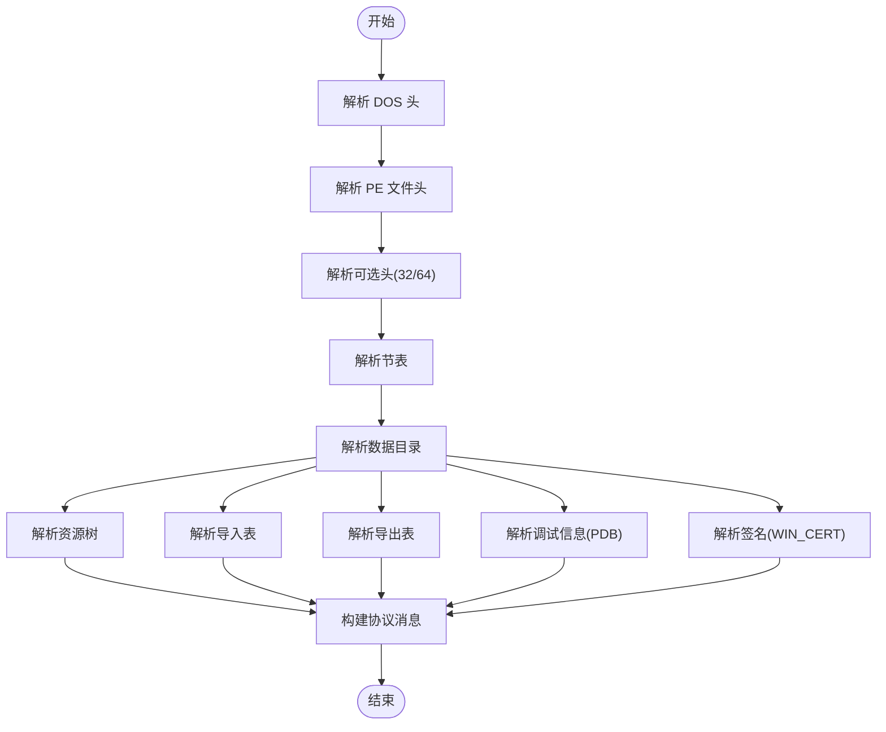
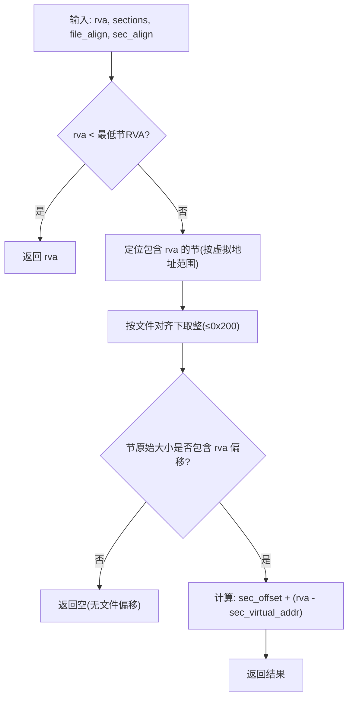
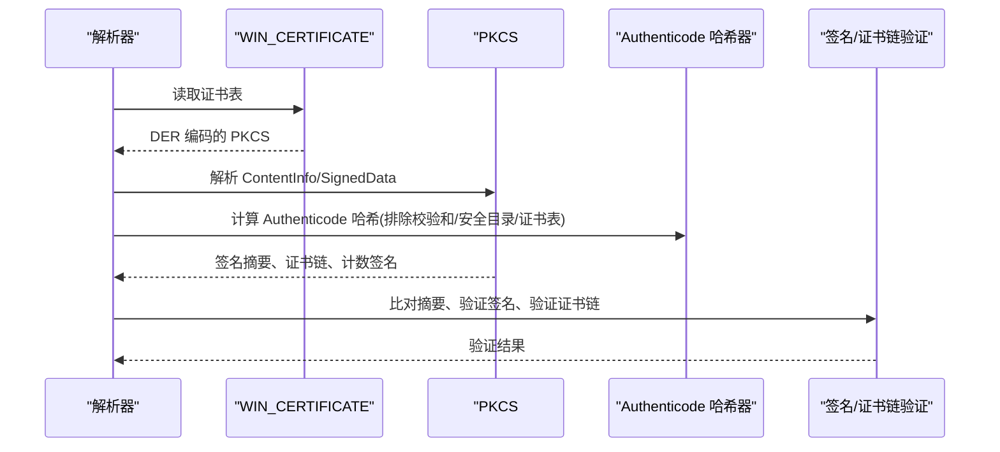
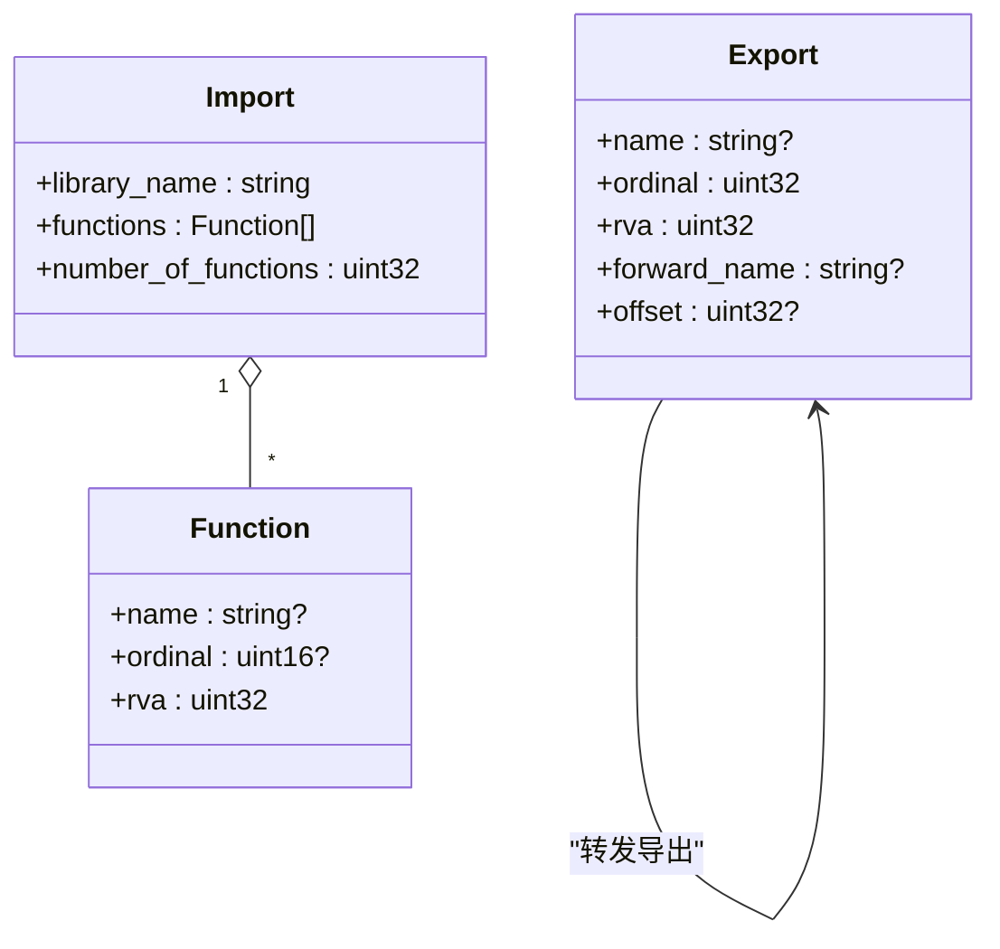
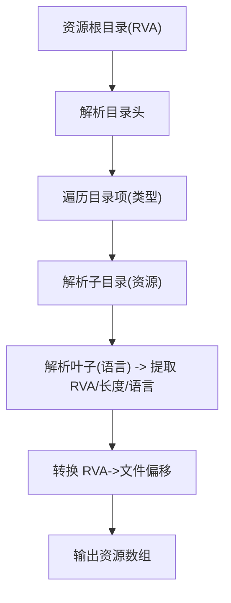
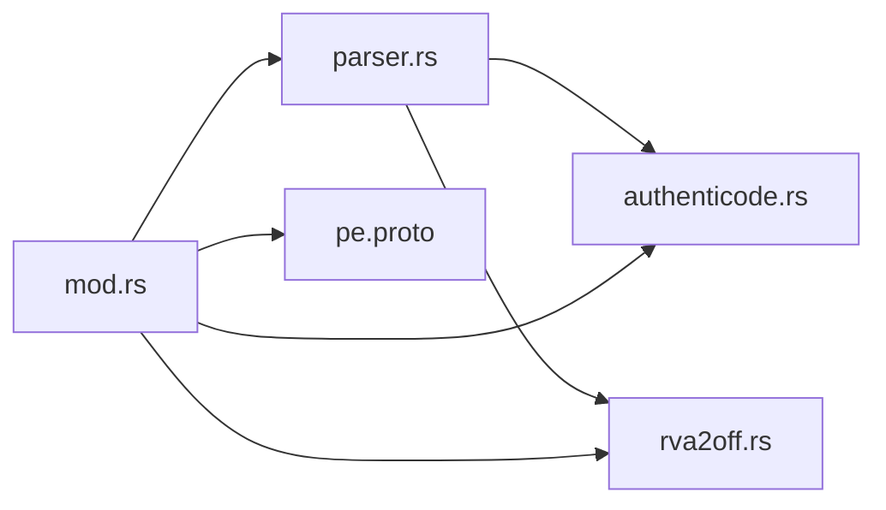

# PE 模块

<cite>
**本文引用的文件**
- [mod.rs](file://yara-x/lib/src/modules/pe/mod.rs)
- [parser.rs](file://yara-x/lib/src/modules/pe/parser.rs)
- [authenticode.rs](file://yara-x/lib/src/modules/pe/authenticode.rs)
- [rva2off.rs](file://yara-x/lib/src/modules/pe/rva2off.rs)
- [pe.proto](file://yara-x/lib/src/modules/protos/pe.proto)
- [pe.md](file://yara-x/site/content/docs/modules/pe.md)
</cite>

## 目录
1. [简介](#简介)
2. [项目结构](#项目结构)
3. [核心组件](#核心组件)
4. [架构总览](#架构总览)
5. [详细组件分析](#详细组件分析)
6. [依赖关系分析](#依赖关系分析)
7. [性能考量](#性能考量)
8. [故障排查指南](#故障排查指南)
9. [结论](#结论)
10. [附录](#附录)

## 简介
本文件系统性阐述 YARA-X 中的 PE 模块，围绕 Windows 可执行文件格式（PE/PE+）的解析与元数据提取，覆盖 DOS 头、NT 头（文件头与可选头）、节表、导入表、导出表、资源树、版本信息、数字签名（Authenticode）、Rich Header、校验和计算、RVA 到文件偏移转换等关键能力，并给出在 YARA 规则中访问这些元数据的实践示例，以及在恶意软件分析、文件识别与取证调查中的应用建议。

## 项目结构
PE 模块由以下关键部分组成：
- 模块入口与导出函数：负责初始化解析状态、缓存、并暴露规则可用的查询接口（如 is_32bit、is_64bit、is_dll、calculate_checksum、imphash、imports、exports、resources、signatures 等）
- 解析器（parser.rs）：实现对 DOS 头、PE 文件头、可选头、节表、导入/导出、资源树、调试信息、签名等的解析
- 数字签名（authenticode.rs）：解析并验证 Authenticode 签名链路与计数信息
- RVA 转换工具（rva2off.rs）：将 RVA 映射到文件偏移，支持节对齐与文件对齐约束
- 协议定义（pe.proto）：定义模块输出的结构化消息（PE、Section、Import、Export、Resource、Signature 等），供规则引擎消费
- 文档（pe.md）：官方模块文档，包含字段说明与规则示例

图示来源
- [mod.rs:1-827](file://yara-x/lib/src/modules/pe/mod.rs#L1-L827)
- [parser.rs:1-3388](file://yara-x/lib/src/modules/pe/parser.rs#L1-L3388)
- [authenticode.rs:1-1028](file://yara-x/lib/src/modules/pe/authenticode.rs#L1-L1028)
- [rva2off.rs:1-123](file://yara-x/lib/src/modules/pe/rva2off.rs#L1-L123)
- [pe.proto:1-38](file://yara-x/lib/src/modules/protos/pe.proto#L1-L38)

章节来源
- [mod.rs:1-827](file://yara-x/lib/src/modules/pe/mod.rs#L1-L827)
- [parser.rs:1-3388](file://yara-x/lib/src/modules/pe/parser.rs#L1-L3388)
- [authenticode.rs:1-1028](file://yara-x/lib/src/modules/pe/authenticode.rs#L1-L1028)
- [rva2off.rs:1-123](file://yara-x/lib/src/modules/pe/rva2off.rs#L1-L123)
- [pe.proto:1-38](file://yara-x/lib/src/modules/protos/pe.proto#L1-L38)

## 核心组件
- 模块入口与生命周期
  - 初始化时清理 imphash 与 checksum 缓存
  - 成功解析返回 PE 对象；失败时构造非 PE 对象，保证规则稳定性
- 导出函数族
  - 基础判断：is_32bit、is_64bit、is_dll
  - RVA/偏移：rva_to_offset
  - 校验和：calculate_checksum（含缓存优化与兼容性处理）
  - 导入：imports（支持按 DLL 名称、函数名、序号、正则匹配；支持标准/延迟导入组合）
  - 导出：exports（按名称/序号/正则）与 exports_index（返回索引）
  - 资源：locale/language（按语言/区域标识判断是否存在资源）
  - 版本信息：通过资源解析生成键值对列表
  - 数字签名：pe.signatures（含有效期内校验方法）
  - Rich Signature：rich_signature.toolid/version（按工具 ID 或版本计数）
  - 其他：imphash（导入哈希）、section_index（按名称或偏移定位节）

章节来源
- [mod.rs:38-827](file://yara-x/lib/src/modules/pe/mod.rs#L38-L827)
- [pe.md:21-486](file://yara-x/site/content/docs/modules/pe.md#L21-L486)

## 架构总览
PE 模块采用“解析器 + 协议消息 + 规则导出”的分层设计：
- 解析器负责从原始字节流中抽取结构化信息（DOS/NT/节/导入/导出/资源/签名等）
- 协议消息（pe.proto）统一输出字段，便于规则引擎以结构化方式访问
- 模块导出函数提供便捷查询接口，内部复用解析器结果

图示来源
- [mod.rs:38-827](file://yara-x/lib/src/modules/pe/mod.rs#L38-L827)
- [parser.rs:2257-2441](file://yara-x/lib/src/modules/pe/parser.rs#L2257-L2441)
- [pe.proto:14-38](file://yara-x/lib/src/modules/protos/pe.proto#L14-L38)

## 详细组件分析

### 解析器（PE 解析主流程）
- 入口解析顺序：DOS 头 → PE 文件头（COFF）→ 可选头（32/64 二态）→ 节表 → 数据目录 → 资源树 → 导入/导出 → 调试信息 → 签名
- 关键能力
  - 节表解析：支持节名解析（含字符串表重定向）、虚拟大小/原始大小边界判定
  - RVA→偏移：考虑节对齐与文件对齐，处理小文件对齐下界
  - 导入表：支持普通导入与延迟导入，自动区分 RVA/VA，解析函数名或序号
  - 导出表：解析导出目录，处理转发导出与按名/序号映射
  - 资源树：BFS 遍历三层（类型/资源/语言），提取资源条目与语言标识
  - 版本信息：解析 VS_VERSION_INFO，提取 StringFileInfo 下的键值对
  - 调试信息：提取 PDB 路径（支持 CodeView RSDS/NB10/MTOC）
  - 签名：解析 WIN_CERTIFICATE，解包 PKCS#7，验证 Authenticode 链路

图示来源
- [parser.rs:197-261](file://yara-x/lib/src/modules/pe/parser.rs#L197-L261)
- [parser.rs:839-921](file://yara-x/lib/src/modules/pe/parser.rs#L839-L921)
- [parser.rs:1364-1508](file://yara-x/lib/src/modules/pe/parser.rs#L1364-L1508)
- [parser.rs:1729-2254](file://yara-x/lib/src/modules/pe/parser.rs#L1729-L2254)
- [parser.rs:2257-2441](file://yara-x/lib/src/modules/pe/parser.rs#L2257-L2441)

章节来源
- [parser.rs:197-261](file://yara-x/lib/src/modules/pe/parser.rs#L197-L261)
- [parser.rs:839-921](file://yara-x/lib/src/modules/pe/parser.rs#L839-L921)
- [parser.rs:1364-1508](file://yara-x/lib/src/modules/pe/parser.rs#L1364-L1508)
- [parser.rs:1729-2254](file://yara-x/lib/src/modules/pe/parser.rs#L1729-L2254)
- [parser.rs:2257-2441](file://yara-x/lib/src/modules/pe/parser.rs#L2257-L2441)

### RVA 到文件偏移转换（rva2off）
- 输入：目标 RVA、节表、文件对齐、节对齐
- 算法要点
  - 若目标 RVA 小于最低节 RVA，则直接视为文件偏移
  - 否则定位包含该 RVA 的节，按节对齐与文件对齐规则回退到最近的 0x200 对齐点
  - 若节的原始大小小于 RVA 偏移量，返回空（无对应文件偏移）
- 边界与兼容性
  - 支持极小文件对齐（如 64/32/1）与节对齐上限（0x200）
  - 对越界与越界截断进行防御性处理

图示来源
- [rva2off.rs:19-104](file://yara-x/lib/src/modules/pe/rva2off.rs#L19-L104)

章节来源
- [rva2off.rs:1-123](file://yara-x/lib/src/modules/pe/rva2off.rs#L1-L123)

### 数字签名（Authenticode）解析与验证
- 解析流程
  - 从安全目录项提取证书表（WIN_CERTIFICATE 序列）
  - 解包 PKCS#7（ContentInfo/SignedData），提取签名者信息、证书链、计数签名
  - 重新计算 Authenticode 哈希（跳过校验和字段、安全目录、证书表），并与签名中的哈希比对
  - 验证签名者的签名（基于签名属性 DER 编码的集合）与证书链有效性
- 输出结构
  - 存储签名摘要、算法、链路证书、计数签名、验证状态等
  - 提供 valid_on(timestamp) 方法用于判断在某时刻是否有效

图示来源
- [parser.rs:1510-1572](file://yara-x/lib/src/modules/pe/parser.rs#L1510-L1572)
- [authenticode.rs:90-330](file://yara-x/lib/src/modules/pe/authenticode.rs#L90-L330)
- [authenticode.rs:800-916](file://yara-x/lib/src/modules/pe/authenticode.rs#L800-L916)

章节来源
- [parser.rs:1510-1572](file://yara-x/lib/src/modules/pe/parser.rs#L1510-L1572)
- [authenticode.rs:1-1028](file://yara-x/lib/src/modules/pe/authenticode.rs#L1-L1028)

### 导入/导出表解析
- 导入表
  - 支持普通导入与延迟导入（DELAYED）
  - 自动识别 RVA/VA，解析函数名或序号（含 ordinal→name 推导）
  - 统计总数并暴露导入详情数组
- 导出表
  - 解析导出目录，构建导出函数列表（含 RVA/序号/名称/转发名/文件偏移）
  - 支持按名称/序号/正则查询与索引查询

图示来源
- [parser.rs:1729-2254](file://yara-x/lib/src/modules/pe/parser.rs#L1729-L2254)
- [parser.rs:2257-2441](file://yara-x/lib/src/modules/pe/parser.rs#L2257-L2441)

章节来源
- [parser.rs:1729-2254](file://yara-x/lib/src/modules/pe/parser.rs#L1729-L2254)
- [parser.rs:2257-2441](file://yara-x/lib/src/modules/pe/parser.rs#L2257-L2441)

### 资源树与版本信息
- 资源树
  - 三层结构：类型 → 资源 → 语言
  - BFS 遍历，提取资源条目（RVA、长度、文件偏移、语言标识）
  - 提供 locale/language 查询函数
- 版本信息
  - 解析 VS_VERSION_INFO，提取 StringFileInfo 下的键值对
  - 输出为字典与数组两种形式，便于规则访问

图示来源
- [parser.rs:1364-1508](file://yara-x/lib/src/modules/pe/parser.rs#L1364-L1508)
- [parser.rs:1028-1223](file://yara-x/lib/src/modules/pe/parser.rs#L1028-L1223)

章节来源
- [parser.rs:1364-1508](file://yara-x/lib/src/modules/pe/parser.rs#L1364-L1508)
- [parser.rs:1028-1223](file://yara-x/lib/src/modules/pe/parser.rs#L1028-L1223)

### 校验和与导入哈希
- 校验和（calculate_checksum）
  - 32 位折叠累加（兼容 16/32 位步进），忽略头部校验和字段位置，最终加上文件长度
  - 使用线程局部缓存避免重复计算
- 导入哈希（imphash）
  - 对导入表进行规范化（去扩展名、小写化），按 DLL.函数名拼接后做 MD5，结果小写

章节来源
- [mod.rs:87-183](file://yara-x/lib/src/modules/pe/mod.rs#L87-L183)
- [mod.rs:220-281](file://yara-x/lib/src/modules/pe/mod.rs#L220-L281)

### 模块输出结构（pe.proto）
- 模块输出为 pe.PE 消息，包含：
  - 基本头信息：is_pe、machine、subsystem、timestamp、checksum、entry_point、entry_point_raw、image_base 等
  - 版本与子系统版本、链接器版本、镜像版本
  - 对齐参数、标志位（characteristics/dll_characteristics）
  - 节、数据目录、资源、导入/导出详情、签名、版本信息、PDB 路径、Rich Signature 等
  - 计数统计：number_of_* 字段

章节来源
- [pe.proto:14-38](file://yara-x/lib/src/modules/protos/pe.proto#L14-L38)
- [parser.rs:2257-2441](file://yara-x/lib/src/modules/pe/parser.rs#L2257-L2441)

## 依赖关系分析
- 模块入口依赖解析器与协议消息
- 解析器依赖 Authenticode 解析器与 RVA 转换工具
- 规则引擎通过 pe.proto 消费结构化字段

图示来源
- [mod.rs:1-827](file://yara-x/lib/src/modules/pe/mod.rs#L1-L827)
- [parser.rs:1-3388](file://yara-x/lib/src/modules/pe/parser.rs#L1-L3388)
- [authenticode.rs:1-1028](file://yara-x/lib/src/modules/pe/authenticode.rs#L1-L1028)
- [rva2off.rs:1-123](file://yara-x/lib/src/modules/pe/rva2off.rs#L1-L123)
- [pe.proto:1-38](file://yara-x/lib/src/modules/protos/pe.proto#L1-L38)

章节来源
- [mod.rs:1-827](file://yara-x/lib/src/modules/pe/mod.rs#L1-L827)
- [parser.rs:1-3388](file://yara-x/lib/src/modules/pe/parser.rs#L1-L3388)
- [authenticode.rs:1-1028](file://yara-x/lib/src/modules/pe/authenticode.rs#L1-L1028)
- [rva2off.rs:1-123](file://yara-x/lib/src/modules/pe/rva2off.rs#L1-L123)
- [pe.proto:1-38](file://yara-x/lib/src/modules/protos/pe.proto#L1-L38)

## 性能考量
- 缓存策略
  - imphash 与 checksum 使用线程局部缓存，避免重复计算
- 解析限制
  - 节/导入/导出/资源/目录项均设置上限，防止异常文件导致内存膨胀
- 解析器优化
  - 使用 nom 组合子进行零拷贝解析与迭代器驱动
  - 对 RVA→偏移路径进行节边界与对齐约束的快速判定
- I/O 与内存
  - 资源与版本信息仅在首次访问时解析，后续复用 OnceCell 结果

章节来源
- [mod.rs:31-36](file://yara-x/lib/src/modules/pe/mod.rs#L31-L36)
- [parser.rs:537-542](file://yara-x/lib/src/modules/pe/parser.rs#L537-L542)
- [parser.rs:1364-1508](file://yara-x/lib/src/modules/pe/parser.rs#L1364-L1508)

## 故障排查指南
- 非 PE 文件
  - 模块会返回 is_pe=false 的对象，避免规则崩溃
- 校验和不一致
  - 使用 calculate_checksum 与 optional_hdr.checksum 对比，结合缓存与兼容性逻辑排查
- 导入/导出解析异常
  - 检查目录项 RVA 是否为 0（表示无导入/导出）
  - 注意 VA/RVA 区分与节对齐差异
- 资源缺失
  - 检查资源目录项是否存在，语言/区域标识是否正确
- 签名验证失败
  - 使用 signatures 数组与 valid_on 方法确认签名有效期与链路完整性
- RVA→偏移为空
  - 检查节对齐、文件对齐与节原始大小是否满足条件

章节来源
- [mod.rs:43-50](file://yara-x/lib/src/modules/pe/mod.rs#L43-L50)
- [parser.rs:1731-1739](file://yara-x/lib/src/modules/pe/parser.rs#L1731-L1739)
- [parser.rs:1364-1508](file://yara-x/lib/src/modules/pe/parser.rs#L1364-L1508)
- [authenticode.rs:558-629](file://yara-x/lib/src/modules/pe/authenticode.rs#L558-L629)

## 结论
PE 模块在 YARA-X 中提供了对 PE 文件的深度解析与结构化输出，覆盖从基础头信息到复杂资源、版本、签名与导入/导出的全链路能力。通过规范化的协议消息与丰富的导出函数，用户可在规则中高效地进行文件识别、恶意软件特征匹配与取证分析。

## 附录

### 在 YARA 规则中访问 PE 元数据示例
- 基础判断
  - 单节：pe.number_of_sections == 1
  - 控制面板小程序：pe.exports("CPlApplet")
  - DLL：pe.characteristics & pe.DLL != 0
  - 是否为 PE：pe.is_pe
- 导入/导出
  - 按名称/序号/正则查询导出函数
  - 统计导入函数数量与按 DLL 分类
- 资源与语言
  - 检测特定语言/区域资源存在性
- 版本信息
  - 通过 version_info_list 或 version_info 字典访问键值（如 CompanyName、FileDescription、ProductName、FileVersion 等）
- 数字签名
  - 遍历 signatures，检查 subject、verified、有效时间窗口等
- Rich Signature
  - 按工具 ID 或版本计数查询

章节来源
- [pe.md:21-486](file://yara-x/site/content/docs/modules/pe.md#L21-L486)