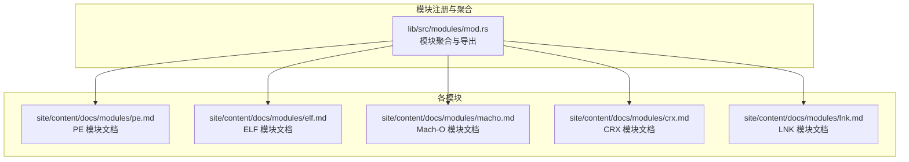
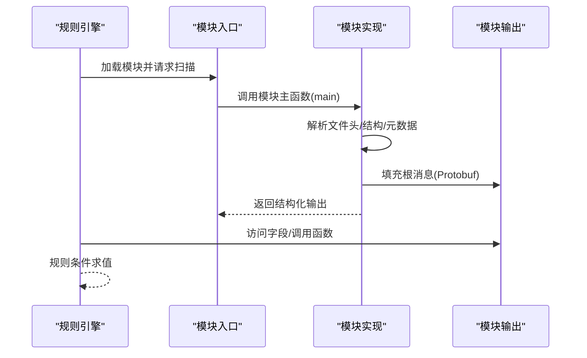
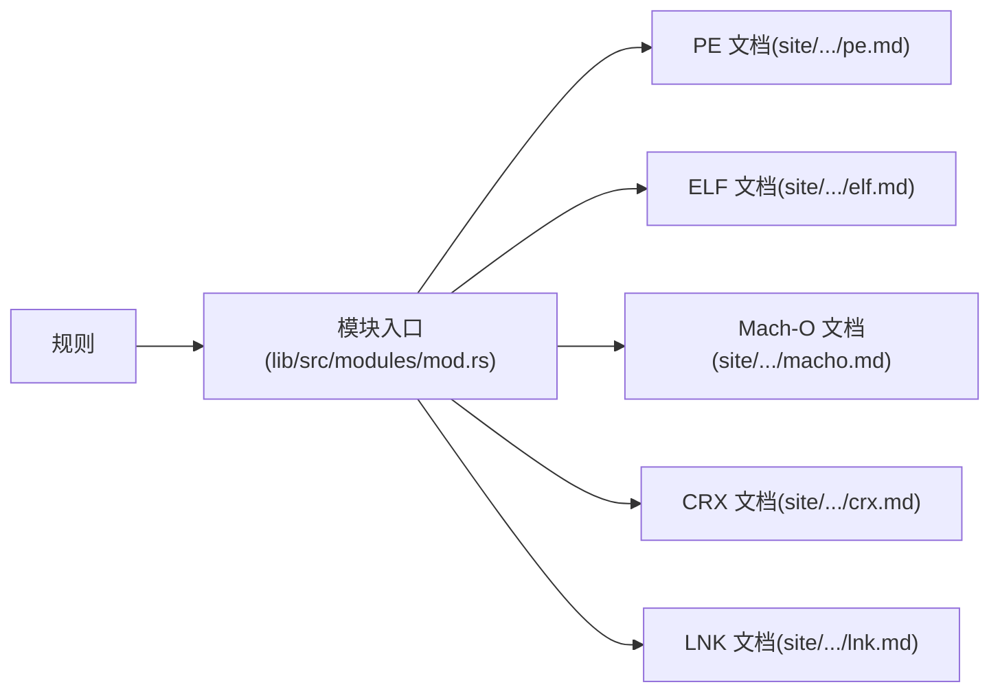

# 文件格式模块

<cite>
**本文引用的文件**
- [pe.md](file://site/content/docs/modules/pe.md)
- [elf.md](file://site/content/docs/modules/elf.md)
- [macho.md](file://site/content/docs/modules/macho.md)
- [crx.md](file://site/content/docs/modules/crx.md)
- [lnk.md](file://site/content/docs/modules/lnk.md)
- [mod.rs](file://lib/src/modules/mod.rs)
- [ModuleDeveloperGuide.md](file://docs/ModuleDeveloperGuide.md)
</cite>

## 目录
1. [简介](#简介)
2. [项目结构](#项目结构)
3. [核心组件](#核心组件)
4. [架构总览](#架构总览)
5. [详细组件分析](#详细组件分析)
6. [依赖关系分析](#依赖关系分析)
7. [性能考量](#性能考量)
8. [故障排查指南](#故障排查指南)
9. [结论](#结论)
10. [附录](#附录)

## 简介
本文件系统性梳理 YARA-X 内置的文件格式解析模块，覆盖以下平台与容器格式：
- PE 模块（Windows 可执行文件）
- ELF 模块（Linux 可执行文件）
- Mach-O 模块（macOS 可执行文件）
- CRX 模块（Chrome 扩展）
- LNK 模块（Windows 快捷方式）

文档将说明每个模块提供的字段与函数、在规则中如何访问文件元数据与结构信息，并给出实际使用示例与常见应用场景。最后提供模块开发指南与扩展方法，帮助开发者基于现有框架快速实现新的文件格式解析模块。

## 项目结构
YARA-X 的模块体系由“协议缓冲区定义 + Rust 主函数 + 导出函数”构成，模块通过统一的入口在扫描时被调用，返回结构化的元数据供规则使用。模块的根消息在各自的 proto 中定义，主函数负责解析输入数据并填充该消息；可选地，模块还可导出若干函数以支持更灵活的查询。

**图表来源**
- [mod.rs:182-219](file://lib/src/modules/mod.rs#L182-L219)

**章节来源**
- [mod.rs:182-219](file://lib/src/modules/mod.rs#L182-L219)

## 核心组件
- 模块入口与聚合
  - 模块在统一入口进行聚合，导出各模块的根消息类型，便于规则引擎按需访问。
- 协议缓冲区（Protobuf）结构
  - 每个模块以 Protobuf 定义其根消息（如 PE、ELF、Mach-O、CRX、Lnk），字段涵盖头部、节表、导入导出、签名等关键元数据。
- 函数导出
  - 模块可导出函数，用于在规则中进行条件判断或查询（如 PE 的 imphash、exports、imports 等）。

**章节来源**
- [mod.rs:182-219](file://lib/src/modules/mod.rs#L182-L219)

## 架构总览
下图展示模块在扫描流程中的角色：规则引擎加载模块，模块解析目标文件并生成结构化输出，规则通过模块名访问字段与函数。

[本图为概念流程示意，不直接映射具体源码文件，故无“图表来源”标注]

## 详细组件分析

### PE 模块（Windows 可执行文件）
- 功能概述
  - 提供对 PE 文件头、目录、节、导入/导出、资源、版本信息、证书、Overlay 等的全面解析。
  - 提供函数用于查询导出符号、导入库/函数、计算校验和、转换 RVA 到文件偏移、生成 imphash、查询 Rich Signature 等。
- 字段与枚举
  - 结构体字段覆盖：是否为 PE、机器类型、子系统、版本信息、特性标志、数据目录、节表、导入/延迟导入/导出详情、资源、签名、Overlay 等。
  - 关键枚举：Machine、Subsystem、OptionalMagic、DirectoryEntry、ImportFlags、SectionCharacteristics 等。
- 函数
  - exports(...)：按名称/正则/序号匹配导出。
  - imports(...)：统计/匹配导入，支持标准/延迟导入组合。
  - is_32bit()/is_64bit()/is_dll()：判定位数与类型。
  - rva_to_offset(rva)：RVA 转换。
  - calculate_checksum()：计算并比对校验和。
  - section_index(...)：按名称或偏移定位节索引。
  - imphash()：生成导入哈希。
  - rich_signature.version/toolid：查询 Rich Signature 统计。
- 实际示例场景
  - 识别单节可执行、检测 DLL 特性、匹配特定导出函数、验证校验和一致性、根据机器类型筛选。
- 使用要点
  - 在规则中通过 pe.<字段> 或 pe.<函数>() 访问；注意导入类型选择（标准/延迟/任意）。

**章节来源**
- [pe.md:21-49](file://site/content/docs/modules/pe.md#L21-L49)
- [pe.md:53-198](file://site/content/docs/modules/pe.md#L53-L198)
- [pe.md:223-286](file://site/content/docs/modules/pe.md#L223-L286)
- [pe.md:571-625](file://site/content/docs/modules/pe.md#L571-L625)

### ELF 模块（Linux 可执行文件）
- 功能概述
  - 提供对 ELF 头、段、节、符号表、动态信息等的解析。
  - 提供函数用于计算 import MD5、telfhash（符号哈希）等。
- 字段与枚举
  - 结构体字段覆盖：类型、机器、OS ABI、入口点、节/段数量、节/段数组、符号表、动态信息等。
  - 关键枚举：Type、Machine、OS ABI、SectionType、SegmentType、SegmentFlags、SymBind/SymType/SymVisibility、DynType 等。
- 函数
  - import_md5()：导入表 MD5。
  - telfhash()：基于符号的相似性哈希。
- 实际示例场景
  - 按机器类型筛选、检查调试信息节、限制段大小、检测共享对象符号表存在性、按动态条目类型过滤。

**章节来源**
- [elf.md:21-38](file://site/content/docs/modules/elf.md#L21-L38)
- [elf.md:42-68](file://site/content/docs/modules/elf.md#L42-L68)
- [elf.md:72-93](file://site/content/docs/modules/elf.md#L72-L93)
- [elf.md:253-312](file://site/content/docs/modules/elf.md#L253-L312)

### Mach-O 模块（macOS 可执行文件）
- 功能概述
  - 提供对 Mach-O 头、段、节、符号、动态链接信息、代码签名、UUID、构建版本、rpath、entitlements、dylib 列表等的解析。
  - 支持在 fat 二进制中按 CPU 类型/子类型定位文件索引与真实入口点。
  - 提供多种哈希函数（dylib_hash、entitlement_hash、export_hash、import_hash、symhash）。
- 字段与枚举
  - 结构体字段覆盖：魔数、CPU 类型/子类型、文件类型、命令数、标志、段数组、dylib 列表、rpath、entitlements、证书、UUID、构建版本、最小版本、导入/导出、链接器选项、fat 头信息等。
  - 关键枚举：HEADER、FILE_TYPE、FILE_FLAG、CPU_TYPE、CPU_ARM_SUBTYPE、CPU_I386_SUBTYPE、DEVICE_TYPE、SECTION_TYPE、SECTION_ATTRIBUTES、SEGMENT_FLAG 等。
- 函数
  - file_index_for_arch(...)：在 fat 二进制中按类型/子类型定位文件索引。
  - entry_point_for_arch(...)：在 fat 二进制中获取指定架构的真实入口点。
  - has_* 系列：has_rpath、has_dylib、has_import、has_export、has_entitlement。
  - 各类哈希：dylib_hash、entitlement_hash、export_hash、import_hash、symhash。
- 实际示例场景
  - 按 CPU 类型筛选、检测特定 rpath、验证 dylib 列表、计算哈希进行聚类、在 fat 二进制中定位目标架构。

**章节来源**
- [macho.md:21-40](file://site/content/docs/modules/macho.md#L21-L40)
- [macho.md:44-293](file://site/content/docs/modules/macho.md#L44-L293)
- [macho.md:295-330](file://site/content/docs/modules/macho.md#L295-L330)
- [macho.md:617-771](file://site/content/docs/modules/macho.md#L617-L771)

### CRX 模块（Chrome 扩展）
- 功能概述
  - 将 CRX 文件视为 ZIP 容器，解析其元数据与数字签名，支持规则基于扩展名称、版本、权限、签名有效性等字段进行匹配。
- 字段
  - 包含：是否为 CRX、版本、头部大小、ID、版本字符串、名称、描述、主页 URL、权限列表、主机权限、可选权限、可选主机权限、签名数组等。
- 实际示例场景
  - 识别 CRX 文件、匹配扩展名称、检查签名是否已验证。

**章节来源**
- [crx.md:21-48](file://site/content/docs/modules/crx.md#L21-L48)
- [crx.md:52-70](file://site/content/docs/modules/crx.md#L52-L70)
- [crx.md:72-92](file://site/content/docs/modules/crx.md#L72-L92)

### LNK 模块（Windows 快捷方式）
- 功能概述
  - 解析 Windows 链接文件（LNK）元数据，暴露目标路径、时间戳、图标、工作目录、命令行参数、驱动器类型、分布式链接跟踪信息等。
- 字段
  - 包含：是否为 LNK、名称、创建/访问/写入时间、目标文件大小、文件属性、图标位置/索引、显示状态、驱动器类型/序列号/卷标、本地基础路径/公共后缀、相对路径、工作目录、命令行参数、覆盖区大小/偏移、跟踪器数据等。
- 实际示例场景
  - 检测 CD-ROM 驱动器上的快捷方式、最大化窗口启动、特定机器 ID 的分布式跟踪信息。

**章节来源**
- [lnk.md:21-50](file://site/content/docs/modules/lnk.md#L21-L50)
- [lnk.md:52-68](file://site/content/docs/modules/lnk.md#L52-L68)
- [lnk.md:80-132](file://site/content/docs/modules/lnk.md#L80-L132)

## 依赖关系分析
- 模块聚合
  - 模块在统一入口导出，规则引擎通过模块名访问对应根消息类型。
- 文档与实现的耦合
  - 每个模块的文档页详细列出字段、枚举、函数，便于规则编写者查阅；实现细节由模块主函数与导出函数完成。
- 规则访问路径
  - 规则中通过 import "模块名"，然后使用模块名访问字段与函数，如 pe.is_pe、elf.machine、macho.has_rpath 等。

**图表来源**
- [mod.rs:182-219](file://lib/src/modules/mod.rs#L182-L219)

**章节来源**
- [mod.rs:182-219](file://lib/src/modules/mod.rs#L182-L219)

## 性能考量
- 按需解析
  - 模块仅在扫描命中时解析文件，避免不必要的开销。
- 结构化输出
  - 通过 Protobuf 输出，字段按需访问，减少重复解析。
- 函数优化
  - 导出函数通常基于已解析的结构进行快速查询（如 imphash、telfhash、哈希族函数），避免二次全量解析。
- I/O 与内存
  - 对大文件（如资源、Overlay、签名链）建议仅在规则中按需访问，避免一次性读取全部内容。

[本节为通用指导，不直接分析具体源码文件，故无“章节来源”标注]

## 故障排查指南
- 字段缺失或为 undefined
  - 某些字段可能在特定文件中不存在，返回 undefined；规则中应使用条件判断或默认值处理。
- 导入/导出查询失败
  - 确认导入类型选择（标准/延迟/任意），以及 DLL 名称大小写敏感性。
- 哈希不一致
  - 不同工具生成哈希的规范化策略不同，需确保使用模块提供的函数而非外部工具自行计算。
- fat 二进制定位错误
  - 在 Mach-O fat 二进制中，需同时考虑 CPU 类型与子类型，确保定位到正确的文件索引与入口点。
- 时间戳与权限
  - 注意时间戳单位（Unix 时间）与权限掩码的含义，避免误判。

[本节为通用指导，不直接分析具体源码文件，故无“章节来源”标注]

## 结论
YARA-X 的文件格式模块以清晰的 Protobuf 结构与函数导出为核心，为规则编写者提供了强大的元数据访问能力。PE/ELF/Mach-O/CRX/LNK 模块分别覆盖主流平台与容器格式，既满足日常规则需求，也为扩展新格式提供了标准化的开发路径。

## 附录

### 模块开发指南与扩展方法
- 定义模块结构
  - 使用 Protobuf 定义模块根消息，设置模块选项（名称、根消息、Rust 模块名、Cargo 特性）。
- 实现主函数
  - 编写模块主函数，接收文件字节切片，解析并填充根消息。
- 导出函数
  - 通过 #[module_export] 导出函数，支持在规则中调用；注意参数与返回类型的限制。
- 依赖与特性
  - 可选依赖通过 Cargo 特性控制，默认不启用，按需开启。
- YAML 输出格式化
  - 可通过字段选项配置十六进制/时间戳等输出格式，提升可读性。
- 测试与数据准备
  - 按平台准备测试样本，归档并转换回原始格式，确保跨平台一致性。

**章节来源**
- [ModuleDeveloperGuide.md:40-183](file://docs/ModuleDeveloperGuide.md#L40-L183)
- [ModuleDeveloperGuide.md:288-323](file://docs/ModuleDeveloperGuide.md#L288-L323)
- [ModuleDeveloperGuide.md:466-546](file://docs/ModuleDeveloperGuide.md#L466-L546)
- [ModuleDeveloperGuide.md:700-746](file://docs/ModuleDeveloperGuide.md#L700-L746)
- [ModuleDeveloperGuide.md:747-771](file://docs/ModuleDeveloperGuide.md#L747-L771)