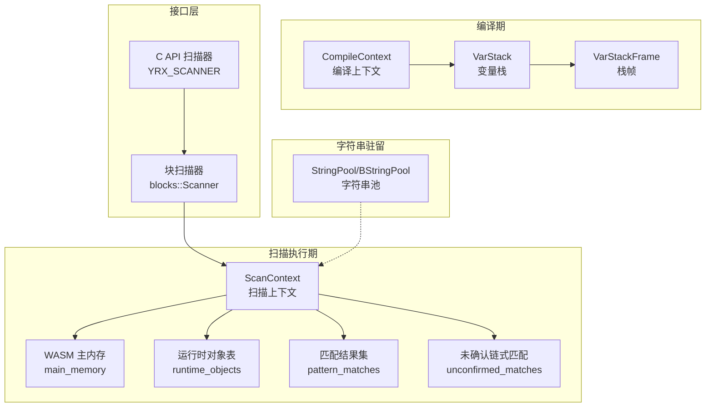
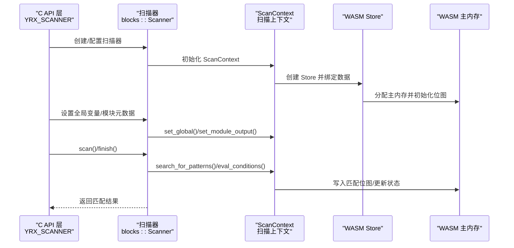
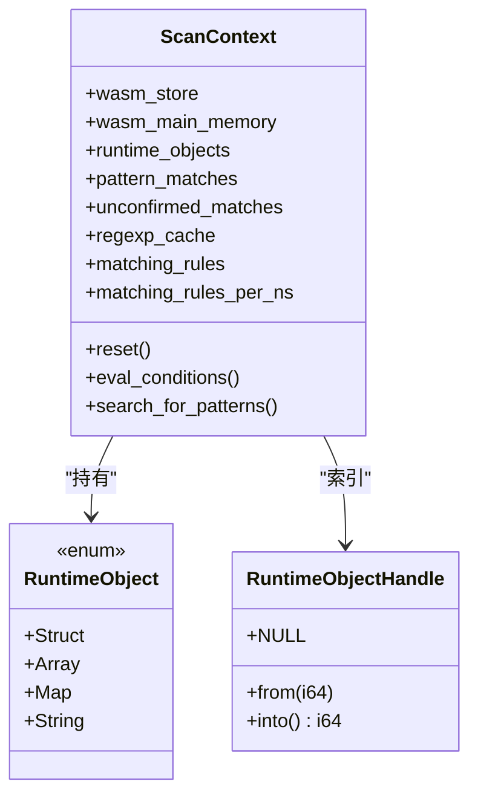
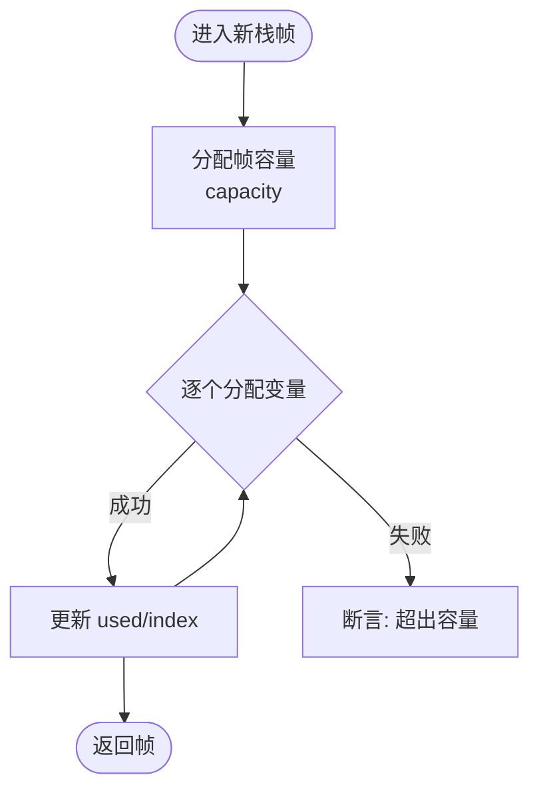
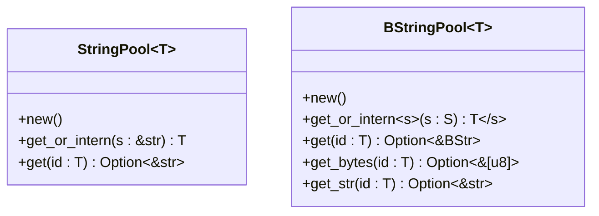
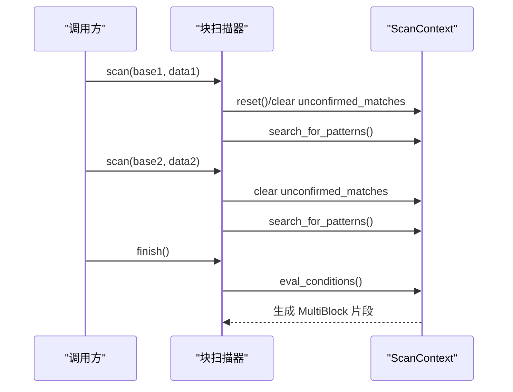
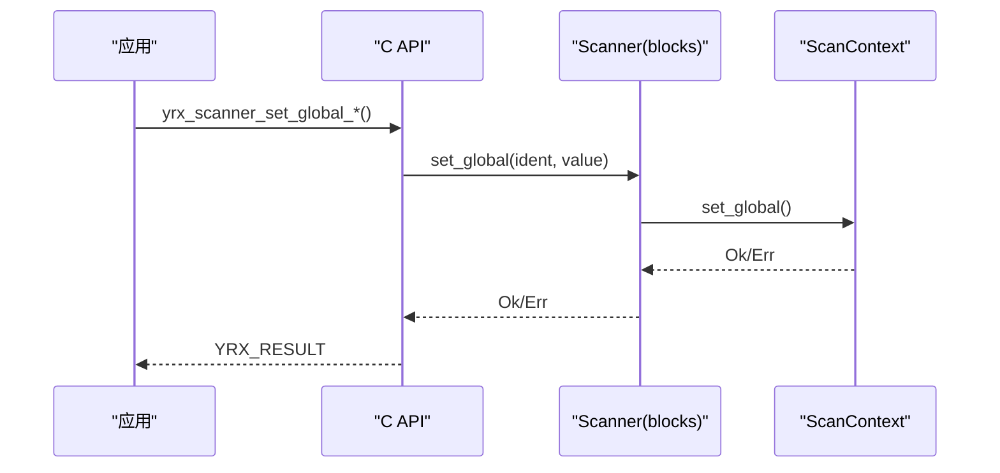
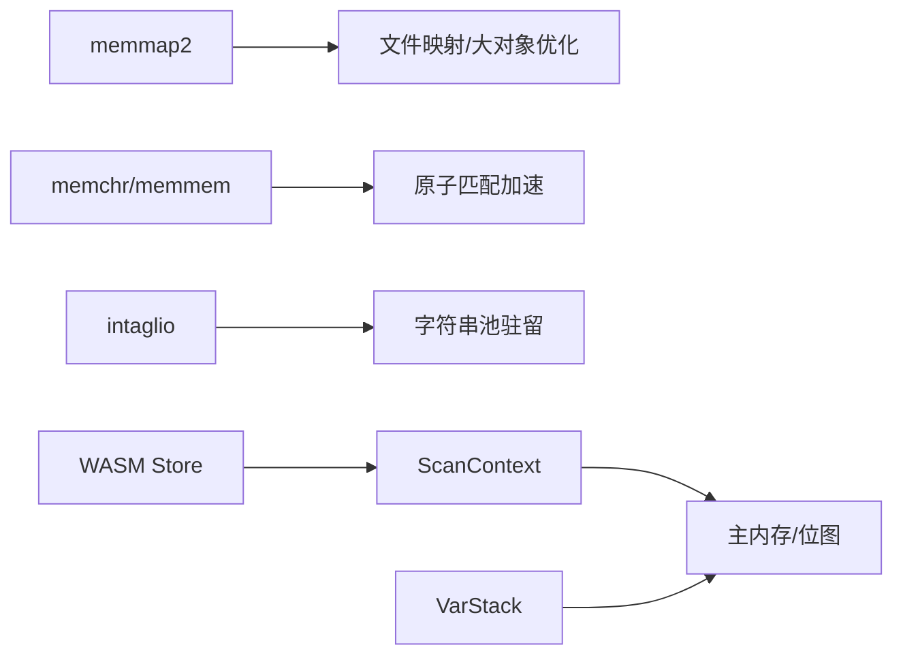

# 内存管理

<cite>
**本文引用的文件**
- [lib/src/scanner/context.rs](file://lib/src/scanner/context.rs)
- [lib/src/compiler/context.rs](file://lib/src/compiler/context.rs)
- [lib/src/string_pool.rs](file://lib/src/string_pool.rs)
- [lib/src/scanner/blocks.rs](file://lib/src/scanner/blocks.rs)
- [capi/src/scanner.rs](file://capi/src/scanner.rs)
- [Cargo.lock](file://Cargo.lock)
</cite>

## 目录
1. [简介](#简介)
2. [项目结构与内存相关模块](#项目结构与内存相关模块)
3. [核心组件与内存策略](#核心组件与内存策略)
4. [架构总览](#架构总览)
5. [详细组件分析](#详细组件分析)
6. [依赖关系分析](#依赖关系分析)
7. [性能考量与优化建议](#性能考量与优化建议)
8. [故障排除指南](#故障排除指南)
9. [结论](#结论)

## 简介
本文件面向系统架构师与内存优化专家，系统性阐述 YARA-X 的内存管理策略与实现细节，涵盖：
- 内存池与字符串驻留（string interning）
- 变量栈与 WASM 主内存布局
- 运行时对象的引用计数与生命周期管理
- 扫描上下文的分配与释放策略
- 大对象优化与内存碎片管理
- 内存映射文件与块扫描模式下的数据一致性
- 内存使用监控、泄漏检测与性能分析工具
- 最佳实践与故障排除

## 项目结构与内存相关模块
- 扫描器上下文：负责扫描状态、匹配结果、WASM 存储与主内存、运行时对象表等。
- 编译器上下文：负责变量栈帧、变量分配与内存布局规划。
- 字符串池：通过符号表进行字符串驻留，减少重复存储。
- 块扫描器：支持分块扫描，维护片段映射与跨块一致性约束。
- C 接口层：对外暴露扫描器生命周期与全局变量设置。

图示来源
- [lib/src/scanner/context.rs:66-165](file://lib/src/scanner/context.rs#L66-L165)
- [lib/src/compiler/context.rs:150-228](file://lib/src/compiler/context.rs#L150-L228)
- [lib/src/string_pool.rs:18-65](file://lib/src/string_pool.rs#L18-L65)
- [lib/src/scanner/blocks.rs:82-99](file://lib/src/scanner/blocks.rs#L82-L99)
- [capi/src/scanner.rs:18-99](file://capi/src/scanner.rs#L18-L99)

章节来源
- [lib/src/scanner/context.rs:66-165](file://lib/src/scanner/context.rs#L66-L165)
- [lib/src/compiler/context.rs:150-228](file://lib/src/compiler/context.rs#L150-L228)
- [lib/src/string_pool.rs:18-65](file://lib/src/string_pool.rs#L18-L65)
- [lib/src/scanner/blocks.rs:82-99](file://lib/src/scanner/blocks.rs#L82-L99)
- [capi/src/scanner.rs:18-99](file://capi/src/scanner.rs#L18-L99)

## 核心组件与内存策略
- WASM 主内存与位图
  - ScanContext 在 WASM Store 中持有主内存句柄，用于存放规则/模式匹配位图、全局变量、运行时对象等。
  - 匹配位图分为“规则匹配位图”和“模式匹配位图”，分别占用连续内存区域，按字节对齐。
- 变量栈与局部变量
  - 编译期在 WASM 主内存中预留变量栈空间，按 64 位槽位对齐；栈帧容量受 MAX_VARS 限制，避免溢出。
  - 运行时通过 VarStackFrame::new_var 分配槽位，超出容量或越界会触发断言。
- 运行时对象与引用计数
  - 运行时对象（Struct/Array/Map/String）以 Rc 包装，通过 IndexMap 以不透明句柄索引，避免跨边界传递复杂对象。
  - 每次扫描结束后清理 runtime_objects，防止残留对象导致泄漏。
- 字符串驻留与池化
  - StringPool/BStringPool 使用符号表进行驻留，相同内容仅保留一份，显著降低重复字符串的内存占用。
- 匹配结果与链式匹配
  - PatternMatches 维护每个模式的匹配列表；链式模式采用 unconfirmed_matches 缓存中间结果，确认后统一写入。
- 超时与心跳
  - 通过 wasmtime 的 epoch 驱动心跳线程，结合 deadline 计数器实现超时控制，避免长时间扫描导致资源耗尽。

章节来源
- [lib/src/scanner/context.rs:1766-1918](file://lib/src/scanner/context.rs#L1766-L1918)
- [lib/src/compiler/context.rs:150-228](file://lib/src/compiler/context.rs#L150-L228)
- [lib/src/string_pool.rs:18-65](file://lib/src/string_pool.rs#L18-L65)
- [lib/src/scanner/context.rs:477-585](file://lib/src/scanner/context.rs#L477-L585)

## 架构总览
下图展示从 C API 到扫描器再到 WASM 执行环境的内存布局与交互：

图示来源
- [capi/src/scanner.rs:18-99](file://capi/src/scanner.rs#L18-L99)
- [lib/src/scanner/blocks.rs:82-99](file://lib/src/scanner/blocks.rs#L82-L99)
- [lib/src/scanner/context.rs:1766-1918](file://lib/src/scanner/context.rs#L1766-L1918)

## 详细组件分析

### 扫描上下文（ScanContext）与内存布局
- 关键字段
  - wasm_store/wasm_main_memory：指向 WASM Store 与主内存，用于读写匹配位图与全局变量。
  - runtime_objects：IndexMap，保存运行时对象（Struct/Array/Map/String），键为不透明句柄。
  - pattern_matches/unconfirmed_matches：分别记录已确认与未确认的链式匹配。
  - regexp_cache：缓存正则表达式，避免重复编译。
  - matching_rules/matching_rules_per_ns：规则匹配跟踪与排序。
- 生命周期管理
  - reset() 清空匹配状态、位图与运行时对象，重置 deadline 与超时回调。
  - eval_conditions() 执行 WASM 条件函数，期间可记录规则/模式耗时（在启用特性时）。
- 内存分配策略
  - 主内存大小按规则数与模式数计算，确保位图区域足够。
  - 位图起始基址与长度由常量与规则/模式数量推导，保证连续且对齐。

图示来源
- [lib/src/scanner/context.rs:66-165](file://lib/src/scanner/context.rs#L66-L165)
- [lib/src/scanner/context.rs:1701-1743](file://lib/src/scanner/context.rs#L1701-L1743)
- [lib/src/scanner/context.rs:1745-1764](file://lib/src/scanner/context.rs#L1745-L1764)

章节来源
- [lib/src/scanner/context.rs:66-165](file://lib/src/scanner/context.rs#L66-L165)
- [lib/src/scanner/context.rs:477-585](file://lib/src/scanner/context.rs#L477-L585)
- [lib/src/scanner/context.rs:1766-1918](file://lib/src/scanner/context.rs#L1766-L1918)

### 编译期变量栈与内存布局
- VarStack/VarStackFrame
  - 栈帧容量固定，按帧分配槽位；超出 wasm::MAX_VARS 或越界触发断言。
  - Var::index() 与 Var::mem_size() 定义了变量在主内存中的槽位与对齐方式。
- 变量存储与加载
  - set_var/load_var 通过内存偏移访问主内存，布尔/整型/浮点/指针类型采用不同加载/存储方式。
- 作用域与回滚
  - new_frame/unwind 保证嵌套循环/条件的作用域正确释放，避免“双释放”。

图示来源
- [lib/src/compiler/context.rs:150-228](file://lib/src/compiler/context.rs#L150-L228)
- [lib/src/compiler/emit.rs:2359-2517](file://lib/src/compiler/emit.rs#L2359-L2517)

章节来源
- [lib/src/compiler/context.rs:150-228](file://lib/src/compiler/context.rs#L150-L228)
- [lib/src/compiler/emit.rs:2359-2517](file://lib/src/compiler/emit.rs#L2359-L2517)

### 字符串池与大对象优化
- 字符串池
  - StringPool/BStringPool 使用符号表驻留字符串，重复内容共享同一份存储，显著降低内存占用。
  - 提供序列化/反序列化支持，便于持久化与传输。
- 大对象优化
  - 运行时对象通过 Rc 引用计数共享，避免复制；仅在需要修改时进行写时复制（Copy-on-Write）语义由 Rc 实现。
  - 对于大型匹配片段，块扫描器仅保存最长片段，避免冗余拷贝。

图示来源
- [lib/src/string_pool.rs:18-65](file://lib/src/string_pool.rs#L18-L65)
- [lib/src/string_pool.rs:134-200](file://lib/src/string_pool.rs#L134-L200)

章节来源
- [lib/src/string_pool.rs:18-65](file://lib/src/string_pool.rs#L18-L65)
- [lib/src/string_pool.rs:134-200](file://lib/src/string_pool.rs#L134-L200)

### 块扫描与内存映射一致性
- 块扫描器
  - 支持多块输入，每块独立扫描；跨块匹配被禁止，以简化一致性与性能。
  - 未确认匹配在块间切换时清空，防止跨块误确认。
- 数据一致性
  - 当多块重叠时，用户需保证相同区域内容一致；否则可能导致误匹配或验证失败。
- 片段收集
  - 将匹配片段按偏移存入 BTreeMap，仅保留更长片段，避免冗余。

图示来源
- [lib/src/scanner/blocks.rs:100-217](file://lib/src/scanner/blocks.rs#L100-L217)

章节来源
- [lib/src/scanner/blocks.rs:100-217](file://lib/src/scanner/blocks.rs#L100-L217)

### C API 与全局变量设置
- 全局变量设置
  - 提供 set_global_str/bool/int/float/json 等接口，内部委托给扫描器 set_global。
  - 支持模块元数据注入与模块输出设置（单块模式）。
- 状态机与错误传播
  - C API 内部封装 InnerScanner（SingleBlock/MultiBlock/None），根据当前状态返回相应错误码。

图示来源
- [capi/src/scanner.rs:537-634](file://capi/src/scanner.rs#L537-L634)

章节来源
- [capi/src/scanner.rs:537-634](file://capi/src/scanner.rs#L537-L634)

## 依赖关系分析
- 外部依赖与内存相关
  - memmap2：提供内存映射能力，适用于大文件扫描场景。
  - memchr/memmem：高性能字节串查找与子串匹配，用于加速原子匹配阶段。
  - intaglio：符号表实现，支撑字符串池驻留。
- 内部耦合
  - ScanContext 与 WASM Store/内存强耦合，通过非空指针与 Pin<Box<...>> 保证生命周期安全。
  - VarStack 与 WASM 主内存布局紧密耦合，变量槽位与对齐方式由 emit 阶段确定。

图示来源
- [Cargo.lock:2095-2102](file://Cargo.lock#L2095-L2102)
- [Cargo.lock:2080-2084](file://Cargo.lock#L2080-L2084)
- [Cargo.lock:2104-2108](file://Cargo.lock#L2104-L2108)

章节来源
- [Cargo.lock:2080-2102](file://Cargo.lock#L2080-L2102)
- [Cargo.lock:2104-2108](file://Cargo.lock#L2104-L2108)

## 性能考量与优化建议
- 内存池与驻留
  - 优先使用字符串池，减少重复字符串的内存占用与比较开销。
  - 对热点正则表达式启用 regexp_cache，避免重复编译。
- 变量栈与内存对齐
  - 合理规划循环/嵌套结构的栈帧大小，避免频繁扩容与越界断言。
  - 利用 Var::mem_size() 的 64 位槽位对齐，减少内存碎片。
- 匹配策略
  - 对于链式模式，尽量缩小 gap 范围，减少 unconfirmed_matches 的规模。
  - 控制 max_matches_per_pattern，避免匹配过多导致内存膨胀。
- 超时与并发
  - 合理设置 scan_timeout，配合心跳线程及时中断长耗时操作。
  - 单块扫描模式下禁用依赖全文件的模块与函数，避免 undefined 与无效计算。
- 大对象优化
  - 使用 Rc 共享大型结构体，避免深拷贝；仅在必要时进行写时复制。
  - 对于超大匹配片段，优先保留最长片段，减少片段集合大小。

## 故障排除指南
- 常见问题与定位
  - 变量栈溢出：检查嵌套循环深度与帧容量，必要时拆分逻辑或增大 MAX_VARS（编译期限制）。
  - 运行时对象泄漏：确认每次扫描后是否调用 reset() 清理 runtime_objects。
  - 跨块误匹配：确保重叠块内容一致，或避免在块扫描模式下使用跨块匹配规则。
  - 正则编译开销高：启用 regexp_cache 或预编译常用正则。
  - 超时频繁：检查规则复杂度与数据规模，适当放宽超时或优化规则。
- 监控与诊断
  - 规则级耗时：启用 rules-profiling 特性，使用 slowest_rules/clear_profiling_data 分析瓶颈。
  - 匹配位图异常：核对位图基址与长度计算，确保 num_rules 与 num_patterns 正确。
- 工具与方法
  - 使用 C API 的迭代慢规则接口输出耗时统计。
  - 在调试构建中开启一致性校验（重叠块匹配时），捕获潜在数据不一致。

章节来源
- [lib/src/scanner/context.rs:167-236](file://lib/src/scanner/context.rs#L167-L236)
- [lib/src/scanner/context.rs:477-585](file://lib/src/scanner/context.rs#L477-L585)
- [lib/src/scanner/blocks.rs:70-82](file://lib/src/scanner/blocks.rs#L70-L82)
- [capi/src/scanner.rs:662-722](file://capi/src/scanner.rs#L662-L722)

## 结论
YARA-X 的内存管理围绕“集中式 WASM 主内存 + 符号表驻留 + 引用计数共享”的策略展开，通过变量栈、匹配位图、运行时对象表与字符串池协同工作，实现了高效、可控且可扩展的扫描内存模型。结合块扫描的一致性约束与超时机制，能够在大规模数据与复杂规则场景下保持稳定性能。建议在工程实践中充分利用字符串池、正则缓存与匹配上限控制，并通过 profiling 工具持续优化热点路径。