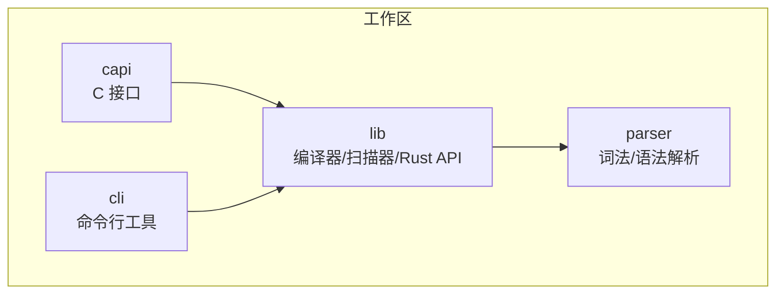
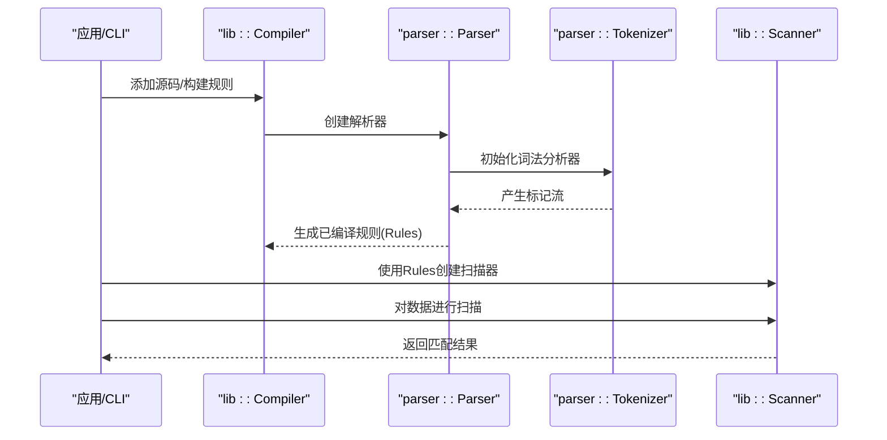
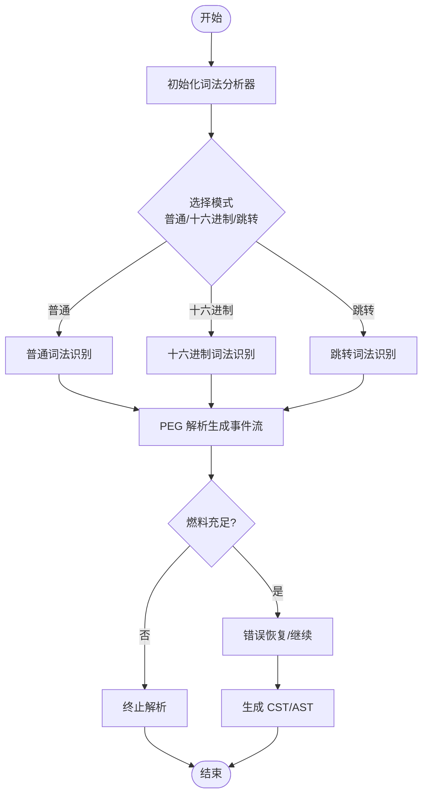
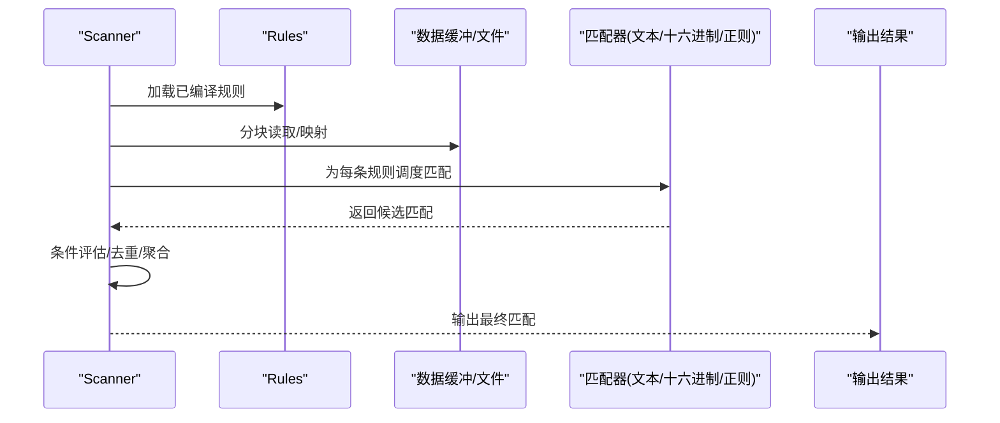
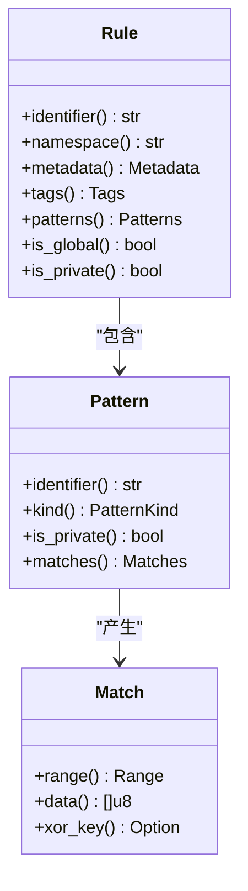
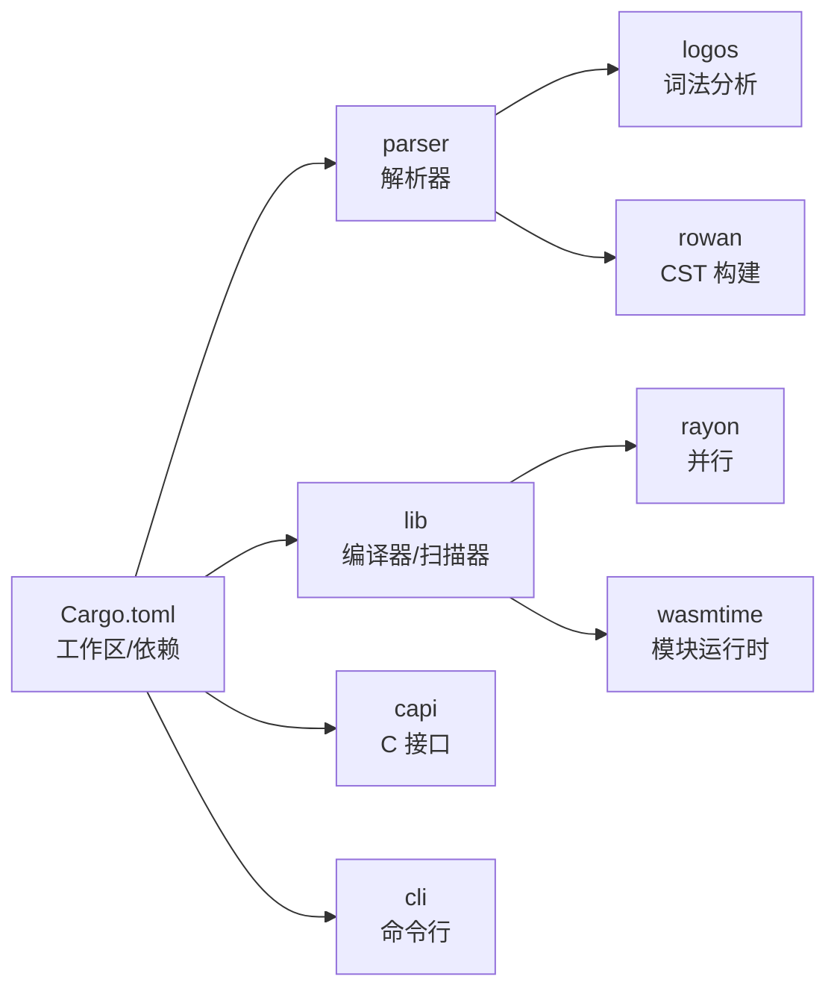

# 核心引擎

<cite>
**本文引用的文件**
- [Cargo.toml](file://Cargo.toml)
- [lib/src/lib.rs](file://lib/src/lib.rs)
- [parser/src/lib.rs](file://parser/src/lib.rs)
- [parser/src/tokenizer/mod.rs](file://parser/src/tokenizer/mod.rs)
- [parser/src/parser/mod.rs](file://parser/src/parser/mod.rs)
- [lib/src/models.rs](file://lib/src/models.rs)
- [capi/src/lib.rs](file://capi/src/lib.rs)
- [cli/src/main.rs](file://cli/src/main.rs)
</cite>

## 目录
1. [简介](#简介)
2. [项目结构](#项目结构)
3. [核心组件](#核心组件)
4. [架构总览](#架构总览)
5. [详细组件分析](#详细组件分析)
6. [依赖关系分析](#依赖关系分析)
7. [性能考量](#性能考量)
8. [故障排查指南](#故障排查指南)
9. [结论](#结论)
10. [附录](#附录)

## 简介
本文件面向高级用户与贡献者，系统化阐述 YARA-X 核心引擎的实现与设计，重点覆盖以下方面：
- 规则编译器：词法分析、语法分析、中间表示生成与代码优化
- 扫描器执行机制：模式匹配算法、内存管理、并行处理与性能优化
- 编译期优化：常量折叠、条件简化、原子匹配等
- 数据结构设计、内存布局与资源管理
- 性能调优指南与监控指标

## 项目结构
YARA-X 采用多 crate 的工作区组织方式，核心能力由 lib、parser、capi、cli 等模块协同完成。其中：
- lib 提供编译器与扫描器的 Rust API、模型定义与运行时支持
- parser 负责将 YARA 源码解析为 CST/AST，并提供错误恢复与容错能力
- capi 提供 C 可兼容接口，便于在其他语言或工具链中集成
- cli 提供命令行入口与子命令，支撑检查、格式化、编译、扫描等场景

图表来源
- [Cargo.toml:17-29](file://Cargo.toml#L17-L29)
- [lib/src/lib.rs:48-71](file://lib/src/lib.rs#L48-L71)

章节来源
- [Cargo.toml:17-29](file://Cargo.toml#L17-L29)
- [lib/src/lib.rs:48-71](file://lib/src/lib.rs#L48-L71)

## 核心组件
- 编译器（Compiler）：接收 YARA 源码，产出可被扫描器使用的已编译规则集（Rules）
- 扫描器（Scanner）：基于已编译规则对内存缓冲或文件进行高效匹配
- 解析器（Parser）：基于手工实现的 PEG 解析器，生成 CST/AST
- 词法分析器（Tokenizer）：基于 logos 的三模式词法分析（普通/十六进制模式/跳转模式）

章节来源
- [lib/src/lib.rs:48-71](file://lib/src/lib.rs#L48-L71)
- [parser/src/lib.rs:27-36](file://parser/src/lib.rs#L27-L36)
- [parser/src/tokenizer/mod.rs:57-67](file://parser/src/tokenizer/mod.rs#L57-L67)
- [parser/src/parser/mod.rs:38-48](file://parser/src/parser/mod.rs#L38-L48)

## 架构总览
下图展示从源码到扫描结果的关键流程：CLI/应用通过 lib 调用编译器，生成 Rules；随后使用 Scanner 对目标数据进行扫描，返回匹配结果。

图表来源
- [lib/src/lib.rs:48-71](file://lib/src/lib.rs#L48-L71)
- [parser/src/lib.rs:27-36](file://parser/src/lib.rs#L27-L36)
- [parser/src/tokenizer/mod.rs:57-67](file://parser/src/tokenizer/mod.rs#L57-L67)
- [parser/src/parser/mod.rs:38-48](file://parser/src/parser/mod.rs#L38-L48)

## 详细组件分析

### 1) 规则编译器与解析管线
- 词法分析（Tokenizer）
  - 支持三种模式：普通模式、十六进制模式、十六进制跳转模式
  - 在解析器进入十六进制块或跳转表达式时切换模式，保证字面语义正确
  - 遇到无效 UTF-8 字节时，以特殊标记记录并继续解析
- 语法分析（Parser）
  - 手写 PEG 解析器，逐个顶层项（导入/规则）惰性解析，降低内存占用
  - 错误恢复：遇到语法错误后尝试恢复，生成包含错误节点的 CST
  - 内置燃料限制（fuel）防止病态输入导致长时间解析
- 中间表示与优化
  - 解析阶段即进行语义校验与错误收集，避免后续阶段重复开销
  - 通过 Packrat 风格缓存失败状态，加速回溯路径

图表来源
- [parser/src/tokenizer/mod.rs:57-67](file://parser/src/tokenizer/mod.rs#L57-L67)
- [parser/src/tokenizer/mod.rs:160-193](file://parser/src/tokenizer/mod.rs#L160-L193)
- [parser/src/parser/mod.rs:208-227](file://parser/src/parser/mod.rs#L208-L227)
- [parser/src/parser/mod.rs:234-281](file://parser/src/parser/mod.rs#L234-L281)

章节来源
- [parser/src/tokenizer/mod.rs:57-67](file://parser/src/tokenizer/mod.rs#L57-L67)
- [parser/src/tokenizer/mod.rs:160-193](file://parser/src/tokenizer/mod.rs#L160-L193)
- [parser/src/parser/mod.rs:208-227](file://parser/src/parser/mod.rs#L208-L227)
- [parser/src/parser/mod.rs:234-281](file://parser/src/parser/mod.rs#L234-L281)

### 2) 扫描器执行机制与模式匹配
- 扫描器职责
  - 基于已编译规则对目标数据进行匹配
  - 支持模块输出、元数据访问、匹配片段提取
- 匹配流程
  - 将规则转换为可执行的内部表示，按需调度匹配器
  - 对文本、十六进制、正则等不同模式采用相应算法
- 并行与内存
  - 利用线程池与分块扫描策略提升吞吐
  - 通过只读共享结构与局部上下文减少锁竞争
- 性能优化
  - 条件简化：在编译期将恒真/恒假条件折叠
  - 原子匹配：优先使用确定性、低开销的原子模式
  - 布隆过滤/启发式预筛：减少不必要的全量扫描

图表来源
- [lib/src/lib.rs:62-71](file://lib/src/lib.rs#L62-L71)
- [lib/src/models.rs:22-84](file://lib/src/models.rs#L22-L84)

章节来源
- [lib/src/lib.rs:62-71](file://lib/src/lib.rs#L62-L71)
- [lib/src/models.rs:22-84](file://lib/src/models.rs#L22-L84)

### 3) 数据结构与内存布局
- 规则与模式
  - 规则包含标识、命名空间、元数据、标签、模式列表等
  - 模式分为文本、十六进制、正则三类，分别对应不同的匹配器
- 匹配结果
  - 匹配包含偏移范围、数据片段、可选的 XOR 密钥等
- 内存管理
  - 字符串与标识通过池化存储，避免重复分配
  - 扫描上下文按需持有片段视图，避免复制

图表来源
- [lib/src/models.rs:22-84](file://lib/src/models.rs#L22-L84)
- [lib/src/models.rs:314-353](file://lib/src/models.rs#L314-L353)
- [lib/src/models.rs:376-407](file://lib/src/models.rs#L376-L407)

章节来源
- [lib/src/models.rs:22-84](file://lib/src/models.rs#L22-L84)
- [lib/src/models.rs:314-353](file://lib/src/models.rs#L314-L353)
- [lib/src/models.rs:376-407](file://lib/src/models.rs#L376-L407)

### 4) 编译期优化技术
- 常量折叠
  - 在解析与 AST 构建阶段，对可计算的常量表达式进行折叠
- 条件简化
  - 将恒真/恒假条件在编译期消除，减少运行时判断
- 原子匹配
  - 优先保留高命中率、低复杂度的原子模式，减少回溯
- 其他
  - 通过错误恢复与容错，确保在不完美规则下仍能生成可用的中间表示

章节来源
- [parser/src/parser/mod.rs:109-135](file://parser/src/parser/mod.rs#L109-L135)
- [parser/src/parser/mod.rs:189-208](file://parser/src/parser/mod.rs#L189-L208)

### 5) C API 与外部集成
- C API 提供编译、扫描、资源销毁等接口，线程本地存储错误信息
- 支持动态/静态链接，跨平台构建

章节来源
- [capi/src/lib.rs:118-120](file://capi/src/lib.rs#L118-L120)
- [capi/src/lib.rs:216-237](file://capi/src/lib.rs#L216-L237)

### 6) 命令行入口与配置
- CLI 提供检查、格式化、编译、扫描等子命令
- 支持配置文件加载与日志开关

章节来源
- [cli/src/main.rs:31-107](file://cli/src/main.rs#L31-L107)

## 依赖关系分析
- 工作区统一版本与特性控制，解析器在 dev 配置下启用优化以避免递归栈溢出
- 关键外部依赖：logos（词法）、rowan（CST）、rayon（并行）、wasmtime（可选模块运行时）

图表来源
- [Cargo.toml:33-115](file://Cargo.toml#L33-L115)
- [parser/src/lib.rs:27-36](file://parser/src/lib.rs#L27-L36)

章节来源
- [Cargo.toml:33-115](file://Cargo.toml#L33-L115)
- [parser/src/lib.rs:27-36](file://parser/src/lib.rs#L27-L36)

## 性能考量
- 解析阶段优化
  - Packrat 失败缓存与燃料限制，避免灾难性回溯
  - 惰性解析顶层项，降低峰值内存
- 扫描阶段优化
  - 条件简化与原子匹配减少运行时判断与回溯
  - 并行分块扫描与只读共享结构，提升吞吐与降低内存复制
- 运行时配置
  - release-lto 配置开启链接时优化，适合发布二进制
  - 解析器在 dev 下启用基础优化，避免递归导致的栈溢出

章节来源
- [Cargo.toml:122-135](file://Cargo.toml#L122-L135)
- [parser/src/parser/mod.rs:189-208](file://parser/src/parser/mod.rs#L189-L208)

## 故障排查指南
- 编译错误
  - C API 返回码区分语法、变量、扫描、序列化等错误类型
  - 使用线程本地错误消息查询最近一次错误
- 扫描异常
  - 超时、无效参数、状态不一致等情况均有明确返回码
- 日志与诊断
  - CLI 在启用 logging 特性时输出调试信息
  - 结合规则级“linters”与“warnings”模块进行静态检查

章节来源
- [capi/src/lib.rs:129-161](file://capi/src/lib.rs#L129-L161)
- [capi/src/lib.rs:163-179](file://capi/src/lib.rs#L163-L179)
- [lib/src/lib.rs:91-114](file://lib/src/lib.rs#L91-L114)
- [cli/src/main.rs:38-39](file://cli/src/main.rs#L38-L39)

## 结论
YARA-X 通过清晰的模块边界与稳健的解析/扫描管线，在保持与现有 YARA 规则高度兼容的同时，提供了更强的安全性与更高的性能。其编译期优化与运行时并行策略共同构成了高效的模式匹配基础设施。建议在生产环境中结合 release-lto 与合理的扫描策略，以获得最佳吞吐与稳定性。

## 附录
- 版本信息：当前版本号由包元数据导出，便于运行时查询
- 终结与资源回收：动态库卸载时需调用终结函数以释放全局状态

章节来源
- [lib/src/lib.rs:88-89](file://lib/src/lib.rs#L88-L89)
- [lib/src/lib.rs:175-177](file://lib/src/lib.rs#L175-L177)