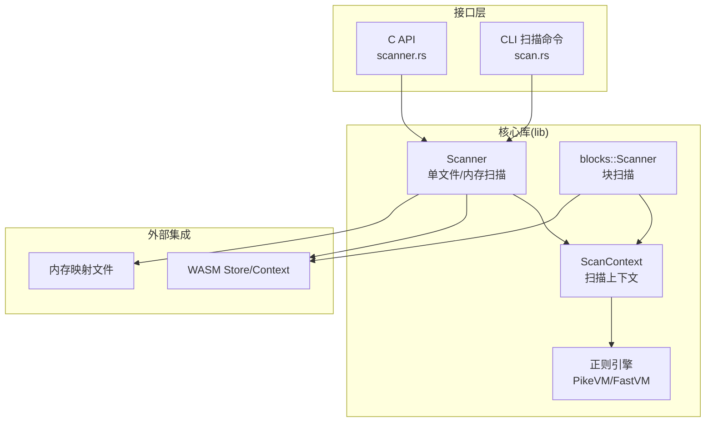
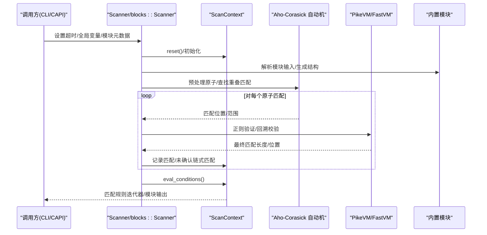
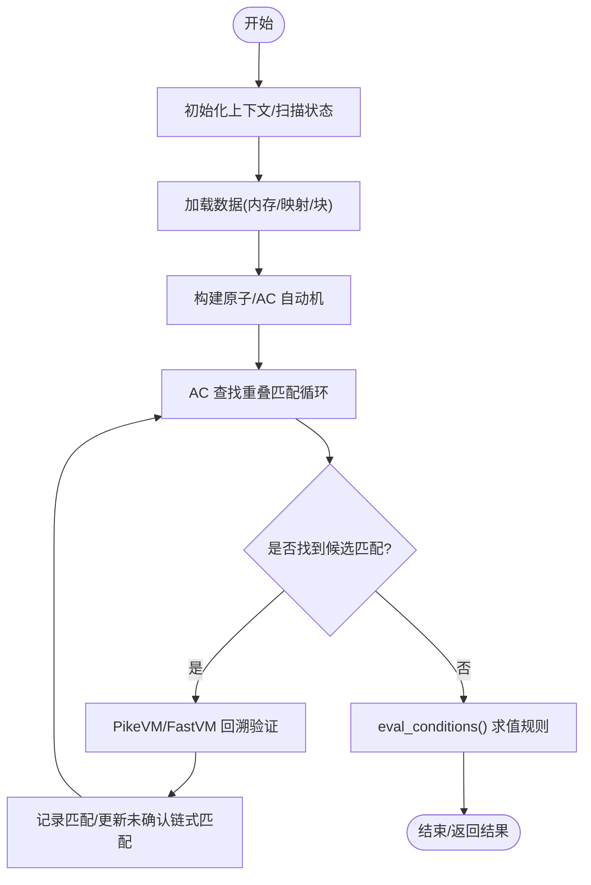
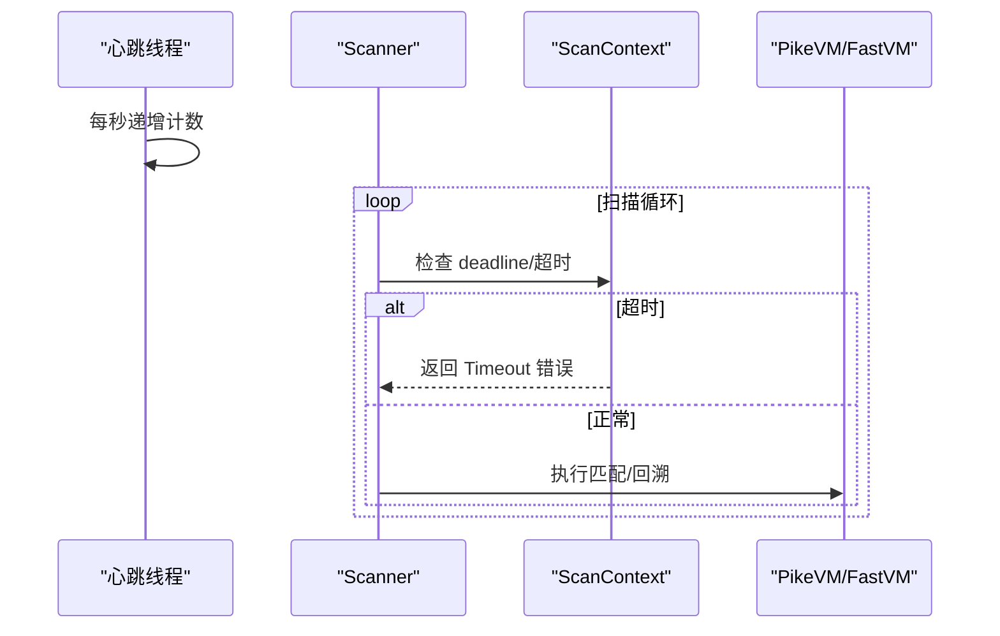
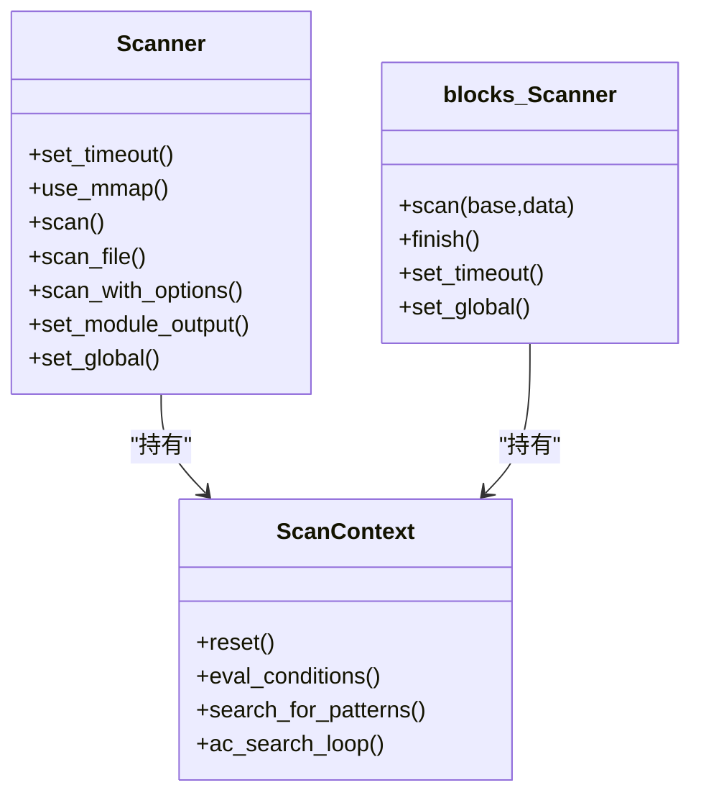
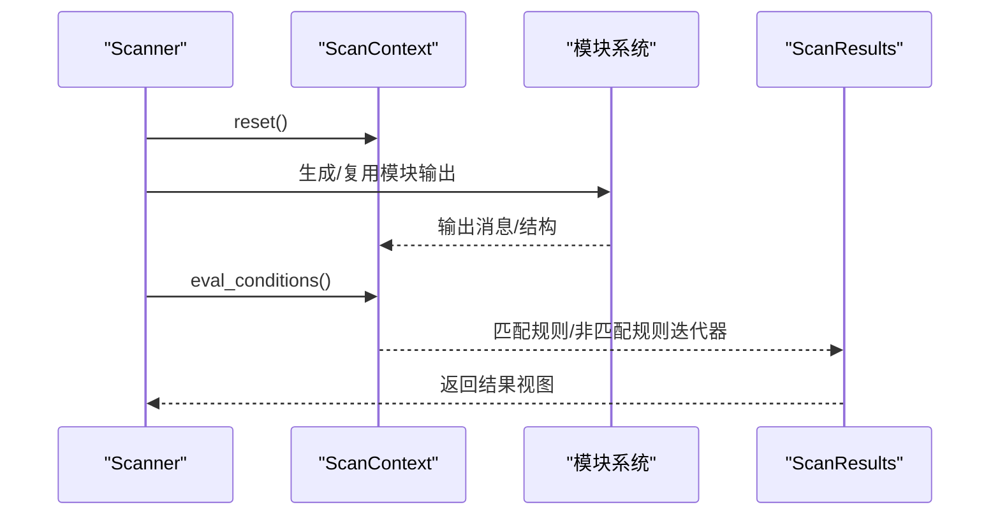
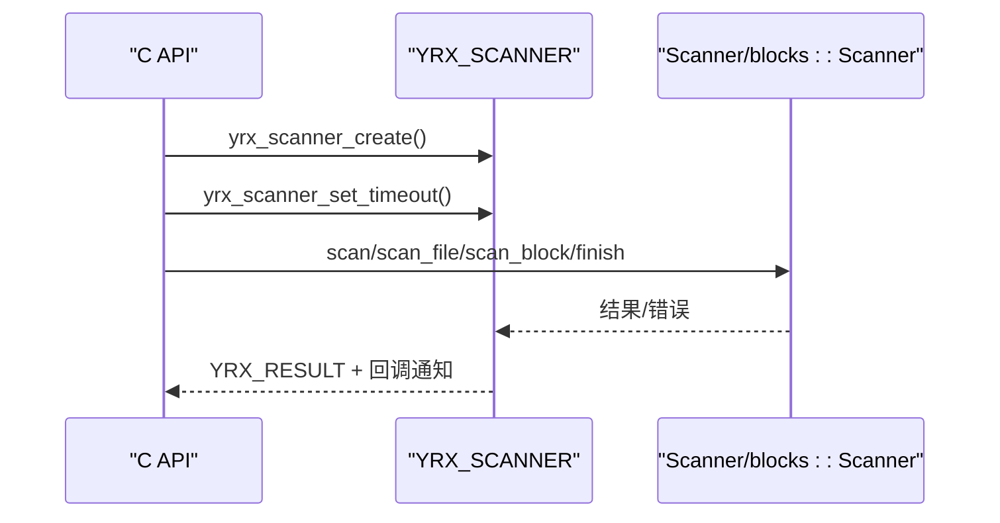
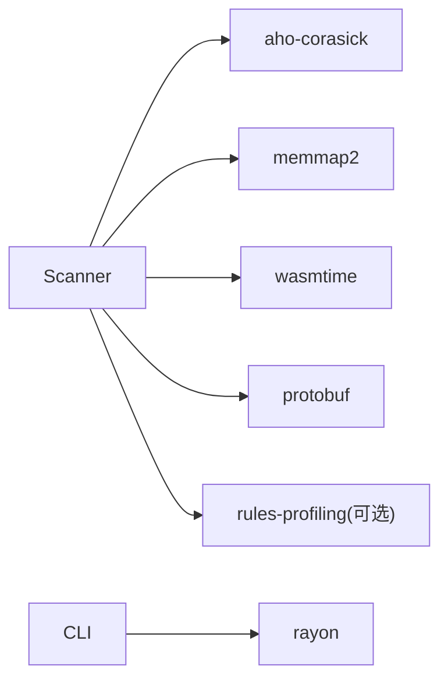

# 模式扫描器

<cite>
**本文引用的文件**
- [lib/src/lib.rs](file://yara-x/lib/src/lib.rs)
- [lib/src/scanner/mod.rs](file://yara-x/lib/src/scanner/mod.rs)
- [lib/src/scanner/context.rs](file://yara-x/lib/src/scanner/context.rs)
- [lib/src/scanner/blocks.rs](file://yara-x/lib/src/scanner/blocks.rs)
- [lib/src/re/thompson/pikevm.rs](file://yara-x/lib/src/re/thompson/pikevm.rs)
- [lib/src/re/fast/fastvm.rs](file://yara-x/lib/src/re/fast/fastvm.rs)
- [capi/src/scanner.rs](file://yara-x/capi/src/scanner.rs)
- [cli/src/commands/scan.rs](file://yara-x/cli/src/commands/scan.rs)
- [Cargo.toml](file://yara-x/Cargo.toml)
</cite>

## 目录
1. [简介](#简介)
2. [项目结构](#项目结构)
3. [核心组件](#核心组件)
4. [架构总览](#架构总览)
5. [详细组件分析](#详细组件分析)
6. [依赖关系分析](#依赖关系分析)
7. [性能考量](#性能考量)
8. [故障排查指南](#故障排查指南)
9. [结论](#结论)
10. [附录](#附录)

## 简介
本文件为 YARA-X 模式扫描器的深度技术文档，聚焦于多模式匹配、状态机转换、回溯控制与超时管理；覆盖内存映射扫描、流式扫描（块扫描）与批量扫描的实现策略；解释扫描上下文管理、匹配结果收集与元数据提取机制；并提供并行扫描优化、内存池与资源清理策略及性能基准测试与调优建议。目标读者为扫描器开发者与性能优化工程师。

## 项目结构
YARA-X 的扫描能力由核心库模块提供，并通过 CLI、C API 与 Python/Go 绑定对外使用。扫描器核心位于 lib/src/scanner 下，正则引擎位于 lib/src/re 下，CLI 提供并行扫描与输出格式化，C API 提供 C 友好的接口。

图示来源
- [lib/src/scanner/mod.rs:175-432](file://yara-x/lib/src/scanner/mod.rs#L175-L432)
- [lib/src/scanner/blocks.rs:21-98](file://yara-x/lib/src/scanner/blocks.rs#L21-L98)
- [lib/src/re/thompson/pikevm.rs:11-41](file://yara-x/lib/src/re/thompson/pikevm.rs#L11-L41)
- [lib/src/re/fast/fastvm.rs:12-37](file://yara-x/lib/src/re/fast/fastvm.rs#L12-L37)
- [capi/src/scanner.rs:18-99](file://yara-x/capi/src/scanner.rs#L18-L99)
- [cli/src/commands/scan.rs:251-562](file://yara-x/cli/src/commands/scan.rs#L251-L562)

章节来源
- [lib/src/lib.rs:1-178](file://yara-x/lib/src/lib.rs#L1-L178)
- [Cargo.toml:17-30](file://yara-x/Cargo.toml#L17-L30)

## 核心组件
- 单文件/内存扫描器：负责加载数据（内存切片或内存映射）、调用模块解析生成结构、执行规则条件求值、收集匹配结果。
- 块扫描器：用于流式/分块扫描，逐块搜索模式并缓存片段，最终统一评估规则条件。
- 扫描上下文：维护匹配状态、未确认链式匹配、模块输出、全局变量、超时计数器等。
- 正则引擎：PikeVM（通用但较慢）与 FastVM（更快但子集支持），支撑文本/正则模式匹配。
- C API：桥接 C 调用者与内部 Scanner/blocks::Scanner，提供回调、超时、模块元数据设置等。
- CLI：并行遍历目录、设置超时、输出格式化、聚合统计与可选的规则级性能剖析。

章节来源
- [lib/src/scanner/mod.rs:175-432](file://yara-x/lib/src/scanner/mod.rs#L175-L432)
- [lib/src/scanner/blocks.rs:21-98](file://yara-x/lib/src/scanner/blocks.rs#L21-L98)
- [lib/src/scanner/context.rs:113-236](file://yara-x/lib/src/scanner/context.rs#L113-L236)
- [lib/src/re/thompson/pikevm.rs:11-41](file://yara-x/lib/src/re/thompson/pikevm.rs#L11-L41)
- [lib/src/re/fast/fastvm.rs:12-37](file://yara-x/lib/src/re/fast/fastvm.rs#L12-L37)
- [capi/src/scanner.rs:18-99](file://yara-x/capi/src/scanner.rs#L18-L99)
- [cli/src/commands/scan.rs:251-562](file://yara-x/cli/src/commands/scan.rs#L251-L562)

## 架构总览
扫描器采用“编译后规则 + WASM 执行环境”的设计。规则在编译阶段被转换为字节码，扫描时在 WASM Store 中运行，借助 Aho-Corasick 自动机与正则 VM 完成多模式匹配，结合模块输出与全局变量驱动规则条件求值。

图示来源
- [lib/src/scanner/mod.rs:487-608](file://yara-x/lib/src/scanner/mod.rs#L487-L608)
- [lib/src/scanner/context.rs:734-761](file://yara-x/lib/src/scanner/context.rs#L734-L761)
- [lib/src/re/thompson/pikevm.rs:78-126](file://yara-x/lib/src/re/thompson/pikevm.rs#L78-L126)
- [lib/src/re/fast/fastvm.rs:67-139](file://yara-x/lib/src/re/fast/fastvm.rs#L67-L139)

## 详细组件分析

### 多模式匹配与状态机
- Aho-Corasick 自动机：对规则中的原子进行并行匹配，产生候选区间，随后进入正则 VM 进一步验证。
- 正则 VM：
  - PikeVM：通用 Thompson NFA 执行器，支持复杂正则，具备回溯与边界检查。
  - FastVM：针对特定正则的快速执行器，扫描限制与位图集合加速定位。
- 状态机转换：
  - 扫描状态枚举驱动不同路径（单块/多块/完成）。
  - 上下文维护匹配列表、未确认链式匹配、规则计时与超时心跳。

图示来源
- [lib/src/scanner/context.rs:734-761](file://yara-x/lib/src/scanner/context.rs#L734-L761)
- [lib/src/re/thompson/pikevm.rs:155-200](file://yara-x/lib/src/re/thompson/pikevm.rs#L155-L200)
- [lib/src/re/fast/fastvm.rs:95-139](file://yara-x/lib/src/re/fast/fastvm.rs#L95-L139)

章节来源
- [lib/src/scanner/context.rs:113-236](file://yara-x/lib/src/scanner/context.rs#L113-L236)
- [lib/src/re/thompson/pikevm.rs:11-41](file://yara-x/lib/src/re/thompson/pikevm.rs#L11-L41)
- [lib/src/re/fast/fastvm.rs:12-37](file://yara-x/lib/src/re/fast/fastvm.rs#L12-L37)

### 超时管理与回溯控制
- 全局心跳计数器：独立线程每秒递增一次，扫描循环定期检查是否超时。
- 扫描限制：正则 VM 默认扫描上限，避免无界正则导致的长尾耗时。
- 规则级计时：在剖析特性开启时，记录每条规则的模式匹配与条件执行时间，超时发生时进行补偿更新。

图示来源
- [lib/src/scanner/mod.rs:94-100](file://yara-x/lib/src/scanner/mod.rs#L94-L100)
- [lib/src/scanner/context.rs:401-422](file://yara-x/lib/src/scanner/context.rs#L401-L422)
- [lib/src/re/fast/fastvm.rs:50-65](file://yara-x/lib/src/re/fast/fastvm.rs#L50-L65)

章节来源
- [lib/src/scanner/mod.rs:94-100](file://yara-x/lib/src/scanner/mod.rs#L94-L100)
- [lib/src/scanner/context.rs:401-422](file://yara-x/lib/src/scanner/context.rs#L401-L422)

### 内存映射扫描、流式扫描与批量扫描
- 内存映射扫描（单文件）：
  - 小文件直接读入内存缓冲；大文件（默认阈值）使用只读内存映射以降低拷贝成本。
  - 支持禁用映射（安全模式），强制缓冲读取。
- 流式扫描（块扫描）：
  - 逐块扫描，维护片段缓存与未确认链式匹配清理，确保跨块不产生伪匹配。
  - 条件求值在 finish 阶段统一执行，返回统一结果视图。
- 批量扫描（CLI 并行）：
  - 使用并行遍历器，按线程数并发扫描文件，动态设置剩余超时，聚合输出与统计。

图示来源
- [lib/src/scanner/mod.rs:181-432](file://yara-x/lib/src/scanner/mod.rs#L181-L432)
- [lib/src/scanner/blocks.rs:82-320](file://yara-x/lib/src/scanner/blocks.rs#L82-L320)
- [lib/src/scanner/context.rs:113-236](file://yara-x/lib/src/scanner/context.rs#L113-L236)

章节来源
- [lib/src/scanner/mod.rs:216-230](file://yara-x/lib/src/scanner/mod.rs#L216-L230)
- [lib/src/scanner/mod.rs:454-485](file://yara-x/lib/src/scanner/mod.rs#L454-L485)
- [lib/src/scanner/blocks.rs:101-195](file://yara-x/lib/src/scanner/blocks.rs#L101-L195)
- [lib/src/scanner/blocks.rs:197-217](file://yara-x/lib/src/scanner/blocks.rs#L197-L217)
- [cli/src/commands/scan.rs:340-351](file://yara-x/cli/src/commands/scan.rs#L340-L351)

### 扫描上下文管理、匹配结果收集与元数据提取
- 上下文职责：
  - 维护扫描状态、模块输出与用户提供的模块输出、全局变量、匹配列表与未确认链式匹配。
  - 提供规则计时与慢规则迭代接口（剖析特性）。
- 匹配结果：
  - 单块扫描：直接从原始数据切片访问匹配片段。
  - 多块扫描：将匹配片段缓存到有序映射，按偏移检索。
- 元数据提取：
  - 模块输出作为协议缓冲消息注入根结构，供规则条件访问。
  - 支持设置模块元数据（raw protobuf）与模块输出复用。

图示来源
- [lib/src/scanner/mod.rs:487-608](file://yara-x/lib/src/scanner/mod.rs#L487-L608)
- [lib/src/scanner/mod.rs:611-711](file://yara-x/lib/src/scanner/mod.rs#L611-L711)
- [lib/src/scanner/context.rs:206-236](file://yara-x/lib/src/scanner/context.rs#L206-L236)

章节来源
- [lib/src/scanner/mod.rs:611-711](file://yara-x/lib/src/scanner/mod.rs#L611-L711)
- [lib/src/scanner/mod.rs:308-411](file://yara-x/lib/src/scanner/mod.rs#L308-L411)
- [lib/src/scanner/context.rs:113-132](file://yara-x/lib/src/scanner/context.rs#L113-L132)

### C API 与 CLI 集成
- C API：
  - 提供创建/销毁扫描器、设置超时、扫描内存/文件、块扫描与收尾、模块元数据设置、全局变量设置、慢规则迭代与清空剖析数据等接口。
  - 在块扫描模式下禁止部分操作（如普通扫描、某些模块设置），并在错误时设置最后错误。
- CLI：
  - 支持并行扫描、输出格式（文本/Ndjson/JSON）、标签过滤、打印元数据/标签/字符串、超时与剩余时间计算、文件大小过滤、线程数控制等。

图示来源
- [capi/src/scanner.rs:110-133](file://yara-x/capi/src/scanner.rs#L110-L133)
- [capi/src/scanner.rs:143-211](file://yara-x/capi/src/scanner.rs#L143-L211)
- [capi/src/scanner.rs:218-267](file://yara-x/capi/src/scanner.rs#L218-L267)
- [capi/src/scanner.rs:322-392](file://yara-x/capi/src/scanner.rs#L322-L392)

章节来源
- [capi/src/scanner.rs:110-211](file://yara-x/capi/src/scanner.rs#L110-L211)
- [capi/src/scanner.rs:218-392](file://yara-x/capi/src/scanner.rs#L218-L392)
- [cli/src/commands/scan.rs:251-562](file://yara-x/cli/src/commands/scan.rs#L251-L562)

## 依赖关系分析
- 关键依赖：
  - Aho-Corasick：多模式原子匹配基础。
  - memmap2：大文件内存映射。
  - wasmtime：WASM 执行环境，承载规则字节码与上下文。
  - protobuf：模块输出序列化/反序列化。
  - rayon：CLI 并行遍历。
- 特性开关：
  - rules-profiling：启用规则级计时与慢规则迭代。
  - constant-folding：影响枚举字段生成。

图示来源
- [Cargo.toml:34-108](file://yara-x/Cargo.toml#L34-L108)
- [lib/src/scanner/mod.rs:18-31](file://yara-x/lib/src/scanner/mod.rs#L18-L31)

章节来源
- [Cargo.toml:34-108](file://yara-x/Cargo.toml#L34-L108)

## 性能考量
- 扫描策略选择
  - 小文件优先使用内存映射（大文件阈值可调整）；必要时禁用映射以避免 SIGBUS。
  - 流式/受限内存场景使用块扫描，注意跨块不匹配的限制与一致性要求。
- 正则引擎权衡
  - 优先使用 FastVM 支持的正则以获得更快速度；复杂正则回退到 PikeVM。
  - 合理设置扫描上限，避免无界正则导致的长尾耗时。
- 资源与内存
  - 单块扫描直接引用输入数据，减少复制；多块扫描缓存片段，注意内存占用。
  - 清理未确认链式匹配，避免跨块误判。
- 并行扫描
  - CLI 使用并行遍历器，合理设置线程数；为每个任务动态计算剩余超时，防止整体超时。
- 剖析与调优
  - 开启剖析特性，收集慢规则；根据模式匹配与条件执行时间定位瓶颈；必要时拆分规则或简化条件。

章节来源
- [lib/src/scanner/mod.rs:216-230](file://yara-x/lib/src/scanner/mod.rs#L216-L230)
- [lib/src/scanner/mod.rs:454-485](file://yara-x/lib/src/scanner/mod.rs#L454-L485)
- [lib/src/re/fast/fastvm.rs:50-65](file://yara-x/lib/src/re/fast/fastvm.rs#L50-L65)
- [lib/src/scanner/blocks.rs:120-195](file://yara-x/lib/src/scanner/blocks.rs#L120-L195)
- [cli/src/commands/scan.rs:343-425](file://yara-x/cli/src/commands/scan.rs#L343-L425)

## 故障排查指南
- 常见错误类型
  - 打开/映射文件失败：检查权限与路径。
  - 模块未知或输出反序列化失败：确认模块名称与 protobuf 类型一致。
  - 超时：检查规则复杂度、正则扫描上限、并发与线程数。
- 超时处理
  - 心跳线程与扫描循环协同检测；剖析模式下对超时规则进行时间补偿记录。
- C API 注意事项
  - 块扫描模式下禁止普通扫描与部分模块设置；回调中避免阻塞；错误时检查最后错误设置。
- CLI 调试
  - 启用控制台日志回调；使用剖析输出查看慢规则；检查文件大小过滤与递归深度设置。

章节来源
- [lib/src/scanner/mod.rs:48-93](file://yara-x/lib/src/scanner/mod.rs#L48-L93)
- [lib/src/scanner/context.rs:401-422](file://yara-x/lib/src/scanner/context.rs#L401-L422)
- [capi/src/scanner.rs:218-267](file://yara-x/capi/src/scanner.rs#L218-L267)
- [capi/src/scanner.rs:322-392](file://yara-x/capi/src/scanner.rs#L322-L392)
- [cli/src/commands/scan.rs:388-425](file://yara-x/cli/src/commands/scan.rs#L388-L425)

## 结论
YARA-X 扫描器通过“编译后规则 + WASM 执行 + 多模式匹配 + 正则 VM”的组合，在保证兼容性的同时实现了高性能与可控的资源消耗。其块扫描与内存映射策略适配多种输入形态；超时与剖析机制保障了稳定性与可观测性；C API 与 CLI 则提供了从底层到上层的完整使用路径。遵循本文的优化建议与排错流程，可在生产环境中获得稳定且高效的扫描体验。

## 附录
- 性能基准测试与调优建议
  - 基准测试：在相同硬件与数据集上对比不同扫描策略（内存映射 vs 缓冲读取、单块 vs 块扫描、PikeVM vs FastVM）下的吞吐与延迟。
  - 规则优化：拆分复杂规则、减少无界正则、利用索引/原子提升；对热点规则进行剖析定位。
  - 并行参数：根据 CPU 核心数与 I/O 特性调整线程数；为每个任务设置合理的剩余超时。
  - 内存管理：监控多块扫描的片段缓存大小；在高并发场景下考虑内存池或分页策略。
- 相关实现参考路径
  - [lib/src/scanner/mod.rs:181-432](file://yara-x/lib/src/scanner/mod.rs#L181-L432)
  - [lib/src/scanner/blocks.rs:82-320](file://yara-x/lib/src/scanner/blocks.rs#L82-L320)
  - [lib/src/re/thompson/pikevm.rs:78-126](file://yara-x/lib/src/re/thompson/pikevm.rs#L78-L126)
  - [lib/src/re/fast/fastvm.rs:67-139](file://yara-x/lib/src/re/fast/fastvm.rs#L67-L139)
  - [capi/src/scanner.rs:110-211](file://yara-x/capi/src/scanner.rs#L110-L211)
  - [cli/src/commands/scan.rs:251-562](file://yara-x/cli/src/commands/scan.rs#L251-L562)