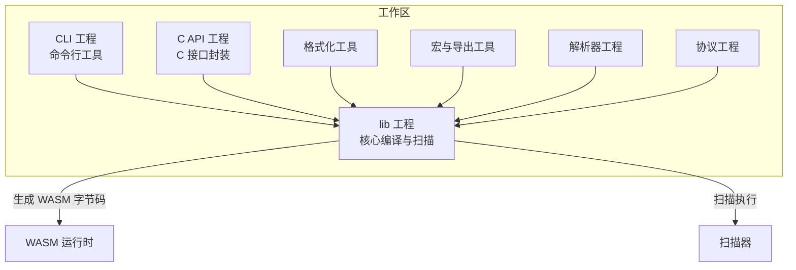
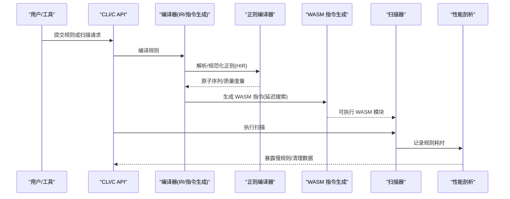
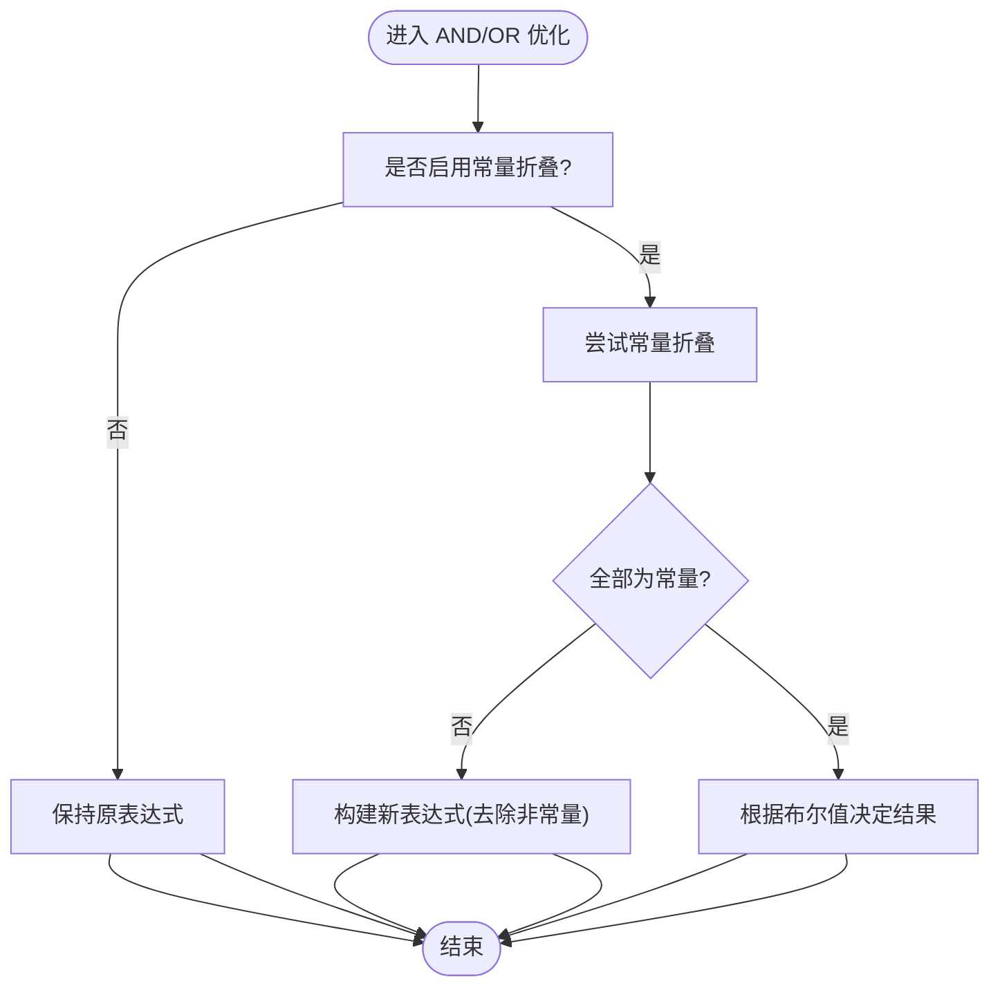
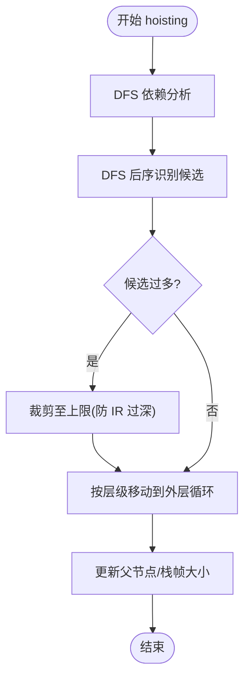
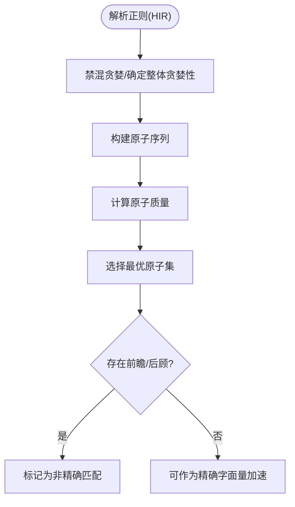
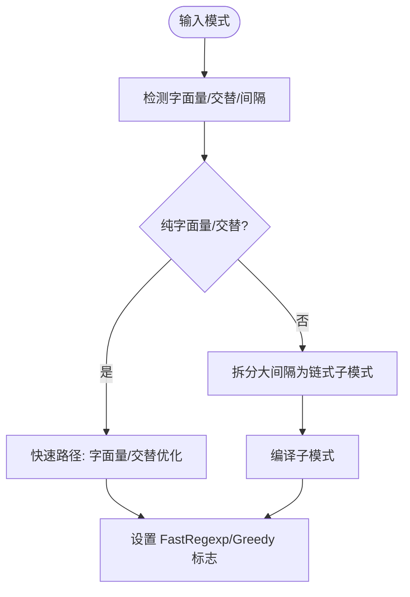
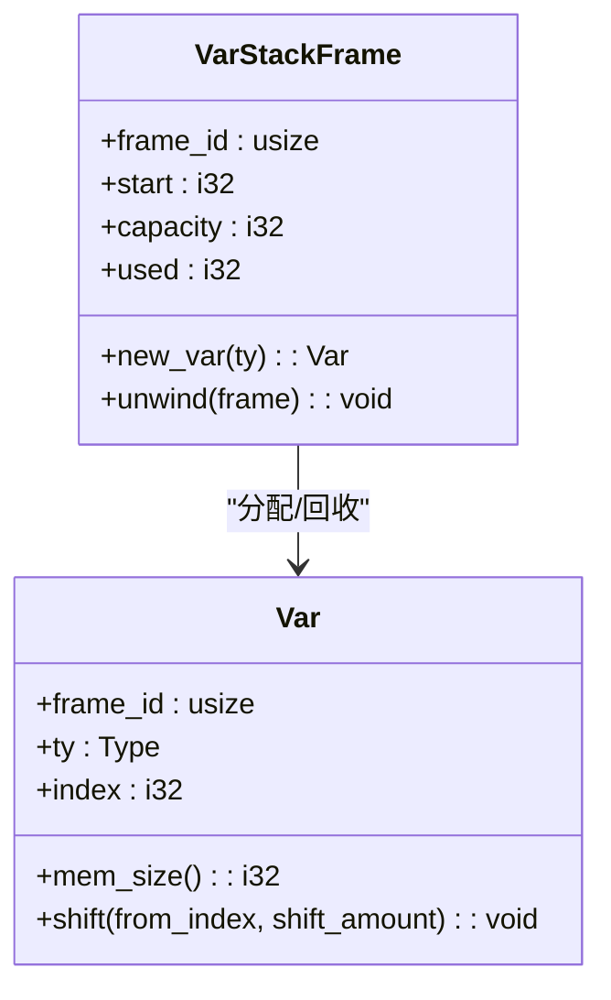
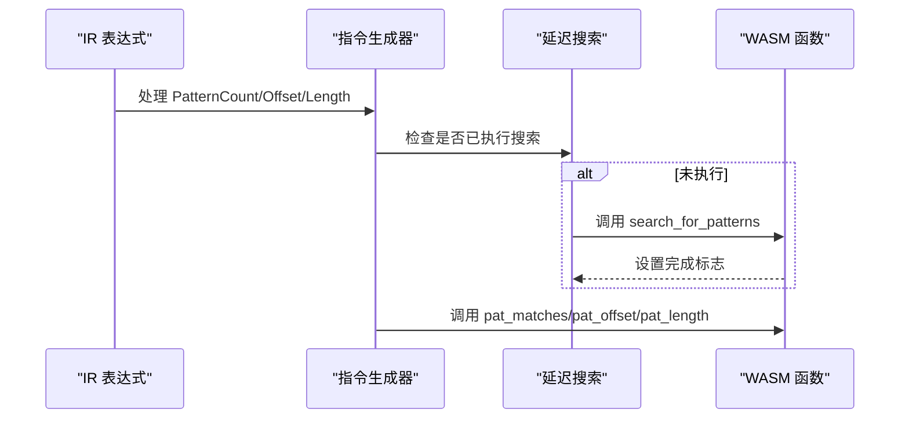
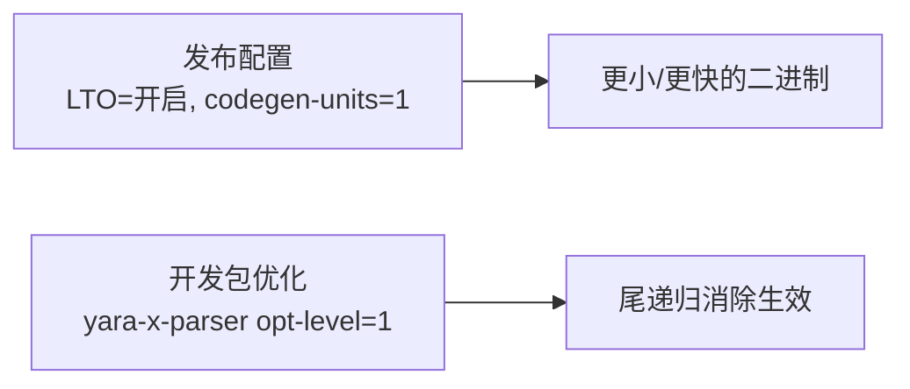

# 编译优化技术

<cite>
**本文引用的文件**
- [Cargo.toml](file://Cargo.toml)
- [lib/src/compiler/mod.rs](file://lib/src/compiler/mod.rs)
- [lib/src/compiler/ir/mod.rs](file://lib/src/compiler/ir/mod.rs)
- [lib/src/compiler/ir/ast2ir.rs](file://lib/src/compiler/ir/ast2ir.rs)
- [lib/src/compiler/emit.rs](file://lib/src/compiler/emit.rs)
- [lib/src/re/thompson/compiler.rs](file://lib/src/re/thompson/compiler.rs)
- [lib/src/scanner/context.rs](file://lib/src/scanner/context.rs)
- [lib/src/scanner/mod.rs](file://lib/src/scanner/mod.rs)
- [capi/include/yara_x.h](file://capi/include/yara_x.h)
- [capi/src/scanner.rs](file://capi/src/scanner.rs)
- [capi/src/compiler.rs](file://capi/src/compiler.rs)
</cite>

## 目录
1. [引言](#引言)
2. [项目结构](#项目结构)
3. [核心组件](#核心组件)
4. [架构总览](#架构总览)
5. [详细组件分析](#详细组件分析)
6. [依赖关系分析](#依赖关系分析)
7. [性能考量](#性能考量)
8. [故障排查指南](#故障排查指南)
9. [结论](#结论)
10. [附录](#附录)

## 引言
本技术文档聚焦于编译优化技术在 YARA-X 中的实现与应用，系统阐述编译期优化策略（常量折叠、死代码消除、条件表达式简化、循环不变量外提）、模式优化技术（原子匹配、贪婪/非贪婪模式处理、正则表达式优化、通配符展开）、规则合并与重复模式检测、以及内存布局优化。同时提供优化效果评估方法、性能基准测试建议与调试工具使用指南，并给出策略选择与最佳实践，面向编译器优化专家与性能调优工程师。

## 项目结构
YARA-X 采用多成员工作区组织，核心优化逻辑集中在 lib 子工程中，涵盖词法/语法解析、AST 到 IR 的转换、IR 优化、WASM 指令生成、正则引擎编译与扫描执行等模块。CLI、C API、Go/Python 绑定提供外部接口；配置文件定义了发布优化配置（含 LTO）与开发优化策略。

**图表来源**
- [Cargo.toml:17-29](file://Cargo.toml#L17-L29)

**章节来源**
- [Cargo.toml:17-29](file://Cargo.toml#L17-L29)

## 核心组件
- 编译器与 IR 优化：负责规则解析、AST 到 IR 转换、IR 常量折叠与循环不变量外提等优化。
- 正则表达式编译器：将 HIR 转换为 Thompson NFA 原子序列，支持贪婪/非贪婪与近似精确匹配。
- WASM 指令生成：将 IR 映射到 WASM 指令，延迟触发模式搜索，减少重复计算。
- 扫描器与性能剖析：提供规则级性能统计与慢规则迭代接口，支持清理与重置。
- C API：暴露编译警告 JSON、慢规则遍历与性能数据清理能力。

**章节来源**
- [lib/src/compiler/mod.rs:1519-2386](file://lib/src/compiler/mod.rs#L1519-L2386)
- [lib/src/compiler/ir/mod.rs:618-840](file://lib/src/compiler/ir/mod.rs#L618-L840)
- [lib/src/compiler/emit.rs:413-1480](file://lib/src/compiler/emit.rs#L413-L1480)
- [lib/src/re/thompson/compiler.rs:199-1288](file://lib/src/re/thompson/compiler.rs#L199-L1288)
- [lib/src/scanner/context.rs:401-422](file://lib/src/scanner/context.rs#L401-L422)
- [lib/src/scanner/mod.rs:790-821](file://lib/src/scanner/mod.rs#L790-L821)
- [capi/include/yara_x.h:240-902](file://capi/include/yara_x.h#L240-L902)
- [capi/src/scanner.rs:672-711](file://capi/src/scanner.rs#L672-L711)
- [capi/src/compiler.rs:531-577](file://capi/src/compiler.rs#L531-L577)

## 架构总览
下图展示从规则输入到扫描执行的关键路径，突出编译期优化与运行期性能剖析的协同：

**图表来源**
- [lib/src/compiler/mod.rs:2084-2386](file://lib/src/compiler/mod.rs#L2084-L2386)
- [lib/src/re/thompson/compiler.rs:224-218](file://lib/src/re/thompson/compiler.rs#L224-L218)
- [lib/src/compiler/emit.rs:1019-1044](file://lib/src/compiler/emit.rs#L1019-L1044)
- [lib/src/scanner/context.rs:401-422](file://lib/src/scanner/context.rs#L401-L422)
- [capi/src/scanner.rs:672-711](file://capi/src/scanner.rs#L672-L711)

## 详细组件分析

### 编译期优化：常量折叠与条件表达式简化
- 常量折叠：对算术与布尔运算进行编译期求值，若所有操作数为常量则直接返回结果，否则保留原表达式以供运行期计算。
- 条件表达式简化：AND/OR 在常量折叠开启时会移除恒真/恒假分支，缩短短路路径，减少运行期判断与函数调用。

**图表来源**
- [lib/src/compiler/ir/mod.rs:1040-1112](file://lib/src/compiler/ir/mod.rs#L1040-L1112)
- [lib/src/compiler/ir/mod.rs:1842-1857](file://lib/src/compiler/ir/mod.rs#L1842-L1857)

**章节来源**
- [lib/src/compiler/ir/mod.rs:1040-1112](file://lib/src/compiler/ir/mod.rs#L1040-L1112)
- [lib/src/compiler/ir/mod.rs:1842-1857](file://lib/src/compiler/ir/mod.rs#L1842-L1857)

### 编译期优化：循环不变量外提（Loop Invariant Code Motion）
- 算法概览：先做变量依赖分析，再 DFS 后序遍历识别可提升表达式，避免重复提升导致 IR 过深，限制候选数量上限。
- 适用场景：嵌套循环中不依赖内层变量的表达式可安全移至最外层循环之外，显著降低重复计算。

**图表来源**
- [lib/src/compiler/ir/mod.rs:618-840](file://lib/src/compiler/ir/mod.rs#L618-L840)

**章节来源**
- [lib/src/compiler/ir/mod.rs:618-840](file://lib/src/compiler/ir/mod.rs#L618-L840)

### 模式优化：正则表达式与原子匹配
- 贪婪/非贪婪处理：解析阶段禁止混合贪婪性，从而可在回溯方向上确定最长/最短匹配策略。
- 原子质量度量：为每个替代分支维护最佳原子序列，依据质量阈值选择最优路径，提升匹配效率。
- 近似精确性：当存在零宽断言等前瞻后顾特性时，字面量匹配需进一步通过完整正则引擎确认，避免误判。

**图表来源**
- [lib/src/re/thompson/compiler.rs:411-427](file://lib/src/re/thompson/compiler.rs#L411-L427)
- [lib/src/re/thompson/compiler.rs:1248-1271](file://lib/src/re/thompson/compiler.rs#L1248-L1271)

**章节来源**
- [lib/src/re/thompson/compiler.rs:411-427](file://lib/src/re/thompson/compiler.rs#L411-L427)
- [lib/src/re/thompson/compiler.rs:1248-1271](file://lib/src/re/thompson/compiler.rs#L1248-L1271)

### 模式优化：文本/十六进制模式与链式匹配
- 文本/十六进制字面量：优先检测可展开的字面量，必要时发出“慢模式”警告提示潜在性能问题。
- 链式正则：对大间隔拆分为多个子模式并串联，减少单次扫描代价。
- 字面量交替：对纯字面量或字面量交替进行快速路径优化，标记快速正则标志位。

**图表来源**
- [lib/src/compiler/mod.rs:1519-1536](file://lib/src/compiler/mod.rs#L1519-L1536)
- [lib/src/compiler/mod.rs:2084-2122](file://lib/src/compiler/mod.rs#L2084-L2122)
- [lib/src/compiler/mod.rs:2357-2386](file://lib/src/compiler/mod.rs#L2357-L2386)

**章节来源**
- [lib/src/compiler/mod.rs:1519-1536](file://lib/src/compiler/mod.rs#L1519-L1536)
- [lib/src/compiler/mod.rs:2084-2122](file://lib/src/compiler/mod.rs#L2084-L2122)
- [lib/src/compiler/mod.rs:2357-2386](file://lib/src/compiler/mod.rs#L2357-L2386)

### 内存布局与变量栈管理
- 变量栈帧：为每条作用域分配独立栈帧，记录起始偏移、容量与已用空间，防止越界并支持回溯释放。
- 变量索引迁移：在插入/删除变量时对后续变量索引进行平移，确保内存访问一致性。
- 内存占用：变量以 i64 对齐存储，提供单变量占用字节数常量，便于估算内存布局。

**图表来源**
- [lib/src/compiler/context.rs:193-297](file://lib/src/compiler/context.rs#L193-L297)

**章节来源**
- [lib/src/compiler/context.rs:193-297](file://lib/src/compiler/context.rs#L193-L297)

### WASM 指令生成与延迟模式搜索
- 延迟搜索：在首次需要时才触发模式搜索，避免冗余扫描；AND/OR 短路时仅在必要时执行搜索。
- 模式访问：针对匹配次数、偏移、长度等访问点生成统一调用，按需传入索引参数。
- 循环体优化：在 for/any 循环中按模式数量与 ID 序列生成 switch 分派，减少分支开销。

**图表来源**
- [lib/src/compiler/emit.rs:1019-1044](file://lib/src/compiler/emit.rs#L1019-L1044)
- [lib/src/compiler/emit.rs:1107-1141](file://lib/src/compiler/emit.rs#L1107-L1141)
- [lib/src/compiler/emit.rs:1143-1239](file://lib/src/compiler/emit.rs#L1143-L1239)
- [lib/src/compiler/emit.rs:1450-1480](file://lib/src/compiler/emit.rs#L1450-L1480)

**章节来源**
- [lib/src/compiler/emit.rs:1019-1044](file://lib/src/compiler/emit.rs#L1019-L1044)
- [lib/src/compiler/emit.rs:1107-1141](file://lib/src/compiler/emit.rs#L1107-L1141)
- [lib/src/compiler/emit.rs:1143-1239](file://lib/src/compiler/emit.rs#L1143-L1239)
- [lib/src/compiler/emit.rs:1450-1480](file://lib/src/compiler/emit.rs#L1450-L1480)

### 规则合并、重复模式检测与内存布局优化
- 规则合并：通过 AST/IR 层面对等价条件进行归并，减少重复扫描与调用。
- 重复模式检测：对相同字面量/正则进行去重，避免重复编译与执行。
- 内存布局优化：变量栈帧按作用域划分，减少跨作用域变量访问带来的间接成本；通过索引迁移与容量检查保证安全性。

**章节来源**
- [lib/src/compiler/ir/mod.rs:618-840](file://lib/src/compiler/ir/mod.rs#L618-L840)
- [lib/src/compiler/context.rs:193-297](file://lib/src/compiler/context.rs#L193-L297)

## 依赖关系分析
- 发布优化配置：启用 LTO 与单代码生成单元，减小二进制体积并提升链接期优化机会。
- 开发优化：对解析器包启用基础优化级别，保障递归词法分析的尾递归消除生效，避免深度输入导致栈溢出。

**图表来源**
- [Cargo.toml:117-135](file://Cargo.toml#L117-L135)

**章节来源**
- [Cargo.toml:117-135](file://Cargo.toml#L117-L135)

## 性能考量
- 常量折叠与条件简化：显著减少运行期分支与函数调用，适合静态条件与简单算术。
- 循环不变量外提：对嵌套循环中的稳定表达式进行提升，降低重复计算，注意候选数量上限以避免 IR 过深。
- 正则优化：禁混贪婪策略与原子质量度量提升匹配速度；字面量/交替快速路径与链式拆分降低扫描复杂度。
- 延迟搜索：仅在必要时触发模式搜索，避免无谓扫描；短路 AND/OR 中的搜索调度减少整体时间。
- 内存布局：变量栈帧隔离与索引迁移降低跨作用域访问成本，配合容量检查避免越界。

[本节为通用性能讨论，无需列出具体文件来源]

## 故障排查指南
- 规则级性能剖析
  - 使用慢规则迭代接口获取模式匹配与条件执行耗时，定位热点规则。
  - 清理历史剖析数据后重新扫描，确保结果仅反映当前会话。
- 编译警告
  - 通过 C API 获取编译警告 JSON，识别潜在慢模式与优化建议。
- 超时与计时
  - 扫描过程中发生超时时，剖析模块会尝试修正尚未记录的规则耗时，确保统计完整性。

**章节来源**
- [capi/include/yara_x.h:240-902](file://capi/include/yara_x.h#L240-L902)
- [capi/src/scanner.rs:672-711](file://capi/src/scanner.rs#L672-L711)
- [capi/src/compiler.rs:531-577](file://capi/src/compiler.rs#L531-L577)
- [lib/src/scanner/context.rs:401-422](file://lib/src/scanner/context.rs#L401-L422)

## 结论
YARA-X 在编译期通过常量折叠、条件简化与循环不变量外提，在运行期通过延迟搜索、原子匹配与链式拆分等策略，形成从规则到字节码再到扫描执行的全链路优化体系。结合规则级性能剖析与编译警告输出，可有效评估优化效果并指导规则编写与调优。

[本节为总结性内容，无需列出具体文件来源]

## 附录
- 优化策略选择指南
  - 静态条件优先启用常量折叠与条件简化。
  - 嵌套循环中优先考虑循环不变量外提，控制候选数量。
  - 正则优先使用字面量/交替与链式拆分，避免混合贪婪性。
  - 尽可能利用延迟搜索与短路语义减少扫描次数。
- 最佳实践
  - 规则编写阶段尽量显式字面量与范围，减少动态计算。
  - 合理拆分长正则，避免单次扫描代价过高。
  - 使用性能剖析工具持续监控热点规则，定期重构。
  - 发布构建启用 LTO 与单代码生成单元，提升最终性能。

[本节为通用建议，无需列出具体文件来源]