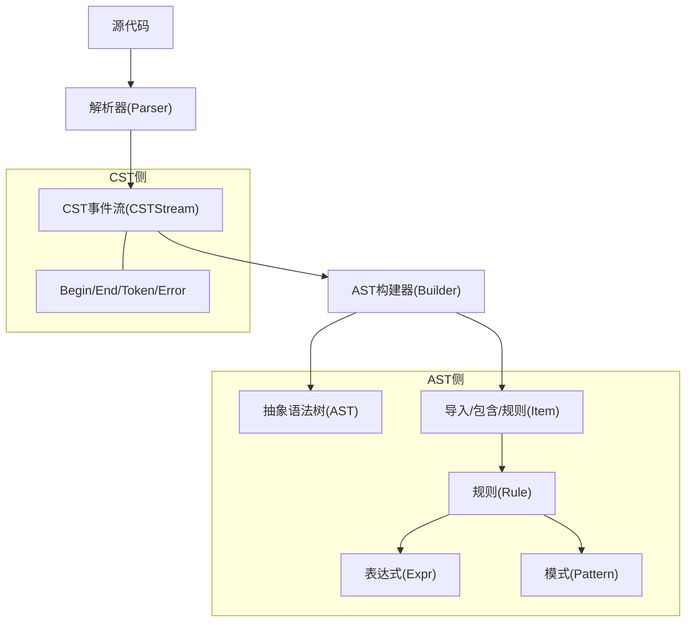
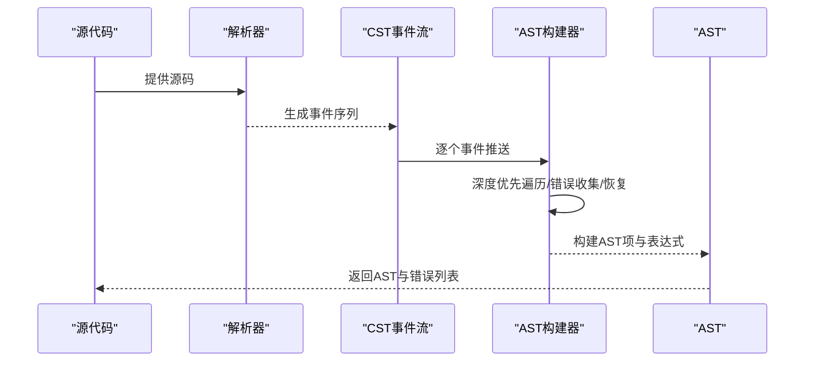
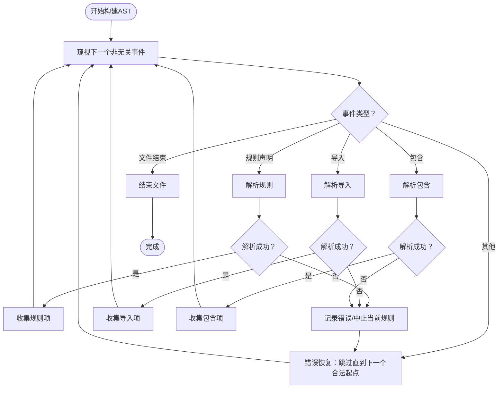
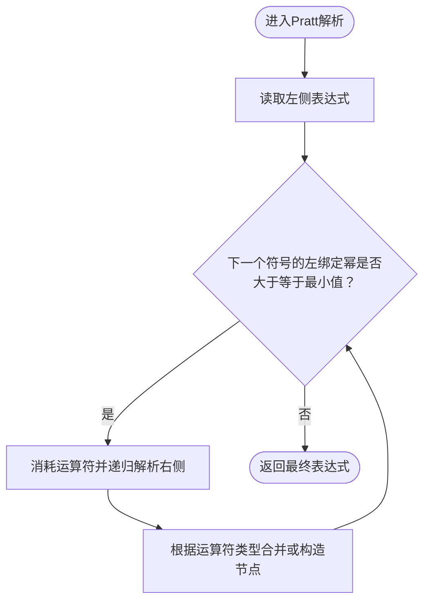
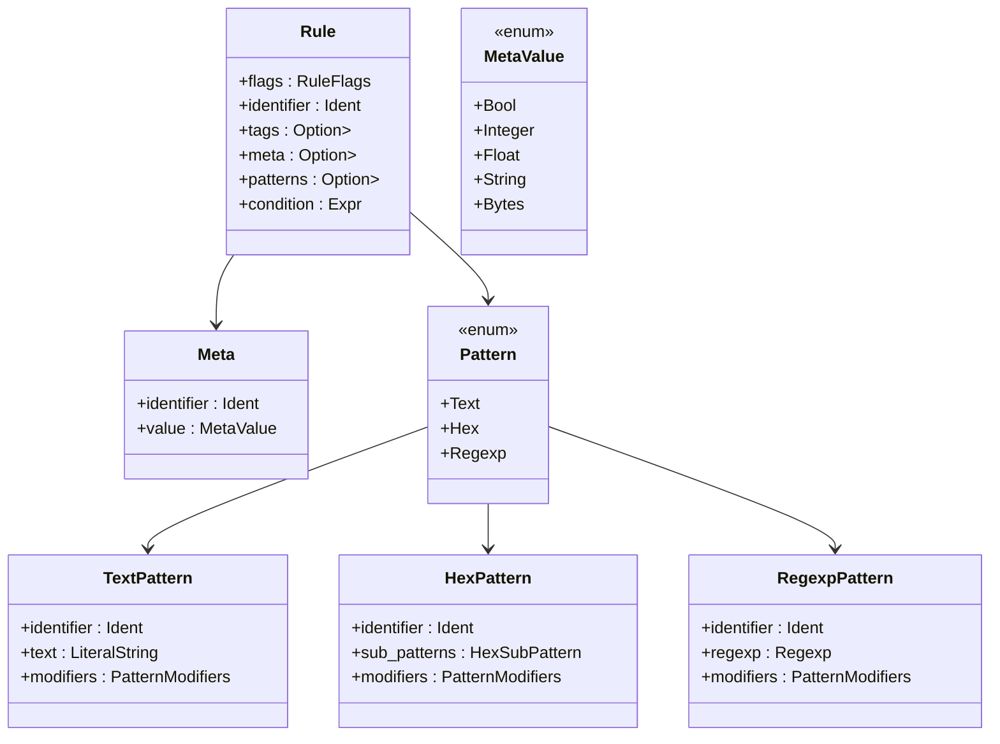
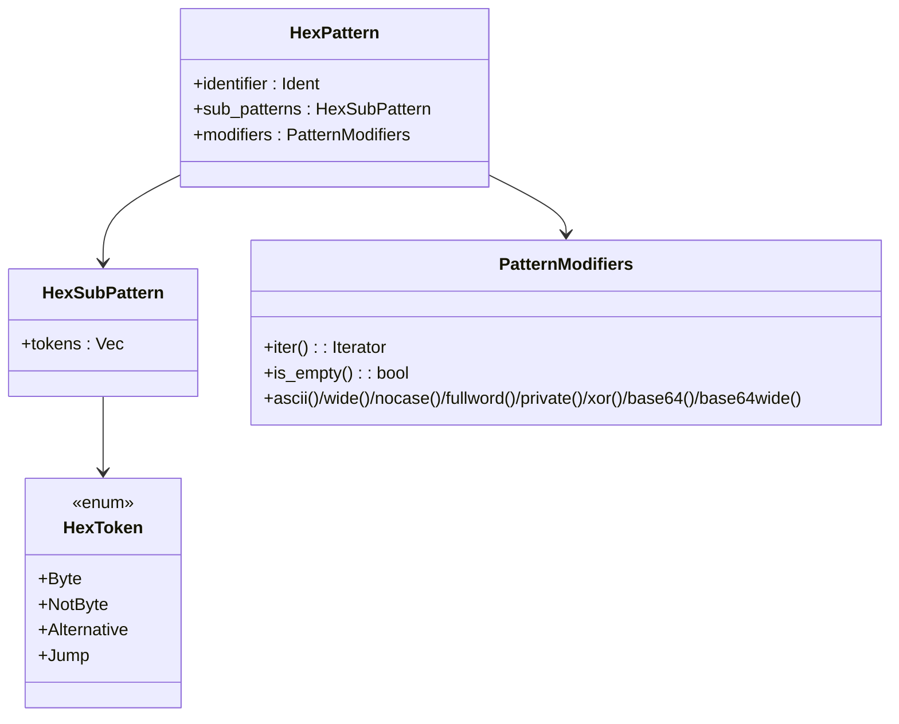
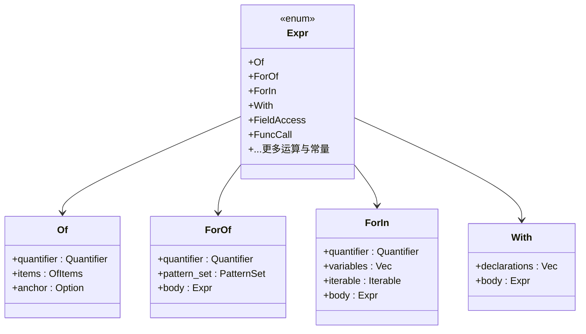
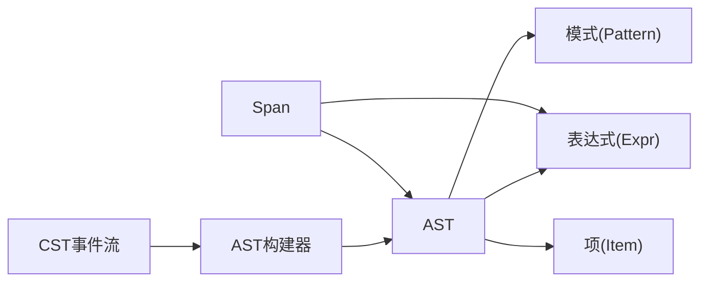

# CST到AST转换

<cite>
**本文引用的文件**
- [cst2ast.rs](file://yara-x/parser/src/ast/cst2ast.rs)
- [mod.rs（AST模块）](file://yara-x/parser/src/ast/mod.rs)
- [mod.rs（CST模块）](file://yara-x/parser/src/cst/mod.rs)
- [lib.rs（解析器入口）](file://yara-x/parser/src/lib.rs)
</cite>

## 目录
1. [引言](#引言)
2. [项目结构](#项目结构)
3. [核心组件](#核心组件)
4. [架构总览](#架构总览)
5. [详细组件分析](#详细组件分析)
6. [依赖关系分析](#依赖关系分析)
7. [性能考量](#性能考量)
8. [故障排查指南](#故障排查指南)
9. [结论](#结论)
10. [附录](#附录)

## 引言
本文件系统性阐述YARA-X中“具体语法树（CST）到抽象语法树（AST）”的转换器设计与实现，重点覆盖以下方面：
- 转换流程：从事件流（Event Stream）驱动的深度优先遍历，到AST节点的构建与合并。
- 语法糖消除与语义信息提取：通过 Pratt 解析器实现运算符优先级与结合性，扁平化多操作数表达式；在规则、元数据、模式等结构中抽取标识符、字面量与修饰符。
- 语法歧义与错误恢复：通过“错误事件收集”“边界回退”“最大深度保护”等策略，保证转换过程稳健。
- 类型推断与语义约束：在AST层以强类型枚举表达不同表达式与结构，避免运行时歧义。
- 配置与扩展：CST事件过滤（空白、换行、注释）、AST构建器参数（最大深度），以及可扩展的模式修饰符与表达式类型。
- 对比示例：给出转换前后CST与AST的结构差异，帮助开发者直观理解。

## 项目结构
YARA-X的解析子系统位于parser模块内，其中：
- CST模块负责将源码解析为事件流（含Begin/End/Token/Error），保留所有语法细节。
- AST模块负责将CST事件流转换为语义明确的抽象语法树，并提供DFS遍历、ASCII树输出等工具。
- 转换器位于AST的cst2ast.rs中，基于事件流进行深度优先遍历与节点重构。

图表来源
- [mod.rs（CST模块）:48-186](file://yara-x/parser/src/cst/mod.rs#L48-L186)
- [mod.rs（AST模块）:33-107](file://yara-x/parser/src/ast/mod.rs#L33-L107)
- [cst2ast.rs:30-101](file://yara-x/parser/src/ast/cst2ast.rs#L30-L101)

章节来源
- [mod.rs（CST模块）:1-186](file://yara-x/parser/src/cst/mod.rs#L1-L186)
- [mod.rs（AST模块）:1-107](file://yara-x/parser/src/ast/mod.rs#L1-L107)
- [lib.rs（解析器入口）:1-142](file://yara-x/parser/src/lib.rs#L1-L142)

## 核心组件
- 事件流（Event）：Begin/End/Token/Error四类事件，携带语法种类与Span位置信息。
- CST事件流（CSTStream）：对事件流进行空白、换行、注释的可配置过滤。
- AST构建器（Builder）：基于事件流进行深度优先遍历，执行语法糖消除、节点合并与属性提升。
- AST与AST项（AST/Item）：顶层导入、包含、规则集合；规则内部包含标志、标签、元数据、模式与条件表达式。
- 表达式与模式：统一的Expr枚举与Pattern枚举，支持多类语法结构（布尔、算术、位运算、匹配、of/for/with等）。

章节来源
- [cst2ast.rs:30-101](file://yara-x/parser/src/ast/cst2ast.rs#L30-L101)
- [mod.rs（AST模块）:33-107](file://yara-x/parser/src/ast/mod.rs#L33-L107)
- [mod.rs（AST模块）:141-652](file://yara-x/parser/src/ast/mod.rs#L141-L652)
- [mod.rs（AST模块）:233-480](file://yara-x/parser/src/ast/mod.rs#L233-L480)
- [mod.rs（AST模块）:496-652](file://yara-x/parser/src/ast/mod.rs#L496-L652)

## 架构总览
CST到AST的转换采用“事件驱动 + 深度优先遍历”的架构：
- 输入：CST事件流（CSTStream）
- 控制：Builder维护当前深度、错误列表与事件窥视器（Peekable）
- 输出：AST（包含导入、包含、规则列表）

图表来源
- [mod.rs（CST模块）:48-186](file://yara-x/parser/src/cst/mod.rs#L48-L186)
- [cst2ast.rs:55-100](file://yara-x/parser/src/ast/cst2ast.rs#L55-L100)
- [mod.rs（AST模块）:55-62](file://yara-x/parser/src/ast/mod.rs#L55-L62)

## 详细组件分析

### 1) AST构建器（Builder）与深度优先遍历
- 角色：消费CST事件流，按语法结构构建AST，同时处理错误与恢复。
- 关键点：
  - 使用Peekable事件流，支持前瞻与跳过无关事件（空白、换行、注释、错误）。
  - 维护深度计数，防止递归过深导致栈溢出。
  - 对规则声明、导入、包含分别进行解析，遇到错误时调用recover跳过至下一个合法起点。
- 错误处理：
  - 将Event::Error收集为Error列表。
  - 遇到BEGIN(ERROR)时中止当前规则解析，继续后续规则或导入/包含。
  - 最大深度到达时停止构建，避免崩溃。

图表来源
- [cst2ast.rs:55-101](file://yara-x/parser/src/ast/cst2ast.rs#L55-L101)
- [cst2ast.rs:155-172](file://yara-x/parser/src/ast/cst2ast.rs#L155-L172)
- [cst2ast.rs:174-192](file://yara-x/parser/src/ast/cst2ast.rs#L174-L192)

章节来源
- [cst2ast.rs:30-101](file://yara-x/parser/src/ast/cst2ast.rs#L30-L101)
- [cst2ast.rs:155-192](file://yara-x/parser/src/ast/cst2ast.rs#L155-L192)

### 2) 运算符优先级与语法糖消除（Pratt解析）
- 设计原理：使用Pratt解析器根据运算符绑定幂（左/右）自动分组表达式，消除括号带来的歧义，扁平化同优先级的二元/一元表达式。
- 实现要点：
  - 定义运算符优先级表，区分左结合与右结合。
  - 通过递归下降与最小绑定幂控制，确保高优先级先于低优先级被组合。
  - 使用宏new_n_ary_expr/new_binary_expr实现“同级合并”与“二元构造”，减少AST层级，降低递归深度。
- 适用范围：布尔运算（AND/OR）、比较（EQ/NE/关系）、算术（ADD/SUB/MUL/DIV/MOD）、位运算（SHL/SHR/BITWISE_*）、字段访问（DOT）等。

图表来源
- [cst2ast.rs:283-450](file://yara-x/parser/src/ast/cst2ast.rs#L283-L450)
- [cst2ast.rs:131-147](file://yara-x/parser/src/ast/cst2ast.rs#L131-L147)

章节来源
- [cst2ast.rs:283-450](file://yara-x/parser/src/ast/cst2ast.rs#L283-L450)
- [cst2ast.rs:131-147](file://yara-x/parser/src/ast/cst2ast.rs#L131-L147)

### 3) 规则结构与语义信息提取
- 规则声明（RuleDecl）：解析规则标志（全局/私有）、标识符、标签、元数据块、模式块与条件表达式。
- 元数据（Meta）：支持整数、浮点、字符串、布尔与字节值，修饰符解析时进行正负号与类型判定。
- 模式（Pattern）：文本、十六进制与正则三类，均支持修饰符集合（ASCII/WIDE/NOCASE/FULLWORD/PRIVATE/XOR、BASE64(BASE64WIDE)等），修饰符解析时处理可选参数（如XOR范围、BASE64字母表）。
- 条件表达式：通过boolean_expr委托给Pratt解析器，最终形成Expr树。

图表来源
- [mod.rs（AST模块）:141-150](file://yara-x/parser/src/ast/mod.rs#L141-L150)
- [mod.rs（AST模块）:161-176](file://yara-x/parser/src/ast/mod.rs#L161-L176)
- [mod.rs（AST模块）:233-283](file://yara-x/parser/src/ast/mod.rs#L233-L283)
- [mod.rs（AST模块）:261-275](file://yara-x/parser/src/ast/mod.rs#L261-L275)
- [mod.rs（AST模块）:277-283](file://yara-x/parser/src/ast/mod.rs#L277-L283)

章节来源
- [cst2ast.rs:473-518](file://yara-x/parser/src/ast/cst2ast.rs#L473-L518)
- [cst2ast.rs:593-644](file://yara-x/parser/src/ast/cst2ast.rs#L593-L644)
- [cst2ast.rs:646-688](file://yara-x/parser/src/ast/cst2ast.rs#L646-L688)
- [cst2ast.rs:700-786](file://yara-x/parser/src/ast/cst2ast.rs#L700-L786)

### 4) 模式表达式与修饰符
- 十六进制模式（HexPattern）：由若干HexToken组成，支持字节、取反字节、替代分支与跳跃（Jump）。
- 修饰符（PatternModifiers）：通过可迭代集合提供快速查询（ASCII/WIDE/NOCASE/FULLWORD/PRIVATE/XOR、BASE64(BASE64WIDE)），并支持按需显示与文本化。
- 修饰符解析：对可选参数进行容错处理（如XOR的单值与范围、BASE64字母表），并在必要时将字面量包装为LiteralString。

图表来源
- [mod.rs（AST模块）:277-304](file://yara-x/parser/src/ast/mod.rs#L277-L304)
- [mod.rs（AST模块）:306-383](file://yara-x/parser/src/ast/mod.rs#L306-L383)
- [mod.rs（AST模块）:654-732](file://yara-x/parser/src/ast/mod.rs#L654-L732)
- [cst2ast.rs:788-800](file://yara-x/parser/src/ast/cst2ast.rs#L788-L800)
- [cst2ast.rs:800-880](file://yara-x/parser/src/ast/cst2ast.rs#L800-L880)

章节来源
- [mod.rs（AST模块）:277-383](file://yara-x/parser/src/ast/mod.rs#L277-L383)
- [mod.rs（AST模块）:654-732](file://yara-x/parser/src/ast/mod.rs#L654-L732)
- [cst2ast.rs:788-880](file://yara-x/parser/src/ast/cst2ast.rs#L788-L880)

### 5) 条件逻辑与复杂表达式
- 复杂表达式：支持OF（百分比/数量限定）、FOR OF/IN（量化器+集合/可迭代）、WITH（声明+体）等。
- 量化器（Quantifier）：支持None/All/Any/百分比/数量表达式。
- 可迭代（Iterable）：支持范围、元组与单一表达式。
- 字段访问与函数调用：通过点操作（FieldAccess）与函数调用（FuncCall）表达属性与行为。

图表来源
- [mod.rs（AST模块）:496-652](file://yara-x/parser/src/ast/mod.rs#L496-L652)
- [mod.rs（AST模块）:384-420](file://yara-x/parser/src/ast/mod.rs#L384-L420)
- [mod.rs（AST模块）:393-412](file://yara-x/parser/src/ast/mod.rs#L393-L412)
- [mod.rs（AST模块）:421-435](file://yara-x/parser/src/ast/mod.rs#L421-L435)

章节来源
- [mod.rs（AST模块）:384-435](file://yara-x/parser/src/ast/mod.rs#L384-L435)
- [mod.rs（AST模块）:496-652](file://yara-x/parser/src/ast/mod.rs#L496-L652)

### 6) 转换前后的CST与AST对比示例
- CST视角：保留空白、换行、注释与错误事件，表达式以线性顺序出现，未体现运算符优先级。
- AST视角：通过Pratt解析器与节点合并，将线性表达式重构成符合优先级与结合性的树形结构；规则结构扁平化，元数据与模式修饰符被抽取为独立字段。

说明：本节为概念性说明，不直接分析具体文件。

## 依赖关系分析
- 模块依赖：
  - AST构建器依赖CST事件流（CSTStream）与语法种类（SyntaxKind）。
  - AST模块对外提供From<CSTStream>与From<Parser>的转换入口。
  - Span用于跨模块传递源码位置信息。
- 关键耦合点：
  - Builder与事件流的紧密耦合（Peekable/CSTStream）。
  - AST项与表达式的强类型枚举，降低运行时歧义。
  - 错误模型（Error）与事件错误（Event::Error）的桥接。

图表来源
- [mod.rs（AST模块）:55-62](file://yara-x/parser/src/ast/mod.rs#L55-L62)
- [lib.rs（解析器入口）:38-141](file://yara-x/parser/src/lib.rs#L38-L141)

章节来源
- [mod.rs（AST模块）:55-62](file://yara-x/parser/src/ast/mod.rs#L55-L62)
- [lib.rs（解析器入口）:38-141](file://yara-x/parser/src/lib.rs#L38-L141)

## 性能考量
- 深度优先遍历与事件驱动：避免一次性加载完整树，内存占用与栈深度可控。
- 最大AST深度限制：防止极端嵌套导致栈溢出，提高鲁棒性。
- 同级合并（n-ary）：减少AST层级，降低递归遍历成本。
- 事件过滤：CSTStream可关闭空白、换行、注释，减少无效节点，间接优化构建时间。
- 原地字符串与字面量：对直接借用的字符串避免复制，对转义字符串进行延迟解码。

说明：本节提供一般性指导，不直接分析具体文件。

## 故障排查指南
- 常见问题与定位：
  - 事件流中断：检查BEGIN(ERROR)节点与Event::Error消息，确认错误位置与Span。
  - 语法不匹配：当peek期望的Token与实际不符时会触发异常，检查对应语法解析分支。
  - 栈溢出风险：若规则或表达式极深，考虑调整最大深度阈值或简化规则。
- 排查步骤：
  - 打印当前事件与Span，确认事件序列是否符合预期。
  - 分段测试：先解析规则头（标志/标识符/标签），再逐步加入元数据/模式/条件。
  - 利用ASCII树输出（调试）查看AST结构，定位问题节点。

章节来源
- [cst2ast.rs:237-281](file://yara-x/parser/src/ast/cst2ast.rs#L237-L281)
- [cst2ast.rs:244-259](file://yara-x/parser/src/ast/cst2ast.rs#L244-L259)
- [cst2ast.rs:153-159](file://yara-x/parser/src/ast/cst2ast.rs#L153-L159)

## 结论
该转换器以事件流为核心，结合深度优先遍历与Pratt解析，实现了从CST到AST的高效、稳健转换。通过最大深度保护、错误收集与恢复策略，以及对语法糖的消除与表达式的扁平化，最终得到语义清晰、易于分析与优化的AST。模块化的AST项与强类型表达式为后续编译与扫描阶段提供了坚实基础。

## 附录

### A. 配置选项与扩展机制
- CST事件过滤（CSTStream）：
  - 白空格、换行、注释可单独启用/禁用，便于在格式化或调试场景下选择性保留。
- AST构建器参数：
  - 最大AST深度阈值，防止极端情况下的栈溢出。
- 扩展点：
  - 新增表达式类型：在Expr枚举中添加变体，并在Pratt解析与相应解析函数中处理。
  - 新增模式修饰符：在PatternModifier枚举中添加新修饰符，并在解析函数中处理其参数与默认值。
  - 新增规则结构：在Rule结构或相关块（META/PATTERNS）中增加字段，并在解析函数中读取与校验。

章节来源
- [mod.rs（CST模块）:116-144](file://yara-x/parser/src/cst/mod.rs#L116-L144)
- [cst2ast.rs:153-159](file://yara-x/parser/src/ast/cst2ast.rs#L153-L159)
- [mod.rs（AST模块）:496-652](file://yara-x/parser/src/ast/mod.rs#L496-L652)
- [mod.rs（AST模块）:749-775](file://yara-x/parser/src/ast/mod.rs#L749-L775)