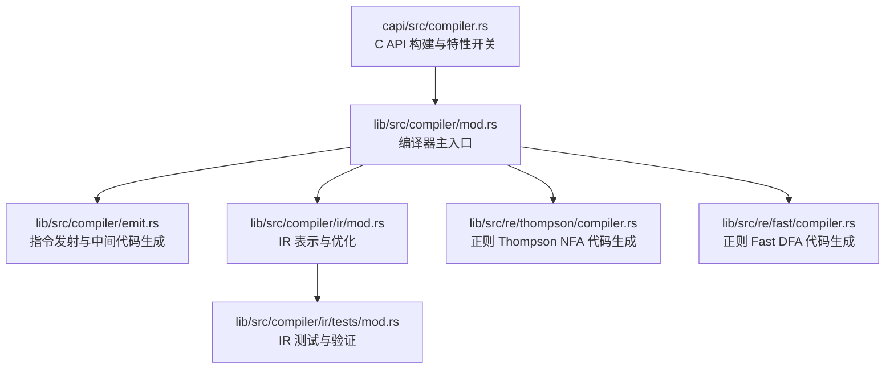
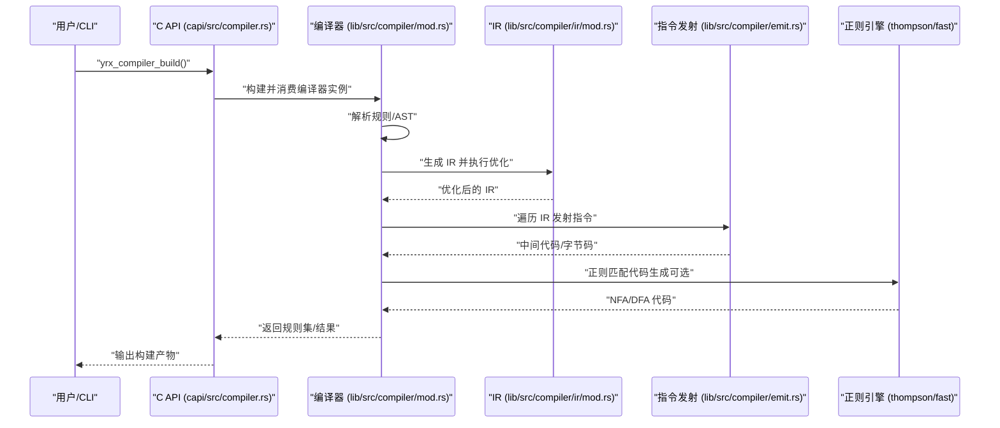
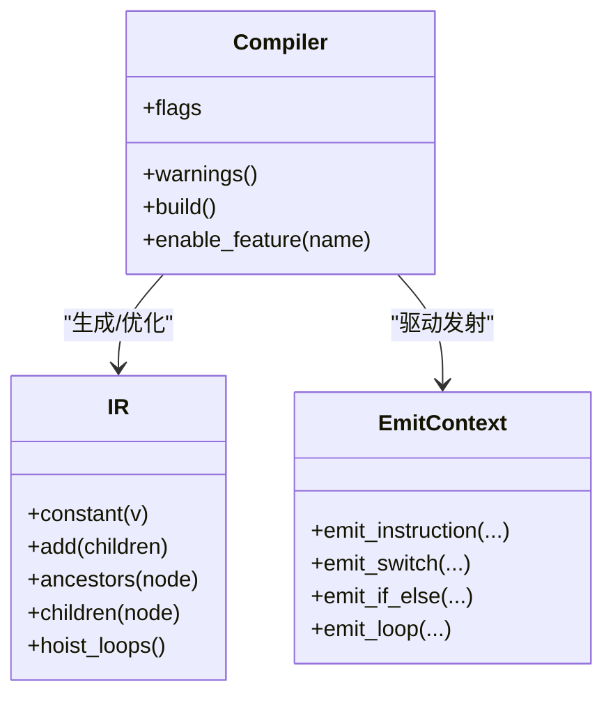
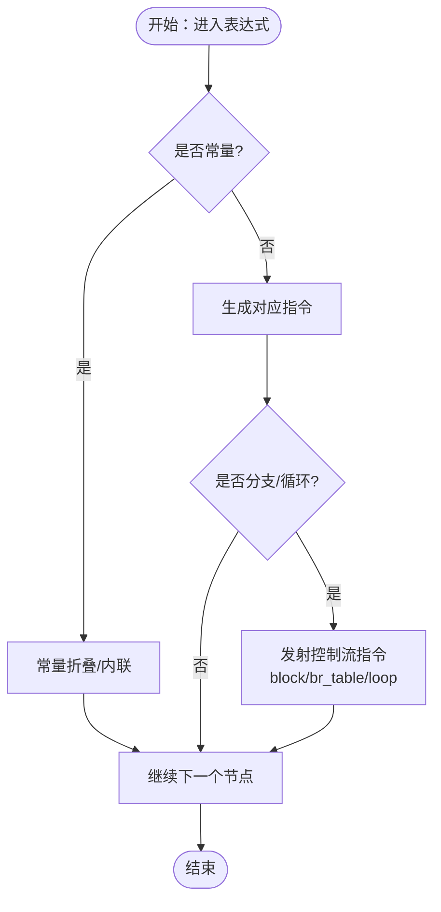
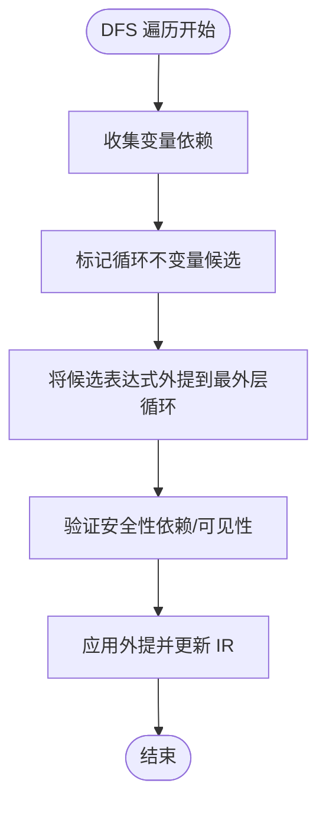
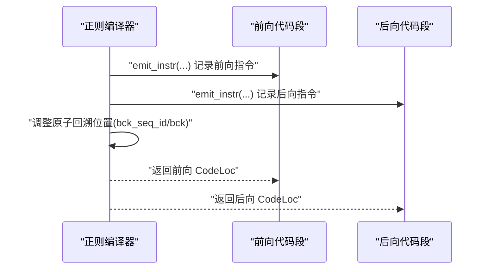
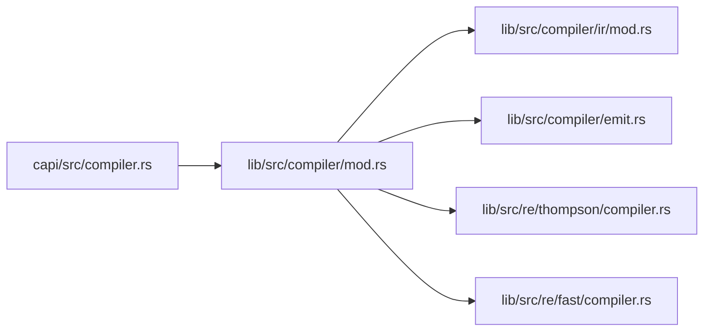

# 代码生成

<cite>
**本文引用的文件**
- [lib/src/compiler/mod.rs](file://lib/src/compiler/mod.rs)
- [lib/src/compiler/emit.rs](file://lib/src/compiler/emit.rs)
- [lib/src/compiler/ir/mod.rs](file://lib/src/compiler/ir/mod.rs)
- [lib/src/re/thompson/compiler.rs](file://lib/src/re/thompson/compiler.rs)
- [lib/src/re/fast/compiler.rs](file://lib/src/re/fast/compiler.rs)
- [capi/src/compiler.rs](file://capi/src/compiler.rs)
- [lib/src/compiler/ir/tests/mod.rs](file://lib/src/compiler/ir/tests/mod.rs)
- [lib/src/re/thompson/compiler.rs](file://lib/src/re/thompson/compiler.rs)
- [lib/src/re/fast/compiler.rs](file://lib/src/re/fast/compiler.rs)
- [lib/src/compiler/emit.rs](file://lib/src/compiler/emit.rs)
- [lib/src/compiler/mod.rs](file://lib/src/compiler/mod.rs)
</cite>

## 目录
1. [引言](#引言)
2. [项目结构](#项目结构)
3. [核心组件](#核心组件)
4. [架构总览](#架构总览)
5. [详细组件分析](#详细组件分析)
6. [依赖关系分析](#依赖关系分析)
7. [性能考量](#性能考量)
8. [故障排查指南](#故障排查指南)
9. [结论](#结论)
10. [附录](#附录)

## 引言
本文件面向希望深入理解代码生成器工作原理与优化策略的开发者，系统阐述从抽象语法树（AST）到可执行中间代码或机器码的转换过程；重点覆盖指令生成算法（操作码选择、寄存器分配、内存布局优化）、不同语句类型的处理（赋值、条件分支、循环、函数调用）、常见优化技术（常量折叠、死代码消除、指令调度），以及配置选项、扩展机制与自定义指令的添加方法。文中所有技术细节均基于仓库中的实际实现进行归纳与图示。

## 项目结构
代码生成器位于 Rust 子工程中，围绕“编译器”模块组织，同时包含正则表达式引擎（Thompson 与 Fast）的代码生成实现。关键路径如下：
- 编译器主入口与核心逻辑：lib/src/compiler/mod.rs
- 指令发射与中间代码生成：lib/src/compiler/emit.rs
- 中间表示（IR）与优化：lib/src/compiler/ir/mod.rs
- 正则表达式代码生成（Thompson/NFA）：lib/src/re/thompson/compiler.rs
- 正则表达式代码生成（Fast DFA）：lib/src/re/fast/compiler.rs
- C API 封装与构建流程：capi/src/compiler.rs
- IR 测试与验证：lib/src/compiler/ir/tests/mod.rs

**图表来源**
- [lib/src/compiler/mod.rs](file://lib/src/compiler/mod.rs)
- [lib/src/compiler/emit.rs](file://lib/src/compiler/emit.rs)
- [lib/src/compiler/ir/mod.rs](file://lib/src/compiler/ir/mod.rs)
- [lib/src/re/thompson/compiler.rs](file://lib/src/re/thompson/compiler.rs)
- [lib/src/re/fast/compiler.rs](file://lib/src/re/fast/compiler.rs)
- [capi/src/compiler.rs](file://capi/src/compiler.rs)
- [lib/src/compiler/ir/tests/mod.rs](file://lib/src/compiler/ir/tests/mod.rs)

**章节来源**
- [lib/src/compiler/mod.rs](file://lib/src/compiler/mod.rs)
- [lib/src/compiler/emit.rs](file://lib/src/compiler/emit.rs)
- [lib/src/compiler/ir/mod.rs](file://lib/src/compiler/ir/mod.rs)
- [lib/src/re/thompson/compiler.rs](file://lib/src/re/thompson/compiler.rs)
- [lib/src/re/fast/compiler.rs](file://lib/src/re/fast/compiler.rs)
- [capi/src/compiler.rs](file://capi/src/compiler.rs)
- [lib/src/compiler/ir/tests/mod.rs](file://lib/src/compiler/ir/tests/mod.rs)

## 核心组件
- 编译器（Compiler）
  - 负责规则解析、AST 到 IR 的转换、IR 优化与最终的指令发射。
  - 提供构建、警告序列化、特性开关等能力。
- 指令发射器（EmitContext/Emitter）
  - 将 IR 或 HIR 转换为具体指令序列，支持栈式虚拟机指令模型。
- IR（中间表示）
  - 提供表达式节点、常量、运算、控制流等抽象，支持依赖分析与循环不变量外提等优化。
- 正则表达式代码生成器
  - Thompson NFA 与 Fast DFA 两种策略，分别面向可回溯与确定性匹配场景。
- C API
  - 对编译器进行封装，暴露构建、特性启用、警告输出等接口。

**章节来源**
- [lib/src/compiler/mod.rs](file://lib/src/compiler/mod.rs)
- [lib/src/compiler/emit.rs](file://lib/src/compiler/emit.rs)
- [lib/src/compiler/ir/mod.rs](file://lib/src/compiler/ir/mod.rs)
- [lib/src/re/thompson/compiler.rs](file://lib/src/re/thompson/compiler.rs)
- [lib/src/re/fast/compiler.rs](file://lib/src/re/fast/compiler.rs)
- [capi/src/compiler.rs](file://capi/src/compiler.rs)

## 架构总览
下图展示了从规则输入到可执行代码的整体流程：解析 AST → 构建 IR → IR 优化 → 指令发射 → 生成目标代码。

**图表来源**
- [capi/src/compiler.rs](file://capi/src/compiler.rs)
- [lib/src/compiler/mod.rs](file://lib/src/compiler/mod.rs)
- [lib/src/compiler/ir/mod.rs](file://lib/src/compiler/ir/mod.rs)
- [lib/src/compiler/emit.rs](file://lib/src/compiler/emit.rs)
- [lib/src/re/thompson/compiler.rs](file://lib/src/re/thompson/compiler.rs)
- [lib/src/re/fast/compiler.rs](file://lib/src/re/fast/compiler.rs)

## 详细组件分析

### 组件一：编译器（Compiler）
- 职责
  - 管理规则集合、错误与警告、特性开关。
  - 驱动从 AST 到 IR 的转换与优化，并最终发射指令。
- 关键点
  - 构建流程会重置内部状态以便复用。
  - 支持启用/禁用实验性功能，便于演进与测试。
- 典型流程
  - 接收源码 → 解析 → AST → IR → 优化 → 指令发射 → 产物输出。

**图表来源**
- [lib/src/compiler/mod.rs](file://lib/src/compiler/mod.rs)
- [lib/src/compiler/emit.rs](file://lib/src/compiler/emit.rs)
- [lib/src/compiler/ir/mod.rs](file://lib/src/compiler/ir/mod.rs)

**章节来源**
- [lib/src/compiler/mod.rs](file://lib/src/compiler/mod.rs)
- [capi/src/compiler.rs](file://capi/src/compiler.rs)

### 组件二：指令发射与中间代码生成（EmitContext/Emitter）
- 职责
  - 将 IR/HIR 节点映射为具体指令序列，维护栈式虚拟机的局部变量与控制流块。
- 关键算法
  - 条件分支与多路分支（switch）：通过嵌套 block 与 br_table 实现高效跳转。
  - 循环：使用 break/continue 块结构与标签管理。
  - 函数调用：参数入栈、调用指令、返回值出栈。
- 优化要点
  - 常量折叠：在发射前对可计算常量进行替换，减少运行时开销。
  - 死代码消除：移除不可达分支或无副作用表达式。
  - 指令调度：按指令依赖与寄存器压力调整顺序以提升吞吐。

**图表来源**
- [lib/src/compiler/emit.rs](file://lib/src/compiler/emit.rs)

**章节来源**
- [lib/src/compiler/emit.rs](file://lib/src/compiler/emit.rs)

### 组件三：IR（中间表示）与优化
- 数据结构
  - 表达式节点（常量、运算、变量、控制流）构成树形结构。
  - 提供祖先/子节点遍历，用于依赖分析与优化定位。
- 优化算法
  - 循环不变量外提（Loop-Invariant Code Motion, LICM）：通过 DFS 计算变量依赖，识别可在循环外安全移动的表达式。
  - 依赖分析：自顶向下收集变量使用，避免在变量声明后使用前移动。
- 复杂度
  - 依赖分析与外提通常为 O(N+E)，N 为节点数，E 为边数。

**图表来源**
- [lib/src/compiler/ir/mod.rs](file://lib/src/compiler/ir/mod.rs)

**章节来源**
- [lib/src/compiler/ir/mod.rs](file://lib/src/compiler/ir/mod.rs)
- [lib/src/compiler/ir/tests/mod.rs](file://lib/src/compiler/ir/tests/mod.rs)

### 组件四：正则表达式代码生成（Thompson NFA 与 Fast DFA）
- Thompson NFA
  - 使用非确定性有限自动机，支持回溯与贪婪匹配。
  - 通过原子（atom）与后向/前向代码段管理匹配位置与回溯点。
  - 提供位置记录与指令序列号，确保回溯顺序正确。
- Fast DFA
  - 使用确定性有限自动机，针对大规模模式进行优化匹配。
  - 通过最佳原子栈与块位置调整，保证指令顺序一致性。

**图表来源**
- [lib/src/re/thompson/compiler.rs](file://lib/src/re/thompson/compiler.rs)
- [lib/src/re/fast/compiler.rs](file://lib/src/re/fast/compiler.rs)

**章节来源**
- [lib/src/re/thompson/compiler.rs](file://lib/src/re/thompson/compiler.rs)
- [lib/src/re/fast/compiler.rs](file://lib/src/re/fast/compiler.rs)

### 组件五：C API 与构建流程
- 能力
  - 启用/禁用特性标志，序列化警告信息，构建规则集并复用编译器对象。
- 使用建议
  - 在调用构建后，编译器内部会被重置为初始状态，可继续追加源码并重复构建。

**章节来源**
- [capi/src/compiler.rs](file://capi/src/compiler.rs)

## 依赖关系分析
- 模块耦合
  - Compiler 依赖 IR 与 EmitContext 完成从 AST 到指令的完整链路。
  - 正则引擎独立于主编译流程，但共享相同的指令发射与位置管理思想。
- 外部依赖
  - C API 作为桥接层，负责与宿主语言交互与资源管理。

**图表来源**
- [lib/src/compiler/mod.rs](file://lib/src/compiler/mod.rs)
- [lib/src/compiler/ir/mod.rs](file://lib/src/compiler/ir/mod.rs)
- [lib/src/compiler/emit.rs](file://lib/src/compiler/emit.rs)
- [lib/src/re/thompson/compiler.rs](file://lib/src/re/thompson/compiler.rs)
- [lib/src/re/fast/compiler.rs](file://lib/src/re/fast/compiler.rs)
- [capi/src/compiler.rs](file://capi/src/compiler.rs)

**章节来源**
- [lib/src/compiler/mod.rs](file://lib/src/compiler/mod.rs)
- [lib/src/compiler/ir/mod.rs](file://lib/src/compiler/ir/mod.rs)
- [lib/src/compiler/emit.rs](file://lib/src/compiler/emit.rs)
- [lib/src/re/thompson/compiler.rs](file://lib/src/re/thompson/compiler.rs)
- [lib/src/re/fast/compiler.rs](file://lib/src/re/fast/compiler.rs)
- [capi/src/compiler.rs](file://capi/src/compiler.rs)

## 性能考量
- 常量折叠与死代码消除
  - 在 IR 层与发射层均可实施，优先在 IR 层进行以减少后续发射成本。
- 指令调度
  - 将高延迟指令（如内存访问）与算术指令交错，提高流水线效率。
- 寄存器分配与栈优化
  - 采用局部变量与临时寄存器映射，减少栈访问频率；在条件与循环中最小化跨块数据传递。
- 正则匹配优化
  - Thompson：利用回溯点与原子位置快速恢复；Fast：DFA 状态合并与转移表压缩。
- 内存布局
  - 将频繁访问的数据结构紧凑排列，减少缓存抖动；对指令序列进行对齐以提升加载效率。

[本节为通用指导，不直接分析具体文件]

## 故障排查指南
- 构建失败
  - 检查特性开关是否正确启用；确认源码格式与语法无误。
- 警告与错误
  - 通过 C API 的警告序列化接口获取 JSON 格式的诊断信息，逐条定位问题。
- IR 优化异常
  - 使用 IR 测试用例验证依赖分析与外提行为，关注节点祖先/子节点遍历结果。
- 正则匹配异常
  - 核对前向/后向代码段的指令顺序与原子回溯位置，确保回溯链一致。

**章节来源**
- [capi/src/compiler.rs](file://capi/src/compiler.rs)
- [lib/src/compiler/ir/tests/mod.rs](file://lib/src/compiler/ir/tests/mod.rs)
- [lib/src/re/thompson/compiler.rs](file://lib/src/re/thompson/compiler.rs)
- [lib/src/re/fast/compiler.rs](file://lib/src/re/fast/compiler.rs)

## 结论
该代码生成器以 IR 为核心，结合指令发射与多种优化技术，实现了从规则到可执行代码的高效转换。Thompson 与 Fast 两类正则引擎分别满足回溯与确定性匹配需求。通过特性开关与 C API，系统具备良好的可扩展性与可维护性。建议在实际工程中配合常量折叠、死代码消除与指令调度等策略，持续优化生成代码的性能与可读性。

[本节为总结性内容，不直接分析具体文件]

## 附录

### A. 指令生成算法概要
- 操作码选择
  - 基于表达式类型与目标平台选择最优指令族（算术、比较、控制流、内存）。
- 寄存器分配
  - 采用线性扫描或贪心策略，优先分配热点变量至寄存器，其余落栈。
- 内存布局优化
  - 将局部变量与临时结果按访问频率分组，减少跨块传递与栈溢出风险。

[本节为概念性说明，不直接分析具体文件]

### B. 不同语句类型的处理
- 赋值语句
  - 左值解析为存储位置，右值生成表达式，最后发射存储指令。
- 条件分支
  - 生成嵌套 block 与 br_if/br_table，确保默认分支与短路求值。
- 循环结构
  - 使用 loop/br/br_if 构造 break/continue 控制流，标签与深度管理至关重要。
- 函数调用
  - 参数逆序入栈，调用指令发射，返回值处理与栈平衡。

**章节来源**
- [lib/src/compiler/emit.rs](file://lib/src/compiler/emit.rs)

### C. 优化技术速览
- 常量折叠：在 IR/发射阶段替换常量表达式。
- 死代码消除：移除不可达分支与无副作用表达式。
- 指令调度：重排指令以降低停顿与提高吞吐。
- 循环不变量外提：将循环内不变表达式移至循环外。

**章节来源**
- [lib/src/compiler/ir/mod.rs](file://lib/src/compiler/ir/mod.rs)
- [lib/src/compiler/emit.rs](file://lib/src/compiler/emit.rs)

### D. 配置选项与扩展机制
- 特性开关
  - 通过 C API 的特性启用接口动态开启实验性功能。
- 扩展机制
  - 新增自定义指令时，需在发射器中注册编码逻辑，并在 IR 中新增对应节点类型与优化规则。
- 自定义指令添加步骤
  - 定义指令枚举与编码；在 EmitContext 中实现发射逻辑；在 IR 中补充依赖分析与优化；编写测试用例验证行为。

**章节来源**
- [capi/src/compiler.rs](file://capi/src/compiler.rs)
- [lib/src/compiler/emit.rs](file://lib/src/compiler/emit.rs)
- [lib/src/compiler/ir/mod.rs](file://lib/src/compiler/ir/mod.rs)

### E. 中间代码示例（示意）
- 条件表达式（示意）
  - i64 值入栈 → 分支判断 → br_table 跳转 → 各分支块内生成表达式 → 合并结果。
- 多路分支（示意）
  - i32.wrap_i64 → 本地变量暂存 → 嵌套 block + br_table → 各分支块 → 默认 unreachable。
- 循环（示意）
  - loop 标签 → 条件检查 → br_if/br → break/continue → 合并出口。

**章节来源**
- [lib/src/compiler/emit.rs](file://lib/src/compiler/emit.rs)