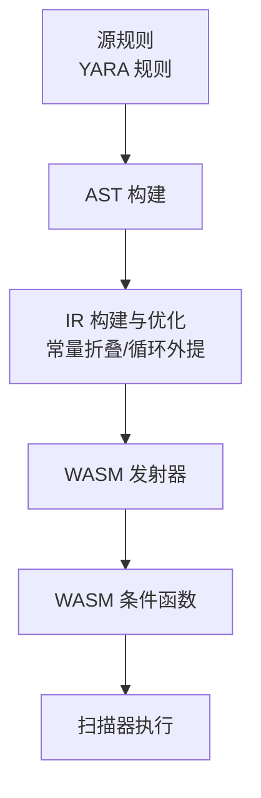
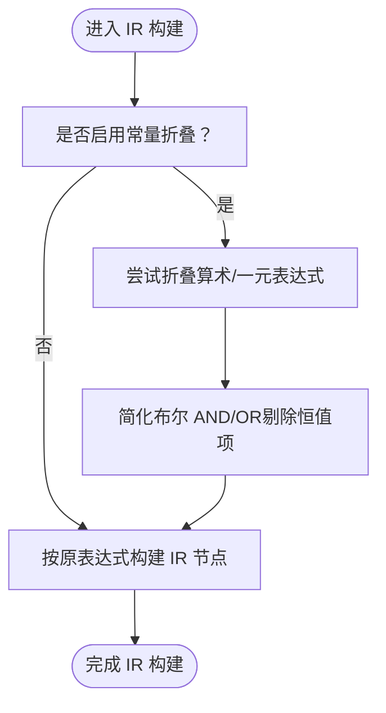
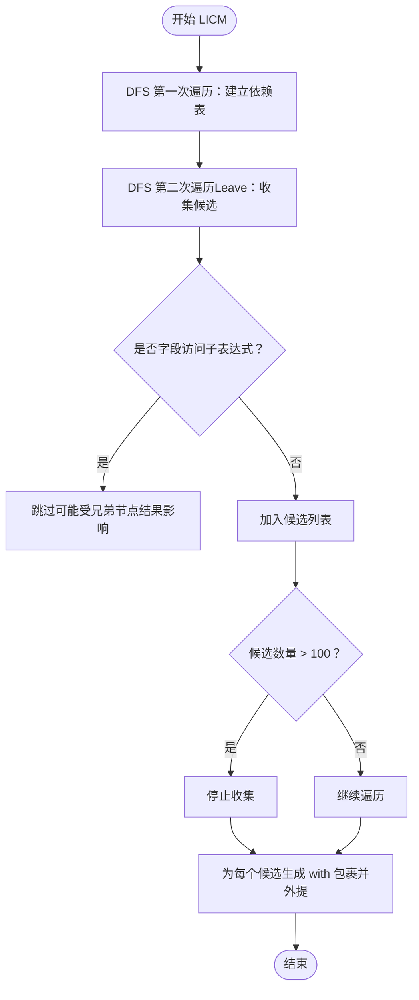
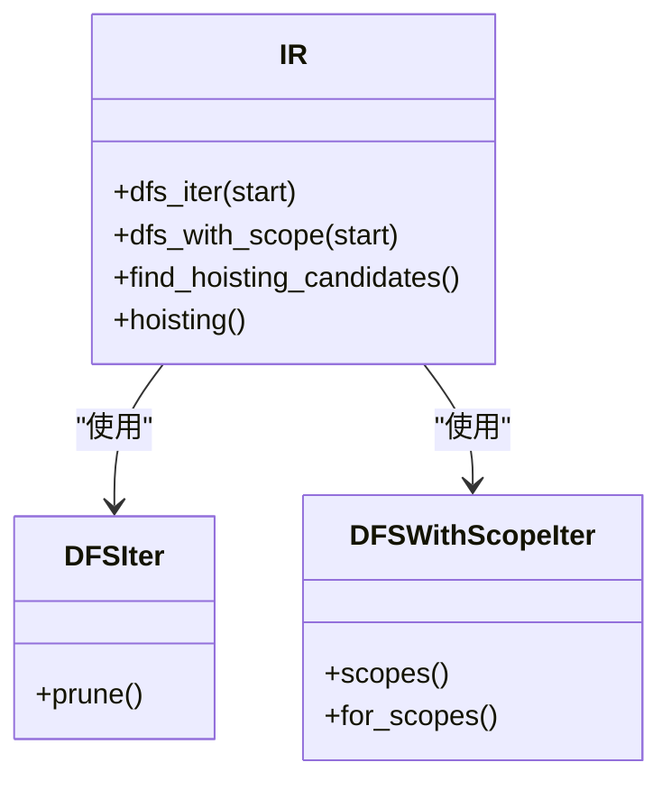
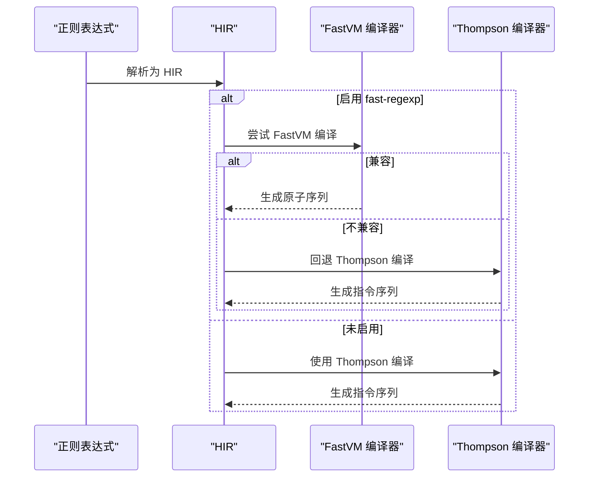
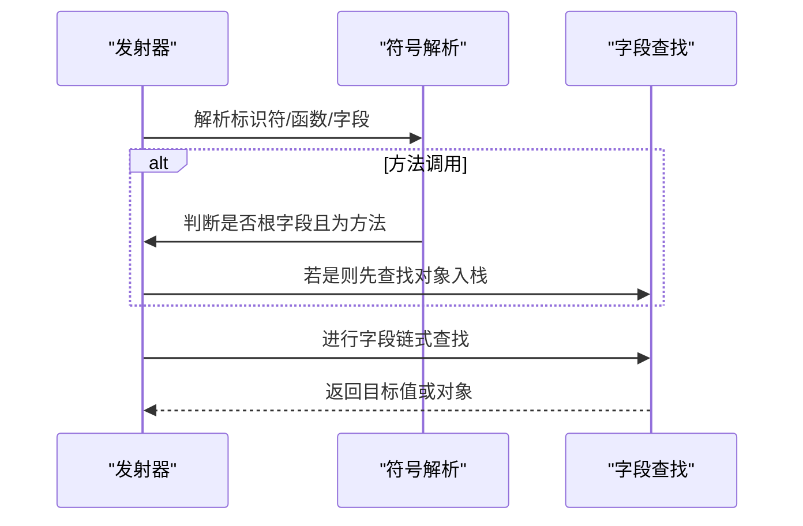
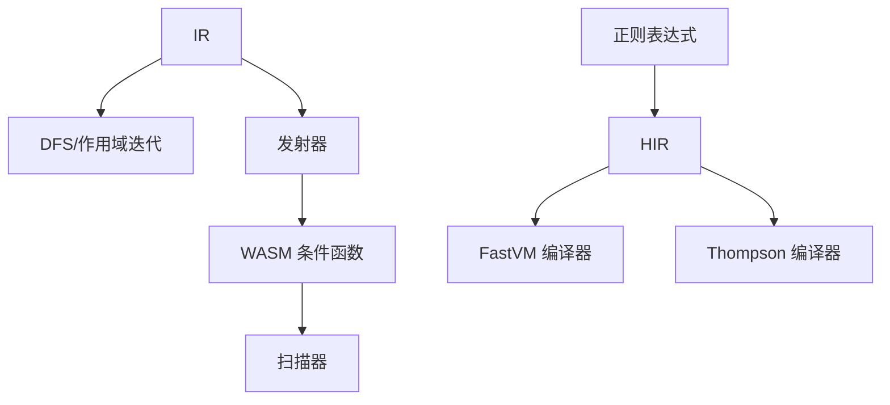

# 编译优化技术

<cite>
**本文引用的文件**
- [lib/src/compiler/ir/mod.rs](file://lib/src/compiler/ir/mod.rs)
- [lib/src/compiler/ir/dfs.rs](file://lib/src/compiler/ir/dfs.rs)
- [lib/src/compiler/emit.rs](file://lib/src/compiler/emit.rs)
- [lib/src/compiler/mod.rs](file://lib/src/compiler/mod.rs)
- [lib/src/re/parser.rs](file://lib/src/re/parser.rs)
- [lib/src/re/fast/compiler.rs](file://lib/src/re/fast/compiler.rs)
- [lib/src/re/thompson/compiler.rs](file://lib/src/re/thompson/compiler.rs)
- [lib/src/scanner/tests.rs](file://lib/src/scanner/tests.rs)
- [capi/include/yara_x.h](file://capi/include/yara_x.h)
- [capi/src/compiler.rs](file://capi/src/compiler.rs)
- [capi/src/scanner.rs](file://capi/src/scanner.rs)
- [lib/src/compiler/ir/tests/mod.rs](file://lib/src/compiler/ir/tests/mod.rs)
</cite>

## 目录
1. [引言](#引言)
2. [项目结构](#项目结构)
3. [核心组件](#核心组件)
4. [架构总览](#架构总览)
5. [详细组件分析](#详细组件分析)
6. [依赖关系分析](#依赖关系分析)
7. [性能考量](#性能考量)
8. [故障排查指南](#故障排查指南)
9. [结论](#结论)
10. [附录](#附录)

## 引言
本文件系统性梳理 YARA-X 的编译优化技术，聚焦于编译器在中间表示（IR）层面的优化策略与实现细节，包括常量折叠、布尔表达式简化、循环不变量外提（LICM）、以及针对 YARA 规则特点的模式匹配优化、正则表达式优化与模块调用优化。文档还覆盖优化器工作原理（数据流分析、控制流图构建与优化点识别）、优化效果评估与性能基准测试、优化级别配置、扩展方法与自定义优化规则实现指南，并提供优化前后的对比示例与性能提升数据来源。

## 项目结构
YARA-X 的编译管线由“源码 → 抽象语法树（AST）→ 中间表示（IR）→ 发射（WASM）”构成。优化主要发生在 IR 阶段，随后由发射器生成高效的 WASM 条件判断逻辑。正则表达式与十六进制模式通过统一的 HIR 表达并在不同 VM（FastVM/PikeVM）之间选择最优路径。



图表来源
- [lib/src/compiler/ir/mod.rs:1-30](file://lib/src/compiler/ir/mod.rs#L1-L30)
- [lib/src/compiler/emit.rs:1-40](file://lib/src/compiler/emit.rs#L1-L40)

章节来源
- [lib/src/compiler/ir/mod.rs:1-30](file://lib/src/compiler/ir/mod.rs#L1-L30)
- [lib/src/compiler/emit.rs:1-40](file://lib/src/compiler/emit.rs#L1-L40)

## 核心组件
- 中间表示（IR）：以树形结构表示规则条件，支持类型信息与语义检查后的表达式节点，是优化与发射的桥梁。
- 深度优先遍历（DFS）与作用域迭代：为依赖分析、变量可见性与循环外提提供基础。
- 常量折叠与布尔表达式简化：在 IR 构建阶段即时完成，减少运行时计算。
- 循环不变量外提（LICM）：基于依赖分析，将循环内不变表达式移出循环，减少重复计算。
- 正则表达式优化：统一解析为 HIR，按 FastVM/PikeVM 路径选择最优编译策略。
- 模块调用与字段访问：在发射阶段生成高效的方法调用与对象查找序列。
- 扫描器与性能剖析：提供规则级耗时统计，辅助优化效果评估。

章节来源
- [lib/src/compiler/ir/mod.rs:367-387](file://lib/src/compiler/ir/mod.rs#L367-L387)
- [lib/src/compiler/ir/dfs.rs:10-31](file://lib/src/compiler/ir/dfs.rs#L10-L31)
- [lib/src/compiler/ir/mod.rs:1040-1112](file://lib/src/compiler/ir/mod.rs#L1040-L1112)
- [lib/src/compiler/ir/mod.rs:811-883](file://lib/src/compiler/ir/mod.rs#L811-L883)
- [lib/src/re/fast/compiler.rs:17-68](file://lib/src/re/fast/compiler.rs#L17-L68)
- [lib/src/re/thompson/compiler.rs:1242-1288](file://lib/src/re/thompson/compiler.rs#L1242-L1288)
- [lib/src/scanner/tests.rs:788-816](file://lib/src/scanner/tests.rs#L788-L816)

## 架构总览
下图展示从规则条件到 WASM 条件函数的关键流程，以及优化点分布：

```mermaid
sequenceDiagram
participant R as "规则"
participant AST as "AST"
participant IR as "IR"
participant OPT as "优化器"
participant EM as "发射器"
participant WASM as "WASM 条件函数"
R->>AST : 解析规则
AST->>IR : 生成 IR含类型信息
IR->>OPT : 常量折叠/布尔简化/循环外提
OPT->>EM : 优化后的 IR
EM->>WASM : 生成 WASM 条件函数
```

图表来源
- [lib/src/compiler/ir/mod.rs:367-387](file://lib/src/compiler/ir/mod.rs#L367-L387)
- [lib/src/compiler/ir/mod.rs:1040-1112](file://lib/src/compiler/ir/mod.rs#L1040-L1112)
- [lib/src/compiler/ir/mod.rs:811-883](file://lib/src/compiler/ir/mod.rs#L811-L883)
- [lib/src/compiler/emit.rs:244-272](file://lib/src/compiler/emit.rs#L244-L272)

## 详细组件分析

### 常量折叠与布尔表达式简化
- 常量折叠：在 IR 构建阶段对常量表达式进行折叠，如整数/浮点取反、加减乘除等，直接产出常量节点，避免运行时计算。
- 布尔表达式简化：AND/OR 在构建时剔除恒真/恒假项，缩短短路路径，降低运行时分支成本。
- 文件级开关：可通过启用常量折叠功能影响 IR 行为；测试用例中存在“需要常量折叠”的标记文件，用于验证优化效果。



图表来源
- [lib/src/compiler/ir/mod.rs:990-1003](file://lib/src/compiler/ir/mod.rs#L990-L1003)
- [lib/src/compiler/ir/mod.rs:1040-1112](file://lib/src/compiler/ir/mod.rs#L1040-L1112)
- [lib/src/compiler/ir/mod.rs:1114-1137](file://lib/src/compiler/ir/mod.rs#L1114-L1137)

章节来源
- [lib/src/compiler/ir/mod.rs:990-1003](file://lib/src/compiler/ir/mod.rs#L990-L1003)
- [lib/src/compiler/ir/mod.rs:1040-1112](file://lib/src/compiler/ir/mod.rs#L1040-L1112)
- [lib/src/compiler/ir/mod.rs:1114-1137](file://lib/src/compiler/ir/mod.rs#L1114-L1137)
- [lib/src/compiler/ir/tests/mod.rs:88-136](file://lib/src/compiler/ir/tests/mod.rs#L88-L136)

### 循环不变量外提（LICM）
- 依赖分析：使用深度优先遍历（DFS）与作用域迭代，识别变量依赖关系，定位循环内不变表达式。
- 外提策略：将候选表达式替换为临时变量，并在外层 with 语句中初始化，从而减少每轮迭代中的重复计算。
- 限制与权衡：限制候选数量上限，避免过度嵌套导致性能回退。



图表来源
- [lib/src/compiler/ir/mod.rs:618-809](file://lib/src/compiler/ir/mod.rs#L618-L809)
- [lib/src/compiler/ir/mod.rs:811-883](file://lib/src/compiler/ir/mod.rs#L811-L883)
- [lib/src/compiler/ir/dfs.rs:123-231](file://lib/src/compiler/ir/dfs.rs#L123-L231)

章节来源
- [lib/src/compiler/ir/mod.rs:618-809](file://lib/src/compiler/ir/mod.rs#L618-L809)
- [lib/src/compiler/ir/mod.rs:811-883](file://lib/src/compiler/ir/mod.rs#L811-L883)
- [lib/src/compiler/ir/dfs.rs:123-231](file://lib/src/compiler/ir/dfs.rs#L123-L231)

### 控制流图与优化点识别
- 控制流图（CFG）构建：通过 IR 的 DFS 迭代器与作用域信息，识别 for/in/with 等控制结构的边界与嵌套关系，形成隐式的 CFG。
- 优化点识别：基于 DFS 的 Enter/Leave 事件与作用域栈，识别循环体、with 初始化区、字段访问上下文等，指导常量折叠与循环外提的精确应用。



图表来源
- [lib/src/compiler/ir/mod.rs:488-526](file://lib/src/compiler/ir/mod.rs#L488-L526)
- [lib/src/compiler/ir/mod.rs:498-500](file://lib/src/compiler/ir/mod.rs#L498-L500)
- [lib/src/compiler/ir/dfs.rs:63-121](file://lib/src/compiler/ir/dfs.rs#L63-L121)
- [lib/src/compiler/ir/dfs.rs:137-231](file://lib/src/compiler/ir/dfs.rs#L137-L231)

章节来源
- [lib/src/compiler/ir/mod.rs:488-526](file://lib/src/compiler/ir/mod.rs#L488-L526)
- [lib/src/compiler/ir/dfs.rs:63-121](file://lib/src/compiler/ir/dfs.rs#L63-L121)
- [lib/src/compiler/ir/dfs.rs:137-231](file://lib/src/compiler/ir/dfs.rs#L137-L231)

### 正则表达式优化
- 统一 HIR：正则表达式解析为 HIR，确保文本/十六进制模式共享同一引擎。
- FastVM 优先：在启用 fast-regexp 特性时优先尝试 FastVM 编译；若不兼容则回退到 Thompson/PikeVM。
- 字面量优化：根据 HIR 属性决定是否可进行“精确匹配”优化，避免不必要的回溯确认。



图表来源
- [lib/src/re/parser.rs:155-196](file://lib/src/re/parser.rs#L155-L196)
- [lib/src/re/fast/compiler.rs:17-68](file://lib/src/re/fast/compiler.rs#L17-L68)
- [lib/src/re/thompson/compiler.rs:1242-1288](file://lib/src/re/thompson/compiler.rs#L1242-L1288)
- [lib/src/compiler/mod.rs:2419-2461](file://lib/src/compiler/mod.rs#L2419-L2461)

章节来源
- [lib/src/re/parser.rs:155-196](file://lib/src/re/parser.rs#L155-L196)
- [lib/src/re/fast/compiler.rs:17-68](file://lib/src/re/fast/compiler.rs#L17-L68)
- [lib/src/re/thompson/compiler.rs:1242-1288](file://lib/src/re/thompson/compiler.rs#L1242-L1288)
- [lib/src/compiler/mod.rs:2419-2461](file://lib/src/compiler/mod.rs#L2419-L2461)

### 模块调用与字段访问优化
- 方法调用：在发射阶段，根据符号类型与对象是否为根字段，决定是否将对象压栈作为方法调用的第一个参数。
- 字段访问：通过查找列表（lookup_list）将多级字段访问转换为连续查找序列，减少重复对象加载。



图表来源
- [lib/src/compiler/emit.rs:343-410](file://lib/src/compiler/emit.rs#L343-L410)
- [lib/src/compiler/emit.rs:628-647](file://lib/src/compiler/emit.rs#L628-L647)

章节来源
- [lib/src/compiler/emit.rs:343-410](file://lib/src/compiler/emit.rs#L343-L410)
- [lib/src/compiler/emit.rs:628-647](file://lib/src/compiler/emit.rs#L628-L647)

### 模式匹配优化
- 模式锚定与非锚定：根据规则条件动态设置模式锚定状态，避免无谓的全文件扫描。
- 慢模式警告：当检测到常见字节重复等低效模式时发出警告，提示潜在性能问题。

章节来源
- [lib/src/compiler/ir/mod.rs:241-293](file://lib/src/compiler/ir/mod.rs#L241-L293)
- [lib/src/compiler/mod.rs:1519-1536](file://lib/src/compiler/mod.rs#L1519-L1536)

## 依赖关系分析
- IR 依赖 DFS 迭代器与作用域信息进行优化；
- 发射器依赖 IR 类型信息与符号表，生成 WASM；
- 正则表达式编译器依赖 HIR，FastVM 与 Thompson 编译器分别提供不同优化路径；
- 扫描器在运行时消费 WASM 条件函数，支持规则级性能剖析。



图表来源
- [lib/src/compiler/ir/mod.rs:488-526](file://lib/src/compiler/ir/mod.rs#L488-L526)
- [lib/src/compiler/emit.rs:244-272](file://lib/src/compiler/emit.rs#L244-L272)
- [lib/src/re/fast/compiler.rs:17-68](file://lib/src/re/fast/compiler.rs#L17-L68)
- [lib/src/re/thompson/compiler.rs:1242-1288](file://lib/src/re/thompson/compiler.rs#L1242-L1288)

章节来源
- [lib/src/compiler/ir/mod.rs:488-526](file://lib/src/compiler/ir/mod.rs#L488-L526)
- [lib/src/compiler/emit.rs:244-272](file://lib/src/compiler/emit.rs#L244-L272)
- [lib/src/re/fast/compiler.rs:17-68](file://lib/src/re/fast/compiler.rs#L17-L68)
- [lib/src/re/thompson/compiler.rs:1242-1288](file://lib/src/re/thompson/compiler.rs#L1242-L1288)

## 性能考量
- 常量折叠与布尔简化显著减少运行时分支与计算；
- 循环外提降低每轮迭代中的重复计算，尤其在大规模范围扫描场景收益明显；
- 正则表达式 FastVM 优先编译可大幅降低匹配开销；
- 规则级性能剖析（扫描器）可用于定位热点规则，指导进一步优化。

章节来源
- [lib/src/scanner/tests.rs:788-816](file://lib/src/scanner/tests.rs#L788-L816)

## 故障排查指南
- 编译期警告与错误：通过 C API 提供的 JSON 警告接口获取详细信息，包括慢模式、慢循环等警告。
- 运行时超时与状态：扫描器支持超时设置与规则级性能数据查询，便于定位长尾规则。
- 优化开关：通过编译器标志启用条件优化（包含 CSE/LICM），并可将慢循环/慢模式视为错误处理。

章节来源
- [capi/include/yara_x.h:40-53](file://capi/include/yara_x.h#L40-L53)
- [capi/src/compiler.rs:35-577](file://capi/src/compiler.rs#L35-L577)
- [capi/src/scanner.rs:143-155](file://capi/src/scanner.rs#L143-L155)

## 结论
YARA-X 的编译优化以 IR 为核心，结合常量折叠、布尔表达式简化与循环外提，有效降低运行时开销。正则表达式统一 HIR 并在 FastVM/PikeVM 间自动择优，模块调用与字段访问在发射阶段被映射为高效的 WASM 序列。配合扫描器的规则级性能剖析，可实现从规则设计到执行效率的闭环优化。

## 附录

### 优化级别与配置
- 编译器标志
  - 启用条件优化：包含 CSE 与 LICM；
  - 错误化慢循环/慢模式：将潜在性能问题转为编译错误；
  - 禁用 include：严格规则管理。
- 优化开关与行为
  - 常量折叠：可通过功能开关影响 IR 构建；
  - 循环外提：通过 hoisting 开关控制；
  - 正则表达式：fast-regexp 特性决定 FastVM 优先策略。

章节来源
- [capi/include/yara_x.h:40-53](file://capi/include/yara_x.h#L40-L53)
- [lib/src/compiler/ir/tests/mod.rs:88-136](file://lib/src/compiler/ir/tests/mod.rs#L88-L136)
- [lib/src/compiler/ir/mod.rs:811-883](file://lib/src/compiler/ir/mod.rs#L811-L883)

### 优化前后对比示例与性能提升数据
- IR 测试用例：通过 goldenfile 输出 IR 优化前/后（含 CSE 与 LICM）的中间表示，便于对比；
- 性能剖析：规则级最慢规则统计与清空接口，用于量化优化效果；
- 慢模式检测：在规则编译阶段对潜在低效模式发出警告，指导规则重写。

章节来源
- [lib/src/compiler/ir/tests/mod.rs:88-136](file://lib/src/compiler/ir/tests/mod.rs#L88-L136)
- [lib/src/scanner/tests.rs:788-816](file://lib/src/scanner/tests.rs#L788-L816)
- [lib/src/compiler/mod.rs:1519-1536](file://lib/src/compiler/mod.rs#L1519-L1536)