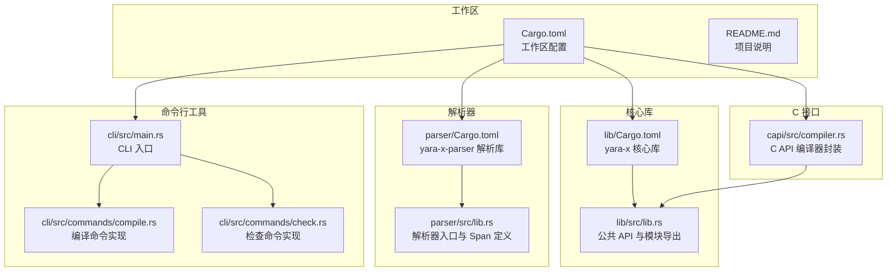
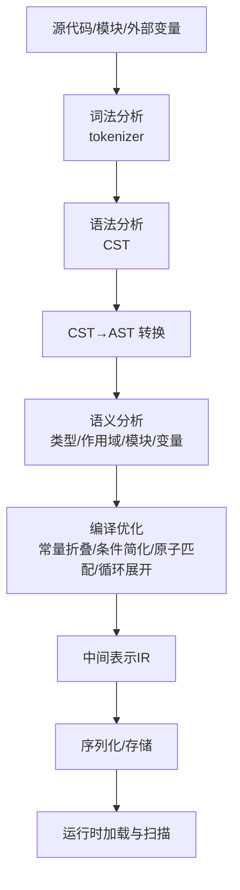
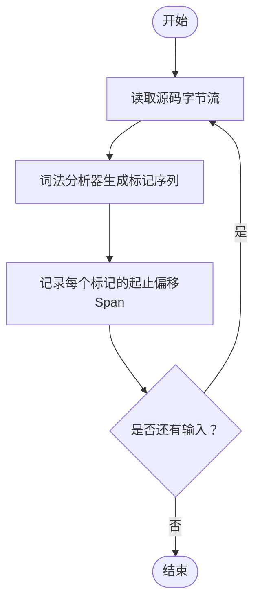
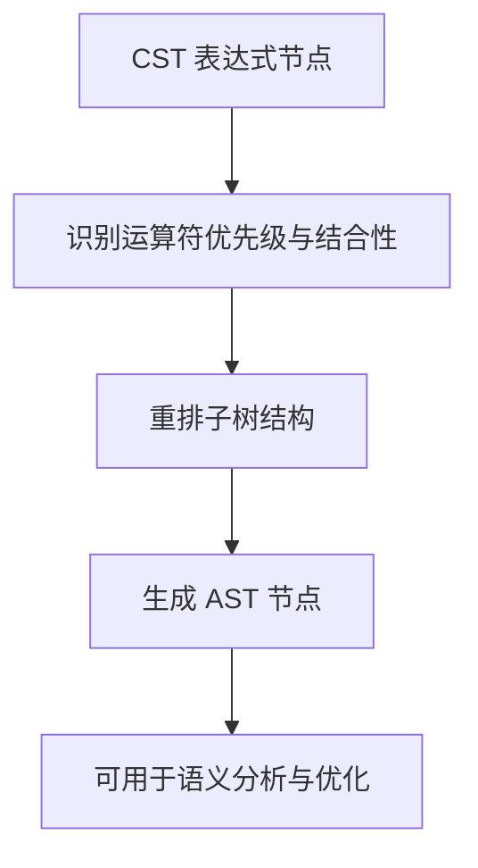
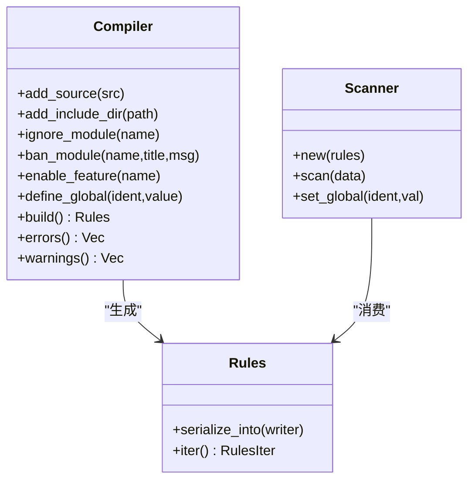
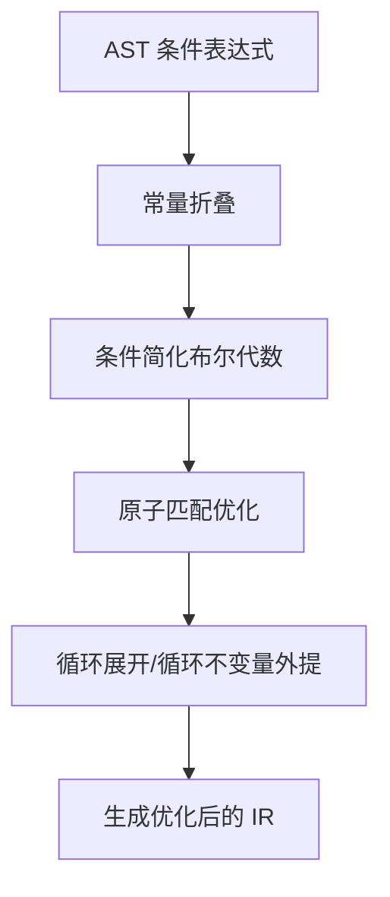
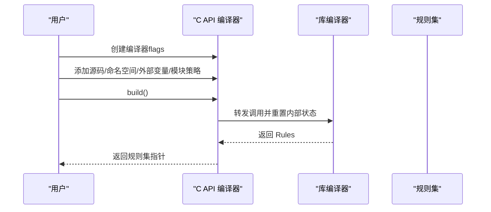
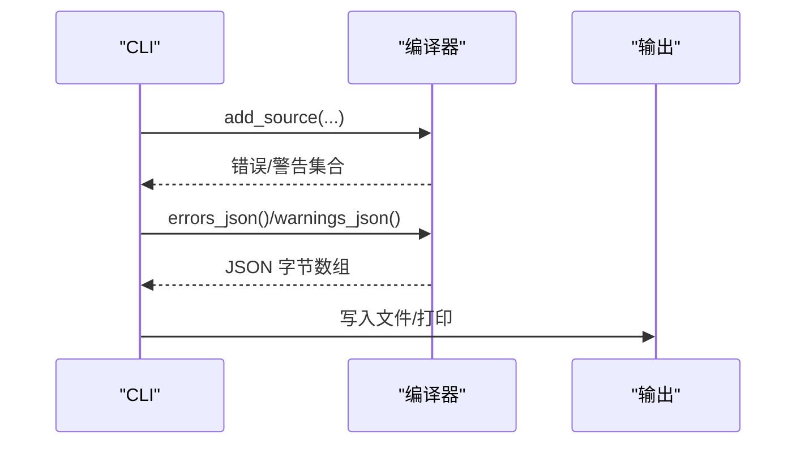
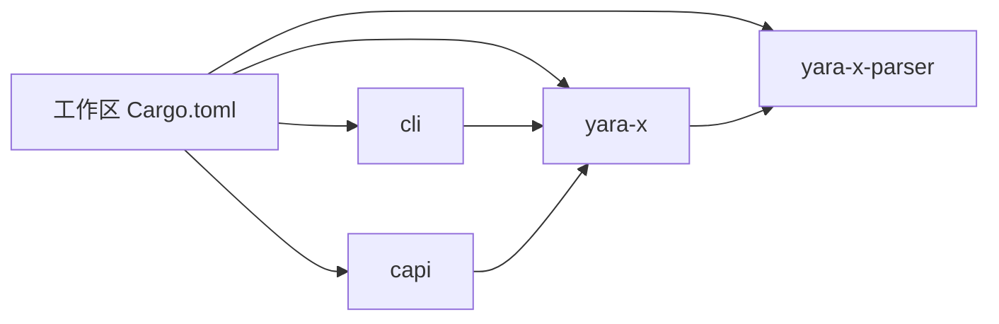

# 规则编译器

<cite>
**本文引用的文件**
- [Cargo.toml](file://yara-x/Cargo.toml)
- [README.md](file://yara-x/README.md)
- [lib/Cargo.toml](file://yara-x/lib/Cargo.toml)
- [parser/Cargo.toml](file://yara-x/parser/Cargo.toml)
- [lib/src/lib.rs](file://yara-x/lib/src/lib.rs)
- [parser/src/lib.rs](file://yara-x/parser/src/lib.rs)
- [cli/src/main.rs](file://yara-x/cli/src/main.rs)
- [cli/src/commands/compile.rs](file://yara-x/cli/src/commands/compile.rs)
- [cli/src/commands/check.rs](file://yara-x/cli/src/commands/check.rs)
- [capi/src/compiler.rs](file://yara-x/capi/src/compiler.rs)
</cite>

## 目录
1. [简介](#简介)
2. [项目结构](#项目结构)
3. [核心组件](#核心组件)
4. [架构总览](#架构总览)
5. [详细组件分析](#详细组件分析)
6. [依赖关系分析](#依赖关系分析)
7. [性能考量](#性能考量)
8. [故障排查指南](#故障排查指南)
9. [结论](#结论)
10. [附录](#附录)

## 简介
本文件为规则编译器的详细技术文档，面向编译器开发者与高级用户，系统阐述从词法分析、语法分析、CST 到 AST 的转换、语义分析与中间表示生成，以及编译期优化（常量折叠、条件表达式简化、原子模式匹配、循环展开等）。同时覆盖外部变量、模块导入、规则作用域与生命周期管理、错误处理与警告系统、调试信息生成，并给出编译器架构图与关键数据结构说明。

## 项目结构
仓库采用多 crate 工作区组织，核心与解析能力分别由独立 crate 提供，CLI 与 C API 作为入口与桥接层，便于在不同语言与场景中使用。



**图表来源**
- [Cargo.toml:17-30](file://yara-x/Cargo.toml#L17-L30)
- [lib/Cargo.toml:1-30](file://yara-x/lib/Cargo.toml#L1-L30)
- [parser/Cargo.toml:1-20](file://yara-x/parser/Cargo.toml#L1-L20)
- [lib/src/lib.rs:48-86](file://yara-x/lib/src/lib.rs#L48-L86)
- [parser/src/lib.rs:24-37](file://yara-x/parser/src/lib.rs#L24-L37)
- [cli/src/main.rs:31-107](file://yara-x/cli/src/main.rs#L31-L107)
- [cli/src/commands/compile.rs:13-70](file://yara-x/cli/src/commands/compile.rs#L13-L70)
- [cli/src/commands/check.rs:18-52](file://yara-x/cli/src/commands/check.rs#L18-L52)
- [capi/src/compiler.rs:10-14](file://yara-x/capi/src/compiler.rs#L10-L14)

**章节来源**
- [Cargo.toml:17-30](file://yara-x/Cargo.toml#L17-L30)
- [README.md:6-42](file://yara-x/README.md#L6-L42)

## 核心组件
- 编译器（Compiler）：负责接收源码、执行解析、语义分析、优化与中间表示生成，最终产出可扫描的规则集。
- 扫描器（Scanner）：使用已编译规则对内存或文件进行高效匹配。
- 解析器（yara-x-parser）：提供词法分析（tokenizer）、语法分析（parser）、CST/AST 转换与错误报告。
- 命令行工具（CLI）：提供编译、检查、格式化、扫描等子命令。
- C API：为 C/C++/Go 等语言提供编译器与扫描器的绑定接口。
- 模块系统：支持通过模块扩展规则能力，如 PE、ELF、哈希等。
- 变量系统：支持外部变量定义与全局变量注入。

**章节来源**
- [lib/src/lib.rs:48-86](file://yara-x/lib/src/lib.rs#L48-L86)
- [parser/src/lib.rs:24-37](file://yara-x/parser/src/lib.rs#L24-L37)
- [cli/src/commands/compile.rs:13-70](file://yara-x/cli/src/commands/compile.rs#L13-L70)
- [capi/src/compiler.rs:10-14](file://yara-x/capi/src/compiler.rs#L10-L14)

## 架构总览
编译器整体流程自上而下分为：输入（源码/模块/外部变量）→ 解析（CST/AST）→ 语义分析与优化 → 中间表示（IR）→ 序列化/运行时加载。



**图表来源**
- [parser/src/lib.rs:1-22](file://yara-x/parser/src/lib.rs#L1-L22)
- [lib/src/lib.rs:48-86](file://yara-x/lib/src/lib.rs#L48-L86)
- [lib/Cargo.toml:30-86](file://yara-x/lib/Cargo.toml#L30-L86)

## 详细组件分析

### 1) 词法分析（Tokenizer）
- 使用解析库提供的词法分析器，将源码流切分为标记序列，保留位置信息（Span），用于后续语法分析与错误定位。
- 支持注释、空白、关键字、操作符、字面量等的识别。
- 位置跨度（Span）用于高亮与错误报告。



**图表来源**
- [parser/src/lib.rs:38-141](file://yara-x/parser/src/lib.rs#L38-L141)

**章节来源**
- [parser/src/lib.rs:24-37](file://yara-x/parser/src/lib.rs#L24-L37)
- [parser/src/lib.rs:38-141](file://yara-x/parser/src/lib.rs#L38-L141)

### 2) 语法分析（Parser）与 CST/AST
- Parser 以标记流为输入，构建 CST（保留所有原始细节，不含运算符优先级）。
- 提供 CST→AST 转换，应用运算符优先级与结合性，得到更利于语义分析与优化的抽象表示。
- 错误与警告通过统一的诊断系统输出，支持彩色终端显示。

```mermaid
sequenceDiagram
participant SRC as "源码"
participant TOK as "词法分析器"
participant PAR as "语法分析器"
participant CST as "CST"
participant AST as "AST"
SRC->>TOK : 输入字节流
TOK-->>PAR : 标记序列
PAR-->>CST : 构建 CST保留注释/空格
CST->>AST : CST→AST 转换应用优先级/结合性
AST-->>PAR : 语法树语义分析输入
```

**图表来源**
- [parser/src/lib.rs:1-22](file://yara-x/parser/src/lib.rs#L1-L22)
- [parser/src/lib.rs:24-37](file://yara-x/parser/src/lib.rs#L24-L37)

**章节来源**
- [parser/src/lib.rs:1-22](file://yara-x/parser/src/lib.rs#L1-L22)

### 3) CST 到 AST 的转换
- 将表达式节点按运算符优先级重组，消除冗余括号，形成更紧凑的表达式树。
- 为后续常量折叠、公共子表达式消除等优化奠定基础。



**图表来源**
- [parser/src/lib.rs:1-22](file://yara-x/parser/src/lib.rs#L1-L22)

**章节来源**
- [parser/src/lib.rs:1-22](file://yara-x/parser/src/lib.rs#L1-L22)

### 4) 语义分析与中间表示生成
- 类型与作用域检查：确保标识符已声明、类型匹配、规则命名唯一、标签合法等。
- 模块导入与忽略：支持模块白名单/黑名单、忽略模块、禁用 include、特征开关等。
- 外部变量与全局变量：在编译前定义，运行时可被扫描器修改。
- 中间表示（IR）：将规则条件与模式转换为可执行的指令序列或结构化表示，便于优化与运行时匹配。



**图表来源**
- [capi/src/compiler.rs:10-14](file://yara-x/capi/src/compiler.rs#L10-L14)
- [capi/src/compiler.rs:54-75](file://yara-x/capi/src/compiler.rs#L54-L75)
- [capi/src/compiler.rs:597-624](file://yara-x/capi/src/compiler.rs#L597-L624)
- [lib/src/lib.rs:48-86](file://yara-x/lib/src/lib.rs#L48-L86)

**章节来源**
- [capi/src/compiler.rs:10-14](file://yara-x/capi/src/compiler.rs#L10-L14)
- [capi/src/compiler.rs:54-75](file://yara-x/capi/src/compiler.rs#L54-L75)
- [capi/src/compiler.rs:597-624](file://yara-x/capi/src/compiler.rs#L597-L624)
- [lib/src/lib.rs:48-86](file://yara-x/lib/src/lib.rs#L48-L86)

### 5) 编译优化技术
- 常量折叠：在编译期计算可确定的常量表达式结果，减少运行时开销。
- 条件表达式简化：基于布尔代数规则简化复杂条件，提升匹配效率。
- 原子模式匹配：利用精确原子（无需二次验证）加速正则匹配。
- 循环展开：针对特定循环不变量进行展开，降低循环开销。
- 条件优化开关：可通过标志启用通用的条件优化（如公共子表达式消除、循环不变量外提）。



**图表来源**
- [capi/src/compiler.rs:43-47](file://yara-x/capi/src/compiler.rs#L43-L47)
- [lib/Cargo.toml:30-50](file://yara-x/lib/Cargo.toml#L30-L50)

**章节来源**
- [capi/src/compiler.rs:43-47](file://yara-x/capi/src/compiler.rs#L43-L47)
- [lib/Cargo.toml:30-50](file://yara-x/lib/Cargo.toml#L30-L50)

### 6) 外部变量、模块导入、规则作用域与生命周期
- 外部变量：在编译前定义，初始值在编译后保持；扫描器可动态更新其值。
- 模块导入：支持模块白名单/黑名单、忽略模块、禁用 include、特征开关；错误可定制标题与消息。
- 规则作用域：支持命名空间与路径命名空间；支持为 include 目录设置搜索路径。
- 生命周期：C API 对象在 build 后会重置内部状态以便复用；错误/警告 JSON 输出便于集成。



**图表来源**
- [capi/src/compiler.rs:77-95](file://yara-x/capi/src/compiler.rs#L77-L95)
- [capi/src/compiler.rs:597-624](file://yara-x/capi/src/compiler.rs#L597-L624)

**章节来源**
- [capi/src/compiler.rs:151-180](file://yara-x/capi/src/compiler.rs#L151-L180)
- [capi/src/compiler.rs:182-208](file://yara-x/capi/src/compiler.rs#L182-L208)
- [capi/src/compiler.rs:279-321](file://yara-x/capi/src/compiler.rs#L279-L321)
- [capi/src/compiler.rs:323-350](file://yara-x/capi/src/compiler.rs#L323-L350)
- [capi/src/compiler.rs:597-624](file://yara-x/capi/src/compiler.rs#L597-L624)

### 7) 错误处理、警告系统与调试信息
- 错误与警告：统一的错误/警告收集与 JSON 序列化输出，便于工具链集成。
- 彩色错误：支持在终端启用彩色输出，增强可读性。
- 调试信息：CLI 提供调试命令与检查命令，支持并行检查、过滤与统计。



**图表来源**
- [cli/src/commands/check.rs:213-248](file://yara-x/cli/src/commands/check.rs#L213-L248)
- [capi/src/compiler.rs:465-595](file://yara-x/capi/src/compiler.rs#L465-L595)

**章节来源**
- [cli/src/commands/check.rs:213-248](file://yara-x/cli/src/commands/check.rs#L213-L248)
- [capi/src/compiler.rs:465-595](file://yara-x/capi/src/compiler.rs#L465-L595)

## 依赖关系分析
- 工作区统一版本与依赖管理，解析库与核心库分离，CLI 与 C API 作为独立入口。
- 核心库启用多项特性（常量折叠、精确原子、快速正则、并行编译等），默认开启多项模块。
- 解析库提供日志与序列化特性，便于开发与测试。



**图表来源**
- [Cargo.toml:17-30](file://yara-x/Cargo.toml#L17-L30)
- [lib/Cargo.toml:226-285](file://yara-x/lib/Cargo.toml#L226-L285)
- [parser/Cargo.toml:29-41](file://yara-x/parser/Cargo.toml#L29-L41)

**章节来源**
- [Cargo.toml:17-30](file://yara-x/Cargo.toml#L17-L30)
- [lib/Cargo.toml:226-285](file://yara-x/lib/Cargo.toml#L226-L285)
- [parser/Cargo.toml:29-41](file://yara-x/parser/Cargo.toml#L29-L41)

## 性能考量
- 常量折叠与条件简化：减少运行时计算，提高匹配速度。
- 精确原子匹配：避免二次验证，显著提升正则匹配性能。
- 并行编译：大规模规则集可启用并行编译以缩短编译时间。
- 快速正则引擎：可选择替代的正则匹配机制，平衡性能与兼容性。
- 日志与剖析：可选的日志与规则剖析功能用于定位热点规则。

**章节来源**
- [lib/Cargo.toml:30-86](file://yara-x/lib/Cargo.toml#L30-L86)

## 故障排查指南
- 检查命令：批量检查源文件语法与元数据规范，支持并行与过滤，输出统计与详细报告。
- 错误与警告：通过 JSON 输出错误/警告详情，便于自动化工具消费。
- C API：在构建失败时，使用错误 JSON 获取结构化诊断信息；必要时启用彩色错误输出。

**章节来源**
- [cli/src/commands/check.rs:66-282](file://yara-x/cli/src/commands/check.rs#L66-L282)
- [capi/src/compiler.rs:465-595](file://yara-x/capi/src/compiler.rs#L465-L595)

## 结论
本编译器以解析库为核心，提供从词法到语法、从 CST 到 AST 的完整流程，并在语义分析阶段完成模块与变量处理，在优化阶段引入常量折叠、条件简化、原子匹配与循环展开等技术，最终生成高效的中间表示并支持序列化与运行时加载。通过 CLI 与 C API，编译器可无缝融入多种工具链与语言环境，满足高性能与易用性的双重需求。

## 附录
- 关键数据结构：Span（位置跨度）、Compiler（编译器）、Rules（规则集）、Scanner（扫描器）。
- 命令行与 C API：编译、检查、调试、扫描等子命令与 C API 函数族。

**章节来源**
- [parser/src/lib.rs:38-141](file://yara-x/parser/src/lib.rs#L38-L141)
- [lib/src/lib.rs:48-86](file://yara-x/lib/src/lib.rs#L48-L86)
- [cli/src/commands/compile.rs:13-70](file://yara-x/cli/src/commands/compile.rs#L13-L70)
- [capi/src/compiler.rs:77-95](file://yara-x/capi/src/compiler.rs#L77-L95)