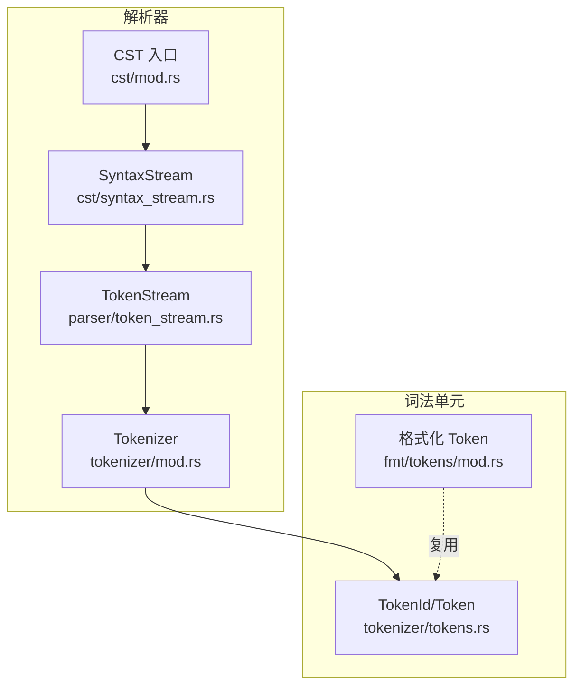
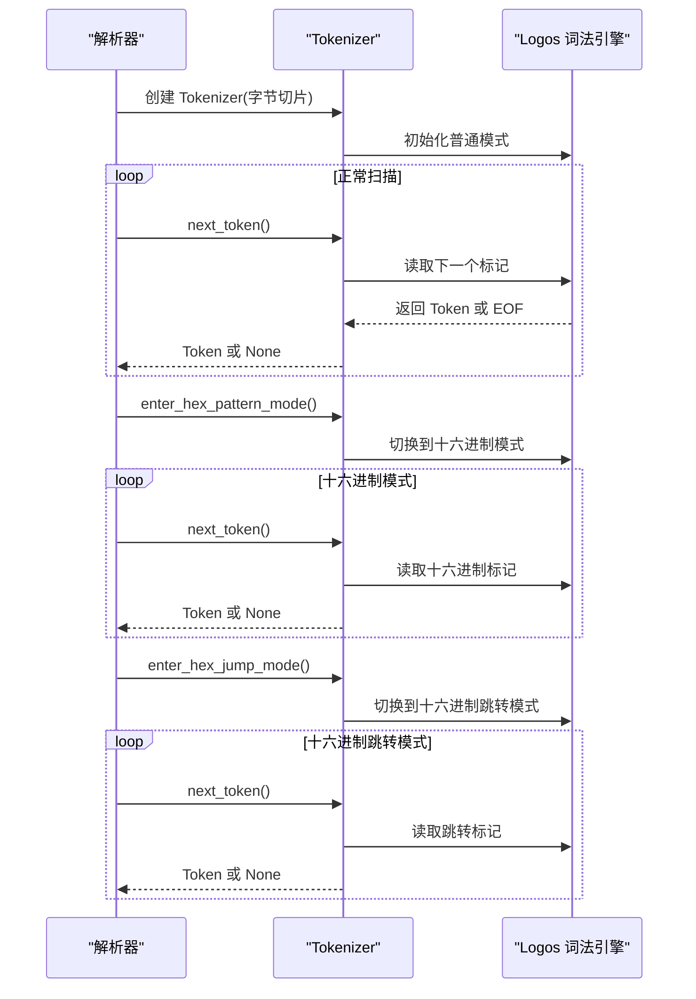
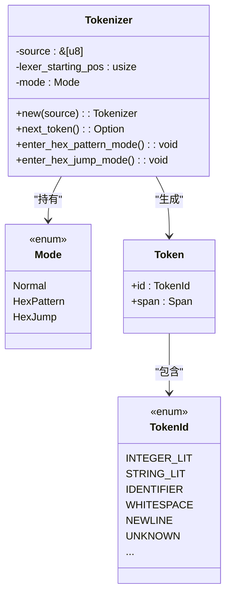
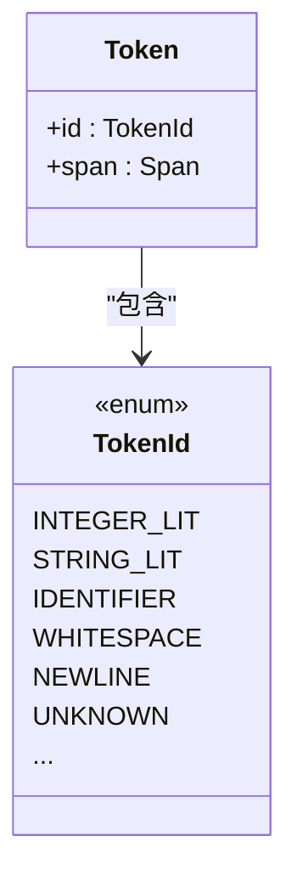
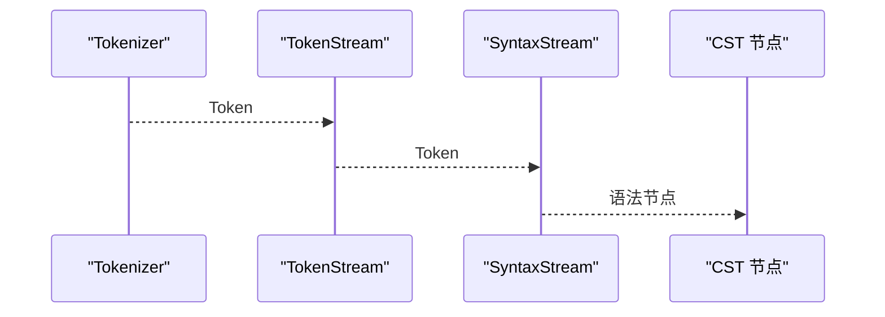
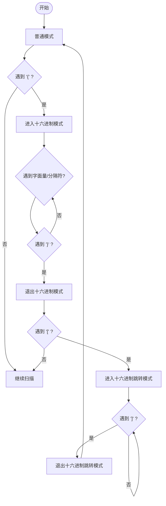
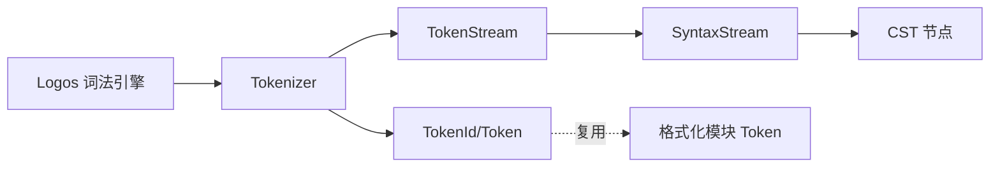

# 词法分析

<cite>
**本文引用的文件**
- [tokenizer/mod.rs](file://parser/src/tokenizer/mod.rs)
- [tokenizer/tokens.rs](file://parser/src/tokenizer/tokens.rs)
- [tokenizer/tests.rs](file://parser/src/tokenizer/tests.rs)
- [cst/syntax_stream.rs](file://parser/src/cst/syntax_stream.rs)
- [cst/mod.rs](file://parser/src/cst/mod.rs)
- [parser/token_stream.rs](file://parser/src/parser/token_stream.rs)
- [fmt/tokens/mod.rs](file://fmt/src/tokens/mod.rs)
</cite>

## 目录
1. [引言](#引言)
2. [项目结构](#项目结构)
3. [核心组件](#核心组件)
4. [架构总览](#架构总览)
5. [详细组件分析](#详细组件分析)
6. [依赖关系分析](#依赖关系分析)
7. [性能考量](#性能考量)
8. [故障排查指南](#故障排查指南)
9. [结论](#结论)
10. [附录](#附录)

## 引言
本文件面向开发者与模块维护者，系统性阐述 yara-x 项目中的词法分析器（Tokenizer）的设计与实现。内容覆盖字符流处理、标记识别、关键字识别、字面量解析、注释与字符串字面量处理、十六进制模式与跳转模式、状态机设计、错误恢复机制、性能优化策略，以及配置与扩展机制。为便于不同背景读者理解，文档采用由浅入深的分层结构，并辅以与源码一一对应的图示与来源标注。

## 项目结构
词法分析器位于 parser 子模块中，围绕 Tokenizer、Token 类型与 CST（具体语法树）流展开协作。关键文件职责如下：
- tokenizer/mod.rs：定义 Tokenizer 的三种工作模式（普通、十六进制模式、十六进制跳转），提供进入/退出模式的方法与标记迭代接口。
- tokenizer/tokens.rs：定义内部使用的 TokenId 枚举与 Token 包装类型，用于区分不同语法单元。
- tokenizer/tests.rs：提供大量测试用例，覆盖整数字面量、空白字符、换行符、未知字符等场景。
- cst/syntax_stream.rs：提供语法流迭代器，将 Token 序列转换为 CST 节点序列。
- cst/mod.rs：CST 模块入口，包含语法流的消费与推进逻辑。
- parser/token_stream.rs：解析器侧的 Token 流适配器，负责从 Tokenizer 接收标记并驱动语法分析。
- fmt/tokens/mod.rs：格式化模块中的 Token 定义与处理，体现 Token 在不同子系统中的复用。

**图表来源**
- [tokenizer/mod.rs:1-200](file://parser/src/tokenizer/mod.rs#L1-L200)
- [tokenizer/tokens.rs:1-250](file://parser/src/tokenizer/tokens.rs#L1-L250)
- [parser/token_stream.rs:1-120](file://parser/src/parser/token_stream.rs#L1-L120)
- [cst/syntax_stream.rs:1-120](file://parser/src/cst/syntax_stream.rs#L1-L120)
- [cst/mod.rs:500-600](file://parser/src/cst/mod.rs#L500-L600)
- [fmt/tokens/mod.rs:130-180](file://fmt/src/tokens/mod.rs#L130-L180)

**章节来源**
- [tokenizer/mod.rs:1-200](file://parser/src/tokenizer/mod.rs#L1-L200)
- [tokenizer/tokens.rs:1-250](file://parser/src/tokenizer/tokens.rs#L1-L250)
- [parser/token_stream.rs:1-120](file://parser/src/parser/token_stream.rs#L1-L120)
- [cst/syntax_stream.rs:1-120](file://parser/src/cst/syntax_stream.rs#L1-L120)
- [cst/mod.rs:500-600](file://parser/src/cst/mod.rs#L500-L600)
- [fmt/tokens/mod.rs:130-180](file://fmt/src/tokens/mod.rs#L130-L180)

## 核心组件
- Tokenizer：对输入字节切片进行扫描，按当前模式输出 Token；支持在解析器驱动下切换到十六进制模式与十六进制跳转模式。
- TokenId/Token：内部标记类型，承载标记种类与位置跨度（Span），用于后续解析与格式化。
- SyntaxStream：将 Token 序列转换为 CST 节点序列，供语法分析使用。
- TokenStream：解析器侧的适配器，负责从 Tokenizer 获取下一个标记并推进解析流程。
- 测试套件：覆盖整数字面量、十六进制字面量、空白字符、换行符、未知字符等典型场景。

**章节来源**
- [tokenizer/mod.rs:56-205](file://parser/src/tokenizer/mod.rs#L56-L205)
- [tokenizer/tokens.rs:6-250](file://parser/src/tokenizer/tokens.rs#L6-L250)
- [cst/syntax_stream.rs:1-120](file://parser/src/cst/syntax_stream.rs#L1-L120)
- [parser/token_stream.rs:60-100](file://parser/src/parser/token_stream.rs#L60-L100)
- [tokenizer/tests.rs:52-387](file://parser/src/tokenizer/tests.rs#L52-L387)

## 架构总览
词法分析器通过模式切换与状态机协作，完成从字节流到标记序列的转换。解析器在遇到特定语法结构时（如十六进制模式起止、跳转起止）通知 Tokenizer 切换模式，从而正确识别同一字符序列在不同上下文中的不同语义。

**图表来源**
- [tokenizer/mod.rs:69-193](file://parser/src/tokenizer/mod.rs#L69-L193)

**章节来源**
- [tokenizer/mod.rs:22-45](file://parser/src/tokenizer/mod.rs#L22-L45)
- [tokenizer/mod.rs:149-193](file://parser/src/tokenizer/mod.rs#L149-L193)

## 详细组件分析

### 组件一：Tokenizer（标记生成器）
- 角色与职责
  - 封装底层词法引擎（Logos），提供统一的标记迭代接口。
  - 管理三种模式：普通模式、十六进制模式、十六进制跳转模式。
  - 在解析器驱动下切换模式，并自动回退到上一模式。
- 关键方法
  - next_token：返回下一个标记或 None。
  - enter_hex_pattern_mode：进入十六进制模式。
  - enter_hex_jump_mode：进入十六进制跳转模式。
- 错误处理
  - 在非正常模式调用模式切换会触发断言错误，提示调用方错误的时机。
  - 未知字符在普通模式下会被识别为未知标记，交由上层处理。
- 性能特性
  - 基于游标与 Span 追踪位置，避免重复拷贝源码。
  - 按需切换模式，减少不必要的解析分支。

**图表来源**
- [tokenizer/mod.rs:56-205](file://parser/src/tokenizer/mod.rs#L56-L205)
- [tokenizer/tokens.rs:6-250](file://parser/src/tokenizer/tokens.rs#L6-L250)

**章节来源**
- [tokenizer/mod.rs:56-205](file://parser/src/tokenizer/mod.rs#L56-L205)
- [tokenizer/mod.rs:196-205](file://parser/src/tokenizer/mod.rs#L196-L205)

### 组件二：Token 与 TokenId（标记类型）
- TokenId：内部标记种类枚举，涵盖整数字面量、字符串字面量、标识符、空白、换行、未知字符等。
- Token：对外暴露的标记包装，包含 TokenId 与 Span（起止位置）。
- 作用：为解析器与格式化模块提供统一的标记抽象，确保跨模块一致性。

**图表来源**
- [tokenizer/tokens.rs:6-250](file://parser/src/tokenizer/tokens.rs#L6-L250)

**章节来源**
- [tokenizer/tokens.rs:6-250](file://parser/src/tokenizer/tokens.rs#L6-L250)

### 组件三：SyntaxStream（语法流）
- 角色与职责
  - 将 Token 序列转换为 CST 节点序列，供语法分析阶段消费。
  - 提供推进与窥视能力，配合解析器的状态机完成语法推导。
- 与 Tokenizer 的关系
  - 通过 TokenStream 间接消费 Tokenizer 输出的标记序列。

**图表来源**
- [parser/token_stream.rs:60-100](file://parser/src/parser/token_stream.rs#L60-L100)
- [cst/syntax_stream.rs:1-120](file://parser/src/cst/syntax_stream.rs#L1-L120)

**章节来源**
- [parser/token_stream.rs:60-100](file://parser/src/parser/token_stream.rs#L60-L100)
- [cst/syntax_stream.rs:1-120](file://parser/src/cst/syntax_stream.rs#L1-L120)

### 组件四：十六进制模式与跳转模式
- 设计动机
  - 同一字符序列在不同上下文中有不同语义。例如标识符与十六进制字面量、整数字面量与十六进制字面量的区分。
- 模式切换
  - 解析器在遇到十六进制模式起始后调用 enter_hex_pattern_mode，遇到跳转起始后调用 enter_hex_jump_mode。
  - Tokenizer 自动在遇到对应结束符时回退到上一模式。
- 与测试的关系
  - 测试覆盖了十六进制字面量与普通整数字面量的区分，验证模式切换的有效性。

**图表来源**
- [tokenizer/mod.rs:22-45](file://parser/src/tokenizer/mod.rs#L22-L45)
- [tokenizer/mod.rs:149-193](file://parser/src/tokenizer/mod.rs#L149-L193)

**章节来源**
- [tokenizer/mod.rs:22-45](file://parser/src/tokenizer/mod.rs#L22-L45)
- [tokenizer/mod.rs:149-193](file://parser/src/tokenizer/mod.rs#L149-L193)

### 组件五：注释、字符串字面量与空白字符
- 注释
  - 项目中存在注释处理的测试用例，表明注释在普通模式下被识别并忽略或转换为空白/换行。
- 字符串字面量
  - 字符串字面量在 TokenId 中有专门条目，Tokenizer 在普通模式下可识别并输出。
- 空白字符与换行
  - 测试覆盖了多种空白字符与换行符（LF、CR、CRLF）的识别，确保跨平台兼容性。

**章节来源**
- [tokenizer/tests.rs:52-387](file://parser/src/tokenizer/tests.rs#L52-L387)

### 组件六：错误恢复机制
- 未知字符
  - 普通模式下无法识别的字符被标记为未知字符，交由上层处理，避免中断扫描流程。
- 模式切换错误
  - 在错误模式下调用模式切换会触发断言，提示调用方修正时机。
- 建议实践
  - 在解析器侧对未知标记进行收集与报告，结合 Span 定位问题位置。
  - 对模式切换进行前置校验，确保仅在合法上下文中切换。

**章节来源**
- [tokenizer/mod.rs:196-205](file://parser/src/tokenizer/mod.rs#L196-L205)
- [tokenizer/tests.rs:382-387](file://parser/src/tokenizer/tests.rs#L382-L387)

### 组件七：性能优化策略
- 游标与 Span
  - 使用起止位置记录而非复制源码，降低内存占用与拷贝开销。
- 按需切换
  - 仅在解析器明确需要时才进入十六进制模式，减少无谓的解析分支。
- 测试驱动
  - 通过覆盖广泛场景的测试，确保在边界条件下仍保持稳定性能。

**章节来源**
- [tokenizer/mod.rs:70-79](file://parser/src/tokenizer/mod.rs#L70-L79)
- [tokenizer/tests.rs:52-387](file://parser/src/tokenizer/tests.rs#L52-L387)

## 依赖关系分析
- Tokenizer 依赖 TokenId/Token 与底层词法引擎（Logos）。
- CST 与 TokenStream 依赖 Tokenizer 的标记输出。
- fmt 模块复用 Token 类型，体现跨模块一致性。

**图表来源**
- [tokenizer/mod.rs:56-205](file://parser/src/tokenizer/mod.rs#L56-L205)
- [tokenizer/tokens.rs:6-250](file://parser/src/tokenizer/tokens.rs#L6-L250)
- [parser/token_stream.rs:60-100](file://parser/src/parser/token_stream.rs#L60-L100)
- [cst/syntax_stream.rs:1-120](file://parser/src/cst/syntax_stream.rs#L1-L120)
- [fmt/tokens/mod.rs:130-180](file://fmt/src/tokens/mod.rs#L130-L180)

**章节来源**
- [tokenizer/mod.rs:56-205](file://parser/src/tokenizer/mod.rs#L56-L205)
- [tokenizer/tokens.rs:6-250](file://parser/src/tokenizer/tokens.rs#L6-L250)
- [parser/token_stream.rs:60-100](file://parser/src/parser/token_stream.rs#L60-L100)
- [cst/syntax_stream.rs:1-120](file://parser/src/cst/syntax_stream.rs#L1-L120)
- [fmt/tokens/mod.rs:130-180](file://fmt/src/tokens/mod.rs#L130-L180)

## 性能考量
- 内存效率
  - 通过 Span 记录位置，避免复制源码；仅在必要时构造标记对象。
- 扫描效率
  - 模式切换由解析器显式触发，减少 Tokenizer 的分支判断。
- 可维护性
  - 明确的模式边界与清晰的错误处理，有助于在复杂规则下保持稳定性能。

[本节为通用性能讨论，不直接分析具体文件]

## 故障排查指南
- 常见问题
  - 模式切换时机错误：在非普通/非十六进制模式下调用模式切换会触发断言。
  - 未知字符导致解析中断：建议在上层收集未知标记并输出带位置信息的错误。
- 定位手段
  - 利用 Span 精确定位问题字符范围。
  - 结合测试用例复现边界条件（十六进制字面量、空白字符、换行符等）。
- 修复建议
  - 在解析器侧增加模式切换的前置校验。
  - 对未知字符进行容错处理，保留上下文信息以便诊断。

**章节来源**
- [tokenizer/mod.rs:196-205](file://parser/src/tokenizer/mod.rs#L196-L205)
- [tokenizer/tests.rs:52-387](file://parser/src/tokenizer/tests.rs#L52-L387)

## 结论
yara-x 的词法分析器通过清晰的模式划分与稳健的错误处理，实现了对 YARA 语法的高保真标记化。其设计兼顾性能与可维护性，为上层解析与格式化提供了可靠基础。对于扩展与定制，建议遵循现有模式切换与 Token 抽象，确保新语法元素在统一的生命周期内被正确识别与处理。

[本节为总结性内容，不直接分析具体文件]

## 附录
- 配置与扩展
  - 当前实现未暴露外部可配置项；扩展新标记类型时，应在 TokenId/Token 中新增条目，并在 Tokenizer 中补充识别逻辑。
- 自定义标记类型的添加步骤
  - 在 TokenId/Token 中新增枚举值与标记包装。
  - 在 Tokenizer 的模式分支中添加识别逻辑。
  - 编写测试用例覆盖新标记的识别与边界情况。
- 测试用例参考
  - 整数字面量与十六进制字面量识别
  - 空白字符与换行符识别
  - 未知字符识别

**章节来源**
- [tokenizer/tokens.rs:6-250](file://parser/src/tokenizer/tokens.rs#L6-L250)
- [tokenizer/tests.rs:52-387](file://parser/src/tokenizer/tests.rs#L52-L387)