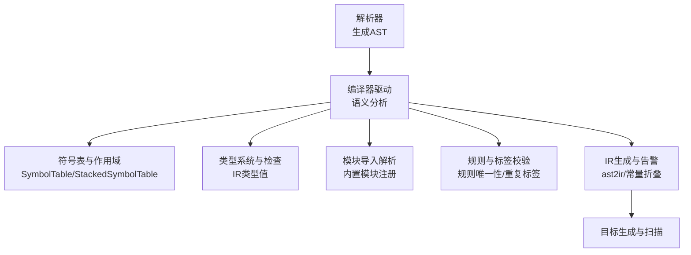
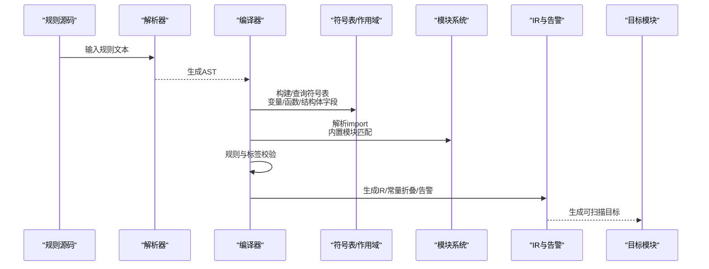
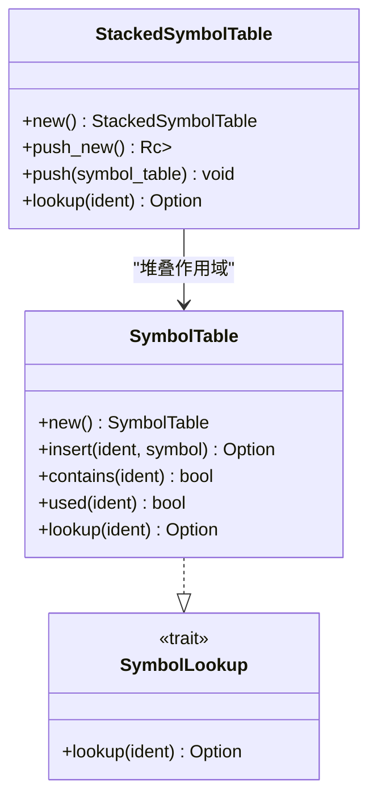
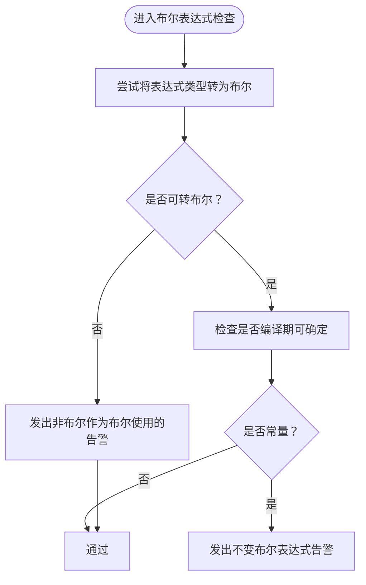
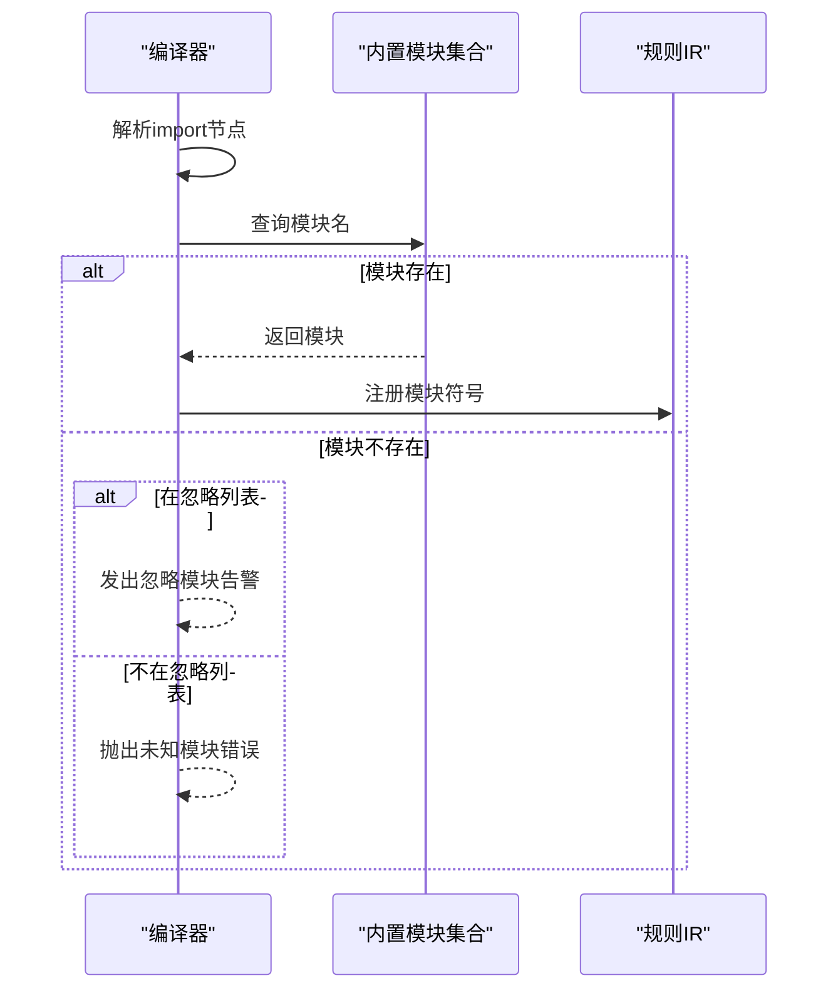
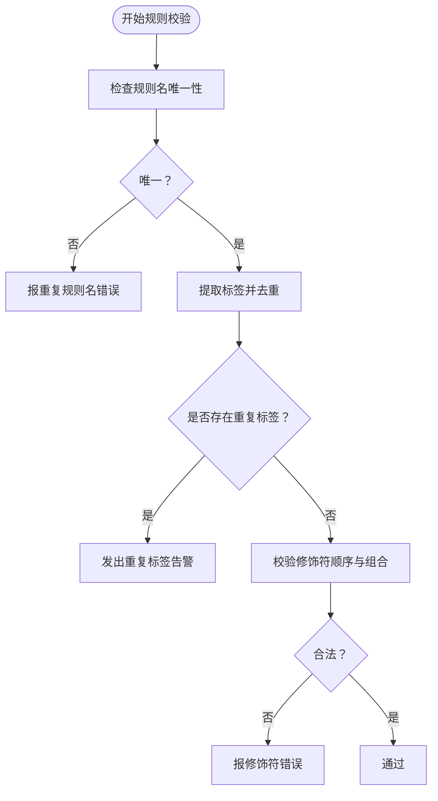
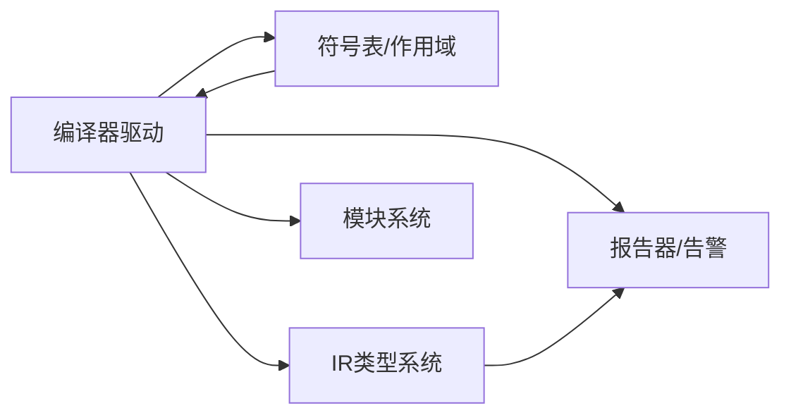

# 语义分析

<cite>
**本文引用的文件**
- [lib/src/symbols/mod.rs](file://lib/src/symbols/mod.rs)
- [lib/src/compiler/mod.rs](file://lib/src/compiler/mod.rs)
- [lib/src/compiler/warnings.rs](file://lib/src/compiler/warnings.rs)
- [lib/src/compiler/report.rs](file://lib/src/compiler/report.rs)
- [lib/src/compiler/ir/ast2ir.rs](file://lib/src/compiler/ir/ast2ir.rs)
- [lib/src/compiler/tests/mod.rs](file://lib/src/compiler/tests/mod.rs)
- [lib/src/modules/pe/mod.rs](file://lib/src/modules/pe/mod.rs)
- [macros/src/error.rs](file://macros/src/error.rs)
- [parser/src/parser/tests/testdata/rule-mods-1.in](file://parser/src/parser/tests/testdata/rule-mods-1.in)
- [lib/src/compiler/tests/testdata/errors/74.out](file://lib/src/compiler/tests/testdata/errors/74.out)
- [lib/src/compiler/tests/testdata/errors/75.out](file://lib/src/compiler/tests/testdata/errors/75.out)
- [lib/src/compiler/tests/testdata/default_tests/test11.unformatted](file://lib/src/compiler/tests/testdata/default_tests/test11.unformatted)
</cite>

## 目录
1. [引言](#引言)
2. [项目结构](#项目结构)
3. [核心组件](#核心组件)
4. [架构总览](#架构总览)
5. [详细组件分析](#详细组件分析)
6. [依赖分析](#依赖分析)
7. [性能考量](#性能考量)
8. [故障排查指南](#故障排查指南)
9. [结论](#结论)
10. [附录](#附录)

## 引言
本文件面向编译器“语义分析”阶段，系统化阐述 yara-x 的符号表管理、类型检查、作用域解析与依赖关系分析，以及如何验证规则的语义正确性（变量声明检查、函数调用验证、模块导入解析、规则引用完整性）。同时覆盖外部变量、全局变量与私有变量的作用域规则，语义错误检测、警告生成与错误恢复机制，并给出扩展方法与自定义语义规则的添加指南。为便于理解，文档提供了多类流程图与时序图，并在各节末尾标注“章节来源”，以便追溯到具体实现。

## 项目结构
yara-x 将语义分析与后续 IR 生成、优化、目标代码生成串联起来：词法与语法分析产出 AST；随后由编译器驱动的语义分析阶段完成符号表构建、作用域与类型检查、模块导入解析、规则与标签校验等；IR 阶段进一步进行布尔表达式常量折叠与不变布尔表达式告警；最终生成可扫描的目标模块。

**图表来源**
- [lib/src/compiler/mod.rs:1388-1412](file://lib/src/compiler/mod.rs#L1388-L1412)
- [lib/src/compiler/ir/ast2ir.rs:928-972](file://lib/src/compiler/ir/ast2ir.rs#L928-L972)

**章节来源**
- [lib/src/compiler/mod.rs:1388-1412](file://lib/src/compiler/mod.rs#L1388-L1412)
- [lib/src/compiler/ir/ast2ir.rs:928-972](file://lib/src/compiler/ir/ast2ir.rs#L928-L972)

## 核心组件
- 符号表与作用域
  - 单层符号表 SymbolTable 提供标识符到符号的映射，并记录使用痕迹。
  - 堆叠式符号表 StackedSymbolTable 支持嵌套作用域，遵循“就近优先”的屏蔽规则。
  - 可选链式查找 Option<Symbol> 实现对结构体字段的级联访问。
- 类型系统与检查
  - IR 中的 TypeValue 表达类型与值，用于布尔表达式的类型一致性检查与常量折叠。
- 模块导入解析
  - 内置模块集合通过名称匹配，未知模块按忽略列表产生告警或报错。
- 规则与标签校验
  - 规则名唯一性检查、标签去重与重复标签告警。
- 警告与报告
  - 统一的 Warning 枚举与 ReportBuilder，支持告警开关、抑制与格式化输出。

**章节来源**
- [lib/src/symbols/mod.rs:149-294](file://lib/src/symbols/mod.rs#L149-L294)
- [lib/src/compiler/mod.rs:1388-1412](file://lib/src/compiler/mod.rs#L1388-L1412)
- [lib/src/compiler/warnings.rs:14-43](file://lib/src/compiler/warnings.rs#L14-L43)
- [lib/src/compiler/report.rs:1-200](file://lib/src/compiler/report.rs#L1-L200)

## 架构总览
下图展示从规则源码到可扫描目标的整体流程，重点标出语义分析阶段的关键职责与交互点。

**图表来源**
- [lib/src/compiler/mod.rs:1762-1801](file://lib/src/compiler/mod.rs#L1762-L1801)
- [lib/src/compiler/ir/ast2ir.rs:928-972](file://lib/src/compiler/ir/ast2ir.rs#L928-L972)

## 详细组件分析

### 符号表与作用域解析
- 设计要点
  - SymbolTable 使用 HashMap 存储标识符与其符号；RefCell<HashSet> 记录已使用标识符，用于未使用变量告警。
  - StackedSymbolTable 以双端队列维护多层作用域，顶层优先命中；push_new 创建新作用域，push 入栈已有作用域。
  - Option<Symbol> 实现 SymbolLookup，允许对结构体字段进行链式查找。
- 复杂度
  - 查找/插入平均 O(1)，作用域遍历最坏 O(N) 层深。
- 错误与恢复
  - 未找到符号返回 None，调用方需根据上下文决定报错或降级处理。
- 适用场景
  - 变量声明检查、函数/模块成员访问、结构体字段解析。

**图表来源**
- [lib/src/symbols/mod.rs:190-294](file://lib/src/symbols/mod.rs#L190-L294)

**章节来源**
- [lib/src/symbols/mod.rs:149-294](file://lib/src/symbols/mod.rs#L149-L294)

### 类型检查与布尔表达式
- 设计要点
  - IR 表达式的 TypeValue 用于判断是否可转换为布尔，若结果在编译期可知，触发“不变布尔表达式”告警。
  - 对函数调用的返回类型进行检查，必要时提示可能的括号遗漏（如空参函数）。
- 复杂度
  - 类型判定与常量折叠线性于表达式规模。
- 错误与恢复
  - 不可转布尔的非布尔表达式发出告警；常量条件规则建议改写为更明确的条件。

**图表来源**
- [lib/src/compiler/ir/ast2ir.rs:928-972](file://lib/src/compiler/ir/ast2ir.rs#L928-L972)

**章节来源**
- [lib/src/compiler/ir/ast2ir.rs:928-972](file://lib/src/compiler/ir/ast2ir.rs#L928-L972)

### 模块导入解析
- 设计要点
  - 通过内置模块字典按名称匹配；未知模块若在忽略列表中仅告警，否则报错。
  - 导入解析发生在规则编译前，确保后续 IR 生成能正确解析模块成员。
- 错误与恢复
  - 未知模块报错；忽略模块仅告警，允许继续编译。

**图表来源**
- [lib/src/compiler/mod.rs:1773-1801](file://lib/src/compiler/mod.rs#L1773-L1801)

**章节来源**
- [lib/src/compiler/mod.rs:1773-1801](file://lib/src/compiler/mod.rs#L1773-L1801)

### 规则与标签校验
- 设计要点
  - 规则名唯一性检查：同一编译单元内不允许重复规则名。
  - 标签去重：重复标签触发告警；未知标签与无效标签分别告警。
  - 规则修饰符顺序与合法性：如 global/private 的位置与组合必须符合语法规则。
- 错误与恢复
  - 重复规则名报错；重复标签告警；非法修饰符组合报语法错误。

**图表来源**
- [lib/src/compiler/mod.rs:1388-1412](file://lib/src/compiler/mod.rs#L1388-L1412)

**章节来源**
- [lib/src/compiler/mod.rs:1388-1412](file://lib/src/compiler/mod.rs#L1388-L1412)
- [parser/src/parser/tests/testdata/rule-mods-1.in:1-7](file://parser/src/parser/tests/testdata/rule-mods-1.in#L1-L7)
- [lib/src/compiler/tests/testdata/errors/74.out:1-5](file://lib/src/compiler/tests/testdata/errors/74.out#L1-L5)
- [lib/src/compiler/tests/testdata/errors/75.out:1-5](file://lib/src/compiler/tests/testdata/errors/75.out#L1-L5)

### 外部变量、全局变量与私有变量的作用域规则
- 外部变量（External Variables）
  - 通过编译器接口注入，参与规则求值但不改变符号表结构；其可见性与生命周期由调用方控制。
- 全局变量（Global Variables）
  - 在编译器层面定义后，参与规则条件表达式的类型与值推断；测试覆盖了多种整数类型的全局变量。
- 私有变量（Private Variables）
  - 仅在当前规则作用域内可见；与全局变量不同，不暴露给扫描阶段的外部环境。
- 作用域解析
  - StackedSymbolTable 保证“最近作用域优先”，避免跨作用域污染；Option<Symbol> 的链式查找支持结构体字段访问。

**章节来源**
- [lib/src/compiler/tests/mod.rs:165-232](file://lib/src/compiler/tests/mod.rs#L165-L232)
- [lib/src/compiler/tests/mod.rs:438-483](file://lib/src/compiler/tests/mod.rs#L438-L483)
- [lib/src/symbols/mod.rs:149-294](file://lib/src/symbols/mod.rs#L149-L294)

### 函数调用验证与模块导出
- 设计要点
  - 模块导出函数通过宏声明，支持重载（同名不同签名），YARA 在运行时依据实参类型选择合适签名。
  - 调用验证关注返回类型与参数类型一致性，必要时提示可能的误用（如忘记括号）。
- 示例参考
  - PE 模块中的函数导出与字段访问模式可用于理解结构体字段与方法调用的协同。

**章节来源**
- [macros/src/error.rs:320-355](file://macros/src/error.rs#L320-L355)
- [lib/src/modules/pe/mod.rs:663-716](file://lib/src/modules/pe/mod.rs#L663-L716)

## 依赖分析
- 组件耦合
  - 编译器驱动依赖符号表与类型系统；IR 阶段依赖编译器上下文与报告器；模块系统独立于编译器核心，通过名称注册。
- 直接与间接依赖
  - 符号表与作用域是所有语义检查的基础；IR 类型系统贯穿表达式检查与告警；报告器统一承载错误与警告。
- 外部依赖
  - 宏系统提供错误/告警枚举与代码生成能力；测试数据与 golden 输出用于回归验证。

**图表来源**
- [lib/src/compiler/mod.rs:1388-1412](file://lib/src/compiler/mod.rs#L1388-L1412)
- [lib/src/compiler/warnings.rs:14-43](file://lib/src/compiler/warnings.rs#L14-L43)
- [lib/src/compiler/report.rs:1-200](file://lib/src/compiler/report.rs#L1-L200)

**章节来源**
- [lib/src/compiler/mod.rs:1388-1412](file://lib/src/compiler/mod.rs#L1388-L1412)
- [lib/src/compiler/warnings.rs:14-43](file://lib/src/compiler/warnings.rs#L14-L43)
- [lib/src/compiler/report.rs:1-200](file://lib/src/compiler/report.rs#L1-L200)

## 性能考量
- 符号表查找
  - 平均 O(1) 查找，但堆叠作用域遍历最坏 O(N)；建议合理划分作用域层级，避免过深嵌套。
- 类型检查与常量折叠
  - 线性于表达式规模；可通过缓存中间结果减少重复计算。
- 告警抑制
  - 通过告警代码与范围匹配实现局部抑制，避免大规模误报影响性能与可读性。

[本节为通用指导，无需“章节来源”]

## 故障排查指南
- 常见错误与定位
  - 重复规则名：检查规则名唯一性，修正后重新编译。
  - 重复标签：移除重复标签或调整命名策略。
  - 修饰符非法组合：参考规则修饰符顺序测试用例，确保 global/private 位置正确。
  - 未知模块：确认模块名拼写与内置模块清单；如确需忽略，加入忽略列表并接受告警。
  - 不变布尔表达式：评估规则意图，必要时改为显式条件。
- 告警开关与抑制
  - 使用告警开关 API 控制特定告警的启用/禁用；通过范围匹配抑制特定位置的告警。
- 测试与回归
  - 利用测试数据与 golden 输出对比，快速定位差异。

**章节来源**
- [lib/src/compiler/tests/testdata/errors/74.out:1-5](file://lib/src/compiler/tests/testdata/errors/74.out#L1-L5)
- [lib/src/compiler/tests/testdata/errors/75.out:1-5](file://lib/src/compiler/tests/testdata/errors/75.out#L1-L5)
- [lib/src/compiler/tests/testdata/default_tests/test11.unformatted:1-6](file://lib/src/compiler/tests/testdata/default_tests/test11.unformatted#L1-L6)
- [lib/src/compiler/mod.rs:2968-3013](file://lib/src/compiler/mod.rs#L2968-L3013)

## 结论
yara-x 的语义分析阶段以符号表与作用域为核心，结合 IR 类型系统与内置模块解析，实现了对规则的全面语义校验。通过统一的告警与报告机制，开发者能够及时发现并修复问题；通过告警开关与抑制策略，可在保证质量的同时提升开发效率。整体设计清晰、扩展性强，适合进一步引入自定义语义规则与模块。

[本节为总结，无需“章节来源”]

## 附录

### 扩展方法与自定义语义规则添加指南
- 新增内置模块
  - 通过模块导出宏声明函数，确保首参为 ScanContext，其余参数类型受支持；在模块内部实现字段访问与逻辑处理。
- 自定义告警
  - 在告警枚举中新增变体，利用错误/告警代码生成宏获得统一的代码与标题；在编译器相应阶段触发告警。
- 自定义规则校验
  - 在规则校验流程中增加新的检查项（如标签规范、修饰符组合），并在失败时返回对应错误或发出告警。
- 建议实践
  - 保持最小可行变更，先在测试中覆盖边界情况；通过 golden 输出回归验证。

**章节来源**
- [macros/src/error.rs:320-355](file://macros/src/error.rs#L320-L355)
- [lib/src/modules/pe/mod.rs:663-716](file://lib/src/modules/pe/mod.rs#L663-L716)
- [lib/src/compiler/warnings.rs:14-43](file://lib/src/compiler/warnings.rs#L14-L43)