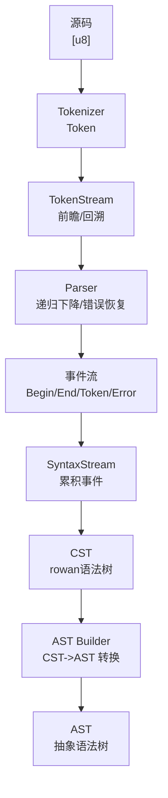
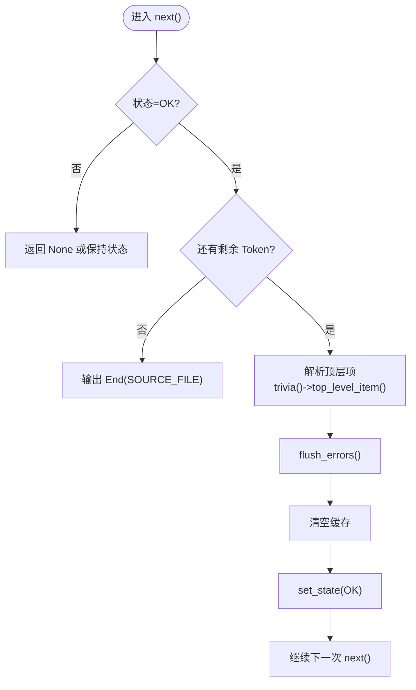
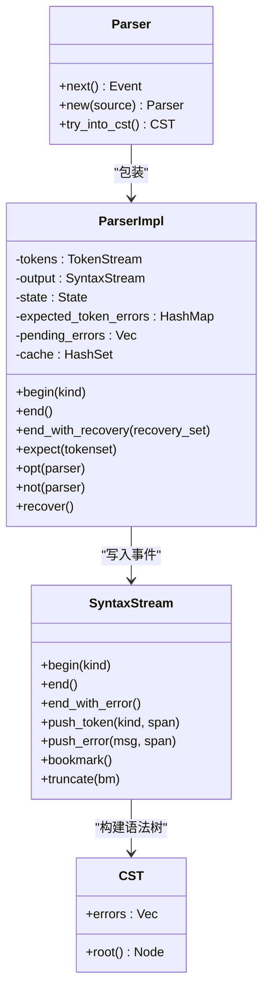
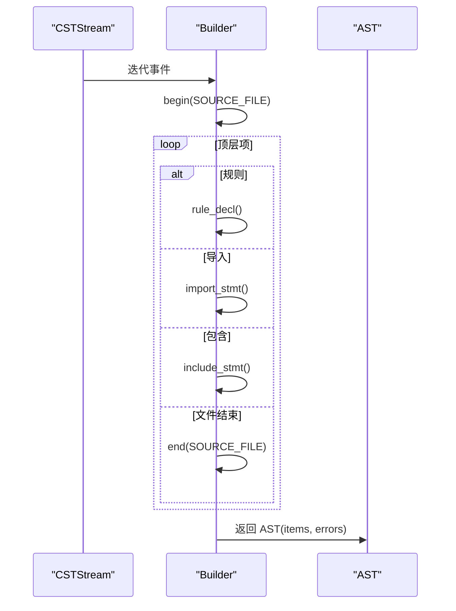
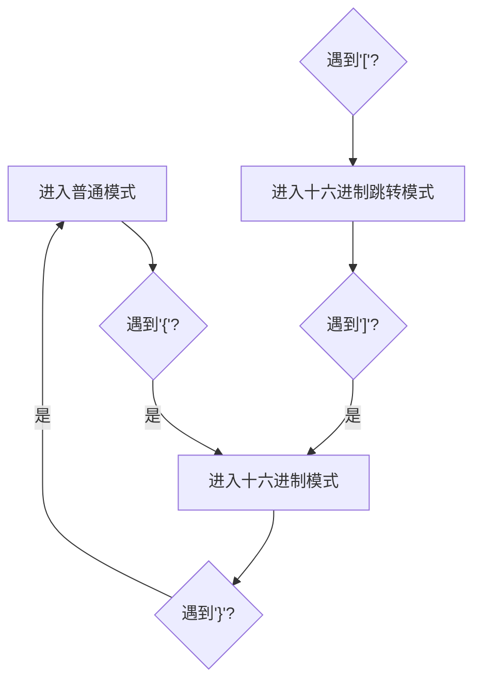
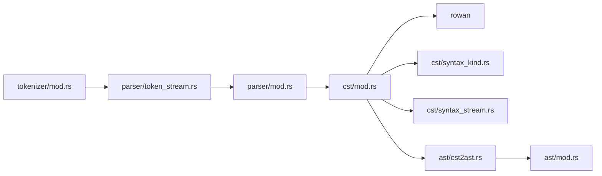

# 语法分析

<cite>
**本文引用的文件**
- [parser/lib.rs](file://yara-x/parser/src/lib.rs)
- [parser/mod.rs](file://yara-x/parser/src/parser/mod.rs)
- [parser/token_stream.rs](file://yara-x/parser/src/parser/token_stream.rs)
- [cst/mod.rs](file://yara-x/parser/src/cst/mod.rs)
- [cst/syntax_kind.rs](file://yara-x/parser/src/cst/syntax_kind.rs)
- [cst/syntax_stream.rs](file://yara-x/parser/src/cst/syntax_stream.rs)
- [tokenizer/mod.rs](file://yara-x/parser/src/tokenizer/mod.rs)
- [tokenizer/tokens.rs](file://yara-x/parser/src/tokenizer/tokens.rs)
- [ast/mod.rs](file://yara-x/parser/src/ast/mod.rs)
- [ast/cst2ast.rs](file://yara-x/parser/src/ast/cst2ast.rs)
</cite>

## 目录
1. [引言](#引言)
2. [项目结构](#项目结构)
3. [核心组件](#核心组件)
4. [架构总览](#架构总览)
5. [详细组件分析](#详细组件分析)
6. [依赖关系分析](#依赖关系分析)
7. [性能考量](#性能考量)
8. [故障排查指南](#故障排查指南)
9. [结论](#结论)
10. [附录：扩展与自定义规则指南](#附录扩展与自定义规则指南)

## 引言
本技术文档聚焦于 YARA-X 项目的语法分析器实现，系统阐述其自顶向下的递归下降解析算法、CST（具体语法树）的结构设计与节点类型、从标记流到语法树的构建过程、错误检测与恢复策略、以及从 CST 到 AST 的转换流程。文档同时覆盖对 YARA 语法规则的支持范围（规则声明、模式定义、条件表达式、元数据等），并提供扩展方法与自定义语法规则的添加指南。

## 项目结构
解析子系统位于 parser 模块中，主要由以下层次构成：
- 词法分析层：Tokenizer 将字节源码切分为 Token，并支持三种模式（普通、十六进制模式、十六进制跳转模式）。
- 语法流层：TokenStream 在 Tokenizer 基础上提供无限前瞻与回溯能力；Parser 使用该流进行递归下降解析。
- 事件流层：Parser 输出事件流（Begin/End/Token/Error），由 SyntaxStream 累积为 CST。
- 树模型层：CST 使用 rowan 构建不可变语法树，支持遍历与文本拼接。
- 抽象语法树层：AST 通过 Builder 从 CST 事件流转换而来，应用运算符优先级与语义规则。



图示来源
- [parser/mod.rs:1-120](file://yara-x/parser/src/parser/mod.rs#L1-L120)
- [parser/token_stream.rs:1-120](file://yara-x/parser/src/parser/token_stream.rs#L1-L120)
- [cst/mod.rs:1-120](file://yara-x/parser/src/cst/mod.rs#L1-L120)
- [cst/syntax_stream.rs:1-120](file://yara-x/parser/src/cst/syntax_stream.rs#L1-L120)
- [tokenizer/mod.rs:1-120](file://yara-x/parser/src/tokenizer/mod.rs#L1-L120)
- [ast/mod.rs:1-120](file://yara-x/parser/src/ast/mod.rs#L1-L120)

章节来源
- [parser/lib.rs:1-142](file://yara-x/parser/src/lib.rs#L1-L142)
- [parser/mod.rs:1-120](file://yara-x/parser/src/parser/mod.rs#L1-L120)
- [cst/mod.rs:1-120](file://yara-x/parser/src/cst/mod.rs#L1-L120)
- [tokenizer/mod.rs:1-120](file://yara-x/parser/src/tokenizer/mod.rs#L1-L120)

## 核心组件
- 解析器入口与迭代器
  - Parser 实现为一个事件迭代器，按“顶层项”（导入、包含、规则）懒加载解析，避免一次性 tokenize 或生成全部事件。
  - 提供 try_into_cst、into_cst_stream 等接口，兼容不同消费方式。
- 语法状态机与错误恢复
  - ParserImpl 内部维护 State（开始/结束/OK/Failure/OutOfFuel）、opt_depth/not_depth、期望/意外错误映射、缓存失败结果等，确保在遇到错误时能恢复并继续解析。
- 事件流与 CST
  - SyntaxStream 以 Begin/End/Token/Error 组织事件，支持 bookmark/truncate 回滚，end_with_error 标记错误区间。
  - CST 使用 rowan::SyntaxNode 表示，支持根节点访问、文本拼接、遍历等。
- AST 转换
  - Builder 从 CSTStream 迭代事件，按 YARA 语法逐项构建 AST，使用 Pratt 解析器处理运算符优先级，控制最大深度防止栈溢出。

章节来源
- [parser/mod.rs:38-120](file://yara-x/parser/src/parser/mod.rs#L38-L120)
- [cst/mod.rs:33-120](file://yara-x/parser/src/cst/mod.rs#L33-L120)
- [cst/syntax_stream.rs:11-120](file://yara-x/parser/src/cst/syntax_stream.rs#L11-L120)
- [ast/mod.rs:33-120](file://yara-x/parser/src/ast/mod.rs#L33-L120)

## 架构总览
下图展示从源码到 CST/AST 的端到端流程，以及错误恢复与回溯的关键点。

```mermaid
sequenceDiagram
participant SRC as "源码"
participant TOK as "Tokenizer"
participant TS as "TokenStream"
participant PAR as "Parser"
participant EVT as "事件流"
participant SS as "SyntaxStream"
participant CST as "CST"
participant ASTB as "AST Builder"
participant AST as "AST"
SRC->>TOK : 输入字节
TOK-->>TS : 产出 Token
TS-->>PAR : 前瞻/回溯消费 Token
PAR->>EVT : 产生 Begin/End/Token/Error
EVT->>SS : 累积事件
SS->>CST : 构建 rowan 语法树
CST->>ASTB : 遍历事件
ASTB->>AST : 应用运算符优先级/语义规则
```

图示来源
- [parser/mod.rs:231-281](file://yara-x/parser/src/parser/mod.rs#L231-L281)
- [cst/syntax_stream.rs:80-150](file://yara-x/parser/src/cst/syntax_stream.rs#L80-L150)
- [ast/cst2ast.rs:55-101](file://yara-x/parser/src/ast/cst2ast.rs#L55-L101)

## 详细组件分析

### 1) 递归下降解析与错误恢复
- 自顶向下递归下降
  - ParserImpl::next 驱动解析循环，按顶层项推进；每个顶层项内部调用相应的语法规则函数（如 rule_decl、import_stmt、include_stmt）。
  - 通过 begin/end 包裹非终结符，end_with_error 在失败状态下将当前 Begin 标记为 ERROR 并闭合，保留错误上下文。
- 回溯与书签
  - bookmark/restore_bookmark/truncate 支持在失败时回退到先前位置，尝试替代分支或恢复。
  - TokenStream 提供无限前瞻与回溯，配合 Parser 的 opt/cond/if_next 等组合子，减少不必要的回溯成本。
- 错误收集与恢复
  - expect 会记录期望的 TokenId 与描述集合，结合 expected_token_errors/unexpected_token_errors 生成诊断信息。
  - recover 会丢弃直到恢复集合中的下一个合法符号，使解析尽快回到可恢复状态。
- 失败缓存与燃料限制
  - cache 记录“(位置, 非终结符)”失败，避免重复尝试；fuel 限制解析深度，防止极端输入导致长时间运行。



图示来源
- [parser/mod.rs:231-281](file://yara-x/parser/src/parser/mod.rs#L231-L281)
- [parser/mod.rs:444-501](file://yara-x/parser/src/parser/mod.rs#L444-L501)

章节来源
- [parser/mod.rs:94-208](file://yara-x/parser/src/parser/mod.rs#L94-L208)
- [parser/mod.rs:286-372](file://yara-x/parser/src/parser/mod.rs#L286-L372)
- [parser/mod.rs:444-508](file://yara-x/parser/src/parser/mod.rs#L444-L508)
- [parser/token_stream.rs:99-166](file://yara-x/parser/src/parser/token_stream.rs#L99-L166)

### 2) 事件流与 CST 结构
- 事件类型
  - Begin/End：非终结符节点边界，成对出现，用于构建树形结构。
  - Token：终结符（关键字、标识符、字面量、标点、注释、空白、换行、未知、无效 UTF-8）。
  - Error：解析器产生的诊断消息，挂载在对应节点之下。
- 语法种类（SyntaxKind）
  - 覆盖所有 YARA 关键字、运算符、标点、字面量、模式标识符、规则/表达式/模式等节点类型。
  - 通过 SyntaxKind::token_id 将语法种类映射到 TokenId，便于一致性校验。
- CST 构建
  - SyntaxStream 确保 Begin/End 成对且顺序正确；CST::try_from 将事件流转换为 rowan::SyntaxNode，同时收集错误列表。
  - 文本拼接 Text 支持跨多个 Token 的连续文本视图，避免一次性复制整个字符串。



图示来源
- [parser/mod.rs:38-120](file://yara-x/parser/src/parser/mod.rs#L38-L120)
- [cst/syntax_stream.rs:11-150](file://yara-x/parser/src/cst/syntax_stream.rs#L11-L150)
- [cst/mod.rs:209-292](file://yara-x/parser/src/cst/mod.rs#L209-L292)

章节来源
- [cst/mod.rs:33-120](file://yara-x/parser/src/cst/mod.rs#L33-L120)
- [cst/syntax_kind.rs:7-151](file://yara-x/parser/src/cst/syntax_kind.rs#L7-L151)
- [cst/syntax_stream.rs:11-150](file://yara-x/parser/src/cst/syntax_stream.rs#L11-L150)

### 3) 从 CST 到 AST 的转换
- 转换流程
  - Builder::build_ast 遍历事件，识别顶层项（规则、导入、包含），逐个调用相应解析函数。
  - 对规则，解析标志、标签、元数据、模式、条件表达式；对模式，支持文本、正则、十六进制三类。
- 运算符优先级
  - 使用 Pratt 解析器，基于绑定强度表（左/右绑定功率）将线性表达式序列规约为带优先级的树。
- 错误与恢复
  - 遇到单个规则/导入/包含解析失败时，Builder::recover 丢弃直到下一个合法项，保证整体 AST 构建不中断。
  - Builder::consume_errors_and_trivia 会把事件流中的 Error 事件收集为 AST 的错误列表。



图示来源
- [ast/cst2ast.rs:55-101](file://yara-x/parser/src/ast/cst2ast.rs#L55-L101)
- [ast/cst2ast.rs:283-451](file://yara-x/parser/src/ast/cst2ast.rs#L283-L451)

章节来源
- [ast/mod.rs:33-120](file://yara-x/parser/src/ast/mod.rs#L33-L120)
- [ast/cst2ast.rs:1-120](file://yara-x/parser/src/ast/cst2ast.rs#L1-L120)
- [ast/cst2ast.rs:283-451](file://yara-x/parser/src/ast/cst2ast.rs#L283-L451)

### 4) 词法分析与模式切换
- 三种模式
  - 普通模式：识别关键字、标识符、字面量、注释、空白等。
  - 十六进制模式：仅识别十六进制字节、括号、管道、注释、空白。
  - 十六进制跳转模式：识别负号、整数字面量、括号、注释、空白。
- 模式切换
  - 解析器在遇到特定符号（如 {、[、]）时，调用 Tokenizer 的 enter_hex_pattern_mode/enter_hex_jump_mode，使后续 Token 识别符合模式要求。
  - Tokenizer 在遇到异常 Token 时自动回退到上一模式，保证健壮性。
- 未知与无效 UTF-8
  - 对无法识别的片段发出 UNKNOWN；对非 UTF-8 字节发出 INVALID_UTF8，解析器仍继续推进。



图示来源
- [tokenizer/mod.rs:149-194](file://yara-x/parser/src/tokenizer/mod.rs#L149-L194)
- [tokenizer/mod.rs:87-147](file://yara-x/parser/src/tokenizer/mod.rs#L87-L147)

章节来源
- [tokenizer/mod.rs:22-90](file://yara-x/parser/src/tokenizer/mod.rs#L22-L90)
- [tokenizer/tokens.rs:1-120](file://yara-x/parser/src/tokenizer/tokens.rs#L1-L120)

### 5) YARA 语法支持要点
- 规则声明
  - 支持全局/私有标志、标签、元数据块、模式块、条件块。
- 条件表达式
  - 支持布尔、比较、位运算、算术、字符串匹配、of/for/with 等复合表达式。
- 元数据
  - 支持整数、浮点、布尔、字符串（含转义）、字节（含转义）等值类型。
- 模式定义
  - 文本模式、正则模式、十六进制模式；十六进制支持字节、否定字节、替代、跳转等子结构。
- 运算符优先级
  - 通过 Pratt 解析器统一处理，确保表达式分组符合语义。

章节来源
- [ast/cst2ast.rs:473-518](file://yara-x/parser/src/ast/cst2ast.rs#L473-L518)
- [ast/cst2ast.rs:561-591](file://yara-x/parser/src/ast/cst2ast.rs#L561-L591)
- [ast/cst2ast.rs:646-688](file://yara-x/parser/src/ast/cst2ast.rs#L646-L688)
- [ast/cst2ast.rs:788-800](file://yara-x/parser/src/ast/cst2ast.rs#L788-L800)

## 依赖关系分析
- 模块内依赖
  - parser 依赖 tokenizer 提供的 Token；依赖 cst 的事件流与语法种类；最终产出 CST。
  - ast 依赖 cst 的事件流与语法种类，通过 cst2ast.rs 完成转换。
- 外部依赖
  - rowan：构建不可变语法树。
  - logos：词法分析引擎。
  - itertools、indexmap、rustc-hash 等辅助库。



图示来源
- [parser/mod.rs:24-36](file://yara-x/parser/src/parser/mod.rs#L24-L36)
- [cst/mod.rs:20-32](file://yara-x/parser/src/cst/mod.rs#L20-L32)
- [ast/mod.rs:17-29](file://yara-x/parser/src/ast/mod.rs#L17-L29)

章节来源
- [parser/mod.rs:24-36](file://yara-x/parser/src/parser/mod.rs#L24-L36)
- [cst/mod.rs:20-32](file://yara-x/parser/src/cst/mod.rs#L20-L32)
- [ast/mod.rs:17-29](file://yara-x/parser/src/ast/mod.rs#L17-L29)

## 性能考量
- 懒解析与增量消费
  - Parser 实现为迭代器，按顶层项懒解析，降低内存占用与首包延迟。
- 缓存与燃料
  - 失败缓存避免重复尝试；fuel 限制解析深度，防止退化输入导致长时间运行。
- 事件流与树构建
  - SyntaxStream 采用双端队列，支持 O(1) 推入与 O(1) 移除；CST 构建时严格校验事件连续性，避免碎片化。
- AST 转换深度控制
  - Builder 控制最大深度，避免深嵌套表达式导致栈溢出。

章节来源
- [parser/mod.rs:231-281](file://yara-x/parser/src/parser/mod.rs#L231-L281)
- [ast/cst2ast.rs:153-172](file://yara-x/parser/src/ast/cst2ast.rs#L153-L172)

## 故障排查指南
- 常见错误类型
  - 语法错误：由 ParserImpl::expect/flush_errors 生成，携带 Span 与消息；CST 中以 Error 事件存在。
  - 无效 UTF-8：Tokenizer 对无法识别的字节发出 INVALID_UTF8；Builder 在 get_source_str 中报告并中止当前节点。
  - 未知片段：UNKNOWN 表示未匹配到任何 Token，通常出现在拼写错误或非法字符。
- 诊断信息
  - expected_token_errors 记录某位置期望的 Token 描述集合；unexpected_token_errors 记录 not 分支中出现的意外 Token。
  - AST Builder 会把事件流中的 Error 聚合为 AST.errors。
- 恢复策略
  - end_with_recovery：在非预期符号处标记错误并恢复到恢复集合中的下一个合法符号。
  - recover：丢弃直到下一个合法项，保证解析继续。
  - bookmark/truncate：在 opt/cond 分支中回退到先前状态，尝试其他分支。

章节来源
- [parser/mod.rs:172-188](file://yara-x/parser/src/parser/mod.rs#L172-L188)
- [parser/mod.rs:444-508](file://yara-x/parser/src/parser/mod.rs#L444-L508)
- [ast/cst2ast.rs:159-172](file://yara-x/parser/src/ast/cst2ast.rs#L159-L172)

## 结论
本解析器采用自顶向下的递归下降与事件驱动相结合的方式，借助 TokenStream 的前瞻/回溯能力、SyntaxStream 的事件累积与回滚机制，实现了对 YARA 语法的完整支持与稳健的错误恢复。CST 作为无损语法树保留了源码细节，AST 则通过 Pratt 解析器与语义规则完成表达式规约与类型化建模。整体设计兼顾正确性、可扩展性与性能。

## 附录：扩展与自定义规则指南
- 扩展语法种类（SyntaxKind）
  - 在 cst/syntax_kind.rs 中新增枚举成员，并在 From<&Token> 与 token_id 映射中补充对应关系。
  - 在 cst/mod.rs 的 Event/Node/Token 类型中适配新节点类型。
- 新增语法规则
  - 在 parser/mod.rs 的 ParserImpl 中添加新的解析函数（如 rule_foo），使用 begin/end 包裹，结合 expect/opt/cond/if_next 等组合子。
  - 在 cst/syntax_stream.rs 中确保 Begin/End 成对出现，必要时使用 end_with_error 标记错误区间。
- 新增词法 Token
  - 在 tokenizer/mod.rs 的 NormalToken/HexPatternToken/HexJumpToken 中增加新模式下的 Token 变体，并在 convert_*_token 函数中映射到 Token。
  - 在 tokenizer/tokens.rs 中为新 Token 添加 TokenId 与描述。
- 从 CST 到 AST 的映射
  - 在 ast/cst2ast.rs 中新增对应节点的解析逻辑，遵循现有模式（begin/end、expect、pratt_parser 等）。
  - 如涉及表达式，确保绑定强度表（binding_power）正确设置。
- 测试与验证
  - 为新增规则编写解析器测试与 CST/AST 转换测试，覆盖正常与错误场景。
  - 使用 Parser::try_into_cst 与 AST::from 验证端到端行为。

章节来源
- [cst/syntax_kind.rs:7-151](file://yara-x/parser/src/cst/syntax_kind.rs#L7-L151)
- [cst/mod.rs:33-120](file://yara-x/parser/src/cst/mod.rs#L33-L120)
- [parser/mod.rs:38-120](file://yara-x/parser/src/parser/mod.rs#L38-L120)
- [tokenizer/mod.rs:248-385](file://yara-x/parser/src/tokenizer/mod.rs#L248-L385)
- [tokenizer/tokens.rs:115-211](file://yara-x/parser/src/tokenizer/tokens.rs#L115-L211)
- [ast/cst2ast.rs:283-451](file://yara-x/parser/src/ast/cst2ast.rs#L283-L451)