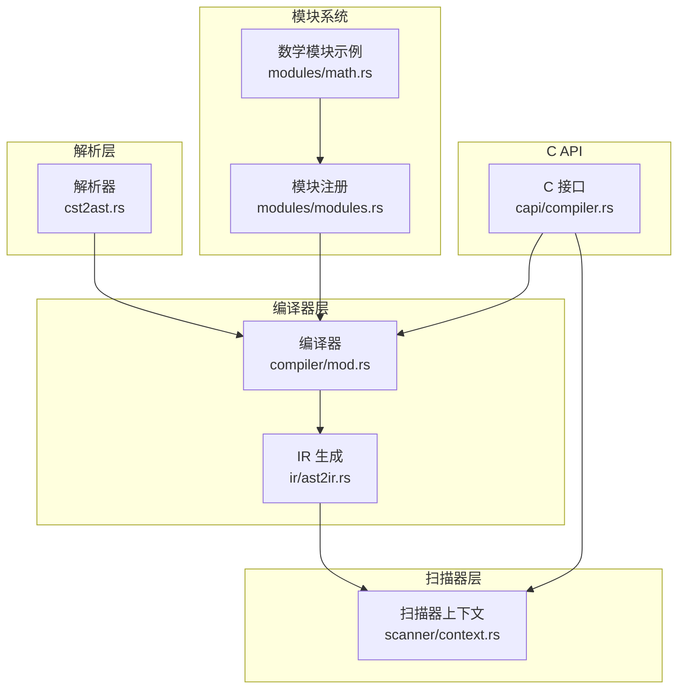
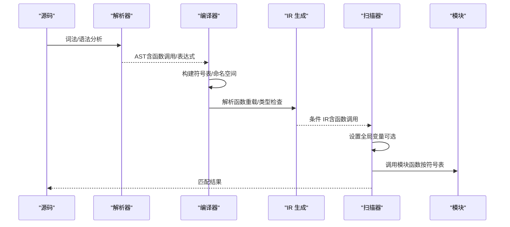
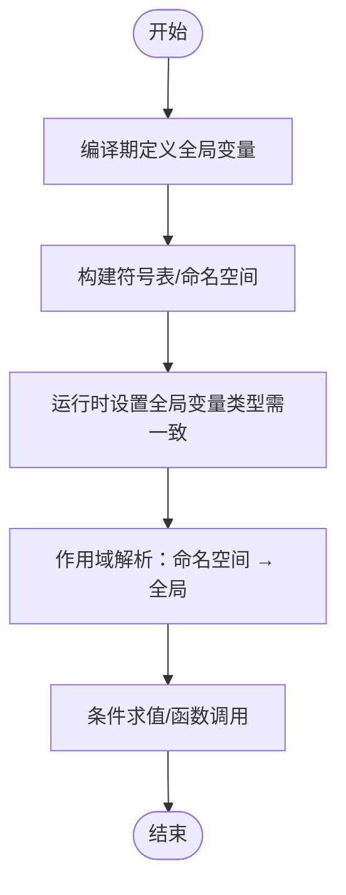
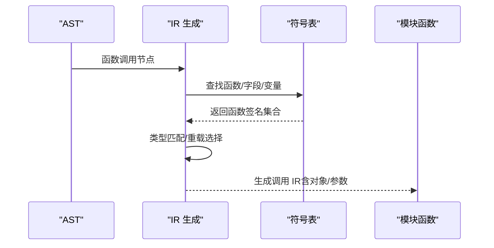

# 变量与函数系统

<cite>
**本文档引用的文件**
- [compiler.rs](file://yara-x/capi/src/compiler.rs)
- [context.rs](file://yara-x/lib/src/scanner/context.rs)
- [variables.rs](file://yara-x/lib/src/variables.rs)
- [mod.rs](file://yara-x/lib/src/compiler/mod.rs)
- [ast2ir.rs](file://yara-x/lib/src/compiler/ir/ast2ir.rs)
- [cst2ast.rs](file://yara-x/parser/src/ast/cst2ast.rs)
- [variables.yar](file://yara-x/cli/src/tests/testdata/variables.yar)
- [external_variables.md](file://yara-x/site/content/docs/writing_rules/external_variables.md)
- [global_and_private.md](file://yara-x/site/content/docs/writing_rules/global_and_private.md)
- [math.rs](file://yara-x/lib/src/modules/math.rs)
- [modules.rs](file://yara-x/lib/src/modules/modules.rs)
- [tests.rs](file://yara-x/lib/src/scanner/tests.rs)
</cite>

## 目录
1. [简介](#简介)
2. [项目结构](#项目结构)
3. [核心组件](#核心组件)
4. [架构总览](#架构总览)
5. [详细组件分析](#详细组件分析)
6. [依赖关系分析](#依赖关系分析)
7. [性能考量](#性能考量)
8. [故障排查指南](#故障排查指南)
9. [结论](#结论)
10. [附录](#附录)

## 简介
本文件系统性阐述 YARA-X 的变量与函数系统，覆盖以下主题：
- 变量的声明、作用域与生命周期：全局变量、私有变量（规则内局部）、外部变量（运行时注入）的差异与行为边界
- 内置函数与模块函数：内置类型转换与基础函数、模块导出函数的签名与调用方式
- 自定义函数：规则中如何定义与使用函数（当前版本以模块函数为主）
- 变量赋值与函数调用的语法规范与 IR 编译流程
- 变量作用域解析与符号表机制的内部实现

## 项目结构
围绕变量与函数系统的关键代码分布在以下模块：
- 编译器层：负责变量定义、符号表构建、函数重载解析与 IR 生成
- 扫描器层：负责变量运行时设置、作用域解析与执行
- 解析器层：负责语法到 AST 的转换，识别函数调用与表达式
- 模块系统：提供内置与第三方模块函数
- C API 层：对外暴露变量定义与扫描接口

图表来源
- [cst2ast.rs:1215-1317](file://yara-x/parser/src/ast/cst2ast.rs#L1215-L1317)
- [mod.rs:454-542](file://yara-x/lib/src/compiler/mod.rs#L454-L542)
- [ast2ir.rs:1716-1825](file://yara-x/lib/src/compiler/ir/ast2ir.rs#L1716-L1825)
- [context.rs:301-328](file://yara-x/lib/src/scanner/context.rs#L301-L328)
- [modules.rs:1-35](file://yara-x/lib/src/modules/modules.rs#L1-L35)
- [math.rs:1-67](file://yara-x/lib/src/modules/math.rs#L1-L67)
- [compiler.rs:352-434](file://yara-x/capi/src/compiler.rs#L352-L434)

章节来源
- [mod.rs:454-542](file://yara-x/lib/src/compiler/mod.rs#L454-L542)
- [cst2ast.rs:1215-1317](file://yara-x/parser/src/ast/cst2ast.rs#L1215-L1317)
- [ast2ir.rs:1716-1825](file://yara-x/lib/src/compiler/ir/ast2ir.rs#L1716-L1825)
- [context.rs:301-328](file://yara-x/lib/src/scanner/context.rs#L301-L328)
- [modules.rs:1-35](file://yara-x/lib/src/modules/modules.rs#L1-L35)
- [compiler.rs:352-434](file://yara-x/capi/src/compiler.rs#L352-L434)

## 核心组件
- 变量与类型系统
  - Variable 包装 TypeValue，统一布尔、整数、浮点、字符串、数组、结构体等类型
  - 提供类型校验、标识符合法性检查、数组/结构体构造
- 符号表与作用域
  - 全局符号表（包含内置函数）与命名空间符号表栈
  - 规则条件中的标识符解析遵循“命名空间 → 全局”的查找顺序
- 函数系统
  - 内置函数：通过 WASM 导出表注册，如 uint8/uint16 等
  - 模块函数：通过模块导出宏注册，支持重载（同名不同参数类型）
- 扫描期变量
  - 支持在扫描前设置全局变量值，类型必须与编译期一致

章节来源
- [variables.rs:19-71](file://yara-x/lib/src/variables.rs#L19-L71)
- [mod.rs:276-287](file://yara-x/lib/src/compiler/mod.rs#L276-L287)
- [ast2ir.rs:1716-1825](file://yara-x/lib/src/compiler/ir/ast2ir.rs#L1716-L1825)
- [context.rs:301-328](file://yara-x/lib/src/scanner/context.rs#L301-L328)

## 架构总览
变量与函数系统贯穿“解析 → 编译 → 扫描”三阶段：
- 解析阶段：识别函数调用与表达式节点
- 编译阶段：构建符号表、解析函数重载、生成 IR
- 扫描阶段：按作用域解析变量、执行条件并支持动态修改全局变量

图表来源
- [cst2ast.rs:1215-1317](file://yara-x/parser/src/ast/cst2ast.rs#L1215-L1317)
- [mod.rs:636-683](file://yara-x/lib/src/compiler/mod.rs#L636-L683)
- [ast2ir.rs:1716-1825](file://yara-x/lib/src/compiler/ir/ast2ir.rs#L1716-L1825)
- [context.rs:301-328](file://yara-x/lib/src/scanner/context.rs#L301-L328)

## 详细组件分析

### 变量系统与作用域
- 全局变量
  - 在编译前通过编译器定义，存储于根结构体中，序列化后随规则一起加载
  - 运行时可通过扫描器设置，但类型必须与定义时一致
- 私有变量
  - 规则内的局部变量概念由 with 声明体现，with 块内的标识符仅在该块内可见
- 外部变量
  - 通过命令行或 API 注入，规则中直接引用；未定义或类型不匹配会报错

图表来源
- [mod.rs:636-683](file://yara-x/lib/src/compiler/mod.rs#L636-L683)
- [context.rs:301-328](file://yara-x/lib/src/scanner/context.rs#L301-L328)

章节来源
- [mod.rs:636-683](file://yara-x/lib/src/compiler/mod.rs#L636-L683)
- [context.rs:301-328](file://yara-x/lib/src/scanner/context.rs#L301-L328)
- [variables.rs:25-71](file://yara-x/lib/src/variables.rs#L25-L71)

### 函数系统与重载解析
- 内置函数
  - 通过 WASM 导出表注册，编译器在初始化时将这些函数加入全局符号表
- 模块函数
  - 使用导出宏注册，支持同名多签名（重载），编译期根据实参类型选择最匹配签名
- 函数调用解析流程
  - 从 AST 中提取函数调用节点，解析对象（方法调用时）与实参类型
  - 在符号表中查找匹配的函数签名，若无匹配则报告参数错误

图表来源
- [cst2ast.rs:1246-1317](file://yara-x/parser/src/ast/cst2ast.rs#L1246-L1317)
- [ast2ir.rs:1716-1825](file://yara-x/lib/src/compiler/ir/ast2ir.rs#L1716-L1825)
- [modules.rs:1-35](file://yara-x/lib/src/modules/modules.rs#L1-L35)
- [math.rs:16-67](file://yara-x/lib/src/modules/math.rs#L16-L67)

章节来源
- [ast2ir.rs:1716-1825](file://yara-x/lib/src/compiler/ir/ast2ir.rs#L1716-L1825)
- [cst2ast.rs:1246-1317](file://yara-x/parser/src/ast/cst2ast.rs#L1246-L1317)
- [math.rs:16-67](file://yara-x/lib/src/modules/math.rs#L16-L67)

### 语法规范与 IR 生成
- 函数调用语法
  - 支持无对象调用与对象方法调用（如模块.函数）
  - 参数列表以逗号分隔，支持表达式
- 表达式与作用域
  - with 声明用于局部变量绑定，with 块内优先解析
  - 标识符解析遵循“命名空间 → 全局”的顺序
- IR 生成
  - 将 AST 节点映射为 IR 表达式，处理函数调用、类型推断与重载选择

章节来源
- [cst2ast.rs:1215-1317](file://yara-x/parser/src/ast/cst2ast.rs#L1215-L1317)
- [ast2ir.rs:1716-1825](file://yara-x/lib/src/compiler/ir/ast2ir.rs#L1716-L1825)

### 变量赋值与外部变量
- 编译期定义
  - 通过编译器接口定义全局变量，类型一经确定不可变更
- 运行时设置
  - 扫描器允许在扫描前设置全局变量值，类型必须一致
- 外部变量
  - 规则中直接引用，未定义或类型不匹配会触发错误

章节来源
- [compiler.rs:352-434](file://yara-x/capi/src/compiler.rs#L352-L434)
- [context.rs:301-328](file://yara-x/lib/src/scanner/context.rs#L301-L328)
- [external_variables.md:76-85](file://yara-x/site/content/docs/writing_rules/external_variables.md#L76-L85)

### 私有变量与全局规则
- 私有规则
  - 不在最终报告中显示，但可作为其他规则的依赖
- 全局规则
  - 在所有规则之前评估，且只能依赖其他全局规则

章节来源
- [global_and_private.md:21-66](file://yara-x/site/content/docs/writing_rules/global_and_private.md#L21-L66)

## 依赖关系分析
- 编译器依赖解析器与符号表，生成 IR 并输出 WASM
- 扫描器依赖编译后的 WASM 与全局变量结构体，按作用域解析并执行
- 模块系统通过导出宏注册函数，参与符号表与 IR 解析

图表来源
- [mod.rs:454-542](file://yara-x/lib/src/compiler/mod.rs#L454-L542)
- [ast2ir.rs:1716-1825](file://yara-x/lib/src/compiler/ir/ast2ir.rs#L1716-L1825)
- [context.rs:301-328](file://yara-x/lib/src/scanner/context.rs#L301-L328)
- [modules.rs:1-35](file://yara-x/lib/src/modules/modules.rs#L1-L35)

章节来源
- [mod.rs:454-542](file://yara-x/lib/src/compiler/mod.rs#L454-L542)
- [ast2ir.rs:1716-1825](file://yara-x/lib/src/compiler/ir/ast2ir.rs#L1716-L1825)
- [context.rs:301-328](file://yara-x/lib/src/scanner/context.rs#L301-L328)
- [modules.rs:1-35](file://yara-x/lib/src/modules/modules.rs#L1-L35)

## 性能考量
- 符号表查找与函数重载匹配发生在编译期，避免运行时开销
- 全局变量结构体序列化后复用，减少重复分配
- WASM 执行具备高效的条件评估能力，结合超时与心跳机制保障稳定性

## 故障排查指南
- 变量未定义或类型不匹配
  - 现象：运行时报错提示变量未定义或类型不匹配
  - 排查：确认变量是否在编译期定义、类型是否一致、是否在扫描前设置
- 函数参数不匹配
  - 现象：编译时报错，列出可接受的参数组合
  - 排查：核对实参与期望类型，必要时进行显式类型转换
- 作用域解析问题
  - 现象：规则内引用的标识符无法解析
  - 排查：确认标识符是否在正确命名空间或全局可见；with 块内变量仅在块内有效

章节来源
- [tests.rs:290-342](file://yara-x/lib/src/scanner/tests.rs#L290-L342)
- [variables.rs:25-71](file://yara-x/lib/src/variables.rs#L25-L71)
- [ast2ir.rs:1784-1807](file://yara-x/lib/src/compiler/ir/ast2ir.rs#L1784-L1807)

## 结论
YARA-X 的变量与函数系统通过清晰的编译期符号表与运行期扫描上下文，实现了强类型的变量管理与灵活的函数调用。全局变量、外部变量与规则内局部变量（with）在作用域与生命周期上各有边界，配合模块函数扩展，满足复杂规则场景的需求。

## 附录
- 示例规则片段（变量使用）
  - 参考测试数据中的变量规则示例，展示整数、浮点、布尔变量在条件中的使用

章节来源
- [variables.yar:1-4](file://yara-x/cli/src/tests/testdata/variables.yar#L1-L4)