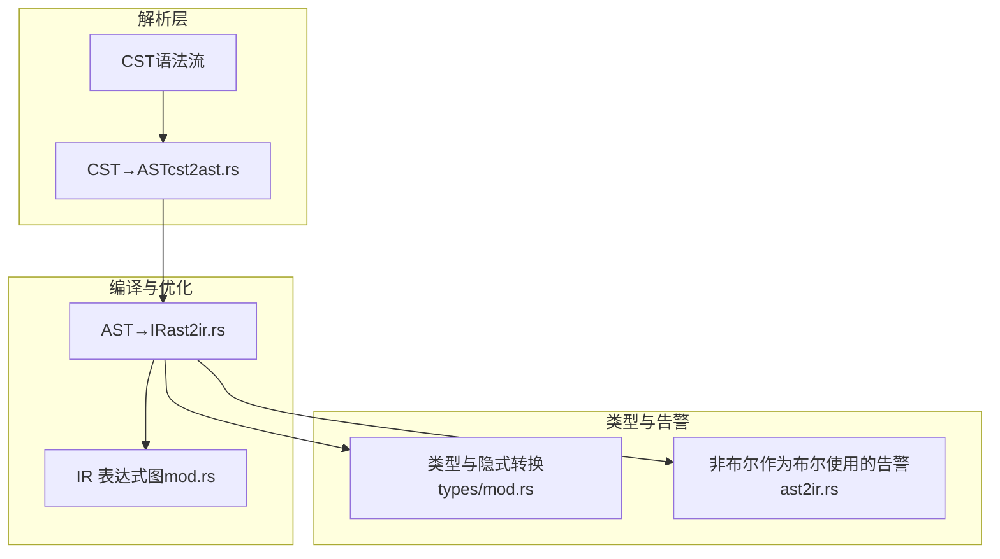
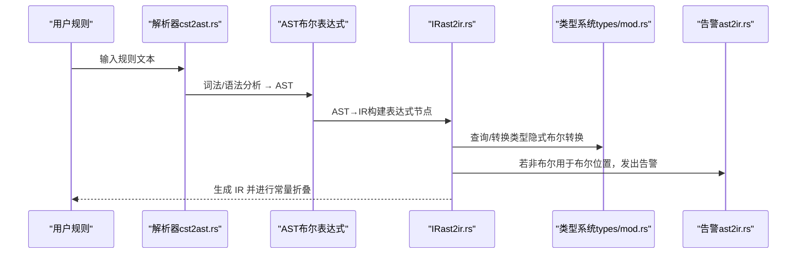
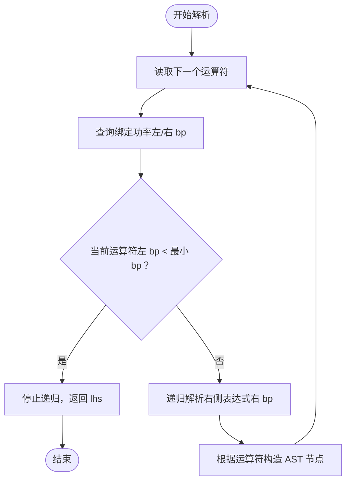
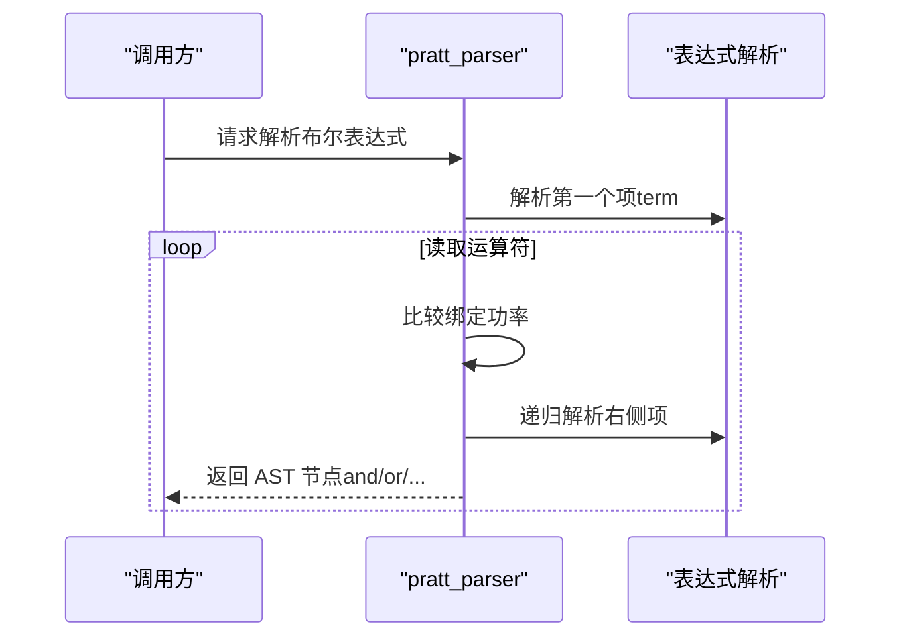
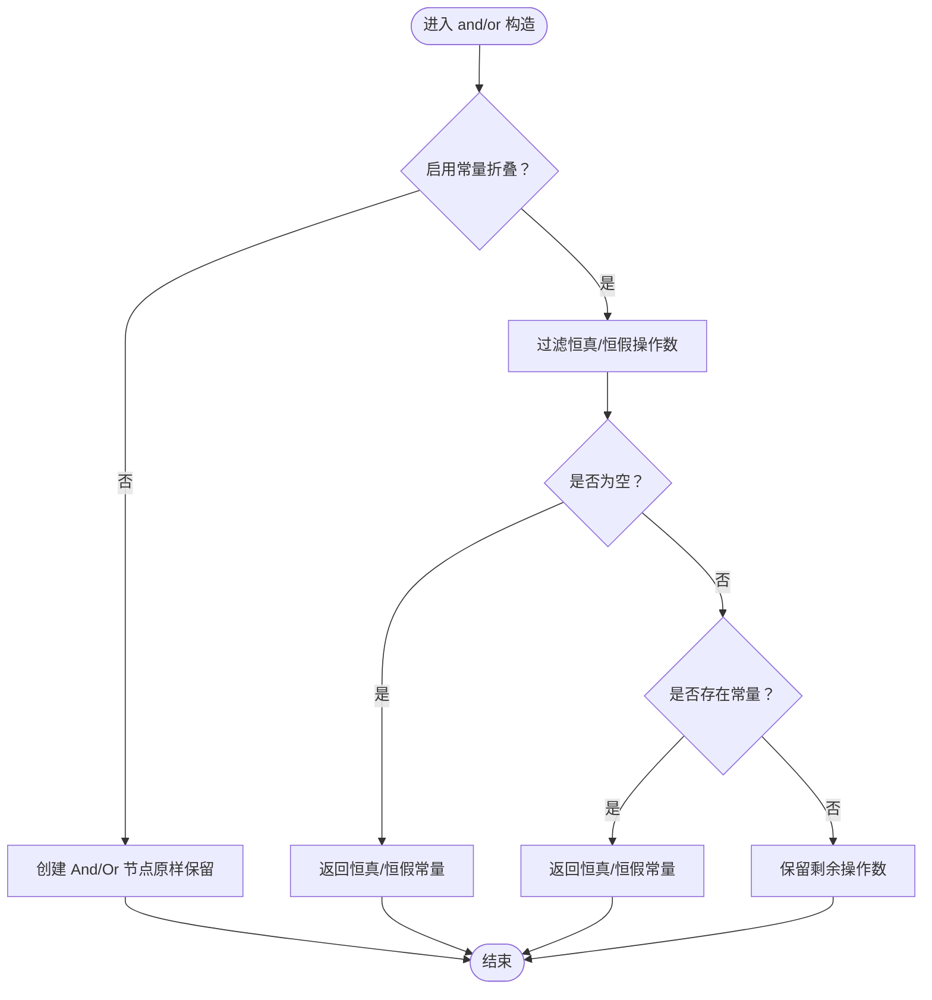
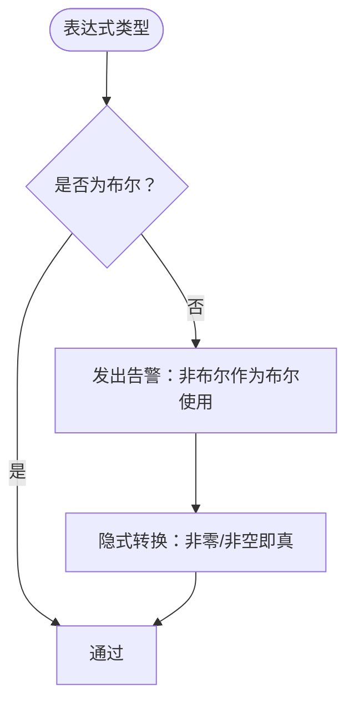
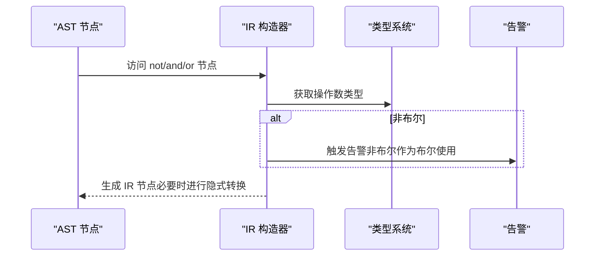
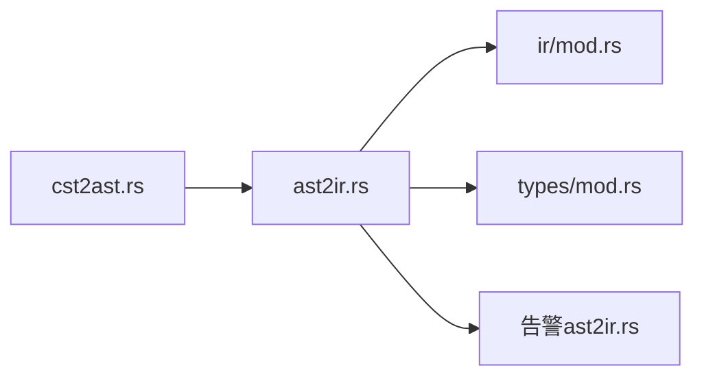

# 布尔表达式与逻辑

<cite>
**本文引用的文件**
- [条件语义与优先级](file://yara-x/site/content/docs/writing_rules/conditions.md)
- [AST 到 IR 的布尔表达式转换](file://yara-x/lib/src/compiler/ir/ast2ir.rs)
- [IR 中的布尔运算常量折叠](file://yara-x/lib/src/compiler/ir/mod.rs)
- [类型到布尔的隐式转换](file://yara-x/lib/src/types/mod.rs)
- [CST 到 AST 的布尔表达式解析](file://yara-x/parser/src/ast/cst2ast.rs)
- [布尔表达式警告：非布尔作为布尔使用](file://yara-x/lib/src/compiler/tests/testdata/warnings/20.out)
- [布尔表达式警告：非布尔作为布尔使用（整数示例）](file://yara-x/lib/src/compiler/tests/testdata/warnings/21.out)
- [基础布尔表达式测试样例](file://yara-x/parser/src/parser/tests/testdata/basic-1.in)
</cite>

## 目录
1. [引言](#引言)
2. [项目结构](#项目结构)
3. [核心组件](#核心组件)
4. [架构总览](#架构总览)
5. [详细组件分析](#详细组件分析)
6. [依赖分析](#依赖分析)
7. [性能考虑](#性能考虑)
8. [故障排查指南](#故障排查指南)
9. [结论](#结论)
10. [附录](#附录)

## 引言
本篇文档聚焦于 YARA-X 规则中“条件表达式”的布尔逻辑与求值机制，涵盖以下主题：
- 条件表达式的语法与结构
- 布尔运算符（and、or、not）与比较/关系运算符的使用
- 求值顺序与优先级规则
- 复杂条件的构建技巧
- 实际表达式示例与常见逻辑陷阱
- 编译期常量折叠与运行时求值优化
- 类型系统对非布尔值的隐式布尔转换与告警

目标是帮助开发者编写正确、可读、高效的条件表达式。

## 项目结构
围绕布尔表达式的关键实现分布在如下模块：
- 解析层：从词法/语法树生成 AST，并通过 Pratt 解析器处理运算符优先级与结合性
- 类型与编译期优化：在 IR 阶段进行常量折叠与类型检查
- 警告与诊断：当表达式被当作布尔使用但并非布尔类型时发出告警

图表来源
- [CST 到 AST 的布尔表达式解析:912-937](file://yara-x/parser/src/ast/cst2ast.rs#L912-L937)
- [AST 到 IR 的布尔表达式转换:1975-2006](file://yara-x/lib/src/compiler/ir/ast2ir.rs#L1975-L2006)
- [IR 中的布尔运算常量折叠:1040-1093](file://yara-x/lib/src/compiler/ir/mod.rs#L1040-L1093)
- [类型到布尔的隐式转换:372-408](file://yara-x/lib/src/types/mod.rs#L372-L408)

章节来源
- [条件语义与优先级:52-88](file://yara-x/site/content/docs/writing_rules/conditions.md#L52-L88)
- [CST 到 AST 的布尔表达式解析:912-937](file://yara-x/parser/src/ast/cst2ast.rs#L912-L937)
- [AST 到 IR 的布尔表达式转换:1975-2006](file://yara-x/lib/src/compiler/ir/ast2ir.rs#L1975-L2006)
- [IR 中的布尔运算常量折叠:1040-1093](file://yara-x/lib/src/compiler/ir/mod.rs#L1040-L1093)
- [类型到布尔的隐式转换:372-408](file://yara-x/lib/src/types/mod.rs#L372-L408)

## 核心组件
- 运算符优先级与结合性：由解析器使用 Pratt 算法根据绑定功率（binding power）确定分组；布尔运算符 and（优先级 3 左结合）、or（优先级 1 左结合），not（优先级 3 右结合）等。
- AST 构建：解析器在布尔表达式上下文中调用 Pratt 解析器，将 token 序列转换为带优先级的 AST。
- IR 生成与常量折叠：IR 层对 and/or 进行常量折叠，移除恒真/恒假的冗余分支，减少运行时开销。
- 类型系统与隐式转换：整数、浮点、字符串可隐式转换为布尔；编译器在非布尔值用于布尔位置时发出告警。
- 警告机制：当表达式类型不是布尔而被当作布尔使用时，给出“非零/非空即真”的提示。

章节来源
- [条件语义与优先级:52-88](file://yara-x/site/content/docs/writing_rules/conditions.md#L52-L88)
- [CST 到 AST 的布尔表达式解析:303-401](file://yara-x/parser/src/ast/cst2ast.rs#L303-L401)
- [IR 中的布尔运算常量折叠:1040-1093](file://yara-x/lib/src/compiler/ir/mod.rs#L1040-L1093)
- [类型到布尔的隐式转换:372-408](file://yara-x/lib/src/types/mod.rs#L372-L408)
- [布尔表达式警告：非布尔作为布尔使用:1-7](file://yara-x/lib/src/compiler/tests/testdata/warnings/20.out#L1-L7)
- [布尔表达式警告：非布尔作为布尔使用（整数示例）:1-7](file://yara-x/lib/src/compiler/tests/testdata/warnings/21.out#L1-L7)

## 架构总览
下图展示从输入规则到布尔表达式求值的整体流程：词法/语法树经 CST→AST，再进入 AST→IR，期间完成类型检查与常量折叠，最终得到可执行的 IR 表达式图。

图表来源
- [CST 到 AST 的布尔表达式解析:912-937](file://yara-x/parser/src/ast/cst2ast.rs#L912-L937)
- [AST 到 IR 的布尔表达式转换:1975-2006](file://yara-x/lib/src/compiler/ir/ast2ir.rs#L1975-L2006)
- [类型到布尔的隐式转换:372-408](file://yara-x/lib/src/types/mod.rs#L372-L408)

## 详细组件分析

### 组件一：运算符优先级与结合性
- 优先级表（节选）：and（3，左结合）、or（1，左结合）、not（3，右结合）等。同级运算符按结合性分组。
- 解析策略：Pratt 解析器依据左右绑定功率决定何时停止递归取词，从而保证符合优先级与结合性的分组。

图表来源
- [CST 到 AST 的布尔表达式解析:303-401](file://yara-x/parser/src/ast/cst2ast.rs#L303-L401)

章节来源
- [条件语义与优先级:52-88](file://yara-x/site/content/docs/writing_rules/conditions.md#L52-L88)
- [CST 到 AST 的布尔表达式解析:303-401](file://yara-x/parser/src/ast/cst2ast.rs#L303-L401)

### 组件二：AST 中布尔表达式的构建
- 在布尔表达式上下文中，解析器调用 Pratt 解析器，确保 and/or/not 的组合按优先级与结合性正确分组。
- 支持括号改变求值顺序；逗号分隔的布尔表达式元组用于某些构造（如 for-of 的条件集合）。

图表来源
- [CST 到 AST 的布尔表达式解析:912-937](file://yara-x/parser/src/ast/cst2ast.rs#L912-L937)

章节来源
- [CST 到 AST 的布尔表达式解析:912-937](file://yara-x/parser/src/ast/cst2ast.rs#L912-L937)

### 组件三：IR 中的布尔运算与常量折叠
- and 运算：若存在恒假操作数，则结果恒假；若所有操作数均为恒真，则结果恒真；否则保留未知或混合操作数。
- or 运算：若存在恒真操作数，则结果恒真；若所有操作数均为恒假，则结果恒假；否则保留未知或混合操作数。
- 常量折叠：在编译期移除无影响的恒真/恒假分支，降低运行时成本。

图表来源
- [IR 中的布尔运算常量折叠:1040-1093](file://yara-x/lib/src/compiler/ir/mod.rs#L1040-L1093)

章节来源
- [IR 中的布尔运算常量折叠:1040-1093](file://yara-x/lib/src/compiler/ir/mod.rs#L1040-L1093)

### 组件四：类型系统与隐式布尔转换
- 整数、浮点、字符串可隐式转换为布尔：非零整数/非零浮点/非空字符串被视为真，零与空串为假。
- 当表达式类型不是布尔却用于布尔位置（如 not、and、or 的操作数）时，编译器发出告警，提示“非零/非空即真”。

图表来源
- [类型到布尔的隐式转换:372-408](file://yara-x/lib/src/types/mod.rs#L372-L408)
- [布尔表达式警告：非布尔作为布尔使用:1-7](file://yara-x/lib/src/compiler/tests/testdata/warnings/20.out#L1-L7)
- [布尔表达式警告：非布尔作为布尔使用（整数示例）:1-7](file://yara-x/lib/src/compiler/tests/testdata/warnings/21.out#L1-L7)

章节来源
- [类型到布尔的隐式转换:372-408](file://yara-x/lib/src/types/mod.rs#L372-L408)
- [布尔表达式警告：非布尔作为布尔使用:1-7](file://yara-x/lib/src/compiler/tests/testdata/warnings/20.out#L1-L7)
- [布尔表达式警告：非布尔作为布尔使用（整数示例）:1-7](file://yara-x/lib/src/compiler/tests/testdata/warnings/21.out#L1-L7)

### 组件五：AST→IR 的布尔表达式转换与告警
- AST→IR 阶段对 not/and/or 等进行类型检查与告警触发；当操作数类型非布尔时，调用告警函数输出提示。
- 支持多种可混用的基础类型（整数、浮点、字符串），它们都会被转换为布尔参与逻辑运算。

图表来源
- [AST 到 IR 的布尔表达式转换:1975-2006](file://yara-x/lib/src/compiler/ir/ast2ir.rs#L1975-L2006)
- [AST 到 IR 的布尔表达式转换:2178-2213](file://yara-x/lib/src/compiler/ir/ast2ir.rs#L2178-L2213)

章节来源
- [AST 到 IR 的布尔表达式转换:1975-2006](file://yara-x/lib/src/compiler/ir/ast2ir.rs#L1975-L2006)
- [AST 到 IR 的布尔表达式转换:2178-2213](file://yara-x/lib/src/compiler/ir/ast2ir.rs#L2178-L2213)

### 组件六：复杂条件的构建技巧与示例
- 使用括号明确优先级与分组，避免依赖默认结合性导致的歧义。
- 将不变的子表达式提取为变量或模块函数，提升可读性与可维护性。
- 合理利用常量折叠：将恒真/恒假的子表达式放在 and/or 中以简化 IR。
- 示例参考：基础布尔表达式样例展示了括号、链式 and/or、not 的用法。

章节来源
- [基础布尔表达式测试样例:1-29](file://yara-x/parser/src/parser/tests/testdata/basic-1.in#L1-L29)

## 依赖分析
- 解析层依赖语法定义与绑定功率表，确保布尔表达式按既定优先级与结合性解析。
- IR 层依赖类型系统与告警机制，保证类型安全与可诊断性。
- 类型系统提供隐式转换规则，为布尔运算提供兼容性支持。

图表来源
- [CST 到 AST 的布尔表达式解析:912-937](file://yara-x/parser/src/ast/cst2ast.rs#L912-L937)
- [AST 到 IR 的布尔表达式转换:1975-2006](file://yara-x/lib/src/compiler/ir/ast2ir.rs#L1975-L2006)
- [IR 中的布尔运算常量折叠:1040-1093](file://yara-x/lib/src/compiler/ir/mod.rs#L1040-L1093)
- [类型到布尔的隐式转换:372-408](file://yara-x/lib/src/types/mod.rs#L372-L408)

章节来源
- [CST 到 AST 的布尔表达式解析:912-937](file://yara-x/parser/src/ast/cst2ast.rs#L912-L937)
- [AST 到 IR 的布尔表达式转换:1975-2006](file://yara-x/lib/src/compiler/ir/ast2ir.rs#L1975-L2006)
- [IR 中的布尔运算常量折叠:1040-1093](file://yara-x/lib/src/compiler/ir/mod.rs#L1040-L1093)
- [类型到布尔的隐式转换:372-408](file://yara-x/lib/src/types/mod.rs#L372-L408)

## 性能考虑
- 常量折叠：在 and/or 中尽早剔除恒真/恒假分支，减少运行时判断次数。
- 隐式转换：整数/浮点/字符串到布尔的转换在编译期完成，避免运行时额外开销。
- 优先级与结合性：正确的解析分组减少不必要的中间计算，提高 IR 的紧凑性。

## 故障排查指南
- 告警“非布尔作为布尔使用”：检查 not/and/or 的操作数类型，确认是否需要显式转换或重写表达式。
- 优先级误解：使用括号明确分组，避免默认结合性带来的歧义。
- 复杂条件难以维护：拆分为变量或辅助函数，提升可读性与可测试性。

章节来源
- [布尔表达式警告：非布尔作为布尔使用:1-7](file://yara-x/lib/src/compiler/tests/testdata/warnings/20.out#L1-L7)
- [布尔表达式警告：非布尔作为布尔使用（整数示例）:1-7](file://yara-x/lib/src/compiler/tests/testdata/warnings/21.out#L1-L7)
- [条件语义与优先级:52-88](file://yara-x/site/content/docs/writing_rules/conditions.md#L52-L88)

## 结论
YARA-X 的布尔表达式体系通过解析层的 Pratt 解析、IR 层的常量折叠与类型系统的隐式转换，实现了高效、可诊断且易于使用的条件表达式。遵循优先级与结合性规则、善用括号、合理拆分复杂条件，是编写高质量布尔逻辑的关键。

## 附录
- 优先级与结合性参考：见“条件语义与优先级”文档。
- 基础示例参考：见“基础布尔表达式测试样例”。