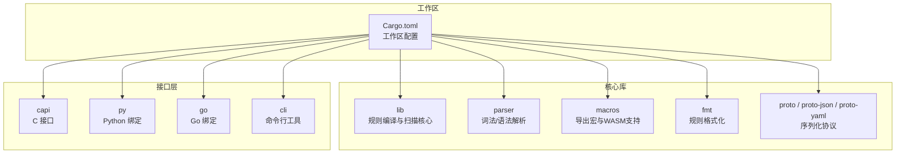
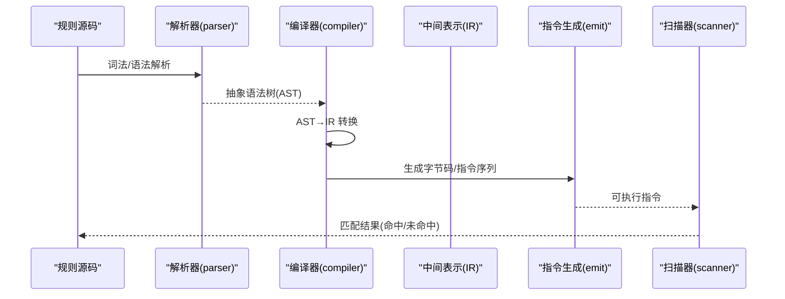
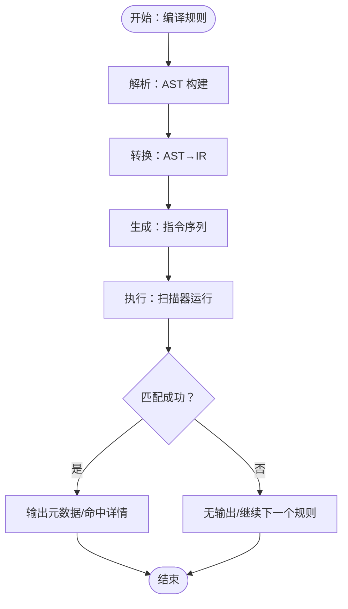
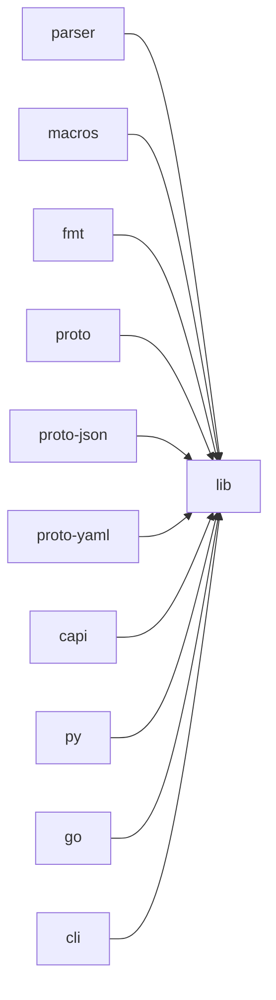

# 核心概念

<cite>
**本文引用的文件**
- [README.md](file://README.md)
- [Cargo.toml](file://Cargo.toml)
- [getting_started.md](file://site/content/docs/intro/getting_started.md)
- [syntax.md](file://site/content/docs/writing_rules/syntax.md)
- [conditions.md](file://site/content/docs/writing_rules/conditions.md)
- [hex_patterns.md](file://site/content/docs/writing_rules/hex_patterns.md)
- [text_patterns.md](file://site/content/docs/writing_rules/text_patterns.md)
- [regexps.md](file://site/content/docs/writing_rules/regexps.md)
- [differences.md](file://site/content/docs/writing_rules/differences.md)
- [external_variables.md](file://site/content/docs/writing_rules/external_variables.md)
- [global_and_private.md](file://site/content/docs/writing_rules/global_and_private.md)
- [emit.rs](file://lib/src/compiler/emit.rs)
- [ast2ir.rs](file://lib/src/compiler/ir/ast2ir.rs)
- [context.rs](file://lib/src/compiler/context.rs)
- [compiler_mod.rs](file://lib/src/compiler/mod.rs)
</cite>

## 目录
1. [引言](#引言)
2. [项目结构](#项目结构)
3. [核心组件](#核心组件)
4. [架构总览](#架构总览)
5. [详细组件分析](#详细组件分析)
6. [依赖分析](#依赖分析)
7. [性能考虑](#性能考虑)
8. [故障排查指南](#故障排查指南)
9. [结论](#结论)
10. [附录](#附录)

## 引言
本文件系统性梳理 YARA-X 的核心概念与实现要点，围绕规则的基本结构（元数据、字符串、条件）、模式匹配原理、布尔表达式逻辑、规则编译与执行流程展开，并补充字符串模式的多种形式（十六进制、文本、正则表达式）、修饰符语义与限制、变量与函数的使用方式，以及优化技巧、最佳实践与常见陷阱。内容兼顾初学者的渐进式学习与资深用户的深度技术细节。

## 项目结构
仓库采用多包工作区组织，核心能力由解析器、编译器、格式化工具、CLI、Python/Go/Rust 绑定等模块构成；文档位于 site/content 下，覆盖从入门到高级主题的完整知识体系。

图表来源
- [Cargo.toml:17-30](file://Cargo.toml#L17-L30)

章节来源
- [Cargo.toml:17-30](file://Cargo.toml#L17-L30)

## 核心组件
- 规则语法与结构：规则由元数据、字符串定义与条件三部分组成，条件是布尔表达式，决定匹配与否。
- 字符串模式：文本、十六进制、正则表达式三种形态，均可附加修饰符以改变匹配语义。
- 布尔表达式与运算符：支持逻辑、关系、位运算、算术运算及专用操作（如 at/in/of/for..of 等）。
- 编译与执行：AST → IR → 指令生成 → 扫描器执行，贯穿模式收集、锚点处理、范围限定、计数/偏移/长度查询等。
- 变量与外部变量：内置变量（如 filesize、偏移读取函数）、用户定义的外部全局变量。
- 全局/私有规则：全局规则先验校验，私有规则不直接输出但可被其他规则引用。

章节来源
- [syntax.md:32-57](file://site/content/docs/writing_rules/syntax.md#L32-L57)
- [conditions.md:21-42](file://site/content/docs/writing_rules/conditions.md#L21-L42)
- [text_patterns.md:21-36](file://site/content/docs/writing_rules/text_patterns.md#L21-L36)
- [hex_patterns.md:21-23](file://site/content/docs/writing_rules/hex_patterns.md#L21-L23)
- [regexps.md:21-37](file://site/content/docs/writing_rules/regexps.md#L21-L37)
- [external_variables.md:21-33](file://site/content/docs/writing_rules/external_variables.md#L21-L33)
- [global_and_private.md:21-37](file://site/content/docs/writing_rules/global_and_private.md#L21-L37)

## 架构总览
下图展示从规则源码到扫描执行的关键阶段：解析、编译、指令生成与扫描。

图表来源
- [compiler_mod.rs:1444-1488](file://lib/src/compiler/mod.rs#L1444-L1488)
- [emit.rs:1047-1480](file://lib/src/compiler/emit.rs#L1047-L1480)

## 详细组件分析

### 规则结构与布尔表达式
- 结构组成
  - 元数据(meta)：键值对，用于标注规则信息，不可在条件中直接使用。
  - 字符串(strings)：模式定义区，可省略；模式标识符在条件中作为布尔变量使用。
  - 条件(condition)：必须存在，包含布尔表达式，决定是否命中。
- 运算符与优先级
  - 支持逻辑、关系、位运算、算术运算及专用操作（contains/icontains/startswith/…/matches 等）。
  - 提供 at/in/of/for..of/for..in、with、引用其他规则等高级特性。
- 内置变量与函数
  - 文件大小：filesize。
  - 偏移读取：int8/uint8/int16be/uint32le/float64 等。
  - 计数/偏移/长度：#a、@a[i]、!a[i]。
  - 集合与迭代：of、for..of、for..in、with。
- 外部变量
  - 在编译时注入的全局外部变量，类型可为整型、布尔或字符串，支持在条件中使用。

章节来源
- [syntax.md:62-94](file://site/content/docs/writing_rules/syntax.md#L62-L94)
- [conditions.md:21-88](file://site/content/docs/writing_rules/conditions.md#L21-L88)
- [conditions.md:267-333](file://site/content/docs/writing_rules/conditions.md#L267-L333)
- [conditions.md:335-434](file://site/content/docs/writing_rules/conditions.md#L335-L434)
- [conditions.md:436-557](file://site/content/docs/writing_rules/conditions.md#L436-L557)
- [conditions.md:559-644](file://site/content/docs/writing_rules/conditions.md#L559-L644)
- [external_variables.md:21-33](file://site/content/docs/writing_rules/external_variables.md#L21-L33)

### 字符串模式与修饰符
- 文本模式
  - nocase：大小写不敏感。
  - wide/ascii：宽字符/ASCII 编码组合；默认 ASCII。
  - xor：单字节 XOR 解码搜索；支持范围指定。
  - fullword：单词边界限定。
  - base64/base64wide：Base64/BASE64 宽编码搜索；支持自定义字母表；与 nocase/fullword/xor 不兼容。
- 十六进制模式
  - 通配符 ?、按半字节/全字节否定 ~、跳跃 [X-Y]、替代 (A|B|…)。
- 正则表达式
  - 以 /.../ 定义，支持 i/s 后缀；支持大量元字符与量词；与文本修饰符语义一致。

章节来源
- [text_patterns.md:38-93](file://site/content/docs/writing_rules/text_patterns.md#L38-L93)
- [text_patterns.md:94-177](file://site/content/docs/writing_rules/text_patterns.md#L94-L177)
- [text_patterns.md:178-253](file://site/content/docs/writing_rules/text_patterns.md#L178-L253)
- [hex_patterns.md:25-179](file://site/content/docs/writing_rules/hex_patterns.md#L25-L179)
- [regexps.md:21-124](file://site/content/docs/writing_rules/regexps.md#L21-L124)

### 编译与执行流程
- 编译阶段
  - AST → IR：将规则转换为中间表示，记录模式、符号、作用域与约束。
  - 指令生成：针对条件表达式生成执行序列，处理锚点、集合/迭代、计数/偏移/长度等。
  - 符号解析：通过上下文定位模式标识符（$、#、@、!）对应的模式索引与 IR 节点。
- 执行阶段
  - 扫描器按指令序列执行，结合模式引擎完成匹配、计数、定位与长度计算。
  - 对集合/迭代类操作进行循环与过滤，确保性能与正确性。

图表来源
- [compiler_mod.rs:1444-1488](file://lib/src/compiler/mod.rs#L1444-L1488)
- [emit.rs:1047-1480](file://lib/src/compiler/emit.rs#L1047-L1480)

章节来源
- [compiler_mod.rs:1444-1488](file://lib/src/compiler/mod.rs#L1444-L1488)
- [emit.rs:1047-1480](file://lib/src/compiler/emit.rs#L1047-L1480)
- [context.rs:69-101](file://lib/src/compiler/context.rs#L69-L101)

### 修饰符与模式组合的约束
- 不兼容组合
  - xor 与 nocase、base64/base64wide 与 nocase/fullword、base64/base64wide 与 xor 等。
- 修饰符生效顺序
  - wide 优先于 xor 应用；ascii 默认启用（未显式 wide 时）。
- 特殊差异
  - base64/base64wide 最短长度要求提升至至少 3 字符，避免历史假阳性问题。
  - 跳跃上下界支持十进制、十六进制与八进制。

章节来源
- [ast2ir.rs:120-163](file://lib/src/compiler/ir/ast2ir.rs#L120-L163)
- [differences.md:131-160](file://site/content/docs/writing_rules/differences.md#L131-L160)
- [differences.md:251-259](file://site/content/docs/writing_rules/differences.md#L251-L259)

### 全局/私有规则与外部变量
- 全局规则：在所有规则之前评估，满足后才评估其余规则；仅能依赖其他全局规则。
- 私有规则：不直接输出，可用于构建复用的内部规则。
- 外部变量：在编译期注入，支持整数、布尔、字符串类型，在条件中直接使用。

章节来源
- [global_and_private.md:21-44](file://site/content/docs/writing_rules/global_and_private.md#L21-L44)
- [global_and_private.md:46-66](file://site/content/docs/writing_rules/global_and_private.md#L46-L66)
- [external_variables.md:21-85](file://site/content/docs/writing_rules/external_variables.md#L21-L85)

## 依赖分析
- 工作区成员
  - lib、capi、cli、fmt、macros、parser、proto 系列、py 等模块共同构成 YARA-X 生态。
- 关键依赖
  - 解析与编译：parser、lib（compiler/ir/emit）。
  - 接口绑定：capi、py、go。
  - 输出与序列化：proto/json/yaml。
- 性能与稳定性
  - 开发配置对解析器启用优化，避免递归导致栈溢出。
  - 发布 LTO 配置提升二进制体积与运行时性能。

图表来源
- [Cargo.toml:17-30](file://Cargo.toml#L17-L30)

章节来源
- [Cargo.toml:17-30](file://Cargo.toml#L17-L30)
- [Cargo.toml:127-135](file://Cargo.toml#L127-L135)

## 性能考虑
- 模式数量与复杂度
  - 规则内模式上限与循环迭代次数存在阈值，避免极端复杂度导致性能问题。
- 集合/迭代操作
  - of/for..of/for..in 会引入循环与过滤，应尽量限定范围（如 in (start..end)、at 偏移）。
- 锚点与范围
  - 使用 at/in 显式限定偏移区间，减少全局扫描开销。
- 计数/偏移/长度
  - 仅在必要时使用 #、@、! 查询，避免重复计算。
- 外部变量与全局规则
  - 利用全局规则快速排除大文件，降低后续规则压力。

章节来源
- [ast2ir.rs:45-50](file://lib/src/compiler/ir/ast2ir.rs#L45-L50)
- [conditions.md:179-286](file://site/content/docs/writing_rules/conditions.md#L179-L286)
- [conditions.md:335-434](file://site/content/docs/writing_rules/conditions.md#L335-L434)
- [global_and_private.md:21-37](file://site/content/docs/writing_rules/global_and_private.md#L21-L37)

## 故障排查指南
- 常见错误类型
  - 修饰符组合冲突：如 base64/base64wide 与 nocase/fullword/xor 同用。
  - 模式标识符未知或重复：检查 $、#、@、! 前缀与唯一性。
  - 规则/模式过多：超过阈值将触发编译错误。
  - 正则语法严格：YARA-X 默认严格转义与花括号处理，必要时使用 CLI 的宽松选项。
- 定位方法
  - 编译器报告包含源码位置与提示信息，依据错误码与注释修正。
  - 使用 external variables 时确保编译期已定义对应变量。
- 优化建议
  - 将昂贵的正则与大范围跳跃拆分为多个小范围模式。
  - 优先使用文本/十六进制模式而非正则，除非必要。
  - 合理使用全局规则与外部变量，减少无效扫描。

章节来源
- [ast2ir.rs:120-163](file://lib/src/compiler/ir/ast2ir.rs#L120-L163)
- [ast2ir.rs:52-84](file://lib/src/compiler/ir/ast2ir.rs#L52-L84)
- [differences.md:34-80](file://site/content/docs/writing_rules/differences.md#L34-L80)
- [external_variables.md:76-85](file://site/content/docs/writing_rules/external_variables.md#L76-L85)

## 结论
YARA-X 在保持与 YARA 规则生态高度兼容的同时，强化了正则语法、修饰符组合、集合与迭代等高级特性，并在编译与执行层面提供了更严格的约束与更高的性能潜力。掌握规则结构、模式形态与布尔表达式的组合，配合合理的优化策略与最佳实践，可在保证准确性的同时显著提升扫描效率与可维护性。

## 附录
- 渐进式学习路径
  - 入门：规则结构与基本语法（元数据、字符串、条件）。
  - 进阶：修饰符与模式形态（文本/十六进制/正则）。
  - 高级：布尔表达式与运算符、集合/迭代、外部变量与全局/私有规则。
  - 实战：性能优化、常见陷阱与调试技巧。
- 参考示例与文档入口
  - 规则入门与示例：[getting_started.md:33-48](file://site/content/docs/intro/getting_started.md#L33-L48)
  - 规则语法与结构：[syntax.md:25-94](file://site/content/docs/writing_rules/syntax.md#L25-L94)
  - 条件与运算符：[conditions.md:21-88](file://site/content/docs/writing_rules/conditions.md#L21-L88)
  - 文本修饰符：[text_patterns.md:38-253](file://site/content/docs/writing_rules/text_patterns.md#L38-L253)
  - 十六进制模式：[hex_patterns.md:25-179](file://site/content/docs/writing_rules/hex_patterns.md#L25-L179)
  - 正则表达式：[regexps.md:21-124](file://site/content/docs/writing_rules/regexps.md#L21-L124)
  - 外部变量：[external_variables.md:21-85](file://site/content/docs/writing_rules/external_variables.md#L21-85)
  - 全局/私有规则：[global_and_private.md:21-66](file://site/content/docs/writing_rules/global_and_private.md#L21-66)
  - 与 YARA 的差异：[differences.md:34-273](file://site/content/docs/writing_rules/differences.md#L34-L273)