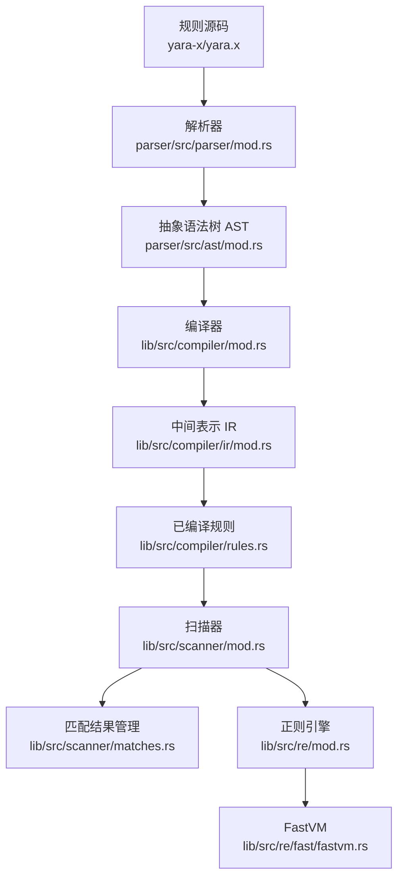
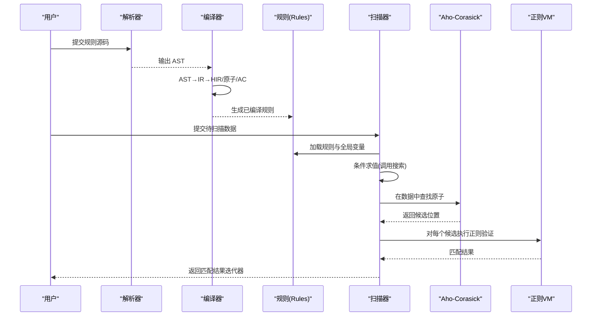
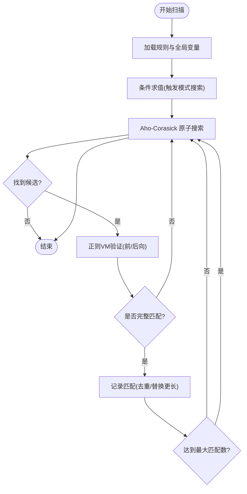
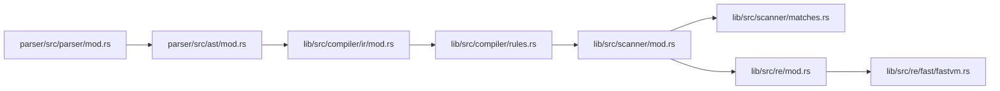

# 模式匹配原理

<cite>
**本文引用的文件**
- [lib/src/lib.rs](file://yara-x/lib/src/lib.rs)
- [lib/src/models.rs](file://yara-x/lib/src/models.rs)
- [lib/src/compiler/mod.rs](file://yara-x/lib/src/compiler/mod.rs)
- [lib/src/compiler/ir/mod.rs](file://yara-x/lib/src/compiler/ir/mod.rs)
- [lib/src/compiler/ir/ast2ir.rs](file://yara-x/lib/src/compiler/ir/ast2ir.rs)
- [lib/src/compiler/rule.rs](file://yara-x/lib/src/compiler/rules.rs)
- [lib/src/scanner/mod.rs](file://yara-x/lib/src/scanner/mod.rs)
- [lib/src/scanner/context.rs](file://yara-x/lib/src/scanner/context.rs)
- [lib/src/scanner/matches.rs](file://yara-x/lib/src/scanner/matches.rs)
- [lib/src/re/mod.rs](file://yara-x/lib/src/re/mod.rs)
- [lib/src/re/fast/fastvm.rs](file://yara-x/lib/src/re/fast/fastvm.rs)
- [parser/src/ast/mod.rs](file://yara-x/parser/src/ast/mod.rs)
- [parser/src/parser/mod.rs](file://yara-x/parser/src/parser/mod.rs)
- [capi/src/pattern.rs](file://yara-x/capi/src/pattern.rs)
- [site/content/docs/writing_rules/hex_patterns.md](file://yara-x/site/content/docs/writing_rules/hex_patterns.md)
</cite>

## 目录
1. [简介](#简介)
2. [项目结构](#项目结构)
3. [核心组件](#核心组件)
4. [架构总览](#架构总览)
5. [详细组件分析](#详细组件分析)
6. [依赖关系分析](#依赖关系分析)
7. [性能考量](#性能考量)
8. [故障排查指南](#故障排查指南)
9. [结论](#结论)
10. [附录](#附录)

## 简介
本文件系统性阐述 YARA-X 的模式匹配原理与实现细节，覆盖文本模式、十六进制模式与正则表达式模式的匹配机制；详解模式修饰符（nocase、ascii、wide、fullword、base64/base64wide、xor、private 等）的作用与组合规则；并总结编译期优化与运行时性能策略，帮助开发者编写高效且可维护的匹配模式。

## 项目结构
YARA-X 的模式匹配贯穿“解析 → 编译 → 运行”三阶段：解析器将源码转为 AST/语法树；编译器将 AST 转换为中间表示（IR），生成正则表达式 HIR、提取原子（atoms）、构建 Aho-Corasick 自动机，并生成 WebAssembly 条件求值模块；扫描器在目标数据上执行条件判断与模式匹配，利用 AC 原子快速定位候选，再通过正则 VM 验证最终匹配。

图示来源
- [lib/src/compiler/mod.rs:1057-1656](file://yara-x/lib/src/compiler/mod.rs#L1057-L1656)
- [lib/src/compiler/ir/mod.rs:1-800](file://yara-x/lib/src/compiler/ir/mod.rs#L1-L800)
- [lib/src/compiler/rules.rs:89-795](file://yara-x/lib/src/compiler/rules.rs#L89-L795)
- [lib/src/scanner/mod.rs:1-800](file://yara-x/lib/src/scanner/mod.rs#L1-L800)
- [lib/src/re/mod.rs:1-257](file://yara-x/lib/src/re/mod.rs#L1-L257)

章节来源
- [lib/src/lib.rs:1-178](file://yara-x/lib/src/lib.rs#L1-L178)
- [parser/src/ast/mod.rs:1-800](file://yara-x/parser/src/ast/mod.rs#L1-L800)
- [parser/src/parser/mod.rs:1211-1260](file://yara-x/parser/src/parser/mod.rs#L1211-L1260)

## 核心组件
- 解析层：将规则字符串解析为 AST，识别模式类型（文本/十六进制/正则）与修饰符集合。
- 编译层：将 AST 转为 IR，生成 HIR，提取原子并构建 AC 自动机；生成 WASM 条件求值模块。
- 扫描层：在输入数据上执行条件求值；通过 AC 快速发现原子，再用正则 VM 验证；记录匹配结果并支持多块扫描与内存映射优化。
- 正则引擎：提供 Thompson 构造与 Pike VM，以及针对特定约束的 FastVM，以平衡通用性与性能。

章节来源
- [lib/src/models.rs:1-407](file://yara-x/lib/src/models.rs#L1-L407)
- [lib/src/compiler/mod.rs:1057-1656](file://yara-x/lib/src/compiler/mod.rs#L1057-L1656)
- [lib/src/scanner/mod.rs:175-432](file://yara-x/lib/src/scanner/mod.rs#L175-L432)
- [lib/src/re/mod.rs:1-257](file://yara-x/lib/src/re/mod.rs#L1-L257)

## 架构总览
下图展示从规则到匹配的关键流程：解析 → 编译 → 条件求值 → 原子搜索 → 正则验证 → 结果汇总。

图示来源
- [lib/src/compiler/mod.rs:1057-1656](file://yara-x/lib/src/compiler/mod.rs#L1057-L1656)
- [lib/src/scanner/context.rs:734-764](file://yara-x/lib/src/scanner/context.rs#L734-L764)
- [lib/src/re/mod.rs:1-257](file://yara-x/lib/src/re/mod.rs#L1-L257)

## 详细组件分析

### 文本模式匹配原理
- 修饰符处理
  - ascii/wide：默认 ascii；若指定 wide，则按宽字节扫描；二者不可同时使用。
  - nocase：大小写不敏感匹配。
  - fullword：单词边界匹配。
  - base64/base64wide：对明文字面量进行 Base64 编码解码后匹配，可指定字母表或使用默认。
  - xor：对明文进行 XOR 解密后匹配，支持固定键或范围。
  - private：仅内部使用，不影响匹配但影响可见性。
- 编译期优化
  - 将修饰符转换为位标志（PatternFlags），统一处理。
  - 对可等价为文本的十六进制模式给出警告建议改写为文本字面量，提升可读性。
- 运行时匹配
  - 文本模式最终被转换为 HIR，由正则 VM 执行匹配。
  - 支持全宽扫描与边界检查（fullword）。

章节来源
- [parser/src/ast/mod.rs:654-732](file://yara-x/parser/src/ast/mod.rs#L654-L732)
- [parser/src/ast/mod.rs:750-820](file://yara-x/parser/src/ast/mod.rs#L750-L820)
- [lib/src/compiler/ir/ast2ir.rs:107-260](file://yara-x/lib/src/compiler/ir/ast2ir.rs#L107-L260)
- [lib/src/compiler/ir/ast2ir.rs:262-314](file://yara-x/lib/src/compiler/ir/ast2ir.rs#L262-L314)
- [lib/src/compiler/warnings.rs:479-513](file://yara-x/lib/src/compiler/warnings.rs#L479-L513)

### 十六进制模式匹配原理
- 语义与语法
  - 支持通配符（?）、取反（~XX）、替代（(A|B)）、跳转（[n-m]）等构造。
  - 可直接写为十六进制序列，编译器会将其转换为 HIR。
- 修饰符限制
  - 十六进制模式仅允许 private 修饰符；其他修饰符（如 nocase）非法。
- 性能与可读性
  - 若十六进制模式可等价为 ASCII 文本，编译器会提示改写为文本字面量。

章节来源
- [site/content/docs/writing_rules/hex_patterns.md:1-63](file://yara-x/site/content/docs/writing_rules/hex_patterns.md#L1-L63)
- [parser/src/parser/mod.rs:1211-1260](file://yara-x/parser/src/parser/mod.rs#L1211-L1260)
- [parser/src/ast/mod.rs:277-304](file://yara-x/parser/src/ast/mod.rs#L277-L304)
- [lib/src/compiler/ir/ast2ir.rs:262-314](file://yara-x/lib/src/compiler/ir/ast2ir.rs#L262-L314)
- [lib/src/compiler/warnings.rs:479-513](file://yara-x/lib/src/compiler/warnings.rs#L479-L513)

### 正则表达式模式匹配原理
- HIR 生成与统一处理
  - 文本与十六进制模式均被转换为 HIR，统一进入正则引擎。
- 正则引擎
  - 默认使用基于 Thompson 构造与 Pike VM 的通用方案。
  - 对满足约束的正则提供 FastVM，显著提升运行时性能。
- 原子与 AC 自动机
  - 从 HIR 中提取原子（atoms），构建 Aho-Corasick 自动机。
  - 扫描阶段先用 AC 快速定位原子，再用 VM 验证完整匹配。

章节来源
- [lib/src/re/mod.rs:1-257](file://yara-x/lib/src/re/mod.rs#L1-L257)
- [lib/src/compiler/rules.rs:384-410](file://yara-x/lib/src/compiler/rules.rs#L384-L410)
- [lib/src/compiler/rules.rs:749-795](file://yara-x/lib/src/compiler/rules.rs#L749-L795)

### 模式修饰符作用与组合规则
- 修饰符枚举与显示
  - 支持 ascii、wide、nocase、private、fullword、base64、base64wide、xor。
  - 显示格式遵循语法定义，例如 xor(1)、xor(20-30)、base64("foo") 等。
- 组合限制
  - ascii 与 wide 互斥；base64/base64wide 与 nocase 互斥等。
  - 十六进制模式仅允许 private。
- 编译期校验
  - 重复修饰符检测、非法组合报错、不兼容修饰符组合警告。

章节来源
- [parser/src/ast/mod.rs:750-820](file://yara-x/parser/src/ast/mod.rs#L750-L820)
- [parser/src/parser/mod.rs:1233-1260](file://yara-x/parser/src/parser/mod.rs#L1233-L1260)
- [lib/src/compiler/ir/ast2ir.rs:86-105](file://yara-x/lib/src/compiler/ir/ast2ir.rs#L86-L105)
- [lib/src/compiler/tests/.../errors/114.out:1-9](file://yara-x/lib/src/compiler/tests/.../errors/114.out#L1-L9)
- [lib/src/compiler/tests/.../errors/115.out:1-5](file://yara-x/lib/src/compiler/tests/.../errors/115.out#L1-L5)

### 匹配算法与运行时流程
- AC 原子搜索
  - 在输入数据上查找所有匹配的原子，返回候选位置。
- 正则 VM 验证
  - 使用 Pike VM 或 FastVM 对候选进行前后向扫描验证，确保完整匹配。
- 多块扫描与内存映射
  - 支持多块扫描，匹配片段缓存于有序结构以便后续访问。
  - 大文件默认使用内存映射以提升 I/O 性能，可配置禁用避免 SIGBUS 风险。

图示来源
- [lib/src/scanner/context.rs:734-764](file://yara-x/lib/src/scanner/context.rs#L734-L764)
- [lib/src/re/fast/fastvm.rs:639-678](file://yara-x/lib/src/re/fast/fastvm.rs#L639-L678)
- [lib/src/scanner/matches.rs:219-323](file://yara-x/lib/src/scanner/matches.rs#L219-L323)

### 匹配结果模型与 API
- 模式与规则模型
  - Pattern/Rule/Metadata/Tags 等模型提供遍历与查询接口。
- 匹配迭代器
  - Pattern.matches() 返回匹配迭代器，支持访问匹配范围、原始数据片段与 XOR 键。
- C API
  - 提供 C 接口遍历单个模式的所有匹配，便于外部集成。

章节来源
- [lib/src/models.rs:314-407](file://yara-x/lib/src/models.rs#L314-L407)
- [capi/src/pattern.rs:1-80](file://yara-x/capi/src/pattern.rs#L1-L80)

## 依赖关系分析
- 解析层依赖：解析器将源码转为 AST；AST 定义了模式类型与修饰符结构。
- 编译层依赖：IR/AST 转换、HIR 生成、原子提取、AC 自动机构建、WASM 条件模块生成。
- 扫描层依赖：规则加载、条件求值、AC 原子搜索、正则 VM、匹配结果管理。
- 正则引擎依赖：通用 VM 与 FastVM，受 HIR 与原子集驱动。

图示来源
- [parser/src/parser/mod.rs:1211-1260](file://yara-x/parser/src/parser/mod.rs#L1211-L1260)
- [parser/src/ast/mod.rs:233-283](file://yara-x/parser/src/ast/mod.rs#L233-L283)
- [lib/src/compiler/ir/mod.rs:1-800](file://yara-x/lib/src/compiler/ir/mod.rs#L1-L800)
- [lib/src/compiler/rules.rs:384-410](file://yara-x/lib/src/compiler/rules.rs#L384-L410)
- [lib/src/scanner/mod.rs:175-432](file://yara-x/lib/src/scanner/mod.rs#L175-L432)
- [lib/src/re/mod.rs:1-257](file://yara-x/lib/src/re/mod.rs#L1-L257)

## 性能考量
- 原子与 AC 自动机
  - 通过提取短原子并构建 AC，大幅减少正则 VM 的尝试次数。
  - 原子长度分布统计与慢原子警告有助于优化规则。
- 正则引擎选择
  - FastVM 适用于满足约束的正则，显著降低运行时开销。
  - 默认 Pike VM 兼容性更好，适合复杂正则。
- 内存与 I/O
  - 大文件默认内存映射，小文件直接缓冲，兼顾吞吐与延迟。
  - 匹配结果缓存与容量阈值控制，避免长期持有大量内存。
- 并发与超时
  - 扫描器单实例顺序扫描，多线程需多实例；内置心跳计数与超时保护。

章节来源
- [lib/src/compiler/rules.rs:384-410](file://yara-x/lib/src/compiler/rules.rs#L384-L410)
- [lib/src/re/mod.rs:40-70](file://yara-x/lib/src/re/mod.rs#L40-L70)
- [lib/src/scanner/mod.rs:454-485](file://yara-x/lib/src/scanner/mod.rs#L454-L485)
- [lib/src/scanner/matches.rs:255-277](file://yara-x/lib/src/scanner/matches.rs#L255-L277)

## 故障排查指南
- 常见错误
  - 十六进制模式使用非法修饰符（如 nocase）：编译时报错。
  - 文本模式与十六进制模式修饰符冲突（如 base64wide 与 nocase）：编译时报错。
  - 重复修饰符：编译时报错。
- 建议
  - 将可读性强的十六进制模式改写为文本字面量。
  - 合理设置最大匹配数，避免内存占用过高。
  - 对大文件扫描启用内存映射，必要时关闭以规避 SIGBUS。

章节来源
- [lib/src/compiler/tests/.../errors/114.out:1-9](file://yara-x/lib/src/compiler/tests/.../errors/114.out#L1-L9)
- [lib/src/compiler/tests/.../errors/115.out:1-5](file://yara-x/lib/src/compiler/tests/.../errors/115.out#L1-L5)
- [lib/src/compiler/warnings.rs:479-513](file://yara-x/lib/src/compiler/warnings.rs#L479-L513)
- [lib/src/scanner/mod.rs:216-230](file://yara-x/lib/src/scanner/mod.rs#L216-L230)

## 结论
YARA-X 采用“解析 → 编译 → 运行”的清晰分层：解析器负责结构化规则；编译器将文本/十六进制/正则统一为 HIR 与 AC 原子，生成 WASM 条件模块；扫描器结合 AC 快速定位与正则 VM 精确验证，形成高性能、可扩展的模式匹配体系。合理使用修饰符与优化规则结构，可在保证正确性的同时获得最佳性能。

## 附录
- 模式类型与修饰符参考
  - 文本模式：支持 ascii、wide、nocase、fullword、base64、base64wide、xor、private。
  - 十六进制模式：仅支持 private；支持通配符、取反、替代、跳转。
  - 正则模式：统一由 HIR 驱动，FastVM 与 Pike VM 共存。

章节来源
- [parser/src/ast/mod.rs:233-283](file://yara-x/parser/src/ast/mod.rs#L233-L283)
- [parser/src/ast/mod.rs:654-732](file://yara-x/parser/src/ast/mod.rs#L654-L732)
- [site/content/docs/writing_rules/hex_patterns.md:1-63](file://yara-x/site/content/docs/writing_rules/hex_patterns.md#L1-L63)