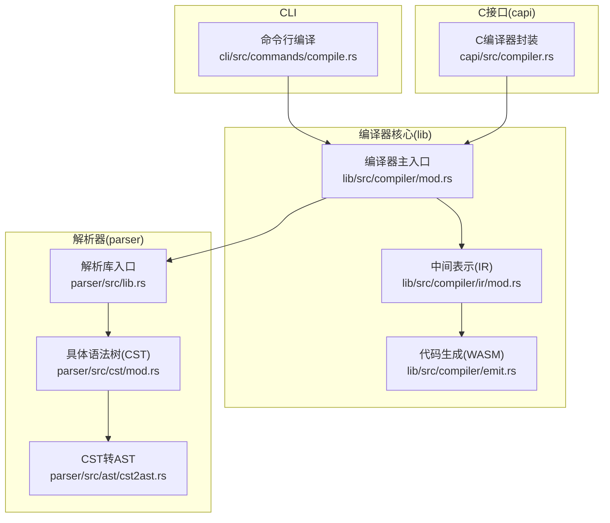
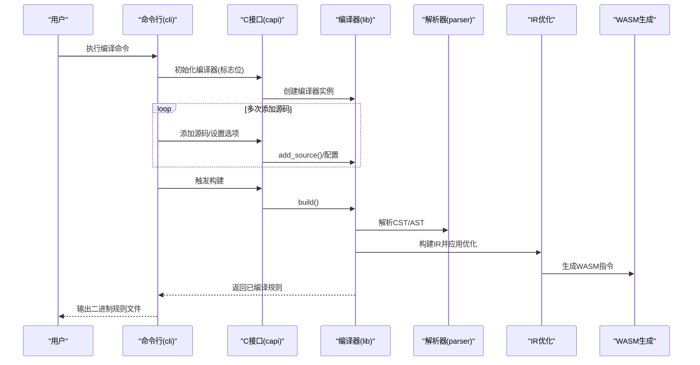
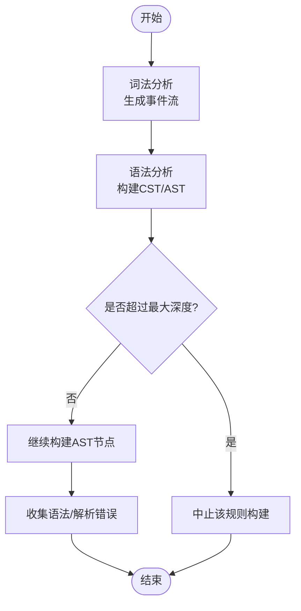
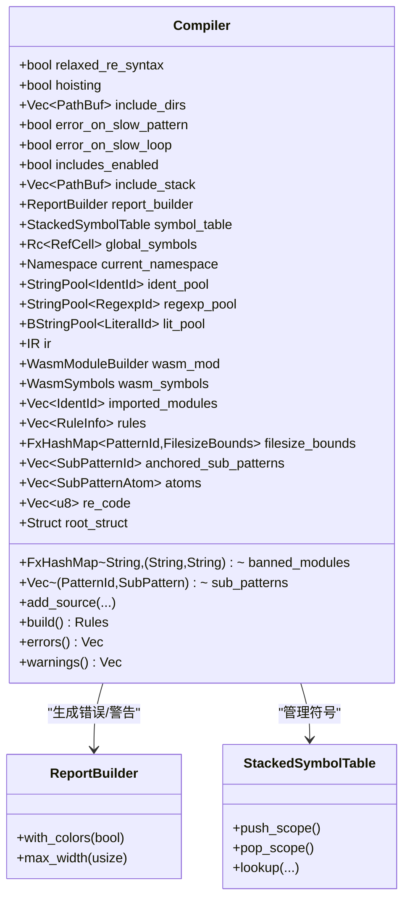
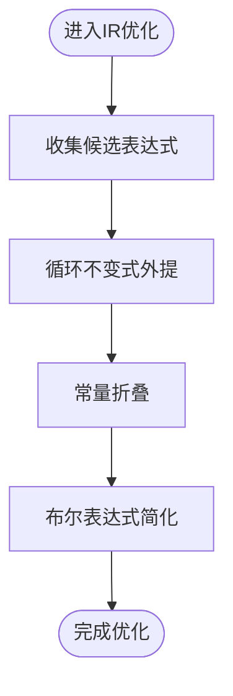
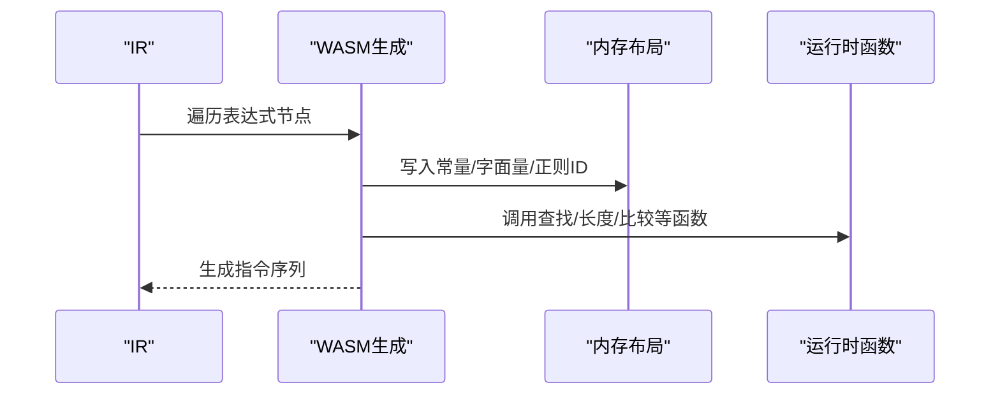
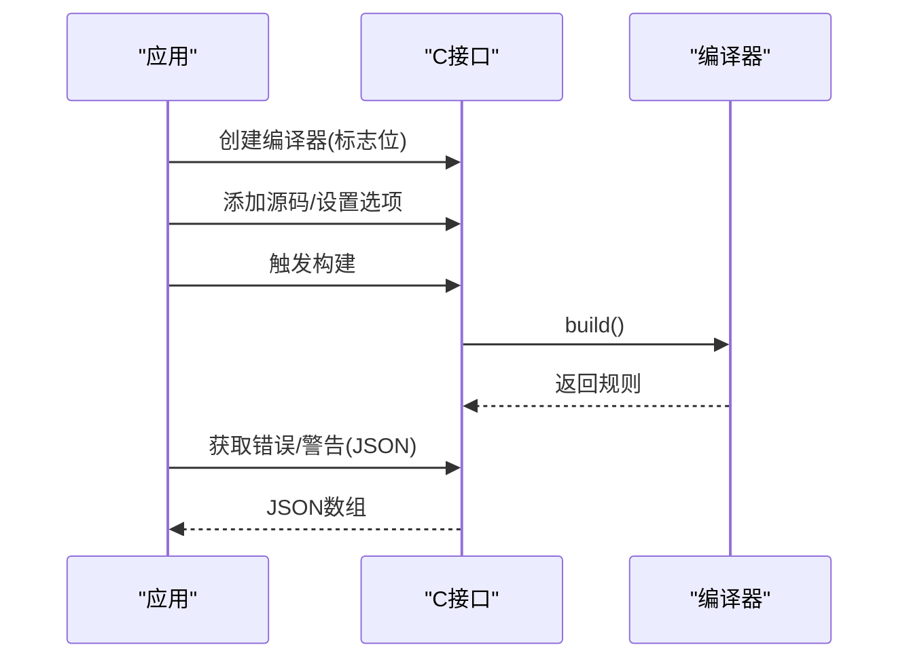
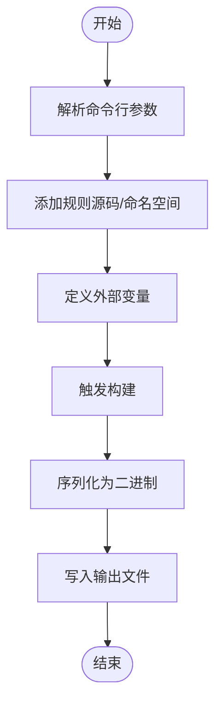
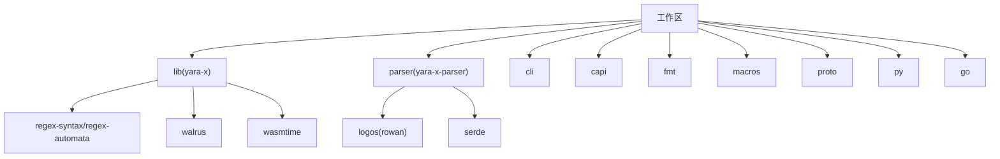

# 规则编译流程

<cite>
**本文引用的文件**
- [Cargo.toml](file://Cargo.toml)
- [README.md](file://README.md)
- [lib/Cargo.toml](file://lib/Cargo.toml)
- [parser/Cargo.toml](file://parser/Cargo.toml)
- [lib/src/compiler/mod.rs](file://lib/src/compiler/mod.rs)
- [lib/src/compiler/ir/mod.rs](file://lib/src/compiler/ir/mod.rs)
- [lib/src/compiler/emit.rs](file://lib/src/compiler/emit.rs)
- [parser/src/lib.rs](file://parser/src/lib.rs)
- [parser/src/cst/mod.rs](file://parser/src/cst/mod.rs)
- [parser/src/ast/cst2ast.rs](file://parser/src/ast/cst2ast.rs)
- [capi/src/compiler.rs](file://capi/src/compiler.rs)
- [cli/src/commands/compile.rs](file://cli/src/commands/compile.rs)
</cite>

## 目录
1. [简介](#简介)
2. [项目结构](#项目结构)
3. [核心组件](#核心组件)
4. [架构总览](#架构总览)
5. [详细组件分析](#详细组件分析)
6. [依赖关系分析](#依赖关系分析)
7. [性能考量](#性能考量)
8. [故障排查指南](#故障排查指南)
9. [结论](#结论)
10. [附录](#附录)

## 简介
本文件系统性阐述 YARA-X 的规则编译流程，覆盖从 YARA 源码到可执行规则的完整链路：词法分析、语法分析、语义分析、中间表示（IR）与优化、代码生成（WebAssembly），并深入解析编译期优化策略（常量折叠、循环不变式外提、条件优化等）、错误与警告体系、以及性能优化最佳实践。目标读者既包括需要理解实现细节的工程师，也包括希望掌握使用方式与排错技巧的使用者。

## 项目结构
YARA-X 采用多工作区组织，核心模块包括：
- lib：编译器主体、规则模型、WASM 生成、内置模块与特性开关
- parser：词法/语法/语义层，提供 CST/AST 能力
- cli：命令行工具，提供编译命令与参数
- capi：C 接口封装，暴露编译器能力给外部语言
- 其他：fmt、proto、py、go 等生态扩展

图示来源
- [cli/src/commands/compile.rs:1-91](file://cli/src/commands/compile.rs#L1-91)
- [lib/src/compiler/mod.rs:1-200](file://lib/src/compiler/mod.rs#L1-L200)
- [lib/src/compiler/ir/mod.rs:644-1126](file://lib/src/compiler/ir/mod.rs#L644-L1126)
- [lib/src/compiler/emit.rs:204-272](file://lib/src/compiler/emit.rs#L204-L272)
- [parser/src/lib.rs:1-142](file://parser/src/lib.rs#L1-L142)
- [parser/src/cst/mod.rs:48-89](file://parser/src/cst/mod.rs#L48-L89)
- [parser/src/ast/cst2ast.rs:1-58](file://parser/src/ast/cst2ast.rs#L1-L58)
- [capi/src/compiler.rs:1-625](file://capi/src/compiler.rs#L1-L625)

章节来源
- [Cargo.toml:17-30](file://Cargo.toml#L17-L30)
- [README.md:1-69](file://README.md#L1-L69)
- [lib/Cargo.toml:30-86](file://lib/Cargo.toml#L30-L86)
- [parser/Cargo.toml:1-50](file://parser/Cargo.toml#L1-L50)

## 核心组件
- 编译器 Compiler：负责收集源码、管理命名空间与符号表、构建 IR、进行优化、生成 WASM，并汇总规则与原子信息。
- 解析器 Parser：提供 CST/AST 构建，支持严格或宽松正则语法检查。
- IR 与优化：提供常量折叠、布尔表达式简化、循环不变式外提（Hoisting）等。
- 代码生成：将 IR 转换为 WASM 指令序列，导出统一的扫描函数。
- C 接口：封装编译器能力，暴露错误/警告 JSON、全局变量定义、模块忽略/禁用等控制项。
- 命令行：提供编译命令、外部变量定义、输出路径、包含目录、慢规则/慢循环处理策略等。

章节来源
- [lib/src/compiler/mod.rs:240-400](file://lib/src/compiler/mod.rs#L240-L400)
- [lib/src/compiler/ir/mod.rs:644-1126](file://lib/src/compiler/ir/mod.rs#L644-L1126)
- [lib/src/compiler/emit.rs:204-272](file://lib/src/compiler/emit.rs#L204-L272)
- [parser/src/lib.rs:1-142](file://parser/src/lib.rs#L1-L142)
- [capi/src/compiler.rs:1-625](file://capi/src/compiler.rs#L1-L625)
- [cli/src/commands/compile.rs:1-91](file://cli/src/commands/compile.rs#L1-L91)

## 架构总览
下图展示从 CLI 到编译器再到解析器与代码生成的整体流程：

图示来源
- [cli/src/commands/compile.rs:72-91](file://cli/src/commands/compile.rs#L72-L91)
- [capi/src/compiler.rs:54-75](file://capi/src/compiler.rs#L54-L75)
- [capi/src/compiler.rs:603-624](file://capi/src/compiler.rs#L603-L624)
- [lib/src/compiler/mod.rs:1-200](file://lib/src/compiler/mod.rs#L1-L200)
- [parser/src/lib.rs:1-142](file://parser/src/lib.rs#L1-L142)
- [lib/src/compiler/ir/mod.rs:644-1126](file://lib/src/compiler/ir/mod.rs#L644-L1126)
- [lib/src/compiler/emit.rs:204-272](file://lib/src/compiler/emit.rs#L204-L272)

## 详细组件分析

### 1) 词法与语法分析（CST/AST）
- 词法分析：由解析库提供，支持严格/宽松正则语法检查，事件流记录 Token/BEGIN/END/Error。
- 语法分析：将 CST 转换为 AST，期间进行错误收集与深度限制，避免递归导致栈溢出。
- 作用：为后续语义分析与 IR 构建提供结构化输入。

图示来源
- [parser/src/cst/mod.rs:48-89](file://parser/src/cst/mod.rs#L48-L89)
- [parser/src/ast/cst2ast.rs:1-58](file://parser/src/ast/cst2ast.rs#L1-L58)
- [parser/src/lib.rs:1-142](file://parser/src/lib.rs#L1-L142)

章节来源
- [parser/src/lib.rs:1-142](file://parser/src/lib.rs#L1-L142)
- [parser/src/cst/mod.rs:48-89](file://parser/src/cst/mod.rs#L48-L89)
- [parser/src/ast/cst2ast.rs:1-58](file://parser/src/ast/cst2ast.rs#L1-L58)

### 2) 语义分析与符号管理
- 命名空间与符号表：维护全局与局部符号，支持多命名空间、模块导入与忽略/禁用。
- 全局变量：在编译前定义，运行时可被扫描器修改。
- 文件包含与相对路径解析：支持包含目录列表与循环包含检测。
- 错误与报告：通过报告构建器生成带源位置的彩色错误/警告。

图示来源
- [lib/src/compiler/mod.rs:240-400](file://lib/src/compiler/mod.rs#L240-L400)
- [lib/src/compiler/mod.rs:273-302](file://lib/src/compiler/mod.rs#L273-L302)

章节来源
- [lib/src/compiler/mod.rs:240-400](file://lib/src/compiler/mod.rs#L240-L400)
- [lib/src/compiler/mod.rs:907-946](file://lib/src/compiler/mod.rs#L907-L946)

### 3) 中间表示与优化
- 常量折叠：对布尔/算术表达式在编译期求值，减少运行时开销。
- 循环不变式外提（Hoisting）：识别不随循环变量变化的子表达式并移至循环外。
- 条件优化：启用后应用公共子表达式消除（CSE）与循环不变式代码运动（LICM）。
- IR 节点与表达式：支持 And/Or/Minus 等操作，按需进行常量折叠。

图示来源
- [lib/src/compiler/ir/mod.rs:644-1126](file://lib/src/compiler/ir/mod.rs#L644-L1126)

章节来源
- [lib/src/compiler/ir/mod.rs:644-1126](file://lib/src/compiler/ir/mod.rs#L644-L1126)

### 4) 代码生成（WASM）
- 将 IR 表达式转换为 WASM 指令序列，包括常量、变量存储、类型转换、查找函数调用等。
- 统一导出扫描函数，供扫描器调用。
- 支持运行时常量池（字符串/正则/字面量）与原子匹配代码拼接。

图示来源
- [lib/src/compiler/emit.rs:204-272](file://lib/src/compiler/emit.rs#L204-L272)
- [lib/src/compiler/emit.rs:2564-2603](file://lib/src/compiler/emit.rs#L2564-L2603)
- [lib/src/compiler/emit.rs:2647-2674](file://lib/src/compiler/emit.rs#L2647-L2674)

章节来源
- [lib/src/compiler/emit.rs:204-272](file://lib/src/compiler/emit.rs#L204-L272)
- [lib/src/compiler/emit.rs:2564-2603](file://lib/src/compiler/emit.rs#L2564-L2603)
- [lib/src/compiler/emit.rs:2647-2674](file://lib/src/compiler/emit.rs#L2647-L2674)

### 5) C 接口与错误/警告
- 提供彩色错误/警告 JSON 输出，便于上层工具展示。
- 支持正则宽松语法、条件优化、慢规则/慢循环错误化、包含禁用等标志位。
- 支持全局变量定义（字符串/布尔/整数/浮点/JSON）与模块忽略/禁用。

图示来源
- [capi/src/compiler.rs:54-75](file://capi/src/compiler.rs#L54-L75)
- [capi/src/compiler.rs:503-529](file://capi/src/compiler.rs#L503-L529)
- [capi/src/compiler.rs:569-595](file://capi/src/compiler.rs#L569-L595)
- [capi/src/compiler.rs:603-624](file://capi/src/compiler.rs#L603-L624)

章节来源
- [capi/src/compiler.rs:1-625](file://capi/src/compiler.rs#L1-L625)

### 6) 命令行编译流程
- 支持多路径/命名空间、外部变量定义、包含目录、慢规则/慢循环处理策略、输出路径等。
- 调用编译器构建并序列化输出。

图示来源
- [cli/src/commands/compile.rs:1-91](file://cli/src/commands/compile.rs#L1-L91)

章节来源
- [cli/src/commands/compile.rs:1-91](file://cli/src/commands/compile.rs#L1-L91)

## 依赖关系分析
- 工作区与成员：lib、parser、cli、capi、fmt、macros、proto、py、go 等。
- 关键依赖：regex-syntax、regex-automata、walrus（WASM）、wasmtime、logos（词法）、rowan（语法树）、serde（序列化）等。
- 特性开关：constant-folding、exact-atoms、fast-regexp、parallel-compilation、rules-profiling 等影响编译行为与性能。

图示来源
- [Cargo.toml:17-30](file://Cargo.toml#L17-L30)
- [lib/Cargo.toml:226-285](file://lib/Cargo.toml#L226-L285)
- [parser/Cargo.toml:29-42](file://parser/Cargo.toml#L29-L42)

章节来源
- [Cargo.toml:17-30](file://Cargo.toml#L17-L30)
- [lib/Cargo.toml:226-285](file://lib/Cargo.toml#L226-L285)
- [parser/Cargo.toml:29-42](file://parser/Cargo.toml#L29-L42)

## 性能考量
- 常量折叠：在编译期计算确定值，减少运行时分支与计算。
- 循环不变式外提：将不随循环变量变化的表达式移出循环，降低重复计算。
- 条件优化：启用后进行 CSE/LICM，显著改善复杂条件的执行效率。
- 并行编译：WASM 并行编译特性可加速大量规则的编译时间（受平台线程模型影响）。
- 正则匹配：FastVM 可替代 PikeVM，提升正则匹配速度；exact-atoms 特性可进一步加速命中路径。
- LTO 发布配置：release-lto 配置开启链接时优化，减小体积并提升运行时性能。
- 日志与剖析：logging 与 rules-profiling 特性可用于定位热点规则，但会带来额外开销。

章节来源
- [lib/Cargo.toml:30-86](file://lib/Cargo.toml#L30-L86)
- [Cargo.toml:117-135](file://Cargo.toml#L117-L135)
- [lib/src/compiler/ir/mod.rs:644-1126](file://lib/src/compiler/ir/mod.rs#L644-L1126)
- [lib/src/compiler/mod.rs:907-946](file://lib/src/compiler/mod.rs#L907-L946)

## 故障排查指南
- 错误类型与来源
  - 语法/解析错误：来自解析器（CST/AST 构建阶段），可通过彩色报告定位。
  - 语义错误：符号未定义、模块导入问题、包含错误、慢规则/慢循环等。
  - 序列化/变量错误：C 接口返回对应错误码，JSON 中包含类型、代码、标题与标签。
- 常见处理
  - 使用宽松正则语法标志以兼容旧规则。
  - 将慢规则/慢循环视为错误，以便在 CI 中强制改进。
  - 忽略/禁用不受支持模块，或自定义禁用模块的错误标题与消息。
  - 通过 JSON 错误/警告输出进行自动化分析与展示。
- 调试建议
  - 启用颜色化错误与最大宽度控制，提升可读性。
  - 使用命令行或 C 接口的错误/警告 JSON 进行集成测试与报告生成。

章节来源
- [capi/src/compiler.rs:16-52](file://capi/src/compiler.rs#L16-L52)
- [capi/src/compiler.rs:503-529](file://capi/src/compiler.rs#L503-L529)
- [capi/src/compiler.rs:569-595](file://capi/src/compiler.rs#L569-L595)
- [lib/src/compiler/mod.rs:907-946](file://lib/src/compiler/mod.rs#L907-L946)

## 结论
YARA-X 的编译流程以解析器产出的 CST/AST 为基础，经由编译器的符号管理与 IR 优化，最终生成高效的 WASM 规则代码。通过常量折叠、循环不变式外提、条件优化等手段，结合 FastVM、exact-atoms 等特性，可在保证正确性的同时显著提升匹配性能。完善的错误/警告体系与 C 接口 JSON 输出，使得编译结果易于诊断与集成。

## 附录
- 关键特性与默认值
  - constant-folding、exact-atoms、fast-regexp 默认启用，可按需关闭。
  - logging、rules-profiling、parallel-compilation 为可选增强特性。
- 最佳实践
  - 在 CI 中将慢规则/慢循环设为错误，确保规则质量。
  - 对复杂条件启用条件优化，减少运行时开销。
  - 使用并行编译特性加速大规模规则集的构建。
  - 通过 JSON 错误/警告输出实现自动化报告与可视化。