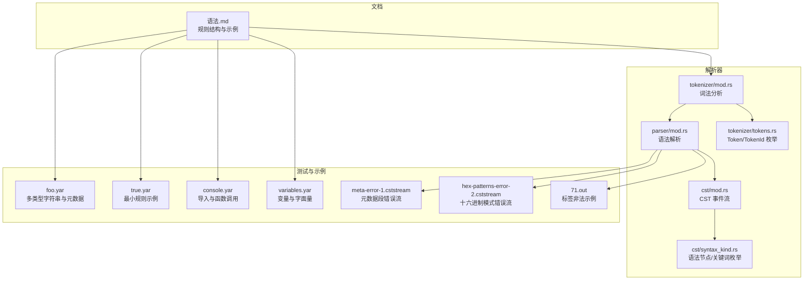
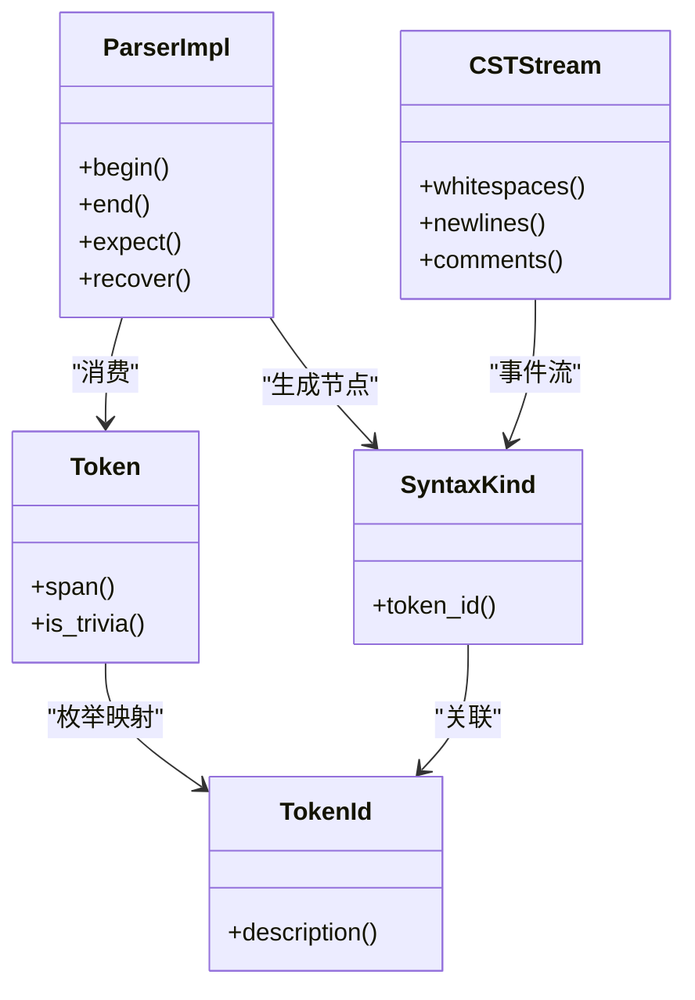
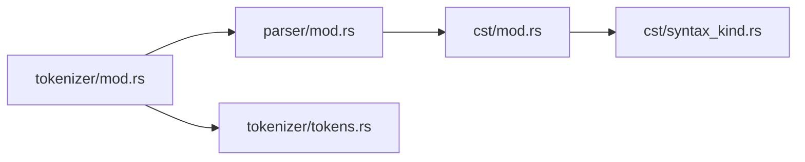

# 规则语法基础

<cite>
**本文引用的文件**
- [语法.md](file://yara-x/site/content/docs/writing_rules/syntax.md)
- [lib.rs](file://yara-x/parser/src/lib.rs)
- [cst/mod.rs](file://yara-x/parser/src/cst/mod.rs)
- [cst/syntax_kind.rs](file://yara-x/parser/src/cst/syntax_kind.rs)
- [tokenizer/mod.rs](file://yara-x/parser/src/tokenizer/mod.rs)
- [tokenizer/tokens.rs](file://yara-x/parser/src/tokenizer/tokens.rs)
- [parser/mod.rs](file://yara-x/parser/src/parser/mod.rs)
- [foo.yar](file://yara-x/cli/src/tests/testdata/foo.yar)
- [true.yar](file://yara-x/cli/src/tests/testdata/true.yar)
- [console.yar](file://yara-x/cli/src/tests/testdata/console.yar)
- [variables.yar](file://yara-x/cli/src/tests/testdata/variables.yar)
- [meta-error-1.cststream](file://yara-x/parser/src/parser/tests/testdata/meta-error-1.cststream)
- [hex-patterns-error-2.cststream](file://yara-x/parser/src/parser/tests/testdata/hex-patterns-error-2.cststream)
- [71.out](file://yara-x/lib/src/compiler/tests/testdata/errors/71.out)
</cite>

## 目录
1. [简介](#简介)
2. [项目结构](#项目结构)
3. [核心组件](#核心组件)
4. [架构总览](#架构总览)
5. [详细组件分析](#详细组件分析)
6. [依赖关系分析](#依赖关系分析)
7. [性能考量](#性能考量)
8. [故障排查指南](#故障排查指南)
9. [结论](#结论)
10. [附录](#附录)

## 简介
本文件面向初学者与规则作者，系统梳理 YARA-X 规则的基本语法与结构，重点覆盖以下方面：
- 规则头部：关键字、标识符、标签
- 元数据部分（meta）：键值对、数据类型与约束
- 字符串部分（strings）：文本、十六进制、正则表达式模式
- 条件部分（condition）：布尔表达式与模式标识符
- 注释与空白处理
- 合法与非法语法示例及错误定位

目标是帮助读者建立对 YARA-X 规则从“词法”到“语法”的完整认知，并提供可直接对照的示例与来源。

## 项目结构
围绕规则语法，本仓库中与解析与文档相关的模块如下：
- 文档层：站点文档提供规则语法与写法规则的高层说明
- 解析层：词法（tokenizer）识别 token；语法（parser）构建 CST/AST；CST 提供精确的语法树表示
- 测试与示例：CLI 测试数据与解析器错误流测试用例，直观展示合法与非法语法



图表来源
- [语法.md:1-143](file://yara-x/site/content/docs/writing_rules/syntax.md#L1-L143)
- [tokenizer/mod.rs:1-817](file://yara-x/parser/src/tokenizer/mod.rs#L1-L817)
- [parser/mod.rs:1-1901](file://yara-x/parser/src/parser/mod.rs#L1-L1901)
- [cst/mod.rs:1-981](file://yara-x/parser/src/cst/mod.rs#L1-L981)
- [cst/syntax_kind.rs:1-385](file://yara-x/parser/src/cst/syntax_kind.rs#L1-L385)
- [tokenizer/tokens.rs:1-449](file://yara-x/parser/src/tokenizer/tokens.rs#L1-L449)
- [foo.yar:1-14](file://yara-x/cli/src/tests/testdata/foo.yar#L1-L14)
- [true.yar:1-1](file://yara-x/cli/src/tests/testdata/true.yar#L1-L1)
- [console.yar:1-7](file://yara-x/cli/src/tests/testdata/console.yar#L1-L7)
- [variables.yar:1-4](file://yara-x/cli/src/tests/testdata/variables.yar#L1-L4)
- [meta-error-1.cststream:1-24](file://yara-x/parser/src/parser/tests/testdata/meta-error-1.cststream#L1-L24)
- [hex-patterns-error-2.cststream:29-59](file://yara-x/parser/src/parser/tests/testdata/hex-patterns-error-2.cststream#L29-L59)
- [71.out:1-5](file://yara-x/lib/src/compiler/tests/testdata/errors/71.out#L1-L5)

章节来源
- [语法.md:1-143](file://yara-x/site/content/docs/writing_rules/syntax.md#L1-L143)
- [lib.rs:1-142](file://yara-x/parser/src/lib.rs#L1-L142)
- [cst/mod.rs:1-981](file://yara-x/parser/src/cst/mod.rs#L1-L981)
- [cst/syntax_kind.rs:1-385](file://yara-x/parser/src/cst/syntax_kind.rs#L1-L385)
- [tokenizer/mod.rs:1-817](file://yara-x/parser/src/tokenizer/mod.rs#L1-L817)
- [tokenizer/tokens.rs:1-449](file://yara-x/parser/src/tokenizer/tokens.rs#L1-L449)
- [parser/mod.rs:1-1901](file://yara-x/parser/src/parser/mod.rs#L1-L1901)

## 核心组件
- 词法分析（Tokenizer）
  - 负责将源码切分为 token，支持普通模式、十六进制模式与跳转模式，以区分同一字符在不同上下文中的含义
  - 识别关键字、标识符、字面量（字符串、整数、浮点、正则）、标点、注释与空白
- 语法解析（Parser）
  - 基于手工实现的 PEG 解析器，生成 CST（事件流），并具备错误容忍能力
  - 支持按需懒加载顶层项（如逐条规则），降低内存占用
- CST（Concrete Syntax Tree）
  - 保留所有细节（含注释、空白），便于格式化、文档生成与精确回溯
  - 通过事件流（Begin/End/Token/Error）描述语法树结构

章节来源
- [tokenizer/mod.rs:22-194](file://yara-x/parser/src/tokenizer/mod.rs#L22-L194)
- [parser/mod.rs:1-120](file://yara-x/parser/src/parser/mod.rs#L1-L120)
- [cst/mod.rs:33-180](file://yara-x/parser/src/cst/mod.rs#L33-L180)

## 架构总览
下图展示了从源码到 CST 的端到端流程，以及关键节点如何映射到语法元素（关键字、标识符、字面量等）。

```mermaid
sequenceDiagram
    participant Src as "源码"
    participant Tok as "词法分析器"
    participant Par as "语法解析器"
    participant CST as "CST 事件流"
    
    Src->>Tok: "输入字节序列"
    Tok->>Par: "产出 Token 序列"
    Par->>CST: "开始事件流 Begin SOURCE_FILE"
    Par->>CST: "Begin RULE_DECL"
    Par->>CST: "Token RULE_KW/IDENT/WHITESPACE/L_BRACE"
    Par->>CST: "Begin META_BLK/STRINGS_BLK/CONDITION_BLK"
    Par->>CST: "Token 关键字/标识符/字面量/标点/注释/空白"
    Par->>CST: "End META_BLK/STRINGS_BLK/CONDITION_BLK"
    Par->>CST: "End RULE_DECL"
    Par->>CST: "结束事件流 End SOURCE_FILE"
```

图表来源
- [parser/mod.rs:230-281](file://yara-x/parser/src/parser/mod.rs#L230-L281)
- [cst/mod.rs:33-80](file://yara-x/parser/src/cst/mod.rs#L33-L80)
- [tokenizer/mod.rs:87-147](file://yara-x/parser/src/tokenizer/mod.rs#L87-L147)

## 详细组件分析

### 规则头部与标识符命名
- 规则头部由关键字“rule”、规则标识符与可选标签组成
- 标识符与标签遵循统一的标识符规范：字母或下划线开头，后续可含字母、数字、下划线；且标签不能以数字开头
- 错误示例：标签使用了非法关键字（如“rule”作为标签）将触发“期望标识符，实际为关键字”的错误

章节来源
- [语法.md:101-125](file://yara-x/site/content/docs/writing_rules/syntax.md#L101-L125)
- [71.out:1-5](file://yara-x/lib/src/compiler/tests/testdata/errors/71.out#L1-L5)

### 元数据部分（meta）
- 位置：可选，位于规则体内部，关键字“meta”
- 结构：键值对列表，键为标识符，值为字符串、整数或布尔字面量
- 多行字符串：自特定版本起支持，适合在规则内直接嵌入长描述
- 注意：meta 中的键值对不可在 condition 中直接使用，仅用于存储规则元信息

章节来源
- [语法.md:62-99](file://yara-x/site/content/docs/writing_rules/syntax.md#L62-L99)
- [foo.yar:2-7](file://yara-x/cli/src/tests/testdata/foo.yar#L2-L7)

### 字符串部分（strings）
- 位置：可选，位于规则体内部，关键字“strings”
- 模式类型：
  - 文本字符串：双引号包裹，支持转义与多行（三引号）
  - 十六进制模式：花括号包裹，允许字节、通配与选择分支
  - 正则表达式：斜杠包裹，支持修饰符
- 模式标识符：以“$”开头的标识符，可在 condition 中引用
- 计数/偏移/长度：以“#”、“@”、“!”开头的特殊标识符，分别对应出现次数、位置与长度

章节来源
- [语法.md:32-50](file://yara-x/site/content/docs/writing_rules/syntax.md#L32-L50)
- [foo.yar:8-12](file://yara-x/cli/src/tests/testdata/foo.yar#L8-L12)
- [cst/syntax_kind.rs:103-108](file://yara-x/parser/src/cst/syntax_kind.rs#L103-L108)

### 条件部分（condition）
- 位置：必须存在
- 内容：布尔表达式，通常由先前定义的模式标识符组合而成
- 运算符与结构：支持逻辑运算（and/or/not/xor）、比较（==、!=、<、<=、>、>=）、集合量词（any/of/none/all/them）、范围/跳转（at）、大小写/编码修饰（ascii/nocase/wide/base64/base64wide/fullword/entrypoint/filesize）等
- 示例：最小规则使用“true”，复杂规则可混合多种模式与修饰

章节来源
- [语法.md:52-60](file://yara-x/site/content/docs/writing_rules/syntax.md#L52-L60)
- [true.yar:1-1](file://yara-x/cli/src/tests/testdata/true.yar#L1-L1)
- [foo.yar:11-12](file://yara-x/cli/src/tests/testdata/foo.yar#L11-L12)

### 注释与空白
- 支持单行与多行 C 风格注释
- 空白与换行在 CST 中被保留，便于格式化与溯源

章节来源
- [语法.md:127-142](file://yara-x/site/content/docs/writing_rules/syntax.md#L127-L142)
- [cst/mod.rs:9-13](file://yara-x/parser/src/cst/mod.rs#L9-L13)

### 词法与语法要点（代码级映射）
- 关键字与标点：由 TokenId 与 SyntaxKind 映射，确保解析时能准确识别
- 字面量：字符串、整数、浮点、正则、十六进制字节等均有独立 token 类型
- 错误处理：解析器在遇到不匹配时产生错误事件，同时尝试恢复继续解析



图表来源
- [tokenizer/tokens.rs:115-211](file://yara-x/parser/src/tokenizer/tokens.rs#L115-L211)
- [cst/syntax_kind.rs:159-277](file://yara-x/parser/src/cst/syntax_kind.rs#L159-L277)
- [parser/mod.rs:286-526](file://yara-x/parser/src/parser/mod.rs#L286-L526)
- [cst/mod.rs:80-145](file://yara-x/parser/src/cst/mod.rs#L80-L145)

## 依赖关系分析
- 词法层依赖 logos 实现高效扫描，并在解析阶段切换模式（普通/十六进制/跳转）
- 语法层基于事件流构建 CST，保留注释与空白，便于下游工具链使用
- CST 与语法节点（SyntaxKind）一一对应，保证解析结果的可追溯性



图表来源
- [tokenizer/mod.rs:57-194](file://yara-x/parser/src/tokenizer/mod.rs#L57-L194)
- [parser/mod.rs:38-91](file://yara-x/parser/src/parser/mod.rs#L38-L91)
- [cst/mod.rs:181-244](file://yara-x/parser/src/cst/mod.rs#L181-L244)
- [cst/syntax_kind.rs:1-151](file://yara-x/parser/src/cst/syntax_kind.rs#L1-L151)
- [tokenizer/tokens.rs:1-113](file://yara-x/parser/src/tokenizer/tokens.rs#L1-L113)

章节来源
- [lib.rs:1-142](file://yara-x/parser/src/lib.rs#L1-L142)
- [tokenizer/mod.rs:1-817](file://yara-x/parser/src/tokenizer/mod.rs#L1-L817)
- [parser/mod.rs:1-1901](file://yara-x/parser/src/parser/mod.rs#L1-L1901)
- [cst/mod.rs:1-981](file://yara-x/parser/src/cst/mod.rs#L1-L981)
- [cst/syntax_kind.rs:1-385](file://yara-x/parser/src/cst/syntax_kind.rs#L1-L385)
- [tokenizer/tokens.rs:1-449](file://yara-x/parser/src/tokenizer/tokens.rs#L1-L449)

## 性能考量
- 懒加载：解析器按顶层项（如逐条规则）逐步产出事件，避免一次性解析全部内容
- 错误容忍：解析器在出错后尝试恢复，减少因单点错误导致的全盘失败
- 缓存与燃料：对失败结果进行缓存，限制解析深度（fuel）以防止极端输入导致长时间占用

章节来源
- [parser/mod.rs:252-281](file://yara-x/parser/src/parser/mod.rs#L252-L281)
- [parser/mod.rs:189-208](file://yara-x/parser/src/parser/mod.rs#L189-L208)

## 故障排查指南
- 元数据段错误
  - 症状：在非 meta 区域出现 meta 关键字，解析器报告“期望 meta/strings/condition，实际为其他”
  - 定位：查看错误流中 Begin(ERROR) 与具体 Token 的 span
- 十六进制模式错误
  - 症状：花括号内的字节、选择或跳转不符合规范，解析器在相应节点产生错误
  - 定位：检查十六进制模式的字节、管道、括号与修饰符
- 标签非法
  - 症状：标签使用了关键字（如“rule”），解析器提示“期望标识符，实际为关键字”
  - 定位：检查规则头的标签列表

章节来源
- [meta-error-1.cststream:10-20](file://yara-x/parser/src/parser/tests/testdata/meta-error-1.cststream#L10-L20)
- [hex-patterns-error-2.cststream:53-59](file://yara-x/parser/src/parser/tests/testdata/hex-patterns-error-2.cststream#L53-L59)
- [71.out:1-5](file://yara-x/lib/src/compiler/tests/testdata/errors/71.out#L1-L5)

## 结论
YARA-X 的规则语法以清晰的结构与严格的词法/语法约束为基础，结合 CST 的精确保留与错误容忍机制，既便于人类编写与阅读，也为自动化工具提供了可靠支撑。通过本文档与示例，建议从最小规则入手，逐步引入 meta、strings 与 condition 的复杂组合，并利用解析器的错误流快速定位问题。

## 附录

### 语法规则速查表（基于解析器实现）
- 关键字与标点
  - 规则与区块：rule、meta、strings、condition、import、include、with、for、of、them、all、any、none、at、of、in、defined、filesize、entrypoint、ascii、nocase、wide、base64、base64wide、fullword、xor、not、and、or、true、false、global、private、startswith、endswith、contains、istartswith、iendswith、icontains、iequals、matches、iequals、xor、with、for、of、them、all、any、none、at、of、in、defined、filesize、entrypoint、ascii、nocase、wide、base64、base64wide、fullword、xor、not、and、or、true、false、global、private
  - 运算符：+, -, *, /, %, &, |, ^, ~, <<, >>, ==, !=, <, <=, >, >=, :, ,, ., (, ), [, ], {, }
- 标识符与模式标识符
  - 普通标识符：字母或下划线开头，后续可含字母、数字、下划线
  - 模式标识符：以“$”开头（如 $foo）
  - 计数/偏移/长度：以“#”、“@”、“!”开头（如 #foo、@bar、!baz）
- 字面量
  - 字符串：双引号或三引号包裹
  - 整数：十进制、十六进制（0x前缀）、八进制（0o前缀），可带单位后缀（如 KB、MB）
  - 浮点：带小数点的数字，可带下划线分隔
  - 正则：斜杠包裹，支持 s/i 等修饰符
  - 十六进制字节：两位十六进制或问号，可带可选波浪号前缀
- 注释与空白
  - 单行注释：//
  - 多行注释：/* ... */
  - 空白与换行在 CST 中保留

章节来源
- [cst/syntax_kind.rs:7-151](file://yara-x/parser/src/cst/syntax_kind.rs#L7-L151)
- [tokenizer/mod.rs:248-555](file://yara-x/parser/src/tokenizer/mod.rs#L248-L555)
- [tokenizer/tokens.rs:115-211](file://yara-x/parser/src/tokenizer/tokens.rs#L115-L211)

### 合法与非法示例索引
- 合法示例
  - 最小规则：[true.yar:1-1](file://yara-x/cli/src/tests/testdata/true.yar#L1-L1)
  - 多类型字符串与元数据：[foo.yar:1-14](file://yara-x/cli/src/tests/testdata/foo.yar#L1-L14)
  - 导入模块与函数调用：[console.yar:1-7](file://yara-x/cli/src/tests/testdata/console.yar#L1-L7)
  - 变量与字面量组合：[variables.yar:1-4](file://yara-x/cli/src/tests/testdata/variables.yar#L1-L4)
- 非法示例
  - 标签使用关键字：[71.out:1-5](file://yara-x/lib/src/compiler/tests/testdata/errors/71.out#L1-L5)
  - 元数据段位置错误：[meta-error-1.cststream:10-20](file://yara-x/parser/src/parser/tests/testdata/meta-error-1.cststream#L10-L20)
  - 十六进制模式错误：[hex-patterns-error-2.cststream:53-59](file://yara-x/parser/src/parser/tests/testdata/hex-patterns-error-2.cststream#L53-L59)