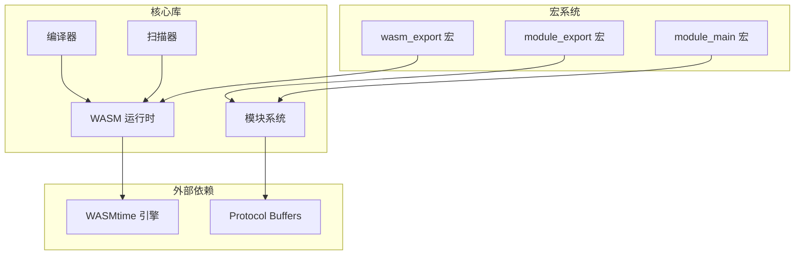
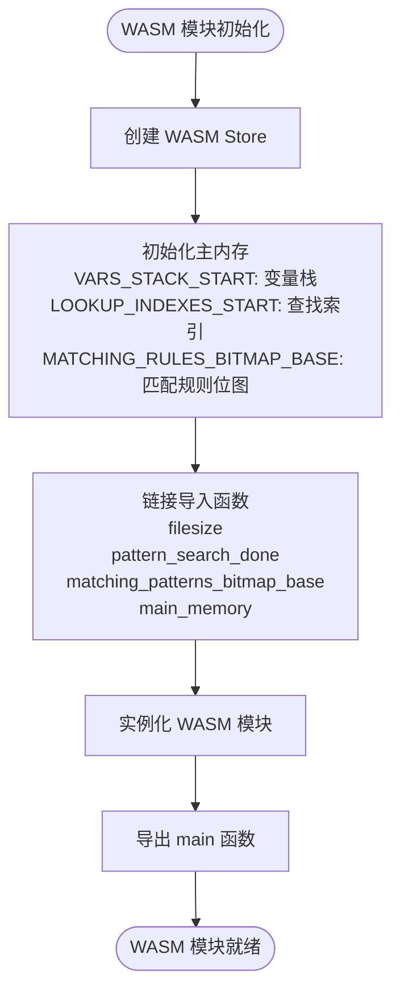
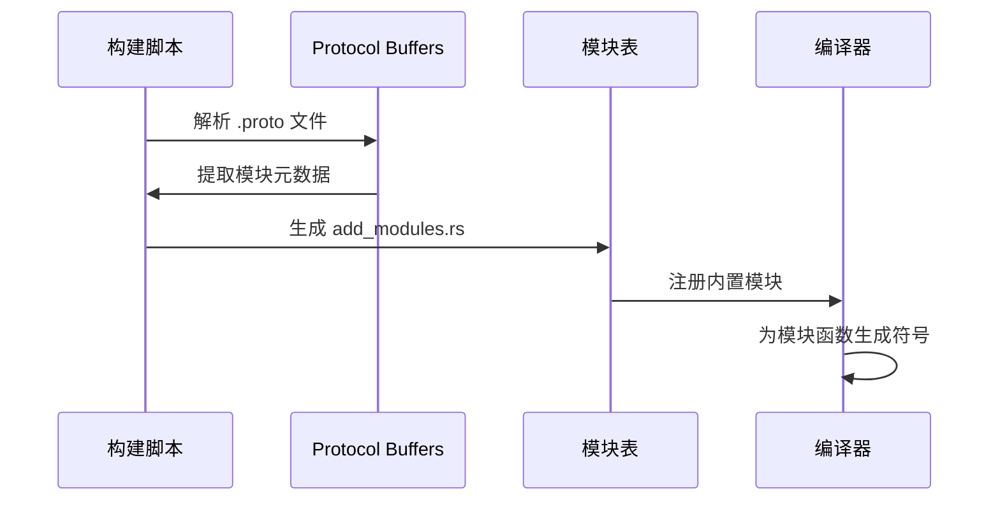
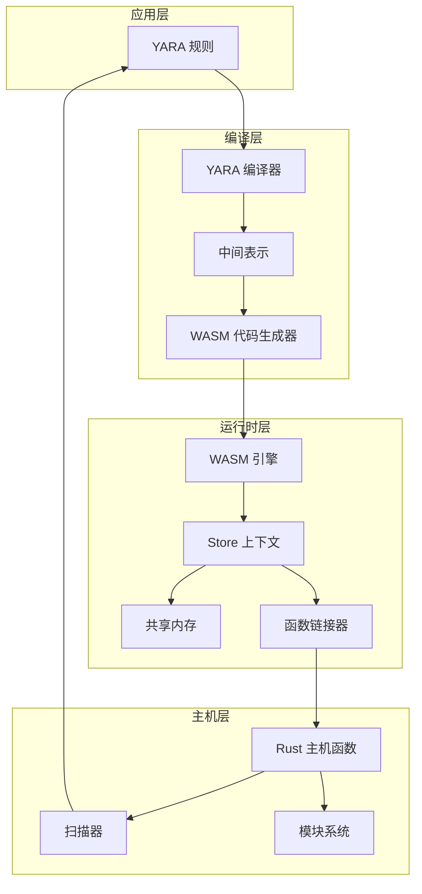
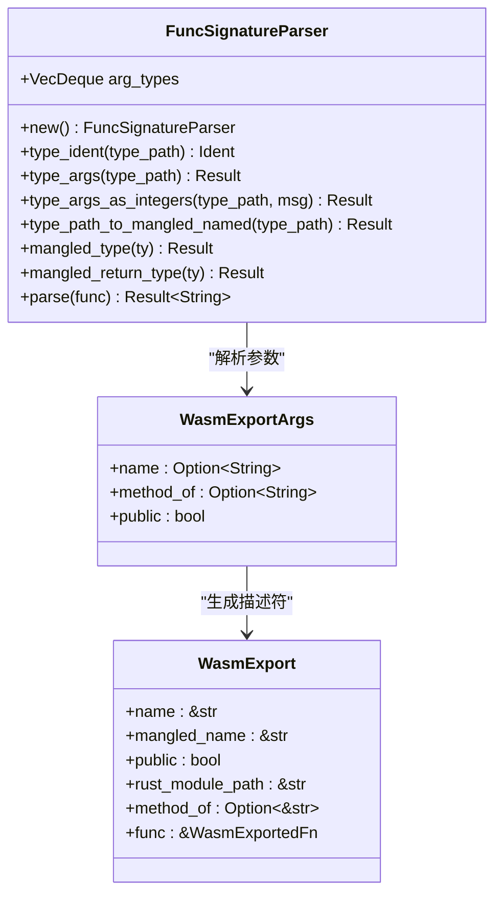
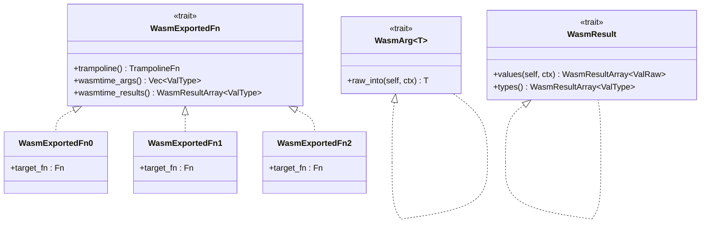
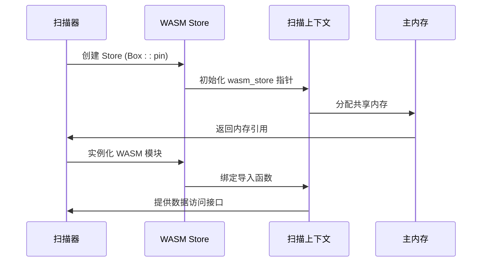
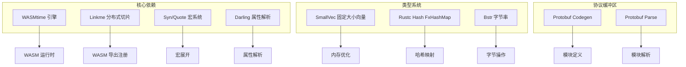
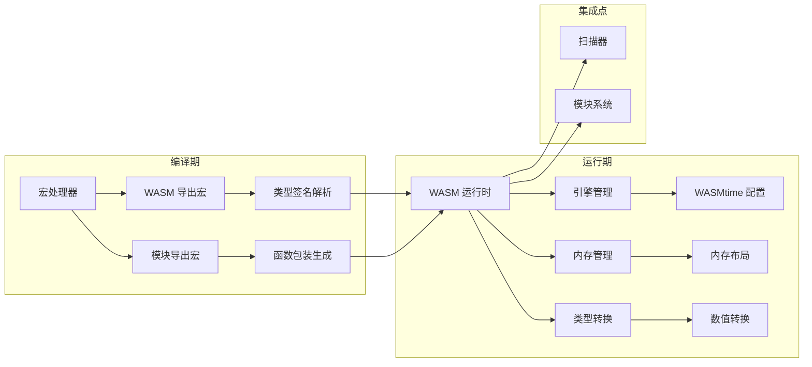
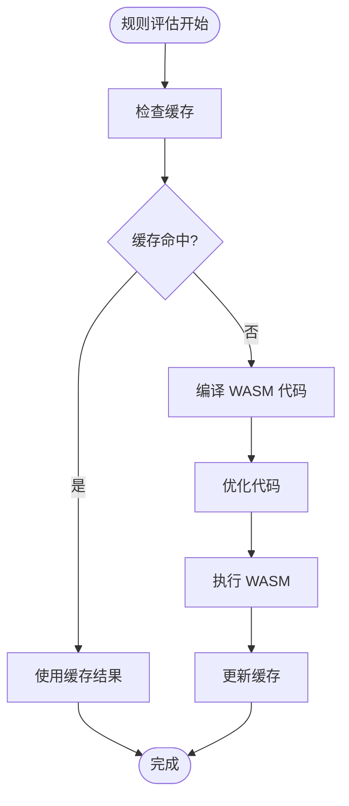

# WASM 集成指南

<cite>
**本文档引用的文件**
- [wasm_export.rs](file://yara-x/macros/src/wasm_export.rs)
- [lib.rs（宏）](file://yara-x/macros/src/lib.rs)
- [lib.rs（模块导出）](file://yara-x/macros/src/module_export.rs)
- [lib.rs（核心库）](file://yara-x/lib/src/lib.rs)
- [mod.rs（模块系统）](file://yara-x/lib/src/modules/mod.rs)
- [mod.rs（WASM 运行时）](file://yara-x/lib/src/wasm/mod.rs)
- [context.rs（扫描上下文）](file://yara-x/lib/src/scanner/context.rs)
- [mod.rs（编译器）](file://yara-x/lib/src/compiler/mod.rs)
- [rules.rs（规则编译）](file://yara-x/lib/src/compiler/rules.rs)
- [emit.rs（代码生成）](file://yara-x/lib/src/compiler/emit.rs)
- [build.rs（构建脚本）](file://yara-x/lib/build.rs)
</cite>

## 目录
1. [简介](#简介)
2. [项目结构](#项目结构)
3. [核心组件](#核心组件)
4. [架构概览](#架构概览)
5. [详细组件分析](#详细组件分析)
6. [依赖关系分析](#依赖关系分析)
7. [性能考虑](#性能考虑)
8. [故障排除指南](#故障排除指南)
9. [结论](#结论)

## 简介

YARA-X 是一个完全用 Rust 重写的 YARA 编译器和扫描器，实现了 99% 的现有 YARA 规则兼容性。该项目的核心创新之一是集成了 WebAssembly (WASM) 技术，通过将 YARA 规则条件转换为 WASM 代码并在嵌入式 WASM 运行时中执行，实现了更安全、更高效的 YARA 实现。

WASM 集成使得 YARA-X 能够：
- 将每个 YARA 规则的条件编译为独立的 WASM 模块
- 在 WASM 模块中调用 Rust 函数进行数据访问和处理
- 通过共享内存和全局变量在 WASM 和 Rust 之间传递信息
- 利用 WASM 的沙箱环境提高安全性

## 项目结构

YARA-X 的 WASM 集成涉及多个关键模块：



**图表来源**
- [wasm_export.rs:1-415](file://yara-x/macros/src/wasm_export.rs#L1-L415)
- [lib.rs（宏）:197-230](file://yara-x/macros/src/lib.rs#L197-L230)
- [lib.rs（模块导出）:91-111](file://yara-x/macros/src/module_export.rs#L91-L111)
- [mod.rs（WASM 运行时）:1-800](file://yara-x/lib/src/wasm/mod.rs#L1-L800)

**章节来源**
- [lib.rs（核心库）:1-178](file://yara-x/lib/src/lib.rs#L1-L178)
- [mod.rs（模块系统）:1-317](file://yara-x/lib/src/modules/mod.rs#L1-L317)

## 核心组件

### WASM 导出宏系统

WASM 导出宏系统是 YARA-X WASM 集成的核心，提供了类型安全的函数导出机制。

#### 主要特性

1. **类型安全的函数签名解析**
   - 自动解析函数参数和返回类型的 mangled 名称
   - 支持基本类型：i32, i64, f32, f64, bool
   - 支持复杂类型：RuntimeString, Struct, Array, Map
   - 支持泛型类型：Option<T>, RangedInteger<MIN, MAX>

2. **自动注册机制**
   - 使用 `#[distributed_slice]` 自动收集所有导出函数
   - 生成唯一的 mangled 函数名称
   - 支持方法重载和公共函数标识

3. **编译时验证**
   - 验证第一个参数必须是 `&mut Caller<'_, ScanContext>`
   - 检查支持的参数类型
   - 确保函数签名符合 WASM 调用约定

**章节来源**
- [wasm_export.rs:170-319](file://yara-x/macros/src/wasm_export.rs#L170-L319)
- [lib.rs（宏）:218-230](file://yara-x/macros/src/lib.rs#L218-L230)

### WASM 运行时系统

WASM 运行时系统负责管理 WASM 模块的生命周期和与 Rust 代码的交互。

#### 内存管理



**图表来源**
- [context.rs（扫描上下文）:1872-1917](file://yara-x/lib/src/scanner/context.rs#L1872-L1917)

#### 关键组件

1. **内存布局设计**
   - 变量未定义标志位图（前 256 字节）
   - 变量栈区域（VARS_STACK_START 开始）
   - 查找索引区域（LOOKUP_INDEXES_START 开始）
   - 匹配规则位图区域（MATCHING_RULES_BITMAP_BASE 开始）

2. **引擎配置**
   - Cranelift 优化级别：SpeedAndSize
   - 内存限制：16MB（避免 4GB 默认限制）
   - 禁用原生堆栈展开信息（musl 平台）
   - 启用时间中断以防止无限循环

**章节来源**
- [mod.rs（WASM 运行时）:110-135](file://yara-x/lib/src/wasm/mod.rs#L110-L135)
- [mod.rs（WASM 运行时）:715-753](file://yara-x/lib/src/wasm/mod.rs#L715-L753)

### 模块系统集成

YARA-X 的模块系统通过 Protocol Buffers 定义模块接口，并自动生成相应的 Rust 代码。

#### 模块发现机制



**图表来源**
- [build.rs（构建脚本）:144-256](file://yara-x/lib/build.rs#L144-L256)
- [mod.rs（模块系统）:124-142](file://yara-x/lib/src/modules/mod.rs#L124-L142)

**章节来源**
- [mod.rs（模块系统）:67-99](file://yara-x/lib/src/modules/mod.rs#L67-L99)

## 架构概览

YARA-X 的 WASM 集成采用分层架构设计，确保了模块化和可扩展性。



**图表来源**
- [mod.rs（编译器）:765-1873](file://yara-x/lib/src/compiler/mod.rs#L765-L1873)
- [mod.rs（WASM 运行时）:800-1609](file://yara-x/lib/src/wasm/mod.rs#L800-L1609)

## 详细组件分析

### WASM 导出宏实现

#### 函数签名解析器

函数签名解析器是 WASM 导出宏的核心组件，负责将 Rust 函数签名转换为 WASM 兼容的 mangled 名称。



**图表来源**
- [wasm_export.rs:18-216](file://yara-x/macros/src/wasm_export.rs#L18-L216)
- [wasm_export.rs:218-225](file://yara-x/macros/src/wasm_export.rs#L218-L225)
- [wasm_export.rs:138-158](file://yara-x/macros/src/wasm_export.rs#L138-L158)

#### 类型转换系统

WASM 运行时系统提供了完整的类型转换机制，支持从 WASM 原始值到 Rust 类型的转换。



**图表来源**
- [mod.rs（WASM 运行时）:275-402](file://yara-x/lib/src/wasm/mod.rs#L275-L402)
- [mod.rs（WASM 运行时）:609-686](file://yara-x/lib/src/wasm/mod.rs#L609-L686)

**章节来源**
- [wasm_export.rs:261-319](file://yara-x/macros/src/wasm_export.rs#L261-L319)
- [mod.rs（WASM 运行时）:233-274](file://yara-x/lib/src/wasm/mod.rs#L233-L274)

### 模块导出宏

模块导出宏简化了模块函数的导出过程，自动生成必要的包装函数。

#### 自动生成流程

```mermaid
flowchart LR
Input[模块函数定义] --> Parse[解析函数签名]
Parse --> Validate[验证参数类型]
Validate --> Generate[生成包装函数]
Generate --> Export[添加 #[wasm_export] 属性]
Export --> Register[自动注册到 WASM_EXPORTS]
Register --> Output[编译后的函数]
```

**图表来源**
- [lib.rs（模块导出）:91-111](file://yara-x/macros/src/module_export.rs#L91-L111)

**章节来源**
- [lib.rs（模块导出）:91-111](file://yara-x/macros/src/module_export.rs#L91-L111)

### 扫描上下文管理

扫描上下文是 WASM 和 Rust 之间的桥梁，负责管理两者之间的状态同步。

#### 内存安全设计



**图表来源**
- [context.rs（扫描上下文）:1808-1830](file://yara-x/lib/src/scanner/context.rs#L1808-L1830)

**章节来源**
- [context.rs（扫描上下文）:1808-1917](file://yara-x/lib/src/scanner/context.rs#L1808-L1917)

## 依赖关系分析

### 外部依赖

YARA-X 的 WASM 集成主要依赖以下外部库：



**图表来源**
- [mod.rs（WASM 运行时）:89-104](file://yara-x/lib/src/wasm/mod.rs#L89-L104)
- [lib.rs（宏）:1-15](file://yara-x/macros/src/lib.rs#L1-L15)

### 内部模块依赖



**图表来源**
- [mod.rs（WASM 运行时）:134-158](file://yara-x/lib/src/wasm/mod.rs#L134-L158)
- [mod.rs（模块系统）:16-27](file://yara-x/lib/src/modules/mod.rs#L16-L27)

**章节来源**
- [lib.rs（核心库）:48-72](file://yara-x/lib/src/lib.rs#L48-L72)

## 性能考虑

### 内存优化策略

1. **内存限制配置**
   - 默认内存限制：16MB，避免 4GB 默认限制
   - 禁用内存增长以减少虚拟地址空间占用
   - 固定内存基址以启用静态优化

2. **变量栈管理**
   - 最大变量数量：2048 个
   - 每个变量占用 8 字节（64 位对齐）
   - 未定义标志位图：每 8 字节容纳 64 个变量的标志

3. **缓存机制**
   - 正则表达式缓存
   - 模块输出缓存
   - 符号表缓存

### 执行效率优化



**图表来源**
- [mod.rs（WASM 运行时）:715-753](file://yara-x/lib/src/wasm/mod.rs#L715-L753)

**章节来源**
- [emit.rs（代码生成）:2480-2517](file://yara-x/lib/src/compiler/emit.rs#L2480-L2517)

### 并发安全设计

1. **线程安全保证**
   - 所有共享数据使用 `Sync` 特征
   - 使用 `LazyLock` 进行延迟初始化
   - 避免跨线程的数据竞争

2. **资源管理**
   - 引擎生命周期管理
   - 模块内存清理
   - 存储上下文的正确释放

## 故障排除指南

### 常见问题及解决方案

#### 1. 函数签名错误

**问题症状：**
- 编译时出现类型不匹配错误
- WASM 导出函数无法被识别

**解决方案：**
- 确保第一个参数是 `&mut Caller<'_, ScanContext>`
- 使用支持的参数类型：i32, i64, f32, f64, bool, RuntimeString
- 检查泛型参数的约束条件

**章节来源**
- [wasm_export.rs:190-197](file://yara-x/macros/src/wasm_export.rs#L190-L197)

#### 2. 内存溢出问题

**问题症状：**
- 变量栈溢出错误
- 内存不足异常

**解决方案：**
- 检查变量使用情况，避免超出 2048 个变量限制
- 优化规则逻辑，减少不必要的变量创建
- 使用适当的内存管理策略

**章节来源**
- [mod.rs（WASM 运行时）:110-118](file://yara-x/lib/src/wasm/mod.rs#L110-L118)

#### 3. 模块加载失败

**问题症状：**
- 模块无法找到或加载
- Protocol Buffers 描述符错误

**解决方案：**
- 检查 `.proto` 文件中的模块选项配置
- 确认 `yara.module_options` 设置正确
- 验证模块名称和根消息类型的一致性

**章节来源**
- [build.rs（构建脚本）:13-45](file://yara-x/lib/build.rs#L13-L45)

#### 4. 引擎初始化问题

**问题症状：**
- WASM 引擎无法初始化
- 内存分配失败

**解决方案：**
- 检查平台兼容性（特别是 musl 环境）
- 确认有足够的系统内存
- 验证虚拟地址空间限制

**章节来源**
- [mod.rs（WASM 运行时）:715-753](file://yara-x/lib/src/wasm/mod.rs#L715-L753)

### 调试技巧

1. **启用详细日志**
   - 使用 `RUST_LOG` 环境变量设置日志级别
   - 监控 WASM 模块构建时间
   - 跟踪内存使用情况

2. **性能分析**
   - 使用 `rules-profiling` 功能
   - 分析变量栈使用情况
   - 监控正则表达式匹配性能

3. **内存诊断**
   - 检查内存布局是否正确
   - 验证变量对齐要求
   - 监控缓存命中率

## 结论

YARA-X 的 WASM 集成提供了一个强大而灵活的框架，将传统 YARA 规则引擎现代化。通过精心设计的宏系统、内存管理和类型转换机制，该系统实现了高性能、类型安全和易于使用的 WASM 集成。

### 主要优势

1. **类型安全**：编译时验证确保函数签名正确
2. **高性能**：直接的 WASM 执行和优化的内存布局
3. **易用性**：简化的宏接口，自动化的函数导出
4. **可扩展性**：模块化设计支持新的模块和功能

### 未来发展方向

1. **进一步优化内存使用**
2. **增强错误报告机制**
3. **改进调试工具**
4. **支持更多的 WASM 特性**

这个 WASM 集成指南为开发者提供了完整的技术参考，帮助理解和使用 YARA-X 中的 WASM 集成功能。