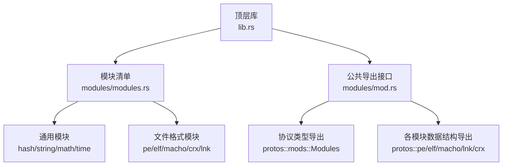
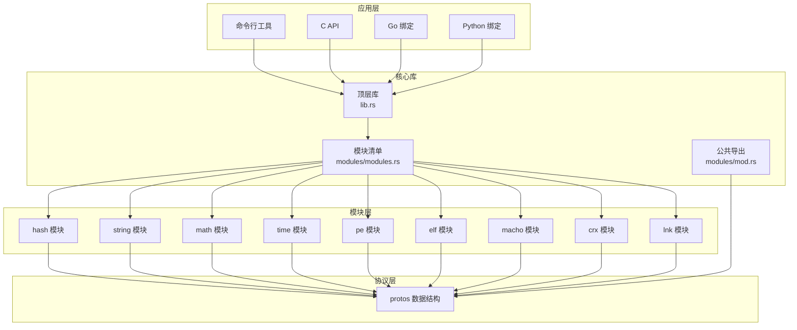
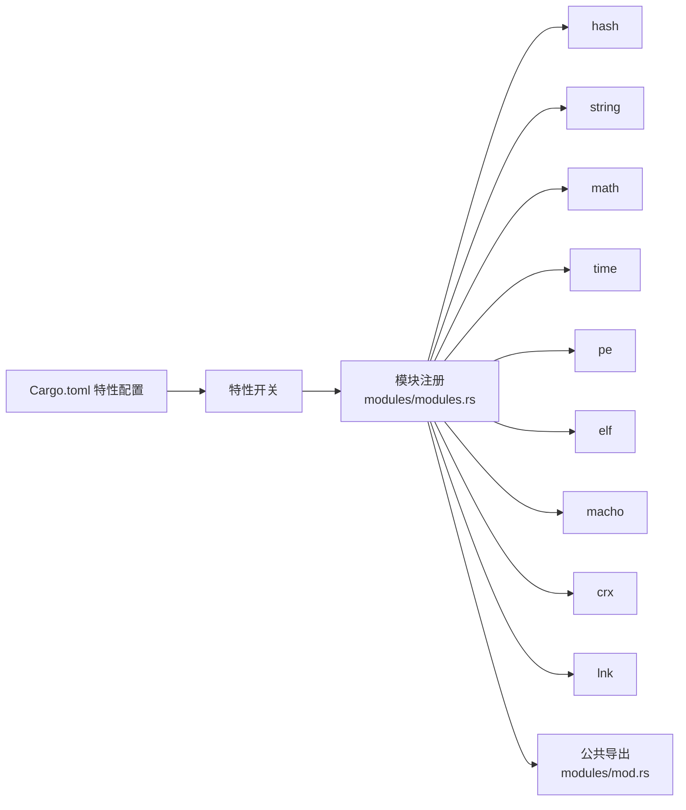

# 内置模块详解

<cite>
**本文引用的文件**
- [modules.rs](file://yara-x/lib/src/modules/modules.rs)
- [mod.rs](file://yara-x/lib/src/modules/mod.rs)
- [lib.rs](file://yara-x/lib/src/lib.rs)
- [Cargo.toml](file://yara-x/Cargo.toml)
- [hash.md](file://yara-x/site/content/docs/modules/hash.md)
- [string.md](file://yara-x/site/content/docs/modules/string.md)
- [math.md](file://yara-x/site/content/docs/modules/math.md)
- [time.md](file://yara-x/site/content/docs/modules/time.md)
- [pe.md](file://yara-x/site/content/docs/modules/pe.md)
- [elf.md](file://yara-x/site/content/docs/modules/elf.md)
- [macho.md](file://yara-x/site/content/docs/modules/macho.md)
- [crx.md](file://yara-x/site/content/docs/modules/crx.md)
- [lnk.md](file://yara-x/site/content/docs/modules/lnk.md)
</cite>

## 目录
1. [简介](#简介)
2. [项目结构](#项目结构)
3. [核心组件](#核心组件)
4. [架构总览](#架构总览)
5. [详细组件分析](#详细组件分析)
6. [依赖分析](#依赖分析)
7. [性能考虑](#性能考虑)
8. [故障排除指南](#故障排除指南)
9. [结论](#结论)
10. [附录](#附录)

## 简介
本文件为 yara-x 内置模块的完整参考文档，覆盖通用功能模块（如 hash、string、math、time）与文件格式解析模块（pe、elf、macho、crx、lnk）。文档从系统架构、模块组织、数据流与处理逻辑出发，结合官方站点文档，给出每个模块的功能定位、接口概览、使用建议、实现原理与性能特征，并提供最佳实践与常见陷阱提示。

## 项目结构
yara-x 的模块以“按功能分组”的方式组织在 lib/src/modules 下，通过统一入口导出并在运行时按需启用相应特性（feature）来加载对应模块。模块注册与导出由模块清单与公共接口层负责，最终在顶层库中聚合暴露给上层调用方。

图表来源
- [modules.rs:1-35](file://yara-x/lib/src/modules/modules.rs#L1-L35)
- [mod.rs:182-219](file://yara-x/lib/src/modules/mod.rs#L182-L219)
- [lib.rs](file://yara-x/lib/src/lib.rs)

章节来源
- [modules.rs:1-35](file://yara-x/lib/src/modules/modules.rs#L1-L35)
- [mod.rs:182-219](file://yara-x/lib/src/modules/mod.rs#L182-L219)
- [lib.rs](file://yara-x/lib/src/lib.rs)

## 核心组件
- 模块注册与启用：通过特性开关控制模块编译与加载，避免不必要的依赖与二进制体积。
- 统一数据导出：各模块解析结果通过 protos 中的结构体序列化，再由 modules/mod.rs 聚合导出到上层。
- 运行时访问：顶层库将模块能力暴露给 C API、CLI、Go、Python 等多语言绑定。

章节来源
- [modules.rs:1-35](file://yara-x/lib/src/modules/modules.rs#L1-L35)
- [mod.rs:182-219](file://yara-x/lib/src/modules/mod.rs#L182-L219)
- [lib.rs](file://yara-x/lib/src/lib.rs)

## 架构总览
下图展示模块在系统中的位置与交互关系：顶层库负责聚合与导出；模块清单决定启用哪些模块；各模块解析输入后产出结构化数据并通过 protos 暴露；最终由上层应用或规则引擎消费。

图表来源
- [modules.rs:1-35](file://yara-x/lib/src/modules/modules.rs#L1-L35)
- [mod.rs:182-219](file://yara-x/lib/src/modules/mod.rs#L182-L219)
- [lib.rs](file://yara-x/lib/src/lib.rs)

## 详细组件分析

### hash 模块
- 功能概述：提供多种哈希算法的计算能力，用于规则中快速生成内容摘要，辅助匹配与去重。
- 接口要点：通常提供函数式接口，接收字节切片或字符串输入，返回十六进制或二进制形式的摘要值。
- 使用场景：在规则中对文件片段进行哈希比对、构建索引或验证完整性。
- 实现原理：基于底层加密库实现，内部采用分块读取与增量更新策略，避免一次性加载大文件导致内存峰值过高。
- 性能特征：时间复杂度近似 O(n)，空间复杂度 O(1) 额外缓冲；支持流式处理，适合大文件。
- 最佳实践：
  - 对超大文件优先使用流式接口，避免一次性读入内存。
  - 在规则中缓存中间结果，减少重复计算。
- 常见陷阱：
  - 忽略大小写或编码差异导致的哈希不一致。
  - 将二进制摘要错误地当作字符串处理。

章节来源
- [hash.md](file://yara-x/site/content/docs/modules/hash.md)

### string 模块
- 功能概述：提供字符串处理与格式化能力，包括编码转换、大小写处理、正则匹配等。
- 接口要点：提供字符串清洗、查找替换、编码转换等函数，常与模式匹配结合使用。
- 使用场景：规范化文本输入、提取特定字段、预处理规则条件。
- 实现原理：封装常用字符串操作，内部可能使用 UTF-8 安全转换与惰性求值策略。
- 性能特征：字符串操作通常为 O(n)；注意避免在热路径中进行昂贵的正则匹配。
- 最佳实践：
  - 优先使用预编译的正则表达式对象。
  - 对重复出现的字符串操作进行缓存。
- 常见陷阱：
  - 错误处理非 ASCII 文本导致的截断或异常。
  - 正则回溯导致的性能退化。

章节来源
- [string.md](file://yara-x/site/content/docs/modules/string.md)

### math 模块
- 功能概述：提供数学运算与统计能力，如取整、取模、范围判断、统计汇总等。
- 接口要点：数值型输入输出，支持整数与浮点数混合运算。
- 使用场景：规则中进行数值比较、阈值判断、统计分析。
- 实现原理：基于标准数学库，内部进行类型安全转换与溢出检测。
- 性能特征：算术运算为 O(1)；统计类函数通常为 O(n)。
- 最佳实践：
  - 明确数据类型，避免隐式转换带来的精度损失。
  - 在批量统计时尽量一次遍历完成。
- 常见陷阱：
  - 浮点数比较时的精度误差。
  - 除零或取模零导致的异常。

章节来源
- [math.md](file://yara-x/site/content/docs/modules/math.md)

### time 模块
- 功能概述：提供时间解析、格式化与比较能力，支持多种时间格式与时区处理。
- 接口要点：输入可为字符串或数值时间戳，输出标准化的时间表示。
- 使用场景：规则中对时间戳进行匹配、排序与过滤。
- 实现原理：解析器遵循常见时间格式规范，内部进行时区转换与合法性校验。
- 性能特征：解析与格式化为 O(n)；建议缓存常用格式。
- 最佳实践：
  - 固定输出格式，确保规则一致性。
  - 处理跨时区场景时明确目标时区。
- 常见陷阱：
  - 闰秒、夏令时切换导致的时间偏移。
  - 输入格式不一致引发的解析失败。

章节来源
- [time.md](file://yara-x/site/content/docs/modules/time.md)

### pe 模块
- 功能概述：解析 Windows PE 文件，提取头信息、导入表、资源、版本信息等结构化数据。
- 接口要点：返回 PE 结构体，包含文件头、节表、导入/导出表、调试信息等字段。
- 使用场景：识别恶意样本、提取元数据、构建签名数据库。
- 实现原理：按 PE 规范解析 DOS 头、NT 头、目录与节表，支持 32/64 位与扩展头。
- 性能特征：线性扫描，时间复杂度 O(n)；内存占用与文件大小线性相关。
- 最佳实践：
  - 优先检查魔数与长度，避免无效输入。
  - 分段读取关键目录，减少不必要的解析。
- 常见陷阱：
  - 打包器或加壳导致的结构偏移。
  - 节表项缺失或损坏引发的解析中断。

章节来源
- [pe.md](file://yara-x/site/content/docs/modules/pe.md)

### elf 模块
- 功能概述：解析 Linux/Unix ELF 文件，提取程序头、节头、符号表、动态信息等。
- 接口要点：返回 ELF 结构体，包含头部、段表、节表、符号与重定位信息。
- 使用场景：二进制分析、漏洞挖掘、兼容性检查。
- 实现原理：遵循 ELF 规范，支持 32/64 位、大端小端与扩展头。
- 性能特征：线性解析，时间复杂度 O(n)；大文件建议分步解析。
- 最佳实践：
  - 先验证魔数与架构字段，再进入具体解析。
  - 注意稀疏映射与压缩节的处理。
- 常见陷阱：
  - 自引用节表与交叉引用导致的无限循环。
  - 特殊节（如 note）格式变化引发的解析失败。

章节来源
- [elf.md](file://yara-x/site/content/docs/modules/elf.md)

### macho 模块
- 功能概述：解析 macOS/iOS Mach-O 文件，支持单架构与多架构（Fat）二进制，提取载入命令、符号表、代码签名等。
- 接口要点：返回 Macho 结构体，包含头信息、入口点、栈大小、符号表与动态链接器等。
- 使用场景：移动平台样本分析、代码签名验证、逆向工程。
- 实现原理：解析 Mach-O 头与载入命令序列，支持嵌套 Fat 头与 BER 编码的签名块。
- 性能特征：线性扫描，时间复杂度 O(n)；Fat 二进制需递归解析每一份。
- 最佳实践：
  - 先判断是否为 Fat 二进制，再选择目标架构。
  - 解析签名前先校验 BER 序列合法性。
- 常见陷阱：
  - 载入命令顺序与版本差异导致的字段缺失。
  - 代码签名链路复杂，需逐级验证证书链。

章节来源
- [macho.md](file://yara-x/site/content/docs/modules/macho.md)

### crx 模块
- 功能概述：解析 Chrome 扩展包（CRX），提取版本、头部大小、扩展 ID、清单与签名信息。
- 接口要点：返回 Crx 结构体，包含版本号、头部长度、扩展 ID、manifest 与签名集合。
- 使用场景：扩展包静态分析、签名验证、本地化资源提取。
- 实现原理：支持 CRXv2 与 CRXv3，解析 ZIP 包与 Protobuf 头部，提取签名证明链。
- 性能特征：ZIP 解压与 Protobuf 解析，时间复杂度 O(n)；v3 需要额外的证书链验证。
- 最佳实践：
  - v3 场景优先验证 SHA256+RSA 签名。
  - 提取本地化资源时注意区域语言与编码。
- 常见陷阱：
  - 头部字段缺失或格式错误导致解析失败。
  - 证书链验证失败但业务逻辑忽略。

章节来源
- [crx.md](file://yara-x/site/content/docs/modules/crx.md)

### lnk 模块
- 功能概述：解析 Windows 快捷方式（LNK）文件，提取目标路径、工作目录、命令行参数、图标索引等。
- 接口要点：返回 Lnk 结构体，包含基本信息、环境变量块、图标索引与自定义字段。
- 使用场景：钓鱼样本分析、启动行为追踪、取证溯源。
- 实现原理：解析 LNK 头部与可选块，支持 Unicode 字段与环境变量扩展。
- 性能特征：线性解析，时间复杂度 O(n)；注意可选块的跳转与边界。
- 最佳实践：
  - 优先提取目标路径与参数，再处理图标与描述。
  - 处理相对路径时结合工作目录进行还原。
- 常见陷阱：
  - 环境变量未展开导致路径不准确。
  - 可选块缺失或顺序异常引发解析中断。

章节来源
- [lnk.md](file://yara-x/site/content/docs/modules/lnk.md)

## 依赖分析
- 特性驱动加载：模块通过 Cargo 特性开关启用，避免无关模块参与编译与运行。
- 协议层解耦：各模块解析结果统一映射到 protos 结构，降低上层耦合。
- 导出层聚合：modules/mod.rs 将各模块的数据结构与聚合容器导出，便于上层统一访问。

图表来源
- [Cargo.toml](file://yara-x/Cargo.toml)
- [modules.rs:1-35](file://yara-x/lib/src/modules/modules.rs#L1-L35)
- [mod.rs:182-219](file://yara-x/lib/src/modules/mod.rs#L182-L219)

章节来源
- [Cargo.toml](file://yara-x/Cargo.toml)
- [modules.rs:1-35](file://yara-x/lib/src/modules/modules.rs#L1-L35)
- [mod.rs:182-219](file://yara-x/lib/src/modules/mod.rs#L182-L219)

## 性能考虑
- I/O 与内存
  - 大文件解析建议采用流式读取与分块处理，避免一次性加载至内存。
  - 对频繁访问的字段进行缓存，减少重复解析成本。
- 计算复杂度
  - 哈希与字符串处理为线性复杂度；正则与时间解析需注意回溯与格式多样性。
  - 数学与时间模块为常数或线性复杂度，注意数值稳定性与精度。
- 并发与线程安全
  - 模块解析通常为纯函数式操作，可在多线程环境下并行处理不同文件。
  - 注意共享状态与全局配置的并发访问控制。
- 输出与序列化
  - protos 结构体序列化开销较低，建议在需要跨语言或跨进程传递时使用。

## 故障排除指南
- 常见错误类型
  - 格式不匹配：魔数、长度或字段缺失导致解析失败。
  - 编码问题：非 UTF-8 文本或未知编码引发异常。
  - 时间格式：不支持的日期格式或时区表示。
  - 正则回溯：复杂正则导致的性能退化。
- 定位与修复
  - 优先检查输入合法性与版本兼容性。
  - 使用最小复现样例逐步缩小问题范围。
  - 对于正则与时间解析，提供预编译对象与固定格式。
- 建议的日志与诊断
  - 记录输入文件的大小、类型与关键字段摘要。
  - 在模块边界处输出 protos 结构体的关键字段，便于对比与调试。

## 结论
yara-x 的内置模块以清晰的职责划分与协议化输出实现了高内聚、低耦合的文件解析体系。通过特性开关与统一导出机制，既保证了灵活性，又兼顾了性能与可维护性。建议在实际使用中结合最佳实践与故障排除流程，充分发挥模块能力并规避常见陷阱。

## 附录
- 相关文档
  - 官方模块文档：hash、string、math、time、pe、elf、macho、crx、lnk
- 示例与测试
  - 各模块在站点文档中提供了使用示例与注意事项，建议结合示例进行实操验证。